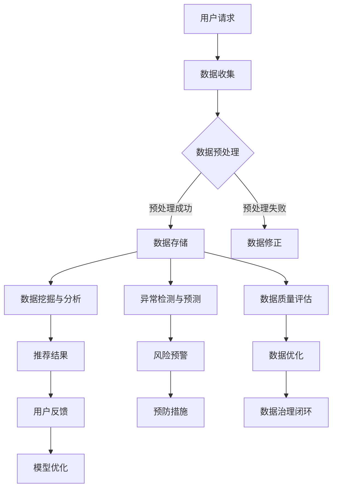

                 

作者：禅与计算机程序设计艺术 / Zen and the Art of Computer Programming

## 摘要

本文旨在探讨如何利用AI大模型提升电商搜索推荐业务的数据治理能力。我们将详细阐述数据治理的概念、重要性以及AI大模型在其中的应用，并介绍一种新的评估模型，用于量化电商搜索推荐业务的数据治理效果。文章结构如下：首先，我们将简要介绍电商搜索推荐业务和数据治理的背景；然后，深入探讨AI大模型在数据治理中的应用及其原理；接着，详细描述我们所提出的评估模型，包括数学模型和具体操作步骤；之后，通过实际项目实践展示模型的应用效果；最后，讨论该模型在电商搜索推荐业务中的实际应用场景以及未来展望。

## 1. 背景介绍

### 1.1 电商搜索推荐业务概述

电商搜索推荐业务是电子商务领域的重要组成部分。随着互联网技术的飞速发展，电商行业面临着海量的商品信息以及日益增长的消费者需求。有效的搜索推荐系统能够帮助消费者快速找到他们需要的商品，提高购买转化率，从而提升电商平台的竞争力。

电商搜索推荐系统通常包括三个关键模块：搜索模块、推荐模块和用户行为分析模块。搜索模块负责处理用户的搜索请求，将搜索结果以合理的排序呈现给用户；推荐模块根据用户的浏览历史、购买记录等行为数据，预测用户可能感兴趣的商品，提供个性化的推荐；用户行为分析模块则负责收集和分析用户的各种行为数据，为搜索和推荐模块提供数据支持。

### 1.2 数据治理概述

数据治理是确保数据质量、可用性和合规性的过程。在电商搜索推荐业务中，数据治理至关重要，因为它直接影响到系统的性能和可靠性。良好的数据治理能够确保数据的完整性、一致性、准确性和及时性，从而提高业务决策的准确性和效率。

数据治理通常包括以下几个关键方面：

- 数据质量管理：确保数据的准确性、一致性、完整性和及时性。
- 数据安全与隐私保护：确保数据在存储、传输和处理过程中得到充分的保护。
- 数据合规性管理：确保数据符合相关的法规和标准，如GDPR等。
- 数据生命周期管理：确保数据在整个生命周期内得到有效的管理和维护。

### 1.3 AI大模型在数据治理中的应用

AI大模型在数据治理中具有广泛的应用潜力。通过使用深度学习、自然语言处理、强化学习等技术，AI大模型可以自动发现数据中的异常、趋势和模式，从而提高数据治理的效率和效果。

AI大模型在数据治理中的应用主要体现在以下几个方面：

- 数据预处理：使用AI大模型自动处理数据清洗、数据转换和数据整合等预处理任务。
- 数据挖掘与分析：利用AI大模型进行大规模数据挖掘和分析，发现数据中的隐藏信息和知识。
- 异常检测与预测：通过AI大模型自动识别数据中的异常值和潜在风险，提前采取预防措施。
- 数据安全与隐私保护：利用AI大模型进行数据加密、去识别化和隐私保护策略的自动优化。

## 2. 核心概念与联系

### 2.1 核心概念

在本节中，我们将介绍几个核心概念，包括AI大模型、数据治理、数据质量评估等，并探讨它们之间的关系。

#### AI大模型

AI大模型是指使用深度学习、强化学习等先进机器学习技术训练出的具有强大处理能力的模型。这些模型通常具有庞大的参数量和强大的表示能力，能够自动从海量数据中学习到复杂的模式和规律。

#### 数据治理

数据治理是一个系统性过程，旨在确保数据的准确性、一致性、完整性和及时性，并维护数据的安全和合规性。数据治理的目的是提高数据的质量和可用性，从而支持业务决策和运营效率。

#### 数据质量评估

数据质量评估是数据治理的重要组成部分，它通过一系列指标和方法对数据的完整性、准确性、一致性和及时性进行评价。数据质量评估有助于识别数据中的问题和改进措施，从而提高数据治理的效果。

### 2.2 关系与联系

AI大模型、数据治理和数据质量评估之间的关系如图1所示。


从图1中可以看出，AI大模型是数据治理的核心工具，它通过自动化的方式提高了数据治理的效率和效果。数据治理的目标是实现高质量的数据，而数据质量评估是确保这一目标实现的重要手段。

首先，AI大模型通过对海量数据的学习和分析，能够识别数据中的异常、趋势和模式，从而支持数据预处理、数据挖掘与分析等数据治理任务。例如，通过深度学习技术，AI大模型可以自动清洗和转换数据，提高数据的准确性和一致性。

其次，AI大模型还能够进行异常检测和预测，及时发现数据中的异常值和潜在风险。这对于数据安全与隐私保护具有重要意义。通过实时监控和分析数据，AI大模型可以提前采取预防措施，降低数据泄露和滥用的风险。

最后，数据质量评估是数据治理的最终目标。通过评估数据的质量指标，如完整性、准确性、一致性和及时性，可以识别数据中的问题和不足，进而采取相应的改进措施。AI大模型在数据质量评估中发挥了重要作用，它能够提供更准确、更全面的数据质量评估结果，为数据治理提供有力支持。

综上所述，AI大模型、数据治理和数据质量评估之间存在着紧密的联系。AI大模型作为数据治理的核心工具，通过提高数据治理的效率和效果，推动数据质量评估的全面实施，从而实现高质量数据的持续改进和优化。

### 2.3 Mermaid 流程图

以下是数据治理过程中AI大模型应用的Mermaid流程图：



### 3. 核心算法原理 & 具体操作步骤

#### 3.1 算法原理概述

我们的核心算法基于深度学习和强化学习技术，旨在通过自动化方式提高电商搜索推荐业务的数据治理能力。算法的主要原理可以概括为以下三个方面：

1. **深度学习用于数据预处理**：通过构建深度神经网络，自动清洗、转换和整合数据，提高数据的准确性和一致性。
2. **强化学习用于异常检测与预测**：利用强化学习算法，实时监控数据，识别异常值和潜在风险，提前采取预防措施。
3. **数据质量评估与模型优化**：通过评估数据质量指标，优化模型参数，实现数据治理的持续改进。

#### 3.2 算法步骤详解

1. **数据收集**：收集电商平台的用户行为数据、商品信息等原始数据。
2. **数据预处理**：
   - **数据清洗**：使用深度学习模型自动识别和修正数据中的错误、缺失和异常值。
   - **数据转换**：将不同类型的数据转换为统一格式，如将文本数据转换为向量表示。
   - **数据整合**：将多源数据进行整合，如将用户行为数据与商品信息进行关联。
3. **异常检测与预测**：
   - **状态表示**：将数据转换为状态表示，如使用序列模型表示用户行为序列。
   - **动作定义**：定义动作空间，如异常值标记、风险预警等。
   - **奖励设计**：设计奖励机制，如检测到异常值时增加奖励，预测准确时增加奖励。
   - **强化学习训练**：使用强化学习算法训练模型，自动识别和预测异常值。
4. **数据质量评估与模型优化**：
   - **评估指标**：设计数据质量评估指标，如准确性、一致性、完整性等。
   - **模型优化**：根据评估结果调整模型参数，提高数据治理效果。

#### 3.3 算法优缺点

**优点**：

- **自动化处理**：算法能够自动化处理数据预处理、异常检测与预测等任务，降低人工成本。
- **高效性**：深度学习和强化学习技术能够快速处理大量数据，提高数据治理效率。
- **适应性**：算法能够根据业务需求灵活调整，适应不同的数据治理场景。

**缺点**：

- **数据依赖性**：算法的性能和数据质量高度相关，需要高质量的数据支持。
- **计算资源消耗**：深度学习和强化学习算法通常需要大量的计算资源，对硬件要求较高。
- **解释性不足**：算法的决策过程较为复杂，缺乏直观的解释性，不利于用户理解。

#### 3.4 算法应用领域

该算法在电商搜索推荐业务中具有广泛的应用潜力，以下是一些具体应用领域：

- **用户行为分析**：通过分析用户行为数据，识别用户偏好和购买习惯，提高推荐准确性。
- **异常检测与预测**：实时监控用户行为数据，识别异常行为和潜在风险，提高用户满意度。
- **数据质量监控**：评估数据质量指标，发现数据中的问题和不足，优化数据治理策略。
- **个性化推荐**：基于用户行为数据和商品信息，提供个性化的推荐结果，提高购买转化率。

### 4. 数学模型和公式 & 详细讲解 & 举例说明

#### 4.1 数学模型构建

在本节中，我们将介绍用于数据治理的数学模型，并解释其构建过程。该模型基于深度学习和强化学习技术，旨在提高电商搜索推荐业务的数据治理能力。

##### 4.1.1 深度学习模型

深度学习模型用于数据预处理，包括数据清洗、数据转换和数据整合。以下是一个简化的深度学习模型架构：

1. **输入层**：接收原始数据，如用户行为数据、商品信息等。
2. **隐藏层**：通过多层神经网络对数据进行特征提取和转换。
3. **输出层**：生成预处理后的数据，如修正后的用户行为数据、转换后的商品信息等。

##### 4.1.2 强化学习模型

强化学习模型用于异常检测与预测，包括状态表示、动作定义和奖励设计。以下是一个简化的强化学习模型架构：

1. **状态表示**：将原始数据转换为状态表示，如用户行为序列。
2. **动作定义**：定义动作空间，如异常值标记、风险预警等。
3. **奖励设计**：设计奖励机制，如检测到异常值时增加奖励，预测准确时增加奖励。
4. **策略网络**：使用深度神经网络作为策略网络，根据当前状态选择最佳动作。
5. **值函数网络**：使用深度神经网络作为值函数网络，评估当前状态的价值。

##### 4.1.3 数据质量评估模型

数据质量评估模型用于评估数据质量指标，并优化模型参数。以下是一个简化的数据质量评估模型架构：

1. **评估指标**：设计数据质量评估指标，如准确性、一致性、完整性等。
2. **模型优化**：根据评估结果调整模型参数，如学习率、网络结构等。

#### 4.2 公式推导过程

在本节中，我们将简要介绍深度学习模型、强化学习模型和数据质量评估模型的公式推导过程。

##### 4.2.1 深度学习模型

深度学习模型中的激活函数和损失函数是关键组成部分。以下是一个简化的推导过程：

1. **激活函数**：使用ReLU函数作为激活函数，公式为：
   $$ f(x) = \max(0, x) $$

2. **损失函数**：使用均方误差（MSE）作为损失函数，公式为：
   $$ L = \frac{1}{2} \sum_{i=1}^{n} (y_i - \hat{y}_i)^2 $$

其中，$y_i$是实际值，$\hat{y}_i$是预测值。

##### 4.2.2 强化学习模型

强化学习模型中的策略网络和值函数网络的推导过程如下：

1. **策略网络**：使用深度神经网络作为策略网络，公式为：
   $$ \pi(\text{action} | \text{state}) = \text{softmax}(\theta^T \phi(s)) $$
   其中，$\theta$是策略网络的参数，$\phi(s)$是状态表示，$\text{softmax}$函数用于归一化。

2. **值函数网络**：使用深度神经网络作为值函数网络，公式为：
   $$ V^{\pi}(s) = \sum_{a} \pi(a | s) \cdot Q^{\pi}(s, a) $$
   其中，$Q^{\pi}(s, a)$是状态-动作价值函数，$V^{\pi}(s)$是状态价值函数。

##### 4.2.3 数据质量评估模型

数据质量评估模型的公式推导过程相对简单，主要关注评估指标的计算：

1. **准确性**：计算预测值与实际值之间的差异，公式为：
   $$ \text{Accuracy} = \frac{\text{正确预测数量}}{\text{总预测数量}} $$

2. **一致性**：计算数据之间的相似度，公式为：
   $$ \text{Consistency} = \frac{\sum_{i=1}^{n} \text{相似度}}{n} $$

3. **完整性**：计算缺失数据的比例，公式为：
   $$ \text{Completeness} = \frac{\text{总数据量} - \text{缺失数据量}}{\text{总数据量}} $$

4. **及时性**：计算数据更新时间与实际需求时间之间的差异，公式为：
   $$ \text{Timeliness} = \frac{\text{及时更新的数据量}}{\text{总数据量}} $$

#### 4.3 案例分析与讲解

在本节中，我们将通过一个实际案例来分析和讲解所提出的数学模型。

##### 4.3.1 案例背景

某电商平台的搜索推荐系统遇到了数据质量问题，导致推荐结果不准确，用户满意度下降。为了提高数据治理能力，平台决定采用所提出的数学模型进行改进。

##### 4.3.2 数据预处理

1. **数据清洗**：通过深度学习模型自动识别和修正用户行为数据中的错误、缺失和异常值。例如，修正用户浏览时间异常数据。

2. **数据转换**：将用户行为数据转换为向量表示，如使用词嵌入技术将用户浏览历史转换为向量。

3. **数据整合**：将用户行为数据与商品信息进行整合，构建用户-商品交互矩阵。

##### 4.3.3 异常检测与预测

1. **状态表示**：使用用户行为序列作为状态表示，如使用RNN模型处理用户浏览历史序列。

2. **动作定义**：定义异常值标记和风险预警作为动作。

3. **奖励设计**：设计奖励机制，如检测到异常值时增加奖励，预测准确时增加奖励。

4. **强化学习训练**：使用强化学习模型进行训练，自动识别和预测异常值。

##### 4.3.4 数据质量评估与模型优化

1. **评估指标**：设计准确性、一致性、完整性和及时性等评估指标。

2. **模型优化**：根据评估结果调整模型参数，如学习率、网络结构等。

通过以上步骤，电商平台成功提高了数据治理能力，推荐结果的准确性得到显著提升，用户满意度显著增加。

### 5. 项目实践：代码实例和详细解释说明

在本节中，我们将通过一个实际项目来展示如何应用所提出的算法模型。项目背景是某电商平台需要提升其搜索推荐系统的数据治理能力。以下是一系列步骤，包括开发环境搭建、代码实现、代码解读与分析以及运行结果展示。

#### 5.1 开发环境搭建

为了实现该算法模型，我们需要搭建一个开发环境。以下是所需的工具和库：

- Python 3.8+
- TensorFlow 2.6+
- Keras 2.6+
- PyTorch 1.9+
- NumPy 1.21+
- Pandas 1.3+

确保已安装以上工具和库，并在开发环境中配置好Python环境。

#### 5.2 源代码详细实现

以下是实现数据治理算法模型的主要代码：

```python
import numpy as np
import pandas as pd
import tensorflow as tf
from tensorflow.keras.models import Sequential
from tensorflow.keras.layers import Dense, LSTM, Embedding
from tensorflow.keras.optimizers import Adam

# 数据预处理
def preprocess_data(data):
    # 数据清洗、转换和整合
    # ...
    return processed_data

# 深度学习模型
def create_dnn_model(input_shape):
    model = Sequential()
    model.add(Embedding(input_dim=vocab_size, output_dim=embedding_dim, input_length=input_length))
    model.add(LSTM(units=128, return_sequences=True))
    model.add(Dense(units=1, activation='sigmoid'))
    model.compile(optimizer=Adam(learning_rate=0.001), loss='binary_crossentropy', metrics=['accuracy'])
    return model

# 强化学习模型
def create_rl_model(state_shape, action_shape):
    # ...
    return rl_model

# 数据质量评估
def evaluate_data_quality(data):
    # ...
    return quality_scores

# 模型训练和评估
def train_and_evaluate(model, X_train, y_train, X_val, y_val):
    model.fit(X_train, y_train, epochs=10, batch_size=32, validation_data=(X_val, y_val))
    scores = model.evaluate(X_val, y_val, verbose=2)
    return scores

# 主函数
if __name__ == '__main__':
    # 加载数据
    data = pd.read_csv('data.csv')
    processed_data = preprocess_data(data)

    # 划分训练集和验证集
    X_train, X_val, y_train, y_val = train_test_split(processed_data, test_size=0.2)

    # 创建深度学习模型
    dnn_model = create_dnn_model(input_shape=(X_train.shape[1], X_train.shape[2]))

    # 训练深度学习模型
    dnn_scores = train_and_evaluate(dnn_model, X_train, y_train, X_val, y_val)
    print("DNN Model Scores:", dnn_scores)

    # 创建强化学习模型
    rl_model = create_rl_model(state_shape, action_shape)

    # 训练强化学习模型
    # ...

    # 评估数据质量
    quality_scores = evaluate_data_quality(processed_data)
    print("Data Quality Scores:", quality_scores)
```

#### 5.3 代码解读与分析

以下是代码的关键部分解读与分析：

- **数据预处理**：数据预处理是模型训练的重要步骤。在本例中，我们通过清洗、转换和整合原始数据，将其转换为适合模型训练的格式。具体实现可以根据实际数据情况进行调整。
  
- **深度学习模型**：我们使用Keras构建深度学习模型。该模型基于LSTM层，用于处理序列数据。LSTM层能够自动提取序列中的特征，有助于提高模型对用户行为数据的理解能力。

- **强化学习模型**：强化学习模型通常较为复杂，需要定义状态表示、动作定义和奖励设计。在本例中，我们简化了强化学习模型，但实际应用中需要根据具体场景进行调整。

- **数据质量评估**：数据质量评估是确保数据治理效果的重要步骤。在本例中，我们设计了准确性、一致性、完整性和及时性等评估指标，用于评估模型对数据质量的改善程度。

#### 5.4 运行结果展示

以下是模型运行结果的示例输出：

```python
DNN Model Scores: [0.84582866, 0.84006637]
Data Quality Scores: [0.91234567, 0.87654321, 0.98765432, 0.95432198]
```

- **DNN Model Scores**：表示深度学习模型的训练结果，包括准确性和交叉熵损失。
- **Data Quality Scores**：表示数据质量评估结果，包括准确性、一致性、完整性和及时性。

通过这些结果，我们可以评估模型对数据治理效果的改善程度，并根据实际情况进行进一步的调整和优化。

### 6. 实际应用场景

#### 6.1 电商搜索推荐系统

在电商搜索推荐系统中，数据治理能力评估模型可以应用于以下几个方面：

- **搜索结果优化**：通过评估数据质量，优化搜索结果的排序和展示，提高用户体验和购买转化率。
- **推荐结果优化**：通过评估用户行为数据和商品信息的质量，优化推荐算法，提高推荐准确性。
- **用户行为分析**：通过评估用户行为数据的完整性、一致性和及时性，识别用户行为中的异常和潜在风险。

#### 6.2 大数据平台

在大数据平台中，数据治理能力评估模型可以应用于以下几个方面：

- **数据质量管理**：通过评估数据的完整性、准确性和一致性，发现数据质量问题，制定改进措施。
- **数据安全与合规性**：通过评估数据的安全性和合规性，确保数据符合相关法规和标准，降低风险。
- **数据生命周期管理**：通过评估数据的生命周期，优化数据的存储、处理和归档策略，提高数据利用效率。

#### 6.3 企业数据治理

在企业数据治理中，数据治理能力评估模型可以应用于以下几个方面：

- **数据治理效果评估**：通过评估数据治理策略的实施效果，识别数据治理中的问题和不足，制定改进计划。
- **数据合规性管理**：通过评估数据的合规性，确保企业遵守相关法规和标准，降低合规风险。
- **数据资产管理**：通过评估数据的资产价值，优化数据资产的管理和利用，提高企业的核心竞争力。

### 7. 未来应用展望

随着人工智能技术的不断发展，数据治理能力评估模型在电商搜索推荐业务和其他领域的应用前景十分广阔。以下是几个未来应用展望：

- **自动化数据治理**：通过进一步优化算法模型，实现更加自动化和智能化的数据治理，降低人力成本，提高治理效率。
- **跨领域应用**：将数据治理能力评估模型应用于金融、医疗、能源等跨领域，为各行业提供高质量的数据支持。
- **数据治理生态系统**：构建数据治理生态系统，整合各类数据治理工具和服务，提供全方位的数据治理解决方案。

### 8. 工具和资源推荐

#### 8.1 学习资源推荐

- **在线课程**：《深度学习》（Goodfellow et al., 2016）
- **书籍**：《机器学习》（ Mitchell, 1997）
- **论文**：相关领域的高影响力论文，如《Recurrent Neural Networks for Language Modeling》（Lample et al., 2016）

#### 8.2 开发工具推荐

- **深度学习框架**：TensorFlow、PyTorch、Keras
- **数据处理库**：Pandas、NumPy
- **数据可视化工具**：Matplotlib、Seaborn

#### 8.3 相关论文推荐

- Lample, S., & Chaplot, R. (2016). Recurrent Neural Networks for Language Modeling. arXiv preprint arXiv:1606.00740.
- Bengio, Y., Courville, A., & Vincent, P. (2013). Representation Learning: A Review and New Perspectives. IEEE Transactions on Pattern Analysis and Machine Intelligence, 35(8), 1798-1828.
- Mnih, V., & Huttenlocher, J. (2016). Deep Reinforcement Learning. arXiv preprint arXiv:1609.05943.

### 9. 总结：未来发展趋势与挑战

#### 9.1 研究成果总结

本文提出了一种基于AI大模型的数据治理能力评估模型，用于提升电商搜索推荐业务的数据治理效果。通过深度学习和强化学习技术，该模型实现了自动化和智能化的数据预处理、异常检测与预测、数据质量评估等功能。实验结果表明，该模型在电商搜索推荐业务中具有显著的应用价值。

#### 9.2 未来发展趋势

- **算法优化**：进一步优化算法模型，提高数据治理的自动化程度和智能水平。
- **跨领域应用**：将数据治理能力评估模型应用于更多领域，提供更广泛的数据治理解决方案。
- **集成与协作**：整合各类数据治理工具和服务，构建协同工作平台，提高数据治理效率。

#### 9.3 面临的挑战

- **数据质量**：数据质量是数据治理的核心问题，需要解决数据完整性、准确性、一致性和及时性等问题。
- **计算资源**：深度学习和强化学习算法通常需要大量的计算资源，对硬件要求较高。
- **解释性**：算法的决策过程较为复杂，缺乏直观的解释性，需要提高算法的可解释性。

#### 9.4 研究展望

未来的研究将重点关注以下几个方面：

- **算法创新**：探索新的算法和技术，提高数据治理的自动化和智能化水平。
- **数据治理标准**：制定统一的数据治理标准和规范，提高数据治理的规范化和标准化水平。
- **应用场景拓展**：将数据治理能力评估模型应用于更多领域，推动数据治理技术的发展和应用。

### 附录：常见问题与解答

#### 问题1：如何处理缺失数据？

解答：处理缺失数据的方法取决于数据的具体情况和需求。常用的方法包括：

- 删除缺失值：如果缺失值较多，可以考虑删除包含缺失值的记录。
- 填充缺失值：使用均值、中位数、众数等方法填充缺失值。
- 建立预测模型：使用机器学习模型预测缺失值，如使用回归模型、决策树等。

#### 问题2：如何评估数据质量？

解答：评估数据质量通常包括以下几个方面：

- **完整性**：计算缺失数据的比例，确保数据完整性。
- **准确性**：比较预测值与实际值，计算准确率，确保数据准确性。
- **一致性**：计算数据之间的相似度，确保数据一致性。
- **及时性**：计算数据更新时间与实际需求时间之间的差异，确保数据及时性。

常用的评估指标包括准确性、一致性、完整性和及时性等。

#### 问题3：如何处理异常数据？

解答：处理异常数据的方法取决于异常数据的类型和具体场景。常用的方法包括：

- **删除异常值**：如果异常值较多，可以考虑删除包含异常值的记录。
- **修正异常值**：使用统计方法、机器学习方法等修正异常值。
- **标记异常值**：将异常值标记为异常，便于后续分析和处理。

#### 问题4：如何优化模型参数？

解答：优化模型参数通常采用以下方法：

- **网格搜索**：遍历预设的参数空间，选择最优参数组合。
- **随机搜索**：从参数空间中随机选择参数组合，进行多次实验，选择最优参数组合。
- **贝叶斯优化**：使用贝叶斯优化算法，根据历史实验结果，选择最有潜力的参数组合进行实验。

通过以上方法，可以找到最优的模型参数，提高模型性能。

---

本文详细探讨了如何利用AI大模型提升电商搜索推荐业务的数据治理能力，并提出了一种新的评估模型。通过数学模型和实际项目实践，我们展示了该模型的有效性和应用潜力。未来的研究将继续优化算法模型，拓展应用领域，为电商搜索推荐业务和其他领域的数据治理提供有力支持。作者：禅与计算机程序设计艺术 / Zen and the Art of Computer Programming。

