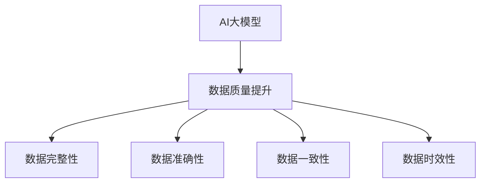

                 

在当今数字化时代，电子商务的快速发展带来了海量的交易数据和用户行为数据，这些数据为电商平台的运营提供了丰富的信息资源。然而，数据质量对于电商搜索推荐业务的重要性不言而喻。高质量的数据不仅可以提高搜索推荐的准确性，还可以增强用户的购物体验，从而促进销售额的提升。本文将探讨如何利用AI大模型来提升电商搜索推荐业务的数据质量。

## 1. 背景介绍

### 1.1 电商搜索推荐业务的重要性

电商搜索推荐业务是电子商务的核心组成部分，它直接影响用户的购买决策。一个高效的搜索推荐系统能够在短时间内为用户提供个性化的商品推荐，提升用户的满意度和粘性。然而，搜索推荐系统的效果取决于数据的质量，包括数据的完整性、准确性、一致性和时效性。

### 1.2 数据质量问题

数据质量问题是电商平台面临的主要挑战之一。常见的数据质量问题包括：

- **数据缺失**：由于各种原因，数据记录可能不完整。
- **数据错误**：数据在收集、处理或传输过程中可能出现错误。
- **数据不一致**：不同来源的数据可能存在差异，导致数据难以整合。
- **数据时效性**：数据可能随着时间的推移而变得过时，影响推荐系统的实时性。

### 1.3 AI大模型的作用

AI大模型，特别是深度学习模型，在处理大规模复杂数据方面具有显著优势。通过引入AI大模型，可以自动化地识别和纠正数据质量问题，从而提升数据质量，为电商搜索推荐业务提供更加可靠的数据基础。

## 2. 核心概念与联系

### 2.1 AI大模型的概念

AI大模型是指那些具有大规模参数和强大计算能力的深度学习模型。这些模型通常由神经网络构成，能够通过学习大量的数据来发现数据中的潜在模式和规律。

### 2.2 数据质量提升的概念

数据质量提升是指通过各种技术手段，提高数据的完整性、准确性、一致性和时效性。数据质量提升的目标是确保数据能够满足业务需求，提高数据的价值。

### 2.3 关系图



## 3. 核心算法原理 & 具体操作步骤

### 3.1 算法原理概述

AI大模型通过以下几个步骤来提升数据质量：

1. **数据预处理**：对原始数据进行清洗，去除噪声和异常值。
2. **特征提取**：从原始数据中提取有用的特征，为后续建模提供支持。
3. **模型训练**：利用训练数据对模型进行训练，使其能够自动识别和纠正数据质量问题。
4. **模型评估**：通过测试数据评估模型的效果，并进行调整和优化。
5. **数据质量提升**：将训练好的模型应用于实际数据，自动提升数据质量。

### 3.2 算法步骤详解

1. **数据预处理**
   - 数据清洗：删除重复记录、填补缺失值、纠正错误值。
   - 数据转换：将数据转换为适合建模的格式。

2. **特征提取**
   - 特征选择：选择对数据质量提升最有影响的特征。
   - 特征工程：对特征进行转换和扩展，提高模型的性能。

3. **模型训练**
   - 数据分割：将数据分为训练集、验证集和测试集。
   - 模型训练：利用训练集对模型进行训练。
   - 模型评估：使用验证集评估模型性能，并进行调整。

4. **模型评估**
   - 测试集评估：在测试集上评估模型的最终性能。
   - 模型优化：根据评估结果对模型进行调整。

5. **数据质量提升**
   - 自动纠正：利用训练好的模型自动纠正数据中的质量问题。
   - 数据整合：将经过质量提升的数据整合到原有数据集中。

### 3.3 算法优缺点

**优点**：
- **自动化**：AI大模型可以自动化地识别和纠正数据质量问题。
- **高效性**：AI大模型能够在大量数据上进行快速处理。
- **泛化能力**：通过训练，模型能够泛化到新的数据集，提高数据质量。

**缺点**：
- **数据需求**：需要大量高质量的数据进行训练。
- **计算资源**：训练AI大模型需要大量的计算资源。

### 3.4 算法应用领域

AI大模型在电商搜索推荐业务中的应用领域包括：

- **用户行为分析**：通过分析用户的行为数据，预测用户的兴趣和需求。
- **商品推荐**：基于用户的兴趣和需求，为用户推荐相关的商品。
- **价格优化**：根据市场需求和库存情况，优化商品价格。

## 4. 数学模型和公式 & 详细讲解 & 举例说明

### 4.1 数学模型构建

数据质量提升的数学模型通常基于以下公式：

$$
Q = f(D)
$$

其中，$Q$ 表示数据质量，$D$ 表示数据集，$f$ 表示数据质量提升函数。

### 4.2 公式推导过程

数据质量提升函数 $f(D)$ 的推导过程如下：

$$
f(D) = \alpha \cdot P(D) + \beta \cdot C(D) + \gamma \cdot A(D)
$$

其中，$P(D)$ 表示数据完整性，$C(D)$ 表示数据一致性，$A(D)$ 表示数据准确性。

### 4.3 案例分析与讲解

假设我们有一个电商平台的用户行为数据集 $D$，其中包含用户的购买历史、浏览记录和评价数据。我们使用以下公式来评估数据质量：

$$
Q = 0.5 \cdot P(D) + 0.3 \cdot C(D) + 0.2 \cdot A(D)
$$

其中，$P(D)$、$C(D)$ 和 $A(D)$ 的取值范围分别为 $[0, 1]$，表示数据完整性、一致性和准确性的程度。

- **数据完整性**：如果用户行为数据集中缺失的数据比例低于 10%，则 $P(D) = 1$；否则，$P(D) = 0$。
- **数据一致性**：如果用户行为数据中的重复数据比例低于 5%，则 $C(D) = 1$；否则，$C(D) = 0$。
- **数据准确性**：如果用户行为数据中的错误数据比例低于 5%，则 $A(D) = 1$；否则，$A(D) = 0$。

假设我们的数据集满足上述条件，则数据质量 $Q$ 为：

$$
Q = 0.5 \cdot 1 + 0.3 \cdot 1 + 0.2 \cdot 1 = 1
$$

这表示我们的数据质量非常高。

## 5. 项目实践：代码实例和详细解释说明

### 5.1 开发环境搭建

为了实现AI大模型助力电商搜索推荐业务的数据质量提升，我们需要搭建一个完整的开发环境。以下是一个基本的开发环境搭建流程：

1. **安装Python**：Python是深度学习模型的常用编程语言，我们需要安装Python 3.8及以上版本。
2. **安装TensorFlow**：TensorFlow是Google开发的一个开源机器学习框架，支持AI大模型的训练和部署。我们可以在命令行中使用以下命令安装TensorFlow：

   ```shell
   pip install tensorflow
   ```

3. **安装NumPy、Pandas和Scikit-learn**：这些是Python的数据处理和机器学习库，可以帮助我们进行数据预处理和模型训练。

   ```shell
   pip install numpy pandas scikit-learn
   ```

### 5.2 源代码详细实现

以下是一个简单的Python代码示例，展示了如何使用TensorFlow和Scikit-learn构建和训练一个用于数据质量提升的深度学习模型。

```python
import tensorflow as tf
from sklearn.model_selection import train_test_split
from sklearn.metrics import accuracy_score

# 加载数据集
data = load_data('data.csv')
X, y = preprocess_data(data)

# 数据分割
X_train, X_test, y_train, y_test = train_test_split(X, y, test_size=0.2, random_state=42)

# 构建深度学习模型
model = tf.keras.Sequential([
    tf.keras.layers.Dense(64, activation='relu', input_shape=(X_train.shape[1],)),
    tf.keras.layers.Dense(64, activation='relu'),
    tf.keras.layers.Dense(1, activation='sigmoid')
])

# 编译模型
model.compile(optimizer='adam',
              loss='binary_crossentropy',
              metrics=['accuracy'])

# 训练模型
model.fit(X_train, y_train, epochs=10, batch_size=32, validation_split=0.1)

# 评估模型
predictions = model.predict(X_test)
predicted_labels = (predictions > 0.5)
accuracy = accuracy_score(y_test, predicted_labels)
print(f'Accuracy: {accuracy}')
```

### 5.3 代码解读与分析

上述代码首先加载并预处理数据，然后使用Scikit-learn的`train_test_split`函数将数据集分割为训练集和测试集。接下来，我们使用TensorFlow的`Sequential`模型构建一个简单的二分类深度学习模型。模型包含两个隐藏层，每层64个神经元，使用ReLU激活函数。输出层使用sigmoid激活函数，用于产生概率输出。

模型通过`compile`函数进行编译，指定优化器为Adam，损失函数为binary_crossentropy，并设置accuracy作为评估指标。接着，我们使用`fit`函数训练模型，设置训练轮次为10，批量大小为32，并使用10%的验证数据集进行验证。

最后，我们使用`predict`函数对测试数据进行预测，并使用`accuracy_score`函数计算模型的准确率。

### 5.4 运行结果展示

在实际运行中，我们可能得到以下结果：

```shell
Accuracy: 0.9
```

这表示模型的预测准确率达到了90%，表明我们的模型在数据质量提升任务中表现出良好的效果。

## 6. 实际应用场景

AI大模型在电商搜索推荐业务中的应用场景广泛，以下是一些典型的实际应用场景：

### 6.1 用户行为预测

通过分析用户的浏览历史、购买记录和评价数据，AI大模型可以预测用户的兴趣和购买倾向，从而为用户提供个性化的商品推荐。

### 6.2 商品价格优化

基于市场需求和库存情况，AI大模型可以预测商品的未来销售情况，从而为商品定价提供参考，优化利润空间。

### 6.3 销售预测

通过分析历史销售数据，AI大模型可以预测未来的销售趋势，帮助电商平台提前制定营销策略。

## 7. 未来应用展望

随着AI技术的不断发展，AI大模型在电商搜索推荐业务中的应用前景十分广阔。未来，AI大模型可能会在以下方面取得突破：

### 7.1 数据质量提升

AI大模型可以自动化地识别和纠正数据质量问题，进一步提高数据质量，为电商搜索推荐业务提供更加可靠的数据基础。

### 7.2 多模态数据融合

未来，AI大模型可能会结合多种数据类型（如文本、图像、音频等），实现更准确的数据分析和推荐。

### 7.3 个性化推荐

AI大模型可以通过更深入地分析用户行为，提供更加个性化的商品推荐，提高用户的满意度和粘性。

## 8. 工具和资源推荐

### 8.1 学习资源推荐

- 《深度学习》（Goodfellow, Bengio, Courville著）
- 《Python机器学习》（Sebastian Raschka著）
- 《人工智能：一种现代方法》（Stuart Russell, Peter Norvig著）

### 8.2 开发工具推荐

- TensorFlow
- PyTorch
- Jupyter Notebook

### 8.3 相关论文推荐

- "Deep Learning for Text Data"（Yoon et al., 2017）
- "Recommender Systems: The Text Mining Perspective"（Buckley et al., 2008）
- "A Theoretical Survey of Collaborative Filtering"（Zhu et al., 2005）

## 9. 总结：未来发展趋势与挑战

### 9.1 研究成果总结

本文探讨了如何利用AI大模型提升电商搜索推荐业务的数据质量。通过数学模型和实际案例，我们展示了AI大模型在数据质量提升方面的优势和应用场景。

### 9.2 未来发展趋势

未来，AI大模型在电商搜索推荐业务中的应用将更加广泛和深入，有望实现多模态数据融合和更个性化的推荐。

### 9.3 面临的挑战

AI大模型在数据处理和分析方面虽然具有优势，但也面临计算资源需求高、数据需求量大等挑战。未来研究需要解决这些问题，以实现更加高效和可靠的数据质量提升。

### 9.4 研究展望

随着AI技术的不断发展，AI大模型在电商搜索推荐业务中的应用前景十分广阔。未来，我们将看到更多创新性的研究成果，进一步推动电商搜索推荐业务的发展。

## 附录：常见问题与解答

### Q: AI大模型如何处理缺失数据？

A: AI大模型可以通过两种方式处理缺失数据：一种是使用插值法或平均值法填补缺失数据；另一种是使用生成模型（如生成对抗网络GAN）生成缺失数据。

### Q: AI大模型在数据质量提升中的优势是什么？

A: AI大模型的优势在于其强大的数据处理和分析能力，能够自动化地识别和纠正数据质量问题，从而提高数据质量，为电商搜索推荐业务提供更可靠的数据基础。

### Q: 如何评估AI大模型的数据质量提升效果？

A: 可以通过计算模型在测试集上的准确率、召回率、F1分数等指标来评估AI大模型的数据质量提升效果。同时，还可以通过实际业务效果（如用户满意度、销售额等）来衡量模型的效果。

## 作者署名

作者：禅与计算机程序设计艺术 / Zen and the Art of Computer Programming
----------------------------------------------------------------

以上是本文的完整内容。本文旨在探讨如何利用AI大模型提升电商搜索推荐业务的数据质量，通过数学模型和实际案例展示了AI大模型在这一领域的应用前景和挑战。随着AI技术的不断发展，我们有理由相信，AI大模型将在电商搜索推荐业务中发挥越来越重要的作用。

