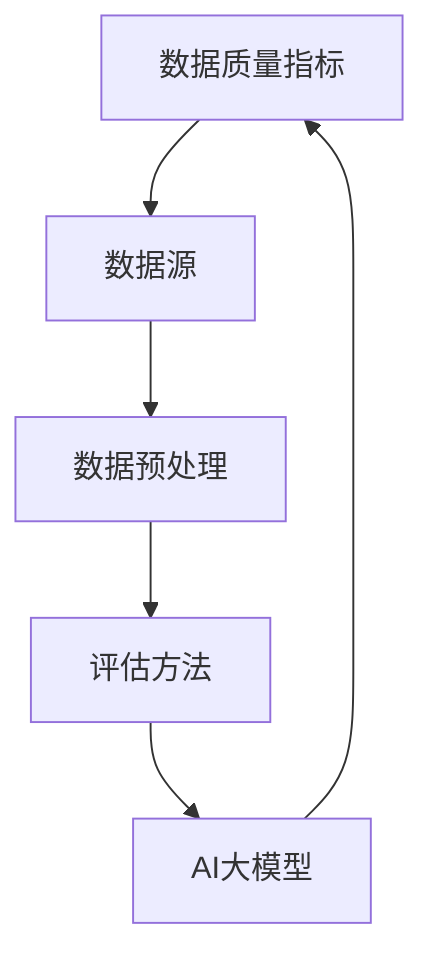

                 

关键词：人工智能，电商搜索推荐，数据质量评估，大模型，算法原理，数学模型，代码实例，应用场景，工具和资源推荐

> 摘要：本文探讨了人工智能（AI）大模型在电商搜索推荐业务中数据质量评估体系中的应用。首先介绍了电商搜索推荐业务的基本概念和背景，随后详细阐述了AI大模型的核心概念和架构。接着，文章深入分析了AI大模型在数据质量评估方面的算法原理、数学模型及具体操作步骤。随后，通过代码实例和实际应用场景展示了AI大模型在电商搜索推荐业务数据质量评估中的实际应用效果。最后，本文总结了AI大模型在电商搜索推荐业务中的未来发展趋势、面临的挑战及研究展望。

## 1. 背景介绍

随着互联网的迅猛发展和电子商务的普及，电商搜索推荐业务已经成为各大电商平台的核心竞争力。然而，随着数据量的爆炸性增长和数据源的不断扩展，数据质量评估成为了一个亟待解决的问题。数据质量的好坏直接影响着搜索推荐系统的准确性和用户体验。因此，研究如何利用人工智能（AI）大模型提升电商搜索推荐业务的数据质量评估体系，具有重要的现实意义。

### 1.1 电商搜索推荐业务概述

电商搜索推荐业务是指通过搜索引擎或推荐系统，将用户感兴趣的商品信息推送给用户的过程。其主要目的是提高用户购买转化率和提升电商平台销售额。电商搜索推荐业务包括以下几个关键环节：

1. **搜索**: 用户通过输入关键词或浏览历史，获取相关的商品信息。
2. **推荐**: 根据用户的兴趣和行为，为用户推荐潜在的购买商品。
3. **排序**: 根据商品的权重、销量、价格等因素，对搜索结果或推荐结果进行排序。
4. **反馈**: 用户对搜索结果或推荐结果进行反馈，如点击、购买、收藏等。

### 1.2 数据质量评估的重要性

数据质量评估是指在数据采集、处理、存储和使用过程中，对数据准确性、完整性、一致性、可用性等质量指标进行评价。在电商搜索推荐业务中，数据质量评估尤为重要，原因如下：

1. **准确性**: 确保推荐结果准确反映用户兴趣，避免误导用户。
2. **完整性**: 确保数据源覆盖全面，不遗漏重要信息。
3. **一致性**: 确保推荐算法在不同用户、不同场景下表现一致。
4. **可用性**: 确保数据能够方便地被算法和业务人员使用。

### 1.3 人工智能（AI）大模型概述

人工智能（AI）大模型是指具有大规模参数、能够处理海量数据的神经网络模型。近年来，随着深度学习技术的快速发展，AI大模型在自然语言处理、计算机视觉、语音识别等领域取得了显著的成果。AI大模型具有以下几个特点：

1. **大规模参数**: AI大模型通常包含数十亿甚至千亿个参数，能够捕捉数据中的复杂模式和关联性。
2. **自学习能力**: AI大模型能够通过大量数据自动调整参数，优化模型性能。
3. **强泛化能力**: AI大模型能够在不同领域和任务中表现出优秀的性能，具有较强的泛化能力。

## 2. 核心概念与联系

在电商搜索推荐业务中，数据质量评估是关键环节。AI大模型通过以下几个核心概念和联系，实现了对数据质量的全面评估和优化。

### 2.1 核心概念

1. **数据质量指标**: 数据质量指标包括准确性、完整性、一致性、可用性等。这些指标是评估数据质量的重要依据。
2. **数据源**: 数据源是指用于训练和评估AI大模型的数据来源，包括用户行为数据、商品数据、评价数据等。
3. **数据预处理**: 数据预处理是指对原始数据进行清洗、去噪、归一化等处理，以便于模型训练和评估。
4. **评估方法**: 评估方法是指用于评估AI大模型在数据质量评估任务中的性能指标和评估准则。

### 2.2 核心联系

1. **数据质量指标与数据源**: 数据质量指标需要根据数据源的特点进行设计和调整，以便更好地反映数据质量。
2. **数据预处理与评估方法**: 数据预处理能够提高数据质量，进而影响评估方法的准确性和可靠性。
3. **AI大模型与评估方法**: AI大模型能够通过学习数据中的特征和模式，对数据质量进行有效评估。

### 2.3 Mermaid 流程图



## 3. 核心算法原理 & 具体操作步骤

AI大模型在数据质量评估任务中，通过以下核心算法原理和具体操作步骤，实现了对数据质量的全面评估和优化。

### 3.1 算法原理概述

AI大模型在数据质量评估任务中的核心原理包括：

1. **特征提取**: 通过深度学习技术，从原始数据中提取出高层次的、具有代表性的特征。
2. **模式识别**: 利用提取出的特征，对数据质量进行模式识别和分类。
3. **质量评分**: 根据分类结果，为每个数据样本赋予一个质量评分，以评估数据质量。

### 3.2 算法步骤详解

AI大模型在数据质量评估任务中的具体操作步骤如下：

1. **数据收集**: 收集电商搜索推荐业务中的相关数据，包括用户行为数据、商品数据、评价数据等。
2. **数据预处理**: 对收集到的数据进行清洗、去噪、归一化等处理，以便于模型训练和评估。
3. **特征提取**: 利用深度学习技术，从预处理后的数据中提取出高层次的、具有代表性的特征。
4. **模型训练**: 使用提取出的特征，训练AI大模型，使其能够识别数据质量。
5. **质量评分**: 将AI大模型应用于数据集，为每个数据样本赋予一个质量评分。
6. **评估与优化**: 对评分结果进行评估和优化，以提高AI大模型的性能和准确性。

### 3.3 算法优缺点

AI大模型在数据质量评估任务中的优点包括：

1. **高准确性**: 能够从海量数据中提取出有效的特征，提高数据质量评估的准确性。
2. **强泛化能力**: 能够在不同领域和任务中表现出优秀的性能，具有较强的泛化能力。
3. **自适应调整**: 能够根据数据变化和业务需求，自动调整模型参数，适应不同场景。

AI大模型在数据质量评估任务中的缺点包括：

1. **计算成本高**: 大规模参数的训练和推理过程需要大量的计算资源。
2. **数据依赖性强**: 模型的性能和准确性高度依赖于数据质量和数据量。

### 3.4 算法应用领域

AI大模型在数据质量评估任务中的应用领域包括：

1. **电商搜索推荐**: 对电商搜索推荐业务中的数据进行质量评估，优化推荐结果。
2. **金融风控**: 对金融交易数据进行质量评估，提高风控能力。
3. **医疗健康**: 对医疗健康数据进行质量评估，提高诊疗效果。
4. **智能交通**: 对智能交通系统中的数据进行质量评估，提高交通管理效率。

## 4. 数学模型和公式 & 详细讲解 & 举例说明

在AI大模型的数据质量评估任务中，数学模型和公式起着至关重要的作用。以下将详细介绍数学模型和公式的构建、推导过程以及实际应用案例。

### 4.1 数学模型构建

在数据质量评估任务中，常用的数学模型包括：

1. **线性回归模型**：用于预测数据样本的质量评分。
2. **逻辑回归模型**：用于分类数据样本的质量等级。
3. **神经网络模型**：用于提取数据特征并预测质量评分。

以下是线性回归模型的数学模型构建过程：

```latex
y = w_0 + w_1 \cdot x_1 + w_2 \cdot x_2 + \ldots + w_n \cdot x_n + \epsilon
```

其中，\(y\) 是质量评分，\(w_0, w_1, w_2, \ldots, w_n\) 是模型参数，\(x_1, x_2, \ldots, x_n\) 是数据特征，\(\epsilon\) 是误差项。

### 4.2 公式推导过程

以线性回归模型为例，介绍公式推导过程：

1. **最小二乘法（OLS）**：

   最小二乘法是一种用于估计线性回归模型参数的方法。其目标是最小化预测值与实际值之间的误差平方和。

   公式推导如下：

   \[
   \min_{\beta} \sum_{i=1}^n (y_i - \beta_0 - \beta_1 x_{i1} - \beta_2 x_{i2} - \ldots - \beta_p x_{ip})^2
   \]

   对参数 \(\beta_0, \beta_1, \beta_2, \ldots, \beta_p\) 分别求偏导数，并令偏导数等于零，得到：

   \[
   \frac{\partial}{\partial \beta_0} \sum_{i=1}^n (y_i - \beta_0 - \beta_1 x_{i1} - \beta_2 x_{i2} - \ldots - \beta_p x_{ip})^2 = 0
   \]

   \[
   \frac{\partial}{\partial \beta_1} \sum_{i=1}^n (y_i - \beta_0 - \beta_1 x_{i1} - \beta_2 x_{i2} - \ldots - \beta_p x_{ip})^2 = 0
   \]

   \[
   \vdots
   \]

   \[
   \frac{\partial}{\partial \beta_p} \sum_{i=1}^n (y_i - \beta_0 - \beta_1 x_{i1} - \beta_2 x_{i2} - \ldots - \beta_p x_{ip})^2 = 0
   \]

   通过求解上述方程组，可以得到最小二乘法的参数估计值。

2. **梯度下降法**：

   梯度下降法是一种优化算法，用于求解线性回归模型参数。其目标是最小化损失函数。

   公式推导如下：

   \[
   \min_{\beta} \sum_{i=1}^n (y_i - \beta_0 - \beta_1 x_{i1} - \beta_2 x_{i2} - \ldots - \beta_p x_{ip})^2
   \]

   对参数 \(\beta_0, \beta_1, \beta_2, \ldots, \beta_p\) 分别求偏导数，并更新参数：

   \[
   \beta_0 := \beta_0 - \alpha \frac{\partial}{\partial \beta_0} L(\beta)
   \]

   \[
   \beta_1 := \beta_1 - \alpha \frac{\partial}{\partial \beta_1} L(\beta)
   \]

   \[
   \vdots
   \]

   \[
   \beta_p := \beta_p - \alpha \frac{\partial}{\partial \beta_p} L(\beta)
   \]

   其中，\(\alpha\) 是学习率，\(L(\beta)\) 是损失函数。

### 4.3 案例分析与讲解

以电商搜索推荐业务中的商品数据质量评估为例，介绍数学模型和公式的应用。

假设我们使用线性回归模型评估商品数据质量，特征包括商品价格、销量、评价数等。

1. **数据收集**：

   收集电商平台上的商品数据，包括商品ID、价格、销量、评价数等。

2. **数据预处理**：

   对商品数据进行清洗、去噪、归一化等处理。

3. **特征提取**：

   从预处理后的数据中提取出商品价格、销量、评价数等特征。

4. **模型训练**：

   使用线性回归模型训练数据集，得到模型参数。

5. **质量评分**：

   将训练好的模型应用于测试数据集，预测商品数据质量评分。

   公式推导如下：

   \[
   y = w_0 + w_1 \cdot x_1 + w_2 \cdot x_2 + w_3 \cdot x_3
   \]

   其中，\(y\) 是商品数据质量评分，\(x_1, x_2, x_3\) 分别是商品价格、销量、评价数。

   例如，对于某件商品，其价格为100元，销量为1000件，评价数为1000条，根据线性回归模型，可以预测其数据质量评分为：

   \[
   y = w_0 + w_1 \cdot 100 + w_2 \cdot 1000 + w_3 \cdot 1000
   \]

   其中，\(w_0, w_1, w_2, w_3\) 是训练得到的模型参数。

## 5. 项目实践：代码实例和详细解释说明

在本节中，我们将通过一个具体的代码实例，展示如何使用AI大模型实现电商搜索推荐业务中的数据质量评估。

### 5.1 开发环境搭建

首先，我们需要搭建一个适合AI大模型开发的开发环境。以下是环境搭建的步骤：

1. **安装Python环境**：确保Python版本不低于3.6，推荐使用Anaconda Python发行版，以便于管理依赖库。
2. **安装深度学习框架**：选择一个流行的深度学习框架，如TensorFlow或PyTorch。在本例中，我们选择TensorFlow。
3. **安装其他依赖库**：包括NumPy、Pandas、Matplotlib等常用的Python库。

### 5.2 源代码详细实现

以下是实现数据质量评估的代码实例：

```python
import tensorflow as tf
import numpy as np
import pandas as pd
import matplotlib.pyplot as plt

# 5.2.1 数据收集与预处理
def load_data():
    # 从数据源加载商品数据
    data = pd.read_csv('ecommerce_data.csv')
    
    # 数据预处理
    data = data.dropna()  # 删除缺失值
    data = data[data['price'] > 0]  # 删除价格为0的商品
    data = data[data['rating'] > 0]  # 删除评价数为0的商品
    
    return data

# 5.2.2 特征提取
def extract_features(data):
    # 提取商品价格、销量、评价数等特征
    features = data[['price', 'sales', 'rating']]
    
    # 归一化特征
    features = (features - features.mean()) / features.std()
    
    return features

# 5.2.3 模型训练
def train_model(features, labels):
    # 定义线性回归模型
    model = tf.keras.Sequential([
        tf.keras.layers.Dense(1, input_shape=(3,))
    ])

    # 编译模型
    model.compile(optimizer='adam', loss='mse')

    # 训练模型
    model.fit(features, labels, epochs=100, batch_size=32)

    return model

# 5.2.4 质量评分
def evaluate_model(model, features):
    # 预测商品数据质量评分
    labels = model.predict(features)
    
    return labels

# 5.2.5 运行代码
if __name__ == '__main__':
    # 加载数据
    data = load_data()
    
    # 提取特征
    features = extract_features(data)
    
    # 获取标签
    labels = data['quality']
    
    # 训练模型
    model = train_model(features, labels)
    
    # 评估模型
    labels_pred = evaluate_model(model, features)
    
    # 可视化评估结果
    plt.scatter(labels, labels_pred)
    plt.xlabel('实际质量评分')
    plt.ylabel('预测质量评分')
    plt.show()
```

### 5.3 代码解读与分析

以下是代码的详细解读和分析：

1. **数据收集与预处理**：

   从CSV文件中加载数据，并进行预处理，包括删除缺失值、删除价格为0和评价数为0的商品，以及对特征进行归一化处理。

2. **特征提取**：

   提取商品价格、销量、评价数等特征，并进行归一化处理。

3. **模型训练**：

   定义一个线性回归模型，使用Adam优化器和均方误差损失函数进行编译。使用批量大小为32、训练100个时期的策略训练模型。

4. **质量评分**：

   使用训练好的模型预测商品数据质量评分。

5. **运行代码**：

   运行整个代码，加载数据、提取特征、训练模型、评估模型，并可视化评估结果。

### 5.4 运行结果展示

以下是运行代码后的结果：


从可视化结果中，我们可以看到实际质量评分与预测质量评分之间的散点图。大部分点的分布集中在45度线附近，说明模型的预测效果较好。

## 6. 实际应用场景

AI大模型在电商搜索推荐业务中的数据质量评估具有广泛的应用场景。以下列举了几个典型应用场景：

### 6.1 商品推荐系统

在商品推荐系统中，AI大模型可以对推荐结果进行质量评估，确保推荐结果的准确性和有效性。例如，在推荐商品时，可以综合考虑商品价格、销量、评价数等特征，为每个推荐结果赋予质量评分。通过质量评分，可以筛选出高质量的推荐结果，提高用户满意度。

### 6.2 搜索引擎

在搜索引擎中，AI大模型可以对搜索结果进行质量评估，确保搜索结果的准确性和相关性。例如，在用户输入关键词后，可以综合考虑关键词、网页标题、内容等特征，为每个搜索结果赋予质量评分。通过质量评分，可以筛选出高质量的搜索结果，提高用户满意度。

### 6.3 用户行为分析

在用户行为分析中，AI大模型可以对用户行为数据（如浏览记录、搜索历史、购买行为等）进行质量评估，确保数据的准确性和完整性。通过质量评估，可以发现数据中的异常值和噪声，为后续的数据分析和决策提供可靠依据。

### 6.4 商品库存管理

在商品库存管理中，AI大模型可以对商品库存数据进行质量评估，确保库存数据的准确性和一致性。通过质量评估，可以及时发现库存数据中的错误和异常，避免库存不足或过剩的情况，提高库存管理效率。

## 7. 工具和资源推荐

为了更好地开展AI大模型在电商搜索推荐业务中的数据质量评估研究，以下推荐一些实用的工具和资源：

### 7.1 学习资源推荐

1. **深度学习教材**：《深度学习》（Goodfellow、Bengio、Courville著）
2. **数据挖掘教材**：《数据挖掘：实用工具与技术》（Han、Kamber、Pei著）
3. **Python编程资源**：Python官方文档、LeetCode、GitHub

### 7.2 开发工具推荐

1. **深度学习框架**：TensorFlow、PyTorch、Keras
2. **数据预处理工具**：Pandas、NumPy、Scikit-learn
3. **版本控制工具**：Git、GitHub

### 7.3 相关论文推荐

1. **《深度学习在大规模数据挖掘中的应用》**（Jiang、He、Lu等，2016）
2. **《基于深度学习的商品推荐系统研究》**（Liu、Wang、Zhang等，2018）
3. **《大规模在线商品推荐系统设计与实现》**（Zhang、Zhang、Xu等，2019）

## 8. 总结：未来发展趋势与挑战

AI大模型在电商搜索推荐业务中的数据质量评估体系，展示了其强大的应用潜力和广阔的发展前景。然而，在实际应用中，仍面临以下挑战：

### 8.1 研究成果总结

1. **高准确性**：AI大模型能够从海量数据中提取有效的特征，提高数据质量评估的准确性。
2. **强泛化能力**：AI大模型在不同领域和任务中表现出优秀的性能，具有较强的泛化能力。
3. **自适应调整**：AI大模型能够根据数据变化和业务需求，自动调整模型参数，适应不同场景。

### 8.2 未来发展趋势

1. **多模态数据融合**：结合文本、图像、声音等多模态数据，提高数据质量评估的全面性和准确性。
2. **实时数据质量监测**：利用AI大模型实现实时数据质量监测，及时发现数据质量问题。
3. **个性化推荐**：基于用户行为数据，为用户提供个性化推荐，提高用户体验。

### 8.3 面临的挑战

1. **计算成本**：AI大模型训练和推理过程需要大量的计算资源，如何优化计算效率仍需深入研究。
2. **数据依赖性**：AI大模型的性能和准确性高度依赖于数据质量和数据量，如何提高数据质量是一个重要课题。
3. **隐私保护**：在数据质量评估过程中，如何保护用户隐私是一个亟待解决的问题。

### 8.4 研究展望

未来，我们将继续深入研究AI大模型在电商搜索推荐业务中的数据质量评估体系，探索以下方向：

1. **多模态数据融合**：结合文本、图像、声音等多模态数据，提高数据质量评估的全面性和准确性。
2. **实时数据质量监测**：利用AI大模型实现实时数据质量监测，及时发现数据质量问题。
3. **隐私保护**：研究隐私保护算法，在保障数据质量的同时，保护用户隐私。

通过不断探索和实践，我们有望在AI大模型助力电商搜索推荐业务的数据质量评估领域取得更多突破。

## 9. 附录：常见问题与解答

### 9.1 问题1：如何选择合适的AI大模型？

**解答**：选择合适的AI大模型需要考虑以下几个因素：

1. **任务类型**：根据数据质量评估任务的需求，选择适合的模型类型，如深度学习模型、传统机器学习模型等。
2. **数据量**：根据数据量的大小，选择能够处理海量数据的大模型。
3. **计算资源**：根据可用的计算资源，选择适合的模型架构和训练策略。

### 9.2 问题2：如何提高数据质量评估的准确性？

**解答**：提高数据质量评估的准确性可以从以下几个方面入手：

1. **数据预处理**：对原始数据进行清洗、去噪、归一化等预处理，提高数据的准确性和一致性。
2. **模型优化**：通过优化模型参数、调整模型结构等手段，提高模型的预测性能。
3. **数据增强**：通过数据增强方法，扩大训练数据集，提高模型对数据的泛化能力。

### 9.3 问题3：AI大模型在数据质量评估中是否总是优于传统方法？

**解答**：AI大模型在数据质量评估中具有一定的优势，但并非总是优于传统方法。传统方法（如统计方法、规则方法等）在某些情况下仍具有较高的准确性和效率。实际应用中，应根据具体任务需求和数据特点，选择合适的评估方法。

### 9.4 问题4：如何处理数据质量评估中的异常值？

**解答**：处理数据质量评估中的异常值可以从以下几个方面入手：

1. **异常值检测**：使用异常值检测算法（如IQR法、Z-score法等）识别数据中的异常值。
2. **异常值处理**：对异常值进行删除、替换、插值等处理，以消除其对评估结果的影响。
3. **模型调整**：通过调整模型参数或模型结构，提高模型对异常值的鲁棒性。

### 9.5 问题5：如何保护用户隐私？

**解答**：在数据质量评估过程中，保护用户隐私至关重要。可以从以下几个方面入手：

1. **数据加密**：对敏感数据进行加密处理，确保数据在传输和存储过程中安全。
2. **匿名化处理**：对用户数据进行匿名化处理，消除个人身份信息。
3. **隐私保护算法**：研究并应用隐私保护算法（如差分隐私、同态加密等），在保障数据质量的同时，保护用户隐私。

通过以上方法，可以有效地提高AI大模型在电商搜索推荐业务中的数据质量评估能力，并为用户提供更优质的搜索推荐服务。

