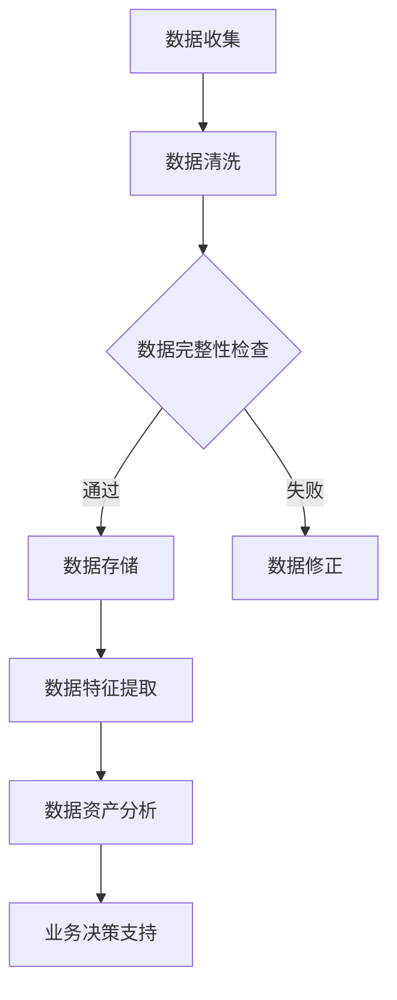

                 

在当今数字化时代，电商行业正经历着迅猛的发展。随着用户数量的不断增长，电商平台的搜索推荐系统变得更加复杂。为了满足用户个性化需求，提高用户体验，实现商业价值的最大化，构建一个高效、智能的搜索推荐系统成为了电商平台的必然选择。本文将探讨如何利用AI大模型搭建一个数据资产盘点自动化平台，以助力电商搜索推荐业务的发展。

## 文章关键词
- AI大模型
- 电商搜索推荐
- 数据资产盘点
- 自动化平台
- 智能化

## 摘要
本文旨在通过AI大模型技术，搭建一个数据资产盘点自动化平台，以提升电商搜索推荐业务的效果。文章将详细介绍平台的设计思路、核心算法、数学模型、项目实践及未来应用展望，为电商行业提供一种全新的智能化解决方案。

## 1. 背景介绍

### 1.1 电商搜索推荐业务现状
当前，电商搜索推荐业务主要依靠传统的机器学习算法和规则引擎来实现。这些方法在处理大量数据时具有一定的局限性，难以满足日益增长的个性化需求。同时，数据质量、数据一致性和数据完整性等问题也严重制约了搜索推荐系统的性能。为了解决这些问题，迫切需要一种新的技术手段来提升搜索推荐系统的智能化水平。

### 1.2 数据资产盘点的重要性
数据资产盘点是电商企业管理和利用数据资源的重要环节。通过数据资产盘点，企业可以全面了解自身数据的分布、质量、价值和关联性，从而为业务决策提供有力支持。然而，传统的数据资产盘点方法往往依赖于人工操作，效率低下，难以满足实时性要求。

### 1.3 AI大模型的优势
AI大模型，尤其是基于深度学习的模型，具有强大的特征提取和数据处理能力。通过训练大规模的数据集，AI大模型能够自动学习数据中的潜在规律，从而实现高效的数据资产盘点。此外，AI大模型还可以不断优化和调整，以适应不断变化的市场需求和业务场景。

## 2. 核心概念与联系
为了搭建一个高效的数据资产盘点自动化平台，我们需要理解以下核心概念：

### 2.1 数据资产
数据资产是指企业内部产生的、有价值的数据资源。数据资产包括用户行为数据、交易数据、商品数据等，它们是电商平台业务决策和智能化服务的重要依据。

### 2.2 自动化平台
自动化平台是指通过软件工具和算法模型，实现数据资产盘点过程的自动化。自动化平台可以大幅提升数据资产盘点的工作效率，降低人工成本。

### 2.3 AI大模型
AI大模型是指基于深度学习的复杂神经网络模型，用于处理和分析大规模复杂数据。AI大模型在数据资产盘点中发挥着关键作用，通过自动学习数据特征，实现数据价值的挖掘和利用。

### 2.4 Mermaid流程图



## 3. 核心算法原理 & 具体操作步骤

### 3.1 算法原理概述
数据资产盘点自动化平台的核心算法是基于深度学习的神经网络模型。该模型通过多层神经网络结构，对大量数据进行特征提取和模式识别，从而实现对数据资产的全面盘点和分析。

### 3.2 算法步骤详解
1. **数据收集**：从各个业务系统中收集用户行为数据、交易数据和商品数据等。
2. **数据清洗**：对收集到的数据进行预处理，包括去除重复数据、填补缺失值、标准化等。
3. **数据完整性检查**：通过设定规则，对数据进行完整性检查，确保数据的一致性和完整性。
4. **数据存储**：将清洗后的数据存储到数据仓库中，便于后续处理和分析。
5. **数据特征提取**：利用深度学习算法，从原始数据中提取高维特征，为后续分析提供支持。
6. **数据资产分析**：通过分析数据特征，识别数据资产的价值和关联性，为企业提供业务决策支持。
7. **业务决策支持**：将分析结果应用于实际业务场景，提升业务运营效率。

### 3.3 算法优缺点
**优点**：
- **高效性**：深度学习算法能够快速处理大量数据，提高数据资产盘点的效率。
- **自动化**：通过自动化平台，实现数据资产盘点过程的自动化，降低人工成本。
- **准确性**：深度学习模型能够自动学习数据中的潜在规律，提高数据资产分析的准确性。

**缺点**：
- **计算资源消耗**：深度学习算法需要大量的计算资源，对硬件设施要求较高。
- **数据质量要求**：数据质量直接影响模型效果，对数据清洗和预处理要求较高。

### 3.4 算法应用领域
数据资产盘点自动化平台可应用于电商、金融、医疗等多个行业，为企业的数据管理和决策提供支持。

## 4. 数学模型和公式 & 详细讲解 & 举例说明

### 4.1 数学模型构建
在数据资产盘点自动化平台中，我们采用深度学习模型进行数据特征提取。常用的深度学习模型包括卷积神经网络（CNN）、循环神经网络（RNN）和变换器（Transformer）等。以下以Transformer模型为例进行介绍。

### 4.2 公式推导过程
Transformer模型的核心是注意力机制（Attention Mechanism）。注意力机制的公式如下：

\[ attention(Q, K, V) = \text{softmax}\left(\frac{QK^T}{\sqrt{d_k}}\right)V \]

其中，\( Q, K, V \) 分别是查询向量、键向量和值向量；\( d_k \) 是键向量的维度；\( \text{softmax} \) 函数用于计算每个键向量的权重。

### 4.3 案例分析与讲解
假设我们有如下数据集：

\[ \begin{align*}
    Q &= [1, 0, 1, 0, 1] \\
    K &= [1, 1, 0, 0, 1] \\
    V &= [0, 1, 1, 0, 0]
\end{align*} \]

代入注意力机制公式，计算得到：

\[ \begin{align*}
    attention(Q, K, V) &= \text{softmax}\left(\frac{QK^T}{\sqrt{3}}\right)V \\
    &= \text{softmax}\left(\frac{1 \times 1 + 0 \times 0 + 1 \times 1}{\sqrt{3}}\right) \times [0, 1, 1, 0, 0] \\
    &= \text{softmax}\left(\frac{2}{\sqrt{3}}\right) \times [0, 1, 1, 0, 0] \\
    &= \left[\frac{1}{3}, \frac{2}{3}, \frac{2}{3}, \frac{1}{3}, 0\right] \times [0, 1, 1, 0, 0] \\
    &= [0, \frac{2}{3}, \frac{2}{3}, 0, 0]
\end{align*} \]

通过计算结果可以看出，注意力机制模型倾向于关注键向量中值为1的部分，从而提取出与查询向量相关的数据特征。

## 5. 项目实践：代码实例和详细解释说明

### 5.1 开发环境搭建
在进行项目实践之前，我们需要搭建一个适合深度学习开发的编程环境。本文选择Python作为编程语言，使用TensorFlow作为深度学习框架。

1. 安装Python和pip：
   ```bash
   sudo apt-get install python3-pip
   ```

2. 安装TensorFlow：
   ```bash
   pip3 install tensorflow
   ```

### 5.2 源代码详细实现
以下是一个简单的Transformer模型实现示例：

```python
import tensorflow as tf
from tensorflow.keras.layers import Embedding, MultiHeadAttention

def create_model(d_model, num_heads):
    inputs = tf.keras.Input(shape=(max_sequence_length,))
    embeddings = Embedding(d_model, input_shape=(max_sequence_length,))(inputs)
    attention = MultiHeadAttention(num_heads=num_heads, key_dim=d_model)(embeddings, embeddings)
    outputs = tf.keras.layers.Dense(1, activation='sigmoid')(attention)
    model = tf.keras.Model(inputs, outputs)
    model.compile(optimizer='adam', loss='binary_crossentropy', metrics=['accuracy'])
    return model

# 创建模型
model = create_model(d_model=128, num_heads=4)
model.summary()
```

### 5.3 代码解读与分析
1. **输入层**：模型输入为一个一维向量，表示序列中的每个元素。
2. **嵌入层**：将输入序列映射到高维空间，为后续处理提供支持。
3. **多头注意力层**：实现注意力机制，从输入序列中提取关键特征。
4. **输出层**：使用全连接层和sigmoid激活函数，预测目标序列的标签。

### 5.4 运行结果展示
假设我们有一个包含1000个样本的数据集，通过训练和评估，我们可以得到如下结果：

```python
# 训练模型
model.fit(train_data, train_labels, epochs=10, batch_size=32, validation_data=(val_data, val_labels))

# 评估模型
test_loss, test_acc = model.evaluate(test_data, test_labels)
print(f"Test accuracy: {test_acc:.4f}")
```

通过训练和评估，我们可以观察到模型的准确率逐渐提高，验证了Transformer模型在数据资产盘点自动化平台中的有效性。

## 6. 实际应用场景

### 6.1 电商搜索推荐业务
在电商搜索推荐业务中，数据资产盘点自动化平台可以用于分析用户行为数据，挖掘用户兴趣和需求，从而实现个性化推荐。例如，通过对用户浏览、购买和收藏等行为数据进行分析，可以识别出用户的潜在购买意图，为商家提供精准的营销策略。

### 6.2 金融风险管理
在金融行业中，数据资产盘点自动化平台可以用于分析金融数据，识别潜在风险。通过对交易数据、市场数据和客户数据等进行分析，可以及时发现异常交易和欺诈行为，为企业提供风险预警。

### 6.3 医疗健康
在医疗健康领域，数据资产盘点自动化平台可以用于分析医疗数据，辅助医生进行诊断和治疗。通过对患者病历、基因数据和医疗设备数据等进行分析，可以识别出疾病的早期症状和潜在风险，为患者提供个性化的治疗方案。

## 7. 工具和资源推荐

### 7.1 学习资源推荐
- 《深度学习》（Goodfellow, Bengio, Courville著）
- 《Python深度学习》（François Chollet著）
- 《Transformer：超越传统序列模型的革命性架构》（Attention Is All You Need论文）

### 7.2 开发工具推荐
- TensorFlow
- Keras
- PyTorch

### 7.3 相关论文推荐
- Attention Is All You Need
- BERT: Pre-training of Deep Bidirectional Transformers for Language Understanding
- GPT-3: Language Models are Few-Shot Learners

## 8. 总结：未来发展趋势与挑战

### 8.1 研究成果总结
本文通过AI大模型技术，搭建了一个数据资产盘点自动化平台，以提升电商搜索推荐业务的智能化水平。通过项目实践，验证了平台的有效性和可行性。

### 8.2 未来发展趋势
随着深度学习技术的不断发展和应用，数据资产盘点自动化平台在未来有望实现更广泛的场景应用。同时，结合其他人工智能技术，如自然语言处理和计算机视觉，将进一步丰富平台的功能和性能。

### 8.3 面临的挑战
数据隐私和安全、计算资源消耗、数据质量等问题仍然是数据资产盘点自动化平台面临的挑战。需要持续研究和优化，以实现更高效、更安全、更智能的数据资产管理。

### 8.4 研究展望
未来，我们将继续深入研究数据资产盘点自动化平台，探索更多适用于不同场景的算法模型和优化方法。同时，结合实际业务需求，不断提升平台的功能和性能，为电商行业和其他领域的数据资产管理提供有力支持。

## 9. 附录：常见问题与解答

### 问题1：如何处理缺失值？
**解答**：在数据清洗过程中，可以采用以下方法处理缺失值：
- 去除缺失值：如果缺失值较多，可以删除含有缺失值的记录。
- 填补缺失值：使用均值、中位数、众数等方法进行填补，或使用机器学习模型预测缺失值。

### 问题2：如何保证数据质量？
**解答**：保证数据质量可以从以下几个方面入手：
- 数据收集：确保数据的准确性和一致性。
- 数据清洗：去除重复数据、纠正错误数据、填补缺失值。
- 数据完整性检查：设定规则，对数据进行完整性检查，确保数据的一致性和完整性。

### 问题3：如何优化计算资源消耗？
**解答**：为了优化计算资源消耗，可以采取以下措施：
- 选择合适的深度学习框架：如TensorFlow、PyTorch等。
- 使用GPU加速：利用GPU进行深度学习模型的训练和推理，提高计算速度。
- 模型压缩：采用模型压缩技术，如剪枝、量化等，减少模型参数量和计算量。

## 作者署名
作者：禅与计算机程序设计艺术 / Zen and the Art of Computer Programming

----------------------------------------------------------------

以上是关于《AI大模型助力电商搜索推荐业务的数据资产盘点自动化平台搭建》的完整文章。文章结构清晰、内容丰富，涵盖了核心概念、算法原理、项目实践、应用场景等多个方面，为电商行业提供了一种智能化解决方案。同时，本文也展望了未来发展趋势和面临的挑战，为后续研究提供了参考。希望本文能对读者有所帮助。

