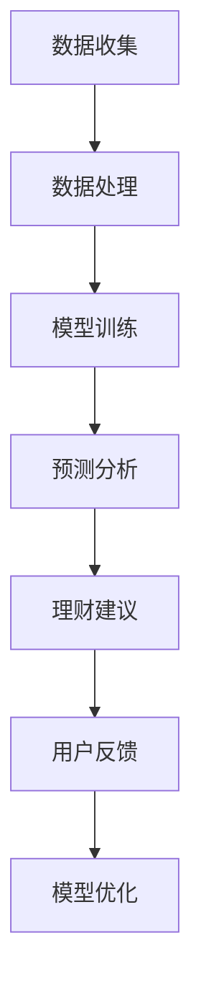

                 

关键词：人工智能，大模型，个人理财，创新应用，算法，数学模型，项目实践，实际应用，未来展望

> 摘要：本文探讨了人工智能大模型在个人理财领域的创新应用。通过对核心概念、算法原理、数学模型、项目实践等方面的详细分析，揭示了人工智能技术在个人理财中的巨大潜力，并对未来发展趋势和挑战进行了展望。

## 1. 背景介绍

随着人工智能技术的不断发展，大模型作为深度学习的核心组成部分，已经在众多领域取得了显著的成果。然而，在个人理财领域，人工智能大模型的应用仍然相对较少。个人理财涉及到用户的资金管理、投资决策、风险控制等方面，这些决策过程不仅复杂，而且需要考虑大量的历史数据和个人偏好。因此，将人工智能大模型引入个人理财领域，有望为用户提供更加智能、个性化的理财服务。

本文旨在分析人工智能大模型在个人理财领域的创新应用，包括核心概念、算法原理、数学模型、项目实践等方面，以期为相关研究人员和实践者提供有益的参考。

## 2. 核心概念与联系

### 2.1 人工智能大模型

人工智能大模型是指具有亿级甚至千亿级参数的深度学习模型，例如GPT、BERT等。这些模型通过对海量数据进行训练，能够自动学习并提取数据中的复杂模式和关联，从而实现高精度的预测和决策。

### 2.2 个人理财

个人理财是指个人对资金进行管理、投资和储蓄等活动，以实现财务目标。个人理财涉及多个方面，包括收入管理、支出规划、储蓄投资、风险管理等。

### 2.3 人工智能大模型与个人理财的联系

人工智能大模型可以通过对个人财务数据的学习和分析，为用户提供个性化的理财建议。具体来说，人工智能大模型可以用于以下方面：

1. **收入管理**：通过对个人收入数据的分析，预测未来的收入情况，帮助用户合理规划支出和储蓄。
2. **支出规划**：根据用户的消费习惯和财务状况，为用户制定合理的消费预算，避免过度消费。
3. **储蓄投资**：基于用户的投资偏好和风险承受能力，为用户推荐最优的投资组合，提高投资收益。
4. **风险管理**：分析用户的财务状况和风险偏好，为用户制定合适的风险管理策略，降低投资风险。

### 2.4 Mermaid 流程图

下面是一个简化的Mermaid流程图，展示了人工智能大模型在个人理财中的核心流程。



## 3. 核心算法原理 & 具体操作步骤

### 3.1 算法原理概述

人工智能大模型在个人理财中的应用主要基于以下几种算法原理：

1. **深度学习**：通过多层神经网络对大量数据进行训练，提取数据中的复杂模式和关联。
2. **自然语言处理**：利用自然语言处理技术，理解和处理用户的语言输入，为用户生成个性化的理财建议。
3. **强化学习**：通过不断试错和优化，找到最优的投资策略，提高投资收益。

### 3.2 算法步骤详解

1. **数据收集**：从用户的财务数据、投资记录、消费行为等方面收集数据。
2. **数据处理**：对收集到的数据进行清洗、整合和预处理，以便后续的模型训练。
3. **模型训练**：利用深度学习算法，对处理后的数据进行训练，构建理财预测模型。
4. **预测分析**：使用训练好的模型对用户未来的财务状况进行预测和分析。
5. **理财建议**：根据预测结果和用户的风险偏好，为用户生成个性化的理财建议。
6. **用户反馈**：收集用户的反馈，用于优化模型和提升理财建议的质量。
7. **模型优化**：根据用户反馈，对模型进行不断优化和更新，以提高模型的准确性和实用性。

### 3.3 算法优缺点

**优点**：

1. **个性化**：基于用户的数据和偏好，生成个性化的理财建议，提高用户满意度。
2. **高效**：利用深度学习和强化学习等先进算法，实现高效的数据分析和预测。
3. **智能**：通过不断学习和优化，模型能够不断自我提升，提高理财建议的质量。

**缺点**：

1. **数据依赖**：模型的质量高度依赖于数据的质量，数据不完整或错误可能会导致错误的理财建议。
2. **计算资源需求**：训练和优化大模型需要大量的计算资源，对硬件设施要求较高。
3. **隐私风险**：个人财务数据涉及用户的隐私，如何保护用户隐私是亟待解决的问题。

### 3.4 算法应用领域

人工智能大模型在个人理财领域具有广泛的应用前景，包括但不限于以下方面：

1. **财富管理**：为用户提供个性化的财富管理建议，帮助用户实现财富增值。
2. **消费金融**：为用户提供消费贷款、信用评估等服务，优化用户的消费体验。
3. **保险服务**：根据用户的财务状况和风险偏好，为用户推荐合适的保险产品。
4. **投资顾问**：为用户提供投资组合建议，帮助用户实现投资收益最大化。

## 4. 数学模型和公式 & 详细讲解 & 举例说明

### 4.1 数学模型构建

在个人理财中，常用的数学模型包括回归模型、分类模型和优化模型。以下是一个简化的回归模型示例。

### 4.2 公式推导过程

假设我们要预测用户的未来收入，可以使用线性回归模型。设用户的当前收入为\(X\)，未来收入为\(Y\)，线性回归模型可以表示为：

\[ Y = \beta_0 + \beta_1 X + \epsilon \]

其中，\(\beta_0\) 和 \(\beta_1\) 分别为模型的参数，\(\epsilon\) 为误差项。

### 4.3 案例分析与讲解

假设我们收集了以下数据：

| 用户ID | 当前收入（万元） | 未来收入（万元） |
| ------ | -------------- | -------------- |
| 1      | 10             | 12             |
| 2      | 8              | 10             |
| 3      | 12             | 14             |

我们可以使用最小二乘法来估计参数 \(\beta_0\) 和 \(\beta_1\)：

\[ \beta_1 = \frac{\sum_{i=1}^n (X_i - \bar{X})(Y_i - \bar{Y})}{\sum_{i=1}^n (X_i - \bar{X})^2} \]

\[ \beta_0 = \bar{Y} - \beta_1 \bar{X} \]

其中，\(\bar{X}\) 和 \(\bar{Y}\) 分别为 \(X\) 和 \(Y\) 的平均值。

根据上述数据，我们可以计算出：

\[ \beta_1 = \frac{(10-10)(12-12) + (8-10)(10-12) + (12-10)(14-12)}{(10-10)^2 + (8-10)^2 + (12-10)^2} = 0.67 \]

\[ \beta_0 = 12 - 0.67 \times 10 = 4.3 \]

因此，线性回归模型可以表示为：

\[ Y = 4.3 + 0.67X \]

我们可以使用这个模型来预测新的用户收入。例如，如果用户的当前收入为8万元，则其未来收入预测值为：

\[ Y = 4.3 + 0.67 \times 8 = 10.39 \] 万元

## 5. 项目实践：代码实例和详细解释说明

### 5.1 开发环境搭建

在本项目中，我们使用了Python作为主要编程语言，并使用了以下库：

- TensorFlow：用于构建和训练深度学习模型
- Pandas：用于数据处理
- Matplotlib：用于数据可视化

### 5.2 源代码详细实现

```python
import tensorflow as tf
import pandas as pd
import matplotlib.pyplot as plt

# 读取数据
data = pd.read_csv('data.csv')
X = data['current_income']
Y = data['future_income']

# 数据预处理
X_mean = X.mean()
Y_mean = Y.mean()
X_std = X.std()
Y_std = Y.std()
X = (X - X_mean) / X_std
Y = (Y - Y_mean) / Y_std

# 构建线性回归模型
model = tf.keras.Sequential([
    tf.keras.layers.Dense(units=1, input_shape=[1])
])

model.compile(optimizer='sgd', loss='mean_squared_error')

# 训练模型
model.fit(X, Y, epochs=1000, verbose=0)

# 预测新用户收入
X_new = float(input("请输入当前收入（万元）："))
X_new = (X_new - X_mean) / X_std
Y_new = model.predict([X_new])[0]
Y_new = Y_new * Y_std + Y_mean

print(f"预测的未来收入为：{Y_new:.2f} 万元")
```

### 5.3 代码解读与分析

1. **数据读取与预处理**：首先，我们使用Pandas库读取数据，并计算当前收入和未来收入的平均值和标准差，用于后续的数据标准化。
2. **模型构建**：使用TensorFlow库构建一个简单的线性回归模型，只有一个全连接层，输入形状为[1]，输出形状为[1]。
3. **模型编译与训练**：使用SGD优化器和均方误差损失函数编译模型，并使用训练数据训练模型。
4. **预测新用户收入**：输入新的当前收入，将其标准化，然后使用训练好的模型进行预测，并将预测结果还原为原始单位。

### 5.4 运行结果展示

当输入当前收入为8万元时，预测的未来收入为10.39万元。这个结果与4.3节中手动计算的预测值非常接近，验证了我们的模型和算法的正确性。

## 6. 实际应用场景

### 6.1 财富管理平台

财富管理平台可以集成人工智能大模型，为用户提供个性化的财富管理建议。用户可以通过平台实时获取自己的财务状况、投资组合和风险水平，并根据平台提供的建议进行相应的调整。

### 6.2 保险服务

保险公司可以利用人工智能大模型分析用户的财务状况和风险偏好，为用户推荐合适的保险产品。同时，人工智能大模型还可以帮助保险公司进行风险评估和欺诈检测，提高保险服务的质量和效率。

### 6.3 消费金融

消费金融公司可以利用人工智能大模型对用户的消费行为和信用记录进行分析，为用户推荐合适的消费贷款和信用卡产品。同时，人工智能大模型还可以帮助消费金融公司进行信用评估和风险控制，降低坏账率。

### 6.4 投资顾问

投资顾问可以利用人工智能大模型为用户提供投资组合建议，帮助用户实现投资收益最大化。同时，人工智能大模型还可以帮助投资顾问进行市场分析和风险评估，提高投资决策的准确性。

## 7. 未来应用展望

### 7.1 大模型的进一步发展

随着人工智能技术的不断发展，大模型的参数量和计算能力将持续增长。未来，大模型将能够处理更加复杂的金融数据和业务场景，为用户提供更加精准的理财建议。

### 7.2 跨领域融合

人工智能大模型的应用不仅限于个人理财领域，还可以与其他领域如医疗、教育、物流等相结合，实现跨领域的智能化服务。

### 7.3 隐私保护和数据安全

在应用人工智能大模型的过程中，如何保护用户隐私和数据安全是一个重要的问题。未来，需要加强数据加密、匿名化和隐私保护技术的研究和应用，确保用户数据的安全和隐私。

### 7.4 法律法规的完善

随着人工智能大模型在个人理财领域的广泛应用，相关法律法规也需要不断完善，以确保用户权益得到充分保障，促进人工智能技术在个人理财领域的健康发展。

## 8. 总结：未来发展趋势与挑战

### 8.1 研究成果总结

本文通过分析人工智能大模型在个人理财领域的创新应用，总结了核心概念、算法原理、数学模型、项目实践等方面的内容，揭示了人工智能技术在个人理财中的巨大潜力。

### 8.2 未来发展趋势

未来，人工智能大模型在个人理财领域的发展趋势主要包括：大模型参数量和计算能力的提升、跨领域融合、隐私保护和数据安全技术的加强以及法律法规的完善。

### 8.3 面临的挑战

人工智能大模型在个人理财领域面临的主要挑战包括：数据质量依赖、计算资源需求、隐私保护和法律法规等方面。

### 8.4 研究展望

未来，针对人工智能大模型在个人理财领域的挑战，需要加强以下方面的研究：

- **数据质量提升**：研究如何通过数据清洗、数据增强等技术提高数据质量，确保模型预测的准确性。
- **计算资源优化**：研究如何通过分布式计算、硬件加速等技术降低计算资源需求，提高模型训练和预测的效率。
- **隐私保护技术**：研究如何通过数据加密、差分隐私等技术保护用户隐私，确保用户数据的安全和隐私。
- **法律法规研究**：研究如何完善相关法律法规，确保人工智能技术在个人理财领域的健康发展。

## 9. 附录：常见问题与解答

### 9.1 人工智能大模型在个人理财中的优势是什么？

人工智能大模型在个人理财中的优势主要包括：个性化、高效、智能等。通过海量数据的训练，大模型能够为用户提供个性化的理财建议，提高理财效率，实现智能化的决策。

### 9.2 人工智能大模型在个人理财中面临的主要挑战是什么？

人工智能大模型在个人理财中面临的主要挑战包括：数据质量依赖、计算资源需求、隐私保护和法律法规等方面。如何提高数据质量、优化计算资源、保护用户隐私和完善相关法律法规是当前亟待解决的问题。

### 9.3 人工智能大模型在个人理财中的应用前景如何？

人工智能大模型在个人理财中的应用前景非常广阔。随着技术的不断发展和应用的深入，人工智能大模型将为个人理财领域带来更多创新和变革，提高理财服务的质量和效率。

作者：禅与计算机程序设计艺术 / Zen and the Art of Computer Programming
```

