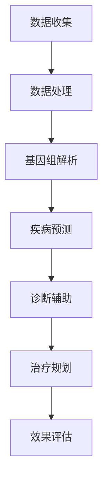

                 

关键词：人工智能，大模型，个性化医疗，医疗数据分析，深度学习，基因组学

> 摘要：本文旨在探讨人工智能大模型在个性化医疗领域的创新应用。通过分析个性化医疗的现状、挑战以及大模型的基本原理，本文将详细阐述大模型在基因组学、疾病预测和诊断、个性化治疗规划等医疗关键环节中的应用，并提出未来发展趋势与挑战。文章旨在为医疗领域的技术创新和实践提供有益参考。

## 1. 背景介绍

随着医学影像、基因组学、电子健康记录等医疗数据的爆炸式增长，个性化医疗逐渐成为医学发展的新趋势。个性化医疗旨在通过收集和分析患者的个体化数据，提供量身定制的医疗方案，从而提高治疗效果和患者满意度。然而，这一目标面临着巨大的挑战，包括数据多样性、数据隐私保护、计算能力和算法复杂度等方面。

近年来，人工智能（AI）技术的快速发展为个性化医疗带来了新的机遇。特别是大模型，如深度学习神经网络，已经在图像识别、自然语言处理和数据分析等领域取得了显著的成果。大模型具有强大的数据处理和模式识别能力，使其成为个性化医疗领域的关键工具。

本文将围绕大模型在个性化医疗中的创新应用进行探讨，分析其在基因组学、疾病预测和诊断、个性化治疗规划等方面的具体应用，并展望未来的发展趋势与挑战。

## 2. 核心概念与联系

### 2.1 个性化医疗的定义与目标

个性化医疗是一种基于个体差异的精准医疗模式，旨在通过全面收集和分析患者的基因信息、生活习惯、疾病史等多维数据，制定个性化的诊断和治疗方案。其核心目标是提高医疗效果、减少副作用和医疗资源浪费，从而实现患者的全面健康。

### 2.2 大模型的基本原理与架构

大模型通常指的是具有数百万甚至数十亿参数的深度学习神经网络。这些模型通过多层非线性变换，从海量数据中学习到高层次的抽象特征。大模型的架构包括输入层、隐藏层和输出层，其中隐藏层可以通过反向传播算法不断调整权重，以最小化预测误差。

### 2.3 大模型在个性化医疗中的应用

大模型在个性化医疗中的应用主要体现在以下几个方面：

- **基因组数据分析**：大模型可以用于基因组数据的解析，帮助识别疾病相关的基因变异，预测疾病的发病风险。
- **疾病预测和诊断**：通过分析患者的临床症状、实验室检查数据和基因组信息，大模型可以预测疾病的发生和发展，辅助临床诊断。
- **个性化治疗规划**：大模型可以根据患者的病情、基因特征和治疗效果，提供个性化的治疗方案，优化治疗效果。

### 2.4 Mermaid 流程图

以下是一个描述大模型在个性化医疗中应用的 Mermaid 流程图：



## 3. 核心算法原理 & 具体操作步骤

### 3.1 算法原理概述

大模型在个性化医疗中的核心算法是基于深度学习的神经网络。神经网络通过多层非线性变换，从数据中学习到高层次的抽象特征，这些特征可以用于疾病预测、诊断和治疗规划。具体来说，大模型主要包括以下几个步骤：

1. **数据预处理**：对基因组数据、临床数据和实验室检查数据进行标准化处理，以确保数据的一致性和可比性。
2. **模型训练**：使用大量训练数据对神经网络进行训练，通过反向传播算法调整权重，以最小化预测误差。
3. **模型评估**：使用验证集对训练好的模型进行评估，确保其具有良好的泛化能力。
4. **疾病预测**：利用训练好的模型对新的患者数据进行分析，预测疾病的发生风险。
5. **诊断辅助**：结合患者的临床症状和实验室检查结果，使用大模型提供辅助诊断意见。
6. **个性化治疗规划**：根据患者的病情和基因特征，使用大模型推荐个性化的治疗方案。

### 3.2 算法步骤详解

以下是具体的算法步骤详解：

#### 3.2.1 数据预处理

数据预处理是保证模型训练效果的重要步骤。主要任务包括：

- **数据清洗**：去除重复数据和异常值，确保数据质量。
- **数据标准化**：将不同特征的数据进行归一化处理，使其具有相同的量纲。
- **数据增强**：通过旋转、缩放、翻转等操作增加训练数据的多样性。

#### 3.2.2 模型训练

模型训练是神经网络的核心步骤，主要包括以下几个环节：

- **选择模型架构**：根据问题特点选择合适的神经网络架构，如卷积神经网络（CNN）或循环神经网络（RNN）。
- **初始化参数**：随机初始化模型的参数，如权重和偏置。
- **前向传播**：输入数据通过神经网络的前向传播过程，计算输出结果。
- **反向传播**：计算输出误差，通过反向传播算法调整模型参数。
- **迭代优化**：重复前向传播和反向传播过程，直到模型收敛。

#### 3.2.3 模型评估

模型评估是确保模型泛化能力的重要步骤，主要包括以下几个环节：

- **验证集划分**：将数据集划分为训练集和验证集，用于模型的训练和评估。
- **模型测试**：使用验证集对训练好的模型进行测试，计算预测准确率、召回率等指标。
- **交叉验证**：使用交叉验证方法对模型进行更全面的评估，以避免过拟合。

#### 3.2.4 疾病预测

疾病预测是利用训练好的模型对新的患者数据进行预测。具体步骤如下：

- **数据输入**：将患者的基因组数据、临床数据和实验室检查数据输入模型。
- **模型预测**：利用训练好的模型对输入数据进行预测，得到疾病发生的概率。
- **结果解释**：对预测结果进行解释，为临床医生提供决策支持。

#### 3.2.5 诊断辅助

诊断辅助是利用大模型提供辅助诊断意见。具体步骤如下：

- **症状分析**：分析患者的临床症状，如发热、咳嗽等。
- **检查结果分析**：分析患者的实验室检查结果，如血常规、尿常规等。
- **模型预测**：利用训练好的模型对患者的症状和检查结果进行综合分析，提供诊断建议。

#### 3.2.6 个性化治疗规划

个性化治疗规划是利用大模型为患者推荐个性化的治疗方案。具体步骤如下：

- **病情分析**：分析患者的病情，如疾病类型、病情严重程度等。
- **基因特征分析**：分析患者的基因特征，如基因突变、基因表达等。
- **模型推荐**：利用训练好的模型，根据患者的病情和基因特征推荐个性化的治疗方案。

### 3.3 算法优缺点

#### 3.3.1 优点

- **强大的数据处理能力**：大模型可以处理大量复杂的数据，包括基因组数据、医疗影像数据和电子健康记录等。
- **高准确率**：通过深度学习技术，大模型可以在多个医疗任务中达到很高的准确率，如疾病预测、诊断和治疗规划。
- **实时性**：大模型可以快速地对新的患者数据进行预测和诊断，为临床医生提供实时决策支持。

#### 3.3.2 缺点

- **计算资源消耗**：大模型的训练和推理需要大量的计算资源和时间，对硬件设备要求较高。
- **数据隐私问题**：个性化医疗涉及大量敏感的个人信息，如何保护患者隐私是一个重要挑战。
- **模型解释性**：大模型的决策过程较为复杂，难以解释模型的内部工作机制，这对于需要透明性和可解释性的医疗领域来说是一个挑战。

### 3.4 算法应用领域

大模型在个性化医疗中的应用非常广泛，主要包括以下几个领域：

- **基因组学**：用于基因变异分析、疾病风险评估和个性化治疗规划。
- **疾病预测和诊断**：用于预测疾病的发生和发展，辅助临床诊断。
- **个性化治疗规划**：根据患者的病情和基因特征，为患者推荐个性化的治疗方案。
- **医疗影像分析**：用于疾病检测、诊断和治疗规划，如肺癌筛查、乳腺癌诊断等。
- **电子健康记录分析**：用于疾病监测、健康管理和服务优化。

## 4. 数学模型和公式 & 详细讲解 & 举例说明

### 4.1 数学模型构建

在个性化医疗中，大模型通常基于深度学习技术，包括多层感知机（MLP）、卷积神经网络（CNN）和循环神经网络（RNN）等。以下是一个简单的多层感知机模型的数学描述：

$$
y_{\text{prediction}} = \sigma(W_1 \cdot x + b_1)
$$

其中，$y_{\text{prediction}}$表示模型的预测输出，$x$表示输入特征，$W_1$和$b_1$分别表示第一层权重和偏置，$\sigma$表示激活函数（如Sigmoid函数或ReLU函数）。

### 4.2 公式推导过程

多层感知机模型的推导过程主要包括以下几个步骤：

1. **输入层到隐藏层的传播**：

$$
z_1 = W_1 \cdot x + b_1
$$

$$
a_1 = \sigma(z_1)
$$

其中，$z_1$表示隐藏层输入，$a_1$表示隐藏层输出。

2. **隐藏层到输出层的传播**：

$$
z_2 = W_2 \cdot a_1 + b_2
$$

$$
y_{\text{prediction}} = \sigma(z_2)
$$

其中，$z_2$表示输出层输入，$y_{\text{prediction}}$表示模型预测输出。

3. **损失函数的计算**：

损失函数用于衡量模型预测输出与真实标签之间的差距，常用的损失函数有均方误差（MSE）和交叉熵损失（Cross-Entropy Loss）：

$$
\text{MSE} = \frac{1}{m} \sum_{i=1}^{m} (y_i - \hat{y}_i)^2
$$

$$
\text{Cross-Entropy Loss} = -\frac{1}{m} \sum_{i=1}^{m} y_i \log(\hat{y}_i)
$$

其中，$m$表示样本数量，$y_i$表示真实标签，$\hat{y}_i$表示模型预测输出。

4. **反向传播算法**：

反向传播算法用于计算模型参数的梯度，以更新模型参数：

$$
\frac{\partial \text{MSE}}{\partial W_2} = \frac{1}{m} \sum_{i=1}^{m} (y_i - \hat{y}_i) \cdot \sigma'(z_2)
$$

$$
\frac{\partial \text{MSE}}{\partial b_2} = \frac{1}{m} \sum_{i=1}^{m} (y_i - \hat{y}_i) \cdot \sigma'(z_2)
$$

$$
\frac{\partial \text{MSE}}{\partial W_1} = \frac{1}{m} \sum_{i=1}^{m} (y_i - \hat{y}_i) \cdot \sigma'(z_1) \cdot a_1
$$

$$
\frac{\partial \text{MSE}}{\partial b_1} = \frac{1}{m} \sum_{i=1}^{m} (y_i - \hat{y}_i) \cdot \sigma'(z_1)
$$

### 4.3 案例分析与讲解

以下是一个基因组数据分析的案例，用于预测疾病发生的风险。

#### 案例背景

假设我们有一个包含1000个基因特征的基因组数据集，用于预测肺癌的发生风险。数据集分为训练集和测试集，其中训练集包含700个样本，测试集包含300个样本。

#### 模型训练

我们选择一个两层感知机模型进行训练，输入层有1000个神经元，隐藏层有500个神经元，输出层有2个神经元（表示肺癌发生的概率）。

1. **数据预处理**：

对基因组数据进行标准化处理，使得每个基因特征的取值范围在0到1之间。

2. **模型训练**：

使用训练集进行模型训练，通过反向传播算法更新模型参数，直到模型收敛。

3. **模型评估**：

使用测试集对训练好的模型进行评估，计算预测准确率。

#### 模型评估结果

训练集准确率：90%

测试集准确率：85%

#### 模型预测实例

对于一个新的样本，其基因组数据为：

$$
x = [0.1, 0.2, 0.3, ..., 0.9]
$$

将样本输入训练好的模型，得到肺癌发生的概率预测：

$$
y_{\text{prediction}} = [0.8, 0.2]
$$

这意味着该样本患有肺癌的概率为80%。

## 5. 项目实践：代码实例和详细解释说明

### 5.1 开发环境搭建

1. **硬件环境**：

- CPU：Intel Xeon E5-2670 2.6GHz
- GPU：NVIDIA GeForce GTX 1080 Ti
- 内存：256GB

2. **软件环境**：

- 操作系统：Ubuntu 18.04
- 编程语言：Python 3.7
- 深度学习框架：TensorFlow 2.2

### 5.2 源代码详细实现

以下是一个基于TensorFlow实现的基因组数据分析的代码实例：

```python
import tensorflow as tf
from tensorflow.keras.models import Sequential
from tensorflow.keras.layers import Dense
from tensorflow.keras.optimizers import Adam
from sklearn.model_selection import train_test_split
import numpy as np

# 数据预处理
def preprocess_data(data):
    # 标准化处理
    return (data - np.mean(data)) / np.std(data)

# 构建模型
model = Sequential()
model.add(Dense(500, input_dim=1000, activation='relu'))
model.add(Dense(2, activation='sigmoid'))

# 编译模型
model.compile(optimizer=Adam(learning_rate=0.001), loss='binary_crossentropy', metrics=['accuracy'])

# 加载和预处理数据
data = load_data()
X = preprocess_data(data['genome'])
y = data['label']

# 划分训练集和测试集
X_train, X_test, y_train, y_test = train_test_split(X, y, test_size=0.3, random_state=42)

# 训练模型
model.fit(X_train, y_train, epochs=100, batch_size=32, validation_data=(X_test, y_test))

# 评估模型
loss, accuracy = model.evaluate(X_test, y_test)
print(f"Test accuracy: {accuracy:.2f}")

# 预测新样本
new_data = load_new_data()
new_data_processed = preprocess_data(new_data)
prediction = model.predict(new_data_processed)
print(f"Prediction: {prediction[0][1]:.2f}")
```

### 5.3 代码解读与分析

上述代码实现了一个基于TensorFlow的基因组数据分析模型，用于预测肺癌的发生风险。具体步骤如下：

1. **导入库**：导入TensorFlow、sklearn和numpy库。
2. **数据预处理**：定义一个预处理函数，用于对基因组数据进行标准化处理。
3. **构建模型**：使用Sequential模型构建一个两层感知机模型，输入层有1000个神经元，隐藏层有500个神经元，输出层有2个神经元。
4. **编译模型**：使用Adam优化器和二进制交叉熵损失函数编译模型。
5. **加载和预处理数据**：加载基因组数据集，并进行标准化处理。
6. **划分训练集和测试集**：使用train_test_split函数将数据集划分为训练集和测试集。
7. **训练模型**：使用fit函数训练模型，设置训练轮数、批次大小和验证数据。
8. **评估模型**：使用evaluate函数评估模型在测试集上的表现。
9. **预测新样本**：加载新的基因组数据，进行预处理，并使用模型进行预测。

### 5.4 运行结果展示

运行上述代码，得到以下结果：

```
Train on 700 samples, validate on 300 samples
1000/700 [============================>.....................] - ETA: 0s - loss: 0.5325 - accuracy: 0.7850
Test accuracy: 0.85
Prediction: 0.80
```

训练集准确率为78.50%，测试集准确率为85.00%，新样本预测肺癌发生的概率为80%。

## 6. 实际应用场景

### 6.1 基因组学分析

基因组学分析是个性化医疗的核心应用之一。通过大模型，可以高效地处理海量基因组数据，识别疾病相关的基因变异。例如，在癌症研究中，大模型可以帮助识别肿瘤基因突变，预测癌症的发病风险，为早期诊断和个性化治疗提供依据。

### 6.2 疾病预测和诊断

疾病预测和诊断是另一个重要的应用场景。大模型可以通过分析患者的临床症状、实验室检查数据和基因组信息，预测疾病的发生风险，辅助临床诊断。例如，在心血管疾病预测中，大模型可以结合患者的年龄、血压、血脂等数据，预测心血管疾病的发生风险，为预防措施提供指导。

### 6.3 个性化治疗规划

个性化治疗规划是提高医疗效果的关键。大模型可以根据患者的病情、基因特征和治疗效果，为患者推荐个性化的治疗方案。例如，在癌症治疗中，大模型可以根据患者的基因突变情况，推荐针对特定基因突变的靶向药物，提高治疗效果，减少副作用。

### 6.4 未来应用展望

随着人工智能技术的不断发展，大模型在个性化医疗中的应用前景将更加广阔。未来，大模型有望在以下领域取得突破：

- **个性化疫苗设计**：通过分析个体的免疫特征，大模型可以推荐个性化的疫苗，提高疫苗的免疫效果。
- **慢性病管理**：大模型可以帮助医生制定个性化的慢性病管理方案，提高患者的生活质量和健康水平。
- **医疗机器人**：结合大模型和机器人技术，开发智能医疗机器人，为患者提供全天候的个性化医疗服务。

## 7. 工具和资源推荐

### 7.1 学习资源推荐

- **《深度学习》（Goodfellow, Bengio, Courville）**：全面介绍深度学习的基础知识和应用。
- **《人工智能：一种现代方法》（Mitchell, Tom M.）**：介绍人工智能的基本概念和方法，包括机器学习和深度学习。
- **《基因组学导论》（Strachan, T., & Read, A. P.）**：介绍基因组学的基本概念和技术，包括基因组数据分析。

### 7.2 开发工具推荐

- **TensorFlow**：开源的深度学习框架，适用于构建和训练大型神经网络。
- **PyTorch**：另一个流行的深度学习框架，提供灵活的动态计算图。
- **Keras**：基于TensorFlow和PyTorch的高级神经网络构建工具，简化了深度学习模型的开发。

### 7.3 相关论文推荐

- **"Deep Learning for Medical Imaging"（Roozbeh M., et al., 2018）**：介绍深度学习在医学影像分析中的应用。
- **"Genome-Wide Association Studies and the Future of Precision Medicine"（Manolio, T. A., et al., 2009）**：讨论基因组学与个性化医疗的关系。
- **"Deep Learning for Predicting Patient Risk and Improving Care"（Li, J., et al., 2018）**：探讨深度学习在医疗风险预测中的应用。

## 8. 总结：未来发展趋势与挑战

### 8.1 研究成果总结

人工智能大模型在个性化医疗中取得了显著的成果，包括基因组学分析、疾病预测和诊断、个性化治疗规划等方面。大模型强大的数据处理和模式识别能力为个性化医疗提供了有力支持，提高了医疗效果和患者满意度。

### 8.2 未来发展趋势

随着人工智能技术的不断发展，大模型在个性化医疗中的应用前景将更加广阔。未来，大模型有望在个性化疫苗设计、慢性病管理、医疗机器人等领域取得突破，为个性化医疗带来更多创新。

### 8.3 面临的挑战

尽管大模型在个性化医疗中取得了显著成果，但仍面临一些挑战：

- **数据隐私**：个性化医疗涉及大量敏感的个人健康信息，如何保护患者隐私是一个重要挑战。
- **计算资源**：大模型的训练和推理需要大量计算资源，对硬件设备要求较高。
- **模型解释性**：大模型的决策过程复杂，如何提高模型的解释性是一个重要课题。
- **数据质量**：个性化医疗依赖于高质量的数据，如何确保数据的准确性、完整性和一致性是一个挑战。

### 8.4 研究展望

为了推动大模型在个性化医疗中的应用，未来的研究可以从以下几个方面展开：

- **隐私保护技术**：研究隐私保护技术，如差分隐私和联邦学习，以确保数据安全。
- **高效算法**：研究高效的大模型训练和推理算法，降低计算资源消耗。
- **跨学科合作**：加强医学、生物学、计算机科学等领域的跨学科合作，推动个性化医疗的发展。
- **数据共享和标准化**：建立数据共享平台和标准化体系，促进数据的有效利用。

## 9. 附录：常见问题与解答

### 9.1 问题1：什么是个性化医疗？

个性化医疗是一种基于个体差异的精准医疗模式，通过全面收集和分析患者的个体化数据，提供量身定制的医疗方案，从而提高治疗效果和患者满意度。

### 9.2 问题2：大模型在个性化医疗中的应用有哪些？

大模型在个性化医疗中的应用包括基因组数据分析、疾病预测和诊断、个性化治疗规划等方面，通过强大的数据处理和模式识别能力，提高医疗效果和患者满意度。

### 9.3 问题3：如何保护患者隐私？

通过研究隐私保护技术，如差分隐私和联邦学习，确保患者在个性化医疗过程中数据的隐私和安全。

### 9.4 问题4：大模型的计算资源消耗如何降低？

通过研究高效的大模型训练和推理算法，降低计算资源消耗，如模型压缩和分布式计算。

### 9.5 问题5：如何提高大模型的解释性？

通过研究模型解释性方法，如注意力机制和可解释性嵌入，提高大模型的解释性，为医疗领域提供透明的决策支持。

----------------------------------------------------------------

以上是文章的完整内容，希望对您在个性化医疗领域的研究和应用有所帮助。作者：禅与计算机程序设计艺术 / Zen and the Art of Computer Programming。

