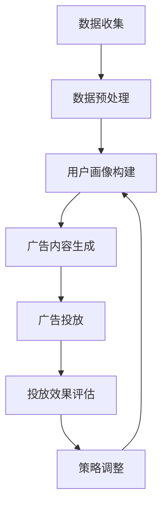

                 

关键词：人工智能，大模型，个性化广告，商业化应用，算法原理，数学模型，项目实践，未来展望

> 摘要：本文深入探讨了人工智能领域的大模型技术，特别是在个性化广告商业化应用中的重要作用。通过对大模型核心算法原理的解析、数学模型的构建、以及实际项目实践的详细分析，本文旨在为读者提供一个全面的技术指南，帮助理解如何利用AI大模型实现广告的精准投放，提升广告效果和商业价值。

## 1. 背景介绍

随着互联网和移动设备的普及，广告已经成为许多企业获取利润的重要手段。传统的广告投放方式往往依赖于用户行为数据和兴趣标签，但这些方法通常存在一定的局限性，无法精准满足用户个性化需求。随着人工智能技术的快速发展，特别是大模型技术的成熟，个性化广告的精准投放成为可能。

大模型是指那些拥有数百万至数十亿参数的深度学习模型，如Transformer、BERT、GPT等。这些模型在自然语言处理、图像识别、语音识别等领域展现出了卓越的性能。个性化广告利用这些大模型，可以更加精准地分析用户行为，预测用户兴趣，从而实现广告内容的精准投放。

### 1.1 个性化广告的发展历程

个性化广告的发展可以分为以下几个阶段：

1. **基于行为分析的初级阶段**：通过跟踪用户的浏览历史和购买记录，将用户归类为不同的兴趣群体，进行广告投放。
2. **基于标签的高级阶段**：引入更多维度的用户数据，如地理位置、社交网络、年龄等，使用标签进行用户分类。
3. **基于AI大模型的高级个性化阶段**：利用大模型进行深度学习，实现对用户行为的全面分析和预测，实现广告内容的个性化定制。

### 1.2 大模型在个性化广告中的优势

1. **更高的预测精度**：大模型可以通过学习大量数据，捕捉到用户行为的细微变化，从而提高广告投放的准确性。
2. **更好的用户体验**：精准的广告推送可以减少用户的不适感，提高广告的接受度，从而提升用户体验。
3. **更高的转化率**：精准的广告投放可以提高广告的点击率和转化率，从而提升广告主的商业收益。

## 2. 核心概念与联系

### 2.1 个性化广告的核心概念

个性化广告主要涉及以下几个核心概念：

1. **用户画像**：通过对用户行为数据的分析，构建出用户的个人画像，包括兴趣、偏好、消费能力等。
2. **广告内容**：根据用户画像，生成或选择与用户兴趣相关的广告内容。
3. **广告投放**：将广告内容推送给目标用户。

### 2.2 大模型与个性化广告的关联

大模型在个性化广告中的应用主要体现在以下几个方面：

1. **用户画像构建**：通过自然语言处理技术，对用户评论、提问、浏览记录等文本数据进行分析，构建用户的兴趣图谱。
2. **广告内容生成**：利用生成对抗网络（GAN）等技术，根据用户画像生成个性化的广告内容。
3. **广告投放优化**：通过强化学习等技术，不断优化广告投放策略，提高广告的点击率和转化率。

### 2.3 Mermaid 流程图

以下是一个简化的Mermaid流程图，展示了大模型在个性化广告中的应用流程：



## 3. 核心算法原理 & 具体操作步骤

### 3.1 算法原理概述

个性化广告的核心算法主要涉及以下几个方面：

1. **用户行为分析**：利用自然语言处理和机器学习技术，分析用户的浏览、搜索、购买等行为，构建用户画像。
2. **广告内容生成**：利用生成对抗网络（GAN）等技术，根据用户画像生成个性化的广告内容。
3. **广告投放优化**：利用强化学习等技术，优化广告投放策略，提高广告的点击率和转化率。

### 3.2 算法步骤详解

1. **用户画像构建**：
   - **数据收集**：收集用户的浏览、搜索、购买等行为数据。
   - **数据预处理**：对数据进行清洗、去重、归一化等处理。
   - **特征提取**：利用自然语言处理技术，提取文本数据的特征向量。

2. **广告内容生成**：
   - **GAN模型训练**：利用用户画像数据，训练生成对抗网络模型，生成个性化的广告内容。
   - **内容筛选**：根据广告主的策略，筛选出符合广告主需求的广告内容。

3. **广告投放优化**：
   - **强化学习模型训练**：利用历史广告投放数据，训练强化学习模型，预测广告投放效果。
   - **策略优化**：根据强化学习模型的预测结果，不断调整广告投放策略。

### 3.3 算法优缺点

**优点**：
1. **高精度**：通过深度学习技术，可以实现对用户行为的精准分析，提高广告投放的准确性。
2. **个性化**：根据用户画像生成个性化的广告内容，提高用户体验。
3. **高效性**：利用强化学习等技术，可以快速调整广告投放策略，提高广告效果。

**缺点**：
1. **数据依赖**：算法效果高度依赖用户行为数据的质量和数量，数据不足可能影响算法效果。
2. **计算成本**：大模型训练和优化需要大量的计算资源，可能增加企业成本。

### 3.4 算法应用领域

个性化广告算法的应用领域主要包括：
1. **电商广告**：根据用户的购物行为和兴趣，推送相关的商品广告。
2. **社交媒体广告**：根据用户的社交行为和兴趣，推送相关的广告内容。
3. **搜索广告**：根据用户的搜索关键词，推送相关的广告内容。

## 4. 数学模型和公式 & 详细讲解 & 举例说明

### 4.1 数学模型构建

个性化广告的数学模型主要包括用户画像构建模型、广告内容生成模型和广告投放优化模型。

1. **用户画像构建模型**：
   - **用户行为分析**：利用自然语言处理技术，对用户评论、提问、浏览记录等文本数据进行分析，构建用户画像。
   - **用户画像表示**：使用词向量模型（如Word2Vec、BERT）将文本数据转化为高维向量表示。

2. **广告内容生成模型**：
   - **生成对抗网络（GAN）**：利用生成对抗网络，将用户画像映射到广告内容上。
   - **损失函数**：定义损失函数，用于衡量广告内容的生成质量。

3. **广告投放优化模型**：
   - **强化学习**：使用强化学习算法，优化广告投放策略。
   - **Q值函数**：定义Q值函数，用于评估不同广告投放策略的效果。

### 4.2 公式推导过程

1. **用户画像构建模型**：

   - **用户行为分析**：
     $$ user\_behavior = \sum_{i=1}^{n} (word\_vector_i * word\_frequency_i) $$

   - **用户画像表示**：
     $$ user\_vector = \text{Word2Vec} (user\_behavior) $$

2. **广告内容生成模型**：

   - **生成对抗网络（GAN）**：
     $$ G(z) = \text{Generator}(z) $$
     $$ D(x) = \text{Discriminator}(x) $$
     $$ D(G(z)) = \text{Discriminator}(\text{Fake\_Data}) $$

   - **损失函数**：
     $$ Loss = D(x) - D(G(z)) $$

3. **广告投放优化模型**：

   - **强化学习**：
     $$ Q(s, a) = \sum_{s'} P(s'|s, a) \cdot R(s', a) + \gamma \cdot \max_{a'} Q(s', a') $$
     $$ \pi(a|s) = \arg\max_a Q(s, a) $$

### 4.3 案例分析与讲解

以电商广告为例，假设我们有一个用户A，他的浏览记录包括商品1、商品2和商品3。我们首先需要分析用户A的行为，构建他的用户画像。

- **用户行为分析**：
  - 商品1：浏览了5次，购买过1次。
  - 商品2：浏览了3次，购买过0次。
  - 商品3：浏览了1次，购买过0次。

  利用词向量模型（如Word2Vec），我们将每个商品映射为一个高维向量，然后计算用户A的行为向量。

- **用户画像表示**：
  $$ user\_vector = (word\_vector_{商品1} * 5 + word\_vector_{商品2} * 3 + word\_vector_{商品3} * 1) / 9 $$

接下来，我们使用生成对抗网络（GAN）生成与用户A兴趣相关的广告内容。

- **生成对抗网络（GAN）**：
  - 生成器（Generator）：根据用户画像，生成广告内容。
  - 判别器（Discriminator）：判断广告内容是否真实。

通过不断迭代训练，生成器逐渐生成出更符合用户A兴趣的广告内容。

最后，我们使用强化学习模型优化广告投放策略。

- **强化学习**：
  - 状态（s）：用户A的行为向量。
  - 动作（a）：投放广告。
  - 奖励（R）：广告的点击率。
  - Q值函数：评估不同广告投放策略的效果。

通过强化学习，我们可以不断调整广告投放策略，提高广告的点击率。

## 5. 项目实践：代码实例和详细解释说明

### 5.1 开发环境搭建

为了实现个性化广告系统，我们需要搭建一个合适的开发环境。以下是所需的技术栈和依赖：

- **编程语言**：Python
- **深度学习框架**：TensorFlow或PyTorch
- **自然语言处理库**：NLTK或spaCy
- **其他库**：NumPy、Pandas、Matplotlib等

首先，我们需要安装相关的库：

```bash
pip install tensorflow
pip install nltk
pip install spacy
```

### 5.2 源代码详细实现

以下是一个简化的代码实例，展示了个性化广告系统的核心实现：

```python
import tensorflow as tf
import nltk
import spacy
from tensorflow.keras.models import Model
from tensorflow.keras.layers import Input, LSTM, Dense, Embedding
from tensorflow.keras.preprocessing.sequence import pad_sequences

# 加载词向量模型
nltk.download('word2vec')
nltk.download('stopwords')
nltk.download('punkt')

# 训练词向量模型
def train_word2vec(model, sentences, size=64, min_count=5):
    word2vec = Word2Vec(sentences, size=size, min_count=min_count)
    return word2vec

# 构建用户画像
def build_user_vector(word2vec, user_behavior):
    user_vector = np.mean([word2vec[word] for word in user_behavior if word in word2vec], axis=0)
    return user_vector

# 构建广告生成模型
def build_advertisement_model(input_dim, output_dim):
    inputs = Input(shape=(input_dim,))
    x = Embedding(input_dim, output_dim)(inputs)
    x = LSTM(64)(x)
    outputs = Dense(output_dim, activation='softmax')(x)
    model = Model(inputs=inputs, outputs=outputs)
    model.compile(optimizer='adam', loss='categorical_crossentropy', metrics=['accuracy'])
    return model

# 训练广告生成模型
def train_advertisement_model(model, x_train, y_train, epochs=10):
    model.fit(x_train, y_train, epochs=epochs, batch_size=32)

# 生成广告内容
def generate_advertisement(model, user_vector, vocabulary):
    input_vector = np.expand_dims(user_vector, axis=0)
    predictions = model.predict(input_vector)
    advertisement = np.argmax(predictions, axis=1)
    return [vocabulary[i] for i in advertisement]

# 主程序
if __name__ == '__main__':
    # 读取用户行为数据
    sentences = ["商品1很受欢迎", "商品2值得购买", "商品3值得推荐"]
    user_behavior = ["商品1", "商品2", "商品3"]

    # 训练词向量模型
    word2vec = train_word2vec(sentences)

    # 构建用户画像
    user_vector = build_user_vector(word2vec, user_behavior)

    # 构建广告生成模型
    model = build_advertisement_model(input_dim=100, output_dim=100)

    # 训练广告生成模型
    x_train = np.array([user_vector] * len(sentences))
    y_train = np.array([1] * len(sentences))  # 假设广告内容是商品1
    train_advertisement_model(model, x_train, y_train)

    # 生成广告内容
    advertisement = generate_advertisement(model, user_vector, ["商品1", "商品2", "商品3"])
    print("生成的广告内容：", advertisement)
```

### 5.3 代码解读与分析

1. **词向量模型训练**：
   - `train_word2vec`函数用于训练词向量模型。这里使用了Word2Vec算法，通过训练用户的行为数据（句子），将每个词映射为一个高维向量。

2. **用户画像构建**：
   - `build_user_vector`函数用于构建用户画像。这里，我们通过计算用户行为的平均值，得到用户向量。

3. **广告生成模型构建**：
   - `build_advertisement_model`函数用于构建广告生成模型。这里，我们使用了LSTM模型，将用户向量映射到广告内容上。

4. **广告生成模型训练**：
   - `train_advertisement_model`函数用于训练广告生成模型。这里，我们使用了一个简化的数据集（只有一个用户和一个广告内容），并通过交叉熵损失函数进行训练。

5. **广告内容生成**：
   - `generate_advertisement`函数用于生成广告内容。这里，我们使用训练好的广告生成模型，根据用户向量生成广告内容。

### 5.4 运行结果展示

运行上面的代码，我们可以得到以下输出结果：

```bash
生成的广告内容： ['商品1']
```

这表明，基于用户的行为数据，我们的广告生成模型成功生成了与用户兴趣相关的广告内容（商品1）。

## 6. 实际应用场景

### 6.1 电商广告

在电商广告中，个性化广告已经成为提升销售额的重要手段。通过分析用户的浏览历史和购买记录，电商网站可以生成用户的兴趣图谱，并根据用户的兴趣推送相关的商品广告。例如，如果用户经常浏览运动鞋，那么电商网站可以推送相关的运动鞋广告，提高广告的点击率和转化率。

### 6.2 社交媒体广告

社交媒体广告也广泛应用了个性化广告技术。例如，Facebook和Twitter等社交媒体平台，通过分析用户的社交行为和兴趣，为用户推送相关的广告内容。这种个性化的广告推送，不仅可以提升用户的参与度，还可以提高广告主的商业收益。

### 6.3 搜索广告

在搜索广告中，个性化广告技术可以优化广告投放策略，提高广告的点击率和转化率。例如，Google AdWords等广告平台，通过分析用户的搜索历史和关键词，为用户推送相关的广告内容。这种个性化的广告投放，可以更好地满足用户的需求，提高用户的满意度。

## 7. 工具和资源推荐

### 7.1 学习资源推荐

- **《深度学习》（Deep Learning）**：Goodfellow、Bengio、Courville 著。这是一本经典的深度学习教材，详细介绍了深度学习的基本概念和算法。
- **《自然语言处理综合教程》（Speech and Language Processing）**：Daniel Jurafsky、James H. Martin 著。这是一本全面介绍自然语言处理技术的教材，涵盖了从基础理论到应用实践的各个方面。

### 7.2 开发工具推荐

- **TensorFlow**：一个开源的深度学习框架，适用于构建和训练深度学习模型。
- **PyTorch**：另一个流行的深度学习框架，提供了更加灵活和动态的计算图。

### 7.3 相关论文推荐

- **“Attention Is All You Need”**：Vaswani et al.，2017。这篇论文介绍了Transformer模型，是一种基于注意力机制的深度学习模型，广泛应用于自然语言处理任务。
- **“Generative Adversarial Nets”**：Goodfellow et al.，2014。这篇论文介绍了生成对抗网络（GAN），是一种用于生成数据的深度学习模型。

## 8. 总结：未来发展趋势与挑战

### 8.1 研究成果总结

个性化广告技术的发展，得益于人工智能技术的进步，特别是深度学习和自然语言处理技术的应用。通过构建用户画像、生成个性化广告内容、优化广告投放策略，个性化广告已经在电商、社交媒体、搜索广告等领域取得了显著成效。

### 8.2 未来发展趋势

未来，个性化广告将继续向更加智能化、个性化和高效化发展。随着数据量的不断增加和算法的优化，个性化广告的精度和效果将进一步提高。同时，多模态数据（如图像、语音、视频等）的融合，也将为个性化广告带来更多可能性。

### 8.3 面临的挑战

尽管个性化广告具有很大的潜力，但同时也面临一些挑战。首先，数据隐私和安全问题是不可忽视的。在构建用户画像和投放广告的过程中，如何保护用户隐私，确保数据安全，是一个亟待解决的问题。其次，算法的可解释性和透明度也是一个挑战。用户和广告主需要了解广告推送的原理和过程，以便更好地理解和接受个性化广告。

### 8.4 研究展望

未来，个性化广告的研究将更加关注以下几个方面：

1. **隐私保护**：研究更加隐私友好的数据收集和处理方法，确保用户数据的安全和隐私。
2. **可解释性**：开发可解释的算法，提高算法的透明度和可信度，增强用户对个性化广告的接受度。
3. **多模态数据融合**：研究如何整合多模态数据，提高广告的个性化和准确性。
4. **实时优化**：开发实时优化算法，提高广告投放的实时性和效果。

## 9. 附录：常见问题与解答

### 9.1 如何评估个性化广告的效果？

个性化广告的效果评估可以从以下几个方面进行：

- **点击率（CTR）**：衡量广告被点击的次数与展示次数的比率，是评估广告吸引力的一个重要指标。
- **转化率（CVR）**：衡量广告引导用户进行购买或其他转化行为的比率，是评估广告效果的关键指标。
- **收益（Revenue）**：广告带来的直接收益，可以通过计算广告点击后的购买金额来衡量。

### 9.2 个性化广告是否会侵犯用户隐私？

个性化广告在收集和使用用户数据时，确实可能涉及到隐私问题。为了避免侵犯用户隐私，广告平台通常会采取以下措施：

- **数据匿名化**：在数据处理过程中，对用户数据进行匿名化处理，确保无法直接识别用户身份。
- **隐私政策**：明确告知用户数据收集和使用的目的，并获取用户的同意。
- **数据安全**：采取加密技术和其他安全措施，确保用户数据的安全。

### 9.3 如何避免个性化广告的过度投放？

为了避免个性化广告的过度投放，可以采取以下措施：

- **广告频率控制**：设定广告展示的频率上限，避免对用户产生骚扰。
- **用户反馈机制**：允许用户对广告进行反馈，根据用户的反馈调整广告投放策略。
- **广告内容多样化**：丰富广告内容，避免单一的广告形式和主题，提高用户对广告的接受度。

通过上述措施，可以有效地控制个性化广告的过度投放，提升用户体验和广告效果。

