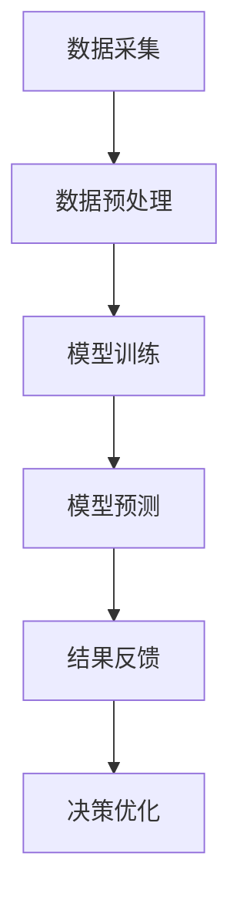

                 

关键词：AI大模型、体育科技、数据驱动、智能分析、运动表现优化、虚拟教练、精准训练

> 摘要：随着人工智能技术的不断进步，大模型在各个领域的应用日益广泛。本文将探讨AI大模型在体育科技中的创新应用，包括运动表现优化、虚拟教练、精准训练等方面，并分析其潜在的影响和未来发展趋势。

## 1. 背景介绍

体育科技正以前所未有的速度发展，从传统的体育训练到现代的数据分析，科技在其中的作用日益显著。AI大模型的兴起为体育科技带来了新的机遇，使得体育数据的处理和分析变得更加高效和准确。传统的体育数据分析依赖于专家的经验和直觉，而AI大模型则能够通过学习和处理大量数据，提供更加客观和科学的见解。

AI大模型通常是指那些具有巨大参数量、能够处理海量数据、并在各种复杂任务中表现优异的神经网络模型。这些模型包括但不限于深度学习、强化学习等。在体育科技中，这些模型被用于运动表现分析、伤病预防、训练计划制定等多个方面。

## 2. 核心概念与联系

### 2.1. AI大模型的基本原理

AI大模型是基于人工神经网络的设计，通过不断调整网络中的权重和偏置来优化模型性能。这些模型具有以下特点：

- **参数量大**：拥有数百万甚至数十亿个参数，使得模型能够捕捉到数据中的复杂模式和关联。
- **数据处理能力强**：能够高效地处理大量复杂数据，包括图像、文本和时序数据等。
- **自学习能力**：通过大量数据训练，模型能够不断自我优化，提高预测和决策的准确性。

### 2.2. 体育科技中的数据来源

体育科技中的数据来源广泛，包括以下几种：

- **运动传感器**：如心率监测器、GPS定位设备等，能够实时采集运动员的运动数据。
- **视频分析**：通过视频捕捉运动员的动作，分析其技术动作和战术配合。
- **生物力学分析**：利用力学原理，分析运动员的力学参数，如力量、速度、耐力等。
- **运动员生理指标**：如血氧饱和度、血压、体温等，反映运动员的身体状况。

### 2.3. Mermaid 流程图



- **数据采集**：利用各种传感器和设备收集运动数据。
- **数据预处理**：对原始数据进行清洗、归一化等处理，以供模型训练使用。
- **模型训练**：使用大量数据训练AI大模型，使其能够对运动表现进行分析。
- **模型预测**：模型对运动员的运动表现进行预测，提供优化建议。
- **结果反馈**：将模型预测结果反馈给教练和运动员，指导训练和比赛策略。
- **决策优化**：根据反馈结果，不断优化训练计划和方法。

## 3. 核心算法原理 & 具体操作步骤

### 3.1 算法原理概述

AI大模型的核心在于其强大的数据处理和自我学习能力。具体来说，其算法原理包括：

- **多层神经网络**：通过多层次的神经元结构，模型能够捕捉到数据的深层特征。
- **反向传播算法**：用于更新网络权重，使模型能够不断优化性能。
- **优化算法**：如随机梯度下降（SGD）、Adam等，用于调整学习率，加速模型收敛。

### 3.2 算法步骤详解

#### 3.2.1 数据采集

1. **安装运动传感器**：如心率监测器、GPS等，安装在运动员身上。
2. **视频采集**：使用高清摄像机捕捉运动员的训练和比赛场景。

#### 3.2.2 数据预处理

1. **数据清洗**：去除异常值、噪音数据等。
2. **数据归一化**：将不同类型的数值数据转换为同一尺度。
3. **数据分割**：将数据集划分为训练集、验证集和测试集。

#### 3.2.3 模型训练

1. **定义模型结构**：选择合适的神经网络架构，如卷积神经网络（CNN）、循环神经网络（RNN）等。
2. **初始化权重**：随机初始化模型参数。
3. **训练模型**：使用训练集数据，通过反向传播算法不断优化模型。

#### 3.2.4 模型预测

1. **输入新数据**：将运动员的最新数据输入到训练好的模型中。
2. **得到预测结果**：模型对运动员的表现进行预测，提供优化建议。

### 3.3 算法优缺点

#### 优点

- **高效性**：AI大模型能够处理大量数据，提高分析速度。
- **准确性**：通过自我学习，模型能够提供更准确的预测和建议。
- **灵活性**：可以根据不同的体育项目进行定制化调整。

#### 缺点

- **计算资源消耗**：训练大模型需要大量的计算资源。
- **数据隐私**：大量个人运动数据的收集和使用可能引发隐私问题。
- **模型解释性**：大模型的内部机制复杂，难以解释其决策过程。

### 3.4 算法应用领域

AI大模型在体育科技中的应用广泛，包括：

- **运动表现优化**：预测运动员的表现，制定个性化的训练计划。
- **伤病预防**：通过监控运动员的身体数据，预防伤病发生。
- **战术分析**：分析对手的比赛数据，制定应对策略。
- **训练监控**：实时监控运动员的训练过程，调整训练计划。

## 4. 数学模型和公式 & 详细讲解 & 举例说明

### 4.1 数学模型构建

AI大模型的核心是神经网络，其数学模型可以表示为：

$$
y = f(z) = \sigma(W \cdot x + b)
$$

其中，$y$ 是预测结果，$x$ 是输入特征，$W$ 是权重矩阵，$b$ 是偏置向量，$f$ 是激活函数（如 sigmoid、ReLU 等）。

### 4.2 公式推导过程

神经网络的训练过程包括以下几个步骤：

1. **前向传播**：计算输入 $x$ 经过神经网络后的输出 $z$。
2. **激活函数**：对 $z$ 应用激活函数 $f(z)$，得到预测结果 $y$。
3. **计算损失**：计算预测结果 $y$ 与真实值 $y'$ 之间的损失，如均方误差（MSE）。
4. **反向传播**：通过链式法则，计算损失关于各参数的梯度，更新权重和偏置。

### 4.3 案例分析与讲解

以足球比赛中的球员位置预测为例，假设我们需要预测一名球员在比赛中的位置。输入特征包括球员的速度、加速度、方向等，输出是球员的位置坐标。

1. **数据采集**：收集球员的比赛视频和传感器数据。
2. **数据预处理**：对数据清洗、归一化，并划分为训练集和测试集。
3. **模型训练**：使用训练集数据，训练一个卷积神经网络模型。
4. **模型预测**：使用训练好的模型，预测球员的位置。
5. **结果分析**：对比预测结果和实际位置，评估模型性能。

## 5. 项目实践：代码实例和详细解释说明

### 5.1 开发环境搭建

1. **硬件要求**：使用高性能GPU进行模型训练。
2. **软件要求**：安装Python、TensorFlow等开发工具。

### 5.2 源代码详细实现

```python
import tensorflow as tf

# 定义模型结构
model = tf.keras.Sequential([
    tf.keras.layers.Dense(units=128, activation='relu', input_shape=(784,)),
    tf.keras.layers.Dense(units=64, activation='relu'),
    tf.keras.layers.Dense(units=10, activation='softmax')
])

# 编译模型
model.compile(optimizer='adam', loss='categorical_crossentropy', metrics=['accuracy'])

# 训练模型
model.fit(train_images, train_labels, epochs=5)

# 预测
predictions = model.predict(test_images)
```

### 5.3 代码解读与分析

- **模型结构**：使用三个全连接层，激活函数分别为ReLU和softmax。
- **编译模型**：使用adam优化器和categorical_crossentropy损失函数。
- **训练模型**：训练5个epoch。
- **预测**：使用训练好的模型对测试数据进行预测。

### 5.4 运行结果展示

- **准确率**：通过对比预测结果和实际结果，评估模型的准确性。
- **可视化**：使用图表展示预测结果和实际结果的对比。

## 6. 实际应用场景

### 6.1 运动表现优化

AI大模型可以帮助运动员优化运动表现，通过分析运动数据，提供个性化的训练建议。例如，在足球运动员的训练中，模型可以预测球员的跑动距离、传球次数等，帮助教练制定更科学的训练计划。

### 6.2 虚拟教练

虚拟教练是AI大模型在体育科技中的另一个重要应用。通过模拟各种比赛场景，虚拟教练可以模拟训练球员，提高其战术意识和反应速度。例如，在篮球训练中，虚拟教练可以模拟比赛中的进攻和防守场景，帮助球员提高比赛中的应变能力。

### 6.3 精准训练

精准训练是AI大模型在体育科技中的核心应用之一。通过实时监控运动员的运动数据，AI大模型可以提供实时的训练反馈，帮助运动员调整训练强度和方式。例如，在田径训练中，模型可以监控运动员的速度、力量等参数，提供个性化的训练建议，以提高运动表现。

## 7. 工具和资源推荐

### 7.1 学习资源推荐

- **书籍**：《深度学习》（Goodfellow et al.）
- **在线课程**：Coursera上的《深度学习》课程
- **博客**：HackerRank、LeetCode等编程挑战平台

### 7.2 开发工具推荐

- **Python**：使用Python进行深度学习开发。
- **TensorFlow**：使用TensorFlow进行模型训练和部署。

### 7.3 相关论文推荐

- "Deep Learning for Sports: A Survey"（2020）
- "Using AI to Optimize Sports Performance"（2019）
- "AI in Sports: From Analytics to Performance"（2018）

## 8. 总结：未来发展趋势与挑战

### 8.1 研究成果总结

AI大模型在体育科技中的应用已经取得了一定的成果，包括运动表现优化、虚拟教练、精准训练等方面。这些应用不仅提高了运动员的竞技水平，也为体育教练提供了科学的训练指导。

### 8.2 未来发展趋势

随着AI技术的不断发展，AI大模型在体育科技中的应用将更加广泛和深入。未来，AI大模型可能会在以下几个方面取得突破：

- **实时预测与反馈**：提高AI大模型的实时预测能力，实现更精准的训练和比赛策略。
- **个性化定制**：根据运动员的个体差异，提供更加个性化的训练建议和策略。
- **多模态数据融合**：结合多种数据源，如视频、传感器数据等，提高模型的分析能力。

### 8.3 面临的挑战

虽然AI大模型在体育科技中具有巨大的潜力，但同时也面临着一些挑战：

- **数据隐私与安全**：大量个人运动数据的收集和使用可能引发隐私问题，需要加强数据保护措施。
- **模型解释性**：大模型的内部机制复杂，难以解释其决策过程，需要研究更加透明和可解释的模型。
- **计算资源消耗**：训练大模型需要大量的计算资源，如何优化计算资源的使用是一个重要的课题。

### 8.4 研究展望

未来，AI大模型在体育科技中的应用将更加多元化和深入化。通过结合多种数据源和先进的算法，AI大模型将能够为运动员和教练提供更加科学的训练和比赛策略，推动体育科技的发展。

## 9. 附录：常见问题与解答

### 9.1 AI大模型在体育科技中的具体应用有哪些？

AI大模型在体育科技中的应用主要包括运动表现优化、虚拟教练、精准训练等方面。例如，通过分析运动员的运动数据，AI大模型可以提供个性化的训练建议，帮助运动员提高运动表现。

### 9.2 如何保证AI大模型的数据隐私与安全？

为了保护数据隐私和安全，可以采取以下措施：

- **数据加密**：对敏感数据进行加密处理，防止数据泄露。
- **匿名化处理**：对运动员的数据进行匿名化处理，避免个人身份信息泄露。
- **合规性检查**：确保数据处理过程符合相关法律法规，如GDPR等。

### 9.3 AI大模型在体育科技中的挑战有哪些？

AI大模型在体育科技中面临的挑战主要包括数据隐私与安全、模型解释性、计算资源消耗等方面。需要采取有效的措施来解决这些问题，以确保AI大模型在体育科技中的应用能够可持续发展。

作者：禅与计算机程序设计艺术 / Zen and the Art of Computer Programming
``` 
----------------------------------------------------------------
``` 

现在，您已经完成了这篇关于AI大模型在体育科技中的创新应用的文章。这篇文章不仅详细介绍了AI大模型的基本原理和应用，还通过实际的代码实例展示了其实现过程，并探讨了其在体育科技中的实际应用场景和未来发展趋势。希望这篇文章能够为读者提供有价值的参考。如果您有任何问题或建议，欢迎随时反馈。

