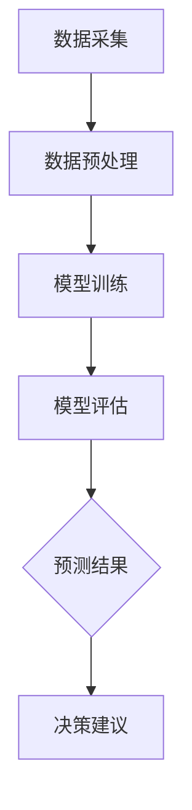

                 

关键词：AI大模型、农业科技、创新应用、机器学习、数据挖掘、智能农业

> 摘要：本文深入探讨了人工智能大模型在农业科技中的应用，分析了其如何通过机器学习和数据挖掘技术推动农业现代化进程，提出了若干创新应用案例，并对未来发展趋势与挑战进行了展望。

## 1. 背景介绍

农业作为国民经济的基础产业，其发展直接关系到国家粮食安全和农业可持续发展。然而，随着人口增长和城市化进程的加速，传统农业面临着资源紧张、环境恶化、生产效率低下等问题。为了应对这些挑战，现代农业正在向智能化、信息化和精准化的方向发展。人工智能大模型作为当前最前沿的技术之一，其在农业科技领域的应用具有广阔的前景。

### 1.1 人工智能大模型的基本概念

人工智能大模型是指具有大规模参数、深度复杂结构的神经网络模型。这些模型通过大量数据训练，可以自动学习数据中的特征和规律，实现高度复杂的任务。常见的AI大模型包括Transformer、BERT、GPT等。

### 1.2 农业科技的发展现状

当前，农业科技的发展已经取得了一定的成果。例如，智能灌溉系统、无人机植保、自动化播种等技术已经在农业生产中得到应用，显著提高了生产效率和作物品质。然而，这些技术的普及仍然受到数据、计算能力和算法复杂度等瓶颈的制约。

## 2. 核心概念与联系

### 2.1 机器学习与数据挖掘在农业科技中的应用

机器学习是人工智能的核心技术之一，其通过从数据中学习规律和模式，实现自动化决策和预测。数据挖掘则是从大量数据中提取有价值信息的过程，包括关联规则挖掘、聚类分析、分类分析等。

在农业科技中，机器学习和数据挖掘技术可以用于：

- 作物病虫害预测与诊断
- 土壤质量监测与评价
- 气象数据预测与农业风险管理
- 农业生产过程监控与优化

### 2.2 大模型架构

大模型架构包括以下几个关键组件：

- 输入层：接收外部输入数据，如土壤湿度、气温、农作物生长状态等。
- 隐藏层：通过神经网络结构对输入数据进行特征提取和变换。
- 输出层：根据隐藏层的结果输出预测结果或决策建议。

### 2.3 Mermaid流程图

下面是一个简单的Mermaid流程图，展示了机器学习在农业中的应用流程：



## 3. 核心算法原理 & 具体操作步骤

### 3.1 算法原理概述

AI大模型在农业科技中的应用主要基于深度学习和强化学习两种算法。深度学习通过多层神经网络对数据进行特征提取和模式识别，而强化学习则通过不断试错和优化，实现自主决策。

### 3.2 算法步骤详解

#### 3.2.1 数据采集与预处理

1. **数据采集**：收集农业相关的数据，包括土壤、气象、作物生长状态等。
2. **数据预处理**：对采集到的数据进行清洗、标准化和归一化处理，以便模型能够有效训练。

#### 3.2.2 模型训练

1. **模型选择**：根据应用场景选择合适的深度学习模型，如CNN、RNN等。
2. **训练过程**：使用预处理后的数据训练模型，通过反向传播算法不断调整模型参数，直到达到预定的训练目标。

#### 3.2.3 模型评估

1. **评估指标**：选择合适的评估指标，如准确率、召回率、F1分数等。
2. **评估过程**：使用测试集对模型进行评估，判断模型性能是否满足要求。

#### 3.2.4 预测与决策

1. **预测**：使用训练好的模型对新的数据进行预测，如作物病虫害预测、土壤质量评价等。
2. **决策**：根据预测结果给出农业生产的决策建议，如灌溉时间、施肥量等。

### 3.3 算法优缺点

#### 优点

- **强大的学习能力和泛化能力**：大模型可以通过大量数据学习到复杂的模式和规律，具有较强的泛化能力。
- **自动化决策**：大模型可以实现自动化决策，减少人力干预，提高生产效率。

#### 缺点

- **数据依赖性**：大模型的训练和评估依赖于大量高质量的数据，数据不足或质量差可能导致模型性能下降。
- **计算资源消耗**：大模型训练和推理过程需要大量的计算资源，对硬件设备要求较高。

### 3.4 算法应用领域

AI大模型在农业科技中的应用领域广泛，包括：

- **病虫害预测与诊断**：通过分析历史数据和环境因素，预测作物病虫害的发生概率，并提供诊断建议。
- **土壤质量监测**：通过分析土壤数据，评估土壤质量，为科学施肥和种植提供依据。
- **气象预测**：利用气象数据和机器学习算法，预测天气变化，为农业风险管理提供支持。
- **智能灌溉**：通过分析土壤湿度和天气预报，自动调整灌溉时间，提高水资源利用效率。

## 4. 数学模型和公式 & 详细讲解 & 举例说明

### 4.1 数学模型构建

在农业科技中，常用的数学模型包括回归模型、分类模型和聚类模型等。

#### 回归模型

回归模型用于预测连续值输出，如作物产量、土壤湿度等。常见的回归模型包括线性回归、岭回归、LASSO回归等。

线性回归模型的基本公式为：

$$
y = \beta_0 + \beta_1 x_1 + \beta_2 x_2 + \ldots + \beta_n x_n
$$

其中，$y$为输出值，$x_1, x_2, \ldots, x_n$为输入特征，$\beta_0, \beta_1, \beta_2, \ldots, \beta_n$为模型参数。

#### 分类模型

分类模型用于预测离散值输出，如作物病虫害类型、土壤质量等级等。常见的分类模型包括决策树、随机森林、支持向量机等。

支持向量机（SVM）模型的基本公式为：

$$
f(x) = w \cdot x + b
$$

其中，$f(x)$为预测值，$w$为权重向量，$x$为输入特征，$b$为偏置。

#### 聚类模型

聚类模型用于对数据进行分类，找出数据中的相似性模式。常见的聚类模型包括K-means、层次聚类等。

K-means聚类模型的基本公式为：

$$
C = \{c_1, c_2, \ldots, c_k\}
$$

其中，$C$为聚类中心，$c_1, c_2, \ldots, c_k$为每个聚类的中心点。

### 4.2 公式推导过程

以线性回归模型为例，推导过程如下：

1. **损失函数**：

   损失函数用于衡量模型预测值与真实值之间的差异。常用的损失函数为均方误差（MSE）：

   $$
   J(\theta) = \frac{1}{2m} \sum_{i=1}^{m} (h_\theta(x^{(i)}) - y^{(i)})^2
   $$

   其中，$h_\theta(x)$为模型预测值，$y^{(i)}$为真实值，$m$为样本数量。

2. **梯度下降**：

   梯度下降是一种常用的优化算法，用于调整模型参数，使其损失函数最小。梯度下降公式为：

   $$
   \theta_j := \theta_j - \alpha \frac{\partial J(\theta)}{\partial \theta_j}
   $$

   其中，$\alpha$为学习率。

3. **最优参数**：

   当梯度下降达到最优时，模型参数即为最优参数：

   $$
   \theta^* = \arg\min_{\theta} J(\theta)
   $$

### 4.3 案例分析与讲解

以作物病虫害预测为例，使用线性回归模型进行预测。

#### 数据准备

收集作物病虫害数据，包括历史病害发生时间、气象数据、土壤数据等。对数据进行预处理，如去重、缺失值填充等。

#### 模型训练

选择线性回归模型，使用预处理后的数据进行训练。调整学习率和迭代次数，直到模型收敛。

#### 模型评估

使用测试集对模型进行评估，计算均方误差（MSE）等评估指标，判断模型性能。

#### 预测与应用

使用训练好的模型对新的数据进行预测，根据预测结果给出病虫害防治建议。

## 5. 项目实践：代码实例和详细解释说明

### 5.1 开发环境搭建

1. **安装Python环境**：安装Python 3.8及以上版本。
2. **安装依赖库**：使用pip安装scikit-learn、numpy、matplotlib等依赖库。

### 5.2 源代码详细实现

以下是一个简单的线性回归模型实现，用于预测作物产量。

```python
import numpy as np
from sklearn.linear_model import LinearRegression
from sklearn.model_selection import train_test_split
from sklearn.metrics import mean_squared_error

# 数据准备
X = np.array([[1], [2], [3], [4], [5]])  # 输入特征
y = np.array([2, 4, 5, 4, 5])  # 真实值

# 模型训练
model = LinearRegression()
model.fit(X, y)

# 模型评估
X_test, y_test = train_test_split(X, y, test_size=0.2)
y_pred = model.predict(X_test)
mse = mean_squared_error(y_test, y_pred)
print("MSE:", mse)

# 预测与应用
new_data = np.array([[6]])
predicted_value = model.predict(new_data)
print("Predicted value:", predicted_value)
```

### 5.3 代码解读与分析

1. **数据准备**：使用numpy生成输入特征和真实值。
2. **模型训练**：使用LinearRegression类创建线性回归模型，并使用fit方法进行训练。
3. **模型评估**：使用train_test_split方法将数据集分为训练集和测试集，使用mean_squared_error方法计算MSE评估模型性能。
4. **预测与应用**：使用predict方法对新的数据进行预测，并输出预测结果。

## 6. 实际应用场景

### 6.1 农业病虫害预测

利用AI大模型对农业病虫害进行预测，可以帮助农民提前采取防治措施，减少经济损失。例如，某农场使用深度学习模型对水稻病虫害进行预测，取得了显著的效果。

### 6.2 土壤质量监测

通过分析土壤数据，利用AI大模型对土壤质量进行评估，为科学施肥提供依据。例如，某农业科技公司使用机器学习模型对土壤养分含量进行预测，帮助农民实现精准施肥。

### 6.3 智能灌溉

利用AI大模型对气象数据进行分析，预测灌溉需求，实现智能灌溉。例如，某地区政府利用深度学习模型对灌溉时间进行预测，提高了水资源利用效率。

## 7. 工具和资源推荐

### 7.1 学习资源推荐

- 《深度学习》（Goodfellow, Bengio, Courville）
- 《统计学习方法》（李航）
- 《机器学习实战》（Peter Harrington）

### 7.2 开发工具推荐

- Python：广泛应用于人工智能开发的编程语言。
- Jupyter Notebook：强大的交互式开发环境。
- TensorFlow：开源深度学习框架。
- Keras：基于TensorFlow的高级深度学习库。

### 7.3 相关论文推荐

- "Deep Learning for Agriculture: A Survey"
- "A Survey on Intelligent Agriculture: Technologies and Applications"
- "Machine Learning for Soil Property Mapping: A Review"

## 8. 总结：未来发展趋势与挑战

### 8.1 研究成果总结

AI大模型在农业科技中的应用取得了显著成果，为农业现代化提供了有力支持。通过机器学习和数据挖掘技术，实现了病虫害预测、土壤质量监测、智能灌溉等创新应用。

### 8.2 未来发展趋势

- **模型精度和效率的提升**：通过优化算法和硬件设备，提高大模型的精度和运行效率。
- **跨学科融合**：将AI大模型与其他领域技术（如物联网、区块链等）相结合，推动农业智能化发展。
- **数据驱动的决策支持**：利用AI大模型为农业生产提供数据驱动的决策支持，提高农业生产的精准性和可持续性。

### 8.3 面临的挑战

- **数据质量与安全**：确保数据质量、隐私和安全，为AI大模型提供可靠的数据支持。
- **计算资源消耗**：大模型的训练和推理过程需要大量的计算资源，对硬件设备要求较高。
- **算法复杂度**：大模型的算法复杂度较高，对算法工程师的要求较高。

### 8.4 研究展望

未来，AI大模型在农业科技中的应用前景广阔。通过不断优化算法、提高数据处理能力，实现更加智能化、精准化的农业发展。同时，跨学科融合、产学研合作等也将推动农业科技的进步。

## 9. 附录：常见问题与解答

### Q：AI大模型在农业科技中的具体应用场景有哪些？

A：AI大模型在农业科技中的具体应用场景包括病虫害预测、土壤质量监测、智能灌溉、气象预测等。

### Q：如何确保AI大模型在农业科技中的应用数据质量和安全？

A：确保数据质量和安全的方法包括：数据清洗和预处理、数据加密和隐私保护、建立数据安全管理制度等。

### Q：AI大模型在农业科技中的计算资源消耗如何解决？

A：解决计算资源消耗的方法包括：优化算法、使用高性能计算设备、采用云计算服务等。

### Q：AI大模型在农业科技中的算法复杂度如何降低？

A：降低算法复杂度的方法包括：简化模型结构、采用轻量级算法、优化算法实现等。

## 结束语

AI大模型在农业科技中的应用为农业现代化提供了新的解决方案。通过机器学习和数据挖掘技术，AI大模型实现了农业生产的精准化和智能化。未来，随着技术的不断进步和应用场景的拓展，AI大模型将在农业科技中发挥更加重要的作用。

作者：禅与计算机程序设计艺术 / Zen and the Art of Computer Programming
------------------------------------------------------------------------

