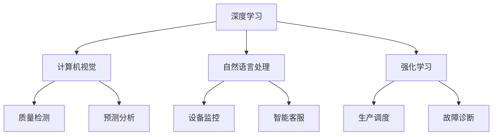

                 

关键词：人工智能、大模型、制造业、应用前景、创业机会、算法原理、数学模型、项目实践、工具资源、未来趋势

摘要：本文深入探讨了人工智能大模型在制造业中的应用前景与创业机会。通过对制造业现状的分析，我们指出了AI大模型在此领域的核心价值，并详细介绍了其算法原理、数学模型和应用案例。同时，文章还探讨了未来发展趋势、面临挑战以及研究展望，为制造业AI大模型的开发和应用提供了参考。

## 1. 背景介绍

随着全球制造业的快速发展和信息化进程的推进，人工智能（AI）技术的应用已成为制造业转型升级的重要驱动力。特别是近年来，大模型技术在自然语言处理、计算机视觉、语音识别等领域取得了突破性进展，为制造业提供了强大的技术支持。

制造业面临诸多挑战，如生产效率低下、资源浪费、质量不稳定等。传统的自动化技术和传感器技术难以满足制造业的智能化需求。而AI大模型则能够通过深度学习、强化学习等技术手段，实现智能决策、预测分析、故障诊断等功能，从而大幅提升制造业的生产效率、降低成本、提高产品质量。

## 2. 核心概念与联系

在制造业中，AI大模型的应用涉及多个核心概念和技术，如深度学习、强化学习、计算机视觉、自然语言处理等。以下是一个简化的Mermaid流程图，展示了这些概念之间的联系。



### 2.1 深度学习与计算机视觉

深度学习是AI大模型的核心技术之一。在制造业中，计算机视觉技术通过深度学习算法，可以实现对生产现场图像的自动识别、分类、检测等操作。例如，通过对机器视觉系统进行深度学习训练，可以实现自动检测生产线上的缺陷产品，提高产品质量。

### 2.2 自然语言处理与设备监控

自然语言处理技术使得AI大模型能够理解和处理人类语言。在制造业中，设备监控、故障诊断等任务可以通过自然语言处理技术实现。例如，通过对设备运行数据的分析，AI大模型可以识别出设备的潜在故障，并生成维修建议。

### 2.3 强化学习与生产调度

强化学习是一种通过试错和反馈优化决策策略的算法。在制造业中，强化学习可以用于生产调度、设备维护等任务。例如，通过训练强化学习模型，可以实现根据生产需求自动调整生产线上的设备运行状态，从而提高生产效率。

## 3. 核心算法原理 & 具体操作步骤

### 3.1 算法原理概述

AI大模型在制造业中的应用主要基于深度学习和强化学习等算法。深度学习通过多层神经网络，实现对数据的自动特征提取和建模；强化学习则通过试错和反馈，优化决策策略。

### 3.2 算法步骤详解

以深度学习为例，算法步骤主要包括：

1. 数据预处理：对生产数据（如图像、传感器数据等）进行清洗、归一化等处理，以适应模型训练。

2. 构建模型：设计并构建多层神经网络结构，用于自动提取数据特征。

3. 模型训练：使用大量生产数据对模型进行训练，优化网络参数。

4. 模型评估：使用测试数据对模型性能进行评估，并根据评估结果调整模型参数。

5. 模型部署：将训练好的模型部署到实际生产环境中，用于故障诊断、预测分析等任务。

### 3.3 算法优缺点

- **深度学习**：优点包括强大的特征提取能力和自适应能力，缺点包括需要大量数据、训练时间长等。

- **强化学习**：优点包括能够通过试错优化决策策略，缺点包括训练过程需要大量时间、对环境变化敏感等。

### 3.4 算法应用领域

AI大模型在制造业中的应用领域广泛，包括：

- **质量检测**：通过计算机视觉技术，实现对生产线产品质量的自动检测。

- **故障诊断**：通过自然语言处理技术，实现对设备运行数据的自动分析和故障诊断。

- **生产调度**：通过强化学习技术，实现生产设备的自动调度和优化。

## 4. 数学模型和公式 & 详细讲解 & 举例说明

### 4.1 数学模型构建

AI大模型在制造业中的应用涉及到多种数学模型，如神经网络模型、强化学习模型等。以下是一个简化的神经网络模型示例：

$$
y = \sigma(W_1 \cdot x + b_1)
$$

其中，$y$ 是输出值，$\sigma$ 是激活函数，$W_1$ 是权重矩阵，$x$ 是输入值，$b_1$ 是偏置项。

### 4.2 公式推导过程

神经网络模型的训练过程主要包括两个步骤：前向传播和反向传播。

1. **前向传播**：

$$
z = W_1 \cdot x + b_1
$$

$$
a = \sigma(z)
$$

2. **反向传播**：

计算误差：

$$
E = \frac{1}{2} \sum_{i=1}^{n} (y_i - a_i)^2
$$

计算权重和偏置的梯度：

$$
\frac{\partial E}{\partial W_1} = (y - a) \cdot \frac{\partial a}{\partial z} \cdot x
$$

$$
\frac{\partial E}{\partial b_1} = (y - a) \cdot \frac{\partial a}{\partial z}
$$

更新权重和偏置：

$$
W_1 = W_1 - \alpha \cdot \frac{\partial E}{\partial W_1}
$$

$$
b_1 = b_1 - \alpha \cdot \frac{\partial E}{\partial b_1}
$$

其中，$\alpha$ 是学习率。

### 4.3 案例分析与讲解

以生产线质量检测为例，假设我们使用神经网络模型对产品缺陷进行分类。输入数据为产品图像，输出数据为缺陷标签。

1. 数据预处理：对产品图像进行灰度化、归一化等处理。

2. 模型构建：设计一个简单的全连接神经网络，输入层、隐藏层和输出层分别有3个神经元。

3. 模型训练：使用大量带标签的产品图像进行训练。

4. 模型评估：使用测试集评估模型性能，如准确率、召回率等。

5. 模型部署：将训练好的模型部署到生产线，实现对产品缺陷的实时检测。

## 5. 项目实践：代码实例和详细解释说明

### 5.1 开发环境搭建

- 安装Python环境，版本要求为3.6及以上。
- 安装深度学习框架TensorFlow。
- 安装图像处理库OpenCV。

### 5.2 源代码详细实现

以下是一个简单的基于TensorFlow实现的神经网络模型，用于产品缺陷检测。

```python
import tensorflow as tf
from tensorflow.keras import layers

# 构建模型
model = tf.keras.Sequential([
    layers.Flatten(input_shape=(28, 28)),
    layers.Dense(128, activation='relu'),
    layers.Dense(10, activation='softmax')
])

# 编译模型
model.compile(optimizer='adam',
              loss='categorical_crossentropy',
              metrics=['accuracy'])

# 训练模型
model.fit(x_train, y_train, epochs=5, batch_size=32)
```

### 5.3 代码解读与分析

1. **模型构建**：

   使用`tf.keras.Sequential`创建一个序列模型，包含一个展平层（`Flatten`）、一个全连接层（`Dense`）和一个softmax输出层。

2. **编译模型**：

   使用`compile`方法编译模型，指定优化器、损失函数和评估指标。

3. **训练模型**：

   使用`fit`方法训练模型，传入训练数据、标签和训练参数。

### 5.4 运行结果展示

训练完成后，使用测试数据评估模型性能：

```python
test_loss, test_acc = model.evaluate(x_test, y_test, verbose=2)
print('\nTest accuracy:', test_acc)
```

## 6. 实际应用场景

### 6.1 质量检测

AI大模型在生产线质量检测中的应用非常广泛。通过计算机视觉技术，AI大模型可以实时检测产品缺陷，提高产品质量。例如，汽车制造业中，AI大模型可以用于检测车身焊接缺陷、涂漆质量等。

### 6.2 设备监控

AI大模型可以通过分析设备运行数据，实现设备监控和故障预测。例如，在制造业中，AI大模型可以实时监测生产设备的运行状态，预测潜在故障，并提前进行维护，从而降低设备故障率。

### 6.3 生产调度

AI大模型可以通过强化学习技术，实现生产调度的优化。例如，在制造业中，AI大模型可以根据生产需求和设备状态，自动调整生产计划，提高生产效率。

## 7. 工具和资源推荐

### 7.1 学习资源推荐

- 《深度学习》（Goodfellow, Bengio, Courville 著）
- 《强化学习手册》（Richard S. Sutton, Andrew G. Barto 著）
- 《计算机视觉基础与算法》（Richard S.zelinsky 著）

### 7.2 开发工具推荐

- TensorFlow
- PyTorch
- OpenCV

### 7.3 相关论文推荐

- “Deep Learning for Manufacturing: A Survey”（2020）
- “A Survey on Artificial Intelligence Applications in Manufacturing”（2021）
- “Deep Reinforcement Learning for Production Scheduling”（2019）

## 8. 总结：未来发展趋势与挑战

### 8.1 研究成果总结

AI大模型在制造业中的应用已经取得了显著成果，主要表现在：

- 提高生产效率
- 降低生产成本
- 提高产品质量
- 实现设备智能监控和故障预测

### 8.2 未来发展趋势

未来，AI大模型在制造业中的应用将呈现以下趋势：

- 模型将更加复杂和强大，能够处理更复杂的任务
- 应用领域将更加广泛，从生产制造到供应链管理
- 与物联网（IoT）技术深度融合，实现全产业链的智能化

### 8.3 面临的挑战

AI大模型在制造业中的应用仍然面临以下挑战：

- 数据质量和数据量
- 模型解释性和可解释性
- 安全性和隐私保护
- 模型部署和运维

### 8.4 研究展望

未来，研究者可以从以下方面进行探索：

- 提高数据质量和数据量，为模型训练提供更好的支持
- 开发可解释性强、易于部署的AI大模型
- 加强AI大模型在制造业领域的应用研究，解决实际问题
- 探索AI大模型与IoT技术的深度融合，实现全产业链的智能化

## 9. 附录：常见问题与解答

### 9.1 什么是AI大模型？

AI大模型是指具有大规模参数、能够处理大规模数据、并在特定任务上取得优异效果的深度学习模型。例如，GPT-3、BERT等模型。

### 9.2 AI大模型在制造业中的应用有哪些？

AI大模型在制造业中的应用包括质量检测、设备监控、生产调度等。

### 9.3 如何保证AI大模型的可解释性？

提高AI大模型的可解释性可以通过以下方法实现：

- 使用可解释性较强的模型结构
- 分析模型决策过程
- 增加模型注释和文档

## 作者署名

作者：禅与计算机程序设计艺术 / Zen and the Art of Computer Programming

----------------------------------------------------------------

文章撰写完毕。希望这篇文章能为您提供关于AI大模型在制造业应用的前沿视角和实用指导。如有任何问题或建议，欢迎随时交流。再次感谢您的阅读！

