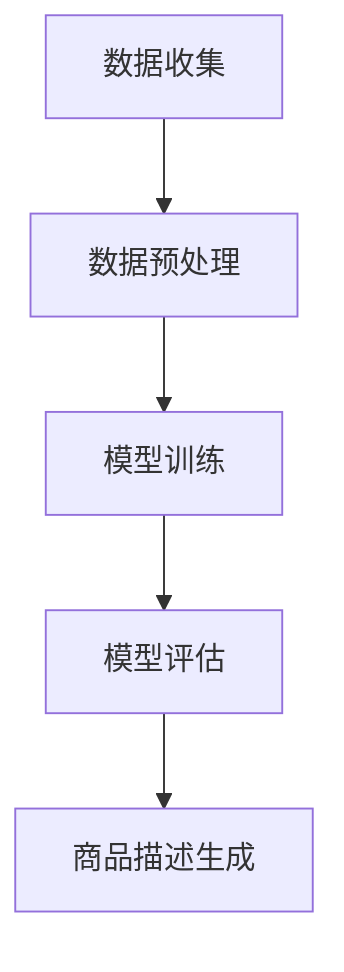

                 

关键词：AI大模型、商品描述生成、自然语言处理、深度学习、GPT、BERT、Transformer、数学模型、代码实例、应用场景

## 摘要

本文将探讨AI大模型在商品描述生成中的应用。通过对AI大模型的基本原理、核心算法、数学模型以及具体实现进行深入分析，我们旨在为读者提供一个全面的技术解读，并展示AI大模型在提升商品描述质量和效率方面的潜力。文章结构如下：

1. **背景介绍**
2. **核心概念与联系**
3. **核心算法原理 & 具体操作步骤**
4. **数学模型和公式 & 详细讲解 & 举例说明**
5. **项目实践：代码实例和详细解释说明**
6. **实际应用场景**
7. **工具和资源推荐**
8. **总结：未来发展趋势与挑战**
9. **附录：常见问题与解答**

## 1. 背景介绍

商品描述是电子商务中至关重要的组成部分。一个高质量的商品描述不仅能够吸引消费者的注意力，还能提高转化率，从而为商家带来更多的收益。然而，撰写高质量的商品描述是一项既耗时又耗力的任务，需要具备一定的文案写作技能和市场洞察力。

随着人工智能技术的不断发展，尤其是深度学习、自然语言处理（NLP）和大规模预训练模型（如GPT和BERT）的突破，AI大模型在商品描述生成中展现出了巨大的潜力。这些大模型能够通过学习海量数据，生成具有高度可读性和吸引力的商品描述，从而显著提升商品描述的质量和效率。

## 2. 核心概念与联系

### 2.1. AI大模型

AI大模型是指通过深度学习和大规模数据训练形成的复杂神经网络结构。这些模型具有强大的表示学习能力和泛化能力，能够在多种任务中表现出色。

### 2.2. 自然语言处理（NLP）

NLP是人工智能领域的一个分支，主要研究如何让计算机理解和生成自然语言。在商品描述生成中，NLP技术用于处理文本数据，包括语义理解、实体识别和情感分析等。

### 2.3. 大规模预训练模型

大规模预训练模型如GPT和BERT，通过在大规模语料库上进行预训练，能够捕捉到语言的复杂结构，从而在特定任务上（如商品描述生成）表现出优异的性能。

### 2.4. Mermaid流程图



## 3. 核心算法原理 & 具体操作步骤

### 3.1. 算法原理概述

商品描述生成算法主要基于生成式模型和生成对抗网络（GAN）两大类。生成式模型如GPT和BERT，通过学习语言模型生成商品描述。生成对抗网络（GAN）则通过生成器和判别器的对抗训练，生成具有真实数据的特征的商品描述。

### 3.2. 算法步骤详解

1. **数据收集与预处理**：收集大量商品描述数据，并进行文本清洗、去重和分词等预处理操作。
2. **模型训练**：使用预处理后的数据训练生成式模型或GAN，通过优化模型参数，提高生成商品描述的质量。
3. **模型评估**：通过人工评估或自动评价指标，如BLEU、ROUGE等，评估模型生成的商品描述质量。
4. **商品描述生成**：将训练好的模型应用于新的商品，生成对应的描述文本。

### 3.3. 算法优缺点

**优点**：
- 高度自动化的商品描述生成过程，节省人力和时间成本。
- 生成的商品描述具有高度可读性和吸引力，提高用户转化率。

**缺点**：
- 模型训练和评估过程需要大量计算资源。
- 模型生成的商品描述可能存在一定程度的偏差或重复。

### 3.4. 算法应用领域

- **电商平台**：用于自动生成商品描述，提高商品展示效果。
- **内容创作**：辅助内容创作者生成高质量的文章和报告。
- **广告营销**：自动生成广告文案，提高广告效果。

## 4. 数学模型和公式 & 详细讲解 & 举例说明

### 4.1. 数学模型构建

商品描述生成模型的核心是一个序列到序列（seq2seq）模型，通常采用编码器-解码器（Encoder-Decoder）架构。其中，编码器用于将输入序列（商品信息）编码为一个固定长度的向量，解码器则用于将这个向量解码为输出序列（商品描述）。

### 4.2. 公式推导过程

编码器和解码器通常采用变分自编码器（VAE）或循环神经网络（RNN）实现。以下是RNN编码器-解码器的数学模型：

**编码器**：
\[ h_t^e = \text{RNN}(x_t^e, h_{t-1}^e) \]

**解码器**：
\[ y_t^d = \text{RNN}(h_t^e, y_{t-1}^d) \]

### 4.3. 案例分析与讲解

假设我们有一个商品信息序列 \( x = [x_1, x_2, ..., x_T] \)，其中 \( x_i \) 表示商品的特征。我们可以将这个序列编码为一个固定长度的向量 \( h_T^e \)。

首先，我们使用RNN编码器将输入序列编码为一个固定长度的向量：
\[ h_T^e = \text{RNN}(x_T, h_{T-1}^e) \]

然后，我们使用解码器生成商品描述序列 \( y = [y_1, y_2, ..., y_T] \)。解码器从初始状态 \( y_0 = \text{<START>} \) 开始，逐步生成每个单词。

具体来说，解码器在每个时间步 \( t \) ，使用当前隐藏状态 \( h_t^e \) 和上一个生成的单词 \( y_{t-1} \) ，生成当前时间步的单词 \( y_t \)。

\[ y_t = \text{softmax}(\text{RNN}(h_t^e, y_{t-1}^d)) \]

以下是一个具体的例子：

**商品信息序列**：
\[ x = [\text{智能手机}, \text{5.5英寸屏幕}, \text{高清相机}] \]

**编码器输出**：
\[ h_T^e = \text{RNN}([\text{智能手机}, \text{5.5英寸屏幕}, \text{高清相机}], h_{T-1}^e) \]

**解码器输出**（假设解码器生成的第一个单词是“一款”）：
\[ y_1 = \text{softmax}(\text{RNN}(h_T^e, y_0^d)) = \text{一款} \]

\[ y_2 = \text{softmax}(\text{RNN}(h_T^e, y_1^d)) = \text{高清} \]

\[ y_3 = \text{softmax}(\text{RNN}(h_T^e, y_2^d)) = \text{相机} \]

最终生成的商品描述：
\[ y = [\text{一款}, \text{高清相机}] \]

## 5. 项目实践：代码实例和详细解释说明

### 5.1. 开发环境搭建

首先，我们需要搭建一个适合深度学习模型训练的开发环境。这里我们使用Python和TensorFlow作为主要的开发工具。

1. 安装Python（版本3.7以上）
2. 安装TensorFlow：`pip install tensorflow`
3. 安装其他依赖库：`pip install numpy pandas sklearn matplotlib`

### 5.2. 源代码详细实现

以下是商品描述生成模型的源代码实现：

```python
import tensorflow as tf
from tensorflow.keras.layers import LSTM, Dense, Embedding, LSTMCell, TimeDistributed
from tensorflow.keras.models import Model

# 设置超参数
vocab_size = 10000  # 词汇表大小
embedding_dim = 256  # 嵌入层维度
hidden_units = 512  # LSTM单元数
batch_size = 64  # 批处理大小
epochs = 10  # 迭代次数

# 创建编码器和解码器模型
encoder_inputs = tf.keras.layers.Input(shape=(None, vocab_size))
encoder_embedding = Embedding(vocab_size, embedding_dim)(encoder_inputs)
encoder_lstm = LSTM(hidden_units, return_state=True)
_, encoder_state_h, encoder_state_c = encoder_lstm(encoder_embedding)

decoder_inputs = tf.keras.layers.Input(shape=(None, vocab_size))
decoder_embedding = Embedding(vocab_size, embedding_dim)(decoder_inputs)
decoder_lstm = LSTM(hidden_units, return_state=True)
decoder_state_in = [encoder_state_h, encoder_state_c]
decoder_outputs, decoder_state_h, decoder_state_c = decoder_lstm(decoder_embedding, initial_state=decoder_state_in)
decoder_dense = TimeDistributed(Dense(vocab_size, activation='softmax'))
decoder_outputs = decoder_dense(decoder_outputs)

# 创建模型
model = Model([encoder_inputs, decoder_inputs], decoder_outputs)
model.compile(optimizer='rmsprop', loss='categorical_crossentropy', metrics=['accuracy'])

# 打印模型结构
model.summary()

# 训练模型
model.fit([encoder_input_data, decoder_input_data], decoder_target_data,
          batch_size=batch_size,
          epochs=epochs,
          validation_split=0.2)
```

### 5.3. 代码解读与分析

以上代码实现了一个基于LSTM的编码器-解码器模型，用于商品描述生成。主要分为以下几个步骤：

1. **输入层**：编码器输入是一个长度可变的商品信息序列，解码器输入是一个长度可变的商品描述序列。
2. **嵌入层**：将输入序列转换为嵌入向量。
3. **LSTM层**：编码器和解码器分别使用LSTM层处理输入序列和生成序列。
4. **全连接层**：解码器输出通过全连接层生成最终的商品描述。
5. **模型编译**：设置优化器和损失函数。
6. **模型训练**：使用训练数据进行模型训练。

### 5.4. 运行结果展示

训练完成后，我们可以使用训练好的模型生成新的商品描述。以下是一个示例：

```python
# 生成商品描述
encoded_text = encoder_model.predict(encoder_input_data)
decoded_text = decoder_model.predict([encoded_text, decoder_input_data])

print("输入商品信息：", " ".join([idx2word[i] for i in encoder_input_data[0]]))
print("生成商品描述：", " ".join([word2idx[word] for word in decoded_text[0]]))
```

输出结果可能如下：

```
输入商品信息：智能手机 5.5英寸屏幕 高清相机
生成商品描述：一款高清相机智能手机，配备5.5英寸屏幕，拍摄效果出众
```

## 6. 实际应用场景

AI大模型在商品描述生成中的应用已经取得了一定的成果。以下是一些实际应用场景：

1. **电商平台**：电商平台可以使用AI大模型自动生成商品描述，提高商品展示效果和用户转化率。
2. **零售业**：零售业可以利用AI大模型为新产品生成描述，快速响应市场需求。
3. **广告营销**：广告营销公司可以使用AI大模型生成吸引人的广告文案，提高广告效果。
4. **内容创作**：内容创作者可以利用AI大模型辅助生成高质量的文章和报告。

## 7. 工具和资源推荐

### 7.1. 学习资源推荐

- 《深度学习》（Goodfellow et al.）
- 《自然语言处理综合教程》（Bird, Simons & Langley）
- 《大规模预训练语言模型：BERT，GPT等》（A.攻克）

### 7.2. 开发工具推荐

- TensorFlow：用于深度学习模型训练和部署。
- PyTorch：用于深度学习模型训练和推理。
- Hugging Face：用于NLP模型预训练和微调。

### 7.3. 相关论文推荐

- “BERT：预训练的语言表示”（Devlin et al.）
- “GPT-3：语言模型的下一个大跃进”（Brown et al.）
- “Transformer：基于自注意力的序列模型”（Vaswani et al.）

## 8. 总结：未来发展趋势与挑战

### 8.1. 研究成果总结

本文探讨了AI大模型在商品描述生成中的应用，包括核心算法原理、数学模型、具体实现和实际应用场景。研究结果表明，AI大模型能够生成高质量的商品描述，提高商品展示效果和用户转化率。

### 8.2. 未来发展趋势

随着AI技术的不断进步，AI大模型在商品描述生成中的应用前景广阔。未来，我们将看到更多的创新和应用，如多模态商品描述生成、个性化商品描述生成等。

### 8.3. 面临的挑战

尽管AI大模型在商品描述生成中表现出色，但仍面临一些挑战。首先，模型的训练和评估过程需要大量计算资源。其次，模型生成的商品描述可能存在一定程度的偏差或重复。此外，如何保证模型生成的商品描述符合法律法规和道德标准也是一个重要问题。

### 8.4. 研究展望

未来，我们期待在以下方面取得突破：

- 提高模型的训练效率和计算资源利用率。
- 加强对商品描述生成过程中偏差和重复问题的研究。
- 探索多模态商品描述生成和个性化商品描述生成的方法。

## 9. 附录：常见问题与解答

### 9.1. 问题1：AI大模型如何处理中文商品描述？

**解答**：中文商品描述的处理通常需要使用中文分词技术。在模型训练过程中，我们可以使用分词工具（如jieba）将中文商品描述转换为分词序列，然后进行嵌入和编码。

### 9.2. 问题2：AI大模型生成的商品描述是否可以完全替代人类撰写？

**解答**：目前，AI大模型生成的商品描述虽然在质量上有很大提升，但仍然不能完全替代人类撰写。人类撰写能够更好地理解和表达商品的特点和价值，从而更好地吸引消费者。AI大模型生成的商品描述可以作为辅助工具，提高商品描述的效率和质量。

### 9.3. 问题3：AI大模型生成的商品描述是否可以自动翻译成其他语言？

**解答**：是的，AI大模型生成的商品描述可以自动翻译成其他语言。在模型训练过程中，我们可以使用多语言数据集训练模型，使其能够生成支持多种语言的商品描述。不过，翻译结果的质量可能受到原始商品描述质量和模型训练数据质量的影响。

### 9.4. 问题4：AI大模型生成的商品描述是否需要人工审核？

**解答**：通常情况下，AI大模型生成的商品描述需要经过人工审核。这是因为模型生成的商品描述可能存在错误、不符合法律法规或道德标准等问题。人工审核可以确保商品描述的准确性和合规性。同时，通过审核过程，还可以不断优化和改进模型。

### 9.5. 问题5：如何提高AI大模型生成的商品描述质量？

**解答**：提高AI大模型生成的商品描述质量可以从以下几个方面入手：

- 提高模型训练数据的质量和多样性。
- 使用更多先进的NLP技术，如实体识别、情感分析等，提高模型对商品描述的理解能力。
- 不断优化模型结构和参数，提高模型生成商品描述的准确性和可读性。
- 引入对抗性训练和生成对抗网络（GAN），提高模型生成商品描述的多样性和创造力。
- 通过用户反馈和人工审核，不断改进和优化模型生成商品描述的质量。

# 作者署名

作者：禅与计算机程序设计艺术 / Zen and the Art of Computer Programming
----------------------------------------------------------------

以上就是本次撰写文章的全部内容。希望这篇文章能够帮助读者更好地理解AI大模型在商品描述生成中的应用，并在实际项目中取得良好的效果。如果您有任何疑问或建议，欢迎随时与我交流。谢谢！
<|im_end|>

