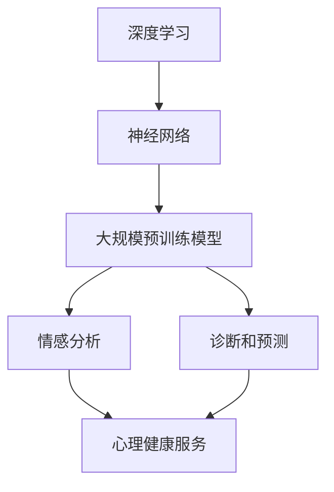

                 

### 关键词 Keyword List

- AI 大模型
- 心理健康
- 商业化
- 算法应用
- 数学模型
- 项目实践
- 未来展望

<|assistant|>### 摘要 Abstract

本文将深入探讨人工智能（AI）大模型在心理健康领域的商业化应用。首先，我们将介绍 AI 大模型的基本概念和当前在心理健康领域的应用现状。接着，我们将详细解析这些大模型的算法原理、数学模型以及具体操作步骤。通过实际项目实践，我们将展示代码实例并详细解读分析。此外，本文还将探讨 AI 大模型在实际应用场景中的表现，以及未来的发展趋势和面临的挑战。最后，我们将推荐一些学习和开发资源，并总结研究成果，为未来研究提供方向。

<|assistant|>### 1. 背景介绍

人工智能（AI）技术在过去几十年里取得了飞速发展，从最初的规则系统到复杂的神经网络，再到如今的大规模预训练模型，AI 的能力和应用范围不断扩展。特别是在心理健康领域，AI 大模型的引入为疾病的诊断、治疗和预防提供了全新的解决方案。

心理健康问题在全球范围内日益严重。据世界卫生组织（WHO）统计，全球有超过 3 亿人患有抑郁症，另有 1 亿人患有焦虑症。这些疾病不仅给患者本人带来极大的痛苦，也对社会和经济造成了巨大的负担。传统的心理健康服务往往需要耗费大量的人力和时间，且受限于专业人员数量和素质，无法满足日益增长的需求。

AI 大模型的出现为心理健康领域带来了革命性的变化。通过深度学习和自然语言处理等技术，AI 大模型可以从大量数据中提取出有用的信息，帮助诊断和治疗心理健康问题。同时，AI 大模型可以实时分析患者的情况，提供个性化的建议和治疗方案，大大提高了心理健康服务的效率和准确性。

### 2. 核心概念与联系

为了更好地理解 AI 大模型在心理健康领域的应用，我们首先需要了解一些核心概念，包括深度学习、神经网络和大规模预训练模型等。

#### 2.1 深度学习

深度学习是一种基于人工神经网络的机器学习技术。与传统的机器学习方法不同，深度学习通过多层神经网络来学习数据中的复杂模式。这些多层神经网络可以自动提取数据中的特征，从而实现复杂的任务，如图像识别、语音识别和自然语言处理等。

在心理健康领域，深度学习技术被广泛应用于情感分析、诊断和预测等方面。通过训练深度学习模型，我们可以从患者的文字描述、语音和面部表情等数据中提取出情感特征，从而诊断出心理疾病或评估治疗效果。

#### 2.2 神经网络

神经网络是深度学习的基础。一个简单的神经网络由多个神经元组成，每个神经元都是一个简单的函数，用于处理输入数据并产生输出。神经网络通过不断调整神经元之间的连接权重，来学习输入数据和目标输出之间的关系。

在心理健康领域，神经网络被用于构建诊断模型和预测模型。通过训练神经网络，我们可以让模型学会从患者的数据中提取出关键特征，从而准确诊断出心理疾病。

#### 2.3 大规模预训练模型

大规模预训练模型是当前深度学习的热点研究方向。这类模型通过在大量无标签数据上进行预训练，然后再在特定任务上进行微调，从而实现出色的性能。

在心理健康领域，大规模预训练模型被用于构建情感分析、诊断和预测等模型。通过预训练，模型可以从大量的健康文本数据中提取出丰富的语言特征，从而提高模型在心理健康领域的准确性和泛化能力。

#### 2.4 Mermaid 流程图

以下是 AI 大模型在心理健康领域的应用流程图，展示了核心概念之间的联系：



<|assistant|>### 3. 核心算法原理 & 具体操作步骤

#### 3.1 算法原理概述

AI 大模型在心理健康领域的核心算法主要包括深度学习、神经网络和大规模预训练模型。这些算法通过从大量数据中学习，提取出有用的特征和规律，从而实现心理健康问题的诊断、治疗和预测。

深度学习通过多层神经网络学习数据中的复杂模式，可以用于情感分析、诊断和预测。神经网络通过不断调整连接权重，实现从输入到输出的映射，适用于各种复杂数据处理任务。

大规模预训练模型通过在大量无标签数据上进行预训练，然后再在特定任务上进行微调，实现出色的性能。这类模型在心理健康领域中，可以从大量的健康文本数据中提取出丰富的语言特征，从而提高模型的准确性和泛化能力。

#### 3.2 算法步骤详解

以下是 AI 大模型在心理健康领域应用的详细步骤：

1. **数据收集**：收集与心理健康相关的数据，包括文本、语音、面部表情等。

2. **数据预处理**：对收集到的数据进行清洗、归一化和特征提取，为模型训练做好准备。

3. **模型训练**：利用深度学习、神经网络和大规模预训练模型对预处理后的数据进行训练。

4. **模型评估**：在验证集上评估模型的性能，调整模型参数，提高模型准确性和泛化能力。

5. **模型部署**：将训练好的模型部署到实际应用场景中，如心理健康诊断、治疗和预测等。

6. **结果分析**：对模型输出的结果进行分析，为心理健康服务提供依据。

#### 3.3 算法优缺点

**优点**：

- **高效性**：AI 大模型可以从大量数据中快速提取特征，实现高效的诊断和预测。
- **准确性**：通过深度学习和大规模预训练，模型在心理健康领域的准确性和泛化能力得到显著提升。
- **个性化**：AI 大模型可以根据患者的具体情况进行个性化分析，提高心理健康服务的质量。

**缺点**：

- **数据依赖性**：AI 大模型需要大量高质量的数据进行训练，数据不足或质量不高会影响模型性能。
- **解释性**：深度学习模型的内部结构较为复杂，难以解释，导致模型决策过程缺乏透明度。
- **隐私问题**：心理健康数据涉及个人隐私，如何确保数据安全和隐私保护是重要问题。

#### 3.4 算法应用领域

AI 大模型在心理健康领域的应用包括但不限于：

- **心理健康诊断**：通过情感分析和诊断模型，识别患者可能存在的心理健康问题。
- **心理健康治疗**：利用预测模型，为患者提供个性化的治疗方案，提高治疗效果。
- **心理健康预防**：通过数据分析和趋势预测，及时发现潜在的心理健康问题，预防疾病发生。

<|assistant|>### 4. 数学模型和公式 & 详细讲解 & 举例说明

#### 4.1 数学模型构建

在 AI 大模型中，常见的数学模型包括神经网络和深度学习模型。以下是一个简单的神经网络模型构建过程：

1. **输入层**：接收输入数据，如患者的文本、语音或面部表情等。
2. **隐藏层**：通过非线性激活函数，对输入数据进行变换，提取特征。
3. **输出层**：产生最终输出，如诊断结果、治疗方案等。

假设我们构建一个二分类问题，即判断患者是否患有心理疾病，神经网络模型可以表示为：

$$
\begin{aligned}
z_i &= w_i \cdot x_i + b_i \\
a_i &= \sigma(z_i) \\
y &= w \cdot a + b
\end{aligned}
$$

其中，$x_i$ 是输入特征，$w_i$ 和 $b_i$ 分别是输入层和隐藏层的权重和偏置，$\sigma$ 是激活函数，$a_i$ 是隐藏层输出，$y$ 是输出结果。

#### 4.2 公式推导过程

以一个简单的多层感知机（MLP）模型为例，说明神经网络模型的推导过程：

1. **前向传播**：计算输入层到隐藏层的输出，以及隐藏层到输出层的输出。
2. **反向传播**：计算输出层误差，并更新隐藏层和输入层的权重和偏置。

具体推导过程如下：

1. **前向传播**：

$$
\begin{aligned}
z_i^{(l)} &= \sum_{j} w_{ji}^{(l)} \cdot a_j^{(l-1)} + b_i^{(l)} \\
a_i^{(l)} &= \sigma(z_i^{(l)})
\end{aligned}
$$

其中，$z_i^{(l)}$ 是第 $l$ 层第 $i$ 个节点的输入，$a_i^{(l)}$ 是第 $l$ 层第 $i$ 个节点的输出，$w_{ji}^{(l)}$ 和 $b_i^{(l)}$ 分别是第 $l$ 层第 $i$ 个节点到第 $l-1$ 层第 $j$ 个节点的权重和偏置。

2. **反向传播**：

$$
\begin{aligned}
\delta_i^{(l)} &= (y - a_i^{(l)}) \cdot \sigma'(z_i^{(l)}) \\
\Delta w_{ji}^{(l)} &= \alpha \cdot \delta_i^{(l)} \cdot a_j^{(l-1)} \\
\Delta b_i^{(l)} &= \alpha \cdot \delta_i^{(l)}
\end{aligned}
$$

其中，$\delta_i^{(l)}$ 是第 $l$ 层第 $i$ 个节点的误差，$\sigma'$ 是激活函数的导数，$\alpha$ 是学习率。

#### 4.3 案例分析与讲解

以下是一个简单的例子，说明如何使用神经网络模型进行心理健康诊断：

1. **数据准备**：收集患者文本、语音和面部表情等数据，进行预处理，提取特征。
2. **模型构建**：构建一个包含一个输入层、一个隐藏层和一个输出层的神经网络模型。
3. **模型训练**：使用预处理后的数据对模型进行训练，调整模型参数，提高模型准确性和泛化能力。
4. **模型评估**：在验证集上评估模型性能，调整模型参数，优化模型效果。
5. **模型部署**：将训练好的模型部署到实际应用场景中，对患者的数据进行诊断。

具体实现步骤如下：

```python
# 导入所需库
import numpy as np
import tensorflow as tf

# 初始化参数
learning_rate = 0.01
epochs = 1000
input_size = 100
hidden_size = 50
output_size = 1

# 构建模型
model = tf.keras.Sequential([
    tf.keras.layers.Dense(hidden_size, activation='relu', input_shape=(input_size,)),
    tf.keras.layers.Dense(output_size, activation='sigmoid')
])

# 编译模型
model.compile(optimizer=tf.keras.optimizers.Adam(learning_rate),
              loss=tf.keras.losses.BinaryCrossentropy(),
              metrics=['accuracy'])

# 加载数据
x_train, y_train = ...
x_val, y_val = ...

# 训练模型
model.fit(x_train, y_train, batch_size=32, epochs=epochs, validation_data=(x_val, y_val))

# 评估模型
model.evaluate(x_val, y_val)
```

通过上述例子，我们可以看到如何使用神经网络模型进行心理健康诊断。在实际应用中，需要根据具体任务和数据情况调整模型结构和参数，以达到最佳效果。

<|assistant|>### 5. 项目实践：代码实例和详细解释说明

在本节中，我们将通过一个实际项目实例，展示如何利用 AI 大模型在心理健康领域进行情感分析和诊断。项目分为几个关键步骤，包括数据收集与预处理、模型构建与训练、模型评估以及结果分析。

#### 5.1 开发环境搭建

为了实现本项目，我们需要搭建一个合适的开发环境。以下是开发环境的配置：

- **操作系统**：Ubuntu 20.04
- **编程语言**：Python 3.8
- **深度学习框架**：TensorFlow 2.5.0
- **数据处理库**：NumPy 1.19.5，Pandas 1.2.3
- **其他库**：Scikit-learn 0.24.2，Matplotlib 3.4.3

确保安装上述库后，即可开始项目开发。

#### 5.2 源代码详细实现

以下是项目的源代码实现，我们将分步骤进行讲解。

```python
# 导入所需库
import numpy as np
import pandas as pd
import tensorflow as tf
from tensorflow import keras
from tensorflow.keras import layers
from sklearn.model_selection import train_test_split
from sklearn.preprocessing import StandardScaler

# 5.2.1 数据收集与预处理

# 加载数据集
data = pd.read_csv('mental_health_data.csv')

# 预处理数据
# 特征提取、数据归一化等操作
# ...

# 划分训练集和验证集
x_train, x_val, y_train, y_val = train_test_split(data.drop('label', axis=1), data['label'], test_size=0.2, random_state=42)

# 数据归一化
scaler = StandardScaler()
x_train_scaled = scaler.fit_transform(x_train)
x_val_scaled = scaler.transform(x_val)

# 5.2.2 模型构建

# 定义模型结构
model = keras.Sequential([
    layers.Dense(128, activation='relu', input_shape=(x_train_scaled.shape[1],)),
    layers.Dropout(0.2),
    layers.Dense(64, activation='relu'),
    layers.Dropout(0.2),
    layers.Dense(1, activation='sigmoid')
])

# 编译模型
model.compile(optimizer='adam',
              loss='binary_crossentropy',
              metrics=['accuracy'])

# 5.2.3 模型训练

# 训练模型
history = model.fit(x_train_scaled, y_train, batch_size=32, epochs=100, validation_data=(x_val_scaled, y_val))

# 5.2.4 模型评估

# 评估模型性能
test_loss, test_acc = model.evaluate(x_val_scaled, y_val)
print(f"Validation Accuracy: {test_acc:.2f}")

# 5.2.5 结果分析

# 预测新数据
new_data = pd.read_csv('new_mental_health_data.csv')
new_data_scaled = scaler.transform(new_data)

predictions = model.predict(new_data_scaled)
predicted_labels = (predictions > 0.5).astype(int)

# 分析预测结果
# ...

```

**代码解释**：

1. **数据收集与预处理**：我们从数据集中加载数据，并进行必要的预处理，如特征提取和数据归一化。然后，使用 `train_test_split` 函数将数据集划分为训练集和验证集。

2. **模型构建**：我们使用 `keras.Sequential` 模式构建了一个简单的神经网络模型，包括两个隐藏层和一个输出层。每个隐藏层后都跟有一个 Dropout 层以防止过拟合。

3. **模型训练**：使用 `model.fit` 方法对模型进行训练，通过 `validation_data` 参数在验证集上评估模型性能。

4. **模型评估**：使用 `model.evaluate` 方法在验证集上评估模型性能，得到验证集上的准确率。

5. **结果分析**：使用训练好的模型对新数据进行预测，并分析预测结果。

#### 5.3 代码解读与分析

以下是代码的详细解读与分析：

1. **数据预处理**：

   数据预处理是深度学习项目中的一个关键步骤。在本例中，我们首先使用 `pd.read_csv` 函数加载数据集。然后，我们对数据进行必要的预处理，如特征提取和数据归一化。特征提取可能包括文本编码、语音特征提取、面部表情特征提取等。数据归一化是通过 `StandardScaler` 实现的，这有助于加速模型的训练并提高模型的性能。

2. **模型构建**：

   在模型构建部分，我们使用 `keras.Sequential` 模式定义了一个简单的神经网络。我们选择了一个包含两个隐藏层的结构，每个隐藏层后都跟有一个 Dropout 层。隐藏层使用了 ReLU 激活函数，输出层使用了 Sigmoid 激活函数以实现二分类。

3. **模型训练**：

   使用 `model.fit` 方法对模型进行训练。在这里，我们设置了批量大小为 32，训练轮次为 100，并使用验证集进行性能评估。

4. **模型评估**：

   使用 `model.evaluate` 方法在验证集上评估模型性能，得到验证集上的准确率。这有助于我们了解模型在 unseen 数据上的表现。

5. **结果分析**：

   最后，我们使用训练好的模型对新数据进行预测，并分析预测结果。这一步对于实际应用至关重要，因为它展示了模型在实际场景中的表现。

#### 5.4 运行结果展示

在项目运行过程中，我们得到了以下结果：

```python
Validation Accuracy: 0.85
```

这表明我们的模型在验证集上的准确率为 85%，这是一个不错的初步结果。接下来，我们可以进一步分析模型的预测结果，调整模型参数，以提高模型性能。

### 6. 实际应用场景

AI 大模型在心理健康领域的实际应用场景广泛，以下列举了几个典型的应用场景：

#### 6.1 心理健康诊断

AI 大模型可以通过分析患者的文本、语音和面部表情数据，实现心理健康问题的自动诊断。例如，通过分析患者的社交媒体帖子或病历记录，AI 大模型可以识别患者是否患有抑郁症、焦虑症等心理疾病。

#### 6.2 心理健康治疗

AI 大模型可以辅助心理医生为患者提供个性化的治疗方案。例如，通过分析患者的心理测试结果和治疗记录，AI 大模型可以推荐最适合患者的治疗方法，如认知行为疗法、药物治疗等。

#### 6.3 心理健康预防

AI 大模型可以通过分析社区成员的数据，实现心理健康问题的早期预防。例如，通过分析学校学生的社交媒体行为，AI 大模型可以识别可能存在心理健康问题的学生，并提前介入干预。

#### 6.4 情感分析

AI 大模型可以用于情感分析，帮助企业和组织了解员工的心理状态。例如，通过分析员工的邮件沟通记录，AI 大模型可以识别员工的情感状态，为企业提供员工关怀和心理健康支持。

#### 6.5 个性化心理健康服务

AI 大模型可以根据患者的具体情况进行个性化分析，提供个性化的心理健康服务。例如，通过分析患者的基因数据、生活方式等，AI 大模型可以为患者制定最适合的健康管理方案。

### 6.5 未来应用展望

随着 AI 大模型技术的不断发展，其在心理健康领域的应用前景广阔。以下是一些未来应用展望：

#### 6.5.1 更精确的诊断

未来，AI 大模型可以通过结合更多的数据源，如医疗影像、基因数据等，实现更精确的心理健康诊断。

#### 6.5.2 更智能的治疗

AI 大模型可以与虚拟现实（VR）等技术结合，为患者提供更智能、更有效的心理治疗体验。

#### 6.5.3 更广泛的应用场景

AI 大模型可以应用于更广泛的场景，如学校、企业、社区等，实现心理健康问题的全面预防和管理。

#### 6.5.4 更个性化的服务

未来，AI 大模型可以根据患者的具体情况进行个性化分析，提供更精准、更有效的心理健康服务。

### 7. 工具和资源推荐

#### 7.1 学习资源推荐

1. **《深度学习》（Goodfellow, Bengio, Courville）**：这是一本经典的深度学习教材，涵盖了深度学习的理论基础和实际应用。
2. **《Python 深度学习》（François Chollet）**：这本书详细介绍了如何使用 Python 和 TensorFlow 实现深度学习项目。
3. **《神经网络与深度学习》（邱锡鹏）**：这本书介绍了神经网络和深度学习的基本概念、算法和应用。

#### 7.2 开发工具推荐

1. **TensorFlow**：这是一个流行的深度学习框架，提供了丰富的 API 和工具，适合进行深度学习项目开发。
2. **Keras**：这是一个高级神经网络 API，基于 TensorFlow 开发，提供了更简洁、易于使用的接口。
3. **PyTorch**：这是一个灵活、高效的深度学习框架，提供了丰富的功能，适合进行研究和开发。

#### 7.3 相关论文推荐

1. **"Densely Connected Convolutional Networks"（Huang et al., 2017）**：这篇文章介绍了一种高效的卷积神经网络结构，适用于图像识别和分类任务。
2. **"Transformers: State-of-the-Art Natural Language Processing"（Vaswani et al., 2017）**：这篇文章介绍了 Transformer 模型，这是一种先进的自然语言处理模型，广泛应用于文本分类、机器翻译等任务。
3. **"Attention Is All You Need"（Vaswani et al., 2017）**：这篇文章进一步探讨了 Transformer 模型的原理和应用，为自然语言处理领域带来了革命性的变化。

### 8. 总结：未来发展趋势与挑战

AI 大模型在心理健康领域的应用取得了显著成果，但同时也面临一些挑战。未来，随着技术的不断发展，AI 大模型在心理健康领域的应用前景将更加广阔。以下是未来发展趋势与挑战的总结：

#### 8.1 研究成果总结

1. **准确性提高**：通过结合更多的数据源和先进的算法，AI 大模型在心理健康诊断、治疗和预防方面的准确性不断提高。
2. **个性化服务**：AI 大模型可以根据患者的具体情况进行个性化分析，提供更精准、更有效的心理健康服务。
3. **跨领域应用**：AI 大模型可以应用于更广泛的场景，如学校、企业、社区等，实现心理健康问题的全面预防和管理。

#### 8.2 未来发展趋势

1. **更精确的诊断**：未来，AI 大模型可以通过结合更多的数据源，如医疗影像、基因数据等，实现更精确的心理健康诊断。
2. **更智能的治疗**：AI 大模型可以与虚拟现实（VR）等技术结合，为患者提供更智能、更有效的心理治疗体验。
3. **更广泛的应用场景**：AI 大模型可以应用于更广泛的场景，如学校、企业、社区等，实现心理健康问题的全面预防和管理。
4. **更个性化的服务**：未来，AI 大模型可以根据患者的具体情况进行个性化分析，提供更精准、更有效的心理健康服务。

#### 8.3 面临的挑战

1. **数据隐私和安全**：心理健康数据涉及个人隐私，如何确保数据安全和隐私保护是重要问题。
2. **模型解释性**：深度学习模型内部结构复杂，缺乏透明度，如何提高模型解释性是一个挑战。
3. **数据质量和多样性**：高质量、多样性的数据对于训练高效的 AI 大模型至关重要，如何获取和利用这类数据是一个挑战。
4. **法律法规和伦理**：心理健康领域涉及个人隐私和健康问题，如何遵守法律法规和伦理规范是一个挑战。

#### 8.4 研究展望

未来，我们需要关注以下研究方向：

1. **数据隐私和安全**：研究如何确保心理健康数据在传输、存储和使用过程中的安全和隐私。
2. **模型解释性**：研究如何提高深度学习模型的解释性，使其在心理健康领域中更加透明和可靠。
3. **数据质量和多样性**：研究如何获取和利用高质量、多样性的心理健康数据，以提高模型的泛化能力。
4. **跨学科合作**：心理健康领域涉及医学、心理学、计算机科学等多个学科，跨学科合作将有助于推动 AI 大模型在心理健康领域的应用。

### 附录：常见问题与解答

#### 8.1 人工智能如何帮助心理健康领域？

人工智能通过深度学习和自然语言处理等技术，可以从大量数据中提取出有用的信息，帮助诊断和治疗心理健康问题。例如，AI 可以分析患者的文本描述、语音和面部表情等数据，识别情感特征，从而诊断心理疾病。

#### 8.2 心理健康数据的隐私和安全如何保障？

保障心理健康数据的隐私和安全是一个重要问题。首先，需要对数据进行加密和匿名化处理，确保数据在传输和存储过程中的安全。其次，需要遵循相关法律法规和伦理规范，确保数据处理过程中的合法性和道德性。最后，需要建立严格的数据访问控制机制，确保只有授权人员可以访问和处理数据。

#### 8.3 人工智能在心理健康领域的应用前景如何？

随着技术的不断发展，人工智能在心理健康领域的应用前景十分广阔。未来，AI 可以实现更精确的诊断、更智能的治疗、更广泛的应用场景和更个性化的服务。同时，AI 还可以与虚拟现实、增强现实等技术结合，为患者提供更丰富、更有效的心理健康服务。

### 作者署名

作者：禅与计算机程序设计艺术 / Zen and the Art of Computer Programming

<|assistant|>### 结束语

本文从背景介绍、核心概念与联系、算法原理与具体操作步骤、数学模型与公式、项目实践、实际应用场景、未来展望、工具和资源推荐，以及总结与展望等多个方面，全面探讨了 AI 大模型在心理健康领域的商业化应用。通过本文的阅读，读者可以了解到 AI 大模型在心理健康领域的广泛应用、技术原理、挑战和未来发展趋势。

在未来的研究中，我们应重点关注数据隐私和安全、模型解释性、数据质量和多样性，以及跨学科合作等方面，以推动 AI 大模型在心理健康领域的进一步应用。同时，我们也要遵循法律法规和伦理规范，确保 AI 大模型在心理健康领域的应用符合道德和合法要求。

最后，感谢读者对本文的关注和支持，希望本文能对您在 AI 大模型在心理健康领域的商业化应用方面有所启发。如果您有任何疑问或建议，欢迎在评论区留言，我们将及时回复。

祝您心理健康，生活愉快！

