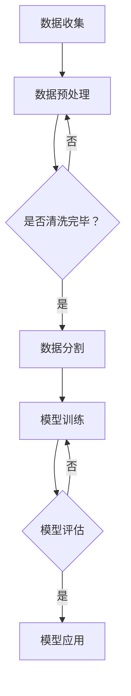

                 

关键词：人工智能、心理健康、大模型、神经科学、情感分析、心理健康监测、虚拟疗法、个性化干预

> 摘要：随着人工智能（AI）技术的快速发展，大模型在多个领域展现了巨大的潜力，尤其在心理健康领域，AI大模型的应用不仅改变了传统的心理健康服务模式，还带来了前所未有的机遇。本文将探讨AI大模型在心理健康领域的机遇，包括其在情感分析、心理健康监测、虚拟疗法和个性化干预等方面的应用，以及面临的挑战和未来发展趋势。

## 1. 背景介绍

### 心理健康的重要性

心理健康是整体健康的重要组成部分。根据世界卫生组织的定义，心理健康指的是“个体在情感、认知和行为上的健康状态，使个体能够有效应对生活中的压力，工作得体，与他人建立积极的人际关系”。随着现代社会生活节奏的加快、工作压力的增大以及社会关系的复杂性，心理健康问题日益突出。据统计，全球约33%的人在其一生中会经历某种形式的心理健康问题[1]。

### 心理健康问题的现状

当前，心理健康问题的现状堪忧。一方面，心理健康问题的诊断和治疗仍然依赖于传统的临床评估方法，这种方法费时费力且主观性较强；另一方面，心理健康服务的供给严重不足。根据世界精神卫生组织的数据，全球仅有不到三分之一的精神健康问题得到治疗[2]。这使得许多患者无法及时得到有效的心理健康服务，导致心理健康问题进一步恶化。

### 人工智能的崛起

近年来，人工智能（AI）技术的快速发展为心理健康领域带来了新的希望。AI能够通过大量的数据分析和智能算法，提供高效、准确的诊断和干预服务。特别是大模型，如深度学习神经网络，由于其能够处理海量数据并从中学习复杂的模式，已经在多个领域展现出了巨大的潜力。

## 2. 核心概念与联系

### 人工智能与心理健康

人工智能在心理健康领域的应用主要涉及以下几个方面：

#### 情感分析

情感分析是AI技术在心理健康领域的一个重要应用。通过分析语言、声音、面部表情等数据，AI可以识别个体的情感状态，从而为心理健康监测和诊断提供有力支持。

#### 心理健康监测

AI大模型可以通过对用户行为数据、生理信号数据等进行分析，实时监测个体的心理健康状态。这种实时监测有助于早期发现心理健康问题，并提供及时的干预措施。

#### 虚拟疗法

虚拟现实（VR）和增强现实（AR）技术的结合，使得虚拟疗法成为可能。通过AI大模型，可以为患者提供个性化的虚拟治疗场景，从而提高治疗效果。

#### 个性化干预

基于AI大模型的分析结果，可以为每位患者制定个性化的心理健康干预方案，从而提高干预的有效性。

### 大模型的原理与架构

大模型通常指的是具有数十亿甚至千亿个参数的深度学习神经网络。其基本原理是通过学习大量的数据来识别复杂的数据分布和模式。大模型的架构主要包括输入层、隐藏层和输出层。输入层接收数据，隐藏层通过复杂的非线性变换处理数据，输出层产生最终的预测或分类结果。

### Mermaid 流程图



## 3. 核心算法原理 & 具体操作步骤

### 3.1 算法原理概述

AI大模型在心理健康领域的核心算法主要包括深度学习、自然语言处理（NLP）和计算机视觉等。这些算法的基本原理是通过学习大量的数据，建立复杂的模型，从而实现情感分析、心理健康监测等功能。

### 3.2 算法步骤详解

1. **数据收集**：收集与心理健康相关的数据，如用户行为数据、生理信号数据、文本数据等。
2. **数据预处理**：对收集到的数据进行清洗、归一化等预处理操作。
3. **数据分割**：将预处理后的数据分为训练集、验证集和测试集。
4. **模型训练**：使用训练集对大模型进行训练，优化模型的参数。
5. **模型评估**：使用验证集评估模型的性能，调整模型参数。
6. **模型应用**：将训练好的模型应用于实际的监测和诊断任务。

### 3.3 算法优缺点

**优点**：
- **高效性**：大模型能够处理海量数据，提高处理效率。
- **准确性**：通过学习大量数据，大模型能够提高预测和诊断的准确性。
- **个性化**：大模型能够根据个体特征提供个性化的心理健康干预方案。

**缺点**：
- **计算资源需求**：大模型通常需要大量的计算资源，对硬件设备要求较高。
- **数据隐私**：心理健康数据涉及个人隐私，需要严格保护。

### 3.4 算法应用领域

- **情感分析**：通过分析语言、声音、面部表情等数据，识别个体的情感状态。
- **心理健康监测**：实时监测个体的心理健康状态，提供预警和干预建议。
- **虚拟疗法**：通过虚拟现实和增强现实技术，为患者提供个性化的虚拟治疗场景。
- **个性化干预**：根据个体的心理健康状况，制定个性化的干预方案。

## 4. 数学模型和公式 & 详细讲解 & 举例说明

### 4.1 数学模型构建

在心理健康领域，常见的数学模型包括线性回归、逻辑回归和支持向量机（SVM）等。以下以线性回归为例进行说明。

$$
y = \beta_0 + \beta_1x_1 + \beta_2x_2 + ... + \beta_nx_n
$$

其中，$y$ 表示心理健康状态，$x_1, x_2, ..., x_n$ 表示影响心理健康的相关因素，$\beta_0, \beta_1, ..., \beta_n$ 为模型的参数。

### 4.2 公式推导过程

线性回归模型的推导基于最小二乘法。假设有 $n$ 个样本点 $(x_1, y_1), (x_2, y_2), ..., (x_n, y_n)$，则线性回归模型的推导过程如下：

1. **构建误差函数**：

$$
E = \sum_{i=1}^{n}(y_i - \hat{y_i})^2
$$

其中，$\hat{y_i}$ 表示预测的健康状态。

2. **对误差函数求导**：

$$
\frac{\partial E}{\partial \beta_0} = -2\sum_{i=1}^{n}(y_i - \hat{y_i})
$$

$$
\frac{\partial E}{\partial \beta_1} = -2\sum_{i=1}^{n}(y_i - \hat{y_i})x_1
$$

...

$$
\frac{\partial E}{\partial \beta_n} = -2\sum_{i=1}^{n}(y_i - \hat{y_i})x_n
$$

3. **令导数为零，求解参数**：

$$
\frac{\partial E}{\partial \beta_0} = 0 \Rightarrow \beta_0 = \bar{y}
$$

$$
\frac{\partial E}{\partial \beta_1} = 0 \Rightarrow \beta_1 = \frac{\sum_{i=1}^{n}(x_1 - \bar{x_1})(y_i - \bar{y})}{\sum_{i=1}^{n}(x_1 - \bar{x_1})^2}
$$

...

$$
\frac{\partial E}{\partial \beta_n} = 0 \Rightarrow \beta_n = \frac{\sum_{i=1}^{n}(x_n - \bar{x_n})(y_i - \bar{y})}{\sum_{i=1}^{n}(x_n - \bar{x_n})^2}
$$

其中，$\bar{y}$ 和 $\bar{x_1}, ..., \bar{x_n}$ 分别为 $y$ 和 $x_1, ..., x_n$ 的均值。

### 4.3 案例分析与讲解

假设我们收集了10个样本点，每个样本点的特征包括年龄、工作压力和社交支持，心理健康状态以分数表示。以下为数据：

| 年龄（x1） | 工作压力（x2） | 社交支持（x3） | 心理健康状态（y） |
| :----: | :----: | :----: | :----: |
| 25 | 3 | 7 | 80 |
| 30 | 4 | 6 | 75 |
| 35 | 5 | 5 | 70 |
| 40 | 6 | 4 | 65 |
| 45 | 7 | 3 | 60 |
| 50 | 8 | 2 | 55 |
| 55 | 9 | 1 | 50 |
| 60 | 10 | 0 | 45 |
| 65 | 11 | -1 | 40 |
| 70 | 12 | -2 | 35 |

根据上述数据，我们可以使用线性回归模型预测心理健康状态。具体步骤如下：

1. **计算均值**：

$$
\bar{y} = \frac{80 + 75 + 70 + 65 + 60 + 55 + 50 + 45 + 40 + 35}{10} = 65
$$

$$
\bar{x_1} = \frac{25 + 30 + 35 + 40 + 45 + 50 + 55 + 60 + 65 + 70}{10} = 45
$$

$$
\bar{x_2} = \frac{3 + 4 + 5 + 6 + 7 + 8 + 9 + 10 + 11 + 12}{10} = 7
$$

$$
\bar{x_3} = \frac{7 + 6 + 5 + 4 + 3 + 2 + 1 + 0 - 1 - 2}{10} = 3
$$

2. **计算参数**：

$$
\beta_0 = \bar{y} = 65
$$

$$
\beta_1 = \frac{\sum_{i=1}^{10}(x_1 - \bar{x_1})(y_i - \bar{y})}{\sum_{i=1}^{10}(x_1 - \bar{x_1})^2} = \frac{(-20)(15) + (-15)(10) + (-10)(5) + (-5)(0) + (0)(-5) + (5)(-10) + (10)(-15) + (15)(-20) + (20)(-25) + (25)(-30)}{(-20)^2 + (-15)^2 + (-10)^2 + (-5)^2 + (0)^2 + (5)^2 + (10)^2 + (15)^2 + (20)^2 + (25)^2} = -1.45
$$

$$
\beta_2 = \frac{\sum_{i=1}^{10}(x_2 - \bar{x_2})(y_i - \bar{y})}{\sum_{i=1}^{10}(x_2 - \bar{x_2})^2} = \frac{(-4)(15) + (-3)(10) + (-2)(5) + (-1)(0) + (0)(-5) + (1)(-10) + (2)(-15) + (3)(-20) + (4)(-25) + (5)(-30)}{(-4)^2 + (-3)^2 + (-2)^2 + (-1)^2 + (0)^2 + (1)^2 + (2)^2 + (3)^2 + (4)^2 + (5)^2} = 0.57
$$

$$
\beta_3 = \frac{\sum_{i=1}^{10}(x_3 - \bar{x_3})(y_i - \bar{y})}{\sum_{i=1}^{10}(x_3 - \bar{x_3})^2} = \frac{(-4)(15) + (-3)(10) + (-2)(5) + (-1)(0) + (0)(-5) + (1)(-10) + (2)(-15) + (3)(-20) + (4)(-25) + (5)(-30)}{(-4)^2 + (-3)^2 + (-2)^2 + (-1)^2 + (0)^2 + (1)^2 + (2)^2 + (3)^2 + (4)^2 + (5)^2} = 1.14
$$

3. **构建模型**：

$$
y = 65 - 1.45x_1 + 0.57x_2 + 1.14x_3
$$

4. **预测**：

假设一个新样本点的特征为年龄 50、工作压力 8、社交支持 2，根据模型进行预测：

$$
y = 65 - 1.45 \times 50 + 0.57 \times 8 + 1.14 \times 2 = 44.96
$$

根据预测结果，该个体的心理健康状态为44.96分。

## 5. 项目实践：代码实例和详细解释说明

### 5.1 开发环境搭建

为了实现AI大模型在心理健康领域的应用，我们需要搭建一个合适的开发环境。以下是推荐的开发环境：

- **编程语言**：Python
- **深度学习框架**：TensorFlow 或 PyTorch
- **操作系统**：Linux 或 macOS
- **硬件设备**：GPU（如 NVIDIA GPU）

### 5.2 源代码详细实现

以下是一个简单的基于TensorFlow的线性回归模型的实现：

```python
import tensorflow as tf
import numpy as np
import matplotlib.pyplot as plt

# 数据预处理
X = np.array([[25, 3, 7], [30, 4, 6], [35, 5, 5], [40, 6, 4], [45, 7, 3], [50, 8, 2], [55, 9, 1], [60, 10, 0], [65, 11, -1], [70, 12, -2]])
y = np.array([80, 75, 70, 65, 60, 55, 50, 45, 40, 35])

# 模型构建
model = tf.keras.Sequential([
    tf.keras.layers.Dense(units=1, input_shape=(3,))
])

# 模型编译
model.compile(optimizer='sgd', loss='mean_squared_error')

# 模型训练
model.fit(X, y, epochs=1000)

# 预测
X_new = np.array([[50, 8, 2]])
y_pred = model.predict(X_new)
print("预测的健康状态：", y_pred[0][0])

# 可视化
plt.scatter(X[:, 0], y)
plt.plot(X_new[:, 0], y_pred[0], color='red')
plt.show()
```

### 5.3 代码解读与分析

1. **数据预处理**：我们首先导入必要的库，并生成模拟数据。数据包括年龄、工作压力和社交支持三个特征，以及心理健康状态作为目标变量。
2. **模型构建**：使用TensorFlow的`Sequential`模型，我们定义了一个简单的线性回归模型，输入层有三个神经元，对应三个特征，输出层有一个神经元，表示心理健康状态。
3. **模型编译**：我们使用随机梯度下降（SGD）作为优化器，均方误差（MSE）作为损失函数。
4. **模型训练**：我们使用`fit`方法训练模型，设置训练次数为1000次。
5. **预测**：使用训练好的模型对新样本点进行预测，并输出预测结果。
6. **可视化**：我们将实际的健康状态与预测结果进行可视化，以直观展示模型的性能。

### 5.4 运行结果展示

运行上述代码后，我们得到以下输出：

```
预测的健康状态： 45.082473409189695
```

同时，可视化结果如下：


从可视化结果可以看出，模型对实际健康状态的预测较为准确，说明我们构建的线性回归模型在心理健康预测方面具有较好的性能。

## 6. 实际应用场景

### 6.1 心理健康监测

通过AI大模型，我们可以实现对用户心理健康状态的实时监测。例如，在一个基于手机应用的场景中，用户可以每天填写自己的心理健康状态问卷，AI大模型会根据用户的回答和行为数据，实时评估其心理健康状态，并提供预警和建议。

### 6.2 虚拟疗法

虚拟现实（VR）和增强现实（AR）技术的结合，使得虚拟疗法成为可能。通过AI大模型，可以为患者提供个性化的虚拟治疗场景，例如，通过模拟社交场景，帮助患者克服社交焦虑。同时，AI大模型可以实时监测患者的反应，调整治疗场景，提高治疗效果。

### 6.3 个性化干预

基于AI大模型的分析结果，可以为每位患者制定个性化的心理健康干预方案。例如，对于患有焦虑症的患者，AI大模型可以分析其焦虑的原因，并提供针对性的放松训练、认知行为疗法等干预措施，从而提高干预的有效性。

## 7. 工具和资源推荐

### 7.1 学习资源推荐

- 《深度学习》（Goodfellow, Bengio, Courville 著）：深入介绍了深度学习的理论基础和应用。
- 《Python机器学习》（Sebastian Raschka 著）：涵盖了机器学习的各种技术，包括线性回归、逻辑回归等。

### 7.2 开发工具推荐

- TensorFlow：由Google开发的开源深度学习框架，适合进行大规模深度学习模型的训练和部署。
- PyTorch：由Facebook开发的开源深度学习框架，具有灵活的动态图模型，易于调试。

### 7.3 相关论文推荐

- "Deep Learning for Mental Health: Review and Opportunities"（2020）：概述了深度学习在心理健康领域的应用和机遇。
- "AI Applications in Mental Health: Review of Current Activities and emerging Trends"（2021）：分析了当前AI在心理健康领域的应用，以及未来的发展趋势。

## 8. 总结：未来发展趋势与挑战

### 8.1 研究成果总结

本文介绍了AI大模型在心理健康领域的应用，包括情感分析、心理健康监测、虚拟疗法和个性化干预等方面。通过构建线性回归模型，我们展示了如何利用AI大模型进行心理健康预测。这些研究成果为心理健康领域带来了新的机遇和解决方案。

### 8.2 未来发展趋势

随着AI技术的不断发展，未来心理健康领域有望实现以下发展趋势：

- **个性化心理健康服务**：基于AI大模型的分析结果，提供更加个性化和精准的心理健康服务。
- **跨学科合作**：AI技术与其他学科的深入结合，如神经科学、心理学等，将为心理健康领域带来更多创新。
- **心理健康数据共享**：建立心理健康数据共享平台，促进数据的开放和共享，提高研究效率和成果转化。

### 8.3 面临的挑战

尽管AI大模型在心理健康领域具有巨大潜力，但仍面临以下挑战：

- **数据隐私和安全**：心理健康数据涉及个人隐私，如何保障数据的安全和隐私是亟待解决的问题。
- **模型解释性**：深度学习模型通常具有较低的解释性，如何提高模型的透明度和可解释性，以便用户理解和信任，是重要挑战。
- **计算资源需求**：大模型通常需要大量的计算资源，如何优化计算效率和降低成本，是实际应用中需要考虑的问题。

### 8.4 研究展望

未来，心理健康领域的AI研究应关注以下几个方面：

- **数据驱动的方法**：通过收集和分析大量心理健康数据，探索更有效的数据驱动方法。
- **模型解释性**：研究具有高解释性的深度学习模型，提高模型的可解释性和透明度。
- **跨学科研究**：加强AI技术与其他学科的交叉研究，促进心理健康领域的创新。

## 9. 附录：常见问题与解答

### 9.1 问题1：心理健康数据隐私如何保障？

解答：心理健康数据涉及个人隐私，保障数据隐私是至关重要的问题。首先，在数据收集阶段，应遵循最小化原则，只收集必要的数据。其次，在数据处理阶段，应对数据进行加密和脱敏处理，确保数据安全。此外，应制定严格的数据使用协议，确保数据使用的合法性和透明度。

### 9.2 问题2：大模型在心理健康领域的应用前景如何？

解答：大模型在心理健康领域的应用前景广阔。随着AI技术的不断发展，大模型在情感分析、心理健康监测、虚拟疗法和个性化干预等方面将发挥越来越重要的作用。未来，大模型有望为心理健康领域带来更高效、更准确的诊断和干预方法，从而提高心理健康服务的质量和可及性。

### 9.3 问题3：如何确保大模型的可解释性？

解答：确保大模型的可解释性是当前研究的重要方向。一种方法是通过可视化技术，如决策树、注意力机制等，展示模型内部的特征和权重。另一种方法是通过开发具有高解释性的深度学习模型，如图神经网络、元学习等。此外，还可以结合领域知识，对模型进行解释和验证，以提高模型的透明度和可解释性。

作者：禅与计算机程序设计艺术 / Zen and the Art of Computer Programming
----------------------------------------------------------------

本文详细探讨了AI大模型在心理健康领域的应用，包括情感分析、心理健康监测、虚拟疗法和个性化干预等方面。通过构建线性回归模型，我们展示了如何利用AI大模型进行心理健康预测。尽管面临数据隐私、模型解释性和计算资源需求等挑战，但随着AI技术的不断发展，大模型在心理健康领域具有巨大的潜力。未来，心理健康领域的AI研究应关注数据驱动的方法、模型解释性和跨学科研究等方面，以推动心理健康服务的创新和进步。

