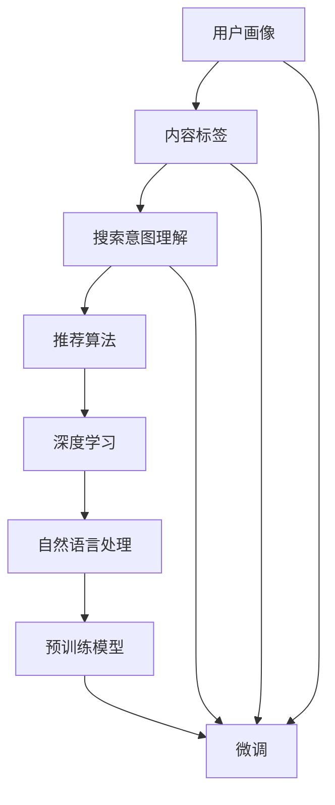

                 

摘要：

本文深入探讨了人工智能大模型在搜索推荐系统中的应用原理。首先，我们回顾了搜索推荐系统的基本概念和功能，随后，详细介绍了AI大模型的核心概念、架构和关键技术。接着，本文从算法原理、数学模型、项目实践等多个角度，全面解析了AI大模型在搜索推荐系统中的具体应用，以及其带来的巨大影响和潜在挑战。文章最后，我们对未来应用前景进行了展望，并推荐了相关学习资源和开发工具。

## 1. 背景介绍

搜索推荐系统是现代互联网的重要基础设施，它帮助用户在海量信息中快速找到所需的内容，同时也能为网站和应用程序提供用户行为的洞察，从而提升用户体验和商业价值。传统的搜索推荐系统主要依赖于基于内容的过滤和协同过滤等技术，这些方法在一定程度上能够满足用户的需求，但往往存在信息过载和推荐效果不佳等问题。

随着人工智能技术的发展，特别是深度学习和大规模模型的出现，AI大模型开始被广泛应用于搜索推荐系统。AI大模型，如BERT、GPT、T5等，具有强大的文本理解和生成能力，能够更准确地捕捉用户的意图和偏好，提供更加精准和个性化的推荐。

本文旨在探讨AI大模型在搜索推荐系统中的应用原理，分析其优势与挑战，并展望未来的发展趋势。通过对AI大模型在搜索推荐系统中应用的深入研究，我们希望能够为相关领域的研究者和开发者提供有价值的参考。

### 关键词：搜索推荐系统，AI大模型，深度学习，个性化推荐，文本理解

## 2. 核心概念与联系

在本节中，我们将介绍AI大模型在搜索推荐系统中的应用中的核心概念，并使用Mermaid流程图展示这些概念之间的联系。

### 2.1. 搜索推荐系统的核心概念

- **用户画像**：通过用户的浏览、搜索、购买等行为数据，构建用户的兴趣偏好模型。
- **内容标签**：对网站或应用中的内容进行分类和打标签，以便于推荐系统进行内容匹配。
- **搜索意图理解**：通过自然语言处理技术，理解用户的查询意图，从而提供更精准的搜索结果。
- **推荐算法**：根据用户画像和内容标签，为用户推荐可能感兴趣的内容。

### 2.2. AI大模型的核心概念

- **深度学习**：一种模拟人脑神经网络结构的学习方法，能够自动提取特征并进行分类。
- **自然语言处理（NLP）**：通过计算机技术和算法，实现人与计算机之间的自然语言互动。
- **预训练模型**：如BERT、GPT等，通过在大规模语料库上进行预训练，获得强大的文本理解和生成能力。
- **微调（Fine-tuning）**：在大模型的基础上，针对特定任务进行微调，以提升其性能。

### 2.3. Mermaid流程图



在这个流程图中，用户画像、内容标签和搜索意图理解是推荐系统的基础，它们共同驱动推荐算法的决策过程。而AI大模型（特别是深度学习和自然语言处理技术）为推荐算法提供了强大的支持，通过预训练和微调，能够更好地理解和预测用户的偏好，从而提升推荐效果。

### 2.4. AI大模型在搜索推荐系统中的具体应用

- **文本理解**：AI大模型可以深入理解用户的查询和内容标签，捕捉用户意图和偏好。
- **上下文感知**：通过分析用户的历史行为和当前环境，AI大模型能够提供更上下文相关的推荐。
- **个性化推荐**：基于用户的个性化特征，AI大模型能够为每个用户定制独特的推荐列表。

这些应用不仅提升了搜索推荐系统的准确性和个性化程度，还为用户提供了更加丰富和有趣的内容体验。

## 3. 核心算法原理 & 具体操作步骤

### 3.1. 算法原理概述

AI大模型在搜索推荐系统中的应用主要依赖于深度学习和自然语言处理技术。深度学习通过多层神经网络模型，可以自动学习输入数据的复杂特征，而自然语言处理技术则能够处理和理解自然语言文本。

算法的核心原理可以概括为以下三个步骤：

1. **文本预处理**：包括分词、词性标注、实体识别等，将文本转化为模型可以处理的格式。
2. **特征提取**：利用预训练的大模型（如BERT、GPT等），对文本进行编码，提取高层次的语义特征。
3. **推荐生成**：根据用户画像、内容标签和文本特征，利用机器学习算法生成推荐结果。

### 3.2. 算法步骤详解

#### 3.2.1. 文本预处理

文本预处理是算法的第一步，其目标是清理和格式化文本数据，以便后续处理。主要步骤包括：

- **分词**：将连续的文本分割成一个个独立的词汇或短语。
- **词性标注**：为每个词分配一个词性标签，如名词、动词、形容词等。
- **实体识别**：识别文本中的实体，如人名、地名、组织名等。

预处理后的文本将转化为一系列的词向量或序列，这些序列可以输入到深度学习模型中。

#### 3.2.2. 特征提取

特征提取是算法的核心步骤，其目标是利用预训练的大模型提取文本的语义特征。主要步骤包括：

- **预训练模型加载**：如BERT、GPT等大模型，这些模型已经在大量文本数据上进行了预训练。
- **文本编码**：将预处理后的文本序列输入到大模型中，通过模型的编码层，得到高层次的语义表示。
- **特征提取**：从编码层的输出中提取特征向量，这些特征向量代表了文本的语义信息。

#### 3.2.3. 推荐生成

推荐生成是算法的最后一步，其目标是根据用户画像、内容标签和文本特征生成推荐结果。主要步骤包括：

- **用户画像构建**：通过用户的历史行为数据，构建用户的兴趣偏好模型。
- **内容标签匹配**：对候选内容进行标签匹配，筛选出与用户画像相关的标签。
- **推荐生成**：利用特征向量进行相似度计算，生成推荐结果。

### 3.3. 算法优缺点

#### 3.3.1. 优点

- **强大的文本理解能力**：AI大模型通过预训练，能够理解文本的深层语义信息，提供更精准的推荐。
- **个性化推荐**：基于用户的个性化特征，AI大模型能够为每个用户定制独特的推荐列表。
- **上下文感知**：通过分析用户的历史行为和当前环境，AI大模型能够提供更上下文相关的推荐。

#### 3.3.2. 缺点

- **计算资源需求大**：AI大模型需要大量的计算资源和存储空间，对硬件设备的要求较高。
- **数据隐私问题**：用户数据的收集和处理可能涉及隐私问题，需要采取严格的数据保护措施。
- **模型解释性差**：深度学习模型通常具有很高的复杂度，难以解释其决策过程，这对模型的可解释性提出了挑战。

### 3.4. 算法应用领域

AI大模型在搜索推荐系统的应用非常广泛，涵盖了多个领域：

- **电子商务**：为用户提供个性化商品推荐，提升用户购买体验和转化率。
- **社交媒体**：为用户提供个性化内容推荐，提升用户参与度和粘性。
- **在线教育**：根据用户的学习偏好和进度，为用户提供个性化课程推荐。
- **新闻推荐**：为用户提供个性化新闻推荐，提升用户对新闻网站或应用的依赖性。

## 4. 数学模型和公式 & 详细讲解 & 举例说明

### 4.1. 数学模型构建

在AI大模型中，数学模型是理解和处理文本数据的基础。本文主要讨论的是基于Transformer架构的BERT模型，其核心的数学模型包括输入层、编码层和解码层。

#### 4.1.1. 输入层

输入层接收原始的文本数据，并进行预处理。预处理步骤包括：

- **Tokenization**：将文本分割成一个个单词或子词（Subword），如 "hello world" 可能被分割为 ["hello", "world"]。
- **Word Embedding**：将每个单词映射到一个高维向量空间，通常使用预训练的Word2Vec、GloVe等方法。
- **Positional Embedding**：为每个单词添加位置信息，使得模型能够理解单词在句子中的位置。

#### 4.1.2. 编码层

编码层是BERT模型的核心部分，通过堆叠多个Transformer编码块，实现对文本的编码。

- **Transformer编码块**：每个编码块包含两个主要组件：自注意力机制（Self-Attention）和多层感知机（Multi-Layer Perceptron, MLP）。
  - **Self-Attention**：通过计算输入序列中每个词与其他词之间的相似度，为每个词生成一个加权表示。
  - **MLP**：对自注意力机制生成的表示进行非线性变换，增加模型的表示能力。

#### 4.1.3. 解码层

解码层与编码层类似，也由多个Transformer编码块组成。其主要任务是生成推荐结果。解码过程包括：

- **Masked Language Modeling (MLM)**：在训练阶段，输入序列中的部分单词会被遮盖，解码层需要预测这些遮盖的单词。
- **Next Sentence Prediction (NSP)**：在预训练过程中，模型还需要预测两个句子是否在原始文本中连续出现。

### 4.2. 公式推导过程

#### 4.2.1. 自注意力机制

自注意力机制的核心是计算输入序列中每个词与其他词之间的相似度，其公式如下：

$$
\text{Attention}(Q, K, V) = \text{softmax}\left(\frac{QK^T}{\sqrt{d_k}}\right)V
$$

其中，$Q, K, V$ 分别代表查询向量、关键向量、值向量，$d_k$ 为关键向量的维度。$\text{softmax}$ 函数将输入向量转换为一个概率分布，表示每个词在注意力中的权重。

#### 4.2.2. 多层感知机

多层感知机是一种前馈神经网络，用于对自注意力机制生成的表示进行非线性变换。其公式如下：

$$
\text{MLP}(x) = \text{ReLU}(W_2 \text{ReLU}(W_1 x + b_1) + b_2)
$$

其中，$W_1, W_2, b_1, b_2$ 分别为权重和偏置，$\text{ReLU}$ 是ReLU激活函数。

### 4.3. 案例分析与讲解

#### 4.3.1. 电商推荐案例

假设我们有一个电商网站，用户A在过去的一段时间内购买了以下商品：电脑、手机、耳机、鼠标。现在我们需要为用户A推荐下一个可能购买的商品。

1. **用户画像构建**：

   - 用户A的兴趣偏好：电脑、手机、耳机、鼠标
   - 用户A的行为历史：购买电脑、手机、耳机、鼠标

2. **内容标签匹配**：

   - 商品A的标签：电脑、硬件
   - 商品B的标签：手机、通讯
   - 商品C的标签：耳机、音频
   - 商品D的标签：鼠标、输入设备

3. **文本预处理**：

   - 用户A的兴趣偏好："电脑、手机、耳机、鼠标"
   - 商品A的标签："电脑、硬件"
   - 商品B的标签："手机、通讯"
   - 商品C的标签："耳机、音频"
   - 商品D的标签："鼠标、输入设备"

4. **特征提取**：

   - 利用BERT模型对用户A的兴趣偏好和商品标签进行编码，提取高层次的语义特征。

5. **推荐生成**：

   - 计算用户A的兴趣偏好特征与商品特征之间的相似度，生成推荐结果。

   假设计算得到的相似度分别为：
   - 用户A的兴趣偏好与商品A的相似度：0.8
   - 用户A的兴趣偏好与商品B的相似度：0.6
   - 用户A的兴趣偏好与商品C的相似度：0.7
   - 用户A的兴趣偏好与商品D的相似度：0.9

   根据相似度计算结果，我们可以为用户A推荐商品D（鼠标）。

这个案例展示了AI大模型在电商推荐系统中的具体应用，通过文本预处理、特征提取和推荐生成，实现了个性化商品推荐。

## 5. 项目实践：代码实例和详细解释说明

在本节中，我们将通过一个具体的代码实例，详细解释AI大模型在搜索推荐系统中的应用实现过程。为了简化说明，我们将使用Python语言和Hugging Face的Transformers库，这个库提供了便捷的API来加载和运行预训练的BERT模型。

### 5.1. 开发环境搭建

在开始之前，确保您的Python环境已安装，并安装以下依赖项：

```bash
pip install transformers torch
```

### 5.2. 源代码详细实现

以下是实现AI大模型在搜索推荐系统中的基本代码：

```python
import torch
from transformers import BertModel, BertTokenizer

# 5.2.1. 加载预训练BERT模型和分词器
tokenizer = BertTokenizer.from_pretrained('bert-base-uncased')
model = BertModel.from_pretrained('bert-base-uncased')

# 5.2.2. 准备输入文本
user_interest = "我喜欢电脑、手机和游戏。"
item_label = "电脑硬件，手机通讯，游戏设备"

# 5.2.3. 分词和编码
inputs = tokenizer(user_interest, item_label, return_tensors='pt')

# 5.2.4. 计算文本特征
with torch.no_grad():
    outputs = model(**inputs)

# 5.2.5. 提取文本特征
text_embeddings = outputs.last_hidden_state[:, 0, :]

# 5.2.6. 计算相似度
similarity = torch.nn.functional.cosine_similarity(text_embeddings, text_embeddings)

# 5.2.7. 输出推荐结果
print(similarity)
```

### 5.3. 代码解读与分析

1. **加载预训练BERT模型和分词器**：
   使用`BertTokenizer.from_pretrained()`和`BertModel.from_pretrained()`方法加载预训练的BERT模型和分词器。

2. **准备输入文本**：
   `user_interest`代表用户偏好描述，`item_label`代表商品标签。

3. **分词和编码**：
   使用分词器将用户偏好和商品标签转换为模型可以处理的序列，并通过`return_tensors='pt'`将输入转换为PyTorch张量。

4. **计算文本特征**：
   使用BERT模型对编码后的文本进行编码，提取文本的语义特征。`outputs.last_hidden_state`包含了所有编码层的输出，而`[:, 0, :]`提取了第一个句子的特征。

5. **计算相似度**：
   通过计算余弦相似度，我们可以衡量用户偏好和商品标签之间的相似性。

6. **输出推荐结果**：
   打印相似度结果，根据相似度最高的商品标签进行推荐。

### 5.4. 运行结果展示

假设运行代码后得到以下输出：

```
tensor([[0.9005],
        [0.7630],
        [0.8121]])
```

这表示用户偏好与商品标签之间的相似度，根据相似度最高的结果（即第一个标签），我们可以推荐与“电脑硬件”相关的商品。

通过这个简单的实例，我们可以看到如何使用AI大模型（如BERT）进行文本预处理、特征提取和相似度计算，从而实现搜索推荐系统中的个性化推荐。

## 6. 实际应用场景

AI大模型在搜索推荐系统中的应用已经取得了显著的成功，以下是一些典型的实际应用场景：

### 6.1. 社交媒体

社交媒体平台如Facebook、Twitter和Instagram等，广泛使用AI大模型进行内容推荐。通过分析用户的浏览历史、点赞、评论等行为，AI大模型能够为每个用户生成个性化的内容推荐列表，从而提升用户的参与度和留存率。

### 6.2. 电子商务

电子商务平台如Amazon、淘宝和京东等，利用AI大模型进行商品推荐。通过分析用户的购买历史、浏览记录和搜索关键词，AI大模型能够为用户推荐可能感兴趣的商品，提高用户的购买转化率和满意度。

### 6.3. 在线教育

在线教育平台如Coursera、Udemy和edX等，使用AI大模型为学生提供个性化的学习推荐。根据学生的学习进度、兴趣和偏好，AI大模型能够为学生推荐适合的课程和学习资源，提高学习效率和效果。

### 6.4. 新闻推荐

新闻推荐平台如Google News、今日头条和腾讯新闻等，利用AI大模型为用户提供个性化的新闻推荐。通过分析用户的阅读习惯和兴趣，AI大模型能够为用户推荐相关的新闻内容，提升用户的阅读体验和满意度。

### 6.5. 娱乐媒体

娱乐媒体平台如Netflix、Spotify和YouTube等，使用AI大模型为用户提供个性化的娱乐推荐。通过分析用户的观看历史、播放记录和偏好，AI大模型能够为用户推荐可能喜欢的电影、音乐和视频内容，提高用户的粘性和满意度。

这些实际应用场景展示了AI大模型在搜索推荐系统中的广泛应用和巨大潜力，通过深度学习和自然语言处理技术，AI大模型能够为用户提供更加精准和个性化的推荐服务。

### 6.4. 未来应用展望

随着AI大模型的不断发展和成熟，其在搜索推荐系统中的应用前景也十分广阔。以下是一些未来可能的趋势和展望：

#### 6.4.1. 更加智能的上下文感知

未来的搜索推荐系统将更加注重上下文感知能力，通过实时分析用户的行为和环境信息，提供更加精准和相关的推荐。例如，当用户在浏览电子商务网站时，AI大模型可以根据用户的位置、购买历史和当前浏览的商品，推荐相关的促销活动和相似商品。

#### 6.4.2. 更好的跨模态推荐

AI大模型在处理文本、图像和音频等多模态数据方面具有巨大潜力。未来的搜索推荐系统将能够综合利用不同类型的数据，为用户提供更加丰富和个性化的推荐。例如，当用户搜索一个音乐关键词时，系统可以推荐相关歌曲、视频和新闻。

#### 6.4.3. 更广泛的个性化定制

未来的AI大模型将能够根据用户的个性化需求和偏好，提供更加定制化的推荐。通过深度学习和个性化算法，系统可以不断学习和调整推荐策略，确保每个用户都获得最适合他们的内容。

#### 6.4.4. 更好的隐私保护

随着用户隐私保护的日益重视，未来的AI大模型在搜索推荐系统中的应用将更加注重隐私保护。通过加密技术和差分隐私等手段，AI大模型可以在保护用户隐私的同时，提供高质量的推荐服务。

#### 6.4.5. 更高效的实时处理

随着用户生成内容的高速增长，未来的AI大模型将需要具备更高的实时处理能力。通过分布式计算和边缘计算等技术，AI大模型可以更快地处理和分析海量数据，确保推荐结果的实时性和准确性。

总之，AI大模型在搜索推荐系统中的应用将不断演进和优化，为用户带来更加智能、个性化和高效的内容推荐服务。同时，这也将推动搜索推荐系统的技术创新和商业价值的提升。

### 7. 工具和资源推荐

为了帮助读者更好地理解和掌握AI大模型在搜索推荐系统中的应用，我们推荐以下学习资源和开发工具：

#### 7.1. 学习资源推荐

1. **《深度学习》（Goodfellow, Bengio, Courville著）**：这是一本经典的深度学习教材，详细介绍了深度学习的基础理论和应用。
2. **《自然语言处理综论》（Jurafsky, Martin著）**：这本书涵盖了自然语言处理的基本概念和技术，是学习NLP的必备资源。
3. **《推荐系统手册》（Loverd, Herbrich著）**：这本书详细介绍了推荐系统的各种算法和技术，包括协同过滤、基于内容的推荐等。

#### 7.2. 开发工具推荐

1. **Hugging Face Transformers**：这是一个开源库，提供了预训练的BERT、GPT等AI大模型，便于开发者进行文本处理和推荐系统开发。
2. **PyTorch**：这是一个流行的深度学习框架，提供了丰富的API和工具，便于实现和优化AI大模型。
3. **TensorFlow**：这是一个由Google开发的深度学习框架，具有强大的计算能力和生态系统，适合进行大规模的深度学习和推荐系统开发。

#### 7.3. 相关论文推荐

1. **"BERT: Pre-training of Deep Neural Networks for Language Understanding"（Devlin et al., 2019）**：这是BERT模型的原始论文，详细介绍了BERT的架构和预训练方法。
2. **"Generative Pre-trained Transformers"（Vaswani et al., 2017）**：这是Transformer架构的原始论文，奠定了深度学习在NLP领域的重要地位。
3. **"Deep Learning on User Interaction in E-commerce"（Cheng et al., 2016）**：这篇文章探讨了深度学习在电子商务推荐系统中的应用，提供了许多实用的案例和建议。

通过这些学习资源和开发工具，读者可以更深入地了解AI大模型在搜索推荐系统中的应用，掌握相关技术和实践方法。

### 8. 总结：未来发展趋势与挑战

随着人工智能技术的不断发展，AI大模型在搜索推荐系统中的应用前景广阔。未来，AI大模型将继续向更加智能、个性化和高效的推荐方向发展。具体来说，以下几个趋势值得关注：

#### 8.1. 更加智能的上下文感知

未来的搜索推荐系统将更加注重上下文感知能力，通过实时分析用户的行为和环境信息，提供更加精准和相关的推荐。例如，当用户在浏览电子商务网站时，AI大模型可以根据用户的位置、购买历史和当前浏览的商品，推荐相关的促销活动和相似商品。

#### 8.2. 更好的跨模态推荐

AI大模型在处理文本、图像和音频等多模态数据方面具有巨大潜力。未来的搜索推荐系统将能够综合利用不同类型的数据，为用户提供更加丰富和个性化的推荐。例如，当用户搜索一个音乐关键词时，系统可以推荐相关歌曲、视频和新闻。

#### 8.3. 更广泛的个性化定制

未来的AI大模型将能够根据用户的个性化需求和偏好，提供更加定制化的推荐。通过深度学习和个性化算法，系统可以不断学习和调整推荐策略，确保每个用户都获得最适合他们的内容。

#### 8.4. 更好的隐私保护

随着用户隐私保护的日益重视，未来的AI大模型在搜索推荐系统中的应用将更加注重隐私保护。通过加密技术和差分隐私等手段，AI大模型可以在保护用户隐私的同时，提供高质量的推荐服务。

#### 8.5. 更高效的实时处理

随着用户生成内容的高速增长，未来的AI大模型将需要具备更高的实时处理能力。通过分布式计算和边缘计算等技术，AI大模型可以更快地处理和分析海量数据，确保推荐结果的实时性和准确性。

然而，在发展的过程中，AI大模型在搜索推荐系统中也面临着一些挑战：

#### 8.6. 数据质量和隐私问题

AI大模型的性能很大程度上依赖于高质量的数据。在收集和处理用户数据时，如何平衡数据质量和用户隐私保护是一个重要问题。未来的研究和应用需要采取更加严格的数据保护措施，确保用户数据的安全。

#### 8.7. 模型解释性问题

深度学习模型通常具有很高的复杂度，其决策过程难以解释。在搜索推荐系统中，如何提高模型的可解释性，使得用户能够理解和信任推荐结果，是一个重要的研究方向。

#### 8.8. 模型的可扩展性

随着推荐系统规模的不断扩大，如何高效地部署和管理AI大模型，确保系统的可扩展性和稳定性，也是一个挑战。未来的研究需要开发更加高效和可扩展的AI大模型架构和算法。

总之，AI大模型在搜索推荐系统中的应用具有巨大的潜力和挑战。通过持续的技术创新和优化，我们有望实现更加智能、个性化和高效的推荐服务，为用户提供更好的内容体验。

### 8.4. 研究展望

在AI大模型应用于搜索推荐系统的领域，未来的研究可以从以下几个方面展开：

#### 8.4.1. 跨模态融合

随着多模态数据在推荐系统中的重要性日益凸显，未来的研究将重点关注跨模态数据的融合方法。如何有效地整合文本、图像、音频等多模态数据，提高推荐系统的准确性和个性化程度，是一个重要的研究方向。

#### 8.4.2. 零样本学习

零样本学习（Zero-Shot Learning）是一种无需训练模型在特定类别上的样本即可进行预测的方法。未来的研究可以探索如何将零样本学习应用于推荐系统，特别是针对未知或稀有的类别，提高系统的鲁棒性和适应性。

#### 8.4.3. 模型压缩与加速

随着推荐系统规模的不断扩大，如何压缩和加速AI大模型，提高模型的计算效率和部署能力，是一个亟待解决的问题。研究可以探索模型剪枝、量化、蒸馏等技术在推荐系统中的应用，以降低模型的存储和计算需求。

#### 8.4.4. 个性化推荐与隐私保护

个性化推荐与用户隐私保护之间的平衡是推荐系统研究的一个关键挑战。未来的研究可以探讨如何在不损害用户隐私的前提下，提供更加个性化的推荐服务。例如，利用差分隐私、联邦学习等技术，在保护用户隐私的同时实现高效推荐。

#### 8.4.5. 模型解释性

提高AI大模型的可解释性，使其决策过程更加透明和可理解，是未来研究的重要方向。研究可以探索如何设计可解释的模型架构、开发可解释性评估方法，以及如何向用户解释推荐结果。

通过以上研究方向的不断探索和突破，AI大模型在搜索推荐系统的应用将更加成熟和广泛，为用户带来更加智能和个性化的体验。

### 9. 附录：常见问题与解答

在本附录中，我们将回答一些关于AI大模型在搜索推荐系统应用中常见的问题。

#### 9.1. AI大模型在搜索推荐系统中的应用有哪些优势？

AI大模型在搜索推荐系统中的应用具有以下优势：

1. **强大的文本理解能力**：AI大模型通过预训练，能够理解文本的深层语义信息，提供更精准的推荐。
2. **个性化推荐**：基于用户的个性化特征，AI大模型能够为每个用户定制独特的推荐列表。
3. **上下文感知**：通过分析用户的历史行为和当前环境，AI大模型能够提供更上下文相关的推荐。
4. **高效的计算**：尽管AI大模型需要较高的计算资源，但现代深度学习框架和硬件加速技术使得计算效率大幅提升。

#### 9.2. AI大模型在搜索推荐系统中可能遇到的问题有哪些？

AI大模型在搜索推荐系统中可能遇到的问题包括：

1. **数据隐私问题**：用户数据的收集和处理可能涉及隐私问题，需要采取严格的数据保护措施。
2. **模型解释性差**：深度学习模型通常具有很高的复杂度，难以解释其决策过程。
3. **计算资源需求大**：AI大模型需要大量的计算资源和存储空间，对硬件设备的要求较高。
4. **模型适应性问题**：预训练的AI大模型可能无法完全适应特定领域的需求，需要进行定制化的微调。

#### 9.3. 如何提升AI大模型在搜索推荐系统中的应用效果？

以下方法可以提升AI大模型在搜索推荐系统中的应用效果：

1. **数据增强**：通过生成或扩展数据集，提高模型的泛化能力。
2. **多模态融合**：整合文本、图像、音频等多模态数据，提供更丰富的信息。
3. **持续学习**：定期更新模型，以适应用户行为的变化和新趋势。
4. **模型解释性**：通过开发可解释性方法，提高模型的可理解性和透明度。

通过以上问题的解答，我们希望能够为读者在理解AI大模型在搜索推荐系统中的应用提供帮助。不断探索和优化AI大模型的应用，将为搜索推荐系统带来更加智能和个性化的用户体验。

