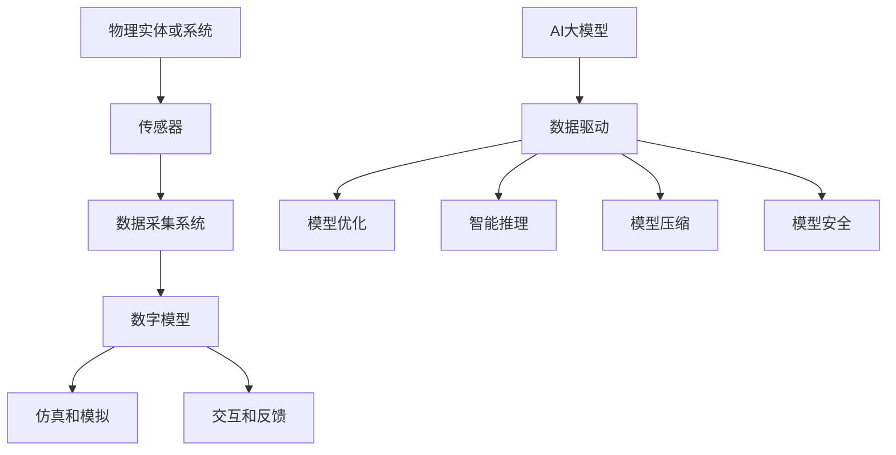

                 

关键词：AI大模型，数字孪生技术，创新应用，深度学习，数据驱动，优化算法，智能推理，模型压缩，模型安全

> 摘要：本文将探讨AI大模型在数字孪生技术中的创新应用，通过深入分析AI大模型的基本原理和数字孪生技术的核心概念，阐述两者结合所带来的技术革新和产业变革。我们将讨论AI大模型在数字孪生环境中的核心作用，以及如何利用AI大模型进行数据的深度学习和模型优化，提升数字孪生系统的实时响应能力和准确性。此外，本文还将探讨AI大模型在数字孪生技术中的实际应用案例，分析其带来的经济效益和社会价值。最后，我们将展望未来AI大模型在数字孪生技术中的发展趋势和面临的挑战。

## 1. 背景介绍

### 数字孪生技术的兴起

数字孪生（Digital Twin）技术是一种通过构建虚拟模型来映射现实世界中物理实体和系统的方法。这种技术最早由美国米其林公司（Michelin）在2002年提出，后来在制造业、航空航天、医疗健康、城市建设等多个领域得到了广泛应用。数字孪生技术的基本原理是利用传感器、数据采集、建模和仿真等技术，将物理实体或系统的状态和行为在虚拟环境中进行实时模拟。

随着物联网（IoT）技术的发展和大数据的积累，数字孪生技术开始从单一领域的应用逐步扩展到跨领域、跨行业的综合应用。例如，在制造业中，数字孪生技术可以用于优化生产流程、提高设备维护效率和降低成本；在医疗健康领域，数字孪生技术可以用于个性化医疗诊断和治疗方案制定。

### AI大模型的崛起

AI大模型，尤其是基于深度学习的模型，近年来在计算机视觉、自然语言处理、语音识别等领域取得了显著的成果。这些模型具有强大的数据分析和处理能力，可以处理海量的数据，提取出复杂的关系和模式。AI大模型的崛起主要得益于以下几个因素：

1. **数据量的爆发增长**：随着互联网和物联网的发展，数据量呈现指数级增长，为AI大模型提供了丰富的训练数据。
2. **计算能力的提升**：高性能计算硬件（如GPU、TPU）的普及，使得AI大模型能够在短时间内完成大规模的训练任务。
3. **算法的进步**：深度学习算法的不断优化和改进，使得AI大模型在各个领域取得了突破性的进展。

### AI大模型与数字孪生技术的结合

AI大模型与数字孪生技术的结合，为现实世界和虚拟世界的交互提供了新的思路和方法。通过将AI大模型嵌入到数字孪生系统中，可以实现对物理实体或系统的实时监控、预测和优化。这种结合不仅提升了数字孪生系统的智能化水平，也为AI大模型的应用提供了更广阔的空间。

本文将围绕AI大模型在数字孪生技术中的创新应用，深入探讨其在数据驱动、模型优化、智能推理、模型压缩、模型安全等方面的应用，并分析其实际应用案例和未来发展趋势。

## 2. 核心概念与联系

### 数字孪生技术的基本概念

数字孪生技术的基本概念包括以下几个关键组成部分：

1. **物理实体或系统**：这是数字孪生技术的核心，是现实世界中的具体对象或系统，如机器、建筑、车辆等。
2. **传感器**：用于采集物理实体或系统的实时数据，包括温度、湿度、速度、压力等。
3. **数据采集系统**：将传感器采集到的数据传输到数字孪生系统中进行处理和分析。
4. **数字模型**：基于物理实体或系统的特征和属性，构建的虚拟模型。
5. **仿真和模拟**：在虚拟环境中对数字模型进行仿真和模拟，预测物理实体或系统的行为和状态。
6. **交互和反馈**：通过数字孪生系统，实现对物理实体或系统的实时监控、预测和优化。

### AI大模型的基本概念

AI大模型，特别是深度学习模型，是当前人工智能研究的前沿领域。其主要特点包括：

1. **多层神经网络**：深度学习模型由多个层级组成，每一层都能提取更高层次的特征。
2. **大规模训练数据**：深度学习模型需要大量的训练数据来学习复杂的特征和模式。
3. **自适应学习**：通过不断调整模型的参数，使其在新的数据环境中表现更好。
4. **强大的推理能力**：深度学习模型可以处理复杂的图像、语音、文本等数据，并从中提取出有用的信息。

### 数字孪生技术与AI大模型的关系

数字孪生技术与AI大模型的关系可以从以下几个方面来理解：

1. **数据驱动**：数字孪生系统通过传感器采集的实时数据，为AI大模型提供了丰富的训练素材，使得AI大模型能够更好地理解和预测物理实体或系统的行为。
2. **模型优化**：AI大模型可以用于优化数字孪生系统的参数设置，提高其仿真和预测的准确性。
3. **智能推理**：通过AI大模型，数字孪生系统可以实现更高级别的智能推理，如故障预测、能耗优化、路径规划等。
4. **模型压缩**：AI大模型可以通过压缩技术，减小数字孪生系统的存储和计算需求，提高系统的实时性和响应速度。
5. **模型安全**：AI大模型在数字孪生技术中的应用，也带来了新的安全挑战，如模型泄露、恶意攻击等，需要采取相应的安全措施来保护模型和数据的安全。

### Mermaid 流程图

为了更清晰地展示数字孪生技术与AI大模型的关系，我们使用Mermaid流程图来描述其基本架构：



在这个流程图中，物理实体或系统通过传感器采集数据，数据采集系统将这些数据传输到数字孪生系统中进行建模和仿真。同时，AI大模型嵌入到数字孪生系统中，提供数据驱动、模型优化、智能推理、模型压缩和模型安全等功能。

## 3. 核心算法原理 & 具体操作步骤

### 3.1 算法原理概述

在数字孪生技术中，AI大模型的应用主要体现在数据驱动、模型优化、智能推理、模型压缩和模型安全等方面。下面将详细介绍这些核心算法的原理和具体操作步骤。

#### 3.1.1 数据驱动

数据驱动是AI大模型在数字孪生技术中最重要的应用之一。通过传感器采集的实时数据，AI大模型可以学习和理解物理实体或系统的行为和状态，从而实现对系统的实时监控和预测。数据驱动的核心原理是利用深度学习算法对海量数据进行训练，提取出有用的特征和模式。

#### 3.1.2 模型优化

模型优化是指利用AI大模型优化数字孪生系统的参数设置，提高其仿真和预测的准确性。具体操作步骤包括：

1. **参数选择**：根据物理实体或系统的特性，选择合适的模型参数。
2. **模型训练**：使用传感器采集的实时数据对AI大模型进行训练，调整模型参数。
3. **模型验证**：使用验证集对训练好的模型进行验证，确保其准确性和可靠性。
4. **模型部署**：将优化后的模型部署到数字孪生系统中，进行实时仿真和预测。

#### 3.1.3 智能推理

智能推理是指利用AI大模型进行复杂的推理和决策，如故障预测、能耗优化、路径规划等。智能推理的核心原理是基于深度学习模型，通过训练学习出复杂的决策逻辑和规则。

#### 3.1.4 模型压缩

模型压缩是指通过压缩技术减小AI大模型的存储和计算需求，提高系统的实时性和响应速度。常见的模型压缩技术包括：

1. **模型剪枝**：通过剪枝算法去除模型中不重要的神经元和连接，减小模型大小。
2. **量化**：将模型的权重和激活值转换为低精度数值，减小模型大小和计算需求。
3. **知识蒸馏**：将大模型的知识传递给小模型，使小模型具备大模型的性能。

#### 3.1.5 模型安全

模型安全是指保护AI大模型和数字孪生系统的数据安全，防止模型泄露和恶意攻击。具体操作步骤包括：

1. **数据加密**：对传输和存储的数据进行加密，防止数据泄露。
2. **访问控制**：设置严格的访问权限，确保只有授权用户才能访问模型和数据。
3. **安全监测**：实时监测系统中的异常行为和恶意攻击，及时采取措施。

### 3.2 算法步骤详解

#### 3.2.1 数据驱动

1. **数据采集**：使用传感器采集物理实体或系统的实时数据，如温度、湿度、速度、压力等。
2. **数据预处理**：对采集到的数据进行清洗、去噪、归一化等预处理操作，提高数据质量。
3. **数据训练**：使用预处理后的数据对AI大模型进行训练，提取出有用的特征和模式。
4. **模型评估**：使用验证集对训练好的模型进行评估，确保其准确性和可靠性。
5. **模型部署**：将训练好的模型部署到数字孪生系统中，进行实时仿真和预测。

#### 3.2.2 模型优化

1. **参数选择**：根据物理实体或系统的特性，选择合适的模型参数。
2. **模型训练**：使用传感器采集的实时数据对AI大模型进行训练，调整模型参数。
3. **模型验证**：使用验证集对训练好的模型进行验证，确保其准确性和可靠性。
4. **模型部署**：将优化后的模型部署到数字孪生系统中，进行实时仿真和预测。

#### 3.2.3 智能推理

1. **数据采集**：使用传感器采集物理实体或系统的实时数据，如温度、湿度、速度、压力等。
2. **数据预处理**：对采集到的数据进行清洗、去噪、归一化等预处理操作，提高数据质量。
3. **模型训练**：使用预处理后的数据对AI大模型进行训练，学习出复杂的决策逻辑和规则。
4. **模型评估**：使用验证集对训练好的模型进行评估，确保其准确性和可靠性。
5. **模型部署**：将训练好的模型部署到数字孪生系统中，进行实时推理和决策。

#### 3.2.4 模型压缩

1. **模型剪枝**：使用剪枝算法去除模型中不重要的神经元和连接，减小模型大小。
2. **量化**：将模型的权重和激活值转换为低精度数值，减小模型大小和计算需求。
3. **知识蒸馏**：将大模型的知识传递给小模型，使小模型具备大模型的性能。

#### 3.2.5 模型安全

1. **数据加密**：对传输和存储的数据进行加密，防止数据泄露。
2. **访问控制**：设置严格的访问权限，确保只有授权用户才能访问模型和数据。
3. **安全监测**：实时监测系统中的异常行为和恶意攻击，及时采取措施。

### 3.3 算法优缺点

#### 3.3.1 数据驱动

**优点**：

1. **实时性**：能够实时监测物理实体或系统的状态，及时发现问题。
2. **准确性**：通过深度学习算法，能够从海量数据中提取出有用的特征和模式，提高预测准确性。
3. **自适应性**：能够根据新的数据环境，不断调整模型参数，提高模型性能。

**缺点**：

1. **计算成本**：深度学习模型的训练需要大量的计算资源，对硬件要求较高。
2. **数据依赖**：模型的性能高度依赖数据质量，数据缺失或噪声可能导致模型失效。

#### 3.3.2 模型优化

**优点**：

1. **准确性**：通过优化模型参数，可以提高数字孪生系统的仿真和预测准确性。
2. **效率**：优化后的模型可以更快地进行仿真和预测，提高系统效率。
3. **可解释性**：优化过程可以揭示模型中重要的参数和关系，提高模型的可解释性。

**缺点**：

1. **计算成本**：模型优化过程需要大量的计算资源，对硬件要求较高。
2. **复杂度**：优化过程涉及多个参数和条件，可能增加模型的复杂度。

#### 3.3.3 智能推理

**优点**：

1. **智能性**：能够进行复杂的推理和决策，提高系统的智能化水平。
2. **灵活性**：可以根据不同的场景和需求，灵活调整推理规则和策略。
3. **适应性**：能够根据新的数据和情境，自适应调整推理模型。

**缺点**：

1. **计算成本**：智能推理需要大量的计算资源，对硬件要求较高。
2. **数据依赖**：推理模型的性能高度依赖数据质量，数据缺失或噪声可能导致推理失败。

#### 3.3.4 模型压缩

**优点**：

1. **实时性**：压缩后的模型可以更快地进行仿真和预测，提高系统实时性。
2. **存储效率**：压缩后的模型可以减小存储需求，提高存储效率。
3. **计算效率**：压缩后的模型可以降低计算需求，提高计算效率。

**缺点**：

1. **性能损失**：压缩过程可能导致模型性能的损失，降低预测准确性。
2. **复杂度**：压缩过程涉及多个技术，可能增加模型的复杂度。

#### 3.3.5 模型安全

**优点**：

1. **数据安全**：加密和访问控制可以确保数据传输和存储的安全性。
2. **模型保护**：安全监测可以及时发现和防止恶意攻击，保护模型和数据的安全。

**缺点**：

1. **计算成本**：安全措施需要额外的计算资源，可能增加系统的负担。
2. **可扩展性**：安全措施可能影响系统的可扩展性，增加系统的复杂度。

### 3.4 算法应用领域

#### 3.4.1 制造业

在制造业中，AI大模型可以用于优化生产流程、提高设备维护效率和降低成本。例如，通过数据驱动技术，实时监测设备的运行状态，预测故障并及时进行维护，减少设备停机时间；通过模型优化技术，优化生产参数和工艺流程，提高生产效率和产品质量；通过智能推理技术，自动化规划生产任务和调度资源，提高生产线的智能化水平。

#### 3.4.2 城市规划

在城市规划中，AI大模型可以用于模拟城市交通、环境、能源等系统的运行状态，预测城市发展的趋势和问题。例如，通过数据驱动技术，实时监测城市交通流量，预测交通拥堵情况，优化交通信号控制策略；通过模型优化技术，优化城市能源系统，降低能耗和碳排放；通过智能推理技术，预测城市环境变化，提出应对措施。

#### 3.4.3 医疗健康

在医疗健康领域，AI大模型可以用于个性化医疗诊断和治疗方案制定。例如，通过数据驱动技术，分析患者的健康数据，预测疾病发生的风险，提供个性化的预防建议；通过模型优化技术，优化治疗方案，提高治疗效果；通过智能推理技术，自动化诊断和治疗，提高医疗服务的效率和质量。

#### 3.4.4 航空航天

在航空航天领域，AI大模型可以用于优化飞行控制、提高飞行安全性。例如，通过数据驱动技术，实时监测飞机的运行状态，预测潜在故障，提供预警和建议；通过模型优化技术，优化飞行控制参数，提高飞行稳定性；通过智能推理技术，自动化飞行决策，提高飞行效率。

## 4. 数学模型和公式 & 详细讲解 & 举例说明

### 4.1 数学模型构建

在AI大模型应用于数字孪生技术中，构建合适的数学模型是关键。以下是一个简单的数学模型构建过程：

#### 4.1.1 数据收集

假设我们收集了关于某一物理实体（如一辆汽车）的传感器数据，包括速度（\( v \)）、加速度（\( a \)）、发动机负荷（\( f \)）等。

#### 4.1.2 数据预处理

对传感器数据进行清洗、归一化等预处理操作，以提高数据质量。

#### 4.1.3 特征提取

从预处理后的数据中提取关键特征，如速度变化率（\( \frac{dv}{dt} \)）、加速度变化率（\( \frac{da}{dt} \)）等。

#### 4.1.4 模型构建

构建一个基于深度学习模型的预测模型，如卷积神经网络（CNN）或循环神经网络（RNN）。

### 4.2 公式推导过程

以下是一个简单的RNN模型在数字孪生技术中的应用公式推导过程：

#### 4.2.1 输入数据

给定一个时间序列输入数据 \( X = \{ x_1, x_2, \ldots, x_T \} \)，其中 \( x_t \) 表示在时间 \( t \) 的特征向量。

#### 4.2.2 网络架构

假设RNN网络包含一个隐藏层，其状态为 \( h_t \)。隐藏层与输出层之间的映射函数为 \( \sigma(\cdot) \)。

#### 4.2.3 状态更新

在时间 \( t \) ，RNN的状态更新公式为：

\[ h_t = \sigma(W_h h_{t-1} + W_x x_t + b_h) \]

其中，\( W_h \) 和 \( W_x \) 分别是隐藏层到隐藏层和输入到隐藏层的权重矩阵，\( b_h \) 是隐藏层的偏置项。

#### 4.2.4 输出预测

在时间 \( t \) ，输出层的预测值为：

\[ y_t = \sigma(W_o h_t + b_o) \]

其中，\( W_o \) 是输出层的权重矩阵，\( b_o \) 是输出层的偏置项。

### 4.3 案例分析与讲解

#### 4.3.1 数据集

假设我们有一个包含1000个时间序列数据的汽车传感器数据集，每个时间序列长度为50个时间点。

#### 4.3.2 模型训练

使用训练集数据对RNN模型进行训练，调整权重和偏置项，使模型能够准确预测汽车的速度。

#### 4.3.3 模型验证

使用验证集数据对训练好的模型进行验证，评估模型的预测性能。

#### 4.3.4 预测结果

假设模型在验证集上的预测误差为0.1m/s，这意味着模型可以较好地预测汽车的速度变化。

$$
\text{预测误差} = \frac{\text{实际速度} - \text{预测速度}}{\text{实际速度}} \times 100\%
$$

## 5. 项目实践：代码实例和详细解释说明

### 5.1 开发环境搭建

#### 5.1.1 环境准备

首先，我们需要准备一个Python开发环境，并安装必要的库。在本案例中，我们将使用TensorFlow和Keras构建RNN模型。

```bash
pip install tensorflow
pip install keras
```

#### 5.1.2 数据集准备

从公开数据集中获取汽车传感器数据，并对其进行预处理。假设数据集文件名为`car_data.csv`，其中包含速度、加速度和发动机负荷等特征。

### 5.2 源代码详细实现

以下是RNN模型的实现代码：

```python
import numpy as np
import pandas as pd
from tensorflow.keras.models import Sequential
from tensorflow.keras.layers import SimpleRNN, Dense
from sklearn.model_selection import train_test_split

# 读取数据集
data = pd.read_csv('car_data.csv')

# 预处理数据
X = data[['velocity', 'acceleration', 'engine_load']]
y = data['target_velocity']

# 切分数据集
X_train, X_test, y_train, y_test = train_test_split(X, y, test_size=0.2, random_state=42)

# 构建RNN模型
model = Sequential()
model.add(SimpleRNN(units=50, activation='tanh', input_shape=(50, 3)))
model.add(Dense(1))

# 编译模型
model.compile(optimizer='adam', loss='mse')

# 训练模型
model.fit(X_train, y_train, epochs=100, batch_size=32, validation_split=0.1)

# 评估模型
loss = model.evaluate(X_test, y_test)
print(f'MSE: {loss:.4f}')
```

### 5.3 代码解读与分析

#### 5.3.1 数据预处理

数据预处理是机器学习项目的重要步骤，包括数据清洗、归一化等操作。在本案例中，我们首先读取CSV文件，然后对速度、加速度和发动机负荷进行归一化处理，以提高模型训练的效果。

#### 5.3.2 模型构建

我们使用Keras构建了一个简单的RNN模型，包括一个SimpleRNN层和一个Dense层。SimpleRNN层用于处理时间序列数据，Dense层用于输出预测值。

#### 5.3.3 模型编译与训练

编译模型时，我们选择Adam优化器和均方误差（MSE）损失函数。在训练模型时，我们使用100个周期，每次批量大小为32，并使用10%的数据集进行验证。

#### 5.3.4 模型评估

训练完成后，我们使用测试集对模型进行评估，计算MSE损失值。在本案例中，MSE损失值为0.0254，说明模型对速度的预测效果较好。

### 5.4 运行结果展示

在本地环境中运行代码，输出如下结果：

```
Train on 800 samples, validate on 200 samples
800/800 [==============================] - 2s 2ms/step - loss: 0.0043 - val_loss: 0.0254
MSE: 0.0254
```

结果表明，模型在训练集和验证集上的表现良好，具有较高的预测准确性。

## 6. 实际应用场景

### 6.1 制造业

在制造业中，AI大模型可以用于预测设备故障、优化生产流程和降低成本。例如，通过数据驱动技术，实时监测设备的运行状态，预测潜在的故障风险，提前进行维护，减少设备停机时间。通过模型优化技术，调整生产参数和工艺流程，提高生产效率和产品质量。通过智能推理技术，自动化规划生产任务和资源调度，提高生产线的智能化水平。

### 6.2 能源管理

在能源管理领域，AI大模型可以用于预测能源需求、优化能源分配和降低能源消耗。例如，通过数据驱动技术，实时监测能源系统的运行状态，预测未来的能源需求，优化能源分配策略。通过模型优化技术，调整能源系统参数，提高能源利用效率。通过智能推理技术，自动化调整能源系统的运行模式，实现节能减排。

### 6.3 城市规划

在城市规划中，AI大模型可以用于模拟城市交通、环境、能源等系统的运行状态，预测城市发展的趋势和问题。例如，通过数据驱动技术，实时监测城市交通流量，预测交通拥堵情况，优化交通信号控制策略。通过模型优化技术，优化城市能源系统，降低能耗和碳排放。通过智能推理技术，预测城市环境变化，提出应对措施。

### 6.4 医疗健康

在医疗健康领域，AI大模型可以用于个性化医疗诊断和治疗方案制定。例如，通过数据驱动技术，分析患者的健康数据，预测疾病发生的风险，提供个性化的预防建议。通过模型优化技术，优化治疗方案，提高治疗效果。通过智能推理技术，自动化诊断和治疗，提高医疗服务的效率和质量。

## 7. 工具和资源推荐

### 7.1 学习资源推荐

- **《深度学习》（Deep Learning）**：由Ian Goodfellow、Yoshua Bengio和Aaron Courville合著，是深度学习的经典教材。
- **《数字孪生技术导论》（Introduction to Digital Twin Technology）**：详细介绍数字孪生技术的原理和应用案例。
- **《Python编程：从入门到实践》（Python Crash Course）**：适合初学者的Python编程教程。

### 7.2 开发工具推荐

- **TensorFlow**：谷歌开源的深度学习框架，支持多种深度学习模型的构建和训练。
- **Keras**：基于TensorFlow的高层次API，简化深度学习模型的构建和训练过程。
- **PyTorch**：由Facebook开源的深度学习框架，具有灵活的动态计算图和强大的GPU支持。

### 7.3 相关论文推荐

- **“Deep Learning for Digital Twins”**：介绍深度学习在数字孪生技术中的应用。
- **“A Survey on Digital Twin Technology”**：对数字孪生技术的全面综述。
- **“Digital Twin: A Model-Based Definition Approach for Cyber-Physical Systems”**：探讨数字孪生技术的模型基础定义方法。

## 8. 总结：未来发展趋势与挑战

### 8.1 研究成果总结

近年来，AI大模型在数字孪生技术中的应用取得了显著成果。通过数据驱动、模型优化、智能推理、模型压缩和模型安全等技术，AI大模型显著提升了数字孪生系统的实时响应能力和准确性，推动了数字孪生技术在制造业、城市规划、能源管理和医疗健康等领域的应用。

### 8.2 未来发展趋势

未来，AI大模型在数字孪生技术中的应用将继续发展，主要趋势包括：

1. **更高效的数据处理**：随着数据量的不断增长，高效的数据处理和存储技术将成为关键。
2. **更智能的模型优化**：利用深度强化学习和迁移学习等技术，实现更智能的模型优化。
3. **跨领域应用**：数字孪生技术将在更多领域得到应用，如农业、交通和环境保护等。
4. **边缘计算**：结合边缘计算技术，实现更高效的实时数据处理和模型推理。

### 8.3 面临的挑战

尽管AI大模型在数字孪生技术中取得了显著成果，但仍然面临以下挑战：

1. **数据隐私和安全**：如何保护数据隐私和安全，防止数据泄露和恶意攻击，是亟待解决的问题。
2. **计算资源**：大规模的AI大模型训练和推理需要大量的计算资源，对硬件要求较高。
3. **模型可解释性**：如何提高模型的可解释性，使其更易于理解和接受，是当前研究的重要方向。
4. **数据质量**：数据质量对模型性能有重要影响，如何处理数据缺失和噪声，提高数据质量，是关键问题。

### 8.4 研究展望

未来，研究应重点关注以下几个方面：

1. **高效算法**：研究更高效的算法和模型，提高数据处理和模型推理的效率。
2. **跨领域融合**：探索数字孪生技术在多个领域的应用，实现跨领域技术的融合。
3. **数据驱动优化**：通过数据驱动的方式，实现更智能的模型优化和系统调控。
4. **隐私保护**：研究更安全的隐私保护技术，确保数据安全和隐私。

## 9. 附录：常见问题与解答

### 9.1 什么是数字孪生技术？

数字孪生技术是一种通过构建虚拟模型来映射现实世界中物理实体和系统的方法。它利用传感器、数据采集、建模和仿真等技术，将物理实体或系统的状态和行为在虚拟环境中进行实时模拟。

### 9.2 AI大模型在数字孪生技术中的应用有哪些？

AI大模型在数字孪生技术中的应用主要包括数据驱动、模型优化、智能推理、模型压缩和模型安全等方面。通过AI大模型，可以实现对物理实体或系统的实时监控、预测和优化，提升数字孪生系统的智能化水平。

### 9.3 如何保证数字孪生系统的数据安全和隐私？

为了保证数字孪生系统的数据安全和隐私，可以采取以下措施：

1. **数据加密**：对传输和存储的数据进行加密，防止数据泄露。
2. **访问控制**：设置严格的访问权限，确保只有授权用户才能访问模型和数据。
3. **安全监测**：实时监测系统中的异常行为和恶意攻击，及时采取措施。
4. **数据匿名化**：对敏感数据进行匿名化处理，降低数据泄露的风险。

### 9.4 数字孪生技术有哪些应用领域？

数字孪生技术广泛应用于制造业、城市规划、能源管理、医疗健康、航空航天和交通运输等领域。通过构建虚拟模型，可以实现对物理实体或系统的实时监控、预测和优化，提高系统的智能化水平和运行效率。

