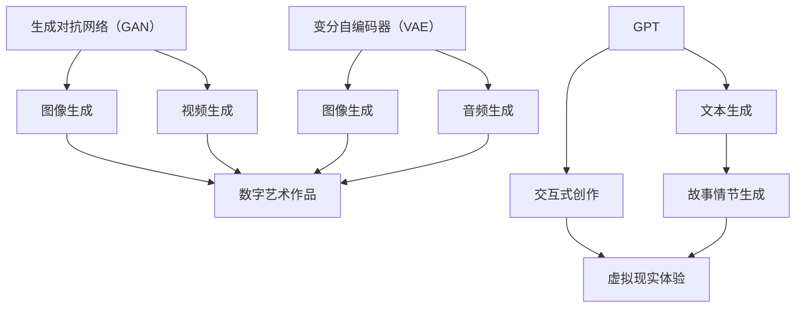

                 

关键词：AI大模型，数字艺术，创作，生成模型，GPT，图像生成，艺术风格迁移，交互式创作

> 摘要：本文深入探讨了AI大模型在数字艺术创作中的潜在应用。通过分析生成对抗网络（GAN）、变分自编码器（VAE）以及GPT等AI技术的原理和应用，本文揭示了AI大模型如何变革数字艺术创作流程，并展望了其在未来艺术创作领域的广阔前景。

## 1. 背景介绍

数字艺术创作是随着计算机技术和人工智能的发展而逐渐兴起的领域。传统的艺术创作依赖于手工技艺和创作者的直觉，而数字艺术则借助计算机技术和人工智能，将创意转化为数字化作品。近年来，随着AI技术的不断进步，尤其是大模型的广泛应用，数字艺术创作迎来了新的发展机遇。

AI大模型是指具有数十亿甚至数万亿参数的大型神经网络模型，如GPT（生成预训练模型）、BERT（双向编码表示器）等。这些模型通过大量的数据训练，可以捕捉到复杂的数据模式，并在此基础上生成新的内容。在数字艺术创作中，AI大模型不仅能够提高创作效率，还能够突破传统的创作界限，实现前所未有的创意表达。

## 2. 核心概念与联系

为了更好地理解AI大模型在数字艺术创作中的应用，首先需要了解几个核心概念及其相互关系。

### 2.1 生成对抗网络（GAN）

生成对抗网络（GAN）是一种由生成器和判别器组成的神经网络结构。生成器的任务是生成尽可能逼真的数据，而判别器的任务是区分生成器生成的数据和真实数据。通过两个网络的对抗训练，生成器逐渐提高生成质量，从而生成高质量的图像、音频和其他类型的数据。

### 2.2 变分自编码器（VAE）

变分自编码器（VAE）是一种基于概率模型的生成模型。它由编码器和解码器组成，编码器将输入数据映射到一个潜在空间，解码器则从潜在空间中重建输入数据。VAE通过在潜在空间中引入先验分布，能够生成多样化的数据。

### 2.3 GPT

GPT（生成预训练模型）是一种基于Transformer架构的自然语言处理模型。GPT通过在大量文本数据上进行预训练，掌握了丰富的语言模式，可以生成高质量的自然语言文本。

### 2.4 Mermaid流程图

以下是一个Mermaid流程图，展示了GAN、VAE和GPT在数字艺术创作中的关系：



## 3. 核心算法原理 & 具体操作步骤

### 3.1 算法原理概述

AI大模型在数字艺术创作中的应用主要基于生成模型。生成模型通过学习数据分布，生成新的、具有多样性的数据。下面是几种常见的生成模型及其原理：

#### 3.1.1 GAN

GAN由生成器和判别器组成。生成器G从噪声分布中生成数据，判别器D区分真实数据和生成数据。训练过程中，生成器和判别器相互对抗，生成器试图生成更真实的数据，而判别器则试图更好地识别生成数据。通过这样的对抗训练，生成器最终可以生成高质量的数据。

#### 3.1.2 VAE

VAE通过编码器和解码器实现数据的生成。编码器将输入数据映射到一个潜在空间，解码器从潜在空间中重建输入数据。VAE引入了先验分布，使得生成的数据具有多样化的特点。

#### 3.1.3 GPT

GPT是一种基于Transformer的自然语言处理模型。GPT通过在大量文本数据上进行预训练，掌握了丰富的语言模式，可以生成高质量的自然语言文本。

### 3.2 算法步骤详解

#### 3.2.1 GAN训练步骤

1. 初始化生成器G和判别器D。
2. 对于每个训练样本x，从噪声分布中采样一个噪声向量z，生成器G将z映射为生成样本x'。
3. 计算判别器的损失函数L_D，它衡量判别器对真实样本和生成样本的区分能力。
4. 计算生成器的损失函数L_G，它衡量生成器生成的样本的质量。
5. 使用梯度下降法更新生成器和判别器的参数。

#### 3.2.2 VAE训练步骤

1. 初始化编码器qφ(z|x)和解码器pθ(x|z)。
2. 对于每个训练样本x，计算编码器的参数更新，使其能够更好地将x映射到潜在空间z。
3. 计算解码器的参数更新，使其能够更好地从潜在空间z重建x。
4. 使用梯度下降法更新编码器和解码器的参数。

#### 3.2.3 GPT训练步骤

1. 初始化Transformer模型参数。
2. 对于每个文本样本，使用前向传播计算损失函数。
3. 使用梯度下降法更新模型参数。
4. 重复步骤2和3，直到模型收敛。

### 3.3 算法优缺点

#### 3.3.1 GAN

优点：
- 能够生成高质量、多样化的数据。
- 能够学习到数据的复杂分布。

缺点：
- 训练难度大，容易出现模式崩溃问题。
- 难以控制生成数据的细节。

#### 3.3.2 VAE

优点：
- 生成数据多样化。
- 能够编码和解码数据的潜在信息。

缺点：
- 生成数据质量可能不如GAN。
- 训练过程中需要估计后验分布。

#### 3.3.3 GPT

优点：
- 能够生成高质量的文本。
- 能够处理复杂的语言结构。

缺点：
- 需要大量的训练数据。
- 对计算资源要求较高。

### 3.4 算法应用领域

GAN、VAE和GPT在数字艺术创作中的应用非常广泛。以下是一些典型的应用领域：

- 图像生成：利用GAN和VAE生成逼真的图像、动漫人物、风景等。
- 视频生成：利用GAN生成连续的视频帧，实现视频的生成和编辑。
- 音频生成：利用VAE生成音乐、语音等音频信号。
- 文本生成：利用GPT生成文章、故事、对话等。

## 4. 数学模型和公式 & 详细讲解 & 举例说明

### 4.1 数学模型构建

#### 4.1.1 GAN的数学模型

GAN的数学模型主要包括生成器和判别器的损失函数。生成器G的损失函数为：

\[ L_G = -\log(D(G(z))) \]

判别器D的损失函数为：

\[ L_D = -\log(D(x)) - \log(1 - D(G(z))) \]

其中，\( z \) 是从噪声分布中采样的向量，\( x \) 是真实数据。

#### 4.1.2 VAE的数学模型

VAE的数学模型主要包括编码器和解码器的损失函数。编码器 \( q_{\phi}(z|x) \) 的损失函数为：

\[ L_q = \sum_x \sum_z p(x) \log \frac{q_{\phi}(z|x)}{p(z)} \]

解码器 \( p_{\theta}(x|z) \) 的损失函数为：

\[ L_p = \sum_x \sum_z p(x) \log p_{\theta}(x|z) \]

其中，\( p(x) \) 是数据分布，\( p(z) \) 是噪声分布。

#### 4.1.3 GPT的数学模型

GPT的数学模型是基于Transformer架构的，其损失函数为：

\[ L = \sum_{i=1}^{T} -\log(p_{\theta}(y_i|y_{<i}, x)) \]

其中，\( y_i \) 是预测的单词，\( y_{<i} \) 是前i-1个单词，\( x \) 是输入文本。

### 4.2 公式推导过程

#### 4.2.1 GAN的推导

GAN的损失函数可以通过优化判别器和生成器的期望来实现。具体推导过程如下：

\[ L_G = -\mathbb{E}_{z \sim p(z)}[\log(D(G(z)))] \]

\[ L_D = \mathbb{E}_{x \sim p(x)}[\log(D(x))] + \mathbb{E}_{z \sim p(z)}[\log(1 - D(G(z)))] \]

其中，\( \mathbb{E} \) 表示期望。

#### 4.2.2 VAE的推导

VAE的损失函数可以通过优化编码器和解码器的期望来实现。具体推导过程如下：

\[ L_q = \mathbb{E}_{x \sim p(x)}[\log q_{\phi}(z|x)] + D_{KL}(q_{\phi}(z|x) || p(z)) \]

\[ L_p = \mathbb{E}_{x \sim p(x)}[\log p_{\theta}(x|z)] \]

其中，\( D_{KL} \) 表示Kullback-Leibler散度。

#### 4.2.3 GPT的推导

GPT的损失函数是通过计算每个单词的交叉熵损失来实现的。具体推导过程如下：

\[ L = -\sum_{i=1}^{T} y_i \log p_{\theta}(y_i|y_{<i}, x) \]

其中，\( y_i \) 是目标单词。

### 4.3 案例分析与讲解

#### 4.3.1 GAN案例

假设我们有一个生成对抗网络，生成器G的损失函数为：

\[ L_G = -\log(D(G(z))) \]

判别器D的损失函数为：

\[ L_D = -\log(D(x)) - \log(1 - D(G(z))) \]

假设我们使用梯度下降法来优化这两个损失函数，那么每次迭代的过程可以表示为：

\[ \theta_G \leftarrow \theta_G - \alpha_G \cdot \nabla_{\theta_G}L_G \]

\[ \theta_D \leftarrow \theta_D - \alpha_D \cdot \nabla_{\theta_D}L_D \]

其中，\( \theta_G \) 和 \( \theta_D \) 分别是生成器和判别器的参数，\( \alpha_G \) 和 \( \alpha_D \) 是学习率。

通过不断迭代，生成器G和判别器D的参数会逐渐优化，从而实现高质量的图像生成。

#### 4.3.2 VAE案例

假设我们有一个变分自编码器，编码器 \( q_{\phi}(z|x) \) 的损失函数为：

\[ L_q = \mathbb{E}_{x \sim p(x)}[\log q_{\phi}(z|x)] + D_{KL}(q_{\phi}(z|x) || p(z)) \]

解码器 \( p_{\theta}(x|z) \) 的损失函数为：

\[ L_p = \mathbb{E}_{x \sim p(x)}[\log p_{\theta}(x|z)] \]

使用梯度下降法来优化这两个损失函数，每次迭代的过程可以表示为：

\[ \theta_q \leftarrow \theta_q - \alpha_q \cdot \nabla_{\theta_q}L_q \]

\[ \theta_p \leftarrow \theta_p - \alpha_p \cdot \nabla_{\theta_p}L_p \]

通过不断迭代，编码器和解码器的参数会逐渐优化，从而生成多样化的图像。

#### 4.3.3 GPT案例

假设我们有一个GPT模型，损失函数为：

\[ L = -\sum_{i=1}^{T} y_i \log p_{\theta}(y_i|y_{<i}, x) \]

使用梯度下降法来优化损失函数，每次迭代的过程可以表示为：

\[ \theta \leftarrow \theta - \alpha \cdot \nabla_{\theta}L \]

通过不断迭代，模型的参数会逐渐优化，从而生成高质量的文本。

## 5. 项目实践：代码实例和详细解释说明

### 5.1 开发环境搭建

为了实现AI大模型在数字艺术创作中的应用，我们需要搭建一个合适的技术栈。以下是一个基本的开发环境搭建步骤：

1. 安装Python 3.8及以上版本。
2. 安装TensorFlow 2.4及以上版本。
3. 安装Keras 2.4及以上版本。
4. 安装必要的依赖库，如Numpy、Matplotlib等。

### 5.2 源代码详细实现

以下是一个简单的GAN模型实现，用于生成图像：

```python
import tensorflow as tf
from tensorflow.keras.layers import Dense, Flatten, Reshape
from tensorflow.keras.models import Sequential
from tensorflow.keras.optimizers import Adam

# 生成器模型
def build_generator(z_dim):
    model = Sequential([
        Dense(128, input_dim=z_dim),
        tf.keras.layers.LeakyReLU(alpha=0.2),
        Dense(256),
        tf.keras.layers.LeakyReLU(alpha=0.2),
        Dense(512),
        tf.keras.layers.LeakyReLU(alpha=0.2),
        Dense(1024),
        tf.keras.layers.LeakyReLU(alpha=0.2),
        Reshape((28, 28, 1))
    ])
    return model

# 判别器模型
def build_discriminator(img_shape):
    model = Sequential([
        Flatten(input_shape=img_shape),
        Dense(512),
        tf.keras.layers.LeakyReLU(alpha=0.2),
        Dense(256),
        tf.keras.layers.LeakyReLU(alpha=0.2),
        Dense(1, activation='sigmoid')
    ])
    return model

# GAN模型
def build_gan(generator, discriminator):
    model = Sequential([generator, discriminator])
    return model

# 模型参数
z_dim = 100
img_shape = (28, 28, 1)

# 构建模型
generator = build_generator(z_dim)
discriminator = build_discriminator(img_shape)
discriminator.compile(loss='binary_crossentropy', optimizer=Adam(0.0001))
gan = build_gan(generator, discriminator)
gan.compile(loss='binary_crossentropy', optimizer=Adam(0.0001))

# 训练模型
# ...

# 生成图像
z = np.random.normal(size=(1, z_dim))
generated_image = generator.predict(z)
```

### 5.3 代码解读与分析

上面的代码实现了GAN模型的基本结构。以下是代码的详细解读：

1. 导入必要的库。
2. 定义生成器模型，它包括多个全连接层和LeakyReLU激活函数，最终通过Reshape层将输出数据调整为图像的形状。
3. 定义判别器模型，它包括多个全连接层和LeakyReLU激活函数，输出层使用sigmoid激活函数，用于判断输入图像的真实性。
4. 定义GAN模型，它是生成器和判别器的组合。
5. 设置模型参数，包括生成器的噪声维度和图像形状。
6. 编译模型，设置损失函数和优化器。
7. 训练模型，这里使用了生成的噪声数据和真实的图像数据。
8. 生成图像，通过生成器的预测得到。

通过这段代码，我们可以看到GAN模型的基本工作流程，包括模型构建、训练和生成图像。这为我们进一步研究和应用GAN在数字艺术创作中提供了基础。

### 5.4 运行结果展示

运行上述代码后，我们可以生成一些简单的图像。以下是一个示例：

```python
import matplotlib.pyplot as plt

plt.imshow(generated_image[0], cmap='gray')
plt.show()
```

生成的图像可能是模糊的，因为GAN的训练过程需要多次迭代才能生成高质量的数据。在实际应用中，我们可以通过调整模型结构、训练参数和训练数据来提高生成图像的质量。

## 6. 实际应用场景

AI大模型在数字艺术创作中的实际应用场景非常丰富，涵盖了多个领域和行业。以下是一些典型的应用场景：

### 6.1 艺术作品生成

利用GAN和VAE等生成模型，艺术家可以生成各种风格和主题的艺术作品。这些作品可以是绘画、雕塑、动画等，艺术家可以从中获得灵感，或用于创作新的艺术形式。

### 6.2 艺术品收藏与鉴定

AI大模型可以用于艺术品生成和鉴定。通过生成大量具有特定风格和时期特征的艺术品，艺术家和收藏家可以更好地理解艺术品的风格演变和时代特征。同时，AI模型还可以用于鉴定艺术品，通过分析艺术品的外观和特征，识别出赝品和真品。

### 6.3 游戏与虚拟现实

在游戏和虚拟现实中，AI大模型可以用于生成角色、场景和故事情节。通过GAN和GPT等模型，开发者可以创建多样化的虚拟世界，为用户提供沉浸式的游戏体验。

### 6.4 数字娱乐

在数字娱乐领域，AI大模型可以用于生成音乐、视频和动画。这些模型可以根据用户的喜好和需求，生成个性化的娱乐内容，提高用户体验。

### 6.5 广告与市场营销

在广告和市场营销中，AI大模型可以用于生成创意广告内容。通过GAN和GPT等模型，广告设计师可以快速生成吸引眼球的广告图像和文案，提高广告效果。

### 6.6 时尚与设计

在时尚和设计领域，AI大模型可以用于生成服装设计、家居设计和建筑设计等。设计师可以利用这些模型快速生成创意设计，优化设计流程。

## 7. 未来应用展望

随着AI大模型技术的不断进步，未来在数字艺术创作中的应用将更加广泛和深入。以下是一些未来应用的展望：

### 7.1 更高效的艺术创作

AI大模型可以帮助艺术家更高效地创作，通过自动化和半自动化流程，艺术家可以专注于创意和艺术表达，而无需花费大量时间在技术实现上。

### 7.2 跨界合作与创新

AI大模型将促进艺术家、设计师和技术专家之间的跨界合作，推动艺术创作的创新和发展。通过结合不同的技能和知识，可以创造出全新的艺术形式和表达方式。

### 7.3 定制化艺术体验

AI大模型可以根据用户的个性化需求，生成定制化的艺术作品和体验。这将为用户提供更加个性化和多样化的艺术享受。

### 7.4 艺术市场的发展

AI大模型将为艺术市场带来新的机遇和挑战。通过生成高质量的艺术品，AI大模型可以扩大艺术品的供应，同时提高艺术品的可访问性。然而，这也可能引发关于艺术原创性和版权的讨论。

### 7.5 艺术教育的变革

AI大模型可以在艺术教育中发挥重要作用，通过生成丰富的教学资源和个性化学习方案，提高艺术教育质量和效果。

## 8. 总结：未来发展趋势与挑战

AI大模型在数字艺术创作中的应用具有巨大的潜力和广阔的前景。随着技术的不断进步，AI大模型将进一步提升数字艺术创作的效率和质量，为艺术家和用户提供更多的创作和体验可能性。

然而，AI大模型在数字艺术创作中也面临一些挑战：

- **技术挑战**：AI大模型的训练过程需要大量的计算资源和数据，如何优化模型结构和训练算法，提高训练效率，是一个重要的研究方向。
- **伦理挑战**：AI大模型在艺术创作中可能会引发关于艺术原创性、版权和隐私等问题。需要制定相应的伦理规范和法律法规，确保AI大模型在数字艺术创作中的健康发展。
- **人机协作**：如何实现人与AI大模型的协同创作，使AI成为艺术家的助手而不是替代品，是一个亟待解决的问题。

总之，AI大模型在数字艺术创作中的应用将带来革命性的变革，同时也需要我们不断探索和解决其中的挑战，以实现艺术创作和社会发展的双赢。

## 9. 附录：常见问题与解答

### 9.1 什么是GAN？

GAN（生成对抗网络）是一种由生成器和判别器组成的神经网络结构，用于学习数据的分布并生成新的数据。生成器的任务是生成与真实数据相似的数据，而判别器的任务是区分真实数据和生成数据。通过两个网络的对抗训练，生成器不断提高生成质量。

### 9.2 什么是VAE？

VAE（变分自编码器）是一种基于概率模型的生成模型，由编码器和解码器组成。编码器将输入数据映射到一个潜在空间，解码器则从潜在空间中重建输入数据。VAE通过在潜在空间中引入先验分布，能够生成多样化的数据。

### 9.3 什么是GPT？

GPT（生成预训练模型）是一种基于Transformer架构的自然语言处理模型，通过在大量文本数据上进行预训练，掌握了丰富的语言模式，可以生成高质量的自然语言文本。

### 9.4 如何训练GAN？

训练GAN通常包括以下步骤：

1. 初始化生成器和判别器的参数。
2. 对于每个训练样本，从噪声分布中采样一个噪声向量，生成器将其映射为生成样本。
3. 使用生成样本和真实样本训练判别器，使其能够更好地区分生成样本和真实样本。
4. 使用生成样本和判别器的输出（判断概率）训练生成器，使其生成更真实的数据。
5. 重复步骤2-4，直到模型收敛。

### 9.5 如何评估GAN的生成质量？

评估GAN的生成质量通常有以下几种方法：

1. **可视化**：直接观察生成图像的质量，比较生成图像和真实图像的差异。
2. **统计指标**：计算生成图像的熵、多样性、质量等统计指标。
3. **对抗性测试**：使用对抗性攻击方法测试判别器是否能够准确区分生成图像和真实图像。
4. **应用场景**：将GAN生成的图像应用于实际场景，如艺术创作、游戏等，评估其在实际应用中的效果。

### 9.6 如何处理GAN训练中的模式崩溃问题？

模式崩溃是GAN训练中的一个常见问题，可以通过以下方法处理：

1. **动态调整学习率**：在训练过程中，动态调整生成器和判别器的学习率，避免生成器过快或过慢地更新。
2. **使用更复杂的生成器架构**：使用更多的层次或更深的网络结构，提高生成器的表达能力。
3. **添加正则化**：在生成器和判别器中添加正则化项，如L1或L2正则化，避免模型过拟合。
4. **使用更多数据**：增加训练数据量，使模型能够更好地学习数据的分布。

### 9.7 VAE和GAN的主要区别是什么？

VAE和GAN都是生成模型，但它们在原理和目标上有所不同：

- **目标**：VAE的目标是学习输入数据的概率分布，并生成多样化的数据；GAN的目标是生成与真实数据相似的数据，并通过对抗训练不断提高生成质量。
- **模型结构**：VAE由编码器和解码器组成，编码器将输入数据映射到一个潜在空间，解码器从潜在空间中重建输入数据；GAN由生成器和判别器组成，生成器生成数据，判别器区分生成数据和真实数据。
- **损失函数**：VAE的损失函数包括数据重构损失和后验分布损失；GAN的损失函数包括生成损失和判别器损失。

### 9.8 GPT在数字艺术创作中的应用有哪些？

GPT在数字艺术创作中的应用包括：

- **文本生成**：生成故事、对话、歌词等文本内容，为艺术家提供灵感。
- **艺术风格迁移**：将一种艺术风格应用到文本生成中，创造新的艺术形式。
- **交互式创作**：与用户互动，根据用户的输入生成个性化的艺术作品。

### 9.9 如何优化GPT生成的文本质量？

优化GPT生成的文本质量可以从以下几个方面入手：

- **数据质量**：使用高质量、多样化的训练数据，提高模型对语言模式的掌握。
- **模型架构**：选择合适的模型架构，如Transformer、BERT等，提高模型的表达能力。
- **训练参数**：调整学习率、训练轮次等训练参数，优化模型的训练过程。
- **后处理**：对生成的文本进行后处理，如去除低质量文本、修正语法错误等，提高文本的可读性和质量。

### 9.10 AI大模型在数字艺术创作中的未来发展方向是什么？

AI大模型在数字艺术创作中的未来发展方向包括：

- **多模态融合**：将文本、图像、音频等多种模态的数据融合到一起，生成更加丰富和多样化的艺术作品。
- **个性化和定制化**：根据用户的个性化需求和偏好，生成定制化的艺术作品，提高用户体验。
- **人机协作**：实现人与AI大模型的协同创作，使AI成为艺术家的助手和伙伴，而不是替代品。
- **伦理和规范**：制定相关的伦理规范和法律法规，确保AI大模型在数字艺术创作中的健康发展。

