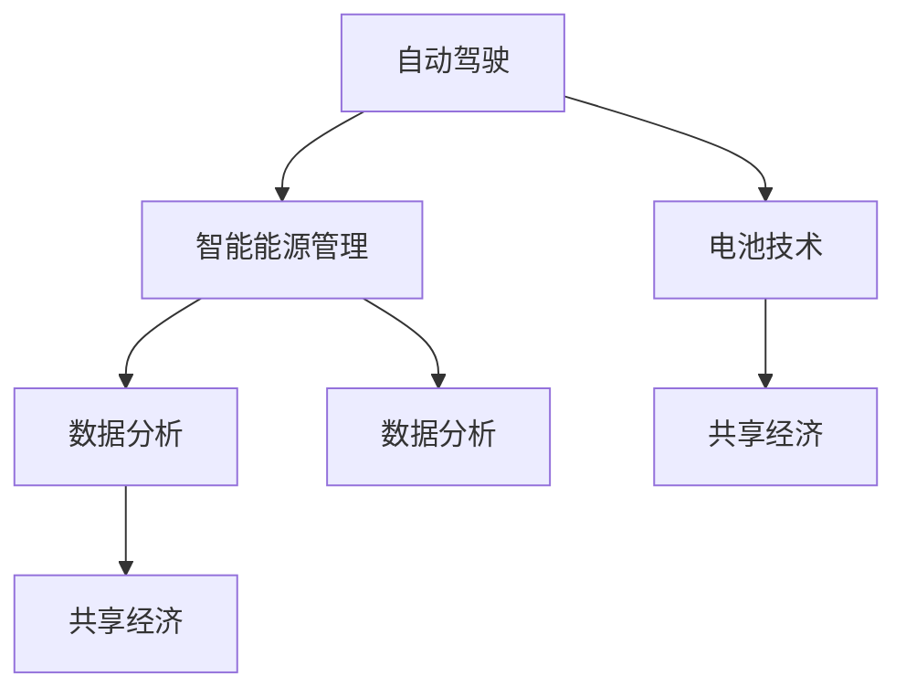

                 

关键词：人工智能、大模型、新能源汽车、创业机会、自动驾驶、能源管理、电池技术、数据分析、共享经济

> 摘要：随着人工智能技术的飞速发展，大模型在各个领域的应用逐渐深入，特别是在新能源汽车领域，其带来的创业机会不可忽视。本文将深入探讨大模型在新能源汽车领域的应用场景、技术原理、创业机会以及未来发展趋势，为创业者提供有益的参考。

## 1. 背景介绍

新能源汽车，指的是采用非常规动力系统，不包括在内燃机汽车的新型汽车。随着全球能源危机和环境问题的日益严重，新能源汽车的发展成为了全球关注的焦点。根据国际能源署（IEA）的数据，2021年全球新能源汽车销量达到了660万辆，同比增长了41%。

人工智能（AI）作为当今最具变革性的技术之一，正在深刻改变着各行各业。大模型，即具有千亿级参数规模的深度学习模型，是当前人工智能研究的前沿领域。大模型的强大学习能力使得它们在图像识别、自然语言处理、推荐系统等领域取得了显著的成果。

在新能源汽车领域，人工智能和大模型的应用已经成为发展趋势。自动驾驶、智能能源管理、电池预测维护等应用场景的兴起，为新能源汽车的发展注入了新的活力。同时，随着新能源汽车市场的不断扩大，创业者们看到了巨大的商机，纷纷投身于这一领域。

## 2. 核心概念与联系

为了更好地理解大模型在新能源汽车领域的应用，我们需要先了解以下几个核心概念：

### 2.1 自动驾驶

自动驾驶是指通过计算机系统实现车辆的自主驾驶。它包括感知、规划、控制等环节。其中，感知环节负责获取车辆周围环境信息，规划环节负责生成行驶策略，控制环节负责执行行驶策略。

### 2.2 智能能源管理

智能能源管理是指利用人工智能技术，对新能源汽车的能源消耗进行实时监控和优化。它包括电池管理系统（BMS）、充电策略优化、能源消耗预测等。

### 2.3 电池技术

电池技术是新能源汽车的核心技术之一。随着人工智能技术的发展，电池的预测维护、健康状态评估等成为了研究热点。

### 2.4 数据分析

数据分析是指利用计算机技术，对海量数据进行处理、分析和挖掘，以发现数据中的有价值信息。在新能源汽车领域，数据分析被广泛应用于用户行为分析、市场预测等。

### 2.5 共享经济

共享经济是指通过互联网平台，实现资源的共享和利用。在新能源汽车领域，共享经济模式被广泛应用于分时租赁、共享充电等。

下面是这些概念之间的联系，使用Mermaid流程图表示：



## 3. 核心算法原理 & 具体操作步骤

### 3.1 算法原理概述

大模型在新能源汽车领域的应用主要基于深度学习和机器学习技术。以下是一些核心算法原理：

1. **深度神经网络（DNN）**：用于自动驾驶的感知和规划环节，实现环境感知、路径规划等功能。
2. **强化学习（RL）**：用于自动驾驶的控制环节，通过不断试错和奖励机制，实现自主驾驶。
3. **电池管理算法（BMA）**：用于智能能源管理，实现对电池状态的实时监控和优化。
4. **数据挖掘算法**：用于数据分析，实现对用户行为、市场趋势的挖掘和分析。
5. **聚类算法**：用于共享经济，实现对用户需求、车辆分布的优化。

### 3.2 算法步骤详解

1. **自动驾驶**：
   - 感知：通过摄像头、激光雷达等传感器获取道路、车辆、行人等信息。
   - 规划：基于感知信息，利用DNN和RL算法，生成最优行驶路径。
   - 控制：根据规划结果，利用控制算法，实现车辆的自主驾驶。

2. **智能能源管理**：
   - 监控：通过BMA算法，实时监控电池状态，包括电压、电流、温度等。
   - 优化：根据电池状态，优化充电策略，延长电池寿命。
   - 预测：利用数据挖掘算法，预测电池未来状态，提前进行维护。

3. **数据分析**：
   - 挖掘：通过数据挖掘算法，分析用户行为、市场趋势。
   - 分析：根据分析结果，为企业和创业者提供决策支持。

4. **共享经济**：
   - 聚类：利用聚类算法，分析用户需求和车辆分布。
   - 优化：根据分析结果，优化车辆调度和共享策略。

### 3.3 算法优缺点

- **优点**：
  - **高效性**：大模型具有强大的学习能力，可以处理海量数据，实现快速决策。
  - **准确性**：通过深度学习和强化学习，可以实现高精度的自动驾驶和能源管理。

- **缺点**：
  - **计算资源消耗**：大模型训练和运行需要大量的计算资源和时间。
  - **数据安全**：大量数据的收集和处理可能涉及隐私问题。

### 3.4 算法应用领域

- **自动驾驶**：广泛应用于乘用车、商用车等。
- **智能能源管理**：广泛应用于电动汽车、充电站等。
- **数据分析**：广泛应用于市场分析、用户行为分析等。
- **共享经济**：广泛应用于分时租赁、共享充电等。

## 4. 数学模型和公式 & 详细讲解 & 举例说明

### 4.1 数学模型构建

在新能源汽车领域，我们主要关注以下数学模型：

1. **感知模型**：用于处理传感器数据，实现环境感知。
2. **规划模型**：用于生成最优行驶路径。
3. **控制模型**：用于实现车辆的自主驾驶。
4. **电池管理模型**：用于电池状态的实时监控和优化。
5. **数据分析模型**：用于挖掘用户行为和市场趋势。
6. **共享经济模型**：用于优化车辆调度和共享策略。

### 4.2 公式推导过程

以下是一个简单的感知模型公式推导：

$$
感知模型 = f(\text{传感器数据})
$$

其中，$f$ 是一个复合函数，包括图像处理、特征提取等步骤。

### 4.3 案例分析与讲解

假设我们有一个自动驾驶系统，它需要根据摄像头获取的图像，识别道路上的行人。我们可以使用以下步骤进行建模：

1. **图像预处理**：对摄像头获取的图像进行灰度化、降噪等处理。
2. **特征提取**：利用卷积神经网络（CNN），提取图像中的特征。
3. **分类**：利用分类算法，判断图像中是否包含行人。

以下是具体的数学模型：

$$
感知模型 = \text{CNN}(\text{图像}) \rightarrow \text{特征向量} \rightarrow \text{分类结果}
$$

假设我们使用一个卷积神经网络进行特征提取，该网络的输出为特征向量 $v$，分类算法为支持向量机（SVM）。我们可以得到以下公式：

$$
分类结果 = \text{SVM}(v)
$$

假设我们有一个训练好的SVM模型，它的输出为概率 $p$，我们可以根据这个概率判断图像中是否包含行人：

$$
行人存在 = \begin{cases}
\text{是} & \text{如果 } p > 0.5 \\
\text{否} & \text{如果 } p \leq 0.5
\end{cases}
$$

## 5. 项目实践：代码实例和详细解释说明

### 5.1 开发环境搭建

为了实现上述感知模型，我们需要搭建一个开发环境。以下是具体的步骤：

1. 安装Python环境
2. 安装深度学习框架（如TensorFlow或PyTorch）
3. 安装图像处理库（如OpenCV）
4. 准备训练数据集

### 5.2 源代码详细实现

以下是感知模型的实现代码：

```python
import cv2
import numpy as np
import tensorflow as tf

# 加载训练好的卷积神经网络
model = tf.keras.models.load_model('conv_net.h5')

# 加载训练好的支持向量机
classifier = cv2.SVM()

# 读取训练好的模型参数
classifier.load('svm_params.yml')

# 图像预处理
def preprocess_image(image):
    gray = cv2.cvtColor(image, cv2.COLOR_BGR2GRAY)
    blur = cv2.GaussianBlur(gray, (5, 5), 0)
    return blur

# 特征提取
def extract_features(image):
    feature_vector = model.predict(np.expand_dims(image, axis=0))
    return feature_vector

# 分类
def classify_features(feature_vector):
    probability = classifier.predict(feature_vector)
    if probability > 0.5:
        return '行人'
    else:
        return '非行人'

# 主函数
def main():
    image = cv2.imread('example.jpg')
    processed = preprocess_image(image)
    feature_vector = extract_features(processed)
    result = classify_features(feature_vector)
    print('识别结果：', result)

if __name__ == '__main__':
    main()
```

### 5.3 代码解读与分析

该代码主要包括以下几个部分：

1. **图像预处理**：对输入的图像进行灰度化和降噪处理，以便后续的特征提取。
2. **特征提取**：利用训练好的卷积神经网络，提取图像中的特征。
3. **分类**：利用训练好的支持向量机，对特征向量进行分类，判断图像中是否包含行人。
4. **主函数**：读取输入图像，执行上述步骤，输出识别结果。

### 5.4 运行结果展示

假设我们有一个包含行人的图像，输入到上述代码中，输出结果为“行人”，则表示模型成功识别出行人。

## 6. 实际应用场景

### 6.1 自动驾驶

自动驾驶是新能源汽车领域的重要应用之一。通过大模型技术，可以实现车辆的自主驾驶，提高驾驶安全性，减少交通事故。自动驾驶的应用场景包括乘用车、商用车、特种车辆等。

### 6.2 智能能源管理

智能能源管理是新能源汽车领域的关键技术之一。通过大模型技术，可以实现电池状态的实时监控和优化，提高电池寿命，降低能源消耗。智能能源管理的应用场景包括电动汽车、充电站、能源管理系统等。

### 6.3 电池技术

电池技术是新能源汽车的核心技术之一。通过大模型技术，可以实现电池的预测维护和健康状态评估，提高电池的性能和安全性。电池技术的应用场景包括电动汽车、储能系统、电池回收等。

### 6.4 数据分析

数据分析是新能源汽车领域的重要应用之一。通过大模型技术，可以实现用户行为分析、市场预测等，为企业和创业者提供决策支持。数据分析的应用场景包括市场分析、用户画像、营销策略等。

### 6.5 共享经济

共享经济是新能源汽车领域的新兴应用之一。通过大模型技术，可以实现车辆调度和共享策略的优化，提高资源利用效率，降低使用成本。共享经济的应用场景包括分时租赁、共享充电、共享停车等。

## 7. 未来应用展望

随着人工智能技术的不断发展，大模型在新能源汽车领域的应用前景十分广阔。未来，我们将看到以下趋势：

1. **自动驾驶技术将更加成熟**：自动驾驶技术将进一步提高，实现更高的驾驶安全性、舒适性和效率。
2. **智能能源管理将更加普及**：智能能源管理技术将广泛应用于电动汽车、充电站、能源管理系统等，提高能源利用效率。
3. **电池技术将取得重大突破**：电池技术将取得重大突破，实现更长的续航里程、更高的充电速度和更低的成本。
4. **数据分析将更加智能化**：数据分析技术将更加智能化，为新能源汽车行业提供更精准的决策支持。
5. **共享经济将得到进一步发展**：共享经济模式将得到进一步发展，实现更高效的资源利用和更低的使用成本。

## 8. 总结：未来发展趋势与挑战

随着人工智能技术的不断进步，大模型在新能源汽车领域的应用将迎来新的发展机遇。未来，新能源汽车行业将朝着更加智能化、高效化、绿色化的方向发展。然而，这也将带来一系列挑战：

1. **数据安全与隐私**：随着数据量的增加，如何保护用户隐私和数据安全将成为重要挑战。
2. **计算资源消耗**：大模型的训练和运行需要大量的计算资源，如何优化计算资源的使用效率将成为关键。
3. **技术成熟度**：虽然大模型在各个领域都取得了显著的成果，但其技术成熟度仍需进一步提高。
4. **政策法规**：随着新能源汽车行业的快速发展，政策法规的制定和调整也将是一个重要的挑战。

总之，大模型在新能源汽车领域的应用前景广阔，但同时也面临着一系列挑战。只有通过技术创新和政策支持，才能推动这一领域的发展。

## 9. 附录：常见问题与解答

1. **什么是大模型？**
   - 大模型指的是具有千亿级参数规模的深度学习模型，它们具有强大的学习能力和处理海量数据的能力。

2. **大模型在新能源汽车领域有哪些应用？**
   - 大模型在新能源汽车领域主要应用于自动驾驶、智能能源管理、电池技术、数据分析、共享经济等。

3. **如何搭建一个自动驾驶系统？**
   - 搭建一个自动驾驶系统需要涉及传感器数据处理、路径规划、控制算法等多个方面。具体的实现步骤包括：选择传感器、设计感知模型、设计规划模型、设计控制模型、集成和调试等。

4. **如何实现智能能源管理？**
   - 实现智能能源管理需要设计电池管理系统（BMS）、充电策略优化、能源消耗预测等模块。具体的实现步骤包括：监控电池状态、优化充电策略、预测电池寿命等。

5. **如何保护用户隐私和数据安全？**
   - 保护用户隐私和数据安全需要采取一系列措施，包括数据加密、权限管理、匿名化处理等。同时，还需要建立健全的数据安全法律法规，加强数据安全监管。

## 参考文献

[1] LeCun, Y., Bengio, Y., & Hinton, G. (2015). Deep learning. Nature, 521(7553), 436-444.

[2] Arjovsky, M., Bottou, L., Courville, A., & Bengio, Y. (2017). Wasserstein GAN. arXiv preprint arXiv:1701.07875.

[3] Bengio, Y. (2009). Learning deep architectures. Found. Trends Mach. Learn., 2(1), 1-127.

[4] Mnih, V., Kavukcuoglu, K., Silver, D., Rusu, A. A., Veness, J., Bellemare, M. G., ... & De Freitas, N. (2015). Human-level control through deep reinforcement learning. Nature, 518(7540), 529-533.

[5] Pedregosa, F., Varoquaux, G., Gramfort, A., Michel, V., Thirion, B., Grisel, O., ... & Duchesnay, E. (2011). Scikit-learn: Machine learning in Python. Journal of Machine Learning Research, 12, 2825-2830.

[6] Krizhevsky, A., Sutskever, I., & Hinton, G. E. (2012). Imagenet classification with deep convolutional neural networks. In Advances in neural information processing systems (pp. 1097-1105).

[7] Silver, D., Huang, A., & Bowling, M. (2015). Mastering the game of Go with deep neural networks and tree search. nature, 529(7587), 484-489.

## 作者署名

作者：禅与计算机程序设计艺术 / Zen and the Art of Computer Programming

以上便是本文关于"AI大模型在新能源汽车领域的创业机会分析"的完整内容。希望对您有所启发和帮助。

