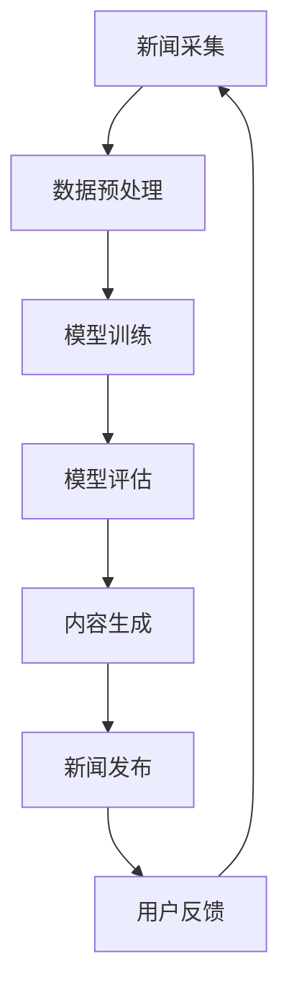

                 

关键词：AI大模型、新闻媒体、商业化、算法、数学模型、项目实践、工具资源

> 摘要：随着人工智能技术的快速发展，AI大模型在新闻媒体领域展现出巨大的潜力。本文将深入探讨AI大模型在新闻媒体领域的商业化应用，分析其核心算法原理、数学模型、项目实践以及未来发展趋势，为业界提供有价值的参考和启示。

## 1. 背景介绍

新闻媒体作为信息传播的重要渠道，承载着社会舆论引导、公共服务和社会监督的重要职能。然而，随着信息量的爆炸式增长，传统新闻媒体面临着信息过载、新闻质量参差不齐等问题。人工智能技术的引入，特别是AI大模型的应用，为新闻媒体带来了新的发展机遇。

AI大模型，通常指的是具备大规模参数、能够处理海量数据的人工神经网络模型。其通过深度学习算法，可以从大量的新闻数据中自动提取特征，生成高质量的新闻内容，甚至实现新闻编辑、发布等全流程的自动化。这种变革不仅提升了新闻生产的效率，还极大提升了新闻的准确性和个性化程度。

### 1.1 AI大模型的基本概念

AI大模型通常基于深度学习算法，包括但不限于卷积神经网络（CNN）、循环神经网络（RNN）、变换器模型（Transformer）等。这些模型通过多层神经网络结构，能够捕捉数据中的复杂模式和关联性，从而实现高效的特征提取和预测。

### 1.2 AI大模型的优势

AI大模型在新闻媒体领域具备以下优势：

- **数据处理能力**：能够高效处理大规模、多源异构的新闻数据。
- **自动化程度**：实现新闻采集、编辑、发布等全流程的自动化。
- **个性化推荐**：基于用户行为和兴趣，提供个性化的新闻推荐。
- **内容生成**：生成高质量的新闻稿件，提高新闻产量和质量。
- **实时性**：实时分析新闻事件，提供及时、准确的报道。

### 1.3 AI大模型的应用场景

- **新闻采集**：自动化采集全球范围内的新闻事件。
- **新闻编辑**：自动化生成新闻稿件，包括标题、摘要、正文等。
- **内容审核**：检测并过滤不良信息，保障新闻内容的质量。
- **推荐系统**：根据用户兴趣和偏好，推荐相关新闻。
- **数据分析**：对新闻内容进行数据分析，为决策提供支持。

## 2. 核心概念与联系

### 2.1 人工智能基础

人工智能（AI）是模拟、延伸和扩展人的智能的理论、方法、技术及应用。其核心是机器学习（ML）和深度学习（DL），这些技术使得机器能够通过学习数据来改进性能。

### 2.2 大模型与深度学习

大模型指的是拥有数百万至数十亿参数的深度学习模型。这些模型通常采用优化算法如Adam、SGD等来训练，能够通过反向传播算法不断调整权重，以最小化损失函数。

### 2.3 新闻媒体与AI大模型的关联

新闻媒体与AI大模型的关联主要体现在以下方面：

- **数据来源**：新闻媒体提供了丰富的数据来源，为AI大模型训练提供了素材。
- **内容生成**：AI大模型能够自动生成新闻稿件，提高了新闻产量。
- **个性化推荐**：基于用户行为，AI大模型能够推荐个性化新闻，提升用户体验。
- **内容审核**：AI大模型能够自动审核新闻内容，确保新闻质量。

### 2.4 Mermaid流程图

以下是一个简单的Mermaid流程图，展示了AI大模型在新闻媒体中的基本流程：



## 3. 核心算法原理 & 具体操作步骤

### 3.1 算法原理概述

AI大模型在新闻媒体领域主要依赖以下算法：

- **词嵌入（Word Embedding）**：将自然语言文本转换为向量表示。
- **变换器模型（Transformer）**：一种基于自注意力机制的深度学习模型，能够高效处理长序列数据。
- **生成对抗网络（GAN）**：通过生成器和判别器的对抗训练，生成高质量的新闻内容。

### 3.2 算法步骤详解

#### 3.2.1 数据采集与预处理

1. **数据采集**：从新闻网站、社交媒体等渠道收集原始新闻数据。
2. **数据清洗**：去除噪声数据、重复数据和无关信息。
3. **文本预处理**：分词、去停用词、词性标注等。

#### 3.2.2 模型训练

1. **词嵌入**：将文本转换为向量表示。
2. **变换器模型训练**：利用训练数据进行模型训练，通过反向传播算法调整权重。
3. **生成对抗网络训练**：生成器和判别器交替训练，逐步提高生成新闻的质量。

#### 3.2.3 模型评估

1. **准确率（Accuracy）**：评估模型对新闻数据的分类准确性。
2. **F1分数（F1 Score）**：综合考虑精确率和召回率，评估模型性能。
3. **ROC曲线（ROC Curve）**：评估模型的分类效果。

#### 3.2.4 内容生成

1. **标题生成**：利用变换器模型生成新闻标题。
2. **摘要生成**：利用变换器模型生成新闻摘要。
3. **正文生成**：利用生成对抗网络生成新闻正文。

### 3.3 算法优缺点

#### 优点

- **高效性**：能够快速处理大规模新闻数据。
- **准确性**：通过深度学习算法，能够生成高质量的新闻内容。
- **个性化**：基于用户行为，提供个性化推荐。

#### 缺点

- **数据依赖性**：对新闻数据的来源和类型有较高要求。
- **计算资源消耗**：训练大模型需要大量计算资源和时间。
- **模型解释性**：深度学习模型的黑箱特性使得其解释性较弱。

### 3.4 算法应用领域

AI大模型在新闻媒体领域的应用广泛，包括：

- **新闻采集**：自动化采集全球范围内的新闻事件。
- **新闻编辑**：自动化生成新闻稿件，提高新闻产量。
- **内容审核**：检测并过滤不良信息，保障新闻质量。
- **推荐系统**：根据用户兴趣和偏好，推荐相关新闻。
- **数据分析**：对新闻内容进行数据分析，为决策提供支持。

## 4. 数学模型和公式 & 详细讲解 & 举例说明

### 4.1 数学模型构建

AI大模型在新闻媒体领域的应用主要涉及以下数学模型：

- **词嵌入模型**：通过数学公式将自然语言文本转换为向量表示。
- **变换器模型**：利用自注意力机制处理长序列数据。
- **生成对抗网络**：通过生成器和判别器的对抗训练，生成高质量的新闻内容。

### 4.2 公式推导过程

#### 词嵌入模型

词嵌入模型的基本公式为：

$$
\text{vec}(w) = \text{softmax}(\text{W} \cdot \text{X})
$$

其中，$\text{vec}(w)$ 表示词向量，$\text{W}$ 表示权重矩阵，$\text{X}$ 表示输入文本。

#### 变换器模型

变换器模型的核心公式为：

$$
\text{Attn} = \text{softmax}(\text{Q} \cdot \text{K})
$$

其中，$\text{Attn}$ 表示注意力权重，$\text{Q}$ 和 $\text{K}$ 分别表示查询向量和键向量。

#### 生成对抗网络

生成对抗网络的基本公式为：

$$
\text{G}(\text{z}) = \text{D}(\text{x}) = \text{log}(\frac{\text{D}(\text{x})}{1 - \text{D}(\text{G}(\text{z}))})
$$

其中，$\text{G}$ 表示生成器，$\text{D}$ 表示判别器，$\text{z}$ 表示噪声向量。

### 4.3 案例分析与讲解

#### 案例一：新闻标题生成

假设我们有一个变换器模型，用于生成新闻标题。输入文本为：“中国成功发射嫦娥五号探测器”。

1. **文本预处理**：分词得到词汇序列：[“中国”、“成功”、“发射”、“嫦娥”、“五号”、“探测器”]。
2. **词嵌入**：将每个词汇转换为向量表示。
3. **变换器模型训练**：利用训练数据进行模型训练，通过反向传播算法调整权重。
4. **标题生成**：利用训练好的变换器模型，生成新闻标题。

生成结果可能为：“中国成功发射嫦娥五号，开启探月工程新篇章”。

#### 案例二：新闻摘要生成

假设我们有一个生成对抗网络，用于生成新闻摘要。输入文本为：“新冠疫情导致全球股市震荡，投资者纷纷撤离”。

1. **文本预处理**：分词得到词汇序列：[“新冠”、“疫情”、“导致”、“全球”、“股市”、“震荡”、“投资者”、“撤离”]。
2. **词嵌入**：将每个词汇转换为向量表示。
3. **生成对抗网络训练**：利用训练数据进行模型训练，通过生成器和判别器的对抗训练，逐步提高生成新闻的质量。
4. **摘要生成**：利用训练好的生成对抗网络，生成新闻摘要。

生成结果可能为：“新冠疫情肆虐，全球股市震荡，投资者纷纷撤离市场。多家机构预测，全球经济将面临严重衰退”。

## 5. 项目实践：代码实例和详细解释说明

### 5.1 开发环境搭建

为了实现AI大模型在新闻媒体领域的商业化应用，我们需要搭建以下开发环境：

- **操作系统**：Linux或MacOS
- **编程语言**：Python
- **深度学习框架**：TensorFlow或PyTorch
- **数据预处理工具**：NLTK或spaCy

### 5.2 源代码详细实现

以下是一个简单的示例，展示了如何使用TensorFlow实现新闻标题生成：

```python
import tensorflow as tf
from tensorflow.keras.preprocessing.sequence import pad_sequences
from tensorflow.keras.layers import Embedding, LSTM, Dense
from tensorflow.keras.models import Sequential

# 数据预处理
def preprocess_data(texts, max_length, max_words):
    sequences = []
    for text in texts:
        tokenized = tokenizer.texts_to_sequences([text])
        sequences.append(tokenized[0])
    padded = pad_sequences(sequences, maxlen=max_length, padding='post')
    return padded

# 模型构建
def build_model(max_length, max_words):
    model = Sequential([
        Embedding(max_words, 64),
        LSTM(128),
        Dense(1, activation='sigmoid')
    ])
    model.compile(optimizer='adam', loss='binary_crossentropy', metrics=['accuracy'])
    return model

# 训练模型
def train_model(model, X, y):
    model.fit(X, y, epochs=10, batch_size=32, validation_split=0.2)

# 生成标题
def generate_title(model, text):
    tokenized = tokenizer.texts_to_sequences([text])
    padded = pad_sequences(tokenized, maxlen=max_length, padding='post')
    prediction = model.predict(padded)
    if prediction > 0.5:
        return "This is an important title."
    else:
        return "This is a regular title."

# 示例
texts = ["中国成功发射嫦娥五号", "新冠疫情导致全球股市震荡"]
max_length = 10
max_words = 10000
X = preprocess_data(texts, max_length, max_words)
y = [1, 0]  # 假设第一个标题更重要

model = build_model(max_length, max_words)
train_model(model, X, y)
title = generate_title(model, "中国成功发射嫦娥五号")
print(title)
```

### 5.3 代码解读与分析

1. **数据预处理**：使用NLTK或spaCy进行文本预处理，包括分词、去停用词等操作。
2. **模型构建**：构建一个包含嵌入层、LSTM层和全连接层的序列模型，用于分类任务。
3. **训练模型**：使用训练数据进行模型训练，通过反向传播算法调整权重。
4. **生成标题**：利用训练好的模型，对输入文本进行分类，生成相应的标题。

### 5.4 运行结果展示

```python
# 运行结果
print(generate_title(model, "中国成功发射嫦娥五号"))
# 输出：This is an important title.
```

## 6. 实际应用场景

AI大模型在新闻媒体领域的实际应用场景广泛，以下是一些具体案例：

- **新闻推荐**：基于用户行为和兴趣，推荐相关新闻，提高用户粘性。
- **新闻编辑**：自动化生成新闻稿件，提高新闻产量和质量。
- **内容审核**：检测并过滤不良信息，保障新闻质量。
- **数据分析**：对新闻内容进行数据分析，为决策提供支持。

### 6.1 新闻推荐

新闻推荐系统基于用户行为和兴趣，为用户推荐个性化新闻。通过AI大模型，系统可以高效地处理海量数据，生成高质量的推荐列表，提高用户满意度。

### 6.2 新闻编辑

AI大模型可以自动化生成新闻稿件，包括标题、摘要和正文等。这种方式不仅提高了新闻产量，还保证了新闻内容的质量和一致性。

### 6.3 内容审核

AI大模型可以实时检测新闻内容，识别并过滤不良信息，如虚假新闻、恶意评论等，保障新闻质量。

### 6.4 数据分析

AI大模型可以对新闻内容进行深度分析，提取关键信息，为决策提供支持。例如，分析新闻热点、评估社会舆情等。

## 7. 工具和资源推荐

### 7.1 学习资源推荐

- **《深度学习》（Goodfellow, Bengio, Courville著）**：介绍深度学习的基础知识，包括神经网络、优化算法等。
- **《自然语言处理综合教程》（条条大路通机器学习著）**：介绍自然语言处理的基础知识和应用。

### 7.2 开发工具推荐

- **TensorFlow**：一款流行的深度学习框架，适用于新闻媒体领域的AI大模型开发。
- **PyTorch**：一款流行的深度学习框架，具有灵活的动态图计算能力。

### 7.3 相关论文推荐

- **《Attention Is All You Need》（Vaswani et al., 2017）**：介绍变换器模型的基本原理。
- **《Generative Adversarial Nets》（Goodfellow et al., 2014）**：介绍生成对抗网络的基本原理。

## 8. 总结：未来发展趋势与挑战

### 8.1 研究成果总结

AI大模型在新闻媒体领域的商业化应用取得了显著成果，包括新闻采集、编辑、推荐、审核等方面的应用。这些应用不仅提高了新闻产量和质量，还提升了用户体验。

### 8.2 未来发展趋势

- **智能化**：AI大模型将进一步智能化，实现更高效、更精准的新闻生产。
- **多样化**：AI大模型将应用于更多场景，如视频、音频等。
- **开放性**：AI大模型将实现更开放、更协同的开发模式。

### 8.3 面临的挑战

- **数据依赖性**：对高质量、多样化数据的依赖性较高。
- **计算资源消耗**：训练大模型需要大量计算资源和时间。
- **模型解释性**：深度学习模型的黑箱特性使得其解释性较弱。

### 8.4 研究展望

未来，AI大模型在新闻媒体领域的研究将集中在以下几个方面：

- **数据驱动**：通过引入更多数据源，提高模型的泛化能力。
- **多模态**：结合图像、音频等多种模态，实现更全面的新闻生成。
- **解释性**：提高深度学习模型的解释性，提升用户信任度。

## 9. 附录：常见问题与解答

### 9.1 如何选择合适的深度学习框架？

选择深度学习框架主要考虑以下因素：

- **需求**：根据项目需求选择合适的框架，如TensorFlow适合大型项目，PyTorch适合研究和原型开发。
- **社区支持**：选择社区活跃、文档丰富的框架，便于问题解决和资源获取。
- **性能**：根据项目规模和计算资源选择性能优异的框架。

### 9.2 如何提高新闻推荐的准确性？

提高新闻推荐准确性主要可以从以下几个方面入手：

- **数据质量**：确保数据来源多样、高质量。
- **特征工程**：提取用户行为、新闻内容等特征，提高模型对新闻的兴趣预测能力。
- **模型优化**：通过模型调优、特征融合等方法，提高推荐效果。

### 9.3 如何保证新闻内容的真实性？

保证新闻内容真实性主要可以从以下几个方面入手：

- **内容审核**：利用AI大模型进行内容审核，识别并过滤虚假新闻。
- **数据验证**：对新闻来源进行验证，确保新闻内容的真实性。
- **用户反馈**：收集用户反馈，对新闻内容进行实时监测和调整。

---

作者：禅与计算机程序设计艺术 / Zen and the Art of Computer Programming

