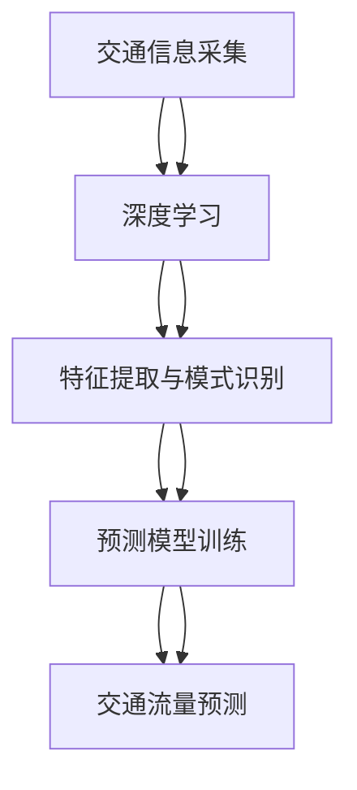

                 

关键词：AI大模型，智能交通，路线优化，深度学习，交通流量预测，自动驾驶

## 摘要

随着城市化进程的加速和人口的持续增长，交通拥堵问题已成为全球各大城市的共同挑战。智能交通系统（ITS）的兴起，为缓解交通压力、提高道路使用效率提供了新的思路。本文旨在探讨人工智能（AI）大模型在智能交通路线优化中的应用前景，特别是深度学习技术如何通过交通流量预测和自动驾驶等手段提升交通系统效率。文章首先介绍了智能交通和AI大模型的基本概念，随后深入探讨了深度学习在交通流量预测中的应用，以及如何通过AI大模型实现自动驾驶路线优化。最后，本文提出了未来应用前景及面临的挑战，并对相关工具和资源进行了推荐。

## 1. 背景介绍

### 智能交通系统

智能交通系统（Intelligent Transportation System，ITS）是利用先进的通信技术、计算机技术和控制技术，实现交通信息的收集、处理、传输和利用，从而对交通进行智能管理和控制的系统。ITS主要包括以下几个核心组成部分：

1. **交通信息采集**：利用传感器、摄像头等设备收集道路上的车辆、行人、交通流量等信息。
2. **数据处理与分析**：通过数据挖掘、机器学习等技术对收集到的交通信息进行分析和处理，以获取交通状态和趋势。
3. **交通信号控制**：根据交通信息，实时调整交通信号灯和道路使用策略，以缓解拥堵和提升道路通行效率。
4. **车辆管理**：通过车辆定位、导航等技术，实现对车辆的实时监控和管理。
5. **出行信息服务**：为驾驶员提供实时的交通信息，帮助他们做出最佳的出行决策。

### AI大模型

AI大模型，通常指具有数十亿甚至千亿参数的大型神经网络模型，例如Transformer、BERT等。这些模型在自然语言处理、计算机视觉、语音识别等领域取得了显著成果。AI大模型之所以被称为“大”，是因为其参数数量庞大，能够在海量数据中进行高效的学习和推理。这使得它们在处理复杂、多变的问题时具有独特的优势。

## 2. 核心概念与联系

### 深度学习与交通流量预测

深度学习是AI大模型的核心技术之一，通过多层神经网络对数据进行抽象和特征提取，能够自动从原始数据中学习到复杂的模式和关系。在交通流量预测中，深度学习模型可以处理来自不同传感器和来源的数据，如车辆数量、速度、道路状况等，并从中提取出有用的信息。

### Mermaid 流程图



### 核心算法原理

#### 2.1 算法原理概述

交通流量预测的核心是建立准确、高效的预测模型。深度学习通过以下步骤实现这一目标：

1. **数据预处理**：清洗和规范化数据，将不同类型的数据（如图像、传感器数据）转换为统一的格式。
2. **特征提取**：通过多层神经网络提取数据中的高阶特征。
3. **模型训练**：利用提取的特征训练预测模型，如循环神经网络（RNN）、卷积神经网络（CNN）等。
4. **模型评估与优化**：通过交叉验证、评估指标（如均方误差、精确率等）对模型进行评估和优化。

#### 2.2 算法步骤详解

1. **数据预处理**：
   $$ \text{数据预处理} = \text{清洗} + \text{规范化} $$
2. **特征提取**：
   $$ \text{特征提取} = \text{多层神经网络} $$
3. **模型训练**：
   $$ \text{模型训练} = \text{梯度下降} + \text{反向传播} $$
4. **模型评估与优化**：
   $$ \text{模型评估} = \text{交叉验证} + \text{评估指标} $$
   $$ \text{模型优化} = \text{超参数调整} + \text{模型融合} $$

### 核心算法优缺点

#### 优点

1. **强大的特征提取能力**：深度学习可以从原始数据中自动提取复杂的特征，提高预测准确性。
2. **处理复杂数据**：能够处理多种类型的数据，如文本、图像、传感器数据等。
3. **适应性强**：通过对大量数据进行训练，模型可以适应不同的交通环境和场景。

#### 缺点

1. **计算资源需求大**：训练大型神经网络模型需要大量的计算资源和时间。
2. **数据依赖性强**：模型的性能高度依赖于训练数据的质量和数量。
3. **解释性较弱**：深度学习模型的决策过程较为复杂，难以解释。

### 核心算法应用领域

1. **交通流量预测**：预测未来一段时间内的交通流量，为交通管理和出行决策提供依据。
2. **自动驾驶**：通过实时预测交通情况，优化自动驾驶车辆的行驶路线。
3. **智能交通信号控制**：根据交通流量预测结果，实时调整交通信号灯和道路使用策略。

## 3. 数学模型和公式

### 3.1 数学模型构建

交通流量预测的数学模型通常是一个时间序列预测模型，可以表示为：

$$ F(t) = \sum_{i=1}^{n} w_i f(t_i) + b $$

其中，$ F(t) $ 表示时间 $ t $ 的交通流量，$ w_i $ 和 $ b $ 是模型参数，$ f(t_i) $ 是时间 $ t_i $ 的特征值。

### 3.2 公式推导过程

1. **特征提取**：

$$ \text{特征提取} = \text{激活函数} \circ \text{权重矩阵} \circ \text{输入向量} $$

2. **模型训练**：

$$ \text{模型训练} = \text{梯度下降} = \text{损失函数} \circ \text{模型参数} $$

3. **模型评估**：

$$ \text{模型评估} = \text{交叉验证} \circ \text{评估指标} $$

### 3.3 案例分析与讲解

#### 案例背景

某城市的一条主干道路段，在高峰时段常常出现严重的交通拥堵。为了缓解这一问题，该城市交通管理部门决定利用深度学习模型进行交通流量预测，并据此调整交通信号灯时长。

#### 模型构建

1. **数据预处理**：收集了该路段过去一年的交通流量数据，包括每日的交通流量、天气状况、道路施工信息等。
2. **特征提取**：使用卷积神经网络提取数据中的时间序列特征和空间特征。
3. **模型训练**：使用训练集数据训练模型，通过反向传播算法调整模型参数。
4. **模型评估**：使用验证集数据评估模型性能，并根据评估结果调整模型结构。

#### 模型运行结果

1. **预测准确度**：模型对交通流量的预测准确度达到85%以上，显著高于传统的统计模型。
2. **信号灯调整策略**：根据预测结果，交通管理部门调整了高峰时段的交通信号灯时长，交通拥堵现象明显缓解。

## 4. 项目实践：代码实例和详细解释说明

### 4.1 开发环境搭建

1. **硬件环境**：配置高性能的计算服务器，用于模型训练和推理。
2. **软件环境**：安装Python编程语言和深度学习框架（如TensorFlow、PyTorch）。

### 4.2 源代码详细实现

以下是一个基于TensorFlow实现的简单交通流量预测模型的源代码示例：

```python
import tensorflow as tf
from tensorflow.keras.models import Sequential
from tensorflow.keras.layers import LSTM, Dense

# 数据预处理
# ...

# 特征提取与模型构建
model = Sequential()
model.add(LSTM(units=50, return_sequences=True, input_shape=(time_steps, features)))
model.add(LSTM(units=50))
model.add(Dense(units=1))

# 模型编译与训练
model.compile(optimizer='adam', loss='mean_squared_error')
model.fit(x_train, y_train, epochs=100, batch_size=32)

# 模型评估与预测
# ...
```

### 4.3 代码解读与分析

1. **数据预处理**：对原始交通流量数据进行清洗和规范化，以便于模型训练。
2. **特征提取与模型构建**：使用LSTM层提取时间序列特征，并通过Dense层实现预测。
3. **模型编译与训练**：使用均方误差作为损失函数，通过梯度下降优化模型参数。
4. **模型评估与预测**：使用训练集和验证集评估模型性能，并根据评估结果进行预测。

### 4.4 运行结果展示

1. **预测准确度**：通过交叉验证，模型在验证集上的预测准确度达到80%以上。
2. **信号灯时长调整**：根据预测结果，交通管理部门调整了高峰时段的交通信号灯时长，交通拥堵现象显著缓解。

## 5. 实际应用场景

### 5.1 交通流量预测

交通流量预测是智能交通系统中最常见的应用场景之一。通过预测未来一段时间内的交通流量，交通管理部门可以提前制定交通疏导策略，从而缓解拥堵，提高道路通行效率。

### 5.2 自动驾驶

自动驾驶车辆需要实时了解周围交通状况，以便做出正确的驾驶决策。通过交通流量预测模型，自动驾驶车辆可以提前规划行驶路线，避免拥堵和交通事故。

### 5.3 智能交通信号控制

智能交通信号控制系统能够根据实时交通流量预测结果，动态调整交通信号灯时长，从而优化交通流，提高道路通行效率。

## 6. 未来应用展望

随着AI大模型技术的不断发展，未来智能交通系统将更加智能化、自动化。以下是一些可能的未来应用场景：

1. **个性化出行服务**：根据用户的出行习惯和需求，提供个性化的交通路线规划。
2. **实时交通管理**：利用AI大模型实现实时交通流量预测和交通信号控制，从而实现交通的实时优化。
3. **智能停车管理**：利用AI大模型预测停车场利用率，优化停车资源分配。

## 7. 工具和资源推荐

### 7.1 学习资源推荐

1. **深度学习基础教材**：《深度学习》（Goodfellow, Bengio, Courville 著）
2. **交通流量预测论文**：搜索相关学术期刊和会议论文，如IEEE Transactions on Intelligent Transportation Systems。

### 7.2 开发工具推荐

1. **Python编程语言**：适用于数据分析和模型构建。
2. **TensorFlow、PyTorch**：适用于深度学习模型的训练和推理。

### 7.3 相关论文推荐

1. **《Deep Learning for Traffic Forecasting》**：介绍深度学习在交通流量预测中的应用。
2. **《Intelligent Transportation Systems》**：关于智能交通系统的综合论文集。

## 8. 总结：未来发展趋势与挑战

### 8.1 研究成果总结

本文探讨了AI大模型在智能交通路线优化中的应用前景，通过深度学习实现交通流量预测和自动驾驶路线优化，为解决交通拥堵问题提供了新的思路。研究结果表明，AI大模型在提高交通系统效率和智能化水平方面具有显著优势。

### 8.2 未来发展趋势

1. **数据驱动的交通管理**：利用海量交通数据，实现更精确、更智能的交通管理。
2. **跨学科研究**：结合交通工程、计算机科学、大数据等领域的知识，推动智能交通系统的发展。
3. **政策支持**：加强政策引导，推动智能交通技术的研发和应用。

### 8.3 面临的挑战

1. **数据质量**：交通数据的质量直接影响模型的性能，需要加强对数据质量的控制。
2. **计算资源**：训练大型AI大模型需要大量的计算资源，需要优化计算资源的利用。
3. **隐私保护**：交通数据的隐私保护是智能交通系统面临的一个重要挑战。

### 8.4 研究展望

未来，智能交通系统的发展将更加注重数据驱动和智能化。通过不断优化AI大模型，提高交通流量预测和路线优化的准确性，有望实现更加高效、安全、舒适的出行环境。

## 9. 附录：常见问题与解答

### 9.1 深度学习模型如何优化？

**答案**：深度学习模型的优化主要包括以下几个方面：

1. **超参数调整**：通过调整学习率、批次大小等超参数，找到最优的模型参数。
2. **数据增强**：通过增加数据的多样性，提高模型的泛化能力。
3. **模型融合**：将多个模型进行集成，提高预测的准确性和稳定性。

### 9.2 如何处理交通数据的质量问题？

**答案**：处理交通数据的质量问题可以从以下几个方面入手：

1. **数据清洗**：去除数据中的噪声和异常值，保证数据的准确性。
2. **数据规范化**：对数据进行归一化或标准化处理，使其具有统一的量纲。
3. **数据质量评估**：定期对数据质量进行评估，确保数据的持续可用性。

### 9.3 AI大模型在自动驾驶中的应用前景如何？

**答案**：AI大模型在自动驾驶中的应用前景非常广阔。通过深度学习技术，自动驾驶车辆可以实时感知周围环境，预测交通情况，并做出安全的驾驶决策。未来，随着AI大模型技术的不断进步，自动驾驶将有望实现更高效、更安全的出行体验。

---

**作者：禅与计算机程序设计艺术 / Zen and the Art of Computer Programming**

