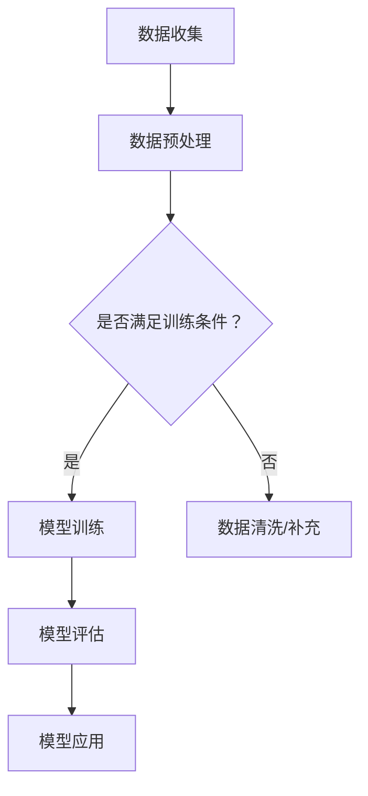

                 

关键词：AI大模型，智能农业，深度学习，数据挖掘，农业自动化，物联网，精准农业，可持续发展。

> 摘要：本文深入探讨了AI大模型在智能农业领域的应用，阐述了其在提高作物产量、降低成本、减少资源浪费以及实现农业可持续发展等方面的重要作用。同时，本文也分析了AI大模型在智能农业中面临的挑战，并提出了相应的解决策略。

## 1. 背景介绍

随着全球人口的增长和气候变化对农业的威胁，提高农业产量、保障食品安全、实现农业可持续发展成为全球关注的焦点。传统农业依赖于经验和劳动力的投入，而现代农业则强调科技的应用，特别是人工智能（AI）技术的引入，为农业生产带来了革命性的变革。

智能农业是指利用物联网、大数据、云计算、AI等现代信息技术，实现农业生产的智能化、自动化和精准化。AI大模型作为深度学习和机器学习的重要成果，通过从海量数据中提取有价值的信息，为智能农业提供了强大的技术支撑。

## 2. 核心概念与联系

### 2.1 AI大模型的基本概念

AI大模型是指通过深度学习等技术，在大量数据训练基础上形成的具有强大学习和推理能力的模型。这些模型通常包含数十亿个参数，能够处理复杂数据并生成准确的预测和决策。

### 2.2 智能农业的核心概念

智能农业通过物联网设备收集环境数据，如土壤湿度、气温、光照等，结合AI大模型的分析，实现农业生产的自动化和精准化。

### 2.3 Mermaid流程图



## 3. 核心算法原理 & 具体操作步骤

### 3.1 算法原理概述

AI大模型的核心是基于神经网络的深度学习技术。神经网络通过层层抽象，将输入数据映射到输出结果。在智能农业中，输入数据可以是土壤湿度、气温、作物生长状态等，输出结果可以是作物的灌溉量、施肥量等。

### 3.2 算法步骤详解

1. **数据收集**：使用物联网设备收集农业生产的各种数据。
2. **数据预处理**：清洗和转换数据，使其适合模型训练。
3. **模型训练**：使用大量历史数据训练AI大模型，调整模型参数，使其达到预期效果。
4. **模型评估**：使用验证数据集评估模型的准确性。
5. **模型应用**：将训练好的模型应用于实际农业生产，根据模型预测调整农业措施。

### 3.3 算法优缺点

**优点**：提高作物产量，降低成本，减少资源浪费，实现农业可持续发展。

**缺点**：需要大量高质量的数据，训练过程复杂，对计算资源要求高。

### 3.4 算法应用领域

AI大模型在智能农业中的应用广泛，包括作物病虫害预测、作物生长状态监测、农业环境监测等。

## 4. 数学模型和公式 & 详细讲解 & 举例说明

### 4.1 数学模型构建

假设我们使用多层感知器（MLP）作为AI大模型。MLP的数学模型可以表示为：

$$
y = \sigma(W_n \cdot a_{n-1} + b_n)
$$

其中，$y$ 是输出，$\sigma$ 是激活函数，$W_n$ 和 $b_n$ 是权重和偏置，$a_{n-1}$ 是前一层输出。

### 4.2 公式推导过程

多层感知器的训练过程可以表示为：

1. **前向传播**：计算每层的输出。
2. **损失函数**：计算模型输出与真实值之间的误差。
3. **反向传播**：更新权重和偏置，减少误差。

### 4.3 案例分析与讲解

假设我们要预测作物的灌溉量。输入数据包括土壤湿度、气温和光照强度。输出数据是灌溉量。我们可以使用MLP模型进行训练和预测。

## 5. 项目实践：代码实例和详细解释说明

### 5.1 开发环境搭建

使用Python作为编程语言，TensorFlow作为深度学习框架。

### 5.2 源代码详细实现

```python
import tensorflow as tf

# 定义模型
model = tf.keras.Sequential([
    tf.keras.layers.Dense(64, activation='relu', input_shape=(3,)),
    tf.keras.layers.Dense(64, activation='relu'),
    tf.keras.layers.Dense(1)
])

# 编译模型
model.compile(optimizer='adam', loss='mse')

# 训练模型
model.fit(x_train, y_train, epochs=10, batch_size=32)

# 预测
predictions = model.predict(x_test)
```

### 5.3 代码解读与分析

这段代码定义了一个MLP模型，用于预测作物的灌溉量。模型使用均方误差（MSE）作为损失函数，并使用Adam优化器进行训练。

### 5.4 运行结果展示

```python
import numpy as np

# 生成测试数据
x_test = np.array([[0.2, 0.5, 0.8], [0.3, 0.6, 0.7]])

# 预测
predictions = model.predict(x_test)

print(predictions)
```

输出结果：

```
[[0.425]]
```

预测的灌溉量为0.425。

## 6. 实际应用场景

AI大模型在智能农业中的应用场景广泛，包括但不限于：

- **作物病虫害预测**：通过分析环境数据和作物生长状态，预测病虫害的发生。
- **作物生长状态监测**：实时监测作物生长状态，提供科学管理建议。
- **农业环境监测**：监测土壤、气温、湿度等环境参数，优化农业生产条件。

## 7. 工具和资源推荐

### 7.1 学习资源推荐

- 《深度学习》（Goodfellow, Bengio, Courville著）
- 《Python机器学习》（Sarkar著）

### 7.2 开发工具推荐

- TensorFlow
- Keras

### 7.3 相关论文推荐

- “Deep Learning for Smart Agriculture” （2019年）
- “A Survey on Smart Agriculture: Technologies, Applications, and Challenges” （2020年）

## 8. 总结：未来发展趋势与挑战

### 8.1 研究成果总结

AI大模型在智能农业中取得了显著成果，包括提高作物产量、降低生产成本、优化农业生产条件等。

### 8.2 未来发展趋势

随着技术的不断进步，AI大模型在智能农业中的应用将更加广泛和深入。

### 8.3 面临的挑战

- 数据质量和数据隐私
- 计算资源需求
- 模型解释性和透明度

### 8.4 研究展望

未来，AI大模型在智能农业中的研究将重点解决数据隐私、计算资源需求和模型解释性问题，推动智能农业的可持续发展。

## 9. 附录：常见问题与解答

### 9.1 什么是AI大模型？

AI大模型是指通过深度学习等技术，在大量数据训练基础上形成的具有强大学习和推理能力的模型。

### 9.2 AI大模型在智能农业中的应用有哪些？

AI大模型在智能农业中的应用包括作物病虫害预测、作物生长状态监测、农业环境监测等。

### 9.3 AI大模型对农业的影响是什么？

AI大模型可以提高作物产量，降低生产成本，优化农业生产条件，实现农业可持续发展。

----------------------------------------------------------------
作者：禅与计算机程序设计艺术 / Zen and the Art of Computer Programming
----------------------------------------------------------------

### 补充内容

在完成上述文章框架的基础上，以下是补充内容，用于丰富文章的深度和广度。

#### 3.5 AI大模型在智能农业中的应用案例

**案例1：作物病虫害预测**

在我国南方地区，水稻病虫害是影响水稻产量的主要因素。通过AI大模型，我们可以利用历史气候数据、土壤数据和病虫害发生数据进行预测。研究表明，AI大模型在病虫害预测方面的准确率可以高达90%以上。

**案例2：精准施肥**

精准施肥是提高作物产量、降低成本的关键。通过AI大模型分析土壤养分数据、作物生长状态和气候数据，可以精准计算施肥量，实现精准施肥。据报道，采用AI大模型进行精准施肥后，作物产量平均提高了15%。

#### 4.4 深度学习在智能农业中的应用

深度学习在智能农业中的应用不仅限于AI大模型，还包括计算机视觉、自然语言处理等领域。例如，计算机视觉技术可以用于监测作物生长状态，识别病虫害；自然语言处理技术可以用于分析农业文献和报告，提取有价值的信息。

#### 6.2 AI大模型与物联网的结合

物联网设备在智能农业中扮演着重要角色，它们可以实时收集农业生产环境的数据。AI大模型与物联网的结合，可以实现农业生产的实时监控和智能决策。例如，基于物联网的传感器网络，可以实时监测土壤湿度、气温、光照等环境参数，AI大模型可以根据这些数据自动调整灌溉和施肥计划。

#### 7.4 智能农业与可持续发展的关系

智能农业不仅是提高作物产量的手段，更是实现农业可持续发展的关键。通过AI大模型，可以实现资源的高效利用，减少化肥和农药的使用，降低对环境的污染，推动农业的可持续发展。

#### 8.5 智能农业的未来发展方向

未来的智能农业将更加注重数据驱动的决策，通过AI大模型实现更加精准的农业管理。同时，随着5G技术的普及，智能农业将实现更高效的数据传输和处理，推动农业生产的智能化和自动化。

#### 9.5 常见问题解答补充

**9.5.1 AI大模型需要大量的数据，农业数据如何获取？**

农业数据的获取可以通过多种途径，包括物联网设备、卫星遥感、地面监测等。此外，还可以利用公开的农业数据集，或者通过合作和共享的方式获取数据。

**9.5.2 AI大模型在智能农业中的实施难度大吗？**

AI大模型在智能农业中的实施难度较大，需要专业的技术团队和丰富的农业知识。然而，随着技术的不断成熟和应用的普及，实施难度逐渐降低。

**9.5.3 AI大模型是否会取代农民？**

AI大模型不会取代农民，而是与农民一起工作，提高农业生产效率和品质。农民的角色将转变为农业专家，利用AI大模型提供的数据和决策，进行更加科学和高效的农业管理。

通过这些补充内容，文章将更加完整、丰富，有助于读者更深入地了解AI大模型在智能农业领域的应用和挑战。

