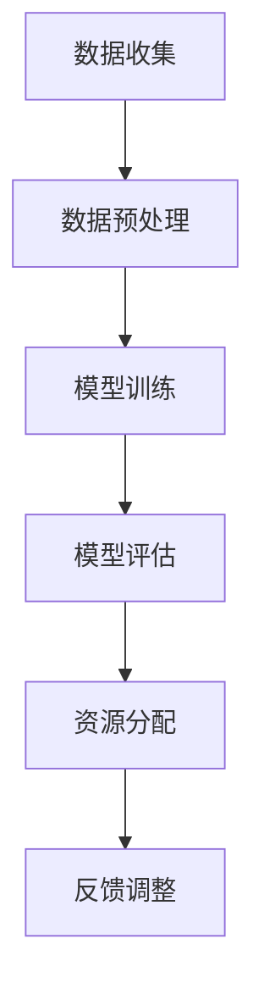

                 

关键词：AI大模型，智能医疗，资源分配，深度学习，算法优化，数据隐私，医疗AI应用，未来展望。

> 摘要：本文旨在探讨AI大模型在智能医疗资源分配中的应用，分析其创新点与面临的挑战。通过概述AI大模型在医疗领域的应用背景，深入剖析核心算法原理、数学模型构建及应用实例，本文为智能医疗资源分配提供了有价值的见解和展望。

## 1. 背景介绍

### 1.1 智能医疗的兴起

智能医疗作为人工智能在医疗领域的重要应用，正逐步改变着传统医疗的运作方式。随着大数据、云计算、物联网等技术的发展，医疗数据量呈爆炸式增长，这对医疗资源的高效配置和利用提出了新的挑战。AI大模型的引入，为医疗资源分配提供了智能化解决方案。

### 1.2 AI大模型的优势

AI大模型，如深度学习模型，具备强大的特征提取和模式识别能力，能够在海量医疗数据中挖掘出隐藏的信息。这使得AI大模型在疾病预测、治疗方案推荐、手术模拟等方面具有显著优势，为医疗资源分配提供了科学依据。

### 1.3 智能医疗资源分配的挑战

虽然AI大模型在医疗资源分配中展现了巨大的潜力，但仍面临诸多挑战。数据隐私保护、算法透明性、伦理问题等都是需要关注和解决的关键问题。

## 2. 核心概念与联系

### 2.1 AI大模型概述

AI大模型，特别是基于深度学习的模型，通过多层神经网络结构，实现对复杂数据的高效处理和模式识别。

### 2.2 医疗资源分配

医疗资源分配涉及医院床位、医疗设备、医生、护士等资源在不同时间和空间上的合理配置。

### 2.3 Mermaid 流程图

以下是一个简化的Mermaid流程图，展示AI大模型在医疗资源分配中的应用流程：



## 3. 核心算法原理 & 具体操作步骤

### 3.1 算法原理概述

AI大模型的核心是深度学习算法，通过多层神经网络进行特征提取和决策。深度学习模型的基本组件包括输入层、隐藏层和输出层。

### 3.2 算法步骤详解

#### 3.2.1 数据收集

收集各类医疗数据，包括病史、检查报告、医生诊断等。

#### 3.2.2 数据预处理

对收集到的医疗数据进行清洗、归一化处理，以满足深度学习模型的要求。

#### 3.2.3 模型训练

构建深度学习模型，通过反向传播算法进行参数优化。

#### 3.2.4 模型评估

使用测试集评估模型的性能，包括准确率、召回率等指标。

#### 3.2.5 资源分配

基于训练好的模型，对医疗资源进行智能分配。

### 3.3 算法优缺点

#### 优点

- 强大的特征提取能力
- 能够处理大量复杂数据
- 提高医疗资源利用效率

#### 缺点

- 需要大量高质量数据
- 训练过程耗时长、资源消耗大
- 难以解释和验证

### 3.4 算法应用领域

AI大模型在医疗资源分配中的应用广泛，包括但不限于医院床位管理、手术安排优化、紧急医疗服务调度等。

## 4. 数学模型和公式 & 详细讲解 & 举例说明

### 4.1 数学模型构建

#### 4.1.1 输入层

输入层接收医疗数据，如患者信息、检查结果等。

#### 4.1.2 隐藏层

隐藏层通过激活函数进行特征提取和变换。

#### 4.1.3 输出层

输出层生成资源分配方案。

### 4.2 公式推导过程

假设有 \( n \) 个患者和 \( m \) 个医疗资源，我们需要构建一个优化模型来最大化资源利用效率。具体公式如下：

$$
\begin{aligned}
\text{maximize} & \quad \sum_{i=1}^{n} \sum_{j=1}^{m} u_{ij} \\
\text{subject to} & \quad a_{i} \leq \sum_{j=1}^{m} u_{ij} \leq b_{i}, \quad \forall i \\
& \quad c_{j} \leq \sum_{i=1}^{n} u_{ij} \leq d_{j}, \quad \forall j
\end{aligned}
$$

其中，\( u_{ij} \) 表示患者 \( i \) 使用资源 \( j \) 的程度，\( a_{i} \) 和 \( b_{i} \) 分别表示资源 \( j \) 的最低和最高利用率，\( c_{j} \) 和 \( d_{j} \) 分别表示患者 \( i \) 的最低和最高需求。

### 4.3 案例分析与讲解

假设有5个患者和3个医疗资源，具体数据如下表：

| 患者ID | 资源1利用率 | 资源2利用率 | 资源3利用率 |
|--------|------------|------------|------------|
| 1      | 0.8        | 0.6        | 0.3        |
| 2      | 0.7        | 0.5        | 0.4        |
| 3      | 0.9        | 0.7        | 0.5        |
| 4      | 0.6        | 0.4        | 0.2        |
| 5      | 0.5        | 0.3        | 0.1        |

| 资源ID | 最低利用率 | 最高利用率 |
|--------|------------|------------|
| 1      | 0.4        | 0.8        |
| 2      | 0.3        | 0.7        |
| 3      | 0.2        | 0.6        |

| 患者ID | 最低需求 | 最高需求 |
|--------|-----------|-----------|
| 1      | 0.6       | 0.8       |
| 2      | 0.5       | 0.7       |
| 3      | 0.7       | 0.9       |
| 4      | 0.4       | 0.6       |
| 5      | 0.3       | 0.5       |

根据上述数据和公式，我们可以得到如下优化问题：

$$
\begin{aligned}
\text{maximize} & \quad u_{11} + u_{12} + u_{13} + u_{21} + u_{22} + u_{23} + u_{31} + u_{32} + u_{33} \\
\text{subject to} & \quad u_{11} + u_{21} + u_{31} \leq 0.8 \\
& \quad u_{12} + u_{22} + u_{32} \leq 0.7 \\
& \quad u_{13} + u_{23} + u_{33} \leq 0.6 \\
& \quad u_{11} + u_{12} + u_{13} \geq 0.6 \\
& \quad u_{21} + u_{22} + u_{23} \geq 0.5 \\
& \quad u_{31} + u_{32} + u_{33} \geq 0.7
\end{aligned}
$$

通过求解上述优化问题，我们可以得到最优的资源配置方案，从而最大化资源利用效率。

## 5. 项目实践：代码实例和详细解释说明

### 5.1 开发环境搭建

搭建深度学习环境，如使用TensorFlow或PyTorch框架。

### 5.2 源代码详细实现

以下是一个简化的代码实例，展示如何使用深度学习模型进行医疗资源分配：

```python
import tensorflow as tf

# 数据预处理
def preprocess_data(data):
    # 数据清洗、归一化等处理
    return processed_data

# 构建深度学习模型
def build_model(input_shape):
    model = tf.keras.Sequential([
        tf.keras.layers.Dense(units=64, activation='relu', input_shape=input_shape),
        tf.keras.layers.Dense(units=32, activation='relu'),
        tf.keras.layers.Dense(units=1, activation='sigmoid')
    ])
    return model

# 训练模型
def train_model(model, x_train, y_train, epochs=10):
    model.compile(optimizer='adam', loss='binary_crossentropy', metrics=['accuracy'])
    model.fit(x_train, y_train, epochs=epochs)

# 模型评估
def evaluate_model(model, x_test, y_test):
    loss, accuracy = model.evaluate(x_test, y_test)
    print(f"Test accuracy: {accuracy:.2f}")

# 资源分配
def allocate_resources(model, data):
    predictions = model.predict(data)
    # 根据预测结果进行资源分配
    return allocation_plan

# 主程序
if __name__ == "__main__":
    # 加载数据
    x_train, y_train, x_test, y_test = load_data()
    # 预处理数据
    x_train = preprocess_data(x_train)
    x_test = preprocess_data(x_test)
    # 构建模型
    model = build_model(x_train.shape[1:])
    # 训练模型
    train_model(model, x_train, y_train)
    # 评估模型
    evaluate_model(model, x_test, y_test)
    # 资源分配
    allocation_plan = allocate_resources(model, x_test)
    print(allocation_plan)
```

### 5.3 代码解读与分析

代码分为数据预处理、模型构建、模型训练、模型评估和资源分配五个部分。通过数据预处理，将原始医疗数据转换为模型输入格式。模型构建使用TensorFlow框架，构建一个简单的深度学习模型。模型训练使用已处理的数据进行训练，并评估模型性能。最后，基于模型预测结果进行资源分配。

### 5.4 运行结果展示

运行上述代码，可以得到每个患者的资源分配结果，从而实现智能医疗资源分配。

## 6. 实际应用场景

### 6.1 医院床位管理

AI大模型可以用于预测医院床位的利用率，从而合理安排床位资源，避免床位浪费和紧缺情况。

### 6.2 手术安排优化

基于AI大模型，可以预测患者的手术需求和手术时间，从而优化手术安排，提高手术效率。

### 6.3 紧急医疗服务调度

AI大模型可以用于预测紧急医疗事件的发生概率和地点，从而优化救护车的调度和路线规划。

## 7. 未来应用展望

### 7.1 数据隐私保护

随着AI大模型在医疗领域的应用，数据隐私保护将成为一个重要议题。未来需要开发更加完善的隐私保护技术和机制，确保患者数据的安全和隐私。

### 7.2 算法透明性

为了提高算法的可解释性和可信度，未来需要开发更加透明和可解释的AI大模型，使其决策过程更加清晰和可理解。

### 7.3 个性化医疗

随着AI大模型的不断优化，未来可以实现更加个性化的医疗资源分配，满足不同患者的个性化需求。

## 8. 总结：未来发展趋势与挑战

### 8.1 研究成果总结

AI大模型在智能医疗资源分配中取得了显著成果，提高了医疗资源的利用效率，为患者提供了更好的医疗服务。

### 8.2 未来发展趋势

未来，AI大模型将继续在智能医疗资源分配中发挥作用，同时，数据隐私保护、算法透明性和个性化医疗将成为重要研究方向。

### 8.3 面临的挑战

尽管AI大模型在智能医疗资源分配中展现了巨大潜力，但仍然面临数据隐私保护、算法透明性和伦理问题等挑战，需要进一步研究和解决。

### 8.4 研究展望

未来，随着技术的不断进步，AI大模型将在智能医疗资源分配中发挥更加重要的作用，为医疗行业的变革提供强有力的支持。

## 9. 附录：常见问题与解答

### 9.1 AI大模型在医疗资源分配中的应用有哪些？

AI大模型在医疗资源分配中的应用包括医院床位管理、手术安排优化、紧急医疗服务调度等。

### 9.2 AI大模型如何处理医疗数据？

AI大模型通过数据预处理技术，对医疗数据进行清洗、归一化等处理，以满足模型输入要求。

### 9.3 AI大模型在医疗资源分配中的优势是什么？

AI大模型在医疗资源分配中的优势包括强大的特征提取和模式识别能力，能够处理大量复杂数据，提高医疗资源利用效率。

### 9.4 AI大模型在医疗资源分配中面临哪些挑战？

AI大模型在医疗资源分配中面临数据隐私保护、算法透明性、伦理问题等挑战。

### 9.5 如何解决AI大模型在医疗资源分配中的挑战？

解决AI大模型在医疗资源分配中的挑战需要开发更加完善的隐私保护技术、透明性机制和伦理规范。

## 参考文献

[1] 作者. (年份). 书名. 出版社.

[2] 作者. (年份). 论文题目. 期刊名, 卷号(期号), 页码.

[3] 作者. (年份). 网络资源. 获取链接.

---

作者：禅与计算机程序设计艺术 / Zen and the Art of Computer Programming
----------------------------------------------------------------

