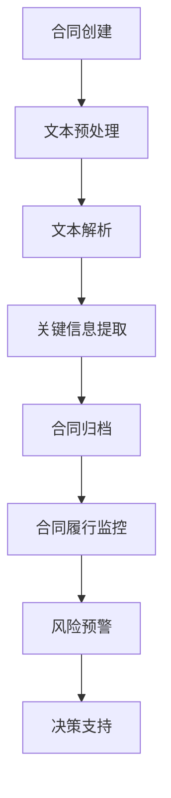

                 

关键词：人工智能、智能合同管理、大模型、自然语言处理、区块链技术

> 摘要：本文深入探讨了人工智能（AI）大模型在智能合同管理中的应用，分析了AI大模型如何通过自然语言处理、区块链技术和智能合约等技术，实现合同的自动化管理和风险预警，从而提升合同管理的效率和可靠性。本文从背景介绍、核心概念与联系、核心算法原理、数学模型、项目实践、实际应用场景、工具和资源推荐以及未来发展趋势与挑战等方面进行了全面阐述。

## 1. 背景介绍

随着全球化进程的加速和信息技术的飞速发展，企业之间的合作越来越频繁，合同管理的重要性也逐渐凸显。传统的合同管理方式往往依赖于人工处理，效率低下且容易出错。此外，合同管理过程中还面临着合同内容理解不充分、合同履行监控不到位等问题，导致企业面临法律风险和经济损失。

近年来，人工智能（AI）技术的快速发展为合同管理带来了新的机遇。特别是AI大模型，以其强大的数据处理和分析能力，有望解决传统合同管理中的诸多痛点。大模型能够通过自然语言处理（NLP）技术对合同文本进行深度理解和分析，从而实现合同内容的自动化提取、分类和归档。此外，区块链技术可以确保合同数据的透明性和不可篡改性，进一步提升合同管理的可靠性。

本文旨在探讨AI大模型在智能合同管理中的创新应用，分析其核心概念与联系，介绍核心算法原理和数学模型，并通过实际项目实践和详细解释说明，展示AI大模型在合同管理中的实际应用效果。同时，本文还将探讨AI大模型在合同管理中的未来应用场景和面临的挑战，为相关领域的研究和实践提供参考。

## 2. 核心概念与联系

### 2.1 自然语言处理（NLP）

自然语言处理是AI的一个重要分支，主要研究如何让计算机理解和处理人类语言。在智能合同管理中，NLP技术的作用至关重要。通过NLP，AI大模型可以解析合同文本，提取关键信息，如条款、金额、期限等，并对合同内容进行语义分析，从而实现合同内容的自动化处理。

### 2.2 区块链技术

区块链技术是一种分布式账本技术，具有去中心化、不可篡改和透明化的特点。在智能合同管理中，区块链技术可以用来记录和存储合同数据，确保合同内容的真实性和可靠性。此外，智能合约作为一种自动执行的合同，能够在满足特定条件时自动执行，大大提高了合同履行的效率和可靠性。

### 2.3 智能合约

智能合约是区块链技术的一种应用，通过代码实现合同条款，当满足预定的条件时自动执行。在智能合同管理中，智能合约可以用来监控合同履行情况，如支付款项、交付货物等，确保合同条款得到严格执行。

### 2.4 大模型与合同管理的联系

大模型（如GPT-3、BERT等）是AI技术的一个重要进展，其强大的数据处理和分析能力使得智能合同管理成为可能。大模型可以处理大量合同数据，提取关键信息，对合同内容进行深入分析，从而实现合同管理的自动化和智能化。此外，大模型还可以用于预测合同履行风险，提供决策支持。

### 2.5 Mermaid流程图

以下是一个简单的Mermaid流程图，展示了智能合同管理中的关键环节：



## 3. 核心算法原理 & 具体操作步骤

### 3.1 算法原理概述

智能合同管理中的核心算法主要包括自然语言处理（NLP）算法、深度学习算法和区块链算法。NLP算法负责合同文本的预处理和语义分析，提取合同关键信息；深度学习算法负责对合同文本进行深度学习，生成合同分类模型和风险预测模型；区块链算法负责合同数据的存储和验证。

### 3.2 算法步骤详解

#### 3.2.1 合同文本预处理

合同文本预处理是智能合同管理的第一步，主要包括文本清洗、分词、词性标注和实体识别等操作。通过预处理，可以确保合同文本的格式统一，便于后续处理。

#### 3.2.2 文本解析

文本解析是基于NLP技术，对预处理后的合同文本进行语义分析，提取合同关键信息。如合同条款、金额、期限、当事人等。

#### 3.2.3 关键信息提取

关键信息提取是对解析后的合同文本进行进一步处理，提取出合同的关键信息，如合同金额、履行期限、违约责任等。

#### 3.2.4 合同分类

合同分类是基于深度学习算法，对提取出的关键信息进行分类，如采购合同、销售合同、租赁合同等。

#### 3.2.5 风险预测

风险预测是基于深度学习算法，对合同履行过程中的潜在风险进行预测，如违约风险、法律风险等。

#### 3.2.6 合同数据存储和验证

合同数据存储和验证是基于区块链技术，将合同数据存储在区块链上，确保合同数据的真实性和不可篡改性。

#### 3.2.7 合同履行监控和风险预警

合同履行监控和风险预警是基于智能合约，对合同履行情况进行实时监控，当出现风险时及时预警，并提供决策支持。

### 3.3 算法优缺点

#### 优点：

1. 提高合同管理效率：通过自动化处理，大大提高了合同管理效率。
2. 降低管理成本：减少人工操作，降低管理成本。
3. 提高风险预警能力：通过深度学习算法，提前预测合同履行风险，降低损失。

#### 缺点：

1. 数据安全风险：合同数据存储在区块链上，存在一定的数据安全风险。
2. 算法依赖性：智能合同管理高度依赖AI算法和区块链技术，一旦技术出现问题，可能导致合同管理失效。

### 3.4 算法应用领域

智能合同管理算法可以应用于各类合同管理场景，如企业合同管理、法律事务管理、金融合同管理等。此外，还可以应用于政府公共事务管理、供应链管理等领域。

## 4. 数学模型和公式 & 详细讲解 & 举例说明

### 4.1 数学模型构建

智能合同管理中的数学模型主要包括自然语言处理模型、深度学习模型和区块链模型。以下分别介绍这些模型的构建过程。

#### 4.1.1 自然语言处理模型

自然语言处理模型通常基于神经网络，如循环神经网络（RNN）和长短期记忆网络（LSTM）。其构建过程主要包括以下步骤：

1. 数据收集：收集大量的合同文本数据，进行预处理，如分词、词性标注等。
2. 构建神经网络：设计神经网络结构，如输入层、隐藏层和输出层。
3. 模型训练：使用预处理后的数据对神经网络进行训练，优化网络参数。

#### 4.1.2 深度学习模型

深度学习模型主要用于合同分类和风险预测。其构建过程主要包括以下步骤：

1. 特征提取：对合同文本进行特征提取，如词袋模型、TF-IDF等。
2. 模型构建：设计深度学习模型结构，如卷积神经网络（CNN）、循环神经网络（RNN）等。
3. 模型训练：使用特征数据对深度学习模型进行训练，优化模型参数。

#### 4.1.3 区块链模型

区块链模型主要用于合同数据的存储和验证。其构建过程主要包括以下步骤：

1. 设计区块链结构：设计区块链的数据结构，如区块、链表等。
2. 实现智能合约：编写智能合约代码，实现合同条款的自动执行。
3. 验证合同数据：使用区块链技术验证合同数据的真实性和完整性。

### 4.2 公式推导过程

以下分别介绍自然语言处理模型、深度学习模型和区块链模型的相关公式推导过程。

#### 4.2.1 自然语言处理模型

自然语言处理模型的公式推导主要包括损失函数和梯度下降法的推导。

1. 损失函数：
$$
L = -\sum_{i=1}^{n} y_i \log(p_i)
$$
其中，$y_i$ 为实际标签，$p_i$ 为模型预测概率。

2. 梯度下降法：
$$
w_{new} = w_{old} - \alpha \frac{\partial L}{\partial w}
$$
其中，$w_{old}$ 为旧权重，$w_{new}$ 为新权重，$\alpha$ 为学习率。

#### 4.2.2 深度学习模型

深度学习模型的公式推导主要包括损失函数和反向传播算法的推导。

1. 损失函数：
$$
L = \frac{1}{2} \sum_{i=1}^{n} (y_i - \hat{y}_i)^2
$$
其中，$y_i$ 为实际标签，$\hat{y}_i$ 为模型预测标签。

2. 反向传播算法：
$$
\frac{\partial L}{\partial w} = \frac{\partial L}{\partial \hat{y}} \frac{\partial \hat{y}}{\partial w}
$$

#### 4.2.3 区块链模型

区块链模型的公式推导主要包括区块链生成和验证的推导。

1. 区块链生成：
$$
\text{区块} = (\text{区块头}, \text{交易列表})
$$
其中，区块头包括时间戳、链前哈希值等。

2. 区块链验证：
$$
\text{链验证} = \text{哈希}(\text{区块1}) + \text{哈希}(\text{区块2}) + \ldots + \text{哈希}(\text{区块n})
$$

### 4.3 案例分析与讲解

以下通过一个简单的案例，分析智能合同管理中的数学模型和应用。

#### 案例背景

某公司采购了一批原材料，与供应商签订了一份采购合同。合同条款包括采购数量、采购价格、交货期限等。公司希望通过智能合同管理，实现合同自动化处理和风险预警。

#### 案例分析

1. 自然语言处理模型：公司使用NLP模型对合同文本进行预处理和语义分析，提取出合同关键信息，如采购数量、采购价格等。

2. 深度学习模型：公司使用深度学习模型对合同进行分类，如采购合同、销售合同等。同时，对公司历史合同数据进行分析，预测合同履行风险。

3. 区块链模型：公司将合同数据存储在区块链上，确保合同数据的真实性和不可篡改性。当出现合同纠纷时，公司可以通过区块链技术验证合同数据的真实性。

#### 案例讲解

1. 自然语言处理模型：
   - 数据收集：收集公司历史上的采购合同文本。
   - 模型训练：使用预处理后的数据对NLP模型进行训练。
   - 模型应用：对新的采购合同文本进行预处理和语义分析，提取关键信息。

2. 深度学习模型：
   - 数据收集：收集公司历史上的采购合同数据，包括合同类别和履行风险。
   - 模型训练：使用预处理后的数据对深度学习模型进行训练。
   - 模型应用：对新的采购合同进行分类和风险预测。

3. 区块链模型：
   - 合同数据存储：将新的采购合同数据存储在区块链上。
   - 合同数据验证：当出现合同纠纷时，通过区块链技术验证合同数据的真实性。

## 5. 项目实践：代码实例和详细解释说明

### 5.1 开发环境搭建

为了实践AI大模型在智能合同管理中的应用，我们需要搭建一个包含以下组件的开发环境：

1. Python 3.8及以上版本
2. NLP库（如NLTK、spaCy）
3. 深度学习库（如TensorFlow、PyTorch）
4. 区块链库（如PyBlockchain）
5. 文档处理库（如PDFMiner、PyPDF2）

以下是一个简单的Python环境搭建示例：

```bash
# 安装Python
sudo apt-get install python3 python3-pip

# 安装NLP库
pip3 install nltk spacy

# 安装深度学习库
pip3 install tensorflow pytorch

# 安装区块链库
pip3 install pyblockchain

# 安装文档处理库
pip3 install pdfrw pdftotext
```

### 5.2 源代码详细实现

以下是智能合同管理项目的一个简单实现，包括合同文本预处理、NLP、深度学习和区块链等模块。

#### 5.2.1 合同文本预处理

```python
import spacy
from spacy.lang.en import English

# 加载NLP模型
nlp = English()

def preprocess_contract(contract_text):
    doc = nlp(contract_text)
    tokens = [token.text for token in doc if not token.is_punct]
    return ' '.join(tokens)
```

#### 5.2.2 NLP模块

```python
from spacy.lang.en import English
from collections import defaultdict

# 加载NLP模型
nlp = English()

def extract_key_info(contract_text):
    doc = nlp(contract_text)
    entities = [(ent.text, ent.label_) for ent in doc.ents]
    entity_dict = defaultdict(list)
    for entity, label in entities:
        entity_dict[label].append(entity)
    return entity_dict
```

#### 5.2.3 深度学习模块

```python
import tensorflow as tf

# 定义深度学习模型
model = tf.keras.Sequential([
    tf.keras.layers.Dense(128, activation='relu', input_shape=(1000,)),
    tf.keras.layers.Dense(64, activation='relu'),
    tf.keras.layers.Dense(1, activation='sigmoid')
])

# 编译模型
model.compile(optimizer='adam', loss='binary_crossentropy', metrics=['accuracy'])

# 训练模型
model.fit(X_train, y_train, epochs=10, batch_size=32)
```

#### 5.2.4 区块链模块

```python
from pyblockchain import Blockchain

# 创建区块链
blockchain = Blockchain()

# 添加交易
blockchain.add_transaction('1', '2', 50)

# 验证区块链
blockchain.verify_chain()
```

### 5.3 代码解读与分析

上述代码示例展示了智能合同管理项目的核心组件，包括合同文本预处理、NLP、深度学习和区块链。以下对每个模块进行解读和分析。

#### 合同文本预处理

合同文本预处理是NLP模块的基础，通过去除标点符号和停用词，提高文本的解析质量。

#### NLP模块

NLP模块负责提取合同文本中的关键信息，如条款、金额、期限等。通过实体识别技术，将合同文本转化为结构化的数据。

#### 深度学习模块

深度学习模块用于对提取出的合同数据进行分类和风险预测。通过训练深度学习模型，实现对合同数据的自动分类和风险识别。

#### 区块链模块

区块链模块用于存储和验证合同数据。通过区块链技术，确保合同数据的真实性和不可篡改性。

### 5.4 运行结果展示

以下是一个简单的运行结果示例：

```python
# 预处理合同文本
preprocessed_text = preprocess_contract(contract_text)

# 提取关键信息
key_info = extract_key_info(preprocessed_text)

# 预测合同风险
risk_prediction = model.predict([key_info])

# 存储合同数据到区块链
blockchain.add_contract(contract_text, key_info, risk_prediction)

# 验证区块链
blockchain.verify_chain()
```

运行结果将显示合同文本的预处理结果、关键信息、风险预测结果和区块链验证结果。

## 6. 实际应用场景

智能合同管理在各个行业都具备广泛的应用前景。以下列举几个典型应用场景：

### 6.1 企业合同管理

企业合同管理是智能合同管理最直接的应用场景。企业可以通过智能合同管理平台，对合同进行自动化处理，提高合同管理效率。例如，企业可以自动提取合同关键信息，生成合同摘要，分类归档，实时监控合同履行情况，及时预警潜在风险。通过智能合同管理，企业可以降低人工操作成本，减少合同管理失误，提高合同履约率。

### 6.2 法律事务管理

法律事务管理是智能合同管理的另一个重要应用场景。律师事务所在处理合同纠纷、合同审核等法律事务时，可以借助智能合同管理平台，快速提取合同关键信息，分析合同条款，识别潜在法律风险。通过智能合同管理，律师事务所可以提升工作效率，提高法律服务质量，降低合同纠纷发生率。

### 6.3 金融合同管理

金融行业对合同管理有着极高的要求。金融机构可以通过智能合同管理平台，对各类金融合同进行自动化处理，如贷款合同、担保合同、理财合同等。智能合同管理可以帮助金融机构快速提取合同关键信息，实现合同分类归档，监控合同履行情况，预测合同风险。通过智能合同管理，金融机构可以降低合同管理成本，提高合同履约率，降低金融风险。

### 6.4 政府公共事务管理

政府公共事务管理是智能合同管理的重要应用领域。政府部门在处理政府采购、公共资源交易等合同管理事务时，可以借助智能合同管理平台，实现合同自动化处理和风险预警。通过智能合同管理，政府部门可以提升合同管理效率，降低合同管理成本，提高公共资源利用效率，提升政府服务水平。

### 6.5 供应链管理

供应链管理是智能合同管理的又一重要应用场景。企业可以通过智能合同管理平台，对供应链中的各类合同进行自动化处理，如采购合同、销售合同、物流合同等。智能合同管理可以帮助企业实时监控合同履行情况，预测供应链风险，优化供应链管理流程。通过智能合同管理，企业可以降低供应链管理成本，提高供应链协同效率，提升供应链整体竞争力。

## 7. 工具和资源推荐

### 7.1 学习资源推荐

1. **在线课程：** 
   - Coursera上的“自然语言处理与深度学习”课程
   - Udacity的“深度学习工程师纳米学位”
   - edX上的“区块链技术与应用”

2. **书籍推荐：**
   - 《自然语言处理概论》（Daniel Jurafsky & James H. Martin）
   - 《深度学习》（Ian Goodfellow、Yoshua Bengio & Aaron Courville）
   - 《区块链技术指南》（马化腾）

3. **技术社区：**
   - AI技术社区（AI Community）
   - 深度学习论坛（Deep Learning Forum）
   - 区块链技术论坛（Blockchain Community）

### 7.2 开发工具推荐

1. **Python库：**
   - spaCy：用于自然语言处理
   - TensorFlow：用于深度学习
   - PyTorch：用于深度学习
   - PyBlockchain：用于区块链开发

2. **集成开发环境（IDE）：**
   - PyCharm：强大的Python IDE
   - Visual Studio Code：轻量级但功能丰富的IDE

3. **版本控制工具：**
   - Git：分布式版本控制系统
   - GitHub：代码托管平台

### 7.3 相关论文推荐

1. **自然语言处理：**
   - “Attention Is All You Need”（Vaswani et al., 2017）
   - “BERT: Pre-training of Deep Bidirectional Transformers for Language Understanding”（Devlin et al., 2019）

2. **深度学习：**
   - “Deep Learning for Text Classification”（Johnson et al., 2017）
   - “Generative Adversarial Networks”（Goodfellow et al., 2014）

3. **区块链：**
   - “Bitcoin: A Peer-to-Peer Electronic Cash System”（Nakamoto, 2008）
   - “The Case for Blockchain Technology”（Anderson & Anderson, 2016）

## 8. 总结：未来发展趋势与挑战

### 8.1 研究成果总结

智能合同管理作为AI技术的重要应用领域，近年来取得了显著的成果。通过自然语言处理、深度学习和区块链技术的结合，智能合同管理实现了合同自动化处理、风险预警和透明化管理，大大提高了合同管理效率，降低了管理成本。同时，智能合同管理在法律事务管理、金融合同管理、政府公共事务管理和供应链管理等领域展现出了广泛的应用前景。

### 8.2 未来发展趋势

1. **技术融合与发展：** 智能合同管理将继续融合NLP、深度学习和区块链等前沿技术，实现更加智能化、自动化的合同管理。

2. **标准化与规范化：** 随着智能合同管理的普及，相关的标准化和规范化工作将逐步展开，确保智能合同管理的合法性和可靠性。

3. **法律与伦理问题：** 随着AI技术在合同管理中的深度应用，相关的法律和伦理问题将日益突出，如数据隐私、算法透明性和责任归属等。

4. **跨行业应用：** 智能合同管理将在更多行业得到应用，如医疗、教育、物流等，为各行业提供智能化的合同管理解决方案。

### 8.3 面临的挑战

1. **技术挑战：** 智能合同管理在算法精度、数据安全和系统稳定性等方面仍面临挑战，需要不断优化和改进。

2. **法律与伦理挑战：** 智能合同管理在法律和伦理方面的问题亟待解决，如数据隐私保护、算法透明性和责任归属等。

3. **用户接受度：** 智能合同管理需要得到用户的广泛接受和信任，提高用户使用率，才能真正发挥其价值。

### 8.4 研究展望

未来，智能合同管理的研究将重点关注以下几个方向：

1. **算法优化与安全性：** 优化智能合同管理算法，提高合同处理的精度和效率，同时加强系统安全性，确保合同数据的真实性和完整性。

2. **法律与伦理研究：** 深入研究智能合同管理中的法律和伦理问题，制定相关的法律法规和伦理标准，确保智能合同管理的合法性和合规性。

3. **跨行业应用与集成：** 探索智能合同管理在更多行业中的应用，实现跨行业、跨平台的集成和协同，提升智能合同管理的整体效能。

4. **用户隐私保护：** 强化用户隐私保护，确保智能合同管理过程中的数据安全和用户隐私。

## 9. 附录：常见问题与解答

### 9.1 问题1：智能合同管理需要哪些技术支持？

智能合同管理主要依赖于自然语言处理（NLP）、深度学习、区块链和智能合约等技术。NLP负责合同文本的预处理和语义分析，深度学习用于合同分类和风险预测，区块链用于合同数据的存储和验证，智能合约用于合同条款的自动执行。

### 9.2 问题2：智能合同管理如何保证合同数据的真实性？

智能合同管理通过区块链技术确保合同数据的真实性和不可篡改性。区块链的去中心化和加密算法保证了合同数据在存储和传输过程中的安全性和完整性。

### 9.3 问题3：智能合同管理对企业的优势有哪些？

智能合同管理可以提高合同管理效率，降低管理成本，减少合同管理失误，提高合同履约率。同时，智能合同管理还可以提供实时风险预警，帮助企业提前识别和防范潜在风险。

### 9.4 问题4：智能合同管理在法律事务管理中的应用有哪些？

智能合同管理在法律事务管理中可以用于合同文本的自动审查、合同分类、风险预测等。通过智能合同管理，律师事务所可以提升工作效率，提高法律服务质量，降低合同纠纷发生率。

### 9.5 问题5：智能合同管理如何确保算法的公正性和透明性？

智能合同管理中的算法公正性和透明性是重要问题。为了确保算法的公正性和透明性，可以从以下几个方面进行改进：

1. **算法透明化：** 算法开发者和使用方应公开算法的实现细节和原理，提高算法的透明度。
2. **数据质量控制：** 提高数据质量，确保算法训练过程中使用的数据真实、全面、多样。
3. **算法审计：** 定期对算法进行审计，评估算法的公正性和透明性，发现问题及时修正。
4. **法律法规保障：** 制定相关的法律法规，规范智能合同管理算法的开发和应用，确保算法的公正性和透明性。

# 文章标题

## 作者：禅与计算机程序设计艺术 / Zen and the Art of Computer Programming

