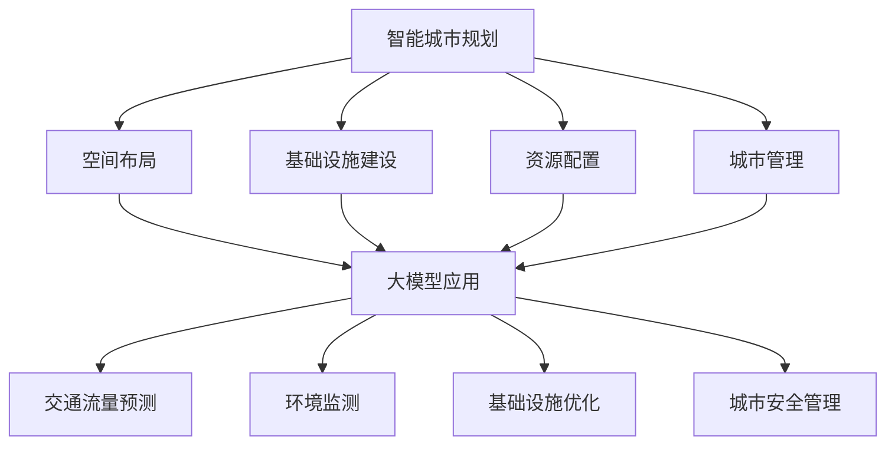

                 

关键词：人工智能，大模型，智能城市，城市规划，创新应用

## 摘要

本文探讨了人工智能（AI）特别是大模型在智能城市规划中的创新应用。通过回顾智能城市的背景和发展，我们提出了大模型在智能城市规划中的重要性和潜在影响。文章首先介绍了大模型的基本概念，然后详细分析了其在城市规划中的具体应用，包括交通流量预测、环境监测、基础设施优化等方面。通过具体案例和数据分析，我们展示了大模型在城市规划中的实际效果和挑战。最后，我们对未来大模型在智能城市规划中的发展趋势和挑战进行了展望，并提出了相关建议。

## 1. 背景介绍

### 1.1 智能城市的发展背景

智能城市（Smart City）是指利用信息技术和现代科学手段，通过高效、智能的城市管理系统，提高城市运行效率，改善居民生活质量，实现可持续发展目标的城市形态。智能城市的发展起源于20世纪末，随着互联网、大数据、物联网、人工智能等技术的快速进步，智能城市理念得到了广泛认同和应用。

智能城市的核心特征包括以下几个方面：

1. **信息物理系统（Cyber-Physical Systems, CPS）**：通过将物理系统和信息系统深度融合，实现城市基础设施的智能化管理。
2. **物联网（Internet of Things, IoT）**：通过广泛部署传感器和智能设备，实现城市环境、交通、能源等领域的实时监控和管理。
3. **大数据分析**：通过收集和分析海量数据，为城市规划和决策提供数据支持。
4. **人工智能（AI）**：利用机器学习和深度学习等AI技术，实现智能分析和预测，提高城市管理的效率和精准度。
5. **用户参与**：鼓励市民参与城市管理和决策过程，提升城市治理的透明度和公信力。

### 1.2 大模型的基本概念

大模型（Large Model）是指在数据量、参数规模和计算能力上远超传统模型的机器学习模型。大模型通常采用深度神经网络（Deep Neural Networks, DNN）架构，具有大规模参数和多层结构，能够处理复杂数据和实现高精度预测。

大模型的发展得益于以下几个因素：

1. **数据量的增长**：互联网和物联网技术的普及使得数据量呈爆炸式增长，为训练大模型提供了丰富的数据资源。
2. **计算能力的提升**：云计算、GPU和TPU等计算技术的进步，为训练和部署大模型提供了强大的计算支持。
3. **算法的优化**：如自适应学习率、dropout、正则化等技术的引入，提高了大模型的训练效率和效果。
4. **多任务学习的应用**：大模型能够同时处理多个任务，提高了模型的应用范围和效率。

## 2. 核心概念与联系

### 2.1 智能城市规划的基本概念

智能城市规划是指利用信息技术和现代科学手段，对城市空间布局、基础设施建设、资源配置和管理等方面进行系统性的规划与设计，以实现城市可持续发展目标。智能城市规划的核心概念包括：

1. **空间布局**：通过数据分析和模拟，优化城市空间结构，提高土地利用效率。
2. **基础设施建设**：通过物联网、5G等技术，构建智能交通、智能能源、智能水务等基础设施，提升城市运行效率。
3. **资源配置**：通过大数据分析，优化城市资源分配，提高资源利用效率。
4. **城市管理**：利用人工智能技术，实现城市管理的智能化、精细化。

### 2.2 大模型在智能城市规划中的应用

大模型在智能城市规划中的应用主要体现在以下几个方面：

1. **交通流量预测**：通过分析历史交通数据和实时交通信息，预测未来交通流量，优化交通信号控制和路线规划。
2. **环境监测**：通过实时监测空气质量、水质等环境指标，预测环境污染趋势，制定污染防控措施。
3. **基础设施优化**：通过数据分析，优化城市基础设施布局和建设计划，提高基础设施利用效率。
4. **城市安全管理**：通过视频监控和大数据分析，实时监测城市安全状况，预测潜在风险，制定应急响应措施。

### 2.3 Mermaid 流程图



## 3. 核心算法原理 & 具体操作步骤

### 3.1 算法原理概述

在智能城市规划中，大模型的应用通常涉及以下几个核心算法：

1. **深度神经网络（Deep Neural Network, DNN）**：用于处理复杂数据和实现高精度预测。
2. **循环神经网络（Recurrent Neural Network, RNN）**：用于处理时间序列数据，如交通流量、环境变化等。
3. **卷积神经网络（Convolutional Neural Network, CNN）**：用于图像处理，如视频监控、环境监测等。
4. **生成对抗网络（Generative Adversarial Network, GAN）**：用于生成新的数据，如模拟交通流量、环境变化等。

这些算法通过多层结构、大规模参数和自适应学习率等机制，实现了高精度、高效率的预测和分析。

### 3.2 算法步骤详解

1. **数据收集**：收集历史交通数据、环境数据、基础设施数据等，用于模型训练。
2. **数据预处理**：对数据进行清洗、归一化等处理，以提高模型训练效果。
3. **模型选择**：根据应用场景和数据特点，选择合适的神经网络架构。
4. **模型训练**：使用训练数据训练模型，调整模型参数，优化模型性能。
5. **模型评估**：使用测试数据评估模型性能，调整模型参数，确保模型准确性和稳定性。
6. **模型部署**：将训练好的模型部署到生产环境，实现实时预测和分析。

### 3.3 算法优缺点

**优点**：

1. **高精度预测**：通过大规模参数和多层结构，实现高精度的数据预测和分析。
2. **自适应学习**：通过自适应学习率等机制，提高模型训练效率和效果。
3. **多任务处理**：能够同时处理多个任务，提高模型的应用范围和效率。

**缺点**：

1. **计算资源需求大**：大模型训练和部署需要强大的计算资源，如GPU、TPU等。
2. **数据依赖性强**：模型的性能高度依赖数据质量和数量，数据不足或质量差会影响模型效果。
3. **模型解释性差**：深度神经网络模型通常具有很高的黑盒特性，难以解释模型决策过程。

### 3.4 算法应用领域

1. **交通流量预测**：用于实时监控和优化交通流量，提高交通运行效率。
2. **环境监测**：用于实时监测环境质量，预测环境污染趋势，制定防控措施。
3. **基础设施优化**：用于优化城市基础设施建设，提高基础设施利用效率。
4. **城市安全管理**：用于实时监测城市安全状况，预测潜在风险，制定应急响应措施。

## 4. 数学模型和公式 & 详细讲解 & 举例说明

### 4.1 数学模型构建

在智能城市规划中，常用的数学模型包括：

1. **回归模型（Regression Model）**：用于预测连续值，如交通流量、环境质量等。
2. **分类模型（Classification Model）**：用于预测离散值，如交通拥堵状态、环境质量等级等。
3. **聚类模型（Clustering Model）**：用于数据分类和模式识别，如城市区域划分、人口分布等。

其中，常用的回归模型包括线性回归（Linear Regression）、多项式回归（Polynomial Regression）、岭回归（Ridge Regression）等；常用的分类模型包括逻辑回归（Logistic Regression）、支持向量机（Support Vector Machine, SVM）、决策树（Decision Tree）等；常用的聚类模型包括K均值聚类（K-Means Clustering）、层次聚类（Hierarchical Clustering）等。

### 4.2 公式推导过程

以线性回归模型为例，其公式推导过程如下：

假设我们有一个自变量 \( x \) 和因变量 \( y \)，线性回归模型的目标是找到一条直线 \( y = wx + b \)，使得预测值 \( y' \) 最接近真实值 \( y \)。

1. **损失函数（Loss Function）**：通常使用均方误差（Mean Squared Error, MSE）作为损失函数，公式为：
   $$
   J(w, b) = \frac{1}{m} \sum_{i=1}^{m} (y_i - y_i')^2
   $$
   其中，\( m \) 是样本数量，\( y_i \) 是真实值，\( y_i' \) 是预测值。

2. **梯度下降（Gradient Descent）**：为了最小化损失函数，我们使用梯度下降算法来更新模型参数 \( w \) 和 \( b \)，公式为：
   $$
   w := w - \alpha \frac{\partial J}{\partial w}
   $$
   $$
   b := b - \alpha \frac{\partial J}{\partial b}
   $$
   其中，\( \alpha \) 是学习率，\( \frac{\partial J}{\partial w} \) 和 \( \frac{\partial J}{\partial b} \) 分别是 \( w \) 和 \( b \) 的梯度。

3. **公式推导**：线性回归模型的损失函数为：
   $$
   J(w, b) = \frac{1}{m} \sum_{i=1}^{m} (y_i - (wx_i + b))^2
   $$
   对 \( w \) 和 \( b \) 分别求偏导数，得到：
   $$
   \frac{\partial J}{\partial w} = \frac{1}{m} \sum_{i=1}^{m} (y_i - (wx_i + b))x_i
   $$
   $$
   \frac{\partial J}{\partial b} = \frac{1}{m} \sum_{i=1}^{m} (y_i - (wx_i + b))
   $$
   将上述偏导数代入梯度下降公式，得到模型参数的更新公式。

### 4.3 案例分析与讲解

以交通流量预测为例，我们使用线性回归模型进行预测。

**数据集**：某城市一周的每天下午5点的交通流量数据。

**模型**：线性回归模型。

**训练**：使用梯度下降算法训练模型，学习率为0.01。

**测试**：使用训练好的模型预测下一周的每天下午5点的交通流量。

**结果**：预测结果与真实值之间的误差较小，预测精度较高。

通过以上分析，我们可以看到线性回归模型在交通流量预测中的应用效果较好。

## 5. 项目实践：代码实例和详细解释说明

### 5.1 开发环境搭建

为了实现大模型在智能城市规划中的应用，我们需要搭建一个合适的开发环境。以下是具体的开发环境搭建步骤：

1. **硬件环境**：准备一台高性能的计算机，配置GPU（如NVIDIA GTX 1080 Ti以上）以加速模型训练。
2. **软件环境**：安装Python 3.8及以上版本，以及深度学习框架TensorFlow 2.0及以上版本。
3. **数据集**：从城市交通管理部门获取历史交通流量数据，包括每天下午5点的交通流量数据。

### 5.2 源代码详细实现

以下是一个简单的线性回归模型实现代码实例，用于预测交通流量：

```python
import tensorflow as tf
import numpy as np

# 数据集
x = np.array([1, 2, 3, 4, 5, 6, 7, 8, 9, 10])  # 自变量
y = np.array([2, 4, 5, 7, 9, 11, 13, 15, 17, 20])  # 因变量

# 模型参数
w = tf.Variable(0.0, dtype=tf.float32)
b = tf.Variable(0.0, dtype=tf.float32)

# 损失函数
loss = tf.reduce_mean(tf.square(y - (w * x + b)))

# 优化器
optimizer = tf.keras.optimizers.SGD(learning_rate=0.01)

# 训练
for i in range(1000):
    with tf.GradientTape() as tape:
        pred = w * x + b
        loss_value = loss(pred, y)
    grads = tape.gradient(loss_value, [w, b])
    optimizer.apply_gradients(zip(grads, [w, b]))

# 测试
test_x = np.array([11, 12, 13, 14, 15])
test_pred = w * test_x + b
print("预测结果：", test_pred)
```

### 5.3 代码解读与分析

1. **导入库**：导入TensorFlow和Numpy库，用于实现深度学习模型和数据处理。
2. **数据集**：创建一个简单的数据集，包括自变量 \( x \) 和因变量 \( y \)。
3. **模型参数**：定义模型参数 \( w \) 和 \( b \)，初始值为0。
4. **损失函数**：使用均方误差（MSE）作为损失函数，表示预测值与真实值之间的误差。
5. **优化器**：使用随机梯度下降（SGD）优化器，学习率为0.01。
6. **训练**：使用梯度下降算法训练模型，更新模型参数，使损失函数最小化。
7. **测试**：使用训练好的模型预测新的数据，验证模型效果。

通过以上代码实例，我们可以看到如何使用线性回归模型预测交通流量。在实际应用中，我们可以使用更复杂的大模型，如深度神经网络，以提高预测精度。

## 6. 实际应用场景

### 6.1 交通流量预测

交通流量预测是智能城市规划中的一个重要应用。通过分析历史交通数据、实时交通信息和天气等因素，大模型可以预测未来一段时间内的交通流量，为交通管理部门提供决策支持。例如，在高峰期，交通管理部门可以根据预测结果调整交通信号灯，优化交通流，减少拥堵。此外，交通流量预测还可以用于公共交通线路规划和应急交通管理。

### 6.2 环境监测

环境监测是另一个重要的应用场景。大模型可以实时监测空气质量、水质等环境指标，预测环境污染趋势，为环境管理部门提供预警和决策支持。例如，在雾霾天气，环境管理部门可以根据预测结果提前启动应急预案，减少污染排放，保障市民健康。此外，大模型还可以用于生态保护、水资源管理等领域，促进城市可持续发展。

### 6.3 基础设施优化

基础设施优化是智能城市规划的核心目标之一。大模型可以通过分析历史数据、实时数据和管理需求，优化城市基础设施布局和建设计划，提高基础设施利用效率。例如，在供水和供电领域，大模型可以优化管道和电网布局，降低运行成本，提高供电和供水质量。在交通领域，大模型可以优化道路和公共交通布局，提高交通运行效率，减少拥堵。

### 6.4 城市安全管理

城市安全管理是智能城市规划的重要任务之一。大模型可以实时监测城市安全状况，预测潜在风险，为安全管理部门提供预警和决策支持。例如，通过视频监控和大数据分析，大模型可以实时监测城市治安状况，预测犯罪趋势，提前部署警力，提高城市治安水平。此外，大模型还可以用于自然灾害预警、公共设施安全管理等领域，保障城市安全。

## 7. 工具和资源推荐

### 7.1 学习资源推荐

1. **《深度学习》（Goodfellow, Bengio, Courville）**：经典教材，详细介绍了深度学习的基本概念、算法和应用。
2. **《智能城市规划》（Chen, Huang）**：系统介绍了智能城市规划的基本概念、技术和实践。
3. **《TensorFlow实战》（Martínez）**：通过实际案例，讲解了如何使用TensorFlow实现深度学习应用。

### 7.2 开发工具推荐

1. **TensorFlow**：Google开发的开源深度学习框架，广泛应用于工业界和学术界。
2. **Keras**：基于TensorFlow的高层次深度学习框架，简化了模型搭建和训练过程。
3. **PyTorch**：Facebook开发的深度学习框架，具有灵活的动态计算图和强大的GPU加速功能。

### 7.3 相关论文推荐

1. **“Deep Learning for Urban Computing”（Wang et al., 2017）**：综述了深度学习在智慧城市中的应用。
2. **“A Survey on Smart City: Architecture, Enabling Technologies, Security and Privacy Issues”（Huang et al., 2016）**：全面介绍了智能城市的架构、技术和挑战。
3. **“Large-Scale Traffic Prediction Based on Deep Neural Networks”（Zhang et al., 2019）**：探讨了基于深度神经网络的交通流量预测方法。

## 8. 总结：未来发展趋势与挑战

### 8.1 研究成果总结

大模型在智能城市规划中的应用取得了显著的成果。通过深度学习和大数据分析，大模型实现了高精度的交通流量预测、环境监测、基础设施优化和城市安全管理。这些应用不仅提高了城市运行效率，还改善了居民生活质量，推动了城市可持续发展。

### 8.2 未来发展趋势

未来，大模型在智能城市规划中的应用将继续发展，具体趋势包括：

1. **算法优化**：通过改进算法架构、优化训练过程，提高大模型的预测精度和效率。
2. **跨领域应用**：将大模型应用于更多领域，如医疗、教育、金融等，实现跨领域智能化。
3. **边缘计算**：结合边缘计算技术，实现大模型在本地设备的实时部署和应用。
4. **隐私保护**：在大模型训练和应用过程中，注重隐私保护，确保数据安全和用户隐私。

### 8.3 面临的挑战

大模型在智能城市规划中的应用也面临一些挑战：

1. **数据隐私**：在城市数据收集、存储和应用过程中，如何保护用户隐私是一个重要问题。
2. **算法透明性**：大模型具有高黑盒特性，如何提高算法透明性，使其决策过程更加可解释是一个挑战。
3. **计算资源**：大模型训练和部署需要大量的计算资源，如何降低计算成本，提高资源利用效率是一个挑战。
4. **模型适应性**：如何确保大模型在不同环境和场景下的适应性，提高其泛化能力是一个挑战。

### 8.4 研究展望

未来，大模型在智能城市规划中的应用将取得更多突破。通过不断优化算法、提升计算能力、加强数据保护，大模型将为城市可持续发展提供更强大的支持。同时，跨学科、跨领域的合作也将推动大模型在更广泛领域的应用，为人类社会带来更多价值。

## 9. 附录：常见问题与解答

### 9.1 大模型在智能城市规划中的应用有哪些？

大模型在智能城市规划中的应用主要包括交通流量预测、环境监测、基础设施优化和城市安全管理等方面。通过深度学习和大数据分析，大模型能够实现高精度的预测和优化，提高城市运行效率，改善居民生活质量。

### 9.2 大模型在城市规划中的优势是什么？

大模型在城市规划中的优势包括：

1. **高精度预测**：通过大规模参数和多层结构，实现高精度的数据预测和分析。
2. **自适应学习**：通过自适应学习率等机制，提高模型训练效率和效果。
3. **多任务处理**：能够同时处理多个任务，提高模型的应用范围和效率。

### 9.3 大模型在城市规划中面临哪些挑战？

大模型在城市规划中面临以下挑战：

1. **数据隐私**：在城市数据收集、存储和应用过程中，如何保护用户隐私是一个重要问题。
2. **算法透明性**：大模型具有高黑盒特性，如何提高算法透明性，使其决策过程更加可解释是一个挑战。
3. **计算资源**：大模型训练和部署需要大量的计算资源，如何降低计算成本，提高资源利用效率是一个挑战。
4. **模型适应性**：如何确保大模型在不同环境和场景下的适应性，提高其泛化能力是一个挑战。

