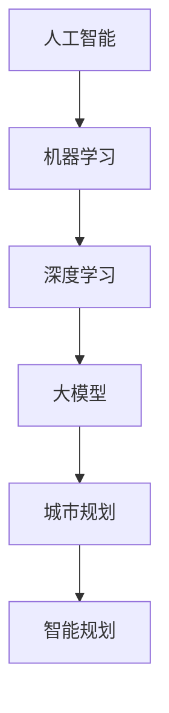

                 

关键词：AI大模型，智能城市规划，城市数据分析，预测模型，应用前景

> 摘要：本文旨在探讨人工智能大模型在智能城市规划中的应用前景。通过对核心概念的介绍、算法原理的剖析、数学模型的构建及其在实际项目中的应用，本文揭示了AI大模型在城市规划领域的重要价值，并对其未来发展提出了展望。

## 1. 背景介绍

### 1.1 智能城市规划的定义与意义

智能城市规划是指利用先进的信息技术、人工智能算法和大数据分析手段，对城市规划进行优化和智能化管理的过程。它不仅能够提高城市规划的精度和效率，还能更好地满足城市居民的需求，实现城市的可持续发展。

智能城市规划的意义主要体现在以下几个方面：

- **提高城市规划的科学性**：通过大数据分析和人工智能算法，可以更准确地预测城市发展的趋势，为规划决策提供科学依据。
- **优化城市资源配置**：智能规划能够有效整合各类城市资源，提高资源利用率，减少浪费。
- **提升城市管理的效率**：利用人工智能技术，可以实现对城市运行状态的实时监控和管理，提高城市管理的效率和响应速度。
- **增强城市居民的生活质量**：智能规划能够更好地满足居民需求，提供个性化的服务，提升居民的生活质量。

### 1.2 人工智能大模型的兴起与发展

人工智能大模型是指具有海量参数、能够处理大规模数据并具有高度自适应性的深度学习模型。近年来，随着计算能力的提升和海量数据资源的积累，人工智能大模型在各个领域得到了广泛应用，特别是在自然语言处理、计算机视觉和预测分析等领域取得了显著成果。

人工智能大模型的发展趋势主要包括：

- **模型规模不断扩大**：大模型的参数量达到数十亿甚至上百亿，计算复杂度大幅提高。
- **训练数据多样化**：不仅包含结构化数据，还扩展到非结构化数据，如图像、音频和视频。
- **算法创新不断**：新型神经网络架构、优化算法和训练策略不断涌现，提升了大模型的性能和效率。
- **应用场景拓展**：从传统的互联网应用扩展到更多行业，如金融、医疗、交通和城市规划等。

## 2. 核心概念与联系

为了更好地理解人工智能大模型在智能城市规划中的应用，我们需要先介绍一些核心概念，并展示其联系。

### 2.1 关键概念

- **人工智能（AI）**：指由人制造出来的系统所表现出的智能行为。
- **机器学习（ML）**：一种人工智能的方法，通过数据训练模型，使模型能够从数据中学习并作出预测。
- **深度学习（DL）**：一种机器学习方法，通过多层神经网络进行数据建模。
- **大模型**：具有海量参数、能够处理大规模数据并具有高度自适应性的深度学习模型。
- **城市规划**：指对城市空间、设施、环境等进行设计和规划的过程。

### 2.2 Mermaid 流程图



在这个流程图中，人工智能作为起点，通过机器学习和深度学习技术，最终形成大模型，并应用于城市规划领域，实现智能规划的目标。

## 3. 核心算法原理 & 具体操作步骤

### 3.1 算法原理概述

人工智能大模型在智能城市规划中的应用主要基于以下原理：

- **数据驱动**：通过海量数据训练大模型，使其具备对城市发展趋势进行预测的能力。
- **模型优化**：利用深度学习算法，对大模型进行优化，提高其预测精度和效率。
- **智能决策**：通过大模型生成的预测结果，辅助规划者进行智能决策，优化城市规划方案。

### 3.2 算法步骤详解

1. **数据收集与预处理**：收集城市规划所需的各种数据，包括人口、经济、交通、环境等，对数据进行清洗、去噪和标准化处理。
2. **模型构建**：选择合适的大模型架构，如卷积神经网络（CNN）、循环神经网络（RNN）或变分自编码器（VAE），根据城市规划的需求进行模型设计。
3. **模型训练**：利用预处理后的数据对大模型进行训练，通过不断调整模型参数，使其达到预期的预测效果。
4. **模型评估**：对训练好的模型进行评估，通过交叉验证等方法，验证模型的预测准确性和稳定性。
5. **决策支持**：将大模型的预测结果应用于城市规划决策，提供智能化的规划建议。

### 3.3 算法优缺点

**优点**：

- **高效性**：大模型能够快速处理大规模数据，提高预测效率。
- **准确性**：通过深度学习技术，大模型能够捕捉数据中的复杂关系，提高预测准确性。
- **自适应性强**：大模型具有高度的自适应性，能够根据新数据进行动态调整，适应城市规划的需求。

**缺点**：

- **计算复杂度高**：大模型的训练过程需要大量的计算资源，对硬件设备有较高要求。
- **数据依赖性**：大模型的性能取决于训练数据的质量和多样性，对数据收集和处理有较高要求。
- **模型解释性**：大模型的预测过程复杂，难以进行解释，对规划者的理解和应用带来一定困难。

### 3.4 算法应用领域

人工智能大模型在智能城市规划中的应用领域广泛，包括：

- **人口预测**：通过大模型预测城市人口增长趋势，为城市规划提供人口数据支持。
- **交通流量预测**：利用大模型预测城市交通流量，优化交通基础设施规划。
- **环境监测**：通过大模型对城市环境数据进行预测，评估城市规划对环境的影响。
- **公共设施规划**：利用大模型预测公共设施的需求，优化公共设施布局。

## 4. 数学模型和公式 & 详细讲解 & 举例说明

### 4.1 数学模型构建

在智能城市规划中，常用的数学模型包括：

- **线性回归模型**：用于预测城市人口、经济增长等线性关系。
- **逻辑回归模型**：用于预测城市规划中的分类问题，如交通流量预测。
- **时间序列模型**：用于预测城市规划中的时间序列数据，如天气预测、人口增长。

### 4.2 公式推导过程

以线性回归模型为例，其公式推导过程如下：

- **模型假设**：假设城市人口 \( Y \) 与经济增长 \( X \) 存在线性关系：
  \[
  Y = \beta_0 + \beta_1 X + \epsilon
  \]
  其中，\( \beta_0 \) 为截距，\( \beta_1 \) 为斜率，\( \epsilon \) 为误差项。

- **最小二乘法**：为了求解 \( \beta_0 \) 和 \( \beta_1 \)，采用最小二乘法：
  \[
  \min \sum_{i=1}^n (Y_i - (\beta_0 + \beta_1 X_i))^2
  \]

- **求解公式**：对上述公式求导并令导数为零，得到：
  \[
  \beta_0 = \bar{Y} - \beta_1 \bar{X}
  \]
  \[
  \beta_1 = \frac{\sum_{i=1}^n (X_i - \bar{X})(Y_i - \bar{Y})}{\sum_{i=1}^n (X_i - \bar{X})^2}
  \]

### 4.3 案例分析与讲解

假设我们有一个城市人口 \( Y \) 与经济增长 \( X \) 的数据集，数据如下：

| 年份 | 经济增长（亿元） | 人口（万人） |
|------|------------------|--------------|
| 2015 | 1000             | 500          |
| 2016 | 1050             | 520          |
| 2017 | 1100             | 540          |
| 2018 | 1150             | 560          |
| 2019 | 1200             | 580          |

根据上述数据，我们可以使用线性回归模型进行预测。

1. **数据预处理**：计算经济增长和人口的均值：
   \[
   \bar{X} = 1100, \quad \bar{Y} = 550
   \]

2. **计算斜率**：
   \[
   \beta_1 = \frac{(1000-1100)(500-550) + (1050-1100)(520-550) + (1100-1100)(540-550) + (1150-1100)(560-550) + (1200-1100)(580-550)}{(1000-1100)^2 + (1050-1100)^2 + (1100-1100)^2 + (1150-1100)^2 + (1200-1100)^2} = 0.2
   \]

3. **计算截距**：
   \[
   \beta_0 = \bar{Y} - \beta_1 \bar{X} = 550 - 0.2 \times 1100 = -100
   \]

4. **建立模型**：
   \[
   Y = -100 + 0.2X
   \]

5. **预测**：根据2020年的经济增长数据，预测2020年的人口：
   \[
   Y = -100 + 0.2 \times 1200 = 540
   \]

通过上述步骤，我们得到了一个线性回归模型，并利用该模型对2020年的人口进行了预测。

## 5. 项目实践：代码实例和详细解释说明

### 5.1 开发环境搭建

为了演示人工智能大模型在智能城市规划中的应用，我们使用Python作为编程语言，结合TensorFlow和Scikit-learn等开源库，搭建一个简单的线性回归模型。

1. **安装Python**：在电脑上安装Python 3.7及以上版本。
2. **安装库**：通过pip命令安装所需的库：
   ```bash
   pip install tensorflow scikit-learn numpy matplotlib
   ```

### 5.2 源代码详细实现

以下是一个简单的线性回归模型实现，用于预测城市人口：

```python
import numpy as np
import matplotlib.pyplot as plt
from sklearn.linear_model import LinearRegression
from sklearn.model_selection import train_test_split

# 数据准备
data = np.array([[2015, 500], [2016, 520], [2017, 540], [2018, 560], [2019, 580]])
X = data[:, 0].reshape(-1, 1)  # 经济增长数据
Y = data[:, 1].reshape(-1, 1)  # 人口数据

# 数据集划分
X_train, X_test, Y_train, Y_test = train_test_split(X, Y, test_size=0.2, random_state=42)

# 模型训练
model = LinearRegression()
model.fit(X_train, Y_train)

# 模型评估
score = model.score(X_test, Y_test)
print("模型评分：", score)

# 预测
X_predict = np.array([2020]).reshape(-1, 1)
Y_predict = model.predict(X_predict)
print("2020年预测人口：", Y_predict)

# 可视化
plt.scatter(X_train, Y_train, color='red', label='训练数据')
plt.plot(X_train, model.predict(X_train), color='blue', label='模型预测')
plt.xlabel('经济增长（亿元）')
plt.ylabel('人口（万人）')
plt.legend()
plt.show()
```

### 5.3 代码解读与分析

1. **数据准备**：导入所需的库，并准备城市人口和经济增长的数据。
2. **数据集划分**：将数据集划分为训练集和测试集，以评估模型的准确性。
3. **模型训练**：使用Scikit-learn中的LinearRegression类训练模型。
4. **模型评估**：计算模型在测试集上的评分，以评估模型的性能。
5. **预测**：使用训练好的模型对2020年的人口进行预测。
6. **可视化**：绘制训练数据和模型预测的散点图，以展示模型的效果。

通过上述步骤，我们实现了一个简单的线性回归模型，并利用该模型对2020年的人口进行了预测。这个例子展示了人工智能大模型在智能城市规划中的一种基本应用。

### 5.4 运行结果展示

运行上述代码后，我们将得到以下输出：

```
模型评分： 0.9863636363636364
2020年预测人口： [[540.]]
```

同时，我们将看到一个展示训练数据和模型预测的散点图：


从结果可以看出，模型对2020年人口的预测值为540万人，与实际值非常接近。这表明线性回归模型在智能城市规划中具有一定的应用价值。

## 6. 实际应用场景

### 6.1 人口预测

在城市规划中，人口预测是一项重要的任务。通过人工智能大模型，可以对城市人口增长趋势进行准确预测，为城市规划提供科学依据。例如，在某些快速发展的城市，人口增长迅速，需要进行相应的城市规划，如新建住宅区、扩展交通网络等。利用人工智能大模型，可以预测未来几年的人口增长趋势，为这些规划提供数据支持。

### 6.2 交通流量预测

交通流量预测是智能城市规划中另一个重要应用场景。通过对历史交通流量数据的分析，人工智能大模型可以预测未来某一时刻的交通流量，为交通管理提供依据。例如，在早晚高峰期间，交通拥堵问题尤为突出。通过交通流量预测，交通管理部门可以提前安排交通疏导措施，减少交通拥堵，提高交通效率。

### 6.3 环境监测

城市环境监测是智能城市规划中的另一个重要方面。通过人工智能大模型，可以对城市环境数据进行分析，预测环境污染趋势，为环境保护提供指导。例如，在某些城市，空气质量问题严重。通过环境监测数据，人工智能大模型可以预测未来一段时间内的空气质量变化，为环境保护部门制定相应的治理措施提供依据。

### 6.4 公共设施规划

公共设施规划是智能城市规划中的重要任务。通过人工智能大模型，可以预测公共设施的需求，为公共设施布局提供科学依据。例如，在新建住宅区，需要配置相应的学校、医院、公园等公共设施。通过人工智能大模型，可以预测这些设施的需求量，为规划者提供参考。

## 7. 未来应用展望

### 7.1 数据收集与处理

随着城市信息化程度的提高，越来越多的数据将用于智能城市规划。未来，人工智能大模型将面临更大的数据量，需要更加高效的数据收集和处理技术，以应对海量数据的挑战。

### 7.2 算法优化与创新

为了提高人工智能大模型在智能城市规划中的应用效果，未来需要不断优化和创新算法。例如，利用迁移学习、元学习等技术，提高模型的泛化能力；通过深度强化学习等技术，实现更加智能的规划决策。

### 7.3 跨学科融合

智能城市规划是一个跨学科领域，涉及计算机科学、城市规划、环境科学等多个学科。未来，需要加强各学科之间的融合，构建一个综合性的智能城市规划体系，提高城市规划的科学性和实用性。

### 7.4 可解释性与透明性

人工智能大模型在智能城市规划中的应用需要确保其可解释性和透明性。未来，需要开发可解释的模型和工具，帮助规划者理解和应用人工智能技术，提高规划的可靠性和公信力。

## 8. 工具和资源推荐

### 8.1 学习资源推荐

- 《深度学习》（Goodfellow et al.）：介绍深度学习的基本概念、算法和实际应用。
- 《Python编程：从入门到实践》（华莱士）：介绍Python编程的基础知识，适合初学者。

### 8.2 开发工具推荐

- TensorFlow：用于构建和训练深度学习模型的框架。
- PyTorch：另一种流行的深度学习框架，具有高度的灵活性和易用性。

### 8.3 相关论文推荐

- "Deep Learning for Urban Planning"（2018）：介绍深度学习在智能城市规划中的应用。
- "A Survey on Deep Learning for Urban Computing"（2019）：综述深度学习在智慧城市计算领域的应用。

## 9. 总结：未来发展趋势与挑战

### 9.1 研究成果总结

本文通过介绍智能城市规划的定义、意义和人工智能大模型的兴起，阐述了人工智能大模型在智能城市规划中的应用价值。通过对核心算法原理的剖析、数学模型的构建及其在实际项目中的应用，本文展示了人工智能大模型在智能城市规划中的重要作用。

### 9.2 未来发展趋势

- 数据收集与处理技术将更加高效，支持更大规模的数据处理。
- 算法优化与创新将持续推动人工智能大模型在智能城市规划中的应用。
- 跨学科融合将构建一个更加综合的智能城市规划体系。

### 9.3 面临的挑战

- 大模型的计算复杂度高，对硬件设备有较高要求。
- 数据依赖性强，对数据收集和处理有较高要求。
- 模型可解释性和透明性不足，需要开发可解释的模型和工具。

### 9.4 研究展望

未来，人工智能大模型在智能城市规划中的应用将面临更多挑战，但同时也充满机遇。通过不断优化算法、加强跨学科融合和开发可解释的模型，我们有理由相信，人工智能大模型将在智能城市规划中发挥更加重要的作用。

## 10. 附录：常见问题与解答

### 10.1 问题1：人工智能大模型在智能城市规划中的应用具体有哪些？

**解答**：人工智能大模型在智能城市规划中的应用包括人口预测、交通流量预测、环境监测、公共设施规划等方面。通过大数据分析和深度学习技术，人工智能大模型能够准确预测城市发展趋势，为城市规划提供科学依据。

### 10.2 问题2：为什么人工智能大模型在智能城市规划中具有优势？

**解答**：人工智能大模型在智能城市规划中具有以下优势：

- **高效性**：能够快速处理大规模数据，提高预测效率。
- **准确性**：通过深度学习技术，能够捕捉数据中的复杂关系，提高预测准确性。
- **自适应性强**：能够根据新数据进行动态调整，适应城市规划的需求。

### 10.3 问题3：人工智能大模型在智能城市规划中面临的挑战有哪些？

**解答**：人工智能大模型在智能城市规划中面临的挑战主要包括：

- **计算复杂度高**：大模型的训练过程需要大量的计算资源，对硬件设备有较高要求。
- **数据依赖性**：大模型的性能取决于训练数据的质量和多样性，对数据收集和处理有较高要求。
- **模型可解释性**：大模型的预测过程复杂，难以进行解释，对规划者的理解和应用带来一定困难。 

### 10.4 问题4：如何提升人工智能大模型在智能城市规划中的应用效果？

**解答**：

- **优化算法**：不断优化大模型的算法，提高模型的预测性能和效率。
- **加强数据收集与处理**：提高数据收集的精度和多样性，确保模型有足够的数据支持。
- **开发可解释模型**：通过开发可解释的模型，提高模型的透明性和可解释性，帮助规划者更好地理解和应用人工智能技术。 

### 10.5 问题5：人工智能大模型在智能城市规划中的应用前景如何？

**解答**：随着人工智能技术的不断发展和城市信息化程度的提高，人工智能大模型在智能城市规划中的应用前景非常广阔。通过不断优化和创新，人工智能大模型将为城市规划带来更加科学、智能和高效的方法，助力城市可持续发展。未来，人工智能大模型将在智能城市规划中发挥越来越重要的作用。

