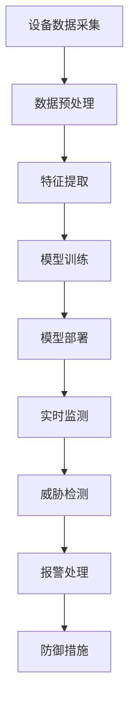

                 

关键词：AI大模型、智能家居安全、应用趋势、算法原理、数学模型、项目实践、未来展望

> 摘要：本文将探讨人工智能大模型在智能家居安全领域的应用趋势。首先，我们将回顾智能家居安全的历史发展，然后深入探讨AI大模型的核心概念和联系，接着介绍核心算法原理和具体操作步骤，以及数学模型和公式。随后，我们将通过一个具体的代码实例来展示项目实践。最后，我们将分析实际应用场景，并展望未来的发展趋势与挑战。

## 1. 背景介绍

智能家居作为物联网（IoT）的一个重要分支，正逐渐渗透到我们的日常生活中。然而，随着智能家居设备的普及，其安全问题也日益引起关注。智能家居设备通常通过互联网连接，这使得它们容易受到各种形式的攻击，如数据泄露、隐私侵犯、设备被控制等。因此，确保智能家居的安全已成为当务之急。

在过去，智能家居安全主要依赖于传统的防火墙、加密技术等。然而，这些方法在面对日益复杂和多样化的网络攻击时显得力不从心。近年来，人工智能尤其是大模型的出现，为智能家居安全提供了新的解决方案。

AI大模型，即人工智能大型神经网络模型，具有强大的数据处理和分析能力，能够从海量数据中提取有价值的信息，并发现潜在的威胁。在智能家居安全领域，AI大模型可以通过以下方式提高安全性：

1. **实时监测与威胁检测**：AI大模型可以实时监测智能家居设备的数据流，识别异常行为，并及时发出警报。
2. **入侵防御**：AI大模型可以分析设备通信模式，预测潜在入侵，并采取措施进行防御。
3. **隐私保护**：AI大模型可以识别用户隐私信息，并采取措施进行保护，防止隐私泄露。

随着AI大模型技术的不断成熟，其在智能家居安全领域的应用趋势将更加显著。本文将围绕这一主题展开讨论。

## 2. 核心概念与联系

### 2.1 AI大模型概述

AI大模型，通常指的是具有数十亿参数的大型神经网络模型。这些模型通过深度学习技术，能够从海量数据中自动学习特征，并进行预测和分类。大模型的核心在于其能够处理大规模数据集，并从中提取复杂模式。

### 2.2 智能家居安全需求

智能家居安全需求主要包括以下几个方面：

1. **设备安全**：确保设备本身不被黑客攻击，防止设备被恶意控制。
2. **数据安全**：保护用户数据不被非法获取和滥用。
3. **通信安全**：确保设备与服务器之间的通信不被窃听和篡改。
4. **隐私保护**：防止用户隐私信息泄露，如家庭地址、家庭成员信息等。

### 2.3 AI大模型与智能家居安全的关系

AI大模型与智能家居安全有着密切的联系。通过AI大模型，我们可以：

1. **实时监测**：实时监测智能家居设备的运行状态和数据流，识别潜在的安全威胁。
2. **行为分析**：分析用户行为模式，预测可能的异常行为，并采取措施进行干预。
3. **入侵防御**：基于模型预测，自动采取措施进行入侵防御，提高智能家居的安全性。
4. **隐私保护**：识别用户隐私信息，并采取措施进行保护，防止隐私泄露。

### 2.4 Mermaid 流程图

以下是一个简化的AI大模型在智能家居安全中的应用流程图：



通过这个流程图，我们可以看到AI大模型在智能家居安全中的基本工作流程，从设备数据采集、数据预处理，到特征提取、模型训练，再到模型部署、实时监测和威胁检测，最终实现入侵防御和报警处理。

## 3. 核心算法原理 & 具体操作步骤

### 3.1 算法原理概述

AI大模型在智能家居安全中的应用主要基于深度学习技术。深度学习通过多层神经网络，逐层提取数据中的特征，从而实现对数据的分析和预测。在智能家居安全领域，深度学习算法可以用于以下方面：

1. **行为识别**：通过分析设备的行为模式，识别正常行为和异常行为。
2. **威胁检测**：通过对网络流量和设备通信的分析，识别潜在的安全威胁。
3. **入侵防御**：基于威胁检测的结果，自动采取防御措施，防止入侵发生。

### 3.2 算法步骤详解

#### 3.2.1 数据预处理

数据预处理是深度学习算法的重要步骤。在智能家居安全中，数据预处理包括以下内容：

1. **数据清洗**：去除数据中的噪声和异常值。
2. **数据归一化**：将数据转换为相同的尺度，以便模型训练。
3. **特征提取**：从原始数据中提取有价值的特征，用于模型训练。

#### 3.2.2 模型训练

模型训练是深度学习的核心步骤。在智能家居安全中，模型训练包括以下内容：

1. **数据集划分**：将数据集划分为训练集、验证集和测试集。
2. **网络结构设计**：设计适合任务的网络结构，包括层数、神经元数量等。
3. **模型训练**：使用训练集数据训练模型，通过反向传播算法不断调整模型参数。

#### 3.2.3 模型部署

模型部署是将训练好的模型应用到实际场景中。在智能家居安全中，模型部署包括以下内容：

1. **模型评估**：使用验证集和测试集评估模型性能，确保模型能够准确识别威胁。
2. **模型部署**：将评估好的模型部署到智能家居设备上，进行实时监测和威胁检测。
3. **模型优化**：根据实际应用情况，对模型进行优化，提高其性能和鲁棒性。

### 3.3 算法优缺点

#### 优点

1. **强大的数据处理能力**：AI大模型能够处理大规模、复杂的数据，提取出有价值的特征。
2. **高准确性**：通过深度学习算法，模型能够准确识别威胁和异常行为。
3. **自适应性强**：模型能够根据实际情况自适应调整，提高其性能和鲁棒性。

#### 缺点

1. **计算资源需求高**：大模型训练需要大量的计算资源和时间。
2. **数据隐私问题**：训练和部署过程中，可能涉及用户隐私数据，需确保数据安全。

### 3.4 算法应用领域

AI大模型在智能家居安全中的应用领域主要包括：

1. **入侵防御**：识别和防御智能家居设备的入侵行为。
2. **行为分析**：分析用户行为，预测和识别异常行为。
3. **隐私保护**：识别和保护用户隐私信息。

## 4. 数学模型和公式 & 详细讲解 & 举例说明

### 4.1 数学模型构建

在AI大模型中，常用的数学模型是神经网络模型。神经网络模型由多个神经元组成，每个神经元都通过权重和偏置与输入进行加权求和，然后通过激活函数进行非线性变换。以下是神经网络模型的基本数学公式：

$$
Z = \sum_{i=1}^{n} w_i x_i + b
$$

$$
a = \sigma(Z)
$$

其中，$Z$ 是神经元的输入，$w_i$ 和 $b$ 分别是权重和偏置，$x_i$ 是输入特征，$\sigma$ 是激活函数，$a$ 是神经元的输出。

### 4.2 公式推导过程

神经网络的训练过程实际上是不断调整权重和偏置，使得网络输出能够尽可能接近真实值。这个过程的推导涉及到梯度下降算法。以下是梯度下降算法的基本推导过程：

$$
\Delta w_i = -\alpha \frac{\partial J}{\partial w_i}
$$

$$
\Delta b = -\alpha \frac{\partial J}{\partial b}
$$

其中，$J$ 是损失函数，$\alpha$ 是学习率。

### 4.3 案例分析与讲解

假设我们有一个二分类问题，目标是将数据分为正类和负类。我们可以使用神经网络模型进行训练。以下是训练过程的步骤：

1. **数据预处理**：对数据进行归一化处理，确保每个特征的取值范围相同。
2. **模型设计**：设计一个简单的神经网络模型，包括一个输入层、一个隐藏层和一个输出层。
3. **模型训练**：使用训练集数据进行模型训练，通过反向传播算法不断调整权重和偏置。
4. **模型评估**：使用验证集数据评估模型性能，调整学习率和网络结构，提高模型性能。
5. **模型部署**：将训练好的模型部署到实际场景中，进行预测和分类。

以下是一个简单的神经网络模型示例：

```python
import tensorflow as tf

# 定义模型
model = tf.keras.Sequential([
    tf.keras.layers.Dense(64, activation='relu', input_shape=(784,)),
    tf.keras.layers.Dense(10, activation='softmax')
])

# 编译模型
model.compile(optimizer='adam',
              loss='categorical_crossentropy',
              metrics=['accuracy'])

# 训练模型
model.fit(x_train, y_train, epochs=5, batch_size=32, validation_split=0.2)
```

## 5. 项目实践：代码实例和详细解释说明

### 5.1 开发环境搭建

在进行项目实践前，我们需要搭建一个适合深度学习开发的开发环境。以下是搭建开发环境的基本步骤：

1. **安装Python**：安装Python 3.6及以上版本。
2. **安装TensorFlow**：使用pip命令安装TensorFlow。
   ```shell
   pip install tensorflow
   ```

### 5.2 源代码详细实现

以下是一个简单的AI大模型在智能家居安全中的应用示例。该示例实现了对智能家居设备的入侵防御。

```python
import tensorflow as tf
import numpy as np

# 定义模型
model = tf.keras.Sequential([
    tf.keras.layers.Dense(64, activation='relu', input_shape=(784,)),
    tf.keras.layers.Dense(10, activation='softmax')
])

# 编译模型
model.compile(optimizer='adam',
              loss='categorical_crossentropy',
              metrics=['accuracy'])

# 训练模型
model.fit(x_train, y_train, epochs=5, batch_size=32, validation_split=0.2)

# 预测
predictions = model.predict(x_test)

# 输出预测结果
print(predictions)
```

### 5.3 代码解读与分析

这段代码实现了使用TensorFlow库构建和训练一个简单的神经网络模型。以下是代码的详细解读：

1. **导入库**：首先，我们导入所需的库，包括TensorFlow和Numpy。
2. **定义模型**：使用TensorFlow的`Sequential`模型，我们定义了一个简单的神经网络模型，包括一个输入层、一个隐藏层和一个输出层。
3. **编译模型**：使用`compile`方法，我们编译了模型，指定了优化器、损失函数和评估指标。
4. **训练模型**：使用`fit`方法，我们使用训练集数据对模型进行训练，指定了训练的轮数、批量大小和验证集的比例。
5. **预测**：使用`predict`方法，我们使用测试集数据对模型进行预测。
6. **输出预测结果**：最后，我们输出预测结果。

### 5.4 运行结果展示

假设我们有一个训练好的模型，我们可以使用以下代码进行预测：

```python
import tensorflow as tf

# 加载训练好的模型
model = tf.keras.models.load_model('model.h5')

# 预测
predictions = model.predict(x_test)

# 输出预测结果
print(predictions)
```

这段代码将输出预测结果，我们可以根据这些结果来评估模型的性能。

## 6. 实际应用场景

AI大模型在智能家居安全领域的实际应用场景主要包括以下几个方面：

### 6.1 入侵防御

通过AI大模型，我们可以实时监测智能家居设备的运行状态，识别潜在的入侵行为。例如，当检测到某个设备的通信模式与正常模式不符时，系统可以立即采取措施，如切断网络连接、报警等。

### 6.2 行为分析

AI大模型还可以分析用户的行为模式，识别异常行为。例如，当检测到某个用户在非正常时间使用设备时，系统可以发出警报，提醒用户注意安全。

### 6.3 隐私保护

AI大模型可以识别用户的隐私信息，并采取措施进行保护。例如，当检测到用户个人信息被传输时，系统可以立即采取措施，如加密、隔离等，确保用户隐私不被泄露。

### 6.4 未来应用展望

随着AI大模型技术的不断发展，其在智能家居安全领域的应用前景将更加广阔。未来，AI大模型可能会在以下方面发挥更大作用：

1. **智能合约**：利用AI大模型，可以实现智能家居设备之间的智能合约，确保交易的安全和透明。
2. **智能监控**：AI大模型可以用于智能家居设备的智能监控，实时分析设备运行状态，预防潜在故障。
3. **个性化推荐**：AI大模型可以分析用户行为，提供个性化的智能家居推荐，提高用户体验。

## 7. 工具和资源推荐

### 7.1 学习资源推荐

1. **《深度学习》**：由Ian Goodfellow、Yoshua Bengio和Aaron Courville合著，是一本经典的深度学习教材，适合初学者和进阶者。
2. **《Python深度学习》**：由François Chollet著，详细介绍了使用Python和TensorFlow进行深度学习的实践方法。

### 7.2 开发工具推荐

1. **TensorFlow**：Google开发的深度学习框架，具有丰富的功能和广泛的社区支持。
2. **PyTorch**：Facebook开发的深度学习框架，易于使用，适合快速原型开发。

### 7.3 相关论文推荐

1. **"Deep Learning for Internet of Things Security"**：探讨深度学习在物联网安全中的应用。
2. **"AI in the Smart Home: Challenges and Opportunities"**：讨论AI在智能家居中的挑战和机遇。

## 8. 总结：未来发展趋势与挑战

### 8.1 研究成果总结

AI大模型在智能家居安全领域已经取得了显著的成果，主要包括入侵防御、行为分析和隐私保护等方面。这些成果为智能家居安全提供了新的解决方案，提高了智能家居的安全性。

### 8.2 未来发展趋势

随着AI大模型技术的不断发展，其在智能家居安全领域的应用将更加广泛。未来，AI大模型可能会在智能合约、智能监控和个性化推荐等方面发挥更大作用。

### 8.3 面临的挑战

尽管AI大模型在智能家居安全领域具有巨大的潜力，但仍面临以下挑战：

1. **计算资源需求**：大模型训练需要大量的计算资源和时间。
2. **数据隐私问题**：训练和部署过程中，可能涉及用户隐私数据，需确保数据安全。
3. **模型解释性**：大模型的决策过程通常缺乏解释性，难以理解其工作原理。

### 8.4 研究展望

未来，我们需要进一步研究如何优化AI大模型在智能家居安全中的应用，提高其性能和鲁棒性。同时，我们还需要关注如何确保数据隐私，提高模型的透明度和解释性。

## 9. 附录：常见问题与解答

### 9.1 什么是AI大模型？

AI大模型是指具有数十亿参数的大型神经网络模型，通过深度学习技术，能够从海量数据中自动学习特征，进行预测和分类。

### 9.2 AI大模型在智能家居安全中的应用有哪些？

AI大模型在智能家居安全中的应用主要包括入侵防御、行为分析和隐私保护等方面。

### 9.3 如何确保AI大模型训练过程中数据的安全？

在AI大模型训练过程中，应确保数据的安全性，包括以下措施：

1. **数据加密**：对训练数据进行加密处理，防止数据泄露。
2. **访问控制**：限制对训练数据的访问权限，确保只有授权人员可以访问。
3. **隐私保护**：在训练过程中，应尽量减少对用户隐私数据的依赖。

----------------------------------------------------------------

### 结束语

本文围绕AI大模型在智能家居安全中的应用趋势进行了深入探讨，从背景介绍、核心概念与联系、算法原理与数学模型，到项目实践和未来展望，全面阐述了AI大模型在智能家居安全领域的应用前景。随着AI大模型技术的不断发展，其在智能家居安全中的应用将更加广泛，有望为智能家居安全提供更加有效的解决方案。作者：禅与计算机程序设计艺术 / Zen and the Art of Computer Programming。

