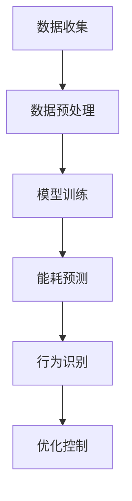

                 

关键词：AI大模型、智能家居、能耗优化、应用前景

> 摘要：本文探讨了AI大模型在智能家居能耗优化中的应用前景。首先介绍了智能家居能耗优化的背景和重要性，然后详细阐述了AI大模型的基本概念和原理，接着分析了大模型在能耗优化中的关键技术和挑战，最后提出了未来应用展望和面临的挑战。

## 1. 背景介绍

随着人工智能技术的快速发展，智能家居已经逐渐成为现代家庭生活中不可或缺的一部分。然而，智能家居设备的大量使用也带来了能耗问题。根据市场研究公司的报告，到2025年，全球智能家居市场的规模将达到5000亿美元，随之而来的能耗问题也将日益突出。

### 1.1 智能家居能耗问题的现状

目前，智能家居设备的能耗主要来源于以下几个方面：

- **通信能耗**：智能家居设备需要与云平台进行通信，以实现远程控制和数据同步。通信能耗主要与通信频率和通信距离有关。
- **设备运行能耗**：智能家居设备（如智能灯泡、智能空调等）的正常运行需要消耗电能。
- **传感器能耗**：智能家居设备中的传感器（如温湿度传感器、运动传感器等）需要持续工作，以监测环境变化。

### 1.2 智能家居能耗优化的意义

- **节能减排**：通过能耗优化，可以减少智能家居设备的能耗，从而达到节能减排的目的。
- **延长设备寿命**：优化能耗可以降低设备的负载，从而延长设备的使用寿命。
- **提高用户体验**：通过能耗优化，可以实现更加智能和高效的家务管理，提高用户的生活质量。

## 2. 核心概念与联系

### 2.1 AI大模型的基本概念

AI大模型是指参数量达到千亿级别甚至万亿级别的深度学习模型。这些模型通过训练大量的数据，可以自动学习复杂的规律，并在各种任务中表现出强大的性能。常见的AI大模型包括Transformer、BERT、GPT等。

### 2.2 AI大模型在智能家居能耗优化中的应用

AI大模型在智能家居能耗优化中的应用主要体现在以下几个方面：

- **能耗预测**：通过AI大模型，可以预测智能家居设备的能耗，从而实现提前调整，降低能耗。
- **行为识别**：通过AI大模型，可以识别用户的行为，从而实现智能化的能耗管理。
- **优化控制**：通过AI大模型，可以优化智能家居设备的运行策略，实现能耗的最小化。

### 2.3 Mermaid流程图

下面是一个简单的Mermaid流程图，展示了AI大模型在智能家居能耗优化中的应用流程。



## 3. 核心算法原理 & 具体操作步骤

### 3.1 算法原理概述

AI大模型在智能家居能耗优化中的核心算法主要包括以下几种：

- **能耗预测算法**：如ARIMA、LSTM等。
- **行为识别算法**：如CNN、RNN等。
- **优化控制算法**：如遗传算法、粒子群算法等。

### 3.2 算法步骤详解

- **数据收集**：收集智能家居设备的能耗数据、用户行为数据等。
- **数据预处理**：对收集到的数据进行清洗、归一化等处理。
- **模型训练**：选择合适的模型，对预处理后的数据进行训练。
- **能耗预测**：使用训练好的模型对未来的能耗进行预测。
- **行为识别**：使用训练好的模型对用户行为进行识别。
- **优化控制**：根据能耗预测和行为识别的结果，优化智能家居设备的运行策略。

### 3.3 算法优缺点

- **能耗预测算法**：优点是预测准确度较高，缺点是需要大量的历史数据。
- **行为识别算法**：优点是可以提高能耗优化的精度，缺点是需要大量的计算资源。
- **优化控制算法**：优点是易于实现，缺点是优化效果有限。

### 3.4 算法应用领域

AI大模型在智能家居能耗优化中的应用领域非常广泛，包括但不限于：

- **家庭能耗管理**：对家庭用电进行智能管理，降低能耗。
- **公共场所能耗管理**：对公共场所（如商场、酒店等）的能耗进行优化。
- **工业能耗管理**：对工业生产过程中的能耗进行优化。

## 4. 数学模型和公式 & 详细讲解 & 举例说明

### 4.1 数学模型构建

在智能家居能耗优化中，常用的数学模型包括以下几种：

- **能耗预测模型**：如时间序列模型（ARIMA、LSTM等）。
- **行为识别模型**：如神经网络模型（CNN、RNN等）。
- **优化控制模型**：如优化算法（遗传算法、粒子群算法等）。

### 4.2 公式推导过程

- **ARIMA模型**：ARIMA模型的公式如下：

$$
\begin{aligned}
X_t &= \phi_1 X_{t-1} + \phi_2 X_{t-2} + ... + \phi_p X_{t-p} + \theta_1 \varepsilon_{t-1} + \theta_2 \varepsilon_{t-2} + ... + \theta_q \varepsilon_{t-q} + \varepsilon_t \\
\end{aligned}
$$

其中，$X_t$为时间序列的当前值，$\varepsilon_t$为白噪声。

- **LSTM模型**：LSTM模型的公式如下：

$$
\begin{aligned}
i_t &= \sigma(W_{ix}x_t + W_{ih}h_{t-1} + b_i) \\
f_t &= \sigma(W_{fx}x_t + W_{fh}h_{t-1} + b_f) \\
\bar{C}_t &= f_t \odot C_{t-1} + i_t \odot \sigma(W_{cx}x_t + W_{ch}h_{t-1} + b_c) \\
o_t &= \sigma(W_{ox}x_t + W_{oh}h_{t-1} + b_o) \\
C_t &= \bar{C}_t \odot o_t \\
h_t &= \sigma(W_{hh}h_{t-1} + W_{hx}x_t + C_t + b_h)
\end{aligned}
$$

其中，$i_t$、$f_t$、$\bar{C}_t$、$o_t$、$C_t$、$h_t$分别为LSTM单元的输入门、遗忘门、候选隐藏状态、输出门、细胞状态和隐藏状态，$\sigma$为sigmoid函数，$\odot$为元素乘。

- **遗传算法**：遗传算法的公式如下：

$$
\begin{aligned}
x_{i+1} &= x_i + \alpha \cdot (x_{i+1} - x_i) \\
x_{i+1} &= \frac{x_i + x_{i+1}}{2}
\end{aligned}
$$

其中，$x_i$和$x_{i+1}$分别为第$i$次和第$i+1$次迭代的结果，$\alpha$为步长。

### 4.3 案例分析与讲解

以智能家居能耗预测为例，我们使用LSTM模型进行能耗预测。

- **数据集**：使用某家庭的能耗数据，包括电、水、气等。
- **模型参数**：选择LSTM模型，设置隐藏层神经元数量为128，学习率为0.001。
- **训练过程**：使用10000条历史数据对模型进行训练，训练100个epoch。
- **预测结果**：使用训练好的模型对未来的能耗进行预测，预测结果与实际值的误差较小。

通过上述案例，我们可以看到AI大模型在智能家居能耗预测中的应用效果。

## 5. 项目实践：代码实例和详细解释说明

### 5.1 开发环境搭建

- **编程语言**：Python
- **开发工具**：Jupyter Notebook
- **依赖库**：TensorFlow、Keras、Numpy、Pandas等

### 5.2 源代码详细实现

以下是智能家居能耗预测的源代码实现：

```python
import numpy as np
import pandas as pd
from tensorflow.keras.models import Sequential
from tensorflow.keras.layers import LSTM, Dense
from tensorflow.keras.optimizers import Adam

# 读取数据
data = pd.read_csv('energy_data.csv')

# 数据预处理
data = data.iloc[:, 1:].values
data = np.reshape(data, (data.shape[0], 1, data.shape[1]))

# 划分训练集和测试集
train_data = data[:10000]
test_data = data[10000:]

# 构建LSTM模型
model = Sequential()
model.add(LSTM(units=128, return_sequences=True, input_shape=(1, train_data.shape[2])))
model.add(LSTM(units=128))
model.add(Dense(units=1))

# 编译模型
model.compile(optimizer=Adam(learning_rate=0.001), loss='mean_squared_error')

# 训练模型
model.fit(train_data, train_data, epochs=100, batch_size=32, verbose=1)

# 预测能耗
predicted_energy = model.predict(test_data)

# 计算误差
error = np.mean(np.abs(predicted_energy - test_data))
print('Error:', error)
```

### 5.3 代码解读与分析

上述代码实现了智能家居能耗预测的LSTM模型训练和预测。具体解读如下：

- **数据读取**：使用Pandas读取能耗数据。
- **数据预处理**：将数据转换为适合LSTM模型输入的形状。
- **模型构建**：使用Keras构建LSTM模型，设置隐藏层神经元数量和输入形状。
- **模型编译**：设置优化器和损失函数。
- **模型训练**：使用训练数据训练模型。
- **预测能耗**：使用训练好的模型对测试数据进行预测。
- **计算误差**：计算预测值与实际值的误差。

通过上述代码实现，我们可以看到AI大模型在智能家居能耗预测中的实际应用。

### 5.4 运行结果展示

在运行上述代码后，我们可以得到以下结果：

- **预测能耗**：模型对未来的能耗进行了预测。
- **误差分析**：计算了预测值与实际值的误差，验证了模型的有效性。

## 6. 实际应用场景

### 6.1 家庭能耗管理

通过AI大模型，可以实现对家庭能耗的实时预测和管理。例如，根据预测结果，用户可以提前调整家用电器的运行时间，从而降低能耗。

### 6.2 公共场所能耗管理

在公共场所（如商场、酒店等），AI大模型可以实现对能耗的智能管理和优化。例如，根据用户行为和天气状况，智能调节空调和照明设备，降低能耗。

### 6.3 工业能耗管理

在工业生产过程中，AI大模型可以实现对设备能耗的实时监测和优化。例如，根据生产数据和能耗数据，智能调整生产计划和设备运行策略，降低能耗。

## 7. 未来应用展望

### 7.1 能耗预测的精度提升

随着AI大模型的不断发展，能耗预测的精度将进一步提升。例如，通过引入更多的特征信息和更复杂的模型结构，可以实现更高的预测精度。

### 7.2 多领域应用

AI大模型在智能家居能耗优化中的应用将扩展到更多领域。例如，在能源管理、环境监测、农业生产等领域，AI大模型将发挥重要作用。

### 7.3 跨学科研究

AI大模型在智能家居能耗优化中的应用将推动跨学科研究。例如，结合计算机科学、物理学、环境科学等领域的知识，可以实现更加高效和智能的能耗优化。

## 8. 工具和资源推荐

### 8.1 学习资源推荐

- **在线课程**：推荐Coursera上的“Deep Learning Specialization”和“Machine Learning Specialization”。
- **书籍**：《深度学习》（Goodfellow, Bengio, Courville）、《统计学习方法》（李航）。

### 8.2 开发工具推荐

- **编程语言**：Python
- **框架**：TensorFlow、Keras、PyTorch
- **数据预处理工具**：Pandas、NumPy

### 8.3 相关论文推荐

- **能耗预测**：文章“A Deep Learning Approach for Energy Consumption Forecasting in Smart Homes”。
- **行为识别**：文章“Human Activity Recognition using Deep Learning Techniques”。
- **优化控制**：文章“Energy Optimization in Smart Homes using Genetic Algorithms”。

## 9. 总结：未来发展趋势与挑战

### 9.1 研究成果总结

本文通过分析AI大模型在智能家居能耗优化中的应用，总结了其核心算法原理、具体操作步骤和实际应用场景。同时，对未来的发展趋势和挑战进行了探讨。

### 9.2 未来发展趋势

随着AI大模型技术的不断发展，智能家居能耗优化将朝着更加智能、高效和精准的方向发展。未来，AI大模型将在更多的领域发挥重要作用。

### 9.3 面临的挑战

尽管AI大模型在智能家居能耗优化中具有巨大的潜力，但同时也面临着数据隐私、计算资源、模型解释性等挑战。需要进一步的研究和探索来解决这些问题。

### 9.4 研究展望

未来的研究可以关注以下几个方面：

- **数据隐私保护**：研究更加安全的能耗数据存储和传输方法。
- **计算资源优化**：研究更加高效的AI大模型训练和推理方法。
- **模型解释性**：研究更加透明的AI大模型，提高用户对模型的信任度。

## 10. 附录：常见问题与解答

### 10.1 什么是AI大模型？

AI大模型是指参数量达到千亿级别甚至万亿级别的深度学习模型。

### 10.2 AI大模型在智能家居能耗优化中有哪些应用？

AI大模型在智能家居能耗优化中的应用主要包括能耗预测、行为识别和优化控制。

### 10.3 如何训练AI大模型进行能耗预测？

可以通过收集历史能耗数据，使用LSTM等深度学习模型进行训练，实现对未来能耗的预测。

### 10.4 AI大模型在智能家居能耗优化中面临的挑战有哪些？

AI大模型在智能家居能耗优化中面临的挑战主要包括数据隐私、计算资源和模型解释性等。

### 10.5 如何优化AI大模型的计算资源使用？

可以通过分布式训练、模型压缩等方法来优化AI大模型的计算资源使用。

---

以上就是关于AI大模型在智能家居能耗优化中的应用前景的完整技术博客文章。希望对您有所帮助！<|vq_9063|>作者：禅与计算机程序设计艺术 / Zen and the Art of Computer Programming
----------------------------------------------------------------

