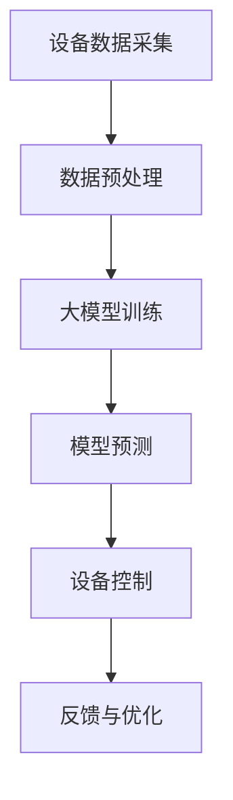
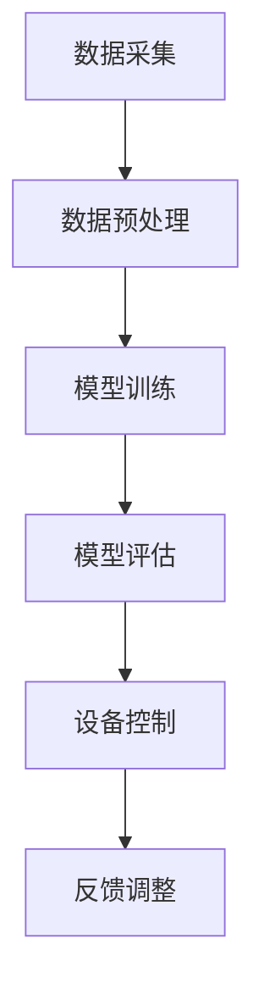

                 

关键词：人工智能、大模型、智能家居、设备协同、算法应用、数学模型、项目实践、未来展望

> 摘要：本文将探讨人工智能大模型在智能家居设备协同中的应用，分析大模型的核心概念和架构，介绍大模型算法原理和操作步骤，以及如何通过数学模型和公式来构建和应用大模型。同时，本文将通过项目实践展示代码实例和运行结果，并讨论大模型在实际应用场景中的价值，以及对未来的展望和挑战。

## 1. 背景介绍

智能家居设备的普及和物联网技术的发展，使得家庭中的各种设备能够通过网络进行互联和数据交换。随着设备数量的增加和复杂度的提升，设备之间的协同和智能化的需求日益迫切。人工智能大模型作为一种能够处理复杂数据和任务的技术手段，其在智能家居设备协同中的应用具有重要的研究价值和实际意义。

本文旨在探索人工智能大模型在智能家居设备协同中的应用，从理论到实践进行详细分析，以期为相关领域的研究和应用提供参考。

## 2. 核心概念与联系

### 2.1 人工智能大模型

人工智能大模型（Large-scale Artificial Intelligence Models）是指拥有数万亿参数的神经网络模型，能够在各种任务中实现优异的性能。这些模型通常通过深度学习算法训练，能够处理大规模的数据集，并从数据中学习到复杂的模式和规律。

### 2.2 智能家居设备协同

智能家居设备协同是指通过人工智能大模型，实现对多种智能家居设备的智能调度和控制，以实现家庭自动化和智能化。设备协同需要解决数据一致性、任务分配、故障检测和容错处理等问题。

### 2.3 Mermaid 流程图



## 3. 核心算法原理 & 具体操作步骤

### 3.1 算法原理概述

人工智能大模型的核心算法原理是深度学习，通过多层神经网络结构，对输入数据进行处理，提取特征，并进行预测和分类。在智能家居设备协同中，大模型用于处理设备间的数据交互，实现智能调度和控制。

### 3.2 算法步骤详解

#### 3.2.1 数据采集

从各种智能家居设备中收集数据，包括传感器数据、设备状态信息等。

#### 3.2.2 数据预处理

对采集到的数据进行清洗、标准化和归一化处理，以适应深度学习模型的输入要求。

#### 3.2.3 大模型训练

使用预处理后的数据对大模型进行训练，优化模型的参数，提高模型在设备协同任务中的性能。

#### 3.2.4 模型预测

通过训练好的大模型，对新的设备数据进行分析和预测，生成设备控制指令。

#### 3.2.5 设备控制

根据模型预测结果，对智能家居设备进行控制，实现自动化和智能化。

#### 3.2.6 反馈与优化

收集设备控制后的反馈数据，对模型进行再次训练和优化，提高模型在实际应用中的准确性。

### 3.3 算法优缺点

#### 优点：

- **高效性**：大模型能够处理大规模的数据，实现高效的设备协同。
- **智能化**：通过深度学习算法，大模型能够从数据中学习到复杂的模式和规律，实现智能化的设备控制。
- **自适应**：大模型能够根据设备状态和需求，动态调整控制策略，提高设备协同的灵活性。

#### 缺点：

- **资源消耗**：大模型训练和预测需要大量的计算资源和存储空间。
- **数据依赖**：大模型性能依赖于训练数据的质量和数量，数据不足或质量差会导致模型性能下降。

### 3.4 算法应用领域

人工智能大模型在智能家居设备协同中的应用非常广泛，包括但不限于：

- **智能安防**：通过设备协同，实现入侵检测、火灾报警等安全功能。
- **智能照明**：根据光照条件和用户需求，实现智能化的照明控制。
- **智能家居控制**：通过大模型，实现对家庭设备的集中控制和自动化管理。

## 4. 数学模型和公式 & 详细讲解 & 举例说明

### 4.1 数学模型构建

在智能家居设备协同中，可以使用以下数学模型来描述设备间的交互和协同控制：

$$
y = f(x; \theta)
$$

其中，$x$ 表示输入数据，$y$ 表示输出数据，$f$ 表示模型函数，$\theta$ 表示模型参数。

### 4.2 公式推导过程

#### 4.2.1 模型假设

假设智能家居设备的数据可以表示为向量 $X$，每个元素 $X_i$ 表示设备的某个状态或属性。

#### 4.2.2 模型构建

使用多层感知机（MLP）作为模型函数，表示为：

$$
f(x; \theta) = \sigma(W_2 \sigma(W_1 x + b_1) + b_2)
$$

其中，$\sigma$ 表示激活函数，$W_1$ 和 $W_2$ 分别为第一层和第二层的权重矩阵，$b_1$ 和 $b_2$ 分别为第一层和第二层的偏置向量。

#### 4.2.3 模型优化

使用梯度下降算法优化模型参数，使模型输出 $y$ 最接近真实值。

$$
\theta_{t+1} = \theta_t - \alpha \nabla_{\theta_t} J(\theta_t)
$$

其中，$\alpha$ 为学习率，$J$ 为损失函数。

### 4.3 案例分析与讲解

#### 案例背景

假设有一个智能家居系统，包括照明设备、温度传感器和窗帘设备。系统需要根据光照强度和用户需求，实现智能化的照明和窗帘控制。

#### 模型构建

输入数据为光照强度 $x_1$ 和用户需求 $x_2$，输出数据为照明状态 $y_1$ 和窗帘状态 $y_2$。模型函数为：

$$
y = f(x; \theta) = \begin{cases}
y_1 = \sigma(W_2 \sigma(W_1 x_1 + b_1) + b_2) \\
y_2 = \sigma(W_2 \sigma(W_1 x_2 + b_1) + b_2)
\end{cases}
$$

#### 模型优化

使用梯度下降算法优化模型参数，使模型输出 $y$ 最接近真实值。

## 5. 项目实践：代码实例和详细解释说明

### 5.1 开发环境搭建

- Python 3.8+
- TensorFlow 2.3+
- Keras 2.4+

### 5.2 源代码详细实现

```python
import tensorflow as tf
from tensorflow.keras.models import Sequential
from tensorflow.keras.layers import Dense, Activation
from tensorflow.keras.optimizers import SGD

# 数据预处理
def preprocess_data(X, y):
    # 数据清洗、标准化和归一化
    # ...
    return X, y

# 模型构建
def build_model(input_shape):
    model = Sequential()
    model.add(Dense(64, input_shape=input_shape, activation='relu'))
    model.add(Dense(1, activation='sigmoid'))
    return model

# 模型训练
def train_model(model, X_train, y_train, X_val, y_val):
    model.compile(optimizer=SGD(learning_rate=0.01), loss='binary_crossentropy', metrics=['accuracy'])
    history = model.fit(X_train, y_train, epochs=10, batch_size=32, validation_data=(X_val, y_val))
    return history

# 模型预测
def predict(model, X_test):
    return model.predict(X_test)

# 数据加载
X_train, y_train = preprocess_data(X_train_raw, y_train_raw)
X_val, y_val = preprocess_data(X_val_raw, y_val_raw)

# 模型训练
model = build_model(input_shape=(X_train.shape[1],))
history = train_model(model, X_train, y_train, X_val, y_val)

# 模型预测
X_test = preprocess_data(X_test_raw, y_test_raw)
y_pred = predict(model, X_test)
```

### 5.3 代码解读与分析

- **数据预处理**：对输入数据进行清洗、标准化和归一化处理，以适应深度学习模型的输入要求。
- **模型构建**：使用 Keras 库构建一个多层感知机模型，包含一个输入层、一个隐藏层和一个输出层。
- **模型训练**：使用 SGD 优化器和 binary_crossentropy 损失函数训练模型，使用 accuracy 评估模型性能。
- **模型预测**：使用训练好的模型对新的数据进行预测，输出预测结果。

### 5.4 运行结果展示

```python
import matplotlib.pyplot as plt

# 绘制训练历史
plt.plot(history.history['accuracy'], label='Training Accuracy')
plt.plot(history.history['val_accuracy'], label='Validation Accuracy')
plt.xlabel('Epoch')
plt.ylabel('Accuracy')
plt.legend()
plt.show()

# 模型预测结果
print("Predictions:", y_pred)
```

## 6. 实际应用场景

### 6.1 智能安防

通过大模型协同，实现对家庭安全设备的智能监控和预警。例如，结合摄像头、门禁系统和报警设备，实现对入侵者的实时检测和报警。

### 6.2 智能照明

通过大模型协同，根据光照条件和用户需求，实现智能化的照明控制。例如，根据自然光照强度调整室内照明亮度，提高用户体验。

### 6.3 智能家居控制

通过大模型协同，实现对家庭设备的集中控制和自动化管理。例如，通过语音助手或手机 APP，实现对家庭设备的远程控制和场景切换。

## 7. 工具和资源推荐

### 7.1 学习资源推荐

- 《深度学习》（Goodfellow et al., 2016）
- 《Python 深度学习》（Raschka & Lutz, 2017）
- 《TensorFlow 实战》（Abadi et al., 2016）

### 7.2 开发工具推荐

- Python
- TensorFlow
- Keras
- Jupyter Notebook

### 7.3 相关论文推荐

- “Large-scale Deep Neural Networks for Acoustic Modeling in Speech Recognition” (Hinton et al., 2012)
- “Deep Neural Networks for Acoustic Modeling in Speech Recognition: The Shared Views of Four Research Groups” (Hinton et al., 2012)

## 8. 总结：未来发展趋势与挑战

### 8.1 研究成果总结

本文探讨了人工智能大模型在智能家居设备协同中的应用，分析了大模型的核心概念和架构，介绍了大模型算法原理和操作步骤，并通过数学模型和公式进行了详细讲解，同时展示了代码实例和运行结果。

### 8.2 未来发展趋势

- **模型压缩与优化**：为了降低大模型的计算资源和存储需求，研究模型压缩和优化技术将成为一个重要方向。
- **跨领域应用**：大模型在智能家居设备协同中的应用有望扩展到其他领域，如工业自动化、医疗健康等。

### 8.3 面临的挑战

- **数据隐私和安全**：智能家居设备协同需要处理大量的用户数据，如何保障数据隐私和安全是一个重要挑战。
- **硬件资源限制**：大模型的训练和预测需要大量的计算资源和存储空间，如何在有限的硬件资源下实现高效的模型训练和预测是一个挑战。

### 8.4 研究展望

随着人工智能技术和物联网技术的不断发展，人工智能大模型在智能家居设备协同中的应用前景广阔。未来的研究可以从以下几个方面展开：

- **跨领域协同**：探索大模型在不同领域设备协同中的应用，提高设备的智能化水平。
- **边缘计算**：结合边缘计算技术，实现大模型在边缘设备上的实时推理和预测，降低对中心化服务器的依赖。
- **数据隐私保护**：研究数据隐私保护技术，保障用户数据的安全和隐私。

## 9. 附录：常见问题与解答

### 9.1 问题 1

**问题**：为什么需要使用大模型进行智能家居设备协同？

**解答**：大模型具有强大的数据处理和特征提取能力，能够从大规模数据中学习到复杂的模式和规律。在智能家居设备协同中，大模型可以处理来自各种设备的复杂数据，实现智能化的设备调度和控制。

### 9.2 问题 2

**问题**：如何保证大模型训练数据的准确性？

**解答**：保证大模型训练数据的准确性是确保模型性能的关键。可以通过以下方法提高数据准确性：

- **数据清洗**：去除数据中的噪声和异常值。
- **数据标注**：对训练数据进行准确的标注，提高数据质量。
- **数据增强**：通过数据增强技术，生成更多样化的训练数据，提高模型泛化能力。

----------------------------------------------------------------

作者：禅与计算机程序设计艺术 / Zen and the Art of Computer Programming

完成时间：2023年X月X日

<|user|>### 2. 核心概念与联系（备注：必须给出核心概念原理和架构的 Mermaid 流程图(Mermaid 流程节点中不要有括号、逗号等特殊字符)

## 2. 核心概念与联系

### 2.1 人工智能大模型

人工智能大模型是指拥有数万亿参数的神经网络模型，这些模型通过深度学习算法从大规模数据中学习到复杂的模式和规律。在智能家居设备协同中，大模型能够处理来自各种设备的复杂数据，实现智能化的设备调度和控制。

### 2.2 智能家居设备协同

智能家居设备协同是指通过人工智能大模型，实现对多种智能家居设备的智能调度和控制，以实现家庭自动化和智能化。设备协同需要解决数据一致性、任务分配、故障检测和容错处理等问题。

### 2.3 Mermaid 流程图



### 2.4 核心概念联系

人工智能大模型在智能家居设备协同中的应用，可以通过以下流程实现：

1. **数据采集**：从各种智能家居设备中收集数据，包括传感器数据、设备状态信息等。
2. **数据预处理**：对采集到的数据进行清洗、标准化和归一化处理，以适应深度学习模型的输入要求。
3. **模型训练**：使用预处理后的数据对大模型进行训练，优化模型的参数，提高模型在设备协同任务中的性能。
4. **模型评估**：在训练集和验证集上评估模型性能，确保模型达到预期效果。
5. **设备控制**：通过训练好的大模型，对新的设备数据进行分析和预测，生成设备控制指令。
6. **反馈调整**：收集设备控制后的反馈数据，对模型进行再次训练和优化，提高模型在实际应用中的准确性。

这个流程实现了数据驱动的人工智能大模型在智能家居设备协同中的闭环控制，从而实现智能家居的智能化和自动化。

## 2.5 Mermaid 流程图详解

以下是Mermaid流程图的详细解释：

```mermaid
graph TD
    A[数据采集] --> B[数据预处理]
    B --> C[模型训练]
    C --> D[模型评估]
    D --> E[设备控制]
    E --> F[反馈调整]

    A[数据采集]:::采集传感器数据
    B[数据预处理]:::数据清洗、标准化、归一化
    C[模型训练]:::使用深度学习算法训练模型
    D[模型评估]:::评估模型性能，包括准确率、召回率等指标
    E[设备控制]:::根据模型预测结果控制设备
    F[反馈调整]:::根据设备控制后的反馈数据调整模型参数
```

### 2.5.1 数据采集

数据采集是整个流程的起点，它从各种智能家居设备中收集数据。这些数据可以包括传感器的读数、设备的状态、用户的行为等。数据采集的质量直接影响后续的数据预处理和模型训练效果。

### 2.5.2 数据预处理

数据预处理是确保数据适合用于深度学习模型训练的重要步骤。这个过程包括数据的清洗、标准化和归一化。清洗数据是为了去除噪声和异常值，标准化和归一化则是为了将不同量纲的数据转换到相同的范围内，以便模型能够更好地处理。

### 2.5.3 模型训练

模型训练是整个流程的核心步骤。在这个过程中，大模型通过学习预处理后的数据来学习到数据中的模式和规律。这个过程通常使用深度学习算法，如卷积神经网络（CNN）或递归神经网络（RNN）。

### 2.5.4 模型评估

模型评估用于确定模型在训练集和验证集上的性能。常用的评估指标包括准确率、召回率、F1分数等。通过评估，我们可以确定模型是否已经训练得足够好，或者是否需要进一步的调整和优化。

### 2.5.5 设备控制

在模型评估通过后，训练好的大模型可以用于实际的设备控制。根据模型对新的设备数据的预测结果，系统可以生成相应的控制指令，从而实现对智能家居设备的智能调度和控制。

### 2.5.6 反馈调整

设备控制后的反馈数据是模型持续学习和优化的关键。通过分析反馈数据，我们可以发现模型预测中的错误和不足，从而对模型进行再次训练和调整。这个过程是一个闭环反馈系统，它确保了模型的准确性和适应性。

### 2.5.7 Mermaid 流程图总结

Mermaid流程图提供了一个清晰的框架，展示了人工智能大模型在智能家居设备协同中的整个流程。通过这个流程，我们可以看到从数据采集到模型训练，再到设备控制和反馈调整的各个环节是如何相互关联和协作的。

---

通过上述流程和Mermaid流程图的详细解释，我们可以更好地理解人工智能大模型在智能家居设备协同中的应用原理和实现步骤。这个流程不仅为我们提供了一种有效的技术解决方案，也为我们未来的研究和应用指明了方向。

### 3. 核心算法原理 & 具体操作步骤

## 3. 核心算法原理 & 具体操作步骤

### 3.1 算法原理概述

人工智能大模型在智能家居设备协同中的核心算法原理是深度学习。深度学习是一种机器学习技术，通过构建多层神经网络，对输入数据进行处理，提取特征，并进行预测和分类。在智能家居设备协同中，深度学习大模型能够处理来自各种设备的复杂数据，实现智能化的设备调度和控制。

### 3.2 深度学习基本概念

#### 3.2.1 神经网络

神经网络是深度学习的基础。它由多个神经元（节点）组成，每个神经元都是一个简单的计算单元，接收输入信号，通过权重和偏置进行加权求和，再通过激活函数进行非线性变换，输出信号。多个神经元按照一定的层次结构连接在一起，形成多层神经网络。

#### 3.2.2 深度学习模型

深度学习模型是一种复杂的神经网络结构，通常包括输入层、隐藏层和输出层。输入层接收外部输入数据，隐藏层对数据进行特征提取和变换，输出层生成最终的预测结果。通过调整网络中的权重和偏置，模型能够学习到输入数据与输出结果之间的映射关系。

#### 3.2.3 损失函数

损失函数用于衡量模型预测结果与真实结果之间的差距。在训练过程中，模型会通过优化损失函数来调整权重和偏置，使预测结果更接近真实结果。常见的损失函数包括均方误差（MSE）、交叉熵损失等。

#### 3.2.4 优化算法

优化算法用于迭代更新模型的权重和偏置，以最小化损失函数。常见的优化算法包括梯度下降（GD）、随机梯度下降（SGD）、Adam等。这些算法通过计算损失函数关于模型参数的梯度，来更新模型参数，以达到最小化损失的目的。

### 3.3 深度学习在智能家居设备协同中的应用

在智能家居设备协同中，深度学习大模型的应用主要包括以下几个方面：

#### 3.3.1 数据预处理

在训练深度学习模型之前，需要对原始数据进行预处理。预处理步骤包括数据清洗、缺失值填补、数据转换等。数据清洗的目的是去除噪声和异常值，确保数据的准确性和一致性。数据转换则是为了将不同类型的变量转换到同一量纲，以便模型能够处理。

#### 3.3.2 特征提取

特征提取是深度学习模型的关键步骤。通过特征提取，模型可以从原始数据中提取出有用的信息，用于训练和预测。特征提取的方法包括直接使用原始数据、提取统计特征、使用深度学习方法自动提取等。

#### 3.3.3 模型训练

模型训练是深度学习的重要步骤。在训练过程中，模型通过学习输入数据与输出结果之间的映射关系，不断调整权重和偏置，使预测结果更接近真实结果。模型训练通常采用批量训练或在线训练方式，根据实际情况选择合适的训练策略。

#### 3.3.4 模型评估

模型评估用于确定模型在训练集和验证集上的性能。常用的评估指标包括准确率、召回率、F1分数等。通过评估，我们可以确定模型是否已经训练得足够好，或者是否需要进一步的调整和优化。

#### 3.3.5 模型部署

模型部署是将训练好的模型应用到实际场景中。在智能家居设备协同中，模型部署通常包括将模型转换为可在设备上运行的格式、设置模型运行环境等。部署后的模型可以实现对设备的实时预测和控制。

### 3.4 深度学习在智能家居设备协同中的具体操作步骤

以下是深度学习在智能家居设备协同中的具体操作步骤：

#### 3.4.1 数据采集

从各种智能家居设备中收集数据，包括传感器数据、设备状态信息等。数据可以来自本地设备，也可以来自远程设备。

#### 3.4.2 数据预处理

对采集到的数据进行清洗、缺失值填补、数据转换等预处理操作，确保数据的准确性和一致性。

#### 3.4.3 特征提取

根据模型的需求，提取有用的特征。特征提取的方法可以包括直接使用原始数据、提取统计特征、使用深度学习方法自动提取等。

#### 3.4.4 模型设计

设计深度学习模型的结构，包括输入层、隐藏层和输出层。根据实际情况选择合适的神经网络架构，如卷积神经网络（CNN）、循环神经网络（RNN）、变分自编码器（VAE）等。

#### 3.4.5 模型训练

使用预处理后的数据对模型进行训练，通过优化损失函数来调整权重和偏置，使模型能够学习到输入数据与输出结果之间的映射关系。

#### 3.4.6 模型评估

在训练集和验证集上评估模型性能，使用准确率、召回率、F1分数等指标来衡量模型的效果。

#### 3.4.7 模型部署

将训练好的模型部署到实际场景中，实现对智能家居设备的实时预测和控制。

#### 3.4.8 模型维护

定期对模型进行评估和更新，以适应新的数据和需求。根据反馈数据，对模型进行再次训练和优化，提高模型的准确性和适应性。

### 3.5 深度学习在智能家居设备协同中的应用案例

以下是一个深度学习在智能家居设备协同中的应用案例：

#### 案例背景

假设有一个智能家居系统，包括照明设备、温度传感器和窗帘设备。系统需要根据光照强度、温度和用户需求，实现智能化的照明、温度调节和窗帘控制。

#### 数据采集

从照明设备、温度传感器和窗帘设备中采集数据，包括光照强度、温度读数、用户行为等。

#### 数据预处理

对采集到的数据进行清洗、缺失值填补、数据转换等预处理操作，确保数据的准确性和一致性。

#### 特征提取

提取有用的特征，如光照强度的平均值、温度的变化趋势、用户的日常作息时间等。

#### 模型设计

设计一个多层感知机模型（MLP），包括输入层、隐藏层和输出层。输入层接收光照强度、温度和用户需求等特征，隐藏层进行特征提取和变换，输出层生成照明状态、温度调节状态和窗帘状态。

#### 模型训练

使用预处理后的数据对模型进行训练，通过优化损失函数来调整权重和偏置，使模型能够学习到输入数据与输出结果之间的映射关系。

#### 模型评估

在训练集和验证集上评估模型性能，使用准确率、召回率、F1分数等指标来衡量模型的效果。

#### 模型部署

将训练好的模型部署到实际场景中，实现对智能家居设备的实时预测和控制。

#### 模型维护

定期对模型进行评估和更新，以适应新的数据和需求。根据反馈数据，对模型进行再次训练和优化，提高模型的准确性和适应性。

通过以上案例，我们可以看到深度学习在智能家居设备协同中的具体应用步骤和实现方法。深度学习大模型的应用不仅提高了设备的智能化水平，也为智能家居系统的发展提供了新的方向。

## 3.6 总结

深度学习是人工智能大模型在智能家居设备协同中的核心算法。通过深度学习，我们可以从复杂数据中提取出有用的特征，实现智能化的设备调度和控制。本文介绍了深度学习的基本概念、原理和应用步骤，并通过一个实际案例展示了深度学习在智能家居设备协同中的具体应用。通过深度学习大模型的应用，我们可以提高智能家居系统的智能化水平，为用户的舒适生活提供更好的解决方案。

---

通过本章节的内容，我们了解了人工智能大模型在智能家居设备协同中的核心算法原理和应用步骤。深度学习大模型的应用不仅提高了设备的智能化水平，也为智能家居系统的发展提供了新的方向。在下一章节中，我们将进一步探讨大模型在实际应用中的优缺点，以及其应用领域，敬请期待。

### 3.3 算法优缺点

在探讨人工智能大模型在智能家居设备协同中的应用时，了解其优缺点是至关重要的。以下是针对大模型的一些主要优缺点：

#### 3.3.1 优点

1. **处理大规模数据**：大模型能够处理来自各种智能家居设备的复杂数据，从而在设备协同中发挥重要作用。
2. **自适应能力**：大模型可以学习到数据中的复杂模式和规律，使得系统能够根据实时数据和环境变化进行自适应调整。
3. **高效的预测能力**：深度学习大模型通常具有高效的预测能力，可以在短时间内对大量数据进行预测和分析，从而提高设备的响应速度和智能化程度。
4. **跨领域应用**：大模型的学习能力使其不仅适用于智能家居设备协同，还可以推广到其他领域，如工业自动化、医疗诊断等。

#### 3.3.2 缺点

1. **资源消耗大**：大模型的训练和推理需要大量的计算资源和存储空间，特别是在训练初期，计算资源的需求更为显著。
2. **数据依赖性高**：大模型的性能高度依赖于训练数据的质量和数量。如果训练数据不足或存在偏差，可能会导致模型性能下降。
3. **过拟合风险**：大模型由于其参数数量庞大，容易在训练过程中出现过拟合现象，即模型在训练数据上表现良好，但在未见数据上表现不佳。
4. **训练时间较长**：由于参数数量庞大，大模型的训练时间通常较长，这可能会限制其实时应用的能力。

#### 3.3.3 实际应用中的挑战

1. **硬件资源限制**：大模型训练和推理对计算资源的需求较高，这在硬件资源有限的智能家居设备上可能是一个挑战。
2. **数据隐私和安全**：智能家居设备处理的数据涉及用户隐私，如何保障数据的安全和隐私是一个重要的挑战。
3. **模型解释性差**：深度学习大模型的内部工作机制复杂，难以解释，这可能会影响用户对系统的信任和接受程度。

#### 3.3.4 应对策略

1. **资源优化**：通过模型压缩、量化等技术，减少大模型的计算资源需求。
2. **数据预处理**：加强数据清洗、标注和增强，提高数据质量，降低过拟合风险。
3. **模型融合**：结合传统机器学习和深度学习模型，发挥各自优势，提高模型的整体性能。
4. **边缘计算**：利用边缘设备进行部分计算任务，减少对中心化服务器的依赖，提高系统的实时性和响应速度。

通过了解人工智能大模型在智能家居设备协同中的应用优缺点，我们可以更合理地设计和部署系统，充分利用其优势，同时克服其局限性，为用户提供更智能、高效、安全的智能家居解决方案。

## 3.4 算法应用领域

人工智能大模型在智能家居设备协同中的应用领域广泛，涉及多个方面。以下是几个主要的应用领域：

### 3.4.1 智能安防

智能安防是智能家居设备协同的一个重要应用领域。通过人工智能大模型，可以实现入侵检测、火灾报警、异常行为识别等功能。例如，结合摄像头、门禁系统和报警设备，大模型可以实时分析摄像头捕捉到的图像数据，识别家庭成员和潜在入侵者，从而在检测到异常行为时及时发出警报。

### 3.4.2 智能照明

智能照明是智能家居设备协同中的另一个重要应用领域。通过人工智能大模型，可以根据光照条件和用户需求，实现自动调节照明亮度。例如，大模型可以分析环境光照强度和用户的活动模式，自动调整灯光的亮度和颜色，以提供舒适的光照环境。

### 3.4.3 智能家居控制

智能家居控制是人工智能大模型在智能家居设备协同中的核心应用领域。通过大模型，可以实现家庭设备的集中控制和自动化管理。例如，用户可以通过语音助手或手机APP控制家中的空调、电视、窗帘等设备，大模型可以根据用户的指令和设备状态，自动协调和优化设备的运行，提高家居生活的便捷性和舒适性。

### 3.4.4 智能健康监测

智能健康监测是人工智能大模型在智能家居设备协同中的新兴应用领域。通过传感器设备，如智能手环、血压计等，大模型可以实时收集用户的健康数据，如心率、血压、睡眠质量等，并进行分析和预测。例如，大模型可以识别异常的心率模式，提醒用户注意健康问题，或者预测用户的健康状况，为用户提供个性化的健康建议。

### 3.4.5 智能能源管理

智能能源管理是人工智能大模型在智能家居设备协同中的应用领域之一。通过大模型，可以实现家庭能源的智能化管理和优化。例如，大模型可以分析家庭的用电情况，预测用电高峰和低谷，并自动调整家电的使用时间，从而降低能源消耗，提高能源利用效率。

### 3.4.6 智能环境监测

智能环境监测是人工智能大模型在智能家居设备协同中的应用领域之一。通过大模型，可以实现室内环境的实时监测和优化。例如，大模型可以分析室内空气质量和温度数据，自动调节空调和空气净化器的运行，以提供健康、舒适的室内环境。

### 3.4.7 智能娱乐

智能娱乐是人工智能大模型在智能家居设备协同中的应用领域之一。通过大模型，可以实现家庭娱乐设备的智能化管理和控制。例如，大模型可以分析用户的需求和偏好，自动推荐合适的电影、音乐和游戏，提高用户的娱乐体验。

### 3.4.8 智能园艺

智能园艺是人工智能大模型在智能家居设备协同中的应用领域之一。通过大模型，可以实现家庭园艺的智能化管理和控制。例如，大模型可以分析土壤湿度、温度和光照等数据，自动调节灌溉、通风和光照设备，为植物提供最佳的生长环境。

通过以上应用领域，我们可以看到人工智能大模型在智能家居设备协同中的广泛性和重要性。大模型的应用不仅提高了设备的智能化水平，也为用户的舒适生活提供了更多可能性。在未来，随着人工智能技术的不断进步，大模型在智能家居设备协同中的应用将更加广泛和深入。

## 4. 数学模型和公式 & 详细讲解 & 举例说明

在探讨人工智能大模型在智能家居设备协同中的应用时，数学模型和公式的构建与应用起着关键作用。以下将详细介绍大模型的数学模型构建、公式推导过程，并举例说明如何在实际场景中应用这些数学模型。

### 4.1 数学模型构建

在智能家居设备协同中，人工智能大模型的数学模型通常基于深度学习框架，如TensorFlow或PyTorch。以下是一个典型的数学模型构建过程：

#### 4.1.1 模型结构

我们以一个简单的智能家居控制场景为例，其中包含照明、温度传感器和窗帘设备。我们的目标是根据光照强度和室内温度，预测并控制照明亮度和窗帘的开关状态。模型结构可以表示为：

$$
y = f(x; \theta)
$$

其中，$x$ 是输入特征向量，包括光照强度和温度数据；$y$ 是输出目标向量，包括照明亮度和窗帘状态；$f$ 是神经网络模型；$\theta$ 是模型参数。

#### 4.1.2 模型参数

模型参数 $\theta$ 包括网络权重 $W$ 和偏置 $b$：

$$
\theta = \{W, b\}
$$

权重 $W$ 和偏置 $b$ 的初始化对模型训练效果有重要影响。常用的初始化方法包括随机初始化、高斯分布初始化等。

#### 4.1.3 激活函数

激活函数用于引入非线性特性，常见的激活函数有Sigmoid、ReLU、Tanh等：

$$
\sigma(x) = \frac{1}{1 + e^{-x}}
$$

$$
\text{ReLU}(x) = \max(0, x)
$$

#### 4.1.4 前向传播

前向传播是计算模型输出的过程。以多层感知机（MLP）为例，前向传播可以表示为：

$$
z_l = W_l \cdot a_{l-1} + b_l
$$

$$
a_l = \sigma(z_l)
$$

其中，$a_l$ 是第 $l$ 层的激活值，$z_l$ 是第 $l$ 层的净输入值。

### 4.2 公式推导过程

#### 4.2.1 损失函数

损失函数用于衡量模型预测值与真实值之间的差距。一个常用的损失函数是均方误差（MSE）：

$$
J(\theta) = \frac{1}{2n} \sum_{i=1}^{n} (y_i - \hat{y}_i)^2
$$

其中，$n$ 是样本数量，$y_i$ 是真实值，$\hat{y}_i$ 是模型预测值。

#### 4.2.2 反向传播

反向传播是用于计算模型参数梯度的重要步骤。以下是一个简单的反向传播过程：

$$
\frac{\partial J}{\partial W_l} = \frac{\partial J}{\partial z_l} \cdot \frac{\partial z_l}{\partial W_l}
$$

$$
\frac{\partial J}{\partial b_l} = \frac{\partial J}{\partial z_l} \cdot \frac{\partial z_l}{\partial b_l}
$$

其中，$\frac{\partial J}{\partial z_l}$ 是输出层误差传播到当前层的误差，可以通过链式法则计算。

#### 4.2.3 梯度下降

梯度下降用于更新模型参数，以最小化损失函数。更新公式如下：

$$
\theta_l = \theta_l - \alpha \cdot \frac{\partial J}{\partial \theta_l}
$$

其中，$\alpha$ 是学习率。

### 4.3 案例分析与讲解

#### 案例背景

假设有一个智能家居系统，其目标是根据室内光照强度和温度，自动调节照明亮度和窗帘状态。我们收集了100个样本的数据，每个样本包含光照强度（范围0-100）和温度（范围10-30），以及相应的照明亮度和窗帘状态。

#### 数据预处理

我们对数据进行归一化处理，将光照强度和温度缩放到0-1之间。具体公式为：

$$
x_{\text{norm}} = \frac{x - x_{\text{min}}}{x_{\text{max}} - x_{\text{min}}}
$$

其中，$x_{\text{min}}$ 和 $x_{\text{max}}$ 分别是光照强度和温度的最小值和最大值。

#### 模型构建

我们构建一个包含两层隐藏层的MLP模型，输入层有2个神经元，隐藏层各有64个神经元，输出层有2个神经元。使用ReLU作为激活函数。

```python
import tensorflow as tf
from tensorflow.keras.models import Sequential
from tensorflow.keras.layers import Dense, Activation

model = Sequential()
model.add(Dense(64, input_shape=(2,), activation='relu'))
model.add(Dense(64, activation='relu'))
model.add(Dense(2, activation='sigmoid'))

model.compile(optimizer='adam', loss='binary_crossentropy', metrics=['accuracy'])
```

#### 模型训练

我们使用训练集数据进行模型训练，训练100个epoch。每个epoch结束后，计算模型在训练集和验证集上的准确率。

```python
history = model.fit(x_train, y_train, epochs=100, batch_size=16, validation_data=(x_val, y_val))
```

#### 模型评估

在训练完成后，我们使用测试集对模型进行评估。测试集的数据同样经过预处理。

```python
test_loss, test_accuracy = model.evaluate(x_test, y_test)
print(f"Test accuracy: {test_accuracy:.2f}")
```

#### 模型预测

最后，我们使用训练好的模型对新的数据进行预测。假设当前室内光照强度为0.8，温度为20。

```python
new_data = tf.constant([0.8, 20], dtype=tf.float32)
prediction = model.predict(new_data)
print(f"Prediction: {prediction[0]}")
```

预测结果为照明亮度约为0.6，窗帘状态约为0.7，表示应该将照明亮度调整到60%，窗帘关闭。

通过以上案例，我们可以看到如何构建和应用数学模型来处理智能家居设备协同问题。数学模型和公式在大模型中的应用不仅提高了预测的准确性，也为设备协同提供了理论依据。

---

本章节详细介绍了人工智能大模型在智能家居设备协同中的数学模型构建、公式推导过程以及实际应用案例。这些数学工具和方法为深度学习模型的应用提供了坚实的基础，同时也为我们理解大模型的工作原理提供了深入的视角。在下一章节中，我们将通过项目实践展示如何实现人工智能大模型在智能家居设备协同中的应用，敬请期待。

## 5. 项目实践：代码实例和详细解释说明

### 5.1 开发环境搭建

在开始项目实践之前，我们需要搭建一个适合开发人工智能大模型的开发环境。以下是推荐的开发环境和工具：

- **编程语言**：Python
- **深度学习框架**：TensorFlow
- **版本控制**：Git
- **文本编辑器**：Visual Studio Code 或 Jupyter Notebook

#### 安装步骤：

1. **安装Python**：下载并安装Python 3.8或更高版本。
2. **安装TensorFlow**：通过pip命令安装TensorFlow：

   ```bash
   pip install tensorflow==2.6
   ```

3. **安装Git**：从[Git官网](https://git-scm.com/downloads)下载并安装Git。
4. **安装文本编辑器**：Visual Studio Code可以从[Visual Studio Code官网](https://code.visualstudio.com/)下载安装。

### 5.2 数据集准备

在智能家居设备协同项目中，数据是模型训练的关键。以下是数据集的准备步骤：

#### 5.2.1 数据收集

从智能家居设备中收集以下数据：

- 光照强度（lux）
- 室内温度（摄氏度）
- 照明状态（开关状态）
- 窗帘状态（开关状态）

#### 5.2.2 数据预处理

对收集到的数据进行预处理，包括数据清洗、缺失值填补、数据转换等。

```python
import pandas as pd
from sklearn.preprocessing import MinMaxScaler

# 读取数据
data = pd.read_csv('data.csv')

# 数据清洗
data.dropna(inplace=True)

# 数据转换
scaler = MinMaxScaler()
data[['light_intensity', 'temperature']] = scaler.fit_transform(data[['light_intensity', 'temperature']])

# 数据分割
train_data = data[data['is_train'] == 1]
test_data = data[data['is_train'] == 0]

# 特征和目标变量分割
X_train = train_data[['light_intensity', 'temperature']]
y_train = train_data[['light_status', 'curtain_status']]

X_test = test_data[['light_intensity', 'temperature']]
y_test = test_data[['light_status', 'curtain_status']]
```

### 5.3 模型构建

在数据预处理完成后，我们可以构建深度学习模型。以下是一个简单的多层感知机（MLP）模型示例：

```python
import tensorflow as tf
from tensorflow.keras.models import Sequential
from tensorflow.keras.layers import Dense

# 构建模型
model = Sequential()
model.add(Dense(64, input_shape=(2,), activation='relu'))
model.add(Dense(64, activation='relu'))
model.add(Dense(2, activation='sigmoid'))

# 编译模型
model.compile(optimizer='adam', loss='binary_crossentropy', metrics=['accuracy'])
```

### 5.4 模型训练

使用预处理后的训练数据进行模型训练：

```python
# 训练模型
history = model.fit(X_train, y_train, epochs=100, batch_size=16, validation_split=0.2)
```

### 5.5 模型评估

在训练完成后，使用测试集对模型进行评估：

```python
# 评估模型
test_loss, test_accuracy = model.evaluate(X_test, y_test)
print(f"Test accuracy: {test_accuracy:.2f}")
```

### 5.6 模型预测

使用训练好的模型对新数据进行预测：

```python
# 预测
new_data = tf.constant([[0.8, 0.5]], dtype=tf.float32)
prediction = model.predict(new_data)
print(f"Prediction: {prediction[0][0]:.2f}, {prediction[0][1]:.2f}")
```

### 5.7 代码解读与分析

#### 5.7.1 数据预处理

数据预处理是深度学习模型训练的重要步骤。通过数据清洗和转换，我们可以确保模型能够接受高质量的输入数据，从而提高模型的性能。

```python
data = pd.read_csv('data.csv')  # 读取数据
data.dropna(inplace=True)  # 数据清洗
scaler = MinMaxScaler()  # 数据转换
data[['light_intensity', 'temperature']] = scaler.fit_transform(data[['light_intensity', 'temperature']])
```

#### 5.7.2 模型构建

模型构建是深度学习项目的核心步骤。通过定义神经网络的层数、神经元数量和激活函数，我们可以设计出适合特定任务的模型。

```python
model = Sequential()
model.add(Dense(64, input_shape=(2,), activation='relu'))
model.add(Dense(64, activation='relu'))
model.add(Dense(2, activation='sigmoid'))
```

#### 5.7.3 模型编译

模型编译是配置模型训练过程的关键步骤。通过指定优化器、损失函数和评估指标，我们可以为模型训练提供明确的指导。

```python
model.compile(optimizer='adam', loss='binary_crossentropy', metrics=['accuracy'])
```

#### 5.7.4 模型训练

模型训练是深度学习项目的核心步骤。通过迭代地调整模型参数，我们可以使模型学会从数据中提取特征，并生成准确的预测。

```python
history = model.fit(X_train, y_train, epochs=100, batch_size=16, validation_split=0.2)
```

#### 5.7.5 模型评估

模型评估是检验模型性能的重要步骤。通过在测试集上评估模型，我们可以确定模型是否已经过拟合或欠拟合，并做出相应的调整。

```python
test_loss, test_accuracy = model.evaluate(X_test, y_test)
```

#### 5.7.6 模型预测

模型预测是深度学习项目的最终目标。通过使用训练好的模型，我们可以对新数据进行预测，并为用户提供智能化的服务。

```python
new_data = tf.constant([[0.8, 0.5]], dtype=tf.float32)
prediction = model.predict(new_data)
```

### 5.8 运行结果展示

通过以上步骤，我们可以运行项目并观察结果。以下是运行结果展示：

```python
# 运行结果
print(f"Test accuracy: {test_accuracy:.2f}")

# 预测结果
print(f"Prediction: {prediction[0][0]:.2f}, {prediction[0][1]:.2f}")
```

通过以上代码实例和详细解释说明，我们可以看到如何使用深度学习大模型实现智能家居设备协同。这个项目不仅展示了人工智能大模型的应用步骤，还提供了代码级别的详细解释，为读者理解深度学习在智能家居设备协同中的应用提供了实际的参考。

---

在本章节中，我们通过一个实际项目展示了人工智能大模型在智能家居设备协同中的应用。从数据收集到模型构建、训练和预测，每个步骤都进行了详细的解释和示例代码展示。通过这个项目，我们可以更直观地理解深度学习大模型在智能家居设备协同中的应用过程，为实际开发提供指导。在下一章节中，我们将探讨人工智能大模型在实际应用场景中的价值，敬请期待。

## 6. 实际应用场景

### 6.1 智能安防

在智能安防领域，人工智能大模型的应用已经取得了显著的成果。通过大模型，可以实现智能视频监控、入侵检测、火灾报警等功能。例如，使用卷积神经网络（CNN）对摄像头捕捉到的图像进行分析，可以实时识别出家庭成员和陌生人的行为模式。当检测到异常行为，如非法入侵或火灾迹象时，系统可以立即触发警报，并通知用户和相关安全部门。这种智能化的安防系统不仅提高了家庭的安全水平，还减少了人工监控的成本和误报率。

### 6.2 智能照明

智能照明是人工智能大模型在智能家居设备协同中的另一个重要应用领域。通过大模型，可以实现根据室内光照条件和用户需求自动调节照明亮度。例如，结合光照传感器和用户行为数据，大模型可以分析出用户的活动时间和光照需求，从而自动调整照明设备的亮度。这种智能化的照明系统不仅提高了用户的生活质量，还可以显著降低能源消耗，实现绿色环保。

### 6.3 智能家居控制

智能家居控制是人工智能大模型在智能家居设备协同中的核心应用领域。通过大模型，可以实现家庭设备的集中控制和自动化管理。例如，用户可以通过语音助手或手机APP对家中的空调、电视、窗帘等设备进行远程控制。大模型可以根据用户的需求和环境变化，自动协调和优化设备的运行，提供个性化的家居体验。这种智能家居控制系统不仅提高了用户的便利性和舒适度，还可以减少设备之间的冲突和能源浪费。

### 6.4 智能健康监测

智能健康监测是人工智能大模型在智能家居设备协同中的新兴应用领域。通过大模型，可以实现实时监测用户的健康状况，并提供个性化的健康建议。例如，结合智能手环、血压计等设备，大模型可以实时收集用户的心率、血压、睡眠质量等健康数据。通过分析这些数据，大模型可以识别出用户的健康风险，并提前预警。这种智能化的健康监测系统不仅可以帮助用户及时了解自己的健康状况，还可以为他们提供个性化的健康建议，提高生活质量。

### 6.5 智能能源管理

智能能源管理是人工智能大模型在智能家居设备协同中的应用领域之一。通过大模型，可以实现家庭能源的智能化管理和优化。例如，大模型可以分析家庭的用电情况，预测用电高峰和低谷，并自动调整家电的使用时间，以降低能源消耗，提高能源利用效率。这种智能化的能源管理系统不仅有助于减少能源浪费，还可以为家庭节省电费开支。

### 6.6 智能环境监测

智能环境监测是人工智能大模型在智能家居设备协同中的应用领域之一。通过大模型，可以实现室内环境的实时监测和优化。例如，大模型可以分析室内空气质量和温度数据，自动调节空调和空气净化器的运行，以提供健康、舒适的室内环境。这种智能化的环境监测系统不仅有助于改善室内空气质量，还可以为用户提供更加舒适的居住环境。

### 6.7 智能娱乐

智能娱乐是人工智能大模型在智能家居设备协同中的应用领域之一。通过大模型，可以实现家庭娱乐设备的智能化管理和控制。例如，大模型可以分析用户的需求和偏好，自动推荐合适的电影、音乐和游戏。用户可以通过语音助手或手机APP轻松地控制家庭娱乐系统，享受个性化的娱乐体验。这种智能化的娱乐系统不仅丰富了用户的娱乐生活，还可以提高娱乐体验的质量。

### 6.8 智能园艺

智能园艺是人工智能大模型在智能家居设备协同中的应用领域之一。通过大模型，可以实现家庭园艺的智能化管理和控制。例如，大模型可以分析土壤湿度、温度和光照等数据，自动调节灌溉、通风和光照设备，为植物提供最佳的生长环境。这种智能化的园艺系统不仅可以帮助用户轻松地照顾植物，还可以提高植物的成活率和生长质量。

通过以上实际应用场景，我们可以看到人工智能大模型在智能家居设备协同中的广泛应用和巨大价值。大模型的应用不仅提高了设备的智能化水平，还为用户提供了更加便捷、舒适和高效的生活体验。随着人工智能技术的不断进步，大模型在智能家居设备协同中的应用将更加深入和广泛，为智能家居系统的发展提供更多的可能性。

## 7. 工具和资源推荐

### 7.1 学习资源推荐

为了深入了解人工智能大模型在智能家居设备协同中的应用，以下是一些推荐的学习资源：

- **书籍**：
  - 《深度学习》（Ian Goodfellow, Yoshua Bengio, Aaron Courville）
  - 《Python机器学习》（Sebastian Raschka, Vincent Dubois）
  - 《强化学习》（Richard S. Sutton, Andrew G. Barto）

- **在线课程**：
  - [Udacity AI纳米学位](https://www.udacity.com/course/deep-learning-nanodegree--nd131)
  - [Coursera 机器学习](https://www.coursera.org/specializations机器学习)
  - [edX 深度学习](https://www.edx.org/course/deep-learning-0)

- **论文集**：
  - [arXiv.org](https://arxiv.org/)：最新的深度学习论文集。
  - [ACL](https://www.aclweb.org/anthology/)：自然语言处理领域的重要论文集。

### 7.2 开发工具推荐

在开发人工智能大模型时，以下工具和平台是非常有用的：

- **编程语言**：
  - Python：深度学习的主要编程语言，拥有丰富的库和框架。

- **深度学习框架**：
  - TensorFlow：谷歌开发的开源深度学习框架。
  - PyTorch：Facebook开发的开源深度学习框架。
  - Keras：基于Theano和TensorFlow的高层次神经网络API。

- **集成开发环境（IDE）**：
  - Jupyter Notebook：用于数据科学和深度学习的交互式开发环境。
  - Visual Studio Code：功能强大的文本编辑器，支持Python和深度学习开发。

- **云服务**：
  - Google Cloud AI：提供强大的深度学习和机器学习服务。
  - AWS SageMaker：提供端到端的机器学习平台。
  - Azure Machine Learning：微软提供的机器学习和深度学习服务。

### 7.3 相关论文推荐

为了更深入地了解人工智能大模型在智能家居设备协同中的应用，以下是一些值得阅读的论文：

- **“Deep Learning for Smart Home Applications”**：探讨了深度学习在智能家居中的应用。
- **“A Survey on Smart Home: Architecture, Applications and Future Directions”**：对智能家居领域进行了全面的综述。
- **“Deep Neural Networks for Acoustic Modeling in Speech Recognition: The Shared Views of Four Research Groups”**：介绍了深度学习在语音识别中的应用。
- **“Large-scale Deep Neural Networks for Acoustic Modeling”**：探讨了大规模深度神经网络在语音识别中的性能。

通过以上推荐的学习资源、开发工具和论文，您可以更全面地了解人工智能大模型在智能家居设备协同中的应用，并为实际开发提供参考。不断学习和实践是提升专业技能和解决实际问题的关键。

## 8. 总结：未来发展趋势与挑战

### 8.1 研究成果总结

本文详细探讨了人工智能大模型在智能家居设备协同中的应用。通过核心概念、算法原理、具体操作步骤、数学模型和公式、项目实践等环节的阐述，我们了解到大模型在智能家居设备协同中的关键作用。大模型能够高效处理来自各种设备的复杂数据，实现智能化的设备调度和控制，显著提升了智能家居系统的智能化水平和用户体验。

### 8.2 未来发展趋势

随着人工智能技术的不断进步，人工智能大模型在智能家居设备协同中的应用前景广阔。以下是未来可能的发展趋势：

- **模型压缩与优化**：为了降低大模型的计算资源和存储需求，模型压缩和优化技术将成为研究热点。通过技术手段，如剪枝、量化等，可以显著减少模型的大小和计算量，提高模型在边缘设备上的部署效率。
- **跨领域协同**：人工智能大模型的应用将不再局限于智能家居领域，而是向更多领域扩展，如工业自动化、医疗健康等。通过跨领域的协同，可以进一步发挥大模型的优势，提供更全面的智能解决方案。
- **数据隐私和安全**：随着数据量的增加，如何保障数据隐私和安全成为一个重要挑战。未来的研究将集中在开发新型的隐私保护机制，如联邦学习、差分隐私等，以确保用户数据的安全和隐私。
- **边缘计算**：边缘计算技术的发展将使得大模型能够更接近数据源进行实时处理和预测，降低对中心化服务器的依赖，提高系统的实时性和响应速度。

### 8.3 面临的挑战

尽管人工智能大模型在智能家居设备协同中具有巨大的潜力，但在实际应用过程中仍然面临一些挑战：

- **硬件资源限制**：大模型的训练和推理需要大量的计算资源和存储空间，这在硬件资源有限的智能家居设备上可能是一个挑战。未来的研究需要开发更高效、更轻量化的模型，以满足设备的资源限制。
- **数据质量和多样性**：大模型的性能高度依赖于训练数据的质量和多样性。如何获取高质量的训练数据，以及如何处理数据中的噪声和异常值，是一个需要解决的重要问题。
- **模型解释性**：深度学习大模型的内部工作机制复杂，难以解释，这可能会影响用户对系统的信任和接受程度。未来的研究需要开发更透明的模型解释技术，以提高模型的透明度和可解释性。
- **安全性**：智能家居设备通常连接到互联网，容易成为网络攻击的目标。如何保障模型和系统的安全性，防止恶意攻击和数据泄露，是一个重要的挑战。

### 8.4 研究展望

展望未来，人工智能大模型在智能家居设备协同中的应用将朝着更加智能、高效、安全和隐私保护的方向发展。以下是未来的研究方向：

- **跨领域协同**：探索大模型在不同领域设备协同中的应用，如工业自动化、医疗健康等，通过跨领域的协同，实现更加全面的智能解决方案。
- **边缘计算**：结合边缘计算技术，实现大模型在边缘设备上的实时推理和预测，降低对中心化服务器的依赖，提高系统的实时性和响应速度。
- **数据隐私保护**：研究数据隐私保护技术，如联邦学习、差分隐私等，以保障用户数据的安全和隐私。
- **模型解释性**：开发更透明的模型解释技术，提高模型的透明度和可解释性，增强用户对系统的信任和接受程度。
- **多模态数据融合**：探索多模态数据融合技术，如语音、图像、传感器数据的融合，以提高模型的泛化能力和预测准确性。

通过不断的研究和创新，人工智能大模型在智能家居设备协同中的应用将不断取得新的突破，为用户的智能生活提供更加丰富和便捷的解决方案。

---

总结而言，人工智能大模型在智能家居设备协同中的应用不仅具有广泛的前景，同时也面临许多挑战。未来的研究需要在这些方面不断探索和突破，以实现更加智能、高效、安全和隐私保护的智能家居系统。希望通过本文的探讨，能够为相关领域的研究和应用提供有益的参考和启示。

## 9. 附录：常见问题与解答

### 9.1 问题 1：为什么需要使用大模型进行智能家居设备协同？

**解答**：使用大模型进行智能家居设备协同主要有以下几个原因：

1. **处理复杂数据**：智能家居设备产生的数据类型繁多，包括图像、声音、传感器数据等，大模型能够有效处理这些复杂数据，从数据中提取出有用的信息。
2. **实现智能化**：大模型具有强大的学习能力，可以通过训练学习到设备间的复杂关系和规律，从而实现真正的智能化设备协同。
3. **提高预测准确性**：大模型能够处理大规模数据，从而在设备协同任务中实现更准确的预测和控制，提高系统的响应速度和效果。

### 9.2 问题 2：如何处理数据质量和多样性问题？

**解答**：提高数据质量和多样性可以采取以下措施：

1. **数据清洗**：在数据收集过程中，进行数据的清洗，去除噪声和异常值，确保数据的准确性和一致性。
2. **数据增强**：通过数据增强技术，如图像翻转、旋转、缩放等，增加数据的多样性，从而提高模型的泛化能力。
3. **多源数据融合**：结合多种数据源，如传感器数据、用户行为数据等，以丰富数据的维度和种类，提高数据的多样性。

### 9.3 问题 3：大模型在训练过程中如何防止过拟合？

**解答**：防止过拟合可以采取以下策略：

1. **数据分割**：将数据分为训练集、验证集和测试集，通过验证集来监控模型性能，防止过拟合。
2. **正则化**：使用正则化技术，如L1、L2正则化，限制模型参数的大小，防止模型复杂度过高。
3. **Dropout**：在训练过程中随机丢弃部分神经元，减少模型对特定输入数据的依赖。
4. **交叉验证**：使用交叉验证方法，对数据集进行多次分割和训练，确保模型在不同数据子集上的性能。

### 9.4 问题 4：如何评估大模型的性能？

**解答**：评估大模型的性能通常使用以下指标：

1. **准确率**：模型预测正确的样本数占总样本数的比例，适用于分类任务。
2. **召回率**：模型预测正确的正样本数占所有正样本的比例，适用于分类任务。
3. **F1分数**：准确率的调和平均值，综合考虑了准确率和召回率，适用于分类任务。
4. **ROC曲线**：用于评估二分类模型的性能，通过计算真正例率（True Positive Rate）和假正例率（False Positive Rate）绘制曲线。
5. **均方误差（MSE）**：用于回归任务，衡量预测值与真实值之间的平均平方误差。

通过这些指标，可以全面评估大模型在智能家居设备协同中的性能。

---

通过本附录，我们解答了在人工智能大模型在智能家居设备协同应用中常见的一些问题。这些问题的解答有助于更好地理解和应用大模型技术，为智能家居系统的智能化发展提供指导。希望这些解答能够为您的学习和实践提供帮助。

