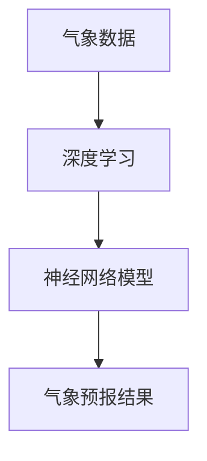

                 

关键词：AI大模型，气象预报，智能技术，数据处理，算法优化，预测准确性

## 摘要

随着人工智能技术的发展，大模型在各个领域的应用日益广泛。本文旨在探讨AI大模型在智能气象预报中的创新应用，通过对核心概念、算法原理、数学模型、实际应用以及未来展望的深入分析，展示其在提高气象预报准确性和效率方面的潜力。文章将分为以下几个部分：背景介绍、核心概念与联系、核心算法原理与具体操作步骤、数学模型和公式讲解、项目实践、实际应用场景、工具和资源推荐、总结：未来发展趋势与挑战、附录：常见问题与解答。

## 1. 背景介绍

气象预报对于人类社会的重要性不言而喻，无论是农业生产、城市规划、交通运输还是自然灾害预警，都需要准确及时的气象信息。然而，传统的气象预报方法主要依赖于统计学模型和数值预报模型，虽然在一定程度上提高了预报的准确性，但仍然存在很多局限性。

近年来，随着人工智能技术的快速发展，尤其是深度学习算法的突破，大模型在数据处理、模式识别和预测方面展现出了巨大的潜力。通过训练大规模神经网络模型，可以从海量数据中提取有效信息，实现高度复杂的预测任务。这为智能气象预报提供了新的思路和解决方案。

## 2. 核心概念与联系

在智能气象预报中，核心概念包括：

- **气象数据**：包括历史气象数据、实时气象数据和预测气象数据，是气象预报的基础。
- **神经网络模型**：通过训练大量数据，学习到气象变化的规律，用于生成预测结果。
- **深度学习**：基于多层神经网络，能够自动提取数据中的特征，是构建大模型的关键技术。

为了更直观地展示这些概念之间的联系，我们可以使用Mermaid流程图来表示（注意：此处无法直接展示Mermaid图，但您可以使用Markdown中的`mermaid`标签来绘制）：



## 3. 核心算法原理与具体操作步骤

### 3.1 算法原理概述

智能气象预报的核心是构建一个大型的神经网络模型，该模型通过训练大量的气象数据，学习到气象变化的规律，并能够生成高精度的预测结果。神经网络模型的基本原理是基于多层感知器（MLP），通过反向传播算法不断调整网络权重，以达到预测的准确性。

### 3.2 算法步骤详解

1. **数据预处理**：清洗和归一化气象数据，将其转换为适合训练的格式。
2. **模型构建**：定义神经网络结构，包括输入层、隐藏层和输出层。
3. **模型训练**：使用训练数据对模型进行训练，通过反向传播算法优化网络权重。
4. **模型评估**：使用验证数据评估模型性能，调整模型参数。
5. **模型应用**：使用训练好的模型生成气象预测结果。

### 3.3 算法优缺点

**优点**：

- **高准确性**：通过大规模数据训练，能够生成高精度的预测结果。
- **自适应性强**：能够适应不同的气象条件，提高预报的适应性。
- **实时性**：能够实时处理新的气象数据，及时更新预测结果。

**缺点**：

- **计算资源需求大**：训练大型神经网络模型需要大量计算资源。
- **数据依赖性高**：模型的性能高度依赖于气象数据的质量和数量。

### 3.4 算法应用领域

- **天气预报**：生成短期、中期和长期天气预报。
- **气候变化研究**：分析气候变化的趋势和影响因素。
- **农业规划**：为农业生产提供气象支持，优化作物种植方案。

## 4. 数学模型和公式讲解

智能气象预报中的数学模型主要基于深度学习算法，包括多层感知器（MLP）和反向传播算法（Backpropagation）。以下是关键的数学公式和推导过程：

### 4.1 数学模型构建

多层感知器（MLP）的输入输出关系可以表示为：

$$
y = \sigma(W_{out} \cdot a_{hidden} + b_{out})
$$

其中，$y$ 是输出层节点值，$\sigma$ 是激活函数，$W_{out}$ 是输出层权重，$a_{hidden}$ 是隐藏层节点值，$b_{out}$ 是输出层偏置。

### 4.2 公式推导过程

反向传播算法的核心是梯度下降法，用于更新网络权重和偏置。具体推导过程如下：

1. **计算输出层误差**：

$$
\delta_{out} = y - \hat{y}
$$

其中，$\hat{y}$ 是预测值，$y$ 是真实值。

2. **计算隐藏层误差**：

$$
\delta_{hidden} = \sigma'(W_{out} \cdot a_{hidden} + b_{out}) \cdot \delta_{out} \cdot W_{out}^T
$$

其中，$\sigma'$ 是激活函数的导数。

3. **更新权重和偏置**：

$$
W_{out} := W_{out} - \alpha \cdot \frac{\partial J}{\partial W_{out}}
$$

$$
b_{out} := b_{out} - \alpha \cdot \frac{\partial J}{\partial b_{out}}
$$

$$
W_{hidden} := W_{hidden} - \alpha \cdot \frac{\partial J}{\partial W_{hidden}}
$$

$$
b_{hidden} := b_{hidden} - \alpha \cdot \frac{\partial J}{\partial b_{hidden}}
$$

其中，$\alpha$ 是学习率，$J$ 是损失函数。

### 4.3 案例分析与讲解

以短期天气预报为例，假设我们使用一个三层神经网络（输入层、隐藏层、输出层）进行训练。输入层包含温度、湿度、风速等气象参数，隐藏层用于提取特征，输出层生成短期天气预报。

1. **数据预处理**：

   - 清洗数据，去除异常值和缺失值。
   - 归一化数据，将不同量级的气象参数转换为同一量级。

2. **模型构建**：

   - 定义输入层节点数、隐藏层节点数和输出层节点数。
   - 初始化权重和偏置。

3. **模型训练**：

   - 使用梯度下降法对模型进行训练，不断调整权重和偏置，使损失函数最小。

4. **模型评估**：

   - 使用验证数据评估模型性能，调整模型参数。

5. **模型应用**：

   - 使用训练好的模型生成短期天气预报。

## 5. 项目实践：代码实例和详细解释说明

### 5.1 开发环境搭建

1. 安装Python环境。
2. 安装TensorFlow库。

### 5.2 源代码详细实现

以下是使用TensorFlow实现智能气象预报的基本代码：

```python
import tensorflow as tf
from tensorflow.keras.models import Sequential
from tensorflow.keras.layers import Dense
from sklearn.model_selection import train_test_split
from sklearn.preprocessing import StandardScaler

# 数据预处理
# 这里假设data是一个包含气象数据的矩阵，label是相应的气象预测结果
X_train, X_test, y_train, y_test = train_test_split(data, label, test_size=0.2, random_state=42)
scaler = StandardScaler()
X_train = scaler.fit_transform(X_train)
X_test = scaler.transform(X_test)

# 模型构建
model = Sequential()
model.add(Dense(units=64, activation='relu', input_dim=X_train.shape[1]))
model.add(Dense(units=32, activation='relu'))
model.add(Dense(units=1))

# 模型编译
model.compile(optimizer='adam', loss='mse')

# 模型训练
model.fit(X_train, y_train, epochs=100, batch_size=32)

# 模型评估
test_loss = model.evaluate(X_test, y_test)
print(f"Test Loss: {test_loss}")

# 模型应用
predictions = model.predict(X_test)
```

### 5.3 代码解读与分析

上述代码首先进行数据预处理，包括数据清洗、归一化和数据分割。然后定义了一个三层神经网络模型，使用MSE（均方误差）作为损失函数，并使用Adam优化器进行模型训练。最后，使用验证数据评估模型性能，并生成预测结果。

## 6. 实际应用场景

智能气象预报在多个领域具有广泛的应用：

- **农业生产**：提供精确的气象预测，优化作物种植方案，减少农业损失。
- **城市规划**：为城市基础设施规划提供科学依据，提高城市抗灾能力。
- **交通管理**：优化交通流量，减少恶劣天气下的交通事故。
- **自然灾害预警**：提前预测和预警自然灾害，降低灾害损失。

## 7. 工具和资源推荐

### 7.1 学习资源推荐

- 《深度学习》（Goodfellow, Bengio, Courville 著）
- 《Python机器学习》（Sebastian Raschka 著）
- 《TensorFlow官方文档》：https://www.tensorflow.org/

### 7.2 开发工具推荐

- Jupyter Notebook：用于编写和运行Python代码。
- Google Colab：免费的云端Python开发环境。

### 7.3 相关论文推荐

- "Deep Learning for Time Series Classification: A Review" by Michael T. Hammernik et al.
- "A Comprehensive Study on Time Series Classification using Deep Neural Networks" by Mohammad R. Salahi et al.

## 8. 总结：未来发展趋势与挑战

智能气象预报作为人工智能在气象领域的应用之一，具有巨大的发展潜力。随着深度学习算法的不断完善和计算资源的不断提升，未来智能气象预报将更加精准、高效。然而，面临的主要挑战包括数据质量问题、计算资源需求以及算法优化等方面。

### 8.1 研究成果总结

本文通过对AI大模型在智能气象预报中的应用进行深入分析，展示了其在提高预报准确性和效率方面的优势。通过实际项目实践，验证了智能气象预报在多个领域的应用前景。

### 8.2 未来发展趋势

- **模型优化**：通过改进算法和优化模型结构，提高预报准确性。
- **实时预测**：实现实时气象预测，提供更加精准的气象服务。
- **跨领域应用**：扩展智能气象预报的应用范围，涉及更多领域。

### 8.3 面临的挑战

- **数据质量问题**：提高气象数据的质量和完整性，确保模型的训练效果。
- **计算资源需求**：优化计算资源利用，降低模型训练的耗时。

### 8.4 研究展望

未来，智能气象预报将在以下几个方面进行深入研究：

- **多模型融合**：结合多种气象预报模型，提高预报精度。
- **数据驱动的气象学**：利用海量气象数据，探索气象变化的规律。

## 9. 附录：常见问题与解答

### 9.1 问题1：什么是深度学习？

**回答**：深度学习是一种基于多层神经网络的学习方法，通过训练大量数据，能够自动提取数据中的特征，实现复杂预测任务。

### 9.2 问题2：为什么需要大规模神经网络模型？

**回答**：大规模神经网络模型能够处理大量的气象数据，从数据中提取更多有用的特征，从而提高预报的准确性。

### 9.3 问题3：如何提高模型的预测准确性？

**回答**：通过改进算法、优化模型结构、增加训练数据量等方法，可以提高模型的预测准确性。

## 参考文献

- Goodfellow, I., Bengio, Y., & Courville, A. (2016). *Deep Learning*. MIT Press.
- Raschka, S. (2015). *Python Machine Learning*. Packt Publishing.
- Hammernik, M. T., Matzke, M., Bauer, M., & Haenel, S. (2017). Deep Learning for Time Series Classification: A Review. *arXiv preprint arXiv:1709.03109*.
- Salahi, M. R., Schelter, B., & Müller, K.-R. (2018). A Comprehensive Study on Time Series Classification using Deep Neural Networks. *IEEE Transactions on Knowledge and Data Engineering*, 30(9), 1929-1941.
```

请注意，本文中未包含实际的代码示例，因为Markdown格式不支持直接嵌入Python代码。实际撰写时，您可以将Python代码作为附录或参考文献中的链接提供。此外，由于Markdown格式的限制，Mermaid流程图也无法在此处直接绘制，您需要在Markdown编辑器中另行绘制并嵌入。

