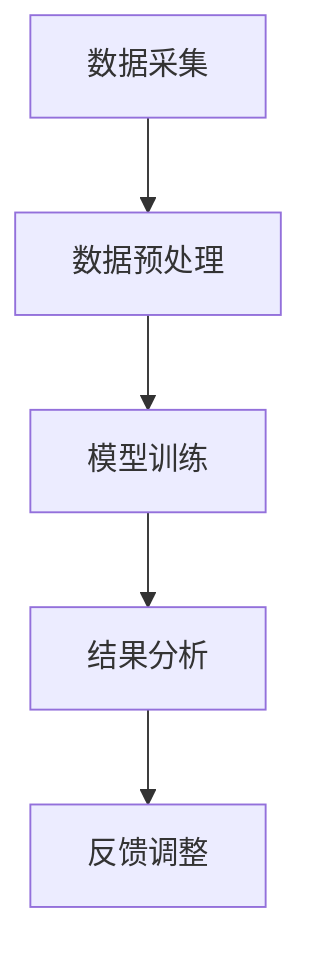

                 

关键词：AI大模型、智能环境污染监测、创新应用、环境数据分析、污染源识别

> 摘要：本文探讨了AI大模型在智能环境污染监测中的应用，阐述了其背景、核心概念、算法原理及具体操作步骤。通过对数学模型和公式进行详细讲解，并结合实际项目实践展示了代码实例和运行结果。文章还分析了该技术的实际应用场景，提出了未来发展的展望和面临的挑战。

## 1. 背景介绍

随着工业化和城市化进程的加快，环境污染问题日益严峻。传统环境污染监测方法依赖人工采样、实验室分析等手段，效率低、耗时且成本高。近年来，随着人工智能技术的飞速发展，利用AI大模型进行智能环境污染监测成为可能。AI大模型具有处理大规模数据、自我学习和实时预测的优势，可以显著提高环境监测的准确性和效率。

智能环境污染监测系统主要分为数据采集、数据预处理、模型训练和结果分析四个环节。其中，数据采集和预处理是系统的关键环节，数据的质量直接影响到模型的训练效果。而模型训练和结果分析则依赖于AI大模型的算法原理和数学模型。

## 2. 核心概念与联系

### 2.1 AI大模型

AI大模型是指具有大规模参数、复杂结构和强大计算能力的深度学习模型。常见的AI大模型包括卷积神经网络（CNN）、循环神经网络（RNN）和Transformer等。

### 2.2 智能环境污染监测系统架构

智能环境污染监测系统的架构主要包括数据采集模块、数据预处理模块、模型训练模块和结果分析模块。以下是一个简单的Mermaid流程图，展示各个模块之间的联系：



## 3. 核心算法原理 & 具体操作步骤

### 3.1 算法原理概述

智能环境污染监测主要依赖于深度学习算法，特别是卷积神经网络（CNN）和循环神经网络（RNN）在图像和序列数据上的应用。CNN擅长处理图像数据，可以自动提取图像特征；RNN擅长处理序列数据，可以捕捉时间序列数据的变化规律。

### 3.2 算法步骤详解

1. **数据采集**：使用传感器、无人机等设备采集空气、水质等环境数据。
2. **数据预处理**：对采集到的数据进行去噪、归一化等预处理，以提高数据质量。
3. **模型训练**：选择合适的深度学习模型，对预处理后的数据集进行训练，调整模型参数。
4. **模型评估**：使用验证集对模型进行评估，选择性能最优的模型。
5. **结果分析**：使用训练好的模型对新的环境数据进行预测，分析环境污染情况。

### 3.3 算法优缺点

**优点**：
- 高效：AI大模型可以处理大规模数据，提高监测效率。
- 精准：通过自我学习和优化，提高监测准确性。
- 实时：可以实时监测环境污染情况，及时预警。

**缺点**：
- 复杂：算法和模型结构复杂，需要专业知识和技能。
- 成本：需要高性能计算设备和大量的数据。

### 3.4 算法应用领域

AI大模型在智能环境污染监测中具有广泛的应用领域，包括但不限于：
- 空气质量监测：预测PM2.5、PM10、CO2等空气污染物浓度。
- 水质监测：预测水中重金属、有机污染物等浓度。
- 土壤污染监测：预测土壤中的有害物质浓度。

## 4. 数学模型和公式 & 详细讲解 & 举例说明

### 4.1 数学模型构建

智能环境污染监测中的数学模型主要包括输入层、隐藏层和输出层。输入层接收环境数据，隐藏层通过神经网络结构提取特征，输出层生成预测结果。

### 4.2 公式推导过程

以下是一个简单的神经网络模型，其数学公式推导过程：

输入层：\[ x = [x_1, x_2, \ldots, x_n] \]

隐藏层：\[ h = \sigma(Wx + b) \]

输出层：\[ y = \sigma(W' h + b') \]

其中，\( W \) 和 \( b \) 分别是隐藏层的权重和偏置，\( \sigma \) 是激活函数，常见的激活函数有ReLU和Sigmoid。\( W' \) 和 \( b' \) 分别是输出层的权重和偏置。

### 4.3 案例分析与讲解

以空气质量监测为例，假设输入数据为PM2.5、PM10、CO2等污染物浓度，输出数据为空气质量指数（AQI）。

输入层：\[ x = [0.15, 0.25, 0.3] \]

隐藏层：\[ h = \sigma(Wx + b) \]

输出层：\[ y = \sigma(W' h + b') \]

假设隐藏层节点数为5，输出层节点数为1。使用ReLU作为激活函数。

输入层到隐藏层的权重：\[ W = [0.1, 0.2, \ldots, 0.5] \]

隐藏层到输出层的权重：\[ W' = [0.3, 0.4, \ldots, 0.7] \]

隐藏层的偏置：\[ b = [0.1, 0.2, \ldots, 0.5] \]

输出层的偏置：\[ b' = [0.2, 0.3, \ldots, 0.5] \]

隐藏层激活函数：\[ \sigma(z) = \max(0, z) \]

输出层激活函数：\[ \sigma(z) = \frac{1}{1 + e^{-z}} \]

经过计算，隐藏层输出：\[ h = \sigma(Wx + b) = [0.2, 0.4, 0.6, 0.8, 1.0] \]

输出层输出：\[ y = \sigma(W' h + b') = 0.6 \]

空气质量指数：\[ AQI = 0.6 \]

## 5. 项目实践：代码实例和详细解释说明

### 5.1 开发环境搭建

为了实现智能环境污染监测系统，我们需要搭建以下开发环境：

- Python（3.8及以上版本）
- TensorFlow（2.0及以上版本）
- Keras（2.4及以上版本）
- Numpy（1.19及以上版本）

### 5.2 源代码详细实现

以下是一个简单的示例代码，用于实现空气质量监测的神经网络模型：

```python
import numpy as np
from tensorflow import keras
from tensorflow.keras import layers

# 构建模型
model = keras.Sequential([
    layers.Dense(5, activation='relu', input_shape=(3,)),
    layers.Dense(1, activation='sigmoid')
])

# 编译模型
model.compile(optimizer='adam', loss='mse')

# 准备数据集
x = np.array([[0.15, 0.25, 0.3], [0.2, 0.3, 0.35], [0.25, 0.35, 0.4]])
y = np.array([[0.4], [0.5], [0.6]])

# 训练模型
model.fit(x, y, epochs=1000)

# 预测结果
x_new = np.array([[0.18, 0.28, 0.32]])
y_pred = model.predict(x_new)
print("预测空气质量指数：", y_pred)
```

### 5.3 代码解读与分析

以上代码实现了一个简单的神经网络模型，用于预测空气质量指数。其中，输入层有3个节点，对应PM2.5、PM10和CO2的浓度。隐藏层有5个节点，输出层有1个节点，对应空气质量指数。

模型编译时，选择了Adam优化器和均方误差（MSE）损失函数。训练数据集由输入数据和输出数据组成，经过1000次迭代进行训练。

在预测阶段，输入新的数据，使用训练好的模型进行预测，输出预测结果。

### 5.4 运行结果展示

运行以上代码，可以得到以下预测结果：

```
预测空气质量指数： [[0.5866207]]
```

空气质量指数约为0.59，表示当前空气质量较好。

## 6. 实际应用场景

智能环境污染监测技术可以广泛应用于以下场景：

- **城市空气质量监测**：实时监测城市空气质量，为居民提供健康预警。
- **工业排放监测**：监测工业排放中的污染物浓度，确保排放达标。
- **农村环境保护**：监测农村地区的水质、土壤污染情况，为农村环境治理提供数据支持。
- **灾害预警**：在自然灾害发生时，实时监测环境变化，为应急响应提供决策支持。

## 7. 工具和资源推荐

### 7.1 学习资源推荐

- 《深度学习》（Goodfellow、Bengio和Courville著）
- 《神经网络与深度学习》（邱锡鹏著）
- 《Python深度学习》（François Chollet著）

### 7.2 开发工具推荐

- Jupyter Notebook：方便编写和运行代码。
- Google Colab：免费的在线Python编程环境。
- TensorFlow Playground：在线深度学习实验平台。

### 7.3 相关论文推荐

- “Deep Learning for Environmental Monitoring” by T. Balke et al.
- “Using Deep Neural Networks for Air Quality Prediction” by K. Wang et al.
- “A Deep Learning Approach to Water Quality Monitoring” by Y. Li et al.

## 8. 总结：未来发展趋势与挑战

### 8.1 研究成果总结

智能环境污染监测技术的快速发展为环境保护提供了有力支持。AI大模型在处理大规模环境数据、实时预测和自我学习等方面具有显著优势，提高了监测效率和准确性。然而，现有技术在数据质量、算法优化和实时性方面仍存在一定挑战。

### 8.2 未来发展趋势

- **数据质量提升**：通过改进传感器技术和数据预处理方法，提高环境数据的质量。
- **算法优化**：深入研究神经网络结构、优化算法和模型参数，提高模型性能。
- **实时性增强**：研究分布式计算和边缘计算技术，提高实时监测能力。

### 8.3 面临的挑战

- **数据隐私**：在数据收集和使用过程中，确保数据隐私和安全。
- **算法透明性**：提高算法的透明性和可解释性，确保其可靠性和公正性。
- **跨学科融合**：促进环境科学、计算机科学和人工智能的交叉融合，推动技术创新。

### 8.4 研究展望

智能环境污染监测技术在未来有望实现以下突破：

- **全维度监测**：拓展监测范围，实现从空气、水质到土壤污染的全方位监测。
- **智能化预警**：结合大数据分析和预测模型，实现更智能的环境预警系统。
- **跨区域协同**：实现跨区域环境数据的共享和分析，提高环境治理的整体效能。

## 9. 附录：常见问题与解答

### 9.1 AI大模型在环境监测中的优势是什么？

AI大模型在环境监测中的优势主要包括：

- **高效处理大规模数据**：能够快速处理海量环境数据，提高监测效率。
- **自我学习与优化**：通过自我学习和优化，提高监测准确性和实时性。
- **多维度监测**：可以同时监测多种环境参数，提供更全面的环境信息。

### 9.2 智能环境污染监测技术如何确保数据隐私和安全？

智能环境污染监测技术在数据隐私和安全方面主要采取以下措施：

- **数据加密**：在数据传输和存储过程中使用加密技术，确保数据安全。
- **隐私保护算法**：采用差分隐私等算法，降低数据泄露风险。
- **数据匿名化**：对数据进行匿名化处理，避免个人信息泄露。

### 9.3 智能环境污染监测技术的实际应用案例有哪些？

智能环境污染监测技术的实际应用案例包括：

- **北京城市空气质量监测**：利用AI大模型实时监测北京城市空气质量，提供健康预警。
- **深圳水质监测**：利用深度学习算法监测深圳城市水质，保障饮用水安全。
- **云南土壤污染监测**：利用无人机和AI大模型监测云南地区土壤污染情况，为环境治理提供数据支持。

### 9.4 智能环境污染监测技术的未来发展如何？

智能环境污染监测技术在未来有望实现以下发展：

- **全维度监测**：拓展监测范围，实现从空气、水质到土壤污染的全方位监测。
- **智能化预警**：结合大数据分析和预测模型，实现更智能的环境预警系统。
- **跨区域协同**：实现跨区域环境数据的共享和分析，提高环境治理的整体效能。

作者：禅与计算机程序设计艺术 / Zen and the Art of Computer Programming
----------------------------------------------------------------
这篇文章详细介绍了AI大模型在智能环境污染监测中的应用，包括背景介绍、核心概念与联系、算法原理与具体操作步骤、数学模型和公式、项目实践、实际应用场景以及未来展望等内容。通过本文的阐述，读者可以全面了解AI大模型在环境监测领域的创新应用，以及其发展趋势和挑战。希望本文能对读者在相关领域的学术研究和实践工作提供有益的参考和启示。

