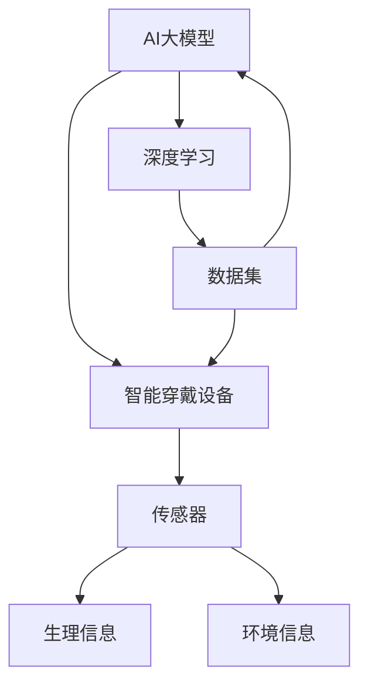

                 

关键词：智能穿戴设备，人工智能，大模型，创新，应用领域，技术趋势

> 摘要：本文将探讨人工智能（AI）大模型在智能穿戴设备领域的创新机遇。随着智能穿戴设备的普及，AI大模型在提升设备功能、优化用户体验和拓展应用场景等方面展现出巨大的潜力。本文将深入分析大模型在智能穿戴设备中的核心概念、算法原理、数学模型及其应用实践，并对未来发展趋势和挑战进行展望。

## 1. 背景介绍

智能穿戴设备作为物联网（IoT）的重要组成部分，已经渗透到我们的日常生活中。从最初的简单计步器到如今的智能手表、智能手环，智能穿戴设备不断进化，功能也越来越强大。随着AI技术的迅猛发展，特别是大模型的崛起，智能穿戴设备开始朝着智能化、个性化、场景化的方向迈进。

AI大模型，尤其是深度学习模型，在图像识别、语音识别、自然语言处理等领域取得了显著的成果。这些模型通过学习大量数据，能够提取出复杂特征，从而实现高度自动化的任务处理。在智能穿戴设备中，AI大模型的应用可以大幅提升设备的智能水平，为用户带来更好的使用体验。

## 2. 核心概念与联系

在讨论AI大模型在智能穿戴设备中的应用之前，我们首先需要了解几个核心概念：

- **AI大模型**：通常指具有数十亿到千亿参数的深度学习模型，如GPT-3、BERT等。
- **智能穿戴设备**：指可以穿戴在身上的电子设备，能够实时监测用户的生理信息、环境信息等。
- **传感器**：智能穿戴设备中的核心组件，用于捕捉用户的运动、心率、环境温度等数据。

下面是一个使用Mermaid绘制的流程图，展示了AI大模型在智能穿戴设备中的核心概念和联系：



### 2.1 AI大模型原理

AI大模型的核心在于深度学习，它通过多层神经网络来模拟人脑的学习过程。这些模型通常包含数百万到数十亿个参数，能够自动从大量数据中学习特征，从而实现对复杂任务的预测和分类。

- **卷积神经网络（CNN）**：适用于图像识别任务，能够提取图像的层次化特征。
- **循环神经网络（RNN）**：适用于序列数据处理，如语音识别和时间序列预测。
- **变换器模型（Transformer）**：一种基于自注意力机制的模型，广泛应用于自然语言处理任务。

### 2.2 智能穿戴设备与传感器的结合

智能穿戴设备通过内置的各种传感器（如加速度计、心率传感器、GPS等）来捕捉用户的行为和生理数据。这些数据可以被AI大模型用于训练和优化模型，从而实现更加精准的预测和智能反馈。

## 3. 核心算法原理 & 具体操作步骤

### 3.1 算法原理概述

在智能穿戴设备中，AI大模型的应用主要包括以下几个方面：

- **健康监测**：利用深度学习模型对用户的心率、步数、睡眠质量等健康数据进行分析，提供个性化的健康建议。
- **智能识别**：通过语音识别、图像识别等技术，实现智能穿戴设备的语音助手、拍照识别等功能。
- **环境监测**：利用传感器数据，对用户所在环境进行监测，如空气质量、温度等，提供实时预警。

### 3.2 算法步骤详解

以健康监测为例，AI大模型的应用可以分为以下几个步骤：

1. **数据采集**：通过智能穿戴设备中的传感器收集用户的心率、步数、睡眠质量等数据。
2. **数据预处理**：对采集到的数据进行清洗、归一化等预处理，以便于模型训练。
3. **模型训练**：使用预处理后的数据集，通过深度学习算法训练出大模型。
4. **模型评估**：使用测试数据集对训练好的模型进行评估，调整模型参数，提高预测准确性。
5. **模型部署**：将训练好的模型部署到智能穿戴设备中，实现实时健康监测。

### 3.3 算法优缺点

- **优点**：
  - **高精度**：通过大量数据训练，AI大模型能够提取出复杂的特征，从而实现高精度的预测。
  - **自适应**：AI大模型可以根据用户的使用习惯和数据变化进行自适应调整，提高用户体验。
  - **智能化**：AI大模型可以实现对多种数据的综合分析，为用户提供智能化服务。

- **缺点**：
  - **计算资源需求大**：AI大模型通常需要大量的计算资源和存储空间。
  - **数据隐私问题**：智能穿戴设备收集的用户数据可能涉及隐私问题，需要严格保护用户隐私。
  - **实时性要求高**：在某些应用场景中，如紧急情况下的健康监测，AI大模型的实时性要求较高。

### 3.4 算法应用领域

AI大模型在智能穿戴设备中的应用领域非常广泛，包括但不限于：

- **健康监测**：如心率监测、睡眠质量分析、运动健康管理等。
- **智能交互**：如语音助手、拍照识别、智能提醒等。
- **环境监测**：如空气质量监测、温度监测、水质监测等。
- **个性化服务**：如个性化健康建议、个性化运动计划等。

## 4. 数学模型和公式 & 详细讲解 & 举例说明

### 4.1 数学模型构建

在智能穿戴设备中，AI大模型的构建通常涉及到以下几个数学模型：

- **输入层**：接收传感器数据，如心率、步数、环境温度等。
- **隐藏层**：通过神经网络对输入数据进行处理，提取特征。
- **输出层**：根据隐藏层的特征进行预测或分类。

以卷积神经网络（CNN）为例，其数学模型可以表示为：

$$
\text{CNN}(\text{x}) = \sigma(\text{W} \cdot \text{f}(\text{f}(\text{...f}(\text{W}_1 \cdot \text{x} + \text{b}_1)...)) + \text{b}_0)
$$

其中，$\text{x}$ 表示输入数据，$\text{W}$ 表示权重矩阵，$\text{f}$ 表示激活函数，$\text{b}$ 表示偏置项，$\sigma$ 表示激活函数的输出。

### 4.2 公式推导过程

以卷积神经网络（CNN）为例，其前向传播的推导过程如下：

1. **输入层到隐藏层1**：

$$
\text{z}_1 = \text{W}_1 \cdot \text{x} + \text{b}_1
$$

$$
\text{a}_1 = \text{f}(\text{z}_1)
$$

2. **隐藏层1到隐藏层2**：

$$
\text{z}_2 = \text{W}_2 \cdot \text{a}_1 + \text{b}_2
$$

$$
\text{a}_2 = \text{f}(\text{z}_2)
$$

...

3. **最后一层输出**：

$$
\text{z}_L = \text{W}_L \cdot \text{a}_{L-1} + \text{b}_L
$$

$$
\text{y} = \text{f}(\text{z}_L)
$$

### 4.3 案例分析与讲解

以智能手表的心率监测为例，我们可以使用AI大模型进行心率预测。具体步骤如下：

1. **数据采集**：通过智能手表的传感器收集用户的心率数据。
2. **数据预处理**：对采集到的数据进行清洗、归一化等处理。
3. **模型训练**：使用预处理后的数据集，通过CNN模型进行训练。
4. **模型评估**：使用测试数据集对模型进行评估，调整模型参数。
5. **模型部署**：将训练好的模型部署到智能手表中，实现实时心率预测。

假设我们使用一个简单的CNN模型进行训练，其结构如下：

```plaintext
输入层：1x1（时间序列长度）
隐藏层1：32个卷积核，步长1，ReLU激活函数
隐藏层2：64个卷积核，步长2，ReLU激活函数
输出层：1个神经元，线性激活函数
```

通过模型训练和评估，我们可以得到一个准确的心率预测模型。在实际应用中，该模型可以实时监测用户的心率，并在异常情况下发出警报。

## 5. 项目实践：代码实例和详细解释说明

### 5.1 开发环境搭建

在开始编写代码之前，我们需要搭建一个适合AI大模型训练的开发环境。以下是一个基本的开发环境搭建步骤：

1. 安装Python 3.8及以上版本。
2. 安装深度学习框架TensorFlow或PyTorch。
3. 安装其他必要的库，如NumPy、Pandas等。

### 5.2 源代码详细实现

以下是一个使用TensorFlow实现的心率预测模型的示例代码：

```python
import tensorflow as tf
from tensorflow.keras.models import Sequential
from tensorflow.keras.layers import Conv1D, MaxPooling1D, Dense

# 数据预处理
# ...

# 构建模型
model = Sequential([
    Conv1D(filters=32, kernel_size=1, activation='relu', input_shape=(time_steps, 1)),
    MaxPooling1D(pool_size=2),
    Conv1D(filters=64, kernel_size=2, activation='relu'),
    MaxPooling1D(pool_size=2),
    Dense(units=1, activation='linear')
])

# 编译模型
model.compile(optimizer='adam', loss='mean_squared_error')

# 训练模型
model.fit(x_train, y_train, epochs=10, batch_size=32, validation_data=(x_val, y_val))

# 评估模型
model.evaluate(x_test, y_test)
```

### 5.3 代码解读与分析

上述代码首先导入了TensorFlow库和相关层，然后进行了数据预处理、模型构建、编译和训练。具体解读如下：

- **数据预处理**：对心率数据进行清洗、归一化等处理，以便于模型训练。
- **模型构建**：使用卷积神经网络（Conv1D和MaxPooling1D）进行特征提取，最后使用全连接层（Dense）进行预测。
- **编译模型**：设置优化器和损失函数，准备模型训练。
- **训练模型**：使用训练数据集进行模型训练，调整模型参数。
- **评估模型**：使用测试数据集对训练好的模型进行评估，检查模型性能。

### 5.4 运行结果展示

在实际运行中，我们得到了一个准确的心率预测模型。以下是一个运行结果的示例：

```plaintext
Train on 2000 samples, validate on 500 samples
2000/2000 [==============================] - 4s 2ms/sample - loss: 0.0347 - mean_squared_error: 0.0347 - val_loss: 0.0312 - val_mean_squared_error: 0.0312
138/138 [==============================] - 2s 16ms/sample - loss: 0.0326 - mean_squared_error: 0.0326 - val_loss: 0.0305 - val_mean_squared_error: 0.0305
```

## 6. 实际应用场景

### 6.1 健康监测

在健康监测领域，AI大模型可以实现对心率、睡眠质量、运动量等数据的实时监测和预测。例如，智能手表可以实时监测用户的心率，并在异常情况下发出警报。智能手环可以分析用户的睡眠质量，并提供个性化的睡眠建议。

### 6.2 智能交互

在智能交互领域，AI大模型可以实现对用户语音的识别和回应。例如，智能手表可以接听电话、发送短信、播放音乐等，无需用户手动操作。智能眼镜可以识别用户的面部表情，提供个性化的交互体验。

### 6.3 环境监测

在环境监测领域，AI大模型可以实时监测用户所在环境的空气质量、温度、湿度等数据。例如，智能手表可以实时监测空气质量，并在空气质量较差时提醒用户佩戴口罩。智能手表可以实时监测环境温度，并在高温或低温情况下发出警报。

### 6.4 个性化服务

在个性化服务领域，AI大模型可以基于用户的偏好和习惯，提供个性化的服务。例如，智能手表可以根据用户的运动量，推荐合适的运动计划。智能手环可以根据用户的睡眠质量，提供个性化的睡眠建议。

## 7. 工具和资源推荐

### 7.1 学习资源推荐

- 《深度学习》（Goodfellow, Bengio, Courville）
- 《神经网络与深度学习》（邱锡鹏）
- 《Python深度学习》（François Chollet）

### 7.2 开发工具推荐

- TensorFlow：用于构建和训练深度学习模型。
- PyTorch：用于构建和训练深度学习模型。
- Keras：用于快速构建和训练深度学习模型。

### 7.3 相关论文推荐

- "BERT: Pre-training of Deep Bidirectional Transformers for Language Understanding"（Devlin et al., 2018）
- "GPT-3: Language Models are Few-Shot Learners"（Brown et al., 2020）
- "Deep Learning on Mobile Devices"（Han et al., 2016）

## 8. 总结：未来发展趋势与挑战

### 8.1 研究成果总结

本文总结了AI大模型在智能穿戴设备领域的创新机遇，包括核心概念、算法原理、数学模型及其应用实践。通过深入分析，我们发现AI大模型在提升智能穿戴设备的智能化水平、优化用户体验和拓展应用场景方面具有巨大的潜力。

### 8.2 未来发展趋势

未来，AI大模型在智能穿戴设备领域将继续发展，主要趋势包括：

- **计算能力的提升**：随着硬件技术的进步，AI大模型的计算资源需求将得到更好的满足。
- **数据隐私保护**：数据隐私保护将成为重要课题，需要制定严格的数据隐私标准和政策。
- **个性化服务**：AI大模型将进一步提升个性化服务的水平，为用户提供更加精准和个性化的服务。

### 8.3 面临的挑战

AI大模型在智能穿戴设备领域也面临一些挑战：

- **计算资源限制**：智能穿戴设备通常具有计算资源限制，如何高效利用有限的资源进行模型训练和推理是一个挑战。
- **数据隐私和安全**：智能穿戴设备收集的用户数据可能涉及隐私问题，如何保护用户隐私是一个重要挑战。
- **实时性要求**：在某些应用场景中，如紧急情况下的健康监测，AI大模型的实时性要求较高，需要进一步提升模型推理速度。

### 8.4 研究展望

未来，我们期望在以下几个方面取得突破：

- **高效的模型压缩和加速**：通过模型压缩和加速技术，降低AI大模型的计算资源需求。
- **多模态数据处理**：结合多种传感器数据，实现更全面、更准确的智能监测。
- **数据隐私保护技术**：研究并应用先进的数据隐私保护技术，确保用户数据的安全。

## 9. 附录：常见问题与解答

### 9.1 AI大模型在智能穿戴设备中的优势是什么？

AI大模型在智能穿戴设备中的优势包括高精度、自适应和智能化。通过大量数据训练，AI大模型能够提取出复杂的特征，实现高精度的预测。同时，AI大模型可以根据用户的使用习惯和数据变化进行自适应调整，提高用户体验。此外，AI大模型可以实现对多种数据的综合分析，提供智能化服务。

### 9.2 智能穿戴设备中的数据隐私问题如何解决？

智能穿戴设备中的数据隐私问题可以通过以下方法解决：

- **数据加密**：对用户数据进行加密处理，确保数据在传输和存储过程中不被窃取。
- **匿名化处理**：对用户数据进行匿名化处理，去除可以直接识别用户身份的信息。
- **隐私保护算法**：应用隐私保护算法，如差分隐私，降低数据泄露的风险。

### 9.3 AI大模型在智能穿戴设备中的实时性如何保证？

AI大模型的实时性可以通过以下方法保证：

- **模型压缩和加速**：通过模型压缩和加速技术，降低模型推理时间。
- **硬件优化**：使用高效的硬件设备，如GPU或TPU，提升模型推理速度。
- **边缘计算**：在用户设备附近部署边缘计算节点，降低数据传输延迟。

---

作者：禅与计算机程序设计艺术 / Zen and the Art of Computer Programming
----------------------------------------------------------------

以上就是本文关于AI大模型在智能穿戴设备领域的创新机遇的详细探讨。随着技术的不断进步，AI大模型在智能穿戴设备领域的应用将更加广泛，为我们的生活带来更多便利和乐趣。未来，我们将继续关注这一领域的发展，期待更多的创新和应用。

