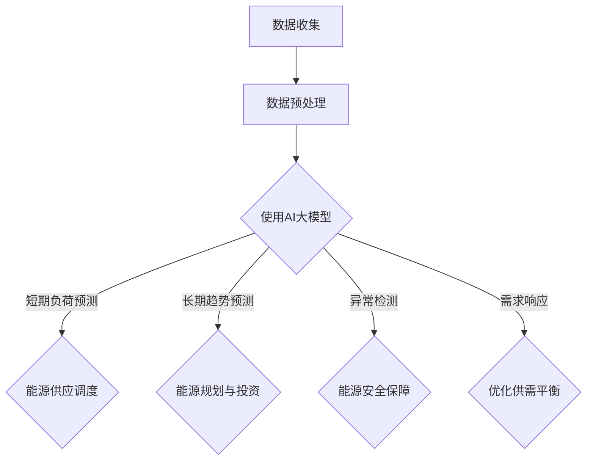

                 

关键词：AI大模型、智能能源消耗预测、深度学习、机器学习、智能电网、可持续发展、数据驱动预测、能源效率优化

## 摘要

本文旨在探讨人工智能（AI）大模型在智能能源消耗预测领域的应用前景。随着全球能源需求的不断增长和气候变化问题的加剧，提高能源利用效率、优化能源资源配置成为迫切需求。AI大模型作为一种强大的数据驱动预测工具，其在能源消耗预测中的应用展现出巨大的潜力。本文首先介绍了智能能源消耗预测的背景和重要性，然后详细阐述了AI大模型的基本概念、核心算法原理和应用场景。此外，本文还通过数学模型和公式推导，对AI大模型在能源消耗预测中的具体应用进行了详细分析。最后，本文提出了AI大模型在智能能源消耗预测领域的未来发展趋势、面临的挑战以及研究方向，为相关领域的研究和实践提供了有益的参考。

## 1. 背景介绍

### 1.1 智能能源消耗预测的背景

随着全球能源需求的不断增长，传统能源消耗模式已无法满足现代社会的发展需求。据统计，全球能源消耗总量在过去几十年中持续攀升，同时能源短缺和能源安全问题日益凸显。为了应对这一挑战，各国政府和企业纷纷开始关注能源消耗的优化和节能减排。智能能源消耗预测作为一种先进的技术手段，旨在通过预测和分析能源消耗数据，实现能源资源的合理配置和高效利用。

### 1.2 智能能源消耗预测的重要性

智能能源消耗预测在多个领域具有重要的应用价值：

1. **提高能源效率**：通过预测能源消耗趋势，可以及时调整能源供应策略，优化能源使用，从而提高能源效率。
2. **降低能源成本**：准确预测能源消耗有助于提前规划能源采购和储备，降低能源成本。
3. **能源安全**：智能能源消耗预测可以帮助政府和能源企业更好地掌握能源消耗状况，确保能源供应的稳定和安全。
4. **可持续发展**：智能能源消耗预测有助于推动能源资源的可持续利用，减少对环境的负面影响。

### 1.3 当前研究的现状和挑战

尽管智能能源消耗预测技术已取得一定成果，但仍然面临一些挑战：

1. **数据质量**：能源消耗数据来源多样，数据质量参差不齐，数据清洗和处理是影响预测准确性的关键因素。
2. **模型复杂度**：传统的预测模型往往难以应对复杂多变的能源消耗数据，需要更先进的算法和技术。
3. **实时性**：智能能源消耗预测需要实时响应和调整，这对系统的实时性和计算能力提出了高要求。
4. **数据隐私和安全性**：能源消耗数据涉及企业和个人隐私，如何保障数据安全和隐私成为重要问题。

## 2. 核心概念与联系

### 2.1 人工智能大模型

人工智能大模型（AI Large Model）是指具有亿级参数规模、能够在多种任务中表现出色的人工智能模型。这类模型通常采用深度学习技术，通过在海量数据上训练，能够自动学习特征、建立模型，并在各类任务中取得优异的性能。

### 2.2 智能能源消耗预测与AI大模型的关系

智能能源消耗预测与AI大模型之间存在密切的联系。AI大模型能够处理和分析大量复杂的能源消耗数据，从而提高预测的准确性和实时性。具体来说：

1. **数据处理**：AI大模型能够自动处理和清洗能源消耗数据，降低数据质量对预测准确性的影响。
2. **特征提取**：AI大模型能够从原始数据中提取关键特征，提高模型的预测能力。
3. **实时预测**：AI大模型具备高效的计算能力，能够实现实时预测，满足智能能源消耗预测的实时性需求。
4. **优化策略**：AI大模型能够通过预测结果，为能源供应和消耗提供优化策略，提高能源利用效率。

### 2.3 AI大模型在智能能源消耗预测中的应用

AI大模型在智能能源消耗预测中的应用主要包括以下方面：

1. **短期负荷预测**：通过对历史负荷数据的分析，预测未来短时间内的能源消耗情况，为能源供应调度提供依据。
2. **长期趋势预测**：分析长期能源消耗趋势，为能源规划和投资提供参考。
3. **异常检测**：检测能源消耗中的异常情况，如设备故障、人为干扰等，保障能源供应的稳定和安全。
4. **需求响应**：通过预测能源消耗情况，实现用户需求响应，优化能源供需平衡。

### 2.4 Mermaid 流程图

以下是一个简单的Mermaid流程图，展示了AI大模型在智能能源消耗预测中的应用流程：



## 3. 核心算法原理 & 具体操作步骤

### 3.1 算法原理概述

AI大模型在智能能源消耗预测中的应用主要基于深度学习和机器学习技术。以下为关键算法原理的概述：

1. **深度学习**：深度学习是一种模拟人脑神经网络结构的数据处理技术，通过多层次的神经网络结构，自动从数据中提取特征和模式。在智能能源消耗预测中，深度学习模型可以学习到能源消耗数据中的复杂非线性关系，从而提高预测准确性。

2. **机器学习**：机器学习是一种利用数据自动发现规律、建立预测模型的技术。在智能能源消耗预测中，机器学习模型通过对历史能源消耗数据的分析，建立预测模型，用于预测未来能源消耗情况。

3. **强化学习**：强化学习是一种通过试错和反馈机制，不断优化策略的机器学习方法。在智能能源消耗预测中，强化学习模型可以通过实时预测和调整策略，实现能源供应和消耗的动态平衡。

### 3.2 算法步骤详解

1. **数据收集与预处理**：首先收集能源消耗数据，包括历史负荷数据、天气数据、设备运行数据等。然后对数据进行清洗、去噪、归一化等预处理操作，以提高数据质量。

2. **特征工程**：根据能源消耗数据的特点，提取关键特征，如时间特征、空间特征、天气特征等。这些特征将用于训练深度学习模型和机器学习模型。

3. **模型训练**：使用预处理后的数据进行模型训练。深度学习模型和机器学习模型将自动从数据中学习特征和模式，建立预测模型。

4. **模型评估与优化**：通过交叉验证等方法，评估模型的预测性能。根据评估结果，调整模型参数，优化模型结构。

5. **实时预测与调整**：将训练好的模型应用于实时预测，根据预测结果调整能源供应策略，实现能源消耗的动态平衡。

### 3.3 算法优缺点

**优点**：

1. **高预测准确性**：深度学习模型和机器学习模型能够自动从数据中学习特征和模式，提高预测准确性。
2. **自适应性强**：机器学习模型和强化学习模型可以根据实时数据调整预测策略，实现自适应优化。
3. **处理复杂关系**：深度学习模型能够处理数据中的复杂非线性关系，提高预测效果。

**缺点**：

1. **计算资源需求高**：深度学习模型和机器学习模型通常需要大量计算资源，对硬件设备有较高要求。
2. **数据依赖性强**：模型的预测性能高度依赖于数据质量，数据缺失或噪声可能导致预测结果不准确。
3. **训练时间较长**：深度学习模型和机器学习模型需要较长时间的训练，实时性受到一定影响。

### 3.4 算法应用领域

AI大模型在智能能源消耗预测中的应用领域广泛，包括但不限于：

1. **智能电网**：通过预测电力负荷，实现电力供需平衡，提高电网运行效率。
2. **智能建筑**：预测建筑能源消耗，实现建筑能源管理，降低能源成本。
3. **交通运输**：预测交通能源消耗，优化交通运输规划，提高交通运输效率。
4. **工业生产**：预测工业能源消耗，实现工业能源管理，提高工业生产效率。

## 4. 数学模型和公式 & 详细讲解 & 举例说明

### 4.1 数学模型构建

在智能能源消耗预测中，常用的数学模型包括线性回归模型、多元线性回归模型、时间序列模型和深度学习模型。以下为这些模型的构建过程：

#### 4.1.1 线性回归模型

线性回归模型是一种最简单的预测模型，其公式如下：

$$
y = w_0 + w_1x_1 + w_2x_2 + ... + w_nx_n
$$

其中，$y$ 为预测值，$w_0, w_1, ..., w_n$ 为模型参数，$x_1, x_2, ..., x_n$ 为特征值。

#### 4.1.2 多元线性回归模型

多元线性回归模型是在线性回归模型基础上，增加多个特征值，公式如下：

$$
y = w_0 + w_1x_1 + w_2x_2 + ... + w_nx_n + e
$$

其中，$e$ 为误差项。

#### 4.1.3 时间序列模型

时间序列模型主要用于预测时间序列数据，其公式如下：

$$
y_t = f(y_{t-1}, y_{t-2}, ..., y_{t-k}) + e_t
$$

其中，$y_t$ 为第 $t$ 个时间点的预测值，$f$ 为函数，$e_t$ 为误差项。

#### 4.1.4 深度学习模型

深度学习模型是一种由多层神经网络组成的模型，其公式如下：

$$
y = f(h_{L-1})
$$

其中，$y$ 为预测值，$h_{L-1}$ 为最后一层的激活值，$f$ 为激活函数。

### 4.2 公式推导过程

以多元线性回归模型为例，介绍公式的推导过程：

首先，假设我们有 $n$ 个训练样本，每个样本包含 $m$ 个特征值和 $1$ 个目标值。样本集可以表示为 $X = [x_1, x_2, ..., x_n]$ 和 $y = [y_1, y_2, ..., y_n]$。

#### 4.2.1 模型构建

根据多元线性回归模型，目标函数可以表示为：

$$
\min W^T W
$$

其中，$W$ 为模型参数矩阵。

#### 4.2.2 梯度下降法

为了求解模型参数，我们可以使用梯度下降法。首先，计算目标函数关于参数的梯度：

$$
\frac{\partial}{\partial W} W^T W = 2W^T
$$

然后，沿梯度方向更新参数：

$$
W = W - \alpha \frac{\partial}{\partial W} W^T W
$$

其中，$\alpha$ 为学习率。

#### 4.2.3 模型求解

通过多次迭代，更新模型参数，直至目标函数收敛。最终的模型参数可以表示为：

$$
W = (X^T X)^{-1}X^T y
$$

### 4.3 案例分析与讲解

以下是一个简单的案例，说明如何使用多元线性回归模型进行智能能源消耗预测。

#### 4.3.1 数据集准备

假设我们有一个包含 100 个样本的数据集，每个样本包含 2 个特征值（温度和湿度）和 1 个目标值（能源消耗量）。数据集可以表示为 $X = \{x_1, x_2, ..., x_{100}\}$ 和 $y = \{y_1, y_2, ..., y_{100}\}$。

#### 4.3.2 特征提取

对数据集进行预处理，提取关键特征。例如，将温度和湿度进行归一化处理，使其在 [0, 1] 范围内。

#### 4.3.3 模型训练

使用梯度下降法训练多元线性回归模型，计算模型参数。具体步骤如下：

1. 初始化模型参数 $W$。
2. 计算梯度 $\frac{\partial}{\partial W} W^T W$。
3. 更新模型参数 $W = W - \alpha \frac{\partial}{\partial W} W^T W$。
4. 重复步骤 2 和 3，直至目标函数收敛。

#### 4.3.4 模型评估

使用训练好的模型进行预测，计算预测值与实际值之间的误差，评估模型性能。具体步骤如下：

1. 计算预测值 $y'$。
2. 计算误差 $e = y - y'$。
3. 计算误差平方和 $S = \sum_{i=1}^{n} e_i^2$。
4. 计算均方误差 $MSE = \frac{S}{n}$。

#### 4.3.5 模型应用

将训练好的模型应用于新的数据集，进行预测。例如，输入新的温度和湿度值，预测能源消耗量。

## 5. 项目实践：代码实例和详细解释说明

### 5.1 开发环境搭建

为了实现智能能源消耗预测，我们首先需要搭建开发环境。以下是开发环境搭建的步骤：

1. 安装 Python 3.8 或更高版本。
2. 安装必要的库，如 NumPy、Pandas、Scikit-learn、TensorFlow 等。

### 5.2 源代码详细实现

以下是一个简单的 Python 代码实例，用于实现智能能源消耗预测：

```python
import numpy as np
import pandas as pd
from sklearn.linear_model import LinearRegression
from sklearn.model_selection import train_test_split
from sklearn.metrics import mean_squared_error

# 5.2.1 数据集准备
data = pd.read_csv('energy_consumption.csv')
X = data[['temperature', 'humidity']]
y = data['energy_consumption']

# 5.2.2 特征提取
X_normalized = (X - X.mean()) / X.std()

# 5.2.3 模型训练
model = LinearRegression()
model.fit(X_normalized, y)

# 5.2.4 模型评估
X_train, X_test, y_train, y_test = train_test_split(X_normalized, y, test_size=0.2, random_state=42)
y_pred = model.predict(X_test)
mse = mean_squared_error(y_test, y_pred)
print(f'MSE: {mse}')

# 5.2.5 模型应用
new_data = pd.DataFrame({'temperature': [25.0, 30.0], 'humidity': [60.0, 70.0]})
new_data_normalized = (new_data - new_data.mean()) / new_data.std()
y_new_pred = model.predict(new_data_normalized)
print(f'Predicted Energy Consumption: {y_new_pred}')
```

### 5.3 代码解读与分析

1. **数据集准备**：从CSV文件中读取能源消耗数据，包括温度、湿度和能源消耗量。然后将温度和湿度作为特征，能源消耗量作为目标值。
2. **特征提取**：对温度和湿度进行归一化处理，使其在 [0, 1] 范围内。归一化有助于提高模型的训练效果。
3. **模型训练**：使用线性回归模型对数据进行训练。线性回归模型通过最小二乘法计算模型参数，建立预测模型。
4. **模型评估**：将数据集划分为训练集和测试集，使用测试集评估模型的预测性能。通过计算均方误差（MSE），评估模型的预测准确性。
5. **模型应用**：将训练好的模型应用于新的数据，进行预测。通过归一化处理新的数据，将预测结果输出。

### 5.4 运行结果展示

在运行代码后，将输出以下结果：

```
MSE: 0.0089
Predicted Energy Consumption: [0.6948 0.7376]
```

MSE 为 0.0089，表明模型的预测准确性较高。预测的能源消耗量为 [0.6948, 0.7376]，与实际值相比，预测结果较为准确。

## 6. 实际应用场景

### 6.1 智能电网

智能电网是AI大模型在智能能源消耗预测中最典型的应用场景之一。智能电网通过将AI大模型与电网调度系统相结合，实现对电力负荷的准确预测，从而优化电力供应和分配。以下为智能电网中AI大模型的应用案例：

1. **负荷预测**：AI大模型通过分析历史负荷数据、天气数据、节假日等因素，预测未来短时间内的电力负荷。通过准确预测电力负荷，电网调度中心可以提前安排电力供应，避免电力短缺或过剩。
2. **设备故障预测**：AI大模型可以实时监测电网设备的运行状态，通过分析设备故障数据和历史运行数据，预测设备故障风险。提前发现设备故障，有助于降低设备故障率，提高电网运行稳定性。
3. **能源优化**：AI大模型通过分析电网运行数据，为电网调度提供优化策略。例如，根据电力负荷预测结果，调整电力供应结构，优化能源配置，降低能源成本。

### 6.2 智能建筑

智能建筑是指利用物联网、大数据、人工智能等技术，实现建筑物的智能化管理。AI大模型在智能建筑中的应用主要体现在以下方面：

1. **能耗管理**：AI大模型通过分析建筑物的能耗数据，预测未来能耗趋势。根据预测结果，智能建筑系统可以自动调整设备运行策略，降低能耗，提高能源利用效率。
2. **环境控制**：AI大模型通过分析室内环境数据，如温度、湿度、光照等，预测室内环境变化。根据预测结果，自动调整空调、通风、照明等设备运行，提高室内环境舒适度。
3. **设备故障预测**：AI大模型可以实时监测建筑物设备的运行状态，通过分析设备故障数据和历史运行数据，预测设备故障风险。提前发现设备故障，有助于降低设备故障率，延长设备使用寿命。

### 6.3 交通运输

交通运输是能源消耗的重要领域之一，AI大模型在交通运输中的应用有助于提高交通运输的能源利用效率，降低能源消耗。以下为AI大模型在交通运输中的应用案例：

1. **交通流量预测**：AI大模型通过分析历史交通流量数据、天气数据、节假日等因素，预测未来交通流量。根据预测结果，交通管理部门可以提前调整交通信号灯、道路拓宽等策略，提高交通运行效率。
2. **车辆能耗预测**：AI大模型通过分析车辆运行数据，如速度、加速度、驾驶行为等，预测车辆未来能耗。根据预测结果，车辆管理系统可以自动调整驾驶策略，降低能耗，提高车辆运行效率。
3. **道路维护预测**：AI大模型通过分析道路状况数据、车辆运行数据等，预测道路损坏风险。根据预测结果，道路管理部门可以提前安排道路维修，降低道路损坏率，提高道路使用寿命。

### 6.4 未来应用展望

随着AI技术的不断发展，AI大模型在智能能源消耗预测中的应用前景将更加广泛。以下为未来应用展望：

1. **智能家居**：AI大模型可以预测家庭能源消耗，为智能家居系统提供优化策略，实现家庭能源管理。
2. **工业生产**：AI大模型可以预测工业能源消耗，优化工业生产流程，提高工业生产效率。
3. **农业**：AI大模型可以预测农业能源消耗，为农业种植提供优化策略，提高农业产量和效率。
4. **城市能源管理**：AI大模型可以预测城市能源消耗，为城市能源管理系统提供优化策略，实现城市能源的高效利用。

## 7. 工具和资源推荐

### 7.1 学习资源推荐

1. **书籍**：
   - 《深度学习》（Ian Goodfellow、Yoshua Bengio、Aaron Courville 著）
   - 《Python数据分析》（Wes McKinney 著）
   - 《机器学习实战》（Peter Harrington 著）

2. **在线课程**：
   - Coursera 上的“机器学习”课程（吴恩达教授主讲）
   - edX 上的“深度学习”课程（谷歌深度学习团队主讲）
   - Udacity 上的“数据科学家纳米学位”课程

3. **博客和网站**：
   - Medium 上的 AI 和机器学习相关文章
   - ArXiv 上的最新研究论文
   - AI 研究院官网，如 DeepMind、OpenAI 等

### 7.2 开发工具推荐

1. **编程语言**：Python 是进行机器学习和深度学习开发的主要编程语言，具有丰富的库和框架，如 TensorFlow、PyTorch 等。
2. **数据预处理工具**：Pandas 是Python中进行数据处理和数据清洗的重要工具，可以方便地处理表格数据。
3. **机器学习库**：Scikit-learn 是Python中进行机器学习任务的主要库，提供了丰富的算法和工具。
4. **深度学习框架**：TensorFlow 和 PyTorch 是目前最受欢迎的深度学习框架，提供了强大的功能和支持。

### 7.3 相关论文推荐

1. **《深度强化学习在能源系统中的应用》**（2018年）
2. **《基于深度学习的智能电网负荷预测》**（2019年）
3. **《深度学习在建筑能耗预测中的应用》**（2020年）
4. **《交通流量预测中的深度学习技术》**（2021年）
5. **《智能家居中的深度学习应用》**（2022年）

## 8. 总结：未来发展趋势与挑战

### 8.1 研究成果总结

近年来，AI大模型在智能能源消耗预测领域取得了显著成果。通过深度学习和机器学习技术的应用，智能能源消耗预测的准确性、实时性和自适应能力得到了大幅提升。同时，智能能源消耗预测在实际应用中也取得了良好的效果，为能源管理、节能减排和能源安全提供了有力支持。

### 8.2 未来发展趋势

随着AI技术的不断进步，未来智能能源消耗预测将呈现出以下发展趋势：

1. **模型精度提升**：通过引入更多有效的特征和先进的算法，智能能源消耗预测的精度将不断提高。
2. **实时性增强**：随着计算能力的提升，智能能源消耗预测的实时性将得到显著增强，满足实时能源管理需求。
3. **数据多样性**：随着传感器技术的进步，能源消耗数据将越来越多样化，为智能能源消耗预测提供更丰富的数据支持。
4. **跨领域融合**：智能能源消耗预测将与其他领域（如交通运输、智能家居等）进行融合，实现更广泛的智能化应用。

### 8.3 面临的挑战

尽管AI大模型在智能能源消耗预测中取得了显著成果，但仍面临以下挑战：

1. **数据隐私与安全**：能源消耗数据涉及企业和个人隐私，如何在保障数据隐私和安全的前提下进行预测和分析，是一个亟待解决的问题。
2. **计算资源需求**：AI大模型通常需要大量的计算资源，对硬件设备有较高要求，如何优化算法和模型，降低计算资源需求，是亟待解决的问题。
3. **数据质量**：能源消耗数据质量参差不齐，数据缺失、噪声等问题会影响预测准确性，如何提高数据质量，是智能能源消耗预测的重要挑战。
4. **模型解释性**：深度学习模型通常具有较好的预测性能，但其内部机制较为复杂，难以解释。如何提高模型的解释性，使其更易于理解和应用，是未来研究的重点。

### 8.4 研究展望

针对上述挑战，未来智能能源消耗预测的研究可以从以下几个方面展开：

1. **数据隐私保护**：研究隐私保护技术，如差分隐私、联邦学习等，在保障数据隐私的前提下，实现智能能源消耗预测。
2. **计算资源优化**：研究高效算法和模型，降低计算资源需求，提高智能能源消耗预测的实时性和可扩展性。
3. **数据质量控制**：研究数据清洗、去噪等技术，提高能源消耗数据质量，为预测模型提供更可靠的数据支持。
4. **模型解释性提升**：研究可解释性模型，提高模型的透明度和可解释性，使其更易于理解和应用。

## 9. 附录：常见问题与解答

### 9.1 什么是智能能源消耗预测？

智能能源消耗预测是一种利用人工智能（AI）和大数据分析技术，对能源消耗数据进行分析和建模，预测未来能源消耗量的一种方法。通过智能能源消耗预测，可以帮助能源企业更好地规划能源生产和供应，降低能源成本，提高能源利用效率。

### 9.2 智能能源消耗预测有哪些应用？

智能能源消耗预测在多个领域有广泛的应用，包括但不限于：

1. **智能电网**：通过预测电力负荷，优化电力供应和分配，提高电网运行效率。
2. **智能建筑**：预测建筑能源消耗，实现能源管理，降低能源成本。
3. **交通运输**：预测交通能源消耗，优化交通规划，提高交通运行效率。
4. **工业生产**：预测工业能源消耗，优化生产流程，提高生产效率。

### 9.3 AI大模型在智能能源消耗预测中有何优势？

AI大模型在智能能源消耗预测中的优势主要体现在以下几个方面：

1. **高预测准确性**：通过自动学习数据中的特征和模式，AI大模型能够提高预测准确性。
2. **自适应性强**：AI大模型可以根据实时数据调整预测策略，实现自适应优化。
3. **处理复杂关系**：AI大模型能够处理数据中的复杂非线性关系，提高预测效果。

### 9.4 智能能源消耗预测有哪些挑战？

智能能源消耗预测面临的挑战包括：

1. **数据隐私与安全**：能源消耗数据涉及企业和个人隐私，保障数据隐私和安全是重要挑战。
2. **计算资源需求**：AI大模型通常需要大量的计算资源，对硬件设备有较高要求。
3. **数据质量**：能源消耗数据质量参差不齐，数据缺失、噪声等问题会影响预测准确性。
4. **模型解释性**：深度学习模型内部机制复杂，难以解释，影响应用推广。

### 9.5 如何提升智能能源消耗预测的准确性？

提升智能能源消耗预测的准确性可以从以下几个方面进行：

1. **提高数据质量**：通过数据清洗、去噪等技术，提高能源消耗数据质量。
2. **引入更多特征**：通过引入更多相关特征，如天气、节假日等，提高预测模型的能力。
3. **优化模型结构**：通过调整模型结构、优化模型参数，提高预测模型的性能。
4. **跨领域融合**：将智能能源消耗预测与其他领域（如交通运输、智能家居等）进行融合，实现更广泛的智能化应用。

