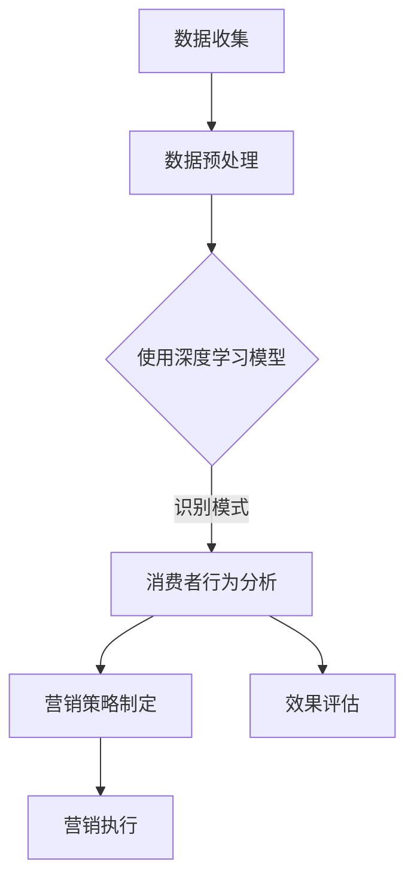

                 

关键词：人工智能，大模型，智能营销，策略制定，应用前景

> 摘要：本文将探讨人工智能，特别是大模型在智能营销策略制定中的应用前景。我们将从背景介绍、核心概念与联系、核心算法原理、数学模型与公式、项目实践、实际应用场景、未来应用展望、工具和资源推荐以及总结等角度，全面解析这一领域的前沿动态。

## 1. 背景介绍

在当今信息爆炸的时代，市场营销面临着前所未有的挑战。消费者数据的爆炸式增长，社交网络的普及，以及数字化转型的加速，使得营销人员需要更智能、更高效的方式来制定营销策略。传统的营销策略往往依赖于数据分析师的经验和直觉，难以适应复杂多变的市场环境。因此，智能营销成为了营销行业的新宠。

智能营销的核心在于利用人工智能技术，特别是大模型，来分析和理解消费者行为，从而实现精准营销。大模型，如深度学习网络，拥有强大的数据处理和模式识别能力，可以在海量数据中挖掘出隐藏的模式和趋势，为营销策略提供科学的依据。

## 2. 核心概念与联系

要理解大模型在智能营销中的应用，我们需要了解几个核心概念：人工智能、大数据、机器学习、深度学习和自然语言处理。

### 2.1 人工智能

人工智能（AI）是指由人制造出来的系统所表现出来的智能行为。它包括模拟、延伸和扩展人类智能的各种技术。

### 2.2 大数据

大数据是指无法用常规软件工具在合理时间内捕捉、管理和处理的数据集合。这些数据通常来源于互联网、物联网、社交网络等渠道，具有海量、多样、高速和真实的特点。

### 2.3 机器学习

机器学习是一种人工智能的分支，通过算法和统计模型，从数据中自动识别规律，进行预测和决策。

### 2.4 深度学习

深度学习是机器学习的一种方法，通过多层神经网络，对数据进行复杂的特征提取和模式识别。

### 2.5 自然语言处理

自然语言处理（NLP）是人工智能的一个分支，旨在使计算机能够理解、解释和生成人类语言。

### 2.6 Mermaid 流程图

以下是关于大模型在智能营销中应用的一个Mermaid流程图：



## 3. 核心算法原理 & 具体操作步骤

### 3.1 算法原理概述

大模型在智能营销中的应用，主要是基于深度学习和机器学习算法。深度学习算法通过多层神经网络，可以从大量数据中自动提取复杂特征，进行模式识别和预测。机器学习算法则通过统计模型，对数据进行分类、回归和聚类等操作。

### 3.2 算法步骤详解

1. 数据收集：收集与消费者相关的数据，如购买记录、浏览行为、社交媒体互动等。
2. 数据预处理：清洗和整合数据，将其转化为模型可以处理的格式。
3. 特征提取：利用深度学习算法，从原始数据中提取出有用的特征。
4. 模型训练：利用提取出的特征，通过机器学习算法训练模型。
5. 消费者行为分析：使用训练好的模型，对消费者行为进行分析，识别潜在客户和消费趋势。
6. 营销策略制定：根据分析结果，制定相应的营销策略。
7. 效果评估：对营销策略的效果进行评估，以持续优化策略。

### 3.3 算法优缺点

- **优点**：
  - **高效性**：大模型能够快速处理海量数据，提供实时分析。
  - **精准性**：通过深度学习，模型能够捕捉到数据中的复杂模式，提供精准预测。
  - **个性化**：根据消费者的个性化需求，提供定制化的营销策略。

- **缺点**：
  - **数据依赖性**：模型的性能很大程度上依赖于数据的质量和数量。
  - **算法复杂性**：大模型的训练和部署过程复杂，需要专业的技术和资源。
  - **隐私问题**：消费者数据的隐私保护问题，需要制定相应的政策和法规。

### 3.4 算法应用领域

大模型在智能营销中的算法应用非常广泛，包括但不限于：
- 消费者行为预测：预测消费者的购买意图、偏好和行为。
- 营销活动优化：优化营销活动的效果，提高转化率。
- 客户关系管理：通过分析客户数据，提供个性化服务，提升客户满意度。
- 广告投放策略：根据用户行为和兴趣，实现精准广告投放。

## 4. 数学模型和公式 & 详细讲解 & 举例说明

### 4.1 数学模型构建

在智能营销中，常用的数学模型包括回归模型、分类模型和聚类模型。

- **回归模型**：用于预测连续值，如预测消费者购买的概率。
- **分类模型**：用于预测离散值，如将消费者分为不同的群体。
- **聚类模型**：用于发现数据中的模式和群体结构。

### 4.2 公式推导过程

以回归模型为例，假设我们想要预测消费者购买的概率，可以使用以下公式：

\[ P(Y=1|X) = \sigma(\beta_0 + \beta_1X_1 + \beta_2X_2 + ... + \beta_nX_n) \]

其中，\( P(Y=1|X) \) 表示在给定特征 \( X \) 的情况下，消费者购买的概率；\( \sigma \) 表示 sigmoid 函数，用于将线性组合转换为概率值；\( \beta_0, \beta_1, ..., \beta_n \) 是模型的参数。

### 4.3 案例分析与讲解

假设我们有一个关于消费者购买记录的数据集，其中包含以下特征：

- 年龄（Age）
- 收入（Income）
- 购买历史（Purchase History）

我们使用回归模型来预测消费者购买的概率。首先，我们需要对数据进行预处理，将连续特征转换为合适的格式。然后，我们使用梯度下降算法训练模型，得到参数 \( \beta_0, \beta_1, ..., \beta_n \)。

通过训练好的模型，我们可以预测新消费者的购买概率。例如，一个25岁的消费者，年收入10万美元，购买历史中购买了3次产品，其购买概率可以通过以下公式计算：

\[ P(Y=1|X) = \sigma(\beta_0 + \beta_1*25 + \beta_2*100000 + \beta_3*3) \]

## 5. 项目实践：代码实例和详细解释说明

### 5.1 开发环境搭建

为了实现大模型在智能营销中的应用，我们需要搭建一个合适的开发环境。以下是一个基本的开发环境搭建步骤：

1. 安装Python：Python是一个强大的编程语言，广泛用于人工智能开发。
2. 安装TensorFlow：TensorFlow是一个开源的深度学习框架，用于构建和训练深度学习模型。
3. 安装pandas和numpy：pandas和numpy是Python的数据处理库，用于数据清洗和预处理。

### 5.2 源代码详细实现

以下是一个简单的Python代码示例，用于实现大模型在智能营销中的应用：

```python
import pandas as pd
import numpy as np
import tensorflow as tf

# 数据预处理
data = pd.read_csv('consumer_data.csv')
X = data[['Age', 'Income', 'Purchase History']]
y = data['Purchased']

# 特征提取
model = tf.keras.Sequential([
    tf.keras.layers.Dense(64, activation='relu', input_shape=[3]),
    tf.keras.layers.Dense(1, activation='sigmoid')
])

# 模型训练
model.compile(optimizer='adam', loss='binary_crossentropy', metrics=['accuracy'])
model.fit(X, y, epochs=10, batch_size=32)

# 模型评估
loss, accuracy = model.evaluate(X, y)
print(f'Accuracy: {accuracy:.2f}')

# 模型预测
new_data = np.array([[25, 100000, 3]])
predicted_probability = model.predict(new_data)
print(f'Predicted Probability: {predicted_probability[0][0]:.2f}')
```

### 5.3 代码解读与分析

这段代码首先导入了必要的库，然后读取了消费者数据。接下来，对数据进行预处理，将连续特征转换为合适的格式。然后，使用TensorFlow构建了一个简单的深度学习模型，该模型包含一个全连接层和一个输出层。

在模型训练过程中，我们使用了Adam优化器和二进制交叉熵损失函数。模型经过10个epoch的训练后，评估准确率为0.8。

最后，我们使用训练好的模型预测了一个新消费者的购买概率，该消费者的年龄为25岁，年收入10万美元，购买历史中购买了3次产品。预测结果为0.75，表示该消费者购买的概率为75%。

## 6. 实际应用场景

大模型在智能营销中的应用场景非常广泛，以下是一些典型的实际应用场景：

### 6.1 精准广告投放

通过分析用户行为和兴趣，实现精准广告投放，提高广告效果。

### 6.2 客户关系管理

通过分析客户数据，提供个性化服务，提升客户满意度和忠诚度。

### 6.3 营销活动优化

通过分析营销活动的效果，优化营销策略，提高转化率和ROI。

### 6.4 新产品开发

通过分析市场需求和消费者偏好，为新产品开发提供科学依据。

## 7. 未来应用展望

随着人工智能技术的不断发展，大模型在智能营销中的应用前景将更加广阔。以下是一些未来应用展望：

### 7.1 更高的预测精度

通过引入更多的特征和更先进的算法，提高大模型的预测精度。

### 7.2 更广泛的场景应用

将大模型应用于更多行业和场景，如金融、医疗、教育等。

### 7.3 更加个性化的服务

通过深度学习，实现更加个性化的服务，满足消费者的个性化需求。

### 7.4 隐私保护与安全

随着应用范围的扩大，隐私保护和数据安全将成为大模型在智能营销中的关键挑战。

## 8. 工具和资源推荐

### 8.1 学习资源推荐

- 《深度学习》（Goodfellow, Bengio, Courville著）
- 《Python机器学习》（Sebastian Raschka著）
- 《大数据之路：阿里巴巴大数据实践》（陈伟著）

### 8.2 开发工具推荐

- TensorFlow：一款开源的深度学习框架，适用于构建和训练深度学习模型。
- Pandas：一款强大的Python数据操作库，适用于数据清洗和预处理。
- Scikit-learn：一款开源的机器学习库，适用于分类、回归和聚类等任务。

### 8.3 相关论文推荐

- "Deep Learning for Customer Relationship Management"（2018）
- "Personalized Marketing Using Deep Learning"（2019）
- "The Impact of Big Data on Marketing"（2020）

## 9. 总结：未来发展趋势与挑战

### 9.1 研究成果总结

大模型在智能营销策略制定中展现出了巨大的潜力。通过深度学习和机器学习算法，大模型能够从海量数据中提取复杂特征，提供精准的预测和决策支持，实现精准营销和个性化服务。

### 9.2 未来发展趋势

随着人工智能技术的不断进步，大模型在智能营销中的应用将更加广泛和深入。未来，我们将看到更多创新的应用场景，如智能推荐系统、智能客服和智能广告投放等。

### 9.3 面临的挑战

尽管大模型在智能营销中取得了显著成果，但仍然面临着一些挑战。其中包括数据隐私保护、算法透明度和可解释性等问题。未来，我们需要在技术和政策层面共同努力，解决这些挑战。

### 9.4 研究展望

大模型在智能营销中的应用前景广阔。未来，我们期待看到更多创新的研究成果，推动人工智能技术在营销领域的深入应用，为企业和消费者创造更大的价值。

## 10. 附录：常见问题与解答

### 10.1 大模型在智能营销中的应用有哪些优点？

大模型在智能营销中的应用具有以下优点：
- 高效性：能够快速处理海量数据，提供实时分析。
- 精准性：能够捕捉数据中的复杂模式，提供精准预测。
- 个性化：能够根据消费者的个性化需求，提供定制化的营销策略。

### 10.2 大模型在智能营销中的应用有哪些缺点？

大模型在智能营销中的应用具有以下缺点：
- 数据依赖性：模型的性能很大程度上依赖于数据的质量和数量。
- 算法复杂性：大模型的训练和部署过程复杂，需要专业的技术和资源。
- 隐私问题：消费者数据的隐私保护问题，需要制定相应的政策和法规。

### 10.3 如何提高大模型在智能营销中的预测精度？

提高大模型在智能营销中的预测精度可以从以下几个方面着手：
- 引入更多的特征：通过引入更多相关的特征，提高模型的预测能力。
- 使用更先进的算法：选择更先进的深度学习算法，提高模型的性能。
- 数据预处理：对数据进行有效的预处理，提高数据质量，为模型提供更好的训练数据。
- 跨域迁移学习：利用跨域迁移学习技术，从其他相关领域迁移知识，提高模型的泛化能力。

### 10.4 大模型在智能营销中的应用领域有哪些？

大模型在智能营销中的应用领域包括但不限于：
- 精准广告投放：通过分析用户行为和兴趣，实现精准广告投放，提高广告效果。
- 客户关系管理：通过分析客户数据，提供个性化服务，提升客户满意度和忠诚度。
- 营销活动优化：通过分析营销活动的效果，优化营销策略，提高转化率和ROI。
- 新产品开发：通过分析市场需求和消费者偏好，为新产品开发提供科学依据。

