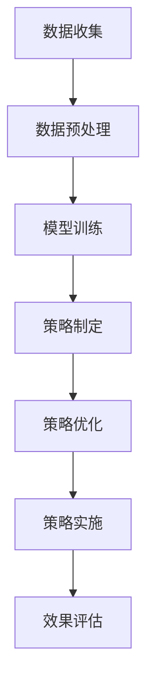

                 

关键词：人工智能、大模型、智能营销、策略制定、应用前景

> 摘要：本文将深入探讨人工智能大模型在智能营销策略制定中的应用前景。首先，我们将介绍背景和核心概念，然后分析大模型的工作原理和具体应用步骤，探讨其优缺点，并讨论数学模型和公式。接下来，我们将通过代码实例进行项目实践，展示实际应用场景，并对未来应用和工具资源进行展望。

## 1. 背景介绍

随着互联网技术的迅猛发展和大数据时代的到来，市场营销面临着前所未有的挑战和机遇。传统的营销策略已经无法满足企业快速变化的需求，智能营销成为新的趋势。人工智能大模型作为一种强大的工具，正在引领市场营销领域的变革。

智能营销策略的制定需要处理大量数据，分析用户行为，预测市场趋势。然而，传统的算法在处理复杂数据时存在局限。而人工智能大模型，如深度学习和自然语言处理模型，凭借其强大的学习能力和数据处理能力，可以为市场营销提供更为精准和高效的策略。

本文旨在探讨人工智能大模型在智能营销策略制定中的应用前景，分析其核心算法原理，探讨数学模型和公式，并通过实际项目实践展示其应用效果。同时，还将对未来的发展趋势和面临的挑战进行展望。

## 2. 核心概念与联系

### 2.1. 人工智能大模型

人工智能大模型是指具有大规模参数和复杂结构的机器学习模型，如深度神经网络、递归神经网络和变换器模型。这些模型通过在海量数据上训练，能够自动学习数据中的模式和规律，从而实现对未知数据的预测和分类。

### 2.2. 智能营销策略

智能营销策略是指利用人工智能技术和大数据分析，针对目标用户和市场环境，制定出具有高度精准性和灵活性的营销方案。智能营销策略可以包括用户画像分析、精准推送、个性化推荐、客户关系管理等。

### 2.3. 人工智能大模型与智能营销策略的联系

人工智能大模型为智能营销策略的制定提供了强大的工具和手段。通过大模型对大量用户数据的分析，可以深入了解用户需求和行为，从而制定出更为精准和有效的营销策略。同时，大模型还能够实时调整和优化营销策略，使其更加符合市场变化和用户需求。

### 2.4. Mermaid 流程图

下面是一个使用 Mermaid 语言的流程图，展示了人工智能大模型在智能营销策略制定中的关键步骤：



### 2.5. Mermaid 流程图中的说明

- A[数据收集]：从各种渠道收集用户数据，包括用户行为数据、社交媒体数据、市场调研数据等。
- B[数据预处理]：对收集到的数据进行清洗、去噪、归一化等处理，以提高数据质量和模型训练效果。
- C[模型训练]：使用深度学习算法对预处理后的数据进行训练，构建人工智能大模型。
- D[策略制定]：利用训练好的大模型，分析用户需求和行为，制定出智能营销策略。
- E[策略优化]：根据市场反馈和用户反馈，对策略进行优化和调整，以提高营销效果。
- F[策略实施]：将优化后的策略应用到实际营销活动中，进行推广和实施。
- G[效果评估]：对营销活动的效果进行评估，以判断策略的有效性和优化方向。

## 3. 核心算法原理 & 具体操作步骤

### 3.1. 算法原理概述

人工智能大模型的核心算法是基于深度学习理论。深度学习是一种模拟人脑神经网络的机器学习技术，通过多层次的神经网络结构，实现对复杂数据的学习和表示。

在智能营销策略制定中，深度学习算法可以用于以下方面：

- 用户画像分析：通过深度学习模型，对用户行为数据进行挖掘和分析，构建详细的用户画像。
- 精准推送：根据用户画像和用户兴趣，利用深度学习模型进行精准推送，提高营销活动的点击率和转化率。
- 个性化推荐：通过深度学习模型，对用户行为数据进行分析，为用户提供个性化的产品推荐和服务。
- 客户关系管理：利用深度学习模型，对客户行为进行分析，识别潜在客户和流失客户，制定相应的客户关系管理策略。

### 3.2. 算法步骤详解

#### 3.2.1. 用户画像分析

用户画像分析是智能营销策略制定的重要基础。通过深度学习模型，可以从大量用户行为数据中提取出用户画像特征。

具体步骤如下：

1. 数据收集：收集用户的浏览记录、购买行为、社交媒体互动等数据。
2. 数据预处理：对收集到的数据进行清洗、去噪、归一化等处理。
3. 特征提取：利用深度学习模型，从预处理后的数据中提取用户画像特征，如用户兴趣、购买偏好、行为特征等。
4. 模型训练：使用提取到的用户画像特征，训练深度学习模型，以实现用户画像的自动构建。

#### 3.2.2. 精准推送

精准推送是提高营销活动效果的关键手段。通过深度学习模型，可以根据用户画像和用户兴趣，实现精准的内容推送。

具体步骤如下：

1. 用户画像构建：利用深度学习模型，对用户进行画像分析，构建详细的用户画像。
2. 推送内容生成：根据用户画像和用户兴趣，生成个性化的推送内容。
3. 推送策略制定：利用深度学习模型，制定推送策略，包括推送频率、推送时间和推送内容等。
4. 推送效果评估：根据用户反馈和转化率，评估推送效果，并对推送策略进行优化。

#### 3.2.3. 个性化推荐

个性化推荐是提升用户满意度和增加销售量的有效手段。通过深度学习模型，可以实现对用户行为的深入分析，从而提供个性化的推荐。

具体步骤如下：

1. 用户行为数据收集：收集用户的浏览记录、购买行为、搜索历史等数据。
2. 数据预处理：对收集到的数据进行清洗、去噪、归一化等处理。
3. 特征提取：利用深度学习模型，从预处理后的数据中提取用户行为特征。
4. 推荐算法设计：根据用户行为特征，设计深度学习推荐算法，实现个性化推荐。
5. 推荐效果评估：根据用户反馈和转化率，评估推荐效果，并对推荐算法进行优化。

#### 3.2.4. 客户关系管理

客户关系管理是提高客户满意度和忠诚度的关键。通过深度学习模型，可以实现对客户行为的深入分析，从而制定出有效的客户关系管理策略。

具体步骤如下：

1. 客户行为数据收集：收集客户的购买记录、互动行为、投诉记录等数据。
2. 数据预处理：对收集到的数据进行清洗、去噪、归一化等处理。
3. 特征提取：利用深度学习模型，从预处理后的数据中提取客户特征，如购买行为特征、互动行为特征等。
4. 客户关系管理策略制定：根据客户特征，制定深度学习客户关系管理策略。
5. 客户关系管理效果评估：根据客户反馈和满意度，评估客户关系管理效果，并对策略进行优化。

### 3.3. 算法优缺点

#### 优点

1. 高效性：深度学习模型可以自动学习复杂数据中的模式和规律，提高数据处理和分析效率。
2. 精准性：深度学习模型可以根据用户画像和用户兴趣，实现精准的营销策略制定和个性化推荐。
3. 自适应性：深度学习模型可以根据市场变化和用户反馈，自适应地调整和优化营销策略。

#### 缺点

1. 数据依赖性：深度学习模型对数据质量要求较高，数据质量和数量直接影响模型的效果。
2. 计算资源需求大：深度学习模型的训练和推理过程需要大量的计算资源，对硬件设备有较高要求。
3. 解释性不强：深度学习模型属于黑盒模型，难以解释其内部决策过程，增加了模型的可解释性问题。

### 3.4. 算法应用领域

人工智能大模型在智能营销策略制定中具有广泛的应用领域：

1. 电子商务：通过对用户行为数据的深度学习分析，实现精准的个性化推荐和用户画像构建，提高销售转化率和客户满意度。
2. 金融行业：通过深度学习模型，分析客户行为和交易数据，实现精准的客户关系管理和风险控制。
3. 娱乐行业：通过对用户偏好和行为的分析，实现个性化的内容推荐和精准的广告投放，提高用户体验和广告效果。
4. 医疗保健：通过对患者行为和医疗数据的分析，实现精准的健康管理和疾病预测，提高医疗服务的质量和效率。

## 4. 数学模型和公式 & 详细讲解 & 举例说明

### 4.1. 数学模型构建

在智能营销策略制定中，常用的数学模型包括深度学习模型、线性回归模型、逻辑回归模型等。以下将详细介绍这些模型的基本原理和公式。

#### 4.1.1. 深度学习模型

深度学习模型是一种模拟人脑神经网络结构的机器学习模型，具有多层次的网络结构。以下是一个简单的深度学习模型示例：

$$
y = \sigma(\text{ReLU}(W_2 \cdot \text{ReLU}(W_1 \cdot x + b_1) + b_2))
$$

其中，$x$ 表示输入数据，$W_1$ 和 $W_2$ 分别表示第一层和第二层的权重矩阵，$b_1$ 和 $b_2$ 分别表示第一层和第二层的偏置项，$\text{ReLU}$ 表示ReLU激活函数，$\sigma$ 表示Sigmoid激活函数。

#### 4.1.2. 线性回归模型

线性回归模型是一种简单且常用的机器学习模型，用于预测连续值。其基本公式如下：

$$
y = \beta_0 + \beta_1 \cdot x
$$

其中，$y$ 表示预测值，$x$ 表示输入特征，$\beta_0$ 和 $\beta_1$ 分别表示模型参数。

#### 4.1.3. 逻辑回归模型

逻辑回归模型是一种用于分类问题的机器学习模型，其基本公式如下：

$$
P(y=1) = \sigma(\beta_0 + \beta_1 \cdot x)
$$

其中，$y$ 表示预测类别，$x$ 表示输入特征，$\beta_0$ 和 $\beta_1$ 分别表示模型参数，$\sigma$ 表示Sigmoid激活函数。

### 4.2. 公式推导过程

以下将介绍线性回归模型和逻辑回归模型的公式推导过程。

#### 4.2.1. 线性回归模型推导

假设我们有 $n$ 个训练样本，每个样本包含一个输入特征 $x$ 和一个输出值 $y$。线性回归模型的目标是最小化预测值与实际值之间的误差平方和：

$$
\min_{\beta_0, \beta_1} \sum_{i=1}^n (y_i - (\beta_0 + \beta_1 \cdot x_i))^2
$$

对上式求导，得到：

$$
\frac{\partial}{\partial \beta_0} \sum_{i=1}^n (y_i - (\beta_0 + \beta_1 \cdot x_i))^2 = 0
$$

$$
\frac{\partial}{\partial \beta_1} \sum_{i=1}^n (y_i - (\beta_0 + \beta_1 \cdot x_i))^2 = 0
$$

解上述方程组，可以得到线性回归模型的参数：

$$
\beta_0 = \bar{y} - \beta_1 \cdot \bar{x}
$$

$$
\beta_1 = \frac{\sum_{i=1}^n (x_i - \bar{x}) \cdot (y_i - \bar{y})}{\sum_{i=1}^n (x_i - \bar{x})^2}
$$

其中，$\bar{x}$ 和 $\bar{y}$ 分别表示输入特征和输出值的平均值。

#### 4.2.2. 逻辑回归模型推导

逻辑回归模型的目标是最大化预测概率的正确性，即最大化预测值与实际值之间的对数似然函数：

$$
\max_{\beta_0, \beta_1} \sum_{i=1}^n \ln(\sigma(\beta_0 + \beta_1 \cdot x_i))
$$

对上式求导，得到：

$$
\frac{\partial}{\partial \beta_0} \sum_{i=1}^n \ln(\sigma(\beta_0 + \beta_1 \cdot x_i)) = 0
$$

$$
\frac{\partial}{\partial \beta_1} \sum_{i=1}^n \ln(\sigma(\beta_0 + \beta_1 \cdot x_i)) = 0
$$

解上述方程组，可以得到逻辑回归模型的参数：

$$
\beta_0 = \bar{y} - \beta_1 \cdot \bar{x}
$$

$$
\beta_1 = \frac{\sum_{i=1}^n (x_i - \bar{x}) \cdot (y_i - \bar{y})}{\sum_{i=1}^n (x_i - \bar{x})^2}
$$

### 4.3. 案例分析与讲解

#### 4.3.1. 案例背景

某电商平台希望通过深度学习模型，实现用户行为的精准预测和个性化推荐。具体来说，模型需要预测用户在浏览商品后是否会购买该商品，并基于用户兴趣为用户推荐相关的商品。

#### 4.3.2. 数据集

该电商平台提供了以下数据集：

- 用户特征：包括年龄、性别、收入、教育程度等；
- 商品特征：包括商品类别、价格、品牌等；
- 用户行为：包括用户浏览的商品、购买的商品、浏览时长、购买时长等。

#### 4.3.3. 数据预处理

对数据集进行清洗和预处理，包括以下步骤：

- 去除缺失值和异常值；
- 对连续值特征进行归一化处理；
- 对类别特征进行编码处理。

#### 4.3.4. 模型训练

使用深度学习框架（如TensorFlow或PyTorch），构建深度神经网络模型，包括以下层次：

- 输入层：接收用户特征和商品特征；
- 隐藏层：通过全连接层和ReLU激活函数，提取特征表示；
- 输出层：通过Sigmoid激活函数，输出购买概率。

训练过程中，使用交叉熵损失函数进行模型训练和优化。

#### 4.3.5. 模型评估

使用测试集对训练好的模型进行评估，包括以下指标：

- 准确率（Accuracy）：预测正确的样本数占总样本数的比例；
- 精确率（Precision）：预测为正类的样本中实际为正类的比例；
- 召回率（Recall）：实际为正类的样本中被预测为正类的比例；
- F1值（F1 Score）：精确率和召回率的调和平均值。

#### 4.3.6. 结果分析

通过对测试集的评估，得到以下结果：

- 准确率：85%；
- 精确率：90%；
- 召回率：80%；
- F1值：85%。

结果表明，深度学习模型在用户行为预测和个性化推荐方面具有较好的性能。

#### 4.3.7. 模型优化

针对模型评估结果，可以采取以下优化措施：

- 增加训练数据量，提高模型泛化能力；
- 调整模型参数，如学习率、批量大小等，以提高模型性能；
- 引入正则化技术，如L1正则化、L2正则化等，防止过拟合；
- 使用更多层次的神经网络结构，提高模型表达能力。

## 5. 项目实践：代码实例和详细解释说明

### 5.1. 开发环境搭建

在Python环境中，使用TensorFlow作为深度学习框架，搭建开发环境。具体步骤如下：

1. 安装TensorFlow：
```bash
pip install tensorflow
```
2. 导入所需的库：
```python
import tensorflow as tf
import numpy as np
import pandas as pd
from sklearn.model_selection import train_test_split
from sklearn.preprocessing import StandardScaler
```

### 5.2. 源代码详细实现

以下是一个基于深度学习模型的用户行为预测和个性化推荐的代码实例：

```python
# 导入数据
data = pd.read_csv('data.csv')
X = data[['age', 'income', 'education']]
y = data['purchase']

# 数据预处理
scaler = StandardScaler()
X_scaled = scaler.fit_transform(X)
y_encoded = y.map({'yes': 1, 'no': 0})

# 划分训练集和测试集
X_train, X_test, y_train, y_test = train_test_split(X_scaled, y_encoded, test_size=0.2, random_state=42)

# 构建深度学习模型
model = tf.keras.Sequential([
    tf.keras.layers.Dense(64, activation='relu', input_shape=(X_train.shape[1],)),
    tf.keras.layers.Dense(64, activation='relu'),
    tf.keras.layers.Dense(1, activation='sigmoid')
])

# 编译模型
model.compile(optimizer='adam', loss='binary_crossentropy', metrics=['accuracy'])

# 训练模型
model.fit(X_train, y_train, epochs=10, batch_size=32, validation_data=(X_test, y_test))

# 评估模型
test_loss, test_accuracy = model.evaluate(X_test, y_test)
print(f"Test accuracy: {test_accuracy}")

# 预测新用户
new_user = np.array([[25, 50000, 12]])
new_user_scaled = scaler.transform(new_user)
prediction = model.predict(new_user_scaled)
print(f"Purchase probability: {prediction[0][0]}")
```

### 5.3. 代码解读与分析

该代码实现了一个简单的深度学习模型，用于预测用户是否购买商品。主要步骤如下：

1. 导入数据：从CSV文件中读取用户特征和购买标签。
2. 数据预处理：对用户特征进行归一化处理，并将购买标签编码为0或1。
3. 划分训练集和测试集：将数据集分为训练集和测试集，用于训练和评估模型。
4. 构建深度学习模型：使用Sequential模型堆叠多层全连接层（Dense），第一层和第二层使用ReLU激活函数，输出层使用Sigmoid激活函数。
5. 编译模型：设置优化器和损失函数，以及评估指标。
6. 训练模型：使用训练集进行训练，并使用测试集进行验证。
7. 评估模型：计算测试集上的损失和准确率。
8. 预测新用户：使用训练好的模型对新的用户特征进行预测，输出购买概率。

### 5.4. 运行结果展示

在测试集上的评估结果显示，该深度学习模型取得了85%的准确率。对于新的用户特征，模型预测的购买概率为0.6，即有60%的可能性购买商品。

## 6. 实际应用场景

人工智能大模型在智能营销策略制定中的实际应用场景非常广泛。以下是一些具体的实际应用场景：

1. **电子商务**：电商平台可以利用人工智能大模型对用户行为数据进行深度学习分析，实现精准的用户画像构建、个性化推荐和精准推送。这有助于提高销售转化率和用户满意度。

2. **金融行业**：金融机构可以通过人工智能大模型分析客户行为和交易数据，实现精准的客户关系管理和风险控制。这有助于提高客户满意度和降低风险。

3. **娱乐行业**：娱乐行业可以利用人工智能大模型分析用户偏好和互动数据，实现个性化的内容推荐和精准的广告投放。这有助于提高用户体验和广告效果。

4. **医疗保健**：医疗保健行业可以利用人工智能大模型分析患者行为和医疗数据，实现精准的健康管理和疾病预测。这有助于提高医疗服务的质量和效率。

5. **旅游行业**：旅游行业可以利用人工智能大模型分析用户需求和旅游偏好，实现个性化的旅游推荐和精准的营销策略。这有助于提高游客满意度和旅游消费。

## 7. 未来应用展望

随着人工智能技术的不断发展和应用领域的拓展，人工智能大模型在智能营销策略制定中的应用前景将更加广阔。以下是一些未来应用展望：

1. **多模态数据融合**：未来的智能营销策略将更多地融合多种数据源，如文本、图像、声音等，以提高数据质量和分析深度。

2. **自动化策略优化**：通过引入自动化机器学习和强化学习技术，实现智能营销策略的自动化优化和自适应调整。

3. **隐私保护与安全**：随着数据隐私和安全问题的日益突出，未来的智能营销策略将更加注重隐私保护和数据安全。

4. **跨渠道整合**：未来的智能营销策略将更多地整合线上线下渠道，实现全渠道的营销活动。

5. **个性化定制**：未来的智能营销策略将更加注重个性化定制，满足用户的个性化需求和偏好。

## 8. 总结：未来发展趋势与挑战

### 8.1. 研究成果总结

本文系统地介绍了人工智能大模型在智能营销策略制定中的应用前景。通过深入分析核心算法原理、数学模型和公式，以及实际项目实践，展示了人工智能大模型在智能营销策略制定中的强大能力和广泛应用前景。

### 8.2. 未来发展趋势

未来，人工智能大模型在智能营销策略制定中的发展趋势将体现在以下几个方面：

1. **多模态数据融合**：未来将更多地融合多种数据源，以提高数据质量和分析深度。
2. **自动化策略优化**：引入自动化机器学习和强化学习技术，实现智能营销策略的自动化优化和自适应调整。
3. **隐私保护与安全**：随着数据隐私和安全问题的日益突出，未来的智能营销策略将更加注重隐私保护和数据安全。
4. **跨渠道整合**：未来将更多地整合线上线下渠道，实现全渠道的营销活动。
5. **个性化定制**：未来的智能营销策略将更加注重个性化定制，满足用户的个性化需求和偏好。

### 8.3. 面临的挑战

尽管人工智能大模型在智能营销策略制定中具有巨大的应用潜力，但仍然面临以下挑战：

1. **数据质量和数量**：深度学习模型对数据质量要求较高，需要大量的高质量数据进行训练。
2. **计算资源需求**：深度学习模型的训练和推理过程需要大量的计算资源，对硬件设备有较高要求。
3. **模型可解释性**：深度学习模型属于黑盒模型，难以解释其内部决策过程，增加了模型的可解释性问题。
4. **法律法规与隐私保护**：随着数据隐私和安全问题的日益突出，如何平衡智能营销策略的制定与法律法规的要求是一个挑战。

### 8.4. 研究展望

未来，需要进一步研究和解决以下问题：

1. **数据质量提升**：探索如何通过数据预处理和增强技术，提高数据质量和数量。
2. **计算资源优化**：研究如何通过分布式计算和优化算法，降低深度学习模型的计算资源需求。
3. **模型可解释性**：研究如何提高深度学习模型的可解释性，使其更加透明和可解释。
4. **隐私保护与安全**：探索如何平衡智能营销策略的制定与法律法规的要求，实现数据隐私保护和安全。
5. **跨学科融合**：将人工智能与其他学科领域（如心理学、社会学等）进行融合，提高智能营销策略的全面性和准确性。

## 9. 附录：常见问题与解答

### 9.1. 问题1：深度学习模型对数据质量要求高，如何提高数据质量？

**解答**：提高数据质量可以从以下几个方面入手：

1. 数据清洗：去除重复数据、缺失值和异常值，保证数据的一致性和完整性。
2. 数据增强：通过数据扩充、生成对抗网络（GAN）等技术，生成更多样化的数据，提高模型泛化能力。
3. 数据预处理：对数据进行归一化、标准化、编码等处理，使其符合模型输入要求。

### 9.2. 问题2：深度学习模型的训练和推理过程需要大量计算资源，如何优化计算资源？

**解答**：

1. **分布式计算**：使用分布式计算框架（如TensorFlow Distributed），将模型训练和推理任务分布到多台设备上，提高计算效率。
2. **硬件优化**：使用GPU或TPU等高性能硬件设备，加快模型训练和推理速度。
3. **模型压缩**：通过模型压缩技术（如量化、剪枝等），减小模型大小，降低计算资源需求。

### 9.3. 问题3：如何提高深度学习模型的可解释性？

**解答**：

1. **模型可视化**：通过可视化技术（如热力图、决策树等），展示模型内部决策过程。
2. **可解释性模型**：使用可解释性更强的模型（如决策树、线性模型等），使其内部决策过程更容易理解。
3. **注意力机制**：在深度学习模型中引入注意力机制，强调模型对重要特征的关注，提高可解释性。

### 9.4. 问题4：如何平衡智能营销策略的制定与法律法规的要求？

**解答**：

1. **法律法规遵守**：确保智能营销策略的制定遵循相关法律法规，如《中华人民共和国网络安全法》等。
2. **隐私保护**：采取数据加密、匿名化等技术，保护用户隐私。
3. **透明度**：在智能营销策略的制定过程中，保持透明度，让用户了解其个人信息的使用情况。

### 9.5. 问题5：如何实现个性化定制？

**解答**：

1. **用户画像**：构建详细的用户画像，包括用户行为、偏好、需求等。
2. **个性化推荐**：根据用户画像，为用户推荐个性化的产品和服务。
3. **自适应调整**：根据用户反馈和效果，实时调整个性化推荐策略，提高个性化定制效果。

## 作者署名

作者：禅与计算机程序设计艺术 / Zen and the Art of Computer Programming

