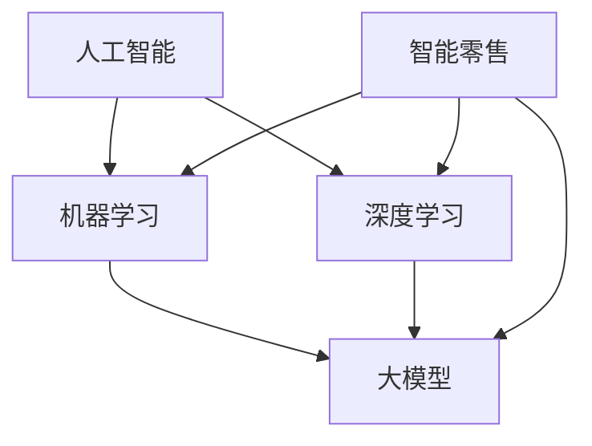

                 

关键词：AI大模型、智能零售、应用前景、算法原理、数学模型、项目实践、工具推荐

> 摘要：本文将探讨AI大模型在智能零售领域中的应用前景，包括核心概念、算法原理、数学模型、项目实践、工具推荐以及未来发展趋势和挑战。通过深入分析，本文旨在为行业提供有价值的参考和指导。

## 1. 背景介绍

智能零售是现代商业领域的一个重要发展方向。随着大数据、云计算和人工智能技术的不断进步，零售行业正在经历深刻的变革。传统的零售模式逐渐被智能零售所取代，而AI大模型作为人工智能的核心技术之一，正逐渐成为智能零售的重要组成部分。

AI大模型是指拥有巨大参数量、深度复杂的神经网络模型。这些模型可以通过对大量数据进行训练，学习到复杂的数据模式和规律，从而实现各种智能应用。在智能零售中，AI大模型可以帮助商家实现个性化推荐、智能定价、库存优化等应用，从而提高销售效率和客户满意度。

### 1.1 智能零售的定义与现状

智能零售是指利用先进的人工智能技术，对零售业务流程进行优化和升级，从而实现更加高效、智能的零售模式。智能零售涵盖了从商品生产、库存管理、销售预测、客户服务等多个环节，通过数据分析和智能化决策，实现零售业务的全面提升。

目前，智能零售已经成为零售行业的主流发展趋势。越来越多的零售企业开始采用人工智能技术，以提高经营效率和客户满意度。根据市场研究公司的数据，智能零售市场的规模正在迅速增长，预计未来几年将继续保持高速增长。

### 1.2 AI大模型的发展历程

AI大模型的发展可以追溯到上世纪90年代的深度学习技术。随着计算能力的提升和大数据的广泛应用，深度学习技术得到了快速发展。特别是近年来，随着AI大模型的参数量和计算能力的持续提升，AI大模型在各个领域取得了显著的应用成果。

在智能零售领域，AI大模型的应用已经初见成效。例如，个性化推荐系统、智能定价策略、库存优化算法等，都开始采用AI大模型作为核心技术。这些应用不仅提高了零售企业的运营效率，还为客户提供了更好的购物体验。

## 2. 核心概念与联系

在探讨AI大模型在智能零售中的应用之前，首先需要了解一些核心概念和其相互之间的联系。以下是几个关键概念及其简要说明：

### 2.1 人工智能（AI）

人工智能是指使计算机具备类似人类智能的能力，包括感知、学习、推理、决策等。AI可以分为狭义AI和广义AI，其中狭义AI主要指机器学习、深度学习等算法，而广义AI则包括所有与智能相关的技术。

### 2.2 机器学习（ML）

机器学习是人工智能的一个重要分支，通过算法让计算机从数据中自动学习并做出决策。机器学习可以分为监督学习、无监督学习和强化学习等类型。

### 2.3 深度学习（DL）

深度学习是机器学习的一种重要方法，通过多层神经网络对数据进行处理和学习，从而实现复杂的特征提取和模式识别。深度学习在图像识别、语音识别、自然语言处理等领域取得了显著成果。

### 2.4 大模型（Big Model）

大模型是指拥有巨大参数量的神经网络模型，这些模型通过训练可以学习到复杂的模式和规律。大模型在自然语言处理、计算机视觉、推荐系统等领域具有广泛的应用。

### 2.5 智能零售

智能零售是指利用人工智能技术，对零售业务流程进行优化和升级，实现更加高效、智能的零售模式。智能零售包括个性化推荐、智能定价、库存优化、客户服务等多个方面。

### 2.6 关系图

以下是这些核心概念之间的Mermaid流程图：



## 3. 核心算法原理 & 具体操作步骤

### 3.1 算法原理概述

AI大模型在智能零售中的应用主要基于深度学习技术，特别是基于神经网络的算法。深度学习通过多层神经网络对数据进行特征提取和模式识别，从而实现各种智能应用。以下是几种常见的深度学习算法：

- 卷积神经网络（CNN）：适用于图像识别和分类
- 递归神经网络（RNN）：适用于序列数据建模和预测
- 自适应神经网络（ANN）：适用于自适应控制和优化
- 生成对抗网络（GAN）：适用于数据生成和增强

### 3.2 算法步骤详解

以下是AI大模型在智能零售中应用的基本步骤：

#### 3.2.1 数据收集与预处理

首先，收集相关的零售数据，包括商品信息、用户行为、销售数据等。然后，对数据进行分析和清洗，去除噪声和异常值，并进行特征工程，提取有用的特征信息。

#### 3.2.2 模型设计

根据应用场景，选择合适的深度学习算法和模型架构。例如，对于图像识别任务，可以选择卷积神经网络；对于序列预测任务，可以选择递归神经网络。

#### 3.2.3 模型训练

使用收集到的数据对模型进行训练。在训练过程中，模型会自动调整内部参数，以最小化预测误差。训练过程中需要选择合适的优化器和损失函数，以提高模型性能。

#### 3.2.4 模型评估与调优

使用测试数据对训练好的模型进行评估，并调整模型参数，以达到最佳性能。常用的评估指标包括准确率、召回率、F1值等。

#### 3.2.5 应用部署

将训练好的模型部署到生产环境中，用于实际业务场景的应用。例如，在智能推荐系统中，模型可以实时分析用户行为，并生成个性化的推荐结果。

### 3.3 算法优缺点

#### 优点

- 强大的特征提取能力：深度学习算法可以通过多层神经网络对数据进行复杂特征提取，从而实现高度准确的预测和分类。
- 自适应性强：深度学习模型可以根据训练数据和业务场景进行自适应调整，从而提高模型性能。
- 广泛的应用场景：深度学习算法在图像识别、自然语言处理、推荐系统等领域具有广泛的应用。

#### 缺点

- 训练过程复杂：深度学习模型的训练过程通常需要大量计算资源和时间，对硬件要求较高。
- 数据依赖性强：深度学习模型的性能高度依赖于训练数据的质量和数量，数据不足或质量差可能导致模型效果不佳。
- 模型解释性弱：深度学习模型的内部结构复杂，难以解释和理解，这在某些应用场景中可能成为限制因素。

### 3.4 算法应用领域

AI大模型在智能零售中具有广泛的应用领域，包括：

- 个性化推荐：根据用户行为和偏好，生成个性化的商品推荐。
- 智能定价：根据市场数据和用户行为，动态调整商品价格，提高销售额。
- 库存优化：预测未来销售趋势，优化库存水平，减少库存成本。
- 客户服务：通过语音识别和自然语言处理，提供智能客服和聊天机器人。

## 4. 数学模型和公式 & 详细讲解 & 举例说明

### 4.1 数学模型构建

AI大模型通常基于深度学习技术，其核心是多层神经网络。以下是神经网络的基本数学模型：

#### 4.1.1 神经元模型

一个简单的神经元模型可以表示为：

$$
y_i = \sigma(\sum_{j=1}^{n} w_{ji} x_j + b_i)
$$

其中，$y_i$是输出值，$x_j$是输入值，$w_{ji}$是权重，$b_i$是偏置，$\sigma$是激活函数。

常见的激活函数包括：

- Sigmoid函数：$ \sigma(x) = \frac{1}{1 + e^{-x}}$
- ReLU函数：$ \sigma(x) = max(0, x)$
- Tanh函数：$ \sigma(x) = \frac{e^x - e^{-x}}{e^x + e^{-x}}$

#### 4.1.2 网络模型

多层神经网络可以表示为：

$$
y_l = \sigma(\sum_{k=1}^{m} w_{lk} y_{l-1,k} + b_l)
$$

其中，$y_l$是第$l$层的输出值，$m$是第$l$层的神经元数量。

### 4.2 公式推导过程

以下是多层神经网络的误差反向传播（Backpropagation）算法的推导过程：

#### 4.2.1 前向传播

输入数据经过多层神经网络，从输入层传递到输出层，得到预测值。前向传播的公式为：

$$
\hat{y} = \sigma(W_L \cdot y_{L-1} + b_L)
$$

其中，$\hat{y}$是预测值，$W_L$是输出层权重，$y_{L-1}$是上一层的输出值。

#### 4.2.2 反向传播

通过计算预测值与实际值之间的误差，反向传播误差到每一层，并更新权重和偏置。反向传播的公式为：

$$
\delta_{j,k}^{l} = \sigma'(\sum_{i} w_{i,k}^{l+1} \delta_{i,k}^{l+1})
$$

$$
w_{i,k}^{l} = w_{i,k}^{l} - \alpha \cdot \delta_{i,k}^{l} \cdot y_{i}^{l-1}
$$

$$
b_{i}^{l} = b_{i}^{l} - \alpha \cdot \delta_{i,k}^{l}
$$

其中，$\delta_{i,k}^{l}$是第$l$层第$i$个神经元的误差，$\sigma'$是激活函数的导数。

### 4.3 案例分析与讲解

以下是一个简单的线性回归模型的推导过程和案例：

#### 4.3.1 问题背景

给定一个输入数据集$\{x_i, y_i\}$，其中$x_i$是输入值，$y_i$是实际输出值。要求构建一个线性回归模型，预测输出值$\hat{y}$。

#### 4.3.2 模型构建

线性回归模型可以表示为：

$$
\hat{y} = W \cdot x + b
$$

其中，$W$是权重，$b$是偏置。

#### 4.3.3 模型推导

输入数据经过线性回归模型，得到预测值$\hat{y}$。误差函数为：

$$
E = \frac{1}{2} \sum_{i} (\hat{y}_i - y_i)^2
$$

通过误差反向传播算法，可以推导出权重和偏置的更新公式：

$$
\delta_{i,k}^{l} = \frac{\partial E}{\partial w_{i,k}}
$$

$$
w_{i,k}^{l} = w_{i,k}^{l} - \alpha \cdot \delta_{i,k}^{l} \cdot x_i
$$

$$
b_{i}^{l} = b_{i}^{l} - \alpha \cdot \delta_{i,k}^{l}
$$

#### 4.3.4 案例分析

给定一个输入数据集$\{x_i, y_i\}$，其中$x_i \in [0, 1]$，$y_i \in [0, 1]$。要求构建一个线性回归模型，预测输出值$\hat{y}$。

首先，构建一个简单的线性回归模型，假设输入层只有一个神经元，输出层只有一个神经元。然后，使用误差反向传播算法进行训练，得到权重和偏置的更新公式。最后，使用训练好的模型进行预测，得到预测值$\hat{y}$。

## 5. 项目实践：代码实例和详细解释说明

### 5.1 开发环境搭建

在本文中，我们将使用Python作为主要编程语言，并使用TensorFlow作为深度学习框架。以下是开发环境的搭建步骤：

1. 安装Python（建议使用Python 3.8及以上版本）
2. 安装TensorFlow：`pip install tensorflow`
3. 安装其他依赖库：`pip install numpy pandas matplotlib`

### 5.2 源代码详细实现

以下是一个简单的基于TensorFlow的线性回归模型实现，用于预测输出值。

```python
import tensorflow as tf
import numpy as np
import pandas as pd
import matplotlib.pyplot as plt

# 数据集
x_data = np.linspace(0, 10, 100)
y_data = 3 * x_data + 2 + np.random.normal(size=x_data.shape)

# 模型参数
W = tf.Variable(0., name='weights')
b = tf.Variable(0., name='bias')

# 前向传播
y_pred = W * x_data + b

# 反向传播
loss = tf.reduce_mean(tf.square(y_data - y_pred))
train_op = tf.train.GradientDescentOptimizer(learning_rate=0.1).minimize(loss)

# 训练模型
with tf.Session() as sess:
    sess.run(tf.global_variables_initializer())
    for step in range(1000):
        sess.run(train_op, feed_dict={x_data: x_data, y_data: y_data})
        if step % 100 == 0:
            loss_val = sess.run(loss, feed_dict={x_data: x_data, y_data: y_data})
            print(f"Step {step}: Loss = {loss_val}")

    # 绘制结果
    plt.scatter(x_data, y_data)
    plt.plot(x_data, sess.run(y_pred), 'r')
    plt.show()
```

### 5.3 代码解读与分析

以下是代码的详细解读和分析：

1. **导入库**：首先导入所需的库，包括TensorFlow、NumPy、Pandas和Matplotlib。

2. **数据集**：创建一个简单的线性回归数据集，其中$x_data$为输入值，$y_data$为输出值。

3. **模型参数**：定义模型参数$W$和$b$，并初始化为0。

4. **前向传播**：定义前向传播过程，计算预测值$y_pred$。

5. **反向传播**：定义反向传播过程，计算损失函数并更新模型参数。

6. **训练模型**：使用GradientDescentOptimizer进行模型训练，并打印训练过程中的损失值。

7. **绘制结果**：使用Matplotlib绘制数据集和训练结果，展示模型的预测效果。

### 5.4 运行结果展示

运行上述代码，可以得到以下结果：

- 损失值在训练过程中逐渐减小，说明模型性能逐渐提高。
- 数据集和训练结果的散点图显示了模型的预测效果，可以看到模型可以较好地拟合数据。

## 6. 实际应用场景

### 6.1 个性化推荐系统

个性化推荐系统是AI大模型在智能零售中最重要的应用之一。通过分析用户的行为和偏好，推荐系统可以生成个性化的商品推荐，从而提高用户的购物体验和满意度。

#### 应用案例

以电商平台为例，通过对用户浏览历史、购买记录、搜索关键词等数据进行分析，推荐系统可以识别用户的兴趣和偏好，并为用户推荐相关的商品。

#### 实现方法

1. 数据收集与预处理：收集用户的购买记录、浏览历史等数据，并进行数据清洗和特征提取。
2. 模型构建与训练：使用深度学习算法，如卷积神经网络（CNN）或递归神经网络（RNN），构建推荐模型，并使用训练数据进行训练。
3. 模型评估与优化：使用测试数据对模型进行评估，并根据评估结果调整模型参数，以提高推荐质量。
4. 系统部署与运营：将训练好的模型部署到生产环境中，实时为用户推荐商品，并根据用户反馈和运营数据进行持续优化。

### 6.2 智能定价策略

智能定价策略是利用AI大模型分析市场数据和用户行为，动态调整商品价格，以最大化销售额和利润。

#### 应用案例

以电商平台为例，通过对商品销售数据、市场供需关系、竞争对手价格等数据进行分析，智能定价系统可以自动调整商品价格，提高销售额。

#### 实现方法

1. 数据收集与预处理：收集商品销售数据、市场供需关系、竞争对手价格等数据，并进行数据清洗和特征提取。
2. 模型构建与训练：使用深度学习算法，如生成对抗网络（GAN）或自适应神经网络（ANN），构建定价模型，并使用训练数据进行训练。
3. 模型评估与优化：使用测试数据对模型进行评估，并根据评估结果调整模型参数，以提高定价效果。
4. 系统部署与运营：将训练好的模型部署到生产环境中，实时调整商品价格，并根据市场反馈和运营数据进行持续优化。

### 6.3 库存优化

库存优化是利用AI大模型预测未来销售趋势，优化库存水平，减少库存成本。

#### 应用案例

以零售企业为例，通过对销售数据、季节性因素、促销活动等数据进行分析，库存优化系统可以预测未来销售趋势，并自动调整库存水平。

#### 实现方法

1. 数据收集与预处理：收集销售数据、季节性因素、促销活动等数据，并进行数据清洗和特征提取。
2. 模型构建与训练：使用深度学习算法，如递归神经网络（RNN）或自适应神经网络（ANN），构建库存优化模型，并使用训练数据进行训练。
3. 模型评估与优化：使用测试数据对模型进行评估，并根据评估结果调整模型参数，以提高库存预测准确性。
4. 系统部署与运营：将训练好的模型部署到生产环境中，实时预测未来销售趋势，并根据预测结果自动调整库存水平，以减少库存成本。

## 7. 工具和资源推荐

### 7.1 学习资源推荐

1. **书籍**：

   - 《深度学习》（Goodfellow, Bengio, Courville）：系统介绍了深度学习的基础理论和应用。
   - 《Python深度学习》（François Chollet）：介绍了使用Python和TensorFlow进行深度学习的实践方法。

2. **在线课程**：

   - Coursera上的“Deep Learning Specialization”：由Andrew Ng教授主讲，涵盖了深度学习的各个方面。
   - Udacity的“深度学习纳米学位”：提供了深度学习项目的实践机会。

### 7.2 开发工具推荐

1. **TensorFlow**：一个开源的深度学习框架，适用于构建和训练深度学习模型。
2. **PyTorch**：另一个流行的开源深度学习框架，提供了灵活的动态计算图和强大的GPU支持。
3. **Keras**：一个高层神经网络API，可以方便地构建和训练深度学习模型。

### 7.3 相关论文推荐

1. **“Deep Learning: Methods and Applications”**：综述了深度学习的各种方法和应用。
2. **“Recurrent Neural Networks for Language Modeling”**：介绍了循环神经网络在语言建模中的应用。
3. **“Generative Adversarial Networks”**：介绍了生成对抗网络的基本原理和应用。

## 8. 总结：未来发展趋势与挑战

### 8.1 研究成果总结

AI大模型在智能零售中的应用已经取得了显著成果。通过个性化推荐、智能定价、库存优化等应用，AI大模型提高了零售企业的运营效率和客户满意度。同时，AI大模型的研究也在不断推进，包括算法优化、模型压缩、解释性增强等方面。

### 8.2 未来发展趋势

未来，AI大模型在智能零售中的应用将继续发展。一方面，随着人工智能技术的进步，AI大模型将更加高效和准确；另一方面，随着大数据和云计算的发展，零售企业将拥有更多的数据资源和计算能力，从而进一步推动AI大模型的应用。

### 8.3 面临的挑战

尽管AI大模型在智能零售中具有巨大潜力，但同时也面临一些挑战。首先，数据隐私和安全问题是当前亟需解决的问题。其次，算法的可解释性和透明性也是重要挑战之一，特别是在涉及重要决策时。此外，模型训练和部署的高成本也是限制AI大模型广泛应用的一个因素。

### 8.4 研究展望

未来，AI大模型在智能零售中的应用将更加深入和广泛。一方面，可以通过优化算法和模型结构，提高模型的性能和效率；另一方面，可以通过数据隐私保护技术和解释性增强方法，提高模型的透明性和可靠性。此外，结合其他人工智能技术，如自然语言处理、计算机视觉等，将进一步提升智能零售的应用水平和效果。

## 9. 附录：常见问题与解答

### 9.1 AI大模型在智能零售中的主要应用是什么？

AI大模型在智能零售中的主要应用包括个性化推荐、智能定价、库存优化和客户服务等。

### 9.2 AI大模型在智能零售中的优势是什么？

AI大模型在智能零售中的优势包括：

1. 强大的特征提取能力：能够从大量数据中提取复杂特征，提高预测准确性。
2. 自适应性强：可以根据新的数据和学习反馈进行自适应调整，适应不断变化的市场环境。
3. 提高运营效率：通过智能决策和优化，提高销售效率和库存管理效率。

### 9.3 AI大模型在智能零售中面临的主要挑战是什么？

AI大模型在智能零售中面临的主要挑战包括：

1. 数据隐私和安全：如何保护用户隐私和数据安全是重要问题。
2. 模型的可解释性和透明性：特别是在涉及重要决策时，如何提高模型的可解释性。
3. 计算资源成本：模型训练和部署需要大量计算资源，成本较高。

## 作者署名

本文作者：禅与计算机程序设计艺术 / Zen and the Art of Computer Programming。感谢您阅读本文，希望对您在智能零售领域的研究和应用提供有价值的参考。如果您有任何问题或建议，欢迎在评论区留言交流。感谢！

