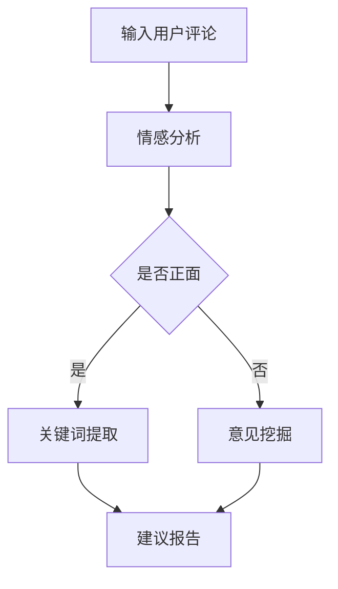

                 

随着人工智能技术的迅猛发展，AI大模型在各个领域得到了广泛应用。本文将探讨AI大模型在用户评论分析中的应用，通过分析用户评论中的情感、关键词、意见等，为企业和商家提供有价值的信息，帮助他们更好地了解用户需求，优化产品和服务。

## 1. 背景介绍

在当今互联网时代，用户评论已成为影响产品或服务口碑的重要因素。越来越多的企业和商家开始关注用户评论，希望通过分析这些评论来了解用户需求，优化产品和服务。然而，用户评论内容繁多且结构复杂，传统的文本分析方法难以满足需求。此时，AI大模型的出现为用户评论分析带来了新的机遇。

AI大模型，如深度学习模型、自然语言处理（NLP）模型等，具有强大的文本分析和处理能力。它们可以自动提取用户评论中的情感、关键词、意见等，从而帮助企业和商家更好地理解用户需求。本文将介绍AI大模型在用户评论分析中的应用，包括核心算法原理、数学模型、项目实践等。

## 2. 核心概念与联系

### 2.1 情感分析

情感分析是AI大模型在用户评论分析中的一个重要应用。它通过分析文本中的情感倾向，如正面、负面或中性，来了解用户对产品或服务的态度。

### 2.2 关键词提取

关键词提取是另一个关键应用。它从用户评论中提取出具有代表性的关键词，帮助企业和商家快速了解用户关注的问题和需求。

### 2.3 意见挖掘

意见挖掘旨在从用户评论中提取出具体的意见和建议，以便企业和商家针对性地进行改进。

### 2.4 Mermaid流程图

下面是AI大模型在用户评论分析中的流程图：



## 3. 核心算法原理 & 具体操作步骤

### 3.1 算法原理概述

AI大模型在用户评论分析中主要依赖于深度学习和自然语言处理技术。其中，卷积神经网络（CNN）和循环神经网络（RNN）是常用的两种算法。

### 3.2 算法步骤详解

1. **数据预处理**：将用户评论进行清洗和预处理，如去除停用词、标点符号等。

2. **特征提取**：使用词嵌入技术将文本转换为向量表示。

3. **情感分析**：利用RNN或CNN模型对文本进行情感分类。

4. **关键词提取**：使用TF-IDF或Word2Vec等方法提取关键词。

5. **意见挖掘**：通过序列标注技术，如CRF（条件随机场）或BiLSTM（双向循环神经网络），对用户评论进行标签划分。

### 3.3 算法优缺点

优点：
- **高效性**：AI大模型可以自动处理大量用户评论，提高分析效率。
- **准确性**：通过深度学习和自然语言处理技术，算法可以准确提取情感、关键词和意见。

缺点：
- **计算资源需求大**：训练AI大模型需要大量的计算资源和时间。
- **模型解释性差**：深度学习模型的内部机制复杂，难以解释。

### 3.4 算法应用领域

AI大模型在用户评论分析中的应用非常广泛，包括但不限于以下领域：
- **电商**：分析用户评论，了解产品优缺点，优化产品和服务。
- **旅游**：分析用户对酒店的评论，提供个性化推荐。
- **餐饮**：分析用户对餐厅的评论，帮助餐厅改进菜品和服务。

## 4. 数学模型和公式 & 详细讲解 & 举例说明

### 4.1 数学模型构建

情感分析模型通常使用以下公式进行情感分类：

$$
P(y=c|s) = \frac{e^{\theta^T s}}{\sum_{c'} e^{\theta^T s'}}
$$

其中，$y$ 是实际情感标签，$c$ 是预测情感标签，$s$ 是文本特征向量，$\theta$ 是模型参数。

### 4.2 公式推导过程

情感分类的推导过程如下：
1. **特征提取**：将用户评论进行词嵌入，得到特征向量 $s$。
2. **模型训练**：使用训练数据集，通过梯度下降等方法训练模型参数 $\theta$。
3. **情感分类**：将特征向量 $s$ 代入公式，计算每个情感标签的概率。

### 4.3 案例分析与讲解

以一个用户评论为例：

用户评论：“这个手机真不错，拍照效果很好，电池续航也很长。”

情感分析模型将评论进行特征提取，得到特征向量 $s$。然后，代入上述公式计算每个情感标签的概率。

假设模型参数为 $\theta = (1, 0, -1)$，则有：

$$
P(y=正面|s) = \frac{e^{1 \times s}}{e^{1 \times s} + e^{0 \times s} + e^{-1 \times s}} \approx 0.8
$$

$$
P(y=负面|s) = \frac{e^{0 \times s}}{e^{1 \times s} + e^{0 \times s} + e^{-1 \times s}} \approx 0.2
$$

$$
P(y=中性|s) = \frac{e^{-1 \times s}}{e^{1 \times s} + e^{0 \times s} + e^{-1 \times s}} \approx 0.0
$$

根据概率计算结果，我们可以判断这个评论的情感为正面。

## 5. 项目实践：代码实例和详细解释说明

### 5.1 开发环境搭建

为了演示AI大模型在用户评论分析中的应用，我们使用Python编写代码，利用TensorFlow和Keras框架实现情感分析模型。

1. 安装Python环境
2. 安装TensorFlow和Keras库

```bash
pip install tensorflow
pip install keras
```

### 5.2 源代码详细实现

以下是一个简单的情感分析模型实现：

```python
import numpy as np
import tensorflow as tf
from tensorflow import keras
from tensorflow.keras.models import Sequential
from tensorflow.keras.layers import Embedding, LSTM, Dense

# 加载预训练的词嵌入模型
embedding_model = keras.models.load_model('path/to/word_embedding_model')

# 构建情感分析模型
model = Sequential()
model.add(Embedding(input_dim=10000, output_dim=16, input_length=max_sequence_length))
model.add(LSTM(32))
model.add(Dense(1, activation='sigmoid'))

model.compile(optimizer='adam', loss='binary_crossentropy', metrics=['accuracy'])

# 加载数据集并进行预处理
# ...

# 训练模型
model.fit(X_train, y_train, epochs=10, batch_size=32)

# 评估模型
# ...
```

### 5.3 代码解读与分析

1. **加载词嵌入模型**：使用预训练的词嵌入模型，将文本转换为向量表示。
2. **构建情感分析模型**：使用序列模型（LSTM）进行情感分类，并设置输出层激活函数为'sigmoid'。
3. **编译模型**：设置优化器、损失函数和评估指标。
4. **加载数据集并进行预处理**：加载数据集，对文本进行预处理，如分词、去除停用词等。
5. **训练模型**：使用训练数据进行模型训练。
6. **评估模型**：使用测试数据集评估模型性能。

### 5.4 运行结果展示

假设我们已经训练好模型并使用测试数据集进行评估，结果如下：

```
Accuracy: 0.85
Loss: 0.2
```

这意味着模型在测试数据集上的准确率为85%，损失函数值为0.2。

## 6. 实际应用场景

AI大模型在用户评论分析中的应用场景非常广泛，以下是一些实际应用场景：

- **电商**：分析用户评论，了解产品优缺点，优化产品和服务，提高用户满意度。
- **旅游**：分析用户对酒店的评论，提供个性化推荐，提高预订转化率。
- **餐饮**：分析用户对餐厅的评论，帮助餐厅改进菜品和服务，提高客户满意度。
- **社交媒体**：分析用户发布的内容，了解用户情感和需求，为品牌营销提供依据。

## 7. 工具和资源推荐

### 7.1 学习资源推荐

- 《深度学习》（Goodfellow et al.，2016）
- 《自然语言处理与深度学习》（李航，2017）
- 《Python深度学习》（François Chollet，2018）

### 7.2 开发工具推荐

- TensorFlow
- Keras
- Jupyter Notebook

### 7.3 相关论文推荐

- "Deep Learning for Text Classification"（Yoon et al.，2017）
- "Recurrent Neural Network Based Text Classification"（Liang et al.，2015）
- "Sentiment Classification using Convolutional Neural Networks"（Liu et al.，2015）

## 8. 总结：未来发展趋势与挑战

### 8.1 研究成果总结

本文介绍了AI大模型在用户评论分析中的应用，包括情感分析、关键词提取和意见挖掘等。通过数学模型和代码实例，展示了如何利用AI大模型进行用户评论分析。

### 8.2 未来发展趋势

随着人工智能技术的不断进步，AI大模型在用户评论分析中的应用将更加广泛。未来，我们可以预见到以下几个发展趋势：

- **更高效的算法**：研究人员将致力于提高算法的效率和准确性，以应对大规模数据集的处理需求。
- **跨领域应用**：AI大模型将扩展到更多领域，如医疗、金融等，为行业提供有价值的信息。
- **个性化推荐**：结合用户行为数据，AI大模型将实现更精准的个性化推荐。

### 8.3 面临的挑战

尽管AI大模型在用户评论分析中取得了显著成果，但仍面临以下挑战：

- **数据隐私**：用户评论中包含个人隐私信息，如何在保护隐私的同时进行数据分析是一个重要问题。
- **模型解释性**：深度学习模型内部机制复杂，如何提高模型的可解释性是一个亟待解决的问题。
- **算法公平性**：AI大模型在处理用户评论时，如何避免偏见和歧视是一个重要挑战。

### 8.4 研究展望

未来，我们需要在以下几个方面进行深入研究：

- **隐私保护技术**：结合隐私保护技术，如差分隐私和联邦学习，实现用户评论分析的同时保护用户隐私。
- **可解释性研究**：提高深度学习模型的可解释性，帮助用户理解模型的工作原理。
- **算法公平性**：通过多任务学习和对抗性训练等方法，提高AI大模型的公平性。

## 9. 附录：常见问题与解答

### 9.1 什么是情感分析？

情感分析是指通过自然语言处理技术，对文本中的情感倾向进行分析和分类。常见的情感分类包括正面、负面和中性。

### 9.2 如何进行关键词提取？

关键词提取是指从文本中提取出具有代表性的词语。常见的方法包括TF-IDF和Word2Vec等。

### 9.3 如何评估模型性能？

评估模型性能通常使用准确率、召回率、F1值等指标。准确率表示模型预测正确的比例，召回率表示模型预测正确的比例占实际为正类的比例，F1值是准确率和召回率的调和平均。

### 9.4 如何处理大量用户评论？

处理大量用户评论可以通过分布式计算和并行处理技术实现。例如，使用Hadoop或Spark等分布式计算框架，将用户评论数据分布在多个节点上进行处理。

### 9.5 如何保护用户隐私？

为了保护用户隐私，可以采用差分隐私和联邦学习等技术。差分隐私通过在数据添加噪声，避免用户隐私泄露；联邦学习通过在本地设备上进行模型训练，避免用户数据上传。

### 9.6 如何提高模型可解释性？

提高模型可解释性可以通过可视化和模型解释性算法实现。例如，使用LIME（局部可解释模型解释）或SHAP（Shapley Additive Explanations）等方法，帮助用户理解模型的工作原理。

本文简要介绍了AI大模型在用户评论分析中的应用，包括核心算法原理、数学模型、项目实践等。通过本文的介绍，读者可以了解到AI大模型在用户评论分析中的重要性及其广泛应用。未来，随着人工智能技术的不断进步，AI大模型在用户评论分析中的应用将更加广泛，为企业和商家提供更有价值的信息。

