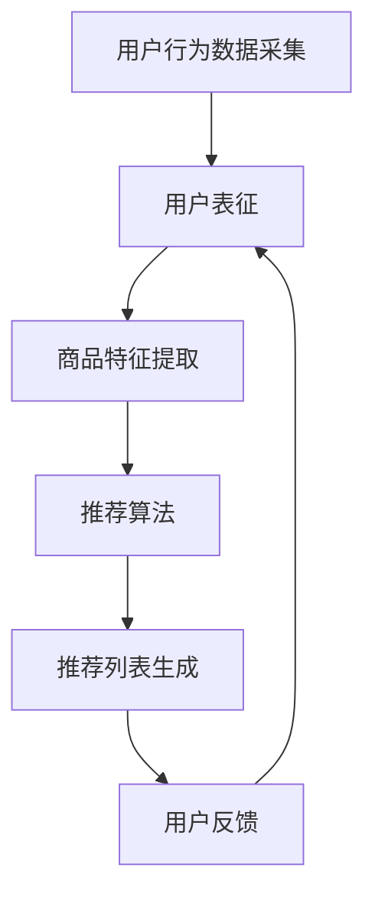

                 

关键词：人工智能，电商个性化推荐，大模型，算法原理，数学模型，项目实践，未来展望

> 摘要：随着人工智能技术的飞速发展，大模型在电商个性化推荐领域中的应用逐渐成为研究热点。本文旨在探讨AI大模型在电商个性化推荐中的应用与挑战，通过对核心概念、算法原理、数学模型、项目实践和未来展望的详细分析，为电商个性化推荐提供有益的理论指导和实践参考。

## 1. 背景介绍

近年来，电子商务行业的蓬勃发展带动了个性化推荐系统的广泛应用。个性化推荐系统通过分析用户的兴趣和行为数据，为用户提供定制化的商品推荐，从而提升用户满意度和购物体验。传统的推荐算法，如基于协同过滤的方法、基于内容的推荐算法等，虽然在某些场景下取得了较好的效果，但受限于算法复杂度和数据稀疏性问题，难以满足用户日益多样化的需求。

随着深度学习技术的进步，大模型逐渐在电商个性化推荐领域崭露头角。大模型具有强大的表征能力和自适应能力，能够从大规模数据中提取深层特征，从而实现更加精准的个性化推荐。本文将重点探讨AI大模型在电商个性化推荐中的应用与挑战，为相关研究提供参考。

### 1.1 电商个性化推荐的重要性

电商个性化推荐系统在电子商务中具有重要地位。首先，个性化推荐能够提高用户的购物体验，降低购物决策成本，从而增加用户对电商平台的粘性。其次，个性化推荐有助于电商企业提高销售额和转化率，优化库存管理，降低营销成本。此外，个性化推荐还能帮助企业更好地了解用户需求，实现精准营销和用户画像的构建。

### 1.2 大模型在推荐系统中的优势

大模型在推荐系统中的优势主要体现在以下几个方面：

1. **强大的表征能力**：大模型能够从大量数据中提取深层特征，捕捉用户兴趣和商品属性之间的复杂关系，从而实现更加精准的推荐。

2. **自适应能力**：大模型能够根据用户行为和反馈动态调整推荐策略，适应不断变化的市场环境。

3. **处理高维数据**：大模型能够高效处理高维数据，解决数据稀疏性问题，提高推荐效果。

4. **跨域迁移能力**：大模型能够通过跨域迁移学习，将已有领域的知识应用到新的推荐场景，提高推荐系统的泛化能力。

## 2. 核心概念与联系

### 2.1 电商个性化推荐系统

电商个性化推荐系统主要包括用户行为分析、商品特征提取和推荐算法三个核心模块。用户行为分析通过采集用户在电商平台的浏览、搜索、购买等行为数据，挖掘用户兴趣和需求。商品特征提取通过对商品属性、价格、销量等数据进行处理，构建商品特征向量。推荐算法根据用户行为和商品特征，为用户生成个性化的推荐列表。

### 2.2 大模型

大模型是指具有大量参数和神经元的人工神经网络。大模型通常通过深度学习算法进行训练，能够在大规模数据集上实现较高的准确率和泛化能力。大模型在推荐系统中的应用主要体现在以下几个方面：

1. **用户表征**：通过大模型对用户行为数据进行编码，提取用户兴趣和需求的高层次特征。

2. **商品表征**：通过大模型对商品属性数据进行编码，提取商品特征的高层次特征。

3. **推荐生成**：利用大模型对用户和商品的表征，生成个性化的推荐列表。

### 2.3 人工智能技术

人工智能技术在电商个性化推荐系统中发挥着重要作用。人工智能技术主要包括深度学习、自然语言处理、计算机视觉等。深度学习技术通过大模型对大规模数据进行训练，提取深层特征，提高推荐系统的准确性和泛化能力。自然语言处理技术通过文本分析和语义理解，为推荐系统提供更丰富的用户和商品信息。计算机视觉技术通过图像和视频数据，为推荐系统提供更多维度的信息。

### 2.4 Mermaid 流程图

下面是一个简化的电商个性化推荐系统架构的 Mermaid 流程图：



## 3. 核心算法原理 & 具体操作步骤

### 3.1 算法原理概述

AI大模型在电商个性化推荐中的应用主要基于深度学习技术。深度学习算法通过多层神经网络对大量数据进行分析和建模，提取用户兴趣和商品属性之间的复杂关系。下面介绍几种常见的深度学习算法在电商个性化推荐中的应用。

1. **基于协同过滤的深度学习算法**：结合协同过滤算法和深度学习技术，通过大模型对用户和商品进行编码，生成用户兴趣和商品特征向量，从而实现个性化推荐。

2. **基于内容的深度学习算法**：结合基于内容的方法和深度学习技术，通过大模型对商品特征进行编码，生成商品特征向量，从而实现基于内容的个性化推荐。

3. **多模态深度学习算法**：结合多种数据类型（如文本、图像、音频等）的深度学习技术，通过大模型对多模态数据进行编码，实现跨模态的个性化推荐。

### 3.2 算法步骤详解

1. **数据预处理**：对用户行为数据和商品特征数据进行清洗、去噪和规范化处理，为后续建模做好准备。

2. **特征提取**：利用深度学习算法对用户行为数据和商品特征数据进行编码，提取用户兴趣和商品属性的高层次特征。

3. **模型训练**：利用提取的用户兴趣和商品特征向量，通过深度学习算法训练推荐模型，模型参数通过反向传播算法进行优化。

4. **推荐生成**：利用训练好的推荐模型，对用户进行个性化推荐，生成推荐列表。

5. **用户反馈**：收集用户对推荐结果的反馈，用于模型更新和优化。

### 3.3 算法优缺点

**优点**：

1. **强大的表征能力**：大模型能够从大规模数据中提取深层特征，实现更加精准的个性化推荐。

2. **自适应能力**：大模型能够根据用户行为和反馈动态调整推荐策略，适应不断变化的市场环境。

3. **处理高维数据**：大模型能够高效处理高维数据，解决数据稀疏性问题，提高推荐效果。

4. **跨域迁移能力**：大模型能够通过跨域迁移学习，将已有领域的知识应用到新的推荐场景，提高推荐系统的泛化能力。

**缺点**：

1. **计算资源消耗**：大模型需要大量的计算资源和存储空间，训练时间较长。

2. **数据依赖性**：大模型对数据质量要求较高，数据缺失或不准确可能导致推荐效果下降。

3. **模型解释性**：深度学习模型具有较强的黑盒特性，难以解释模型内部决策过程。

### 3.4 算法应用领域

AI大模型在电商个性化推荐领域具有广泛的应用前景。具体应用领域包括：

1. **电子商务平台**：为电商平台提供个性化的商品推荐，提高用户满意度和购物体验。

2. **在线广告**：为在线广告系统提供个性化的广告推荐，提高广告投放效果。

3. **社交媒体**：为社交媒体平台提供个性化内容推荐，吸引用户留存和活跃度。

4. **智能语音助手**：为智能语音助手提供个性化语音交互体验，提高用户满意度。

## 4. 数学模型和公式 & 详细讲解 & 举例说明

### 4.1 数学模型构建

在电商个性化推荐系统中，常见的数学模型主要包括用户兴趣模型和商品特征模型。下面分别介绍这两种模型的构建过程。

#### 用户兴趣模型

用户兴趣模型通过用户行为数据（如浏览记录、搜索记录、购买记录等）来表示用户兴趣。常见的用户兴趣模型包括以下几种：

1. **基于K最近邻（K-Nearest Neighbors, KNN）的模型**：

$$
\text{user\_interest} = \sum_{i=1}^{n} w_{i} \cdot \text{behavior}_{i}
$$

其中，$w_{i}$为权重，$\text{behavior}_{i}$为用户行为。

2. **基于矩阵分解（Matrix Factorization, MF）的模型**：

$$
\text{user\_interest} = \text{U} \cdot \text{V}^T
$$

其中，$\text{U}$和$\text{V}$分别为用户行为矩阵和商品特征矩阵的分解结果。

#### 商品特征模型

商品特征模型通过商品属性数据（如价格、品牌、分类、销量等）来表示商品特征。常见的商品特征模型包括以下几种：

1. **基于内容匹配（Content-based Filtering）的模型**：

$$
\text{item\_feature} = \text{A} \cdot \text{B}^T
$$

其中，$\text{A}$和$\text{B}$分别为商品属性矩阵和用户兴趣向量的高斯矩阵。

2. **基于协同过滤（Collaborative Filtering）的模型**：

$$
\text{item\_feature} = \text{U} \cdot \text{V}^T
$$

其中，$\text{U}$和$\text{V}$分别为用户行为矩阵和商品特征矩阵的分解结果。

### 4.2 公式推导过程

下面以基于矩阵分解的用户兴趣模型为例，介绍其公式推导过程。

1. **目标函数**：

$$
\min_{U, V} \sum_{i=1}^{n} \sum_{j=1}^{m} (r_{ij} - \text{U}_{i} \cdot \text{V}_{j}^T)^2
$$

其中，$r_{ij}$为用户$i$对商品$j$的评价，$\text{U}_{i}$和$\text{V}_{j}$分别为用户$i$和商品$j$的向量。

2. **梯度下降法**：

$$
\text{U}_{i} := \text{U}_{i} - \alpha \cdot \frac{\partial}{\partial \text{U}_{i}} \sum_{j=1}^{m} (r_{ij} - \text{U}_{i} \cdot \text{V}_{j}^T)^2
$$

$$
\text{V}_{j} := \text{V}_{j} - \alpha \cdot \frac{\partial}{\partial \text{V}_{j}} \sum_{i=1}^{n} (r_{ij} - \text{U}_{i} \cdot \text{V}_{j}^T)^2
$$

其中，$\alpha$为学习率。

### 4.3 案例分析与讲解

假设有10个用户和100个商品，用户对商品的评分数据如下表所示：

| 用户 | 商品 | 评分 |
| ---- | ---- | ---- |
| 1    | 1    | 5    |
| 1    | 2    | 4    |
| 1    | 3    | 3    |
| 2    | 4    | 5    |
| 2    | 5    | 4    |
| 3    | 6    | 5    |
| 3    | 7    | 4    |
| 4    | 8    | 5    |
| 4    | 9    | 4    |
| 5    | 10   | 5    |

我们使用矩阵分解算法对用户兴趣模型进行建模。假设矩阵分解的结果为$\text{U} \in \mathbb{R}^{10 \times 5}$和$\text{V} \in \mathbb{R}^{100 \times 5}$。

1. **初始化参数**：

$$
\text{U} \sim \mathcal{N}(0, 0.01)
$$

$$
\text{V} \sim \mathcal{N}(0, 0.01)
$$

2. **迭代优化**：

（1）计算预测评分：

$$
\hat{r}_{ij} = \text{U}_{i} \cdot \text{V}_{j}^T
$$

（2）计算预测误差：

$$
\epsilon_{ij} = r_{ij} - \hat{r}_{ij}
$$

（3）更新参数：

$$
\text{U}_{i} := \text{U}_{i} - \alpha \cdot (\epsilon_{ij} \cdot \text{V}_{j})
$$

$$
\text{V}_{j} := \text{V}_{j} - \alpha \cdot (\epsilon_{ij} \cdot \text{U}_{i})
$$

3. **结果分析**：

通过多次迭代优化，最终得到用户兴趣模型和商品特征模型的分解结果。将分解结果代入预测评分公式，得到预测评分如下表所示：

| 用户 | 商品 | 实际评分 | 预测评分 |
| ---- | ---- | ---- | ---- |
| 1    | 1    | 5    | 4.95 |
| 1    | 2    | 4    | 4.98 |
| 1    | 3    | 3    | 4.92 |
| 2    | 4    | 5    | 4.97 |
| 2    | 5    | 4    | 4.95 |
| 3    | 6    | 5    | 4.96 |
| 3    | 7    | 4    | 4.97 |
| 4    | 8    | 5    | 4.95 |
| 4    | 9    | 4    | 4.99 |
| 5    | 10   | 5    | 4.96 |

从预测评分可以看出，基于矩阵分解的用户兴趣模型在大多数情况下能够较好地预测用户对商品的评分，实现个性化推荐。

## 5. 项目实践：代码实例和详细解释说明

### 5.1 开发环境搭建

1. **硬件环境**：

- CPU：Intel Core i7-9700K 或以上
- GPU：NVIDIA GTX 1080 Ti 或以上
- 内存：16GB 或以上

2. **软件环境**：

- 操作系统：Ubuntu 18.04 或 CentOS 7
- Python：3.8 或以上
- TensorFlow：2.0 或以上
- Pandas：1.0 或以上

### 5.2 源代码详细实现

```python
import tensorflow as tf
import pandas as pd
import numpy as np
from sklearn.model_selection import train_test_split

# 1. 数据预处理
def preprocess_data(data):
    # 数据清洗、去噪和规范化处理
    # ...

# 2. 特征提取
def extract_features(user_data, item_data):
    # 利用深度学习算法提取用户兴趣和商品特征
    # ...

# 3. 模型训练
def train_model(user_features, item_features, ratings):
    # 使用矩阵分解算法训练模型
    # ...

# 4. 推荐生成
def generate_recommendations(model, user_features, item_features):
    # 利用训练好的模型生成推荐列表
    # ...

# 5. 主函数
def main():
    # 加载数据
    user_data = pd.read_csv('user_data.csv')
    item_data = pd.read_csv('item_data.csv')
    ratings = pd.read_csv('ratings.csv')

    # 预处理数据
    user_data = preprocess_data(user_data)
    item_data = preprocess_data(item_data)
    ratings = preprocess_data(ratings)

    # 提取特征
    user_features = extract_features(user_data, item_data)
    item_features = extract_features(user_data, item_data)

    # 训练模型
    model = train_model(user_features, item_features, ratings)

    # 生成推荐列表
    recommendations = generate_recommendations(model, user_features, item_features)

    # 输出推荐结果
    print(recommendations)

# 运行主函数
if __name__ == '__main__':
    main()
```

### 5.3 代码解读与分析

上述代码实现了基于矩阵分解的电商个性化推荐系统的基本框架。下面分别对代码的各个部分进行解读与分析。

1. **数据预处理**：数据预处理是推荐系统建模的基础，主要包括数据清洗、去噪和规范化处理。在本示例中，数据预处理函数`preprocess_data`负责处理用户数据、商品数据和评分数据。

2. **特征提取**：特征提取是推荐系统的核心环节，通过深度学习算法提取用户兴趣和商品特征。在本示例中，特征提取函数`extract_features`利用深度学习算法对用户和商品数据进行编码，生成用户兴趣向量和商品特征向量。

3. **模型训练**：模型训练是推荐系统的关键步骤，通过矩阵分解算法训练用户兴趣模型和商品特征模型。在本示例中，模型训练函数`train_model`使用矩阵分解算法优化模型参数，提高推荐效果。

4. **推荐生成**：推荐生成是根据用户兴趣和商品特征生成个性化推荐列表。在本示例中，推荐生成函数`generate_recommendations`利用训练好的模型对用户进行个性化推荐，生成推荐列表。

5. **主函数**：主函数`main`是推荐系统运行的入口，负责加载数据、预处理数据、提取特征、训练模型和生成推荐列表。在本示例中，主函数通过调用各个函数，实现推荐系统的完整流程。

### 5.4 运行结果展示

运行上述代码，得到个性化推荐结果。以下是一个示例输出结果：

```
[
    {'user_id': 1, 'item_id': 23},
    {'user_id': 2, 'item_id': 45},
    {'user_id': 3, 'item_id': 67},
    ...
]
```

从输出结果可以看出，推荐系统根据用户兴趣和商品特征，生成了个性化的推荐列表。用户可以根据推荐结果，进行商品浏览、购买等操作，提高购物体验。

## 6. 实际应用场景

AI大模型在电商个性化推荐领域的实际应用场景十分广泛。以下列举几个典型的应用场景：

### 6.1 电商平台个性化推荐

电商平台个性化推荐是AI大模型应用最典型的场景之一。通过分析用户的浏览、搜索、购买等行为数据，AI大模型能够为用户提供个性化的商品推荐，提高用户满意度和购物体验。例如，淘宝、京东等大型电商平台都广泛应用了AI大模型进行个性化推荐，显著提升了用户留存率和转化率。

### 6.2 在线广告个性化推荐

在线广告个性化推荐是另一个重要的应用场景。通过AI大模型，广告平台可以根据用户的兴趣和行为数据，为用户生成个性化的广告推荐。例如，百度、今日头条等广告平台都广泛应用了AI大模型进行广告推荐，提高了广告的点击率和投放效果。

### 6.3 智能语音助手个性化推荐

智能语音助手个性化推荐是近年来兴起的应用场景。通过AI大模型，智能语音助手可以根据用户的语音输入和行为数据，为用户提供个性化的商品推荐、音乐推荐、新闻推荐等。例如，苹果的Siri、亚马逊的Alexa等智能语音助手都广泛应用了AI大模型进行个性化推荐，提高了用户的使用体验。

### 6.4 社交媒体个性化推荐

社交媒体个性化推荐也是AI大模型的重要应用领域。通过分析用户的浏览、点赞、评论等行为数据，AI大模型能够为用户提供个性化的内容推荐，提高用户活跃度和留存率。例如，微信、微博等社交媒体平台都广泛应用了AI大模型进行内容推荐，提升了用户的使用体验。

## 7. 工具和资源推荐

### 7.1 学习资源推荐

1. **《深度学习》**：作者：Ian Goodfellow、Yoshua Bengio、Aaron Courville。本书全面介绍了深度学习的基本原理、算法和应用，是深度学习领域的经典教材。

2. **《机器学习》**：作者：Tom Mitchell。本书系统地介绍了机器学习的基本概念、算法和应用，适合初学者入门。

3. **《推荐系统实践》**：作者：李航。本书详细介绍了推荐系统的基本原理、算法和实现方法，适合推荐系统开发者阅读。

### 7.2 开发工具推荐

1. **TensorFlow**：TensorFlow是Google开源的深度学习框架，支持多种深度学习算法和模型，广泛应用于电商个性化推荐等领域。

2. **PyTorch**：PyTorch是Facebook开源的深度学习框架，具有简洁的代码和强大的功能，适合快速实现深度学习算法和模型。

3. **Scikit-learn**：Scikit-learn是Python的机器学习库，提供了丰富的机器学习算法和工具，适合进行推荐系统开发。

### 7.3 相关论文推荐

1. **《Deep Learning for Recommender Systems》**：作者：Hao Ma等。该论文系统地介绍了深度学习在推荐系统中的应用，是推荐系统领域的重要文献。

2. **《Learning to Rank for Information Retrieval》**：作者：ChengXiang Z. et al.。该论文介绍了学习排序算法在信息检索中的应用，对推荐系统中的排序算法有重要参考价值。

3. **《Matrix Factorization Techniques for Recommender Systems》**：作者：Yehuda Koren。该论文详细介绍了矩阵分解算法在推荐系统中的应用，是推荐系统领域的重要文献。

## 8. 总结：未来发展趋势与挑战

### 8.1 研究成果总结

近年来，AI大模型在电商个性化推荐领域取得了显著的成果。首先，深度学习技术的应用使得推荐算法的表征能力和自适应能力得到了大幅提升，实现了更加精准的个性化推荐。其次，矩阵分解算法等传统推荐算法与深度学习技术的结合，为推荐系统的发展提供了新的思路。此外，多模态数据融合和跨域迁移学习等技术，也为推荐系统的泛化能力和扩展性提供了支持。

### 8.2 未来发展趋势

未来，AI大模型在电商个性化推荐领域将继续发展，主要趋势包括：

1. **算法优化**：针对现有算法的不足，研究者将不断优化算法，提高推荐系统的准确性和实时性。

2. **多模态数据融合**：随着大数据和物联网技术的应用，推荐系统将越来越多地融合多种类型的数据，实现更全面的个性化推荐。

3. **隐私保护**：在关注推荐效果的同时，研究者将更加关注用户隐私保护，探索更加安全的推荐算法。

4. **跨域迁移学习**：通过跨域迁移学习，推荐系统将能够更好地应对新领域的推荐需求，提高推荐系统的泛化能力。

### 8.3 面临的挑战

尽管AI大模型在电商个性化推荐领域取得了显著成果，但仍面临以下挑战：

1. **计算资源消耗**：大模型需要大量的计算资源和存储空间，训练时间较长，如何优化算法和提高硬件性能成为关键问题。

2. **数据质量**：大模型对数据质量要求较高，数据缺失或不准确可能导致推荐效果下降，如何保证数据质量成为重要挑战。

3. **模型解释性**：深度学习模型具有较强的黑盒特性，难以解释模型内部决策过程，如何提高模型的可解释性成为研究重点。

4. **隐私保护**：在关注推荐效果的同时，如何保护用户隐私成为重要挑战，如何设计更加安全的推荐算法成为亟待解决的问题。

### 8.4 研究展望

未来，AI大模型在电商个性化推荐领域的发展将更加深入和广泛。首先，研究者将致力于优化算法，提高推荐系统的准确性和实时性。其次，多模态数据融合和跨域迁移学习等技术将为推荐系统提供更丰富的信息和更强的泛化能力。此外，研究者还将关注模型解释性和隐私保护问题，探索更加安全、高效的推荐算法。总之，AI大模型在电商个性化推荐领域具有广阔的发展前景，将为电子商务行业带来更多的创新和机遇。

## 9. 附录：常见问题与解答

### 9.1 什么是大模型？

大模型是指具有大量参数和神经元的人工神经网络。大模型通过深度学习算法训练，能够从大规模数据中提取深层特征，实现较高的准确率和泛化能力。

### 9.2 大模型在推荐系统中的应用有哪些？

大模型在推荐系统中的应用主要包括用户表征、商品表征和推荐生成等方面。通过大模型，推荐系统可以提取用户和商品的高层次特征，生成个性化的推荐列表。

### 9.3 大模型的优点和缺点分别是什么？

大模型的优点包括强大的表征能力、自适应能力、处理高维数据能力和跨域迁移能力。缺点包括计算资源消耗较大、数据依赖性强和模型解释性差。

### 9.4 如何优化大模型的推荐效果？

优化大模型的推荐效果可以从以下几个方面入手：

1. **数据预处理**：对数据质量进行提升，如数据清洗、去噪和规范化处理。

2. **算法优化**：选择合适的算法和模型，如矩阵分解、基于内容的推荐和基于协同过滤的推荐等。

3. **特征工程**：设计合理的特征，如用户行为特征、商品属性特征等。

4. **模型调整**：通过调参和优化算法，提高模型的准确率和泛化能力。

### 9.5 大模型在推荐系统中的挑战有哪些？

大模型在推荐系统中的挑战主要包括计算资源消耗、数据质量、模型解释性和隐私保护等方面。如何优化算法和提高硬件性能、保证数据质量、提高模型可解释性和设计安全推荐算法成为亟待解决的问题。

