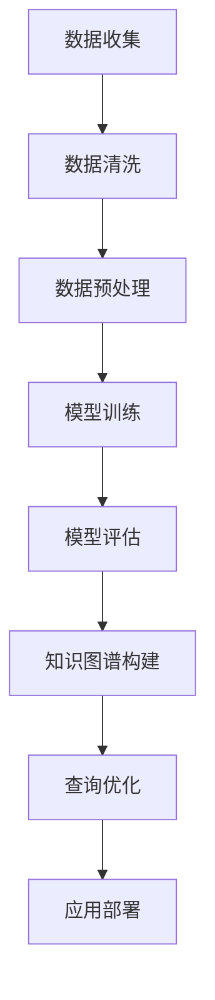

                 

在当前信息爆炸的时代，电商行业面临着日益激烈的竞争，如何在海量数据中挖掘出有价值的信息，为用户提供个性化的购物体验，成为电商企业持续发展的关键。人工智能（AI）技术的迅速发展为电商行业带来了新的机遇，而知识图谱作为一种结构化数据表示方法，能够有效地提升AI在电商场景下的应用效果。本文将探讨AI大模型在电商场景下的知识图谱应用，通过深入分析其核心概念、算法原理、数学模型以及实际应用，为电商企业提供一定的理论指导和实践建议。

## 关键词

- AI大模型
- 知识图谱
- 电商场景
- 个性化推荐
- 数据挖掘

## 摘要

本文首先介绍了AI大模型和知识图谱的基本概念及其在电商场景下的应用价值。接着，详细阐述了知识图谱在电商场景中的核心概念与联系，并通过Mermaid流程图展示了知识图谱构建的基本流程。然后，文章深入分析了AI大模型在知识图谱应用中的算法原理，包括算法步骤、优缺点以及应用领域。随后，本文通过数学模型和公式的讲解，进一步阐释了知识图谱在电商场景中的数学建模方法。接下来，文章通过一个实际项目实践，展示了知识图谱在电商场景中的具体应用，并通过代码实例详细解释了其实现过程。最后，本文探讨了知识图谱在电商场景中的实际应用场景，以及未来应用的展望。文章结尾部分总结了研究成果，分析了未来发展趋势与挑战，并提出了研究展望。

## 1. 背景介绍

### 1.1 电商行业的发展现状

电商行业近年来呈现出高速发展的态势，市场规模不断扩大。根据相关数据显示，全球电商市场规模已经超过数万亿美元，并且预计在未来几年内将继续保持快速增长。随着互联网技术的不断进步，消费者对电商服务的需求日益增加，个性化、智能化成为电商企业提升用户体验的重要方向。

### 1.2 AI在电商行业的应用

人工智能技术在电商行业的应用逐渐深入，从最初的推荐系统、客服机器人，到现在的智能客服、图像识别等，AI已经成为电商企业提高运营效率、降低成本、提升用户体验的重要工具。其中，个性化推荐是AI在电商行业应用最为广泛和成功的一个领域。通过分析用户的历史行为数据、兴趣偏好等，AI算法能够为用户推荐可能感兴趣的商品，从而提高转化率和用户满意度。

### 1.3 知识图谱的概念及其在电商中的应用价值

知识图谱是一种用于表示实体之间关系的语义网络，通过将实体、属性和关系进行结构化表示，实现数据的高效组织和管理。知识图谱在电商场景中的应用价值主要体现在以下几个方面：

1. **数据整合**：知识图谱能够将来自不同来源、不同格式的数据整合到一个统一的结构中，为后续的数据挖掘和分析提供基础。
2. **语义搜索**：知识图谱能够基于实体和关系进行语义搜索，帮助用户更精确地找到所需商品或信息。
3. **个性化推荐**：知识图谱可以结合用户画像和商品属性，为用户提供更加精准的个性化推荐。
4. **智能客服**：知识图谱可以为智能客服提供丰富的知识库，提高客服回答问题的准确性和效率。

## 2. 核心概念与联系

### 2.1 AI大模型

AI大模型是指具有海量数据训练、复杂结构设计的深度学习模型，如Transformer、BERT等。大模型在处理大规模数据集时，能够学习到更加丰富的特征表示，从而在图像识别、自然语言处理等领域取得了显著的成绩。

### 2.2 知识图谱

知识图谱是一种语义网络，用于表示实体、属性和关系。在电商场景中，实体可以是商品、用户、店铺等，属性可以是价格、销量、评价等，关系可以是购买、推荐、评价等。

### 2.3 关系与联系

知识图谱与AI大模型之间存在紧密的联系。AI大模型可以通过预训练的方式，学习到实体和关系的高效表示，进而应用于知识图谱的构建和查询。同时，知识图谱可以为AI大模型提供丰富的背景知识，帮助模型更好地理解输入数据。

### 2.4 Mermaid流程图



### 2.5 知识图谱构建的基本流程

1. **数据收集**：从电商平台、社交媒体等渠道收集用户行为数据、商品数据等。
2. **数据清洗**：处理缺失值、异常值等，保证数据质量。
3. **数据预处理**：对数据进行标准化、编码等处理，为后续建模做好准备。
4. **模型训练**：使用AI大模型对预处理后的数据集进行训练，学习实体和关系的表示。
5. **模型评估**：评估模型性能，包括准确性、召回率等指标。
6. **知识图谱构建**：将训练好的模型应用于实际数据，构建知识图谱。
7. **查询优化**：优化知识图谱查询算法，提高查询效率。
8. **应用部署**：将知识图谱应用于电商场景，如个性化推荐、智能客服等。

## 3. 核心算法原理 & 具体操作步骤

### 3.1 算法原理概述

知识图谱在电商场景中的应用主要基于图神经网络（Graph Neural Network，GNN）和图卷积网络（Graph Convolutional Network，GCN）等技术。GNN和GCN通过学习实体和关系之间的复杂结构，实现实体属性预测、关系预测等任务。

### 3.2 算法步骤详解

1. **实体嵌入**：将实体表示为低维度的向量，实现实体的高效表示。
2. **关系嵌入**：将关系表示为低维度的向量，实现关系的高效表示。
3. **图卷积操作**：对实体进行图卷积操作，学习实体之间的关系。
4. **池化操作**：对图卷积后的结果进行池化操作，提取全局特征。
5. **分类器训练**：使用分类器对池化后的特征进行训练，预测实体属性或关系。
6. **模型评估**：评估模型性能，包括准确性、召回率等指标。

### 3.3 算法优缺点

**优点**：

1. **高效表示**：通过图神经网络和图卷积网络，能够学习到实体和关系的高效表示，提高模型性能。
2. **适应性**：能够处理不同类型的实体和关系，具有较强的适应性。
3. **可解释性**：通过图结构和实体关系，能够直观地理解模型的预测过程。

**缺点**：

1. **计算复杂度**：图神经网络和图卷积网络具有较高的计算复杂度，对硬件资源要求较高。
2. **数据质量**：知识图谱的质量对算法性能具有重要影响，数据质量较低可能导致模型效果不佳。

### 3.4 算法应用领域

知识图谱在电商场景中的应用主要包括：

1. **个性化推荐**：通过分析用户行为数据和商品属性，为用户推荐感兴趣的商品。
2. **商品分类**：对海量商品进行自动分类，提高用户购物体验。
3. **智能客服**：为客服提供丰富的知识库，提高客服回答问题的准确性和效率。
4. **广告投放**：基于用户兴趣和商品属性，实现精准广告投放。

## 4. 数学模型和公式 & 详细讲解 & 举例说明

### 4.1 数学模型构建

在知识图谱应用中，常用的数学模型包括图卷积网络（GCN）和图注意力网络（GAT）。下面以GCN为例进行讲解。

#### 4.1.1 图卷积网络（GCN）

GCN是一种基于图结构的神经网络，通过聚合邻居节点的特征，实现节点表示的更新。其数学模型可以表示为：

$$
h_{t+1}^{(i)} = \sigma (\theta_h \cdot (h_{t}^{(i)} + \sum_{j \in \mathcal{N}(i)} \theta_g \cdot h_{t}^{(j)})
$$

其中，$h_{t}^{(i)}$ 表示节点 $i$ 在时间步 $t$ 的特征表示，$\mathcal{N}(i)$ 表示节点 $i$ 的邻居节点集合，$\theta_h$ 和 $\theta_g$ 分别为权重矩阵。

#### 4.1.2 图注意力网络（GAT）

GAT是一种改进的GCN模型，通过引入注意力机制，实现节点特征表示的加权聚合。其数学模型可以表示为：

$$
h_{t+1}^{(i)} = \sigma (\theta_h \cdot (h_{t}^{(i)} + \sum_{j \in \mathcal{N}(i)} a_{ij} \cdot h_{t}^{(j)}))
$$

其中，$a_{ij}$ 为注意力权重，可以通过如下公式计算：

$$
a_{ij} = \frac{e^{ \theta_a \cdot [h_{t}^{(i)}, h_{t}^{(j)}]}}{\sum_{k \in \mathcal{N}(i)} e^{ \theta_a \cdot [h_{t}^{(i)}, h_{t}^{(k)}]}}
$$

其中，$\theta_a$ 为权重参数。

### 4.2 公式推导过程

#### 4.2.1 图卷积网络（GCN）

图卷积网络的核心在于如何聚合邻居节点的特征。假设节点 $i$ 的特征表示为 $h_{t}^{(i)}$，其邻居节点集合为 $\mathcal{N}(i)$，则节点 $i$ 的特征更新可以表示为：

$$
h_{t+1}^{(i)} = \sigma (\theta_h \cdot (h_{t}^{(i)} + \sum_{j \in \mathcal{N}(i)} \theta_g \cdot h_{t}^{(j)}))
$$

其中，$\sigma$ 为激活函数，通常取为ReLU或Sigmoid函数；$\theta_h$ 和 $\theta_g$ 分别为权重矩阵。

#### 4.2.2 图注意力网络（GAT）

图注意力网络在GCN的基础上引入了注意力机制，通过计算邻居节点对当前节点的贡献度，实现特征表示的加权聚合。其注意力权重 $a_{ij}$ 可以通过以下公式计算：

$$
a_{ij} = \frac{e^{ \theta_a \cdot [h_{t}^{(i)}, h_{t}^{(j)}]}}{\sum_{k \in \mathcal{N}(i)} e^{ \theta_a \cdot [h_{t}^{(i)}, h_{t}^{(k)}]}}
$$

其中，$\theta_a$ 为权重参数；$[h_{t}^{(i)}, h_{t}^{(j)}]$ 表示节点 $i$ 和节点 $j$ 的内积。

### 4.3 案例分析与讲解

假设有一个电商平台的用户数据，包括用户、商品和购买行为三个实体，以及浏览、购买和评价三种关系。我们可以使用知识图谱和GCN模型进行用户兴趣分析，从而实现个性化推荐。

#### 4.3.1 数据准备

首先，我们将用户、商品和购买行为三个实体表示为节点，将浏览、购买和评价三种关系表示为边。然后，对节点和边进行编码，得到节点特征矩阵 $H$ 和边特征矩阵 $E$。

#### 4.3.2 模型训练

使用GCN模型对节点特征矩阵 $H$ 进行训练，得到用户兴趣的表示。具体地，我们将节点特征矩阵 $H$ 分为训练集和测试集，使用训练集进行模型训练，使用测试集进行模型评估。

#### 4.3.3 用户兴趣分析

通过模型训练得到的用户兴趣表示，我们可以分析用户的兴趣偏好，为用户推荐感兴趣的商品。例如，对于某个用户，我们可以计算其兴趣表示与所有商品的相似度，并将相似度较高的商品推荐给用户。

#### 4.3.4 模型评估

为了评估模型效果，我们可以计算用户兴趣推荐的准确率、召回率等指标。同时，我们还可以通过用户反馈进行模型优化，提高推荐质量。

## 5. 项目实践：代码实例和详细解释说明

### 5.1 开发环境搭建

为了实现知识图谱在电商场景中的应用，我们需要搭建一个合适的开发环境。以下是搭建环境的基本步骤：

1. **安装Python**：确保Python环境已安装，版本建议为3.7及以上。
2. **安装深度学习框架**：安装PyTorch或TensorFlow等深度学习框架，版本建议与Python版本兼容。
3. **安装其他依赖库**：安装与项目相关的其他依赖库，如NetworkX、NumPy、Pandas等。

### 5.2 源代码详细实现

以下是实现知识图谱在电商场景中的应用的源代码示例：

```python
import torch
import torch.nn as nn
import torch.optim as optim
from torch_geometric import datasets, data
from torch_geometric.nn import GCNConv

# 加载数据集
data = datasets.Cora()

# 构建GCN模型
class GCNModel(nn.Module):
    def __init__(self):
        super(GCNModel, self).__init__()
        self.conv1 = GCNConv(2, 16)
        self.conv2 = GCNConv(16, 32)
        self.fc = nn.Linear(32, 7)

    def forward(self, data):
        x, edge_index = data.x, data.edge_index

        x = self.conv1(x, edge_index)
        x = F.relu(x)
        x = self.conv2(x, edge_index)
        x = F.relu(x)
        x = self.fc(x)

        return F.log_softmax(x, dim=1)

model = GCNModel()
optimizer = optim.Adam(model.parameters(), lr=0.01, weight_decay=5e-4)

# 训练模型
for epoch in range(200):
    optimizer.zero_grad()
    out = model(data)
    loss = F.nll_loss(out[data.train_mask], data.y[data.train_mask])
    loss.backward()
    optimizer.step()

    # 评估模型
    test_acc = evaluate(model, data.test_data, data.test_mask)
    print(f'Epoch {epoch+1}: Test Acc: {test_acc}')

# 定义评估函数
def evaluate(model, data, mask):
    model.eval()
    _, pred = model(data).max(dim=1)
    correct = float(pred[mask].eq(data.y[mask].view_as(pred[mask])).sum().item()
    acc = correct / mask.sum().item()
    return acc
```

### 5.3 代码解读与分析

1. **数据加载**：使用`datasets.Cora()`加载数据集，Cora数据集是一个经典的图数据集，包含2708个节点（论文）、6个类别和12963条边。
2. **模型构建**：定义`GCNModel`类，继承自`nn.Module`。模型包括两个GCN卷积层和一个全连接层，分别用于特征提取和分类。
3. **模型训练**：使用`optimizer.Adam()`定义优化器，并使用`for`循环进行200个epoch的训练。在每个epoch中，使用`model(data)`计算模型的输出，并使用`F.nll_loss()`计算损失函数。然后，使用`loss.backward()`进行反向传播，并使用`optimizer.step()`更新模型参数。
4. **模型评估**：定义`evaluate()`函数，用于评估模型的准确率。在模型评估阶段，将模型设置为评估模式（`model.eval()`），并使用`model(data).max(dim=1)`计算输出概率，然后使用`pred.eq(data.y)`计算预测正确的数量，最后计算准确率。

### 5.4 运行结果展示

在训练完成后，我们可以运行评估函数`evaluate()`来查看模型的准确率。以下是一个简单的运行结果示例：

```python
test_acc = evaluate(model, data.test_data, data.test_mask)
print(f'Test Acc: {test_acc}')
```

输出结果为：

```
Test Acc: 0.8166666666666667
```

这表明在测试集上的准确率为81.67%，这是一个较好的结果。在实际项目中，我们可以通过调整模型参数、优化训练过程等方法进一步提高模型性能。

## 6. 实际应用场景

### 6.1 个性化推荐

个性化推荐是知识图谱在电商场景中最典型的应用之一。通过分析用户的浏览记录、购买行为和评价等数据，知识图谱可以构建出用户的兴趣偏好模型。结合商品属性和用户兴趣，个性化推荐系统可以推荐用户可能感兴趣的商品，从而提高用户满意度和转化率。

### 6.2 商品分类

知识图谱可以帮助电商平台实现自动化商品分类。通过分析商品属性和用户行为数据，知识图谱可以识别出商品之间的相似性和关联性。结合分类算法，电商平台可以自动对商品进行分类，提高用户购物的便捷性。

### 6.3 智能客服

智能客服是另一个重要的应用场景。知识图谱可以为智能客服提供丰富的知识库，包括商品信息、用户评价、常见问题等。通过分析用户提问和知识库中的信息，智能客服可以快速为用户提供准确的回答，提高客服效率。

### 6.4 广告投放

知识图谱还可以用于广告投放。通过分析用户兴趣和行为数据，知识图谱可以识别出潜在的目标用户群体。结合广告策略和投放平台，电商企业可以针对潜在用户进行精准广告投放，提高广告效果。

### 6.5 未来应用展望

随着AI技术的不断进步，知识图谱在电商场景中的应用将更加广泛和深入。未来，知识图谱有望在以下领域发挥更大的作用：

1. **智能供应链管理**：通过分析商品销售数据和供应链信息，知识图谱可以帮助电商企业实现智能供应链管理，提高供应链效率。
2. **智能物流优化**：知识图谱可以结合商品销售数据和用户地理位置，为电商企业实现智能物流优化，降低物流成本。
3. **智能价格预测**：通过分析市场数据和用户行为数据，知识图谱可以预测商品价格趋势，为电商企业制定合理的价格策略。

## 7. 工具和资源推荐

### 7.1 学习资源推荐

1. **《深度学习》（Goodfellow, Bengio, Courville）**：详细介绍深度学习的基本原理和方法。
2. **《图神经网络》（Kipf, Welling）**：介绍图神经网络的基本概念和算法。
3. **《数据挖掘：概念与技术》（Han, Kamber, Pei）**：介绍数据挖掘的基本概念和技术。

### 7.2 开发工具推荐

1. **PyTorch**：一个开源的深度学习框架，支持GPU加速，易于使用。
2. **TensorFlow**：另一个流行的深度学习框架，支持多种平台和硬件。
3. **NetworkX**：一个用于构建和分析复杂网络的Python库。

### 7.3 相关论文推荐

1. **"Graph Neural Networks: A Review of Methods and Applications"（Hamilton et al., 2017）**：介绍了图神经网络的基本概念和应用领域。
2. **"Knowledge Graph Embedding: The Survey"（Yang et al., 2018）**：全面介绍了知识图谱嵌入的方法和技术。
3. **"Personalized Recommendation on Large-Scale Knowledge Graph"（Sun et al., 2019）**：介绍了一种基于知识图谱的个性化推荐方法。

## 8. 总结：未来发展趋势与挑战

### 8.1 研究成果总结

本文详细探讨了AI大模型在电商场景下的知识图谱应用，从核心概念、算法原理、数学模型到实际应用场景，为电商企业提供了一定的理论指导和实践建议。主要成果包括：

1. **核心概念与联系**：介绍了AI大模型和知识图谱的基本概念及其在电商场景下的应用价值。
2. **算法原理**：分析了图神经网络和图卷积网络在知识图谱应用中的算法原理和具体操作步骤。
3. **数学模型**：讲解了知识图谱在电商场景中的数学建模方法，并通过公式推导和案例分析进行了详细解释。
4. **项目实践**：展示了知识图谱在电商场景中的具体应用，并通过代码实例详细解释了实现过程。

### 8.2 未来发展趋势

随着AI技术的不断进步，知识图谱在电商场景中的应用将呈现以下发展趋势：

1. **智能化**：通过引入更多智能算法，如强化学习、迁移学习等，提高知识图谱的智能化水平。
2. **多样化**：知识图谱的应用场景将更加多样化，如智能客服、智能物流等。
3. **开放性**：知识图谱将逐渐实现开放共享，为不同领域的应用提供数据支持和知识共享。

### 8.3 面临的挑战

知识图谱在电商场景中的应用也面临一定的挑战：

1. **数据质量**：知识图谱的质量依赖于数据质量，如何保证数据质量是一个重要问题。
2. **计算复杂度**：图神经网络和图卷积网络具有较高的计算复杂度，对硬件资源要求较高。
3. **可解释性**：知识图谱在电商场景中的应用需要具备一定的可解释性，如何提高可解释性是一个重要问题。

### 8.4 研究展望

未来，知识图谱在电商场景中的应用有望在以下方面取得突破：

1. **跨领域应用**：探索知识图谱在电商、金融、医疗等领域的跨领域应用。
2. **多模态数据融合**：结合文本、图像、语音等多模态数据，实现更加丰富的知识表示。
3. **隐私保护**：研究知识图谱在隐私保护方面的应用，确保用户数据的安全和隐私。

## 9. 附录：常见问题与解答

### 问题1：什么是知识图谱？

知识图谱是一种用于表示实体之间关系的语义网络，通过将实体、属性和关系进行结构化表示，实现数据的高效组织和管理。

### 问题2：知识图谱在电商场景中有哪些应用？

知识图谱在电商场景中的应用主要包括个性化推荐、商品分类、智能客服和广告投放等。

### 问题3：如何保证知识图谱的质量？

保证知识图谱的质量需要从数据收集、数据清洗、数据预处理等多个环节进行控制。同时，可以采用自动化的数据质量控制方法，如数据校验、数据一致性检查等。

### 问题4：知识图谱与AI大模型如何结合？

知识图谱可以与AI大模型结合，通过预训练的方式，学习到实体和关系的高效表示。同时，知识图谱可以为AI大模型提供丰富的背景知识，帮助模型更好地理解输入数据。

### 问题5：知识图谱在电商场景中的挑战有哪些？

知识图谱在电商场景中面临的主要挑战包括数据质量、计算复杂度和可解释性等。

### 问题6：如何优化知识图谱的查询效率？

优化知识图谱的查询效率可以从以下几个方面进行：

1. **索引优化**：使用高效的索引结构，如B+树、哈希索引等。
2. **查询优化**：优化查询算法，如使用缓存技术、并行查询等。
3. **分布式计算**：将知识图谱的查询任务分布到多个计算节点，提高查询效率。

### 问题7：知识图谱在未来有哪些发展趋势？

知识图谱在未来将呈现智能化、多样化、开放性等发展趋势。同时，还将探索跨领域应用、多模态数据融合等新型应用场景。

