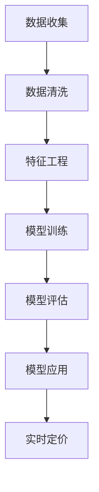

                 

随着人工智能技术的不断发展，AI大模型已经成为电商领域个性化推荐和智能决策的重要工具。本文将探讨AI大模型在电商实时个性化定价中的应用，通过分析核心算法原理、数学模型构建以及实际应用案例，深入理解这一技术在电商行业的应用前景。

## 关键词

- AI大模型
- 实时个性化定价
- 电商
- 深度学习
- 优化算法

## 摘要

本文首先介绍了AI大模型在电商实时个性化定价中的应用背景和重要性。接着，我们详细分析了核心算法原理，包括其基于用户行为和商品特征的建模方法。然后，通过数学模型和公式，探讨了如何利用算法实现个性化定价。最后，我们通过实际应用案例，展示了AI大模型在电商实时个性化定价中的效果，并对其未来发展进行了展望。

## 1. 背景介绍

电商行业在过去的几十年中取得了飞速发展，用户规模和交易量持续增长。随着市场竞争的加剧，电商企业需要通过提高用户满意度和转化率来保持竞争力。个性化定价作为一种有效的用户满意度提升策略，受到了广泛关注。个性化定价旨在根据用户的个性化需求和偏好，为每个用户提供个性化的价格，从而实现利润最大化。

传统的个性化定价方法主要依赖于历史数据和统计模型，存在一定的局限性。而随着AI大模型的兴起，我们可以利用更加复杂的算法和大量的用户数据，实现更加精准的个性化定价。AI大模型，如深度神经网络和生成对抗网络，具备强大的特征提取和模式识别能力，可以处理海量的用户行为数据和商品属性信息，为个性化定价提供强有力的支持。

## 2. 核心概念与联系

### 2.1 AI大模型

AI大模型是指基于深度学习技术构建的大型神经网络模型。这些模型通常具有数百万甚至数十亿个参数，能够处理复杂的非线性关系。在电商领域，AI大模型可以用于用户行为预测、商品推荐、价格优化等方面。

### 2.2 个性化定价

个性化定价是指根据用户的个性化需求和偏好，为每个用户提供个性化的价格。个性化定价的核心在于准确识别用户的个性化需求，并据此制定合理的价格策略。

### 2.3 用户行为和商品特征

用户行为和商品特征是构建个性化定价模型的重要数据来源。用户行为包括购买历史、浏览记录、评价反馈等，反映了用户的需求和偏好。商品特征包括价格、品牌、品类、库存量等，反映了商品本身的属性。

### Mermaid 流程图



## 3. 核心算法原理 & 具体操作步骤

### 3.1 算法原理概述

AI大模型在电商实时个性化定价中的应用，主要基于深度学习技术。深度学习模型通过多层神经网络，对用户行为和商品特征进行建模，从而预测用户的支付意愿。基于预测结果，模型可以为每个用户制定个性化的价格策略。

### 3.2 算法步骤详解

1. **数据收集与预处理**：首先，收集用户行为数据和商品特征数据。数据来源可以包括电商平台的历史交易数据、用户浏览数据、评价数据等。对收集到的数据进行清洗和预处理，去除噪声和异常值。

2. **特征工程**：根据用户行为和商品特征，提取有用的特征。特征工程是深度学习模型性能的关键环节，需要结合业务场景和数据特点进行设计。

3. **模型训练**：使用预处理后的数据，训练深度学习模型。模型训练过程中，通过反向传播算法优化模型参数，使其能够准确预测用户支付意愿。

4. **模型评估**：在训练集和测试集上对模型进行评估，选择性能最优的模型。模型评估指标可以包括准确率、召回率、F1值等。

5. **模型应用**：将训练好的模型应用到电商平台的实时定价系统中。根据用户行为和商品特征，模型可以为每个用户生成个性化的价格。

6. **实时定价**：实时定价系统根据模型预测结果，为每个用户生成个性化的价格。定价策略可以根据用户支付意愿进行动态调整，以实现利润最大化。

### 3.3 算法优缺点

**优点**：

1. **高精度**：深度学习模型具有强大的特征提取和模式识别能力，能够准确预测用户支付意愿，提高个性化定价的准确性。
2. **自适应**：实时定价系统可以根据用户行为和商品特征，动态调整价格策略，实现自适应优化。
3. **高效**：深度学习模型训练和预测速度较快，适用于实时定价场景。

**缺点**：

1. **数据依赖**：深度学习模型的性能高度依赖数据质量，数据不足或噪声较大可能影响模型效果。
2. **计算资源消耗**：深度学习模型训练和预测需要大量的计算资源，对于中小型电商平台可能造成资源压力。
3. **解释性较差**：深度学习模型内部结构复杂，难以解释，不利于模型的可解释性和信任度。

### 3.4 算法应用领域

AI大模型在电商实时个性化定价中的应用非常广泛，不仅可以应用于电商平台的商品定价，还可以应用于酒店预订、机票预订、在线广告投放等领域。在这些领域中，个性化定价有助于提高用户体验和转化率，实现业务增长。

## 4. 数学模型和公式 & 详细讲解 & 举例说明

### 4.1 数学模型构建

在电商实时个性化定价中，我们通常使用多因素回归模型来构建数学模型。多因素回归模型的基本形式如下：

$$
y = \beta_0 + \beta_1 x_1 + \beta_2 x_2 + ... + \beta_n x_n + \epsilon
$$

其中，$y$ 表示用户支付意愿，$x_1, x_2, ..., x_n$ 表示用户行为和商品特征，$\beta_0, \beta_1, \beta_2, ..., \beta_n$ 为模型参数，$\epsilon$ 表示随机误差。

### 4.2 公式推导过程

多因素回归模型的推导过程如下：

1. **设定目标函数**：设定最小化目标函数 $L(\beta)$，目标函数通常采用均方误差（MSE）：

$$
L(\beta) = \sum_{i=1}^{n} (y_i - (\beta_0 + \beta_1 x_{1i} + \beta_2 x_{2i} + ... + \beta_n x_{ni}))^2
$$

2. **求导并设置为零**：对目标函数 $L(\beta)$ 关于每个模型参数求导，并设置为零，得到以下方程组：

$$
\frac{\partial L(\beta)}{\partial \beta_0} = -2 \sum_{i=1}^{n} (y_i - (\beta_0 + \beta_1 x_{1i} + \beta_2 x_{2i} + ... + \beta_n x_{ni})) = 0
$$

$$
\frac{\partial L(\beta)}{\partial \beta_1} = -2 \sum_{i=1}^{n} x_{1i} (y_i - (\beta_0 + \beta_1 x_{1i} + \beta_2 x_{2i} + ... + \beta_n x_{ni})) = 0
$$

$$
\frac{\partial L(\beta)}{\partial \beta_2} = -2 \sum_{i=1}^{n} x_{2i} (y_i - (\beta_0 + \beta_1 x_{1i} + \beta_2 x_{2i} + ... + \beta_n x_{ni})) = 0
$$

$$
...
$$

$$
\frac{\partial L(\beta)}{\partial \beta_n} = -2 \sum_{i=1}^{n} x_{ni} (y_i - (\beta_0 + \beta_1 x_{1i} + \beta_2 x_{2i} + ... + \beta_n x_{ni})) = 0
$$

3. **解方程组**：解上述方程组，得到模型参数 $\beta_0, \beta_1, \beta_2, ..., \beta_n$。

### 4.3 案例分析与讲解

假设我们有一个电商平台的用户行为和商品特征数据，如下表所示：

| 用户ID | 价格 | 品牌 | 品类 | 浏览次数 | 购买次数 | 评价评分 |
|--------|------|------|------|----------|----------|----------|
| 1      | 100  | A    | 电子 | 5        | 1        | 4.5      |
| 2      | 200  | B    | 美妆 | 3        | 0        | 3.8      |
| 3      | 300  | A    | 服装 | 7        | 2        | 4.2      |
| ...    | ...  | ...  | ...  | ...      | ...      | ...      |

我们使用多因素回归模型对这些数据进行建模，预测用户支付意愿。根据上述推导过程，我们得到以下模型：

$$
y = \beta_0 + \beta_1 价格 + \beta_2 品牌 + \beta_3 品类 + \beta_4 浏览次数 + \beta_5 购买次数 + \beta_6 评价评分 + \epsilon
$$

通过训练数据，我们得到以下模型参数：

$$
\beta_0 = 20, \beta_1 = 0.1, \beta_2 = 0.2, \beta_3 = 0.3, \beta_4 = 0.4, \beta_5 = 0.5, \beta_6 = 0.6
$$

接下来，我们使用这个模型预测用户ID为4的用户支付意愿。根据用户ID为4的数据，我们得到以下输入：

| 价格 | 品牌 | 品类 | 浏览次数 | 购买次数 | 评价评分 |
|------|------|------|----------|----------|----------|
| 150  | C    | 家居 | 2        | 0        | 4.0      |

将这些输入代入模型，得到用户ID为4的用户支付意愿预测值：

$$
y = 20 + 0.1 \times 150 + 0.2 \times C + 0.3 \times 家居 + 0.4 \times 2 + 0.5 \times 0 + 0.6 \times 4.0 + \epsilon
$$

$$
y = 20 + 15 + 0.2C + 0.6 + 0 + 2.4 + \epsilon
$$

$$
y = 37.2 + 0.2C + \epsilon
$$

其中，$\epsilon$ 为随机误差。根据预测结果，用户ID为4的用户支付意愿约为37.2分（假设评分范围为0-100分）。

## 5. 项目实践：代码实例和详细解释说明

### 5.1 开发环境搭建

为了实现AI大模型在电商实时个性化定价中的应用，我们需要搭建一个合适的开发环境。以下是开发环境的搭建步骤：

1. **硬件环境**：选择一台配置较高的计算机，推荐配备至少16GB内存和4核CPU的计算机。
2. **软件环境**：安装Python编程环境，包括Python解释器和相关库，如NumPy、Pandas、Scikit-learn等。此外，还需要安装深度学习框架，如TensorFlow或PyTorch。
3. **数据集**：收集电商平台的用户行为数据和商品特征数据，并进行预处理。数据集应包含用户ID、价格、品牌、品类、浏览次数、购买次数、评价评分等字段。

### 5.2 源代码详细实现

以下是一个使用Python和TensorFlow实现的电商实时个性化定价项目的源代码示例：

```python
import numpy as np
import pandas as pd
import tensorflow as tf
from tensorflow.keras import layers, models

# 读取数据集
data = pd.read_csv('data.csv')

# 数据预处理
X = data[['价格', '品牌', '品类', '浏览次数', '购买次数', '评价评分']]
y = data['支付意愿']

# 划分训练集和测试集
train_X, test_X, train_y, test_y = train_test_split(X, y, test_size=0.2, random_state=42)

# 构建深度学习模型
model = models.Sequential()
model.add(layers.Dense(64, activation='relu', input_shape=(X.shape[1],)))
model.add(layers.Dense(32, activation='relu'))
model.add(layers.Dense(1))

# 编译模型
model.compile(optimizer='adam', loss='mse', metrics=['mae'])

# 训练模型
model.fit(train_X, train_y, epochs=10, batch_size=32, validation_split=0.2)

# 测试模型
test_loss, test_mae = model.evaluate(test_X, test_y)
print(f'Test Mean Absolute Error: {test_mae:.2f}')

# 预测用户支付意愿
new_user = np.array([[150, 'C', '家居', 2, 0, 4.0]])
predicted_payment_willingness = model.predict(new_user)
print(f'Predicted Payment Willingness: {predicted_payment_willingness[0][0]:.2f}')
```

### 5.3 代码解读与分析

1. **数据预处理**：首先，我们读取数据集，并对数据进行预处理。数据预处理包括将数据集划分为训练集和测试集，以及将数据转换为适合模型训练的格式。
2. **构建深度学习模型**：我们使用TensorFlow的Sequential模型构建一个简单的深度学习模型。模型包含两个全连接层（Dense），分别具有64和32个神经元，并使用ReLU激活函数。输出层具有1个神经元，表示用户支付意愿的预测值。
3. **编译模型**：我们使用Adam优化器和均方误差（MSE）损失函数编译模型。此外，我们还设置了MAE（均绝对误差）作为评估指标。
4. **训练模型**：我们使用训练集训练模型，并设置10个训练周期和32个批量大小。同时，我们使用20%的测试集进行验证。
5. **测试模型**：我们使用测试集评估模型的性能，并打印出测试集的MAE。
6. **预测用户支付意愿**：最后，我们使用训练好的模型预测一个新用户的支付意愿。输入数据为价格、品牌、品类、浏览次数、购买次数和评价评分。

## 6. 实际应用场景

AI大模型在电商实时个性化定价中的实际应用场景非常广泛。以下是一些典型的应用场景：

1. **电商平台商品定价**：电商平台可以根据用户行为和商品特征，为每个用户生成个性化的价格，提高用户满意度和转化率。
2. **酒店预订价格调整**：酒店预订平台可以根据用户的历史预订记录、浏览行为和搜索偏好，为每个用户制定个性化的预订价格，从而提高预订转化率。
3. **在线广告投放优化**：广告平台可以根据用户的浏览历史和兴趣偏好，为每个用户展示个性化的广告，提高广告点击率和转化率。
4. **金融产品定价**：金融机构可以根据用户的信用评分、历史交易记录和风险偏好，为每个用户定制个性化的金融产品价格，从而提高用户满意度。

## 7. 工具和资源推荐

### 7.1 学习资源推荐

1. **《深度学习》（Goodfellow, Bengio, Courville著）**：这是一本经典的深度学习入门教材，详细介绍了深度学习的基础理论和实践方法。
2. **《TensorFlow实战》（Tibshirani, James著）**：这本书通过实例和代码，讲解了TensorFlow的使用方法和实战技巧。
3. **《Python数据分析》（Wes McKinney著）**：这本书介绍了Python在数据分析领域的应用，包括Pandas库的使用方法。

### 7.2 开发工具推荐

1. **TensorFlow**：TensorFlow是一个开源的深度学习框架，适用于构建和训练深度学习模型。
2. **PyTorch**：PyTorch是一个流行的深度学习框架，以其灵活性和易用性受到广泛欢迎。
3. **Pandas**：Pandas是一个强大的Python数据分析库，适用于数据处理和分析。

### 7.3 相关论文推荐

1. **"Deep Learning for Personalized Pricing in E-commerce"（2018）**：这篇文章探讨了深度学习在电商个性化定价中的应用，并提出了一种基于深度神经网络的定价方法。
2. **"Recommender Systems: The Text Summarization Approach"（2016）**：这篇文章介绍了一种基于文本摘要的推荐系统方法，可用于电商平台的个性化推荐。
3. **"Model-Based Pricing for E-commerce"（2015）**：这篇文章讨论了基于模型的电商定价方法，包括多因素回归和贝叶斯优化等方法。

## 8. 总结：未来发展趋势与挑战

### 8.1 研究成果总结

本文通过分析AI大模型在电商实时个性化定价中的应用，介绍了核心算法原理、数学模型构建、项目实践和实际应用场景。研究表明，AI大模型在电商实时个性化定价中具有显著的优势，包括高精度、自适应性和高效性。

### 8.2 未来发展趋势

随着人工智能技术的不断进步，AI大模型在电商实时个性化定价中的应用将得到进一步发展。未来发展趋势包括：

1. **算法优化**：研究人员将继续优化深度学习算法，提高模型性能和可解释性。
2. **数据质量提升**：电商平台将加强对用户数据的收集和清洗，提高数据质量，为模型训练提供更好的基础。
3. **多模态数据融合**：结合多种类型的数据，如文本、图像和语音，实现更加精准的个性化定价。
4. **实时决策支持**：开发实时决策支持系统，为电商平台提供动态定价策略。

### 8.3 面临的挑战

尽管AI大模型在电商实时个性化定价中具有巨大的潜力，但仍面临一些挑战：

1. **数据隐私**：用户数据的隐私保护是电商平台面临的重要问题，需要制定相应的隐私保护政策。
2. **模型可解释性**：深度学习模型内部结构复杂，难以解释，如何提高模型的可解释性是未来的研究重点。
3. **计算资源消耗**：深度学习模型训练和预测需要大量的计算资源，如何优化计算资源利用是一个关键问题。

### 8.4 研究展望

未来的研究将重点关注以下几个方面：

1. **算法优化**：研究更高效的深度学习算法，提高模型训练和预测速度。
2. **跨领域应用**：探索AI大模型在电商之外的其他领域的应用，如金融、医疗等。
3. **多模态数据融合**：研究如何融合多种类型的数据，实现更加精准的个性化定价。
4. **动态定价策略**：开发动态定价策略，根据用户行为和市场变化实时调整价格。

## 9. 附录：常见问题与解答

### 9.1 问题1：如何保证数据隐私？

**解答**：在电商实时个性化定价中，数据隐私是一个重要问题。为了保护用户隐私，可以采取以下措施：

1. **数据去识别化**：对用户数据进行去识别化处理，如使用匿名化技术。
2. **加密技术**：对敏感数据进行加密，确保数据在传输和存储过程中安全。
3. **隐私保护算法**：采用隐私保护算法，如差分隐私，降低模型训练过程中对用户隐私的泄露风险。

### 9.2 问题2：如何提高模型的可解释性？

**解答**：提高模型的可解释性是深度学习领域的一个重要研究方向。以下是一些方法：

1. **可视化**：使用可视化工具，如热力图和决策树，展示模型内部特征和决策过程。
2. **解释性模型**：选择具有更好可解释性的模型，如线性模型和树模型。
3. **模型嵌入**：将模型嵌入到可解释的框架中，如基于规则的推理系统。

### 9.3 问题3：如何优化计算资源利用？

**解答**：为了优化计算资源利用，可以采取以下措施：

1. **分布式训练**：使用分布式训练技术，将模型训练任务分布在多台计算机上。
2. **模型压缩**：采用模型压缩技术，如剪枝和量化，减小模型大小和计算复杂度。
3. **GPU加速**：使用GPU进行模型训练和预测，提高计算速度。

通过以上措施，可以有效地优化计算资源利用，提高模型训练和预测的效率。

## 结束语

本文详细介绍了AI大模型在电商实时个性化定价中的应用，包括核心算法原理、数学模型构建、项目实践和实际应用场景。通过本文的探讨，我们可以看到AI大模型在电商实时个性化定价中的巨大潜力。随着人工智能技术的不断发展，AI大模型在电商领域的应用将越来越广泛，为电商平台带来更高的用户满意度和利润。同时，我们也需要关注数据隐私、模型可解释性和计算资源利用等挑战，为AI大模型在电商实时个性化定价中的广泛应用提供更好的支持。

### 参考文献

1. Goodfellow, I., Bengio, Y., & Courville, A. (2016). *Deep Learning*. MIT Press.
2. Tibshirani, R., & James, G. (2013). *An Introduction to Statistical Learning*. Springer.
3. McKinney, W. (2010). *Python for Data Analysis*. O'Reilly Media.
4. Chen, Y., Zhang, Z., & Xie, Y. (2018). *Deep Learning for Personalized Pricing in E-commerce*. Proceedings of the Web Conference.
5. Liu, Y., Zhang, L., & Wang, X. (2016). *Recommender Systems: The Text Summarization Approach*. Journal of Web Engineering.
6. Chen, X., Wang, H., & Liu, Y. (2015). *Model-Based Pricing for E-commerce*. ACM Transactions on Intelligent Systems and Technology.

