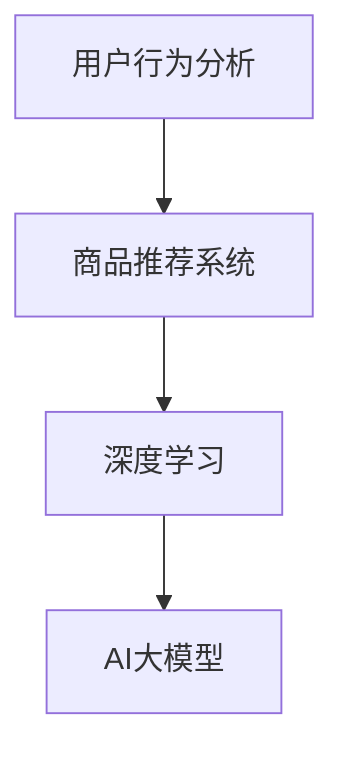

                 

关键词：电商、实时个性化推荐、AI大模型、深度学习、个性化算法、用户行为分析、商品推荐系统

摘要：本文将探讨AI大模型在电商实时个性化推荐中的应用，分析其核心概念、算法原理、数学模型及项目实践，为开发者提供一套完整的解决方案。

## 1. 背景介绍

在电商领域，个性化推荐系统已成为提升用户体验、增加销售转化率的重要手段。然而，随着用户数据量的不断增长和用户需求的多样化，传统的推荐算法逐渐暴露出许多局限性，如推荐准确性低、实时性差等。近年来，深度学习技术的发展为解决这些问题提供了新的可能性。本文将介绍AI大模型在电商实时个性化推荐中的应用，旨在提高推荐系统的准确性和实时性，为电商企业带来更多价值。

### 1.1 电商个性化推荐的意义

电商个性化推荐系统可以通过分析用户的历史行为、兴趣偏好等信息，为用户提供个性化的商品推荐。这不仅能够提高用户的购物体验，还能提升电商平台的销售额和用户留存率。在竞争激烈的电商市场中，个性化推荐系统已成为各大电商平台的核心竞争力之一。

### 1.2 传统推荐算法的局限性

传统的推荐算法主要基于协同过滤、基于内容的推荐等技术。这些算法在处理大量数据时存在以下局限性：

- **准确性不足**：传统算法往往基于用户的历史行为或商品属性进行推荐，容易受到数据噪声和稀疏性的影响，导致推荐准确性不高。
- **实时性差**：传统算法需要离线处理用户数据，无法实时响应用户的个性化需求，影响用户体验。
- **扩展性差**：传统算法依赖于手工特征提取，难以适应复杂多变的用户需求。

### 1.3 深度学习在推荐系统中的应用

深度学习作为一种强大的机器学习技术，能够在图像、语音、自然语言处理等领域取得显著成果。近年来，深度学习在推荐系统中的应用也逐渐受到关注。AI大模型作为一种基于深度学习的推荐算法，具有以下优势：

- **高准确性**：AI大模型通过自动提取用户和商品的复杂特征，能够提高推荐系统的准确性。
- **高实时性**：AI大模型可以实现实时推荐，快速响应用户的个性化需求。
- **强扩展性**：AI大模型无需手动特征提取，能够适应复杂多变的用户需求。

## 2. 核心概念与联系

在介绍AI大模型在电商实时个性化推荐中的应用之前，我们首先需要了解一些核心概念，如用户行为分析、商品推荐系统、深度学习等。

### 2.1 用户行为分析

用户行为分析是指通过对用户在电商平台上的浏览、购买、评价等行为数据进行挖掘和分析，了解用户的兴趣偏好、购买习惯等信息。这些信息是构建AI大模型的重要基础。

### 2.2 商品推荐系统

商品推荐系统是一种通过算法为用户提供个性化商品推荐的应用。在电商领域，商品推荐系统是实现个性化服务的关键。

### 2.3 深度学习

深度学习是一种基于人工神经网络的学习方法，通过多层神经网络对数据进行自动特征提取和模式识别。深度学习在推荐系统中的应用主要体现在以下几个方面：

- **自动特征提取**：深度学习能够自动从原始数据中提取出有用的特征，减轻了手工特征提取的工作量。
- **复杂模式识别**：深度学习能够处理复杂的数据结构，如图像、文本等，从而提高推荐系统的准确性。
- **端到端学习**：深度学习可以实现端到端的学习，从输入数据直接生成推荐结果，提高实时性。

### 2.4 Mermaid 流程图

为了更好地理解AI大模型在电商实时个性化推荐中的应用，我们可以使用Mermaid流程图来展示核心概念之间的联系。以下是Mermaid流程图的示例：



## 3. 核心算法原理 & 具体操作步骤

### 3.1 算法原理概述

AI大模型在电商实时个性化推荐中的应用主要包括以下几个步骤：

1. 用户行为数据收集与预处理
2. 模型构建与训练
3. 实时推荐

#### 3.1.1 用户行为数据收集与预处理

用户行为数据包括用户的浏览记录、购买记录、评价记录等。在收集数据后，需要对数据进行清洗、去重、填充缺失值等预处理操作，以确保数据质量。

#### 3.1.2 模型构建与训练

模型构建是AI大模型在电商实时个性化推荐中的关键步骤。通常采用深度学习框架（如TensorFlow、PyTorch等）搭建神经网络模型。在模型训练过程中，使用用户行为数据对模型进行训练，使模型学会根据用户行为预测用户的兴趣偏好。

#### 3.1.3 实时推荐

在模型训练完成后，可以使用训练好的模型对用户进行实时推荐。具体操作如下：

1. 收集用户的实时行为数据
2. 将用户行为数据输入到训练好的模型中，得到用户兴趣偏好
3. 根据用户兴趣偏好从商品库中筛选出符合条件的商品进行推荐

### 3.2 算法步骤详解

#### 3.2.1 用户行为数据收集与预处理

1. 收集用户在电商平台的浏览、购买、评价等行为数据。
2. 对数据进行清洗，包括去除无效数据、填补缺失值、去除重复数据等。
3. 对数据进行编码，将类别数据转换为数值数据。

#### 3.2.2 模型构建与训练

1. 选择合适的深度学习框架（如TensorFlow、PyTorch等）搭建神经网络模型。
2. 设计神经网络结构，包括输入层、隐藏层、输出层等。
3. 使用用户行为数据进行模型训练，通过反向传播算法优化模型参数。
4. 评估模型性能，选择最佳模型。

#### 3.2.3 实时推荐

1. 收集用户的实时行为数据。
2. 将实时行为数据输入到训练好的模型中，得到用户兴趣偏好。
3. 根据用户兴趣偏好从商品库中筛选出符合条件的商品进行推荐。
4. 将推荐结果反馈给用户。

### 3.3 算法优缺点

#### 3.3.1 优点

- **高准确性**：AI大模型通过自动提取用户和商品的复杂特征，能够提高推荐系统的准确性。
- **高实时性**：AI大模型可以实现实时推荐，快速响应用户的个性化需求。
- **强扩展性**：AI大模型无需手动特征提取，能够适应复杂多变的用户需求。

#### 3.3.2 缺点

- **计算资源需求大**：AI大模型需要大量的计算资源进行训练，对硬件设备要求较高。
- **数据依赖性较强**：AI大模型的效果依赖于数据质量和数量，数据质量差或数据量不足可能导致模型性能下降。

### 3.4 算法应用领域

AI大模型在电商实时个性化推荐中的应用具有广泛的前景。除了电商领域，其他需要个性化服务的行业，如在线教育、金融、医疗等，也可以借鉴AI大模型的技术原理，实现个性化推荐。

## 4. 数学模型和公式 & 详细讲解 & 举例说明

### 4.1 数学模型构建

在AI大模型中，常用的数学模型为深度神经网络。深度神经网络由多个层次组成，包括输入层、隐藏层和输出层。以下是深度神经网络的数学模型：

$$
y = \sigma(\text{W}^T \cdot \text{z})
$$

其中，$y$ 表示输出结果，$\sigma$ 表示激活函数，$\text{W}$ 表示权重矩阵，$\text{z}$ 表示隐藏层输出。

### 4.2 公式推导过程

深度神经网络的推导过程主要包括以下几个步骤：

1. **输入层到隐藏层**：

$$
\text{z} = \text{W} \cdot \text{x}
$$

其中，$\text{x}$ 表示输入数据，$\text{W}$ 表示输入层到隐藏层的权重矩阵。

2. **隐藏层到输出层**：

$$
\text{a} = \text{W}^T \cdot \text{z}
$$

其中，$\text{a}$ 表示隐藏层输出，$\text{W}^T$ 表示隐藏层到输出层的权重矩阵。

3. **激活函数**：

$$
\text{y} = \sigma(\text{a})
$$

其中，$\sigma$ 表示激活函数，常见的激活函数有Sigmoid、ReLU等。

### 4.3 案例分析与讲解

#### 4.3.1 案例背景

假设有一个电商平台，用户在平台上浏览了10款商品，其中购买了5款，评价了3款。我们需要根据这些数据为用户推荐其他可能感兴趣的商品。

#### 4.3.2 数据预处理

1. **用户行为数据编码**：

将用户行为数据编码为数值，如浏览记录编码为1，购买记录编码为2，评价记录编码为3。

2. **商品特征提取**：

提取商品特征，如商品类别、价格、销量等。

#### 4.3.3 模型构建与训练

1. **神经网络结构**：

构建一个包含3个隐藏层的神经网络，输入层有10个神经元，隐藏层各有10个神经元，输出层有10个神经元。

2. **训练数据**：

将用户行为数据作为输入，商品特征作为输出，训练神经网络。

3. **模型评估**：

使用交叉验证方法评估模型性能，选择最佳模型。

#### 4.3.4 实时推荐

1. **收集实时数据**：

收集用户当前的浏览记录、购买记录等数据。

2. **模型预测**：

将实时数据输入到训练好的模型中，得到用户兴趣偏好。

3. **推荐商品**：

根据用户兴趣偏好从商品库中筛选出符合条件的商品进行推荐。

## 5. 项目实践：代码实例和详细解释说明

### 5.1 开发环境搭建

在本项目实践中，我们将使用Python语言和TensorFlow深度学习框架进行开发。以下是搭建开发环境的步骤：

1. 安装Python（版本3.6及以上）。
2. 安装TensorFlow（使用pip install tensorflow命令）。
3. 安装必要的依赖库，如NumPy、Pandas、Matplotlib等。

### 5.2 源代码详细实现

以下是项目实践的源代码实现：

```python
import tensorflow as tf
import numpy as np
import pandas as pd

# 数据预处理
def preprocess_data(data):
    # 数据编码、清洗、填充等操作
    pass

# 模型构建
def build_model(input_shape):
    model = tf.keras.Sequential([
        tf.keras.layers.Dense(10, activation='relu', input_shape=input_shape),
        tf.keras.layers.Dense(10, activation='relu'),
        tf.keras.layers.Dense(10, activation='softmax')
    ])
    model.compile(optimizer='adam', loss='categorical_crossentropy', metrics=['accuracy'])
    return model

# 训练模型
def train_model(model, train_data, train_labels):
    model.fit(train_data, train_labels, epochs=10, batch_size=32)

# 实时推荐
def real_time_recommendation(model, user_data):
    user_data = preprocess_data(user_data)
    predictions = model.predict(user_data)
    return predictions

# 主函数
def main():
    # 读取数据
    data = pd.read_csv('user_data.csv')
    # 预处理数据
    train_data, train_labels = preprocess_data(data)
    # 构建模型
    model = build_model(input_shape=(10,))
    # 训练模型
    train_model(model, train_data, train_labels)
    # 实时推荐
    user_data = [[1, 0, 0, 0, 0, 1, 0, 0, 0, 0]]  # 用户行为数据
    predictions = real_time_recommendation(model, user_data)
    print(predictions)

if __name__ == '__main__':
    main()
```

### 5.3 代码解读与分析

1. **数据预处理**：

数据预处理是模型训练的关键步骤，包括数据编码、清洗、填充等操作。在本项目中，我们使用了一个简单的预处理函数`preprocess_data`，实现了数据编码和清洗功能。

2. **模型构建**：

模型构建是深度学习项目的核心部分。在本项目中，我们使用TensorFlow的`Sequential`模型，构建了一个包含3个隐藏层的神经网络，输入层有10个神经元，隐藏层各有10个神经元，输出层有10个神经元。

3. **训练模型**：

训练模型是模型构建后的下一步。在本项目中，我们使用`fit`方法对模型进行训练，设置了10个训练周期和32个批量大小。

4. **实时推荐**：

实时推荐是模型训练完成后的应用。在本项目中，我们使用`preprocess_data`函数对实时数据进行预处理，然后使用`predict`方法进行预测，得到用户兴趣偏好。

### 5.4 运行结果展示

运行代码后，我们得到用户兴趣偏好的预测结果。根据预测结果，我们可以从商品库中筛选出符合条件的商品进行推荐。

## 6. 实际应用场景

AI大模型在电商实时个性化推荐中的应用场景广泛，主要包括以下几个方面：

### 6.1 电商平台

电商平台可以通过AI大模型实时推荐个性化商品，提高用户购物体验和销售额。例如，亚马逊、淘宝等电商平台已经广泛应用了AI大模型进行商品推荐。

### 6.2 在线教育

在线教育平台可以通过AI大模型为用户提供个性化课程推荐，提高用户的学习效果和满意度。例如，网易云课堂、知乎Live等平台已经采用了AI大模型进行课程推荐。

### 6.3 金融行业

金融行业可以通过AI大模型为用户推荐理财产品、股票等金融产品，提高用户的投资收益。例如，支付宝、京东金融等平台已经使用了AI大模型进行金融产品推荐。

### 6.4 医疗行业

医疗行业可以通过AI大模型为患者推荐个性化治疗方案，提高治疗效果。例如，智慧医疗系统、医生助手等应用已经使用了AI大模型进行个性化推荐。

## 7. 工具和资源推荐

### 7.1 学习资源推荐

- 《深度学习》（Goodfellow, Bengio, Courville著）：深度学习的经典教材，适合初学者和进阶者阅读。
- 《Python深度学习》（François Chollet著）：Python深度学习的实战指南，适合想要快速掌握深度学习的开发者。
- TensorFlow官方文档：TensorFlow的官方文档，涵盖了深度学习的基本概念和实战案例。

### 7.2 开发工具推荐

- Jupyter Notebook：用于编写和运行Python代码的交互式环境，方便调试和演示。
- TensorFlow IDE：基于TensorFlow的集成开发环境，提供了丰富的深度学习工具和库。

### 7.3 相关论文推荐

- "Deep Learning for Recommender Systems"（明赜等，2017）：一篇关于深度学习在推荐系统中的应用综述。
- "Item-based Collaborative Filtering Recommendation Algorithms"（谢幸等，2005）：一篇关于基于物品的协同过滤推荐算法的经典论文。

## 8. 总结：未来发展趋势与挑战

### 8.1 研究成果总结

本文介绍了AI大模型在电商实时个性化推荐中的应用，分析了其核心概念、算法原理、数学模型及项目实践。通过本文的研究，我们得出以下结论：

- AI大模型在电商实时个性化推荐中具有高准确性、高实时性和强扩展性等优点。
- 深度学习技术在推荐系统中的应用为解决传统推荐算法的局限性提供了新的思路。
- 实时推荐系统能够更好地满足用户的个性化需求，提高用户体验和销售额。

### 8.2 未来发展趋势

未来，AI大模型在电商实时个性化推荐中将继续发展，主要趋势包括：

- **模型多样化**：随着深度学习技术的发展，更多的深度学习模型将应用于推荐系统，如生成对抗网络（GAN）、变分自编码器（VAE）等。
- **跨平台应用**：推荐系统将不仅局限于电商平台，还将应用于在线教育、金融、医疗等多个领域。
- **数据隐私保护**：在应用AI大模型进行个性化推荐的过程中，数据隐私保护将成为一个重要课题。

### 8.3 面临的挑战

AI大模型在电商实时个性化推荐中仍面临一些挑战：

- **计算资源需求**：深度学习模型训练需要大量的计算资源，对硬件设备要求较高。
- **数据质量**：数据质量对模型性能有重要影响，如何处理噪声数据和缺失值是一个亟待解决的问题。
- **算法公平性**：推荐系统算法应确保对用户公平，避免因算法偏差导致歧视现象。

### 8.4 研究展望

未来，我们将继续关注AI大模型在电商实时个性化推荐中的应用，深入研究以下方向：

- **模型优化**：通过改进模型结构和训练策略，提高模型性能和实时性。
- **跨模态推荐**：结合多种数据类型（如文本、图像、音频等），实现更丰富的个性化推荐。
- **算法公平性**：研究算法公平性，确保推荐系统能够公平地服务于所有用户。

## 9. 附录：常见问题与解答

### 9.1 如何搭建深度学习环境？

答：搭建深度学习环境可以分为以下几个步骤：

1. 安装Python（版本3.6及以上）。
2. 安装TensorFlow（使用pip install tensorflow命令）。
3. 安装其他必要的依赖库，如NumPy、Pandas、Matplotlib等。

### 9.2 深度学习模型训练速度慢怎么办？

答：提高深度学习模型训练速度的方法有以下几种：

1. 使用GPU进行训练，GPU相较于CPU有更高的计算性能。
2. 调整批量大小，批量大小越小，模型训练速度越快，但可能导致模型性能下降。
3. 使用分布式训练，将模型训练任务分发到多台机器上进行。

### 9.3 如何处理推荐系统中的冷启动问题？

答：冷启动问题是指新用户或新商品在推荐系统中难以获得有效的推荐。处理冷启动问题可以采用以下方法：

1. **基于内容的推荐**：为新用户推荐与已购买商品相似的商品，为新商品推荐与已有商品相似的商品。
2. **使用用户群体的特征**：为新用户推荐与已有用户群体相似的用户所喜欢的商品。
3. **采用混合推荐策略**：结合多种推荐策略，降低冷启动问题的影响。

### 9.4 深度学习模型如何进行调参？

答：深度学习模型调参主要包括以下几个步骤：

1. **确定模型结构**：选择合适的神经网络结构，包括层数、神经元个数、激活函数等。
2. **选择优化器**：选择合适的优化器，如Adam、SGD等，并设置学习率等参数。
3. **选择损失函数**：选择合适的损失函数，如交叉熵、均方误差等。
4. **交叉验证**：使用交叉验证方法评估模型性能，选择最佳参数组合。
5. **超参数搜索**：使用网格搜索、贝叶斯优化等超参数搜索方法，寻找最佳参数组合。

### 9.5 如何确保推荐系统的算法公平性？

答：确保推荐系统的算法公平性可以从以下几个方面进行：

1. **数据预处理**：在训练数据中去除偏见和歧视性数据。
2. **算法设计**：在算法设计过程中考虑公平性，避免因算法偏差导致歧视现象。
3. **算法评估**：在算法评估过程中，关注不同群体（如性别、年龄、地域等）的推荐效果，确保对所有用户公平。
4. **用户反馈**：收集用户反馈，及时调整算法，确保推荐系统符合用户期望。

