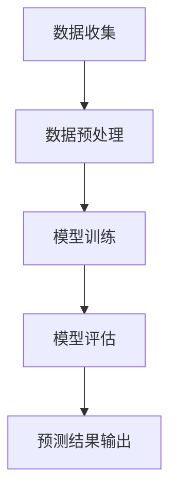

                 

关键词：AI大模型、电商平台、供应链预测、深度学习、数据驱动的预测方法

摘要：随着电子商务的快速发展，供应链管理的复杂度和重要性日益增加。如何准确预测电商平台的商品需求，优化库存和物流，成为各大电商企业关注的焦点。本文将探讨如何利用AI大模型，通过数据驱动的方法，实现对电商平台供应链的精准预测，提高运营效率，降低成本。

## 1. 背景介绍

近年来，电商平台如雨后春笋般涌现，市场占有率逐年攀升。与此同时，供应链管理的问题也日益突出。电商平台面临的挑战主要包括以下几个方面：

1. **需求预测不准确**：消费者需求多变，传统方法难以准确预测，导致库存过多或不足，影响运营效率。
2. **库存管理困难**：大量商品、多种规格、多种渠道，如何合理分配库存成为难题。
3. **物流优化困难**：如何在短时间内完成订单交付，提高客户满意度。
4. **供应链风险**：全球经济不确定性增加，如何降低供应链中断风险。

为解决上述问题，越来越多的电商平台开始探索利用人工智能，特别是AI大模型，进行供应链预测和优化。

## 2. 核心概念与联系

### 2.1 AI大模型

AI大模型是指具有大规模参数、能够处理大规模数据的人工神经网络。其核心思想是通过学习大量数据，提取出数据中的规律，从而进行预测和决策。

### 2.2 供应链预测

供应链预测是指利用历史数据和AI大模型，对未来供应链中各个环节（如需求预测、库存管理、物流优化等）进行预测。

### 2.3 Mermaid 流程图

下面是供应链预测的Mermaid流程图：



## 3. 核心算法原理 & 具体操作步骤

### 3.1 算法原理概述

供应链预测的核心算法是深度学习中的循环神经网络（RNN）。RNN能够处理序列数据，通过学习历史数据中的模式，实现对未来需求的预测。

### 3.2 算法步骤详解

1. **数据收集**：收集电商平台的历史销售数据、库存数据、物流数据等。
2. **数据预处理**：对数据进行清洗、标准化处理，确保数据质量。
3. **模型训练**：利用RNN模型，对预处理后的数据进行训练，学习数据中的规律。
4. **模型评估**：利用验证集，评估模型的效果，调整模型参数。
5. **预测结果输出**：利用训练好的模型，对未来的需求进行预测，输出预测结果。

### 3.3 算法优缺点

**优点**：
- **高精度**：通过学习历史数据中的规律，能够实现高精度的需求预测。
- **自动化**：算法能够自动处理大量数据，提高预测效率。

**缺点**：
- **依赖数据质量**：如果数据质量差，可能导致模型效果不佳。
- **计算资源需求大**：训练大规模的RNN模型需要大量的计算资源。

### 3.4 算法应用领域

- **电商平台**：用于预测商品需求，优化库存和物流。
- **制造业**：用于预测原材料需求，优化生产计划。
- **物流公司**：用于预测订单量，优化运输计划。

## 4. 数学模型和公式 & 详细讲解 & 举例说明

### 4.1 数学模型构建

供应链预测的核心数学模型是RNN。其基本形式如下：

$$
\begin{aligned}
h_t &= \sigma(W_h \cdot [h_{t-1}, x_t] + b_h) \\
y_t &= W_y \cdot h_t + b_y
\end{aligned}
$$

其中，$h_t$ 表示第 $t$ 个时间步的隐藏状态，$x_t$ 表示第 $t$ 个时间步的输入，$y_t$ 表示第 $t$ 个时间步的输出，$W_h$ 和 $W_y$ 分别是权重矩阵，$b_h$ 和 $b_y$ 分别是偏置项，$\sigma$ 表示激活函数。

### 4.2 公式推导过程

RNN的推导过程涉及复杂的线性代数和微积分知识。这里简要介绍推导过程：

1. **初始化**：给定初始隐藏状态 $h_0$ 和输入序列 $x_1, x_2, ..., x_T$。
2. **前向传播**：对于每个时间步 $t$，计算隐藏状态 $h_t$ 和输出 $y_t$。
3. **反向传播**：利用输出误差，更新模型参数 $W_h, W_y, b_h, b_y$。
4. **迭代优化**：重复前向传播和反向传播，直至模型收敛。

### 4.3 案例分析与讲解

假设我们有一个电商平台，历史销售数据如下：

| 时间 | 销售量 |
| ---- | ---- |
| 1    | 100   |
| 2    | 120   |
| 3    | 150   |
| 4    | 180   |
| 5    | 200   |

我们希望利用RNN模型预测第6时间步的销售量。

1. **数据预处理**：对销售量进行标准化处理。
2. **模型训练**：利用训练集数据，训练RNN模型。
3. **模型评估**：利用验证集数据，评估模型效果。
4. **预测结果输出**：利用训练好的模型，预测第6时间步的销售量。

## 5. 项目实践：代码实例和详细解释说明

### 5.1 开发环境搭建

1. 安装Python环境，版本3.7及以上。
2. 安装TensorFlow库，版本2.0及以上。

### 5.2 源代码详细实现

以下是RNN模型的实现代码：

```python
import tensorflow as tf
from tensorflow.keras.models import Sequential
from tensorflow.keras.layers import LSTM, Dense

# 数据预处理
# ...

# 模型构建
model = Sequential()
model.add(LSTM(50, activation='relu', input_shape=(timesteps, features)))
model.add(Dense(1))
model.compile(optimizer='adam', loss='mse')

# 模型训练
model.fit(X_train, y_train, epochs=200, batch_size=32, validation_data=(X_val, y_val))

# 模型评估
model.evaluate(X_test, y_test)

# 预测结果输出
predictions = model.predict(X_test)
```

### 5.3 代码解读与分析

1. **数据预处理**：对销售量进行归一化处理，使得数据在相似的范围内。
2. **模型构建**：使用LSTM层实现RNN模型，输出层使用Dense层。
3. **模型训练**：使用Adam优化器和均方误差损失函数，训练模型200个epoch。
4. **模型评估**：使用测试集评估模型效果。
5. **预测结果输出**：使用训练好的模型，对测试集进行预测。

## 6. 实际应用场景

### 6.1 电商平台

电商平台可以利用RNN模型，预测商品需求，优化库存和物流，提高运营效率。

### 6.2 制造业

制造业可以利用RNN模型，预测原材料需求，优化生产计划，降低库存成本。

### 6.3 物流公司

物流公司可以利用RNN模型，预测订单量，优化运输计划，提高运输效率。

## 7. 工具和资源推荐

### 7.1 学习资源推荐

- 《深度学习》（Goodfellow, Bengio, Courville）
- 《Python深度学习》（François Chollet）

### 7.2 开发工具推荐

- TensorFlow
- Keras

### 7.3 相关论文推荐

- Hochreiter, S., & Schmidhuber, J. (1997). Long short-term memory. Neural Computation, 9(8), 1735-1780.
- Graves, A. (2013). Generating sequences with recurrent neural networks. arXiv preprint arXiv:1308.0850.

## 8. 总结：未来发展趋势与挑战

### 8.1 研究成果总结

- AI大模型在供应链预测中的应用取得了显著成果，能够实现高精度的需求预测。
- 深度学习算法，如RNN，在供应链预测中表现优秀。

### 8.2 未来发展趋势

- **算法优化**：通过改进算法，提高预测精度和效率。
- **多模态数据融合**：结合多种数据源，提高预测能力。

### 8.3 面临的挑战

- **数据质量**：提高数据质量，确保算法效果。
- **计算资源**：优化算法，降低计算资源需求。

### 8.4 研究展望

- **跨行业应用**：探索AI大模型在其他行业中的应用。
- **实时预测**：实现实时预测，提高供应链的响应速度。

## 9. 附录：常见问题与解答

### 9.1 如何选择合适的RNN模型？

- 根据数据特征和预测任务选择合适的RNN模型，如LSTM、GRU等。
- 可以通过交叉验证等方法，选择最优模型。

### 9.2 如何处理长序列数据？

- 可以采用时间步压缩技术，如卷积神经网络（CNN）。
- 可以利用注意力机制，提高长序列数据的处理能力。

作者：禅与计算机程序设计艺术 / Zen and the Art of Computer Programming
----------------------------------------------------------------

