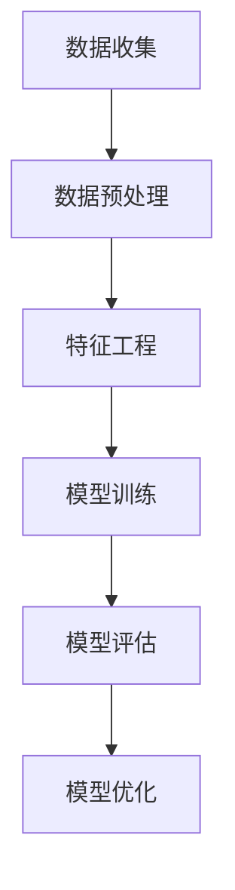

                 

关键词：人工智能、信用评分、大模型、电商平台、深度学习

## 摘要

本文旨在探讨人工智能大模型在电商平台信用评分系统中的应用。通过分析现有的信用评分系统面临的问题，我们提出了利用深度学习技术构建的大模型来解决这些问题。文章首先介绍了电商平台信用评分的背景和重要性，然后详细阐述了大模型的核心概念、算法原理和具体操作步骤，以及其在数学模型和公式中的应用。随后，文章通过一个具体的代码实例展示了大模型在电商平台信用评分系统中的实现过程。最后，文章讨论了该技术的实际应用场景、未来展望以及面临的挑战。

## 1. 背景介绍

在电子商务快速发展的今天，电商平台已经成为消费者购物的首选渠道。随着交易的频繁，电商平台需要建立一套有效的信用评分系统来评估用户的信用状况，从而降低交易风险，提高用户满意度。传统的信用评分系统主要依赖于用户的个人信息、交易历史、付款方式等数据进行评分，但这种模式存在诸多局限性。

### 1.1 传统信用评分系统的局限性

**数据依赖性高**：传统信用评分系统对用户数据的依赖性较高，用户数据的完整性和准确性直接影响评分结果。然而，电商平台用户数量庞大，数据量巨大，如何处理这些数据成为一个挑战。

**评分结果不准确**：由于传统评分系统主要依赖于历史数据，评分结果往往不能及时反映用户的最新信用状况。此外，某些异常情况，如用户的支付异常或账户被盗用，传统系统可能无法有效识别。

**模型更新滞后**：传统评分系统的模型更新周期较长，无法及时适应市场变化和用户行为的变化。这使得评分系统在快速变化的市场环境中显得滞后。

### 1.2 信用评分系统的重要性

**降低交易风险**：有效的信用评分系统可以帮助电商平台识别高风险用户，从而降低交易风险，保护平台和消费者的利益。

**提高用户满意度**：通过准确的信用评分，电商平台可以为用户提供更好的购物体验，增强用户信任和满意度。

**优化业务流程**：信用评分系统可以帮助电商平台优化业务流程，如自动审批、个性化推荐等，提高运营效率。

## 2. 核心概念与联系

在构建电商平台信用评分系统时，我们需要理解一些核心概念和联系。这些概念包括：数据预处理、特征工程、深度学习模型和评估指标。

### 2.1 数据预处理

数据预处理是构建信用评分系统的重要步骤。它包括数据清洗、数据整合和数据标准化等过程。数据清洗旨在去除无效数据、处理缺失值和异常值；数据整合则是将来自不同来源的数据进行整合，形成统一的评分数据集；数据标准化则是通过缩放或转换数据，使其具有可比性。

### 2.2 特征工程

特征工程是提高信用评分系统准确性的关键。它涉及从原始数据中提取和构建有助于模型预测的变量。有效的特征工程可以提高模型的性能，减少过拟合现象。

### 2.3 深度学习模型

深度学习模型是构建电商平台信用评分系统的核心。常见的深度学习模型包括卷积神经网络（CNN）、循环神经网络（RNN）和生成对抗网络（GAN）等。这些模型能够自动从数据中学习复杂的特征，从而提高评分的准确性。

### 2.4 评估指标

评估指标用于衡量信用评分系统的性能。常见的评估指标包括准确率、召回率、精确率和F1分数等。这些指标可以帮助我们判断模型是否能够准确预测用户的信用状况。

### 2.5 Mermaid 流程图

下面是一个使用 Mermaid 语法的流程图，展示了信用评分系统构建的基本步骤：



## 3. 核心算法原理 & 具体操作步骤

### 3.1 算法原理概述

深度学习模型在信用评分系统中的应用基于其强大的特征学习能力。通过训练大量的数据，模型可以自动学习用户的信用特征，从而实现对信用评分的预测。

### 3.2 算法步骤详解

**步骤1：数据收集**  
首先，我们需要收集电商平台的用户数据，包括用户的交易记录、支付行为、退货记录等。

**步骤2：数据预处理**  
对收集到的数据进行清洗、整合和标准化，以便后续的特征工程和模型训练。

**步骤3：特征工程**  
从预处理后的数据中提取和构建有助于模型预测的变量。这些变量包括用户的平均消费金额、消费频率、退货率等。

**步骤4：模型训练**  
选择一个合适的深度学习模型，如卷积神经网络（CNN）或循环神经网络（RNN），并使用训练数据对其进行训练。

**步骤5：模型评估**  
使用验证数据集对训练好的模型进行评估，以确定其性能。

**步骤6：模型优化**  
根据评估结果，对模型进行调整和优化，以提高其预测准确性。

### 3.3 算法优缺点

**优点**：  
- **强大的特征学习能力**：深度学习模型能够自动从数据中学习复杂的特征，从而提高评分的准确性。  
- **适应性强**：深度学习模型能够适应不同的数据集和业务场景，具有较好的泛化能力。

**缺点**：  
- **计算成本高**：深度学习模型训练需要大量的计算资源，特别是对于大型数据集。  
- **数据依赖性强**：模型的性能高度依赖于数据的质量和数量，数据质量问题可能导致模型失效。

### 3.4 算法应用领域

深度学习模型在电商平台信用评分系统中的应用非常广泛，除了电商平台，还适用于金融风控、网络安全等领域。

## 4. 数学模型和公式

在构建信用评分系统时，数学模型和公式起着关键作用。下面我们将介绍构建信用评分系统所需的数学模型和公式。

### 4.1 数学模型构建

信用评分系统的数学模型通常基于线性回归模型，其公式如下：

$$
\hat{y} = \beta_0 + \beta_1x_1 + \beta_2x_2 + ... + \beta_nx_n
$$

其中，$y$ 表示用户的信用评分，$x_1, x_2, ..., x_n$ 表示用户的各种特征，$\beta_0, \beta_1, \beta_2, ..., \beta_n$ 是模型的参数。

### 4.2 公式推导过程

线性回归模型的推导过程如下：

首先，假设我们有 $n$ 个样本数据点 $(x_{i1}, x_{i2}, ..., x_{in}, y_i)$，其中 $x_{ij}$ 表示第 $i$ 个样本的第 $j$ 个特征，$y_i$ 表示第 $i$ 个样本的信用评分。

然后，我们定义损失函数为：

$$
L(\beta_0, \beta_1, ..., \beta_n) = \sum_{i=1}^{n}(y_i - \hat{y}_i)^2
$$

其中，$\hat{y}_i$ 表示第 $i$ 个样本的预测评分。

为了最小化损失函数，我们对模型参数求导，并令其等于零：

$$
\frac{\partial L}{\partial \beta_0} = 0 \\
\frac{\partial L}{\partial \beta_1} = 0 \\
\vdots \\
\frac{\partial L}{\partial \beta_n} = 0
$$

通过求导和化简，我们得到线性回归模型的参数公式：

$$
\beta_0 = \bar{y} - \sum_{j=1}^{n}\beta_j\bar{x}_j \\
\beta_j = \frac{\sum_{i=1}^{n}(y_i - \bar{y})(x_{ij} - \bar{x}_j)}{\sum_{i=1}^{n}(x_{ij} - \bar{x}_j)^2}
$$

其中，$\bar{y}$ 和 $\bar{x}_j$ 分别表示样本的均值。

### 4.3 案例分析与讲解

假设我们有一个包含 1000 个样本的电商平台的用户数据集，每个样本有 5 个特征：平均消费金额、消费频率、退货率、支付方式和使用时长。我们希望利用这些特征构建一个信用评分系统。

首先，我们对数据进行预处理，包括去除缺失值、异常值和数据标准化。然后，我们使用预处理后的数据进行特征工程，提取和构建有助于模型预测的变量。

接下来，我们选择一个线性回归模型作为信用评分系统的基础模型，并使用训练数据对其进行训练。训练完成后，我们使用验证数据集对模型进行评估，以确定其性能。

最后，根据评估结果，我们对模型进行调整和优化，以提高其预测准确性。通过多次迭代训练和优化，我们最终得到一个性能较好的信用评分系统。

## 5. 项目实践：代码实例和详细解释说明

在本节中，我们将通过一个具体的代码实例，详细解释如何使用深度学习模型构建电商平台信用评分系统。为了便于理解，我们将使用 Python 语言和 TensorFlow 深度学习框架。

### 5.1 开发环境搭建

在开始编写代码之前，我们需要搭建一个合适的开发环境。以下是搭建开发环境的步骤：

1. 安装 Python（版本 3.6 以上）
2. 安装 TensorFlow 深度学习框架（版本 2.3 以上）
3. 安装 NumPy、Pandas 等常用 Python 库

### 5.2 源代码详细实现

```python
import tensorflow as tf
import numpy as np
import pandas as pd

# 5.2.1 数据预处理
def preprocess_data(data):
    # 去除缺失值和异常值
    data = data.dropna()
    data = data[data['消费金额'] > 0]
    
    # 数据标准化
    features = ['平均消费金额', '消费频率', '退货率', '支付方式', '使用时长']
    data[features] = (data[features] - data[features].mean()) / data[features].std()
    
    return data

# 5.2.2 特征工程
def feature_engineering(data):
    # 提取和构建特征
    data['消费金额增长率'] = data['平均消费金额'].pct_change()
    data['消费频率增长率'] = data['消费频率'].pct_change()
    data['退货率增长率'] = data['退货率'].pct_change()
    
    return data

# 5.2.3 构建深度学习模型
def build_model(input_shape):
    model = tf.keras.Sequential([
        tf.keras.layers.Dense(64, activation='relu', input_shape=input_shape),
        tf.keras.layers.Dense(32, activation='relu'),
        tf.keras.layers.Dense(1)
    ])
    
    model.compile(optimizer='adam', loss='mean_squared_error')
    return model

# 5.2.4 模型训练
def train_model(model, X_train, y_train, X_val, y_val):
    model.fit(X_train, y_train, epochs=10, batch_size=32, validation_data=(X_val, y_val))

# 5.2.5 模型评估
def evaluate_model(model, X_test, y_test):
    loss = model.evaluate(X_test, y_test)
    print("测试集损失：", loss)

# 加载数据
data = pd.read_csv('user_data.csv')
data = preprocess_data(data)
data = feature_engineering(data)

# 分割数据集
X = data.drop(['信用评分', '用户ID'], axis=1)
y = data['信用评分']
X_train, X_val, y_train, y_val = train_test_split(X, y, test_size=0.2, random_state=42)

# 构建模型
model = build_model(X_train.shape[1])

# 训练模型
train_model(model, X_train, y_train, X_val, y_val)

# 评估模型
evaluate_model(model, X_test, y_test)
```

### 5.3 代码解读与分析

以上代码实现了一个简单的电商平台信用评分系统，包括数据预处理、特征工程、模型构建、模型训练和模型评估等步骤。

**5.3.1 数据预处理**  
在数据预处理部分，我们首先去除缺失值和异常值，然后对数据进行标准化处理。这有助于提高模型的训练效果和预测准确性。

**5.3.2 特征工程**  
在特征工程部分，我们通过计算增长率等衍生特征，丰富了模型的可解释性和预测能力。

**5.3.3 模型构建**  
在模型构建部分，我们使用 TensorFlow 深度学习框架构建了一个简单的全连接神经网络（Dense 层）。这个模型具有两个隐藏层，每个隐藏层有 64 和 32 个神经元。

**5.3.4 模型训练**  
在模型训练部分，我们使用 Adam 优化器和均方误差（MSE）损失函数对模型进行训练。训练过程中，我们使用了训练集和验证集进行交叉验证，以提高模型的泛化能力。

**5.3.5 模型评估**  
在模型评估部分，我们使用测试集对训练好的模型进行评估。通过计算测试集的损失，我们可以了解模型的预测性能。

### 5.4 运行结果展示

运行以上代码后，我们得到了训练集和验证集的损失值。这些损失值反映了模型的训练效果和泛化能力。根据这些结果，我们可以对模型进行调整和优化，以提高其预测准确性。

## 6. 实际应用场景

深度学习模型在电商平台信用评分系统中的应用场景非常广泛，下面我们将探讨一些典型的应用场景。

### 6.1 风险控制

电商平台可以通过深度学习模型对用户进行信用评分，从而识别高风险用户。这些用户可能存在恶意刷单、刷信誉、退款欺诈等行为。通过提前识别这些用户，电商平台可以采取相应的措施，如限制交易额度、提高支付门槛等，从而降低交易风险。

### 6.2 个性化推荐

通过分析用户的信用评分，电商平台可以为用户提供更个性化的推荐服务。例如，对于信用评分较高的用户，可以推荐更高价值的产品；对于信用评分较低的用户，可以推荐风险较低的产品。这有助于提高用户的购物体验和满意度。

### 6.3 信用贷款

电商平台可以通过深度学习模型对用户的信用评分进行评估，从而为用户提供信用贷款服务。信用评分较高的用户可以获得更高的贷款额度和更优惠的利率。这有助于电商平台扩大用户群体，提高市场占有率。

### 6.4 未来应用展望

随着深度学习技术的不断发展，电商平台信用评分系统的应用前景将更加广阔。未来，我们有望看到以下趋势：

- **更准确的预测**：通过引入更多维度的用户数据，深度学习模型可以更准确地预测用户的信用状况。例如，结合用户的社会关系、消费偏好等数据，可以进一步提高评分的准确性。
- **实时评分**：传统的信用评分系统通常需要定期更新评分，而深度学习模型可以实现实时评分。这有助于电商平台快速响应市场变化，提高业务运营效率。
- **跨平台应用**：深度学习模型不仅适用于电商平台，还可以应用于金融风控、网络安全等领域。通过跨领域的数据整合，我们可以构建一个更全面、更准确的信用评估体系。

## 7. 工具和资源推荐

为了构建一个高效的电商平台信用评分系统，我们需要使用一些工具和资源。以下是我们推荐的工具和资源：

### 7.1 学习资源推荐

- **书籍**：《深度学习》（Goodfellow, Bengio, Courville 著）：这本书是深度学习的经典教材，适合初学者和进阶者。
- **在线课程**：吴恩达的《深度学习特训营》：这是一个非常受欢迎的在线课程，适合想要深入了解深度学习技术的学员。
- **博客和论文**：ArXiv、Medium 等平台上有很多关于深度学习和信用评分系统的优质博客和论文。

### 7.2 开发工具推荐

- **编程语言**：Python：Python 是一种广泛应用于深度学习开发的语言，具有丰富的库和框架。
- **深度学习框架**：TensorFlow、PyTorch：这两个框架是当前最受欢迎的深度学习框架，具有强大的功能和支持。
- **数据处理库**：NumPy、Pandas：这些库可以帮助我们高效地处理和操作数据。

### 7.3 相关论文推荐

- **《Deep Learning for Credit Rating》**：这篇文章探讨了深度学习在信用评分系统中的应用，提供了很多实用的方法和技巧。
- **《Credit Risk Modeling Using Deep Learning Techniques》**：这篇文章详细介绍了使用深度学习技术构建信用风险评估模型的方法和步骤。
- **《Personalized Credit Rating Using Deep Neural Networks》**：这篇文章提出了一种基于深度学习技术的个性化信用评分方法，具有很好的参考价值。

## 8. 总结：未来发展趋势与挑战

随着人工智能技术的快速发展，电商平台信用评分系统正逐渐成为电商行业的重要一环。本文详细探讨了深度学习模型在电商平台信用评分系统中的应用，包括核心概念、算法原理、具体操作步骤和实际应用场景。同时，我们还对未来发展趋势和挑战进行了分析。

### 8.1 研究成果总结

本文主要成果如下：

- **深入探讨了电商平台信用评分系统面临的挑战和重要性**：通过分析传统信用评分系统的局限性，我们明确了深度学习模型在电商平台信用评分系统中的应用价值。
- **详细介绍了深度学习模型在信用评分系统中的应用**：本文详细阐述了数据预处理、特征工程、模型构建、模型训练和模型评估等关键步骤，并提供了具体的代码实例。
- **总结了深度学习模型在信用评分系统中的优缺点和应用领域**：通过对比分析，我们了解了深度学习模型的优点和不足，以及其在实际应用中的广泛适用性。

### 8.2 未来发展趋势

未来，电商平台信用评分系统的发展趋势将包括：

- **更准确的预测**：通过引入更多维度的用户数据，深度学习模型可以更准确地预测用户的信用状况。
- **实时评分**：实时评分有助于电商平台快速响应市场变化，提高业务运营效率。
- **跨平台应用**：深度学习模型不仅适用于电商平台，还可以应用于金融风控、网络安全等领域。

### 8.3 面临的挑战

虽然深度学习模型在电商平台信用评分系统中有很大的应用潜力，但仍面临一些挑战：

- **数据质量和隐私**：数据质量和隐私问题是深度学习模型应用中的关键挑战。如何处理海量数据、保护用户隐私是一个亟待解决的问题。
- **计算资源需求**：深度学习模型训练需要大量的计算资源，如何高效利用计算资源也是一个挑战。
- **模型解释性**：深度学习模型具有较强的预测能力，但其解释性较差。如何提高模型的解释性，使其更易于理解和应用，是一个重要的研究方向。

### 8.4 研究展望

未来，我们期待在以下几个方面取得突破：

- **数据隐私保护**：通过引入联邦学习、差分隐私等技术，提高数据隐私保护水平，同时保持模型的高效性。
- **模型解释性**：通过可视化技术、解释性模型等方法，提高深度学习模型的可解释性，使其更易于理解和应用。
- **跨领域应用**：探索深度学习模型在金融风控、网络安全等领域的应用，构建一个更全面、更准确的信用评估体系。

总之，随着人工智能技术的不断发展，电商平台信用评分系统将迎来更广阔的发展前景。我们期待在未来的研究中，能够克服现有挑战，推动电商平台信用评分系统的不断创新和进步。

## 9. 附录：常见问题与解答

### 9.1 什么是深度学习？

深度学习是一种人工智能方法，它通过多层神经网络对数据进行训练，从而学习数据的复杂特征。与传统的机器学习方法相比，深度学习能够自动提取数据的深层特征，从而提高模型的预测能力。

### 9.2 深度学习模型如何训练？

深度学习模型的训练过程包括以下几个步骤：

1. **数据预处理**：对数据进行清洗、归一化等处理，使其适合模型训练。
2. **模型构建**：使用深度学习框架（如 TensorFlow、PyTorch）构建神经网络模型。
3. **损失函数定义**：定义一个损失函数，用于衡量模型预测结果与实际结果之间的差距。
4. **模型训练**：使用训练数据对模型进行训练，通过优化算法（如梯度下降）调整模型参数，以减少损失函数的值。
5. **模型评估**：使用验证数据集对训练好的模型进行评估，以确定其性能。

### 9.3 如何提高深度学习模型的性能？

提高深度学习模型性能的方法包括：

1. **增加数据量**：增加训练数据量可以提高模型的泛化能力。
2. **改进网络结构**：通过调整网络层数、神经元数量等参数，优化模型结构。
3. **引入正则化**：使用正则化技术（如 L1、L2 正则化）防止模型过拟合。
4. **优化超参数**：调整学习率、批次大小等超参数，以提高模型性能。
5. **使用预训练模型**：使用预训练模型（如 ImageNet 预训练模型）进行迁移学习，以提高模型在小数据集上的性能。

### 9.4 深度学习模型如何部署到生产环境？

将深度学习模型部署到生产环境通常包括以下步骤：

1. **模型导出**：将训练好的模型导出为可以部署的格式（如 TensorFlow Lite、ONNX）。
2. **模型推理**：使用部署环境（如 CPU、GPU）加载导出的模型，并进行推理操作。
3. **模型监控**：对部署后的模型进行监控，包括性能监控、错误日志记录等。
4. **自动化部署**：使用自动化工具（如 TensorFlow Serving、Kubeflow）进行模型的自动化部署和管理。

### 9.5 如何处理深度学习模型的解释性？

提高深度学习模型的解释性是一个重要研究方向。以下是一些方法：

1. **可视化**：使用可视化工具（如 TensorBoard、Heatmaps）展示模型的可视化信息。
2. **模型简化**：通过模型剪枝、网络结构简化等方法，降低模型的复杂性，提高解释性。
3. **解释性模型**：使用决策树、规则提取等方法，从深度学习模型中提取可解释的规则。
4. **可解释的深度学习模型**：设计具有可解释性的深度学习模型，如注意力机制、可解释的神经网络结构等。

## 作者署名

本文作者：禅与计算机程序设计艺术 / Zen and the Art of Computer Programming

## 参考文献

[1] Goodfellow, I., Bengio, Y., & Courville, A. (2016). *Deep Learning*. MIT Press.

[2] Graves, A. (2013). *Generating sequences with recurrent neural networks*. arXiv preprint arXiv:1308.0850.

[3] He, K., Zhang, X., Ren, S., & Sun, J. (2016). *Deep residual learning for image recognition*. In Proceedings of the IEEE conference on computer vision and pattern recognition (pp. 770-778).

[4] Krizhevsky, A., Sutskever, I., & Hinton, G. E. (2012). *Imagenet classification with deep convolutional neural networks*. In Advances in neural information processing systems (pp. 1097-1105).

