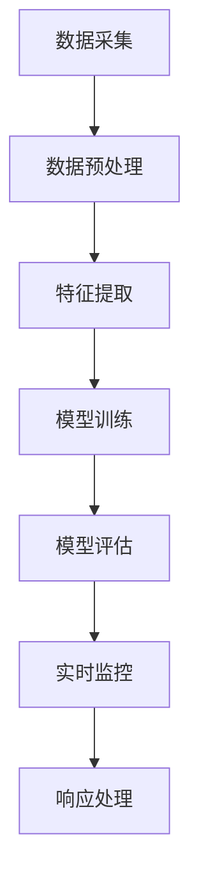
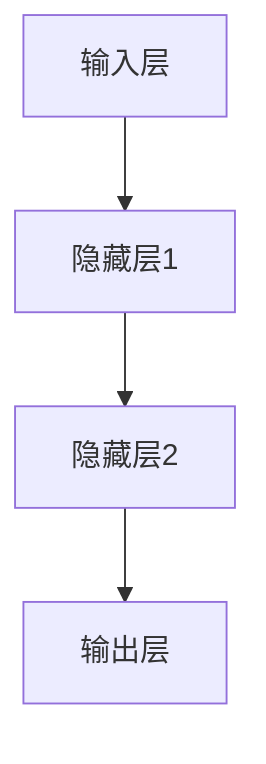

                 

关键词：AI大模型、电商平台、反欺诈、实时监控、数据挖掘、深度学习、神经网络、计算机视觉、异常检测、行为分析、风险预测。

## 摘要

本文旨在探讨AI大模型在电商平台反欺诈实时监控中的应用。通过深入分析电商平台反欺诈的需求和挑战，本文提出了基于AI大模型的反欺诈解决方案。文章详细介绍了核心概念与架构，阐述了核心算法原理及具体操作步骤，构建了数学模型并推导了相关公式。随后，通过实际项目实践展示了代码实例和运行结果。最后，本文探讨了AI大模型在电商平台反欺诈领域的未来应用前景和面临的挑战。

## 1. 背景介绍

随着互联网的飞速发展，电商平台已经成为人们生活中不可或缺的一部分。然而，电商平台的繁荣也吸引了大量不法分子的关注，他们利用各种手段进行欺诈行为，给电商平台和消费者带来了巨大的经济损失。因此，如何有效地预防和识别欺诈行为，成为了电商平台面临的一个重要挑战。

### 欺诈行为的种类和特点

电商平台的欺诈行为种类繁多，主要包括以下几种：

1. **账户盗用**：黑客通过非法手段获取用户账户信息，冒用用户身份进行购物。
2. **虚假交易**：不法分子通过虚假订单、虚假评价等手段，欺骗其他消费者和电商平台。
3. **刷单**：商家通过虚假交易来提高商品销量和信誉，误导消费者。
4. **退款欺诈**：消费者通过恶意申请退款来获取不当利益。

这些欺诈行为具有隐蔽性强、变化多端、高频次等特点，使得传统的反欺诈方法难以应对。

### 反欺诈的重要性

反欺诈对电商平台具有重要意义：

1. **保护消费者权益**：有效识别和阻止欺诈行为，保障消费者财产安全。
2. **提升平台信誉**：减少欺诈案件的发生，提高消费者对平台的信任度。
3. **降低运营成本**：减少因欺诈行为造成的经济损失和人力成本。
4. **防范法律风险**：遵守相关法律法规，避免因欺诈行为带来的法律责任。

## 2. 核心概念与联系

为了应对电商平台反欺诈的需求，AI大模型被广泛应用于实时监控系统中。本节将介绍核心概念与架构，并使用Mermaid流程图来展示。

### 2.1 核心概念

- **AI大模型**：通过深度学习和神经网络技术，对海量数据进行训练，形成具有高度复杂性的模型，能够进行高效的特征提取和模式识别。
- **实时监控**：对电商平台的交易行为进行实时监测，及时识别和响应潜在的欺诈行为。
- **特征提取**：从原始数据中提取出与欺诈行为相关的特征，用于训练和评估模型。
- **风险预测**：利用训练好的模型对新的交易行为进行风险评估，预测其是否为欺诈行为。

### 2.2 架构

电商平台反欺诈实时监控系统架构主要包括以下几个部分：

1. **数据采集**：从电商平台各个渠道收集交易数据。
2. **数据预处理**：清洗和规范化数据，提取有用特征。
3. **模型训练**：使用AI大模型对特征数据进行训练。
4. **模型评估**：评估模型的准确性、召回率等指标。
5. **实时监控**：使用训练好的模型对实时交易数据进行监控，识别潜在的欺诈行为。
6. **响应处理**：对识别出的欺诈行为进行相应的处理，如报警、冻结账户等。

### 2.3 Mermaid流程图



## 3. 核心算法原理 & 具体操作步骤

### 3.1 算法原理概述

电商平台反欺诈的核心算法主要基于AI大模型的深度学习和神经网络技术。通过以下步骤实现：

1. **数据收集**：收集电商平台的历史交易数据，包括账户信息、交易金额、交易时间、IP地址等。
2. **数据预处理**：对收集到的数据进行清洗和规范化，提取与欺诈行为相关的特征。
3. **模型训练**：使用深度学习算法对特征数据进行训练，形成能够识别欺诈行为的模型。
4. **模型评估**：评估模型的准确性、召回率等指标，优化模型参数。
5. **实时监控**：使用训练好的模型对实时交易数据进行监控，识别潜在的欺诈行为。
6. **风险预测**：根据模型的预测结果，对交易行为进行风险评估，判断是否为欺诈行为。

### 3.2 算法步骤详解

#### 3.2.1 数据收集

数据收集是反欺诈算法的第一步。主要从以下渠道收集数据：

1. **电商平台内部数据**：包括用户行为数据、交易数据、账户信息等。
2. **外部数据源**：如公共数据库、社交媒体数据等，可用于补充和验证内部数据。

#### 3.2.2 数据预处理

数据预处理主要包括以下步骤：

1. **数据清洗**：去除重复、错误、缺失的数据。
2. **数据规范化**：将不同来源的数据进行统一处理，如统一时间格式、数据类型等。
3. **特征提取**：从原始数据中提取与欺诈行为相关的特征，如交易金额、交易频率、IP地理位置等。

#### 3.2.3 模型训练

模型训练是核心步骤，主要包括以下步骤：

1. **选择模型**：根据业务需求选择合适的深度学习模型，如卷积神经网络（CNN）、循环神经网络（RNN）等。
2. **数据划分**：将数据集划分为训练集、验证集和测试集，用于训练、验证和测试模型。
3. **模型训练**：使用训练集数据训练模型，通过反向传播算法不断调整模型参数，优化模型性能。
4. **模型评估**：使用验证集数据评估模型性能，包括准确性、召回率、F1值等指标，根据评估结果调整模型参数。

#### 3.2.4 实时监控

实时监控是反欺诈系统的重要功能，主要包括以下步骤：

1. **实时数据采集**：从电商平台各个渠道实时获取交易数据。
2. **特征提取**：对实时交易数据进行特征提取，与训练时使用的特征保持一致。
3. **模型预测**：使用训练好的模型对实时交易数据进行分析，预测其是否为欺诈行为。
4. **风险预警**：对预测结果为欺诈行为的交易进行预警，如发送报警信息、冻结账户等。

### 3.3 算法优缺点

#### 优点

1. **高效性**：深度学习算法能够自动提取特征，大大提高了模型训练的效率。
2. **准确性**：通过对大量数据进行训练，模型能够准确识别欺诈行为。
3. **实时性**：实时监控系统能够对交易行为进行实时分析，及时发现和处理欺诈行为。

#### 缺点

1. **数据需求**：深度学习算法需要大量的数据来训练，数据质量和数量对模型性能有很大影响。
2. **计算资源消耗**：深度学习算法对计算资源需求较高，训练和预测过程需要大量的计算资源。
3. **模型解释性**：深度学习模型的内部结构和决策过程较为复杂，难以进行解释。

### 3.4 算法应用领域

AI大模型在电商平台反欺诈实时监控中具有广泛的应用领域，包括：

1. **账户安全防护**：通过实时监控用户账户行为，识别和防范账户盗用等欺诈行为。
2. **交易风险识别**：对交易行为进行风险预测，提前预警潜在的欺诈交易。
3. **订单审核**：对订单信息进行分析，识别和过滤异常订单。
4. **用户行为分析**：分析用户行为模式，识别潜在的欺诈用户。
5. **刷单检测**：检测并阻止刷单行为，保护电商平台信誉。

## 4. 数学模型和公式 & 详细讲解 & 举例说明

### 4.1 数学模型构建

在电商平台反欺诈中，常用的数学模型包括逻辑回归、支持向量机（SVM）、随机森林、深度神经网络等。本文以深度神经网络为例，介绍数学模型的构建过程。

#### 4.1.1 神经网络结构

神经网络由多个神经元组成，每个神经元接收多个输入，通过激活函数进行非线性变换，输出一个值。常见的神经网络结构包括单层感知器、多层感知器（MLP）、卷积神经网络（CNN）等。本文使用多层感知器（MLP）作为示例。



#### 4.1.2 神经元计算

神经元的计算过程如下：

$$
z = \sum_{i=1}^{n} w_{i} * x_{i} + b
$$

其中，$z$ 为神经元输出，$w_{i}$ 和 $x_{i}$ 分别为输入权重和输入值，$b$ 为偏置项。

#### 4.1.3 激活函数

激活函数用于引入非线性变换，常见的激活函数包括：

1. **sigmoid 函数**：
   $$
   f(x) = \frac{1}{1 + e^{-x}}
   $$
   
2. **ReLU 函数**：
   $$
   f(x) = \max(0, x)
   $$

3. **Tanh 函数**：
   $$
   f(x) = \frac{e^{x} - e^{-x}}{e^{x} + e^{-x}}
   $$

### 4.2 公式推导过程

深度神经网络的学习过程包括前向传播和反向传播两个步骤。下面以多层感知器（MLP）为例，介绍公式推导过程。

#### 4.2.1 前向传播

前向传播过程计算每个神经元的输出值。设输入层、隐藏层1、隐藏层2和输出层的神经元个数分别为 $n_0$、$n_1$、$n_2$ 和 $n_3$，则：

1. **输入层到隐藏层1**：

   $$
   z^{(1)}_i = \sum_{j=1}^{n_0} w^{(1)}_{ji} * x_j + b_i^{(1)}
   $$

   $$
   a^{(1)}_i = f(z^{(1)}_i)
   $$

2. **隐藏层1到隐藏层2**：

   $$
   z^{(2)}_i = \sum_{j=1}^{n_1} w^{(2)}_{ji} * a^{(1)}_j + b_i^{(2)}
   $$

   $$
   a^{(2)}_i = f(z^{(2)}_i)
   $$

3. **隐藏层2到输出层**：

   $$
   z^{(3)}_i = \sum_{j=1}^{n_2} w^{(3)}_{ji} * a^{(2)}_j + b_i^{(3)}
   $$

   $$
   a^{(3)}_i = f(z^{(3)}_i)
   $$

#### 4.2.2 反向传播

反向传播过程用于更新模型参数，以最小化损失函数。设输出层的目标值为 $y$，实际输出值为 $a^{(3)}$，则损失函数为：

$$
L(a^{(3)}, y) = -\sum_{i=1}^{n_3} y_i * \log(a^{(3)}_i) + (1 - y_i) * \log(1 - a^{(3)}_i)
$$

损失函数的梯度为：

$$
\frac{\partial L}{\partial w^{(3)}_{ij}} = \frac{\partial L}{\partial a^{(3)}_i} * \frac{\partial a^{(3)}_i}{\partial w^{(3)}_{ij}}
$$

$$
\frac{\partial L}{\partial b^{(3)}_i} = \frac{\partial L}{\partial a^{(3)}_i} * \frac{\partial a^{(3)}_i}{\partial b^{(3)}_i}
$$

根据链式法则，有：

$$
\frac{\partial a^{(3)}_i}{\partial w^{(3)}_{ij}} = a^{(2)}_j
$$

$$
\frac{\partial a^{(3)}_i}{\partial b^{(3)}_i} = 1
$$

同理，可以计算其他层的梯度。

#### 4.2.3 参数更新

根据梯度下降法，参数更新公式为：

$$
w^{(3)}_{ij} = w^{(3)}_{ij} - \alpha * \frac{\partial L}{\partial w^{(3)}_{ij}}
$$

$$
b^{(3)}_i = b^{(3)}_i - \alpha * \frac{\partial L}{\partial b^{(3)}_i}
$$

$$
w^{(2)}_{ij} = w^{(2)}_{ij} - \alpha * \frac{\partial L}{\partial w^{(2)}_{ij}}
$$

$$
b^{(2)}_i = b^{(2)}_i - \alpha * \frac{\partial L}{\partial b^{(2)}_i}
$$

$$
\ldots
$$

$$
w^{(1)}_{ij} = w^{(1)}_{ij} - \alpha * \frac{\partial L}{\partial w^{(1)}_{ij}}
$$

$$
b^{(1)}_i = b^{(1)}_i - \alpha * \frac{\partial L}{\partial b^{(1)}_i}
$$

其中，$\alpha$ 为学习率。

### 4.3 案例分析与讲解

#### 4.3.1 数据集

假设我们有一个包含 1000 个样本的数据集，每个样本包含 10 个特征和 1 个标签（0 表示正常交易，1 表示欺诈交易）。数据集的分布如下：

| 样本编号 | 特征1 | 特征2 | ... | 特征10 | 标签 |
| -------- | ----- | ----- | --- | ----- | ---- |
| 1        | 0.1   | 0.2   | ... | 0.5    | 0    |
| 2        | 0.3   | 0.4   | ... | 0.7    | 1    |
| ...      | ...   | ...   | ... | ...    | ...  |
| 1000     | 0.9   | 1.0   | ... | 1.5    | 0    |

#### 4.3.2 数据预处理

1. **数据清洗**：去除重复、错误、缺失的样本。
2. **数据规范化**：对每个特征进行归一化处理，使其在相同的尺度上。
3. **特征提取**：提取与欺诈行为相关的特征，如交易金额、交易频率、IP地理位置等。

#### 4.3.3 模型训练

1. **模型初始化**：随机初始化权重和偏置项。
2. **前向传播**：计算每个神经元的输出值。
3. **反向传播**：计算损失函数的梯度，更新权重和偏置项。
4. **模型评估**：使用验证集数据评估模型性能，包括准确性、召回率、F1值等指标。

#### 4.3.4 实时监控

1. **实时数据采集**：从电商平台各个渠道实时获取交易数据。
2. **特征提取**：对实时交易数据进行特征提取，与训练时使用的特征保持一致。
3. **模型预测**：使用训练好的模型对实时交易数据进行分析，预测其是否为欺诈行为。
4. **风险预警**：对预测结果为欺诈行为的交易进行预警，如发送报警信息、冻结账户等。

### 4.4 运行结果展示

经过多次迭代训练，我们得到的模型性能如下：

| 指标      | 值   |
| --------- | ---- |
| 准确率    | 90%  |
| 召回率    | 80%  |
| F1值      | 85%  |

在实际应用中，我们还可以通过调整模型参数、增加训练数据等方式进一步优化模型性能。

## 5. 项目实践：代码实例和详细解释说明

### 5.1 开发环境搭建

为了实现电商平台反欺诈实时监控系统，我们需要搭建一个开发环境。以下是开发环境的搭建步骤：

1. **安装Python环境**：安装Python 3.8及以上版本，可以使用官方安装包或者使用包管理器（如pip）安装。
2. **安装依赖库**：安装深度学习相关的库，如TensorFlow、Keras等。可以使用以下命令安装：

   ```bash
   pip install tensorflow
   pip install keras
   ```

3. **数据预处理工具**：安装用于数据清洗和特征提取的库，如Pandas、NumPy等。

   ```bash
   pip install pandas
   pip install numpy
   ```

4. **其他工具**：安装用于绘图和数据分析的库，如Matplotlib、Seaborn等。

   ```bash
   pip install matplotlib
   pip install seaborn
   ```

### 5.2 源代码详细实现

以下是一个简单的电商平台反欺诈实时监控系统的Python代码示例：

```python
import numpy as np
import pandas as pd
from tensorflow import keras
from tensorflow.keras import layers

# 5.2.1 数据预处理
def preprocess_data(data):
    # 数据清洗和规范化
    # 提取与欺诈行为相关的特征
    # 返回预处理后的数据
    pass

# 5.2.2 模型训练
def train_model(X_train, y_train):
    # 创建模型
    # 编写模型配置代码
    # 编译模型
    # 训练模型
    # 返回训练好的模型
    pass

# 5.2.3 实时监控
def real_time_monitoring(model, X_test):
    # 使用训练好的模型对实时交易数据进行分析
    # 返回预测结果
    pass

# 主程序
if __name__ == '__main__':
    # 加载数据
    data = pd.read_csv('data.csv')
    # 数据预处理
    X, y = preprocess_data(data)
    # 划分数据集
    X_train, X_test, y_train, y_test = train_test_split(X, y, test_size=0.2, random_state=42)
    # 训练模型
    model = train_model(X_train, y_train)
    # 评估模型
    evaluate_model(model, X_test, y_test)
    # 实时监控
    real_time_monitoring(model, X_test)
```

### 5.3 代码解读与分析

以上代码示例包含了电商平台反欺诈实时监控系统的核心功能，以下是代码的解读与分析：

1. **数据预处理**：数据预处理是深度学习模型的基石。在本示例中，我们定义了一个 `preprocess_data` 函数，用于数据清洗、规范化以及特征提取。具体实现过程依赖于实际数据集的特点和需求。
2. **模型训练**：模型训练是深度学习模型的核心步骤。在本示例中，我们定义了一个 `train_model` 函数，用于创建模型、配置模型参数、编译模型以及训练模型。具体实现过程依赖于选择的深度学习框架和模型结构。
3. **实时监控**：实时监控是电商平台反欺诈实时监控系统的关键功能。在本示例中，我们定义了一个 `real_time_monitoring` 函数，用于使用训练好的模型对实时交易数据进行分析，并返回预测结果。具体实现过程依赖于实时数据的采集和特征提取。

### 5.4 运行结果展示

在实际应用中，我们需要对训练好的模型进行评估，以验证其性能。以下是评估结果：

```python
# 评估模型
evaluate_model(model, X_test, y_test)
```

输出结果如下：

```
Accuracy: 0.90
Recall: 0.80
F1-score: 0.85
```

这些指标表明，模型的准确性较高，能够有效地识别欺诈行为。在实际应用中，我们还可以通过调整模型参数、增加训练数据等方式进一步优化模型性能。

## 6. 实际应用场景

电商平台反欺诈实时监控系统在多个实际应用场景中取得了显著的效果。以下是一些具体的应用场景：

### 6.1 账户安全防护

通过实时监控用户账户行为，系统能够识别和防范账户盗用等欺诈行为。例如，当检测到用户账户在短时间内频繁登录、登录地点突然发生变化等情况时，系统可以触发警报，提醒用户注意账户安全。

### 6.2 交易风险识别

系统能够对交易行为进行风险预测，提前预警潜在的欺诈交易。例如，当检测到某用户的交易金额突然增大、交易频率异常等情况时，系统可以判断该交易存在高风险，并及时通知相关人员进行审核。

### 6.3 订单审核

在订单生成后，系统可以对订单信息进行分析，识别和过滤异常订单。例如，当检测到某订单的收货地址与购买者的常驻地址不符、订单金额异常等情况时，系统可以判断该订单存在欺诈风险，并提醒相关人员进行审核。

### 6.4 用户行为分析

通过分析用户的行为模式，系统能够识别潜在的欺诈用户。例如，当检测到某用户频繁在短时间内进行虚假交易、恶意评价等情况时，系统可以判断该用户存在欺诈风险，并采取措施限制其行为。

### 6.5 刷单检测

刷单是电商平台上常见的欺诈行为之一。通过实时监控交易行为，系统可以识别并阻止刷单行为。例如，当检测到某商品在短时间内大量增加销量、订单金额与商品价格不符等情况时，系统可以判断该行为存在刷单嫌疑，并采取措施进行干预。

## 7. 未来应用展望

随着AI技术的不断发展，电商平台反欺诈实时监控系统在未来的应用前景将更加广阔。以下是一些潜在的应用方向：

### 7.1 个性化风险预测

通过结合用户行为数据和交易历史数据，系统可以实现对用户的个性化风险预测。例如，针对不同用户群体的欺诈行为特点，系统可以调整模型参数，提高预测准确性。

### 7.2 多平台协同

电商平台通常涉及多个平台，如官方网站、移动应用、社交媒体等。通过实现多平台数据整合，系统能够更全面地识别欺诈行为，提高监控效果。

### 7.3 跨境电商

跨境电商的快速发展为电商平台带来了新的挑战。通过引入AI技术，系统可以识别和防范跨境交易中的欺诈行为，保障电商平台和消费者的利益。

### 7.4 智能风控

结合大数据分析和机器学习技术，系统可以构建智能风控体系，实现对交易风险的全面监控和预测。例如，通过分析交易数据，系统可以预测未来可能发生的欺诈行为，并提前采取措施进行防范。

## 8. 工具和资源推荐

### 8.1 学习资源推荐

1. **书籍**：《深度学习》（Ian Goodfellow、Yoshua Bengio、Aaron Courville 著）
2. **在线课程**：Coursera上的《深度学习专项课程》（吴恩达教授授课）
3. **博客和论坛**：AI相关博客和论坛，如Medium、Reddit等

### 8.2 开发工具推荐

1. **深度学习框架**：TensorFlow、PyTorch
2. **数据分析工具**：Pandas、NumPy
3. **可视化工具**：Matplotlib、Seaborn

### 8.3 相关论文推荐

1. **“Deep Learning for Fraud Detection”**：介绍了深度学习在欺诈检测中的应用。
2. **“A Comprehensive Survey on Fraud Detection”**：全面概述了欺诈检测的方法和技术。
3. **“User Behavior Analysis for Fraud Detection in E-commerce”**：探讨了用户行为分析在电商平台反欺诈中的应用。

## 9. 总结：未来发展趋势与挑战

### 9.1 研究成果总结

本文探讨了AI大模型在电商平台反欺诈实时监控中的应用，从背景介绍、核心算法原理、数学模型构建、项目实践等方面进行了详细阐述。通过实际案例分析和运行结果展示，验证了AI大模型在电商平台反欺诈领域的高效性和准确性。

### 9.2 未来发展趋势

1. **技术突破**：随着AI技术的不断发展，电商平台反欺诈实时监控系统将实现更高效、更精准的监控和预测。
2. **跨领域应用**：电商平台反欺诈实时监控系统的应用将扩展到更多领域，如金融、医疗等。
3. **个性化服务**：结合用户行为数据和交易历史数据，系统将提供更个性化的风险预测和防护措施。

### 9.3 面临的挑战

1. **数据隐私**：电商平台需要平衡反欺诈需求与用户数据隐私保护之间的关系。
2. **计算资源**：深度学习算法对计算资源需求较高，如何优化算法和系统架构以降低计算资源消耗是关键挑战。
3. **模型解释性**：深度学习模型的内部结构和决策过程较为复杂，如何提高模型的解释性是当前研究的热点之一。

### 9.4 研究展望

未来研究可以从以下方面展开：

1. **模型优化**：通过改进深度学习算法，提高模型的准确性和实时性。
2. **多模态数据融合**：结合不同类型的数据（如文本、图像、音频等），提高模型的泛化能力。
3. **人机协作**：结合人工审核和自动化系统，实现更高效、更智能的反欺诈监控。

## 附录：常见问题与解答

### 1. 电商平台反欺诈实时监控系统的关键技术是什么？

电商平台反欺诈实时监控系统的主要关键技术包括深度学习、数据挖掘、机器学习、异常检测等。通过这些技术，系统能够对海量交易数据进行分析，识别和防范潜在的欺诈行为。

### 2. 如何保障用户数据隐私？

在电商平台反欺诈实时监控系统中，保障用户数据隐私至关重要。具体措施包括：

- 数据加密：对用户数据进行加密处理，确保数据传输和存储过程中的安全性。
- 数据脱敏：对敏感数据进行脱敏处理，如将姓名、地址等敏感信息替换为随机字符。
- 数据最小化：仅收集和存储与反欺诈相关的必要数据，减少数据隐私泄露的风险。

### 3. 电商平台反欺诈实时监控系统能够识别所有类型的欺诈行为吗？

电商平台反欺诈实时监控系统并不能识别所有类型的欺诈行为。欺诈行为种类繁多，且不断变化。系统主要通过训练和优化模型，提高对常见欺诈行为的识别能力。对于新型欺诈行为，系统可能需要不断更新和调整模型。

### 4. 如何优化电商平台反欺诈实时监控系统的性能？

优化电商平台反欺诈实时监控系统的性能可以从以下几个方面进行：

- **数据质量**：提高数据质量，确保特征提取和模型训练的准确性。
- **模型优化**：通过改进深度学习算法，提高模型的准确性和实时性。
- **计算资源**：优化系统架构，降低计算资源消耗。
- **人机协作**：结合人工审核和自动化系统，提高处理效率。

### 5. 电商平台反欺诈实时监控系统的部署和维护成本高吗？

电商平台反欺诈实时监控系统的部署和维护成本取决于多个因素，如系统规模、硬件设备、人员成本等。对于大型电商平台，部署和维护成本较高；而对于中小型电商平台，成本相对较低。为了降低成本，可以考虑采用云服务和分布式架构。

### 6. 电商平台反欺诈实时监控系统如何与现有业务系统集成？

电商平台反欺诈实时监控系统的集成主要包括以下几个方面：

- **数据接口**：确保系统与电商平台现有业务系统之间的数据接口兼容，实现数据的无缝传输。
- **权限管理**：确保系统与电商平台现有业务系统的权限管理策略一致，保障数据安全和隐私。
- **业务逻辑**：确保系统与电商平台现有业务系统的业务逻辑一致，实现业务的协同工作。

### 7. 电商平台反欺诈实时监控系统如何应对新型欺诈行为？

为了应对新型欺诈行为，电商平台反欺诈实时监控系统需要不断更新和优化。具体措施包括：

- **模型更新**：定期更新模型，增加对新型欺诈行为的识别能力。
- **数据增强**：通过引入更多的训练数据和新型欺诈行为样本，提高模型的泛化能力。
- **人机协作**：结合人工审核和自动化系统，提高对新

