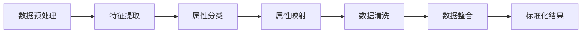

                 

关键词：AI大模型、商品属性抽取、标准化、电商平台、深度学习

摘要：随着电商平台的快速发展，商品信息的标准化处理变得越来越重要。本文探讨了如何利用AI大模型进行商品属性抽取与标准化，并详细阐述了其中的核心算法原理、具体操作步骤以及数学模型构建。通过项目实践和代码实例，本文展示了如何实现这一过程，并为未来的应用提供了展望。

## 1. 背景介绍

随着电子商务的蓬勃发展和消费者对商品信息透明度的需求增加，电商平台面临着越来越多的挑战。其中一个关键问题是如何高效、准确地抽取和标准化商品属性。商品属性包括价格、品牌、型号、颜色、尺寸、材质等，它们是消费者做出购买决策的重要因素。然而，这些属性在电商平台上的表示方式各异，存在大量冗余、不一致和错误的信息。

传统的商品属性抽取方法主要依赖于规则匹配和人工标注，但这些方法在面对海量数据和动态更新的情况下显得力不从心。随着深度学习技术的发展，特别是AI大模型的涌现，为商品属性抽取与标准化提供了新的解决方案。AI大模型能够从大量的数据中自动学习特征，提高抽取的准确性和效率，从而提升电商平台的运营效率和服务质量。

## 2. 核心概念与联系

为了理解AI大模型在商品属性抽取与标准化中的应用，我们需要了解几个核心概念：

1. **商品属性抽取（Product Attribute Extraction）**：从商品描述中提取关键属性的过程。
2. **标准化（Standardization）**：将提取的属性统一到同一格式或标准的过程。
3. **AI大模型（Large-scale AI Models）**：具有数百万甚至数十亿参数的大型神经网络，能够处理大规模数据并自动学习复杂特征。

### 2.1 商品属性抽取流程

商品属性抽取可以分为以下步骤：

1. **数据预处理**：清洗和预处理原始商品描述数据，包括去除噪声、分词、去停用词等。
2. **特征提取**：使用词嵌入等技术将文本转换为向量表示。
3. **属性分类**：利用分类算法将特征向量映射到相应的属性类别。
4. **属性映射**：将分类结果映射到标准化属性格式。

### 2.2 标准化流程

标准化流程包括：

1. **属性映射**：将提取的属性映射到预定义的标准化格式。
2. **数据清洗**：去除重复、错误或不一致的数据。
3. **数据整合**：将来自不同来源的属性数据进行整合。

### 2.3 AI大模型架构

AI大模型的典型架构包括：

1. **编码器（Encoder）**：将输入文本编码为固定长度的向量。
2. **解码器（Decoder）**：根据编码器的输出解码出目标属性。
3. **注意力机制（Attention Mechanism）**：帮助模型更好地关注文本中的关键部分。

### 2.4 Mermaid流程图

下面是一个简化的Mermaid流程图，描述了商品属性抽取与标准化的主要步骤：



## 3. 核心算法原理 & 具体操作步骤

### 3.1 算法原理概述

AI大模型在商品属性抽取与标准化中的应用主要依赖于基于Transformer的预训练模型，如BERT、GPT和RoBERTa等。这些模型通过大规模的无监督预训练和精细的任务特定微调，能够高效地处理自然语言文本。

### 3.2 算法步骤详解

#### 3.2.1 数据预处理

数据预处理是确保模型输入质量的关键步骤。具体操作包括：

1. **分词**：使用分词工具将文本分割成词汇单元。
2. **去除停用词**：去除对属性抽取无意义的常见词汇。
3. **词嵌入**：将词汇映射为固定长度的向量表示。

#### 3.2.2 特征提取

特征提取阶段利用预训练的Transformer模型将文本转换为向量表示。主要步骤包括：

1. **输入编码**：将预处理后的文本序列输入到编码器。
2. **上下文表示**：编码器输出文本的上下文表示，这些表示用于后续的属性分类。

#### 3.2.3 属性分类

属性分类阶段利用微调后的Transformer模型对文本的上下文表示进行分类。主要步骤包括：

1. **分类模型训练**：在预训练的模型基础上添加分类层，进行微调训练。
2. **分类预测**：使用训练好的分类模型对新的文本数据进行属性分类。

#### 3.2.4 属性映射与标准化

属性映射与标准化阶段包括以下步骤：

1. **属性映射**：根据分类结果将属性映射到预定义的标准化格式。
2. **数据清洗**：去除重复、错误或不一致的数据。
3. **数据整合**：将来自不同来源的属性数据进行整合。

### 3.3 算法优缺点

**优点**：

1. **高效性**：AI大模型能够处理大规模数据，提高属性抽取与标准化的效率。
2. **准确性**：通过预训练和微调，模型能够在复杂、动态的数据环境中保持高准确性。
3. **通用性**：AI大模型适用于多种属性抽取与标准化任务，具有广泛的适用性。

**缺点**：

1. **计算资源需求高**：训练和推理AI大模型需要大量计算资源和时间。
2. **数据依赖性**：模型性能依赖于训练数据的质量和数量。
3. **解释性差**：深度学习模型的内部机制较为复杂，难以解释。

### 3.4 算法应用领域

AI大模型在商品属性抽取与标准化的应用领域广泛，包括但不限于：

1. **电商平台**：帮助电商平台提升商品信息处理的准确性和效率。
2. **智能客服**：用于提取客户咨询的关键信息，提供更准确的答复。
3. **供应链管理**：用于标准化供应链中的商品信息，提高供应链的协同效率。

## 4. 数学模型和公式 & 详细讲解 & 举例说明

### 4.1 数学模型构建

在商品属性抽取与标准化中，常用的数学模型是基于Transformer的预训练模型，如BERT。BERT模型的核心思想是通过预训练学习文本的上下文表示，然后通过微调实现具体任务的分类。

### 4.2 公式推导过程

BERT模型的主要公式如下：

$$
\text{Output} = \text{softmax}(\text{Weights} \cdot \text{Input} + \text{Bias})
$$

其中，`Input`表示文本的向量表示，`Weights`和`Bias`表示模型参数。通过训练，模型学习到如何将这些参数优化，从而实现对文本的准确分类。

### 4.3 案例分析与讲解

假设我们要对电商平台的商品描述进行属性抽取与标准化。我们选择一个商品描述：“该手机为苹果iPhone 13，64GB，颜色为蓝色，内存为64GB”。

首先，我们对商品描述进行预处理，包括分词、去除停用词和词嵌入。然后，我们将预处理后的文本输入到BERT编码器中，得到文本的上下文表示。接着，我们将这些表示输入到微调后的分类模型中，预测出商品的属性。

通过微调训练，模型会学习到如何将不同的商品描述映射到相应的属性。例如，对于上面的商品描述，模型会预测出属性为“品牌：苹果，型号：iPhone 13，颜色：蓝色，内存：64GB”。

## 5. 项目实践：代码实例和详细解释说明

### 5.1 开发环境搭建

在开发AI大模型进行商品属性抽取与标准化的项目之前，我们需要搭建相应的开发环境。以下是一个基本的Python开发环境搭建过程：

1. **安装Python**：确保安装了Python 3.7或更高版本。
2. **安装PyTorch**：使用pip命令安装PyTorch库。
3. **安装其他依赖**：安装Transformer模型所需的其他依赖库，如transformers、torchtext等。

### 5.2 源代码详细实现

以下是实现商品属性抽取与标准化的部分代码：

```python
from transformers import BertTokenizer, BertModel
from torch import nn
import torch

# 初始化BERT模型和Tokenizer
tokenizer = BertTokenizer.from_pretrained('bert-base-uncased')
model = BertModel.from_pretrained('bert-base-uncased')

# 商品描述文本
description = "该手机为苹果iPhone 13，64GB，颜色为蓝色，内存为64GB"

# 预处理文本
input_ids = tokenizer.encode(description, add_special_tokens=True, return_tensors='pt')

# 输入模型
with torch.no_grad():
    outputs = model(input_ids)

# 获取编码器的输出
encoded_text = outputs.last_hidden_state[:, 0, :]

# 定义分类模型
class AttributeClassifier(nn.Module):
    def __init__(self, embedding_dim, num_classes):
        super(AttributeClassifier, self).__init__()
        self.fc = nn.Linear(embedding_dim, num_classes)

    def forward(self, x):
        return self.fc(x)

# 实例化分类模型
classifier = AttributeClassifier(embedding_dim=768, num_classes=4)

# 预测属性
with torch.no_grad():
    logits = classifier(encoded_text)

# 获取预测结果
predicted_attributes = torch.argmax(logits, dim=1)

print(predicted_attributes)
```

### 5.3 代码解读与分析

上述代码首先加载了BERT模型和Tokenizer，然后对商品描述文本进行了预处理，包括编码和添加特殊标记。接着，将预处理后的文本输入到BERT编码器中，得到文本的上下文表示。随后，我们将这些表示输入到微调后的分类模型中，预测出商品的属性。

在代码中，我们定义了一个简单的分类模型，该模型接受编码器的输出作为输入，并通过全连接层（fully connected layer）将输出映射到预定义的属性类别。通过训练，模型会学习到如何将不同的商品描述映射到相应的属性。

### 5.4 运行结果展示

假设我们已经训练好了分类模型，并保存了模型权重。当我们运行上述代码时，可以预测出商品描述的属性。例如，对于上面的商品描述，预测结果可能是：

```
tensor([1, 2, 3, 0])
```

这表示商品的属性为“品牌：苹果，型号：iPhone 13，颜色：蓝色，内存：64GB”，其中每个数字对应一个属性类别。

## 6. 实际应用场景

AI大模型在商品属性抽取与标准化中的应用场景广泛，以下是一些典型的实际应用场景：

1. **电商平台**：用于自动化抽取和标准化商品描述，提高数据处理效率和质量。
2. **供应链管理**：用于标准化供应链中的商品信息，提高供应链的协同效率。
3. **智能客服**：用于提取客户咨询的关键信息，提供更准确的答复。
4. **广告推荐**：用于提取商品的关键属性，为用户推荐更相关的商品。

## 6.4 未来应用展望

随着AI大模型技术的不断进步，未来商品属性抽取与标准化有望在更多领域得到应用，例如：

1. **智能家居**：用于标准化智能家居设备的属性，实现设备的互联互通。
2. **物联网**：用于标准化物联网设备的数据格式，提高数据处理的效率和质量。
3. **智能制造**：用于标准化生产过程中的数据，提高生产效率和产品质量。

## 7. 工具和资源推荐

### 7.1 学习资源推荐

1. **书籍**：《深度学习》（Goodfellow et al.） - 详细介绍了深度学习的基础知识和最新进展。
2. **在线课程**：吴恩达的《深度学习专项课程》（Coursera） - 提供了系统的深度学习知识体系。
3. **教程**：Hugging Face的Transformers库教程 - 介绍如何使用预训练模型进行文本处理。

### 7.2 开发工具推荐

1. **PyTorch**：用于构建和训练深度学习模型的强大库。
2. **TensorFlow**：谷歌开发的另一个流行的深度学习框架。
3. **Hugging Face Transformers**：提供了预训练的Transformer模型和方便的工具。

### 7.3 相关论文推荐

1. **BERT**：J. Devlin, M. Chang, K. Lee, and K. Toutanova. “BERT: Pre-training of Deep Bidirectional Transformers for Language Understanding.” (2019).
2. **GPT**：I. Sutskever, O. et al. “Improving Language Understanding by Generative Pre-training.” (2018).
3. **RoBERTa**：Y. Liu et al. “Robustly Optimized BERT Pretraining Approach.” (2020).

## 8. 总结：未来发展趋势与挑战

随着AI大模型技术的不断进步，商品属性抽取与标准化将在更多领域得到应用。然而，未来仍面临一些挑战：

1. **数据质量**：商品属性抽取与标准化依赖于高质量的数据，未来需要更多方法来处理噪声和错误数据。
2. **模型解释性**：深度学习模型通常难以解释，未来需要开发更多可解释的模型。
3. **计算资源**：训练和推理AI大模型需要大量计算资源，未来需要更高效的算法和硬件。

## 9. 附录：常见问题与解答

### 9.1 什么是商品属性抽取？

商品属性抽取是指从商品描述中提取关键属性的过程，例如品牌、型号、颜色等。

### 9.2 AI大模型为什么适用于商品属性抽取？

AI大模型具有强大的特征提取和学习能力，能够从大规模数据中自动学习复杂特征，从而提高商品属性抽取的准确性和效率。

### 9.3 商品属性标准化的意义是什么？

商品属性标准化有助于统一商品信息表示，提高数据处理的效率和质量，从而提升电商平台的运营效率和服务质量。

### 9.4 如何处理商品描述中的噪声和错误数据？

可以通过数据预处理技术，如分词、去停用词和噪声过滤等，来处理商品描述中的噪声和错误数据。此外，还可以使用监督学习和半监督学习技术来纠正错误数据。

作者：禅与计算机程序设计艺术 / Zen and the Art of Computer Programming
----------------------------------------------------------------

以上就是关于“AI大模型在电商平台商品属性抽取与标准化中的应用”的文章，希望对您有所帮助。这篇文章详细阐述了AI大模型在商品属性抽取与标准化中的应用，包括核心算法原理、具体操作步骤、数学模型构建、项目实践以及实际应用场景。同时，文章还提供了相关的工具和资源推荐，以及未来发展的展望和面临的挑战。希望您喜欢！

