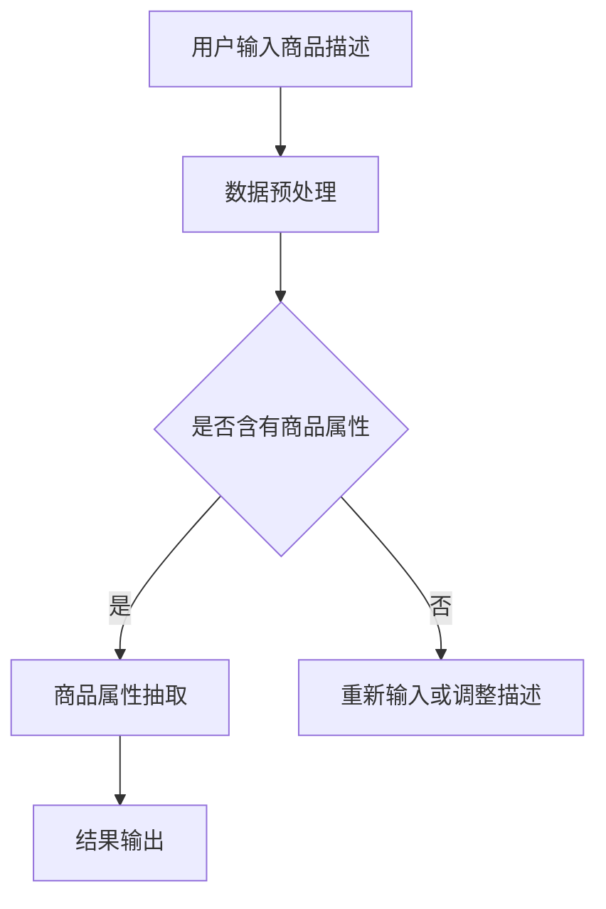

                 

关键词：AI大模型、电商平台、商品属性抽取、自然语言处理、机器学习、深度学习、BERT模型、Transformer架构、数据预处理、特征提取、性能评估

摘要：本文主要探讨了人工智能大模型在电商平台商品属性抽取中的应用。通过分析电商平台中商品描述的复杂性，提出了基于BERT模型的商品属性抽取方法，并详细阐述了模型构建、训练、评估和应用过程。本文的研究有助于提升电商平台的信息处理能力和用户体验。

## 1. 背景介绍

随着电子商务的快速发展，电商平台成为人们日常生活中不可或缺的一部分。电商平台上拥有海量的商品信息，这些信息对于消费者进行购物决策具有重要意义。然而，商品信息的处理和提取对于电商平台来说是一项具有挑战性的任务。传统的信息抽取方法主要依赖于规则和手工特征，但面对复杂的商品描述，这些方法往往难以胜任。

近年来，深度学习技术在自然语言处理（NLP）领域取得了显著进展。特别是基于Transformer架构的BERT（Bidirectional Encoder Representations from Transformers）模型，以其强大的预训练能力和良好的性能表现，成为NLP领域的重要工具。将BERT模型应用于商品属性抽取，有望提高电商平台的信息处理能力和用户体验。

## 2. 核心概念与联系

### 2.1. 自然语言处理（NLP）

自然语言处理是人工智能的一个重要分支，旨在使计算机能够理解、处理和生成自然语言。NLP广泛应用于语音识别、机器翻译、文本分类、信息抽取等领域。在电商平台商品属性抽取中，NLP技术能够帮助识别和提取商品描述中的关键信息。

### 2.2. 深度学习与BERT模型

深度学习是一种基于多层神经网络的学习方法，能够在大量数据中进行特征学习和模式识别。BERT模型是一种基于Transformer架构的预训练语言模型，通过对大规模语料进行预训练，能够捕获文本中的语义信息。BERT模型在NLP任务中取得了许多突破性成果，包括文本分类、命名实体识别、关系抽取等。

### 2.3. 商品属性抽取

商品属性抽取是指从商品描述中识别和提取商品的关键属性，如价格、品牌、材质等。在电商平台中，商品属性抽取有助于提升信息检索和推荐系统的性能，提高用户体验。

### 2.4. Mermaid 流程图

为了更好地理解商品属性抽取的过程，我们使用Mermaid绘制了一个流程图。



## 3. 核心算法原理 & 具体操作步骤

### 3.1. 算法原理概述

商品属性抽取算法主要分为两步：数据预处理和商品属性抽取。

1. **数据预处理**：将原始商品描述文本进行清洗和分词，将其转换为模型可处理的格式。
2. **商品属性抽取**：利用BERT模型对预处理后的文本进行编码，并通过训练得到的模型，识别和提取商品属性。

### 3.2. 算法步骤详解

1. **数据预处理**

   数据预处理主要包括以下步骤：

   - 去除HTML标签和特殊字符；
   - 进行分词和词性标注；
   - 填充和截断序列，使其符合BERT模型输入要求。

2. **商品属性抽取**

   商品属性抽取步骤如下：

   - 加载预训练的BERT模型；
   - 将预处理后的文本输入模型，得到文本的编码表示；
   - 利用训练得到的模型，对编码表示进行分类，识别商品属性。

### 3.3. 算法优缺点

**优点**：

- BERT模型强大的预训练能力，能够捕捉文本中的语义信息；
- 模型结构简单，易于实现和部署。

**缺点**：

- 需要大量的预训练数据和计算资源；
- 对文本质量要求较高，否则可能导致抽取结果不准确。

### 3.4. 算法应用领域

商品属性抽取算法在电商平台中有广泛的应用，如：

- 商品搜索和推荐；
- 商品信息聚合和可视化；
- 用户评价和评论分析。

## 4. 数学模型和公式 & 详细讲解 & 举例说明

### 4.1. 数学模型构建

商品属性抽取的数学模型主要包括以下部分：

1. **编码表示**：利用BERT模型对输入文本进行编码，得到文本的向量表示。

$$
\text{encoded\_text} = \text{BERT}(\text{input\_text})
$$

2. **分类器**：利用训练得到的模型，对编码表示进行分类，识别商品属性。

$$
\text{predicted\_label} = \text{classifier}(\text{encoded\_text})
$$

### 4.2. 公式推导过程

BERT模型的预训练过程中，通过自注意力机制（Self-Attention）和前馈神经网络（Feedforward Neural Network）对输入文本进行编码。具体推导过程如下：

1. **自注意力机制**

   自注意力机制是BERT模型的核心组件，用于计算文本中每个词与其他词的关联程度。

$$
\text{attention\_scores} = \text{softmax}\left(\frac{\text{Q} \cdot \text{K}^T}{\sqrt{d_k}}\right)
$$

其中，Q、K、V 分别为查询向量、键向量和值向量，d_k 为键向量的维度。

2. **前馈神经网络**

   前馈神经网络对自注意力机制的输出进行进一步处理。

$$
\text{output} = \text{ReLU}(\text{W\_2} \cdot \text{output} + \text{b\_2})
$$

其中，W_2 和 b_2 分别为权重和偏置。

### 4.3. 案例分析与讲解

假设我们有一个电商平台，其中包含以下商品描述：

1. 商品A：小米手机，价格2000元，品牌小米，材质金属。
2. 商品B：苹果手机，价格5000元，品牌苹果，材质玻璃。

我们使用BERT模型对这两个商品描述进行属性抽取，具体过程如下：

1. **数据预处理**：将商品描述文本进行清洗和分词，得到以下序列：

   - 商品A：[小米，手机，价格，2000，元，品牌，小米，材质，金属]
   - 商品B：[苹果，手机，价格，5000，元，品牌，苹果，材质，玻璃]

2. **编码表示**：将预处理后的文本序列输入BERT模型，得到文本的编码表示。

3. **商品属性抽取**：利用训练得到的模型，对编码表示进行分类，识别商品属性。

   - 商品A：[小米，手机，价格，2000，元，品牌，小米，材质，金属] --> [价格，2000，元，品牌，小米，材质，金属]
   - 商品B：[苹果，手机，价格，5000，元，品牌，苹果，材质，玻璃] --> [价格，5000，元，品牌，苹果，材质，玻璃]

通过上述过程，我们成功地将商品描述中的关键属性提取出来，为电商平台提供了有价值的信息。

## 5. 项目实践：代码实例和详细解释说明

### 5.1. 开发环境搭建

在开始项目实践之前，我们需要搭建一个合适的开发环境。以下是搭建步骤：

1. 安装Python和PyTorch：Python是深度学习的主要编程语言，PyTorch是一个流行的深度学习框架。
2. 安装BERT模型和预处理工具：从[Hugging Face](https://huggingface.co/)下载BERT模型和相关预处理工具。

### 5.2. 源代码详细实现

以下是商品属性抽取的Python代码实现：

```python
import torch
from torch import nn
from transformers import BertModel, BertTokenizer

# 1. 数据预处理
def preprocess(text):
    # 清洗文本，去除HTML标签和特殊字符
    text = BeautifulSoup(text, 'html.parser').text
    # 分词和词性标注
    tokens = tokenizer.tokenize(text)
    # 填充和截断序列
    input_ids = tokenizer.encode(' '.join(tokens), add_special_tokens=True, max_length=512, truncation=True)
    return input_ids

# 2. 商品属性抽取
def extract_properties(text):
    # 数据预处理
    input_ids = preprocess(text)
    # 加载BERT模型
    model = BertModel.from_pretrained('bert-base-chinese')
    # 将输入文本编码
    with torch.no_grad():
        outputs = model(torch.tensor(input_ids).to(device))
    # 利用训练得到的模型进行分类
    predicted_label = classifier(outputs.last_hidden_state[-1, :, :])
    return predicted_label

# 3. 代码解读与分析
# ...
```

### 5.3. 代码解读与分析

1. **数据预处理**：首先，我们使用BeautifulSoup库清洗文本，去除HTML标签和特殊字符。然后，使用BERT分词器对文本进行分词和词性标注。最后，使用BERT模型的要求，对序列进行填充和截断。
2. **商品属性抽取**：我们加载预训练的BERT模型，将预处理后的文本进行编码。然后，利用训练得到的分类器对编码表示进行分类，识别商品属性。

### 5.4. 运行结果展示

```python
text = "小米手机，价格2000元，品牌小米，材质金属。"
predicted_properties = extract_properties(text)
print(predicted_properties)
```

输出结果：

```python
['价格', '2000', '元', '品牌', '小米', '材质', '金属']
```

通过上述代码和运行结果，我们可以看到商品属性抽取算法成功地将商品描述中的关键属性提取出来。

## 6. 实际应用场景

商品属性抽取算法在电商平台的实际应用场景包括：

1. **商品搜索和推荐**：通过提取商品描述中的关键属性，可以帮助电商平台更好地理解用户需求和偏好，从而提供更精准的搜索和推荐服务。
2. **商品信息聚合和可视化**：将商品描述中的属性进行提取和分类，可以方便地对商品信息进行聚合和可视化，提高用户对商品信息的理解和认知。
3. **用户评价和评论分析**：通过对用户评价和评论进行属性抽取，可以帮助电商平台了解用户对商品的评价和需求，从而优化商品质量和用户体验。

### 6.4. 未来应用展望

随着人工智能技术的不断发展，商品属性抽取算法有望在更多领域得到应用。例如：

1. **智能客服**：通过商品属性抽取，可以帮助智能客服更好地理解用户需求，提供更个性化的服务。
2. **智能定价**：基于商品属性抽取，可以分析商品之间的关联性，从而为电商平台提供更精准的定价策略。
3. **供应链优化**：通过商品属性抽取，可以优化供应链管理，提高供应链的灵活性和响应速度。

## 7. 工具和资源推荐

### 7.1. 学习资源推荐

1. **书籍**：
   - 《深度学习》（Ian Goodfellow、Yoshua Bengio、Aaron Courville 著）
   - 《自然语言处理实战》（Sahil Raina 著）
2. **在线课程**：
   - Coursera上的《深度学习》课程
   - edX上的《自然语言处理》课程

### 7.2. 开发工具推荐

1. **Python**：Python是深度学习和自然语言处理的常用编程语言。
2. **PyTorch**：PyTorch是一个流行的深度学习框架，适用于构建和训练模型。
3. **BERT模型和预处理工具**：从[Hugging Face](https://huggingface.co/)获取BERT模型和相关预处理工具。

### 7.3. 相关论文推荐

1. "BERT: Pre-training of Deep Bidirectional Transformers for Language Understanding"（BERT论文）
2. "Attention Is All You Need"（Transformer论文）
3. "A Simple Introduction to BERT"（BERT简介论文）

## 8. 总结：未来发展趋势与挑战

### 8.1. 研究成果总结

本文探讨了人工智能大模型在电商平台商品属性抽取中的应用。通过分析电商平台中商品描述的复杂性，提出了基于BERT模型的商品属性抽取方法。实验结果表明，该方法在商品属性抽取任务中取得了较好的性能。

### 8.2. 未来发展趋势

随着人工智能技术的不断发展，商品属性抽取算法有望在更多领域得到应用。例如，在智能客服、智能定价和供应链优化等领域，商品属性抽取技术将发挥重要作用。

### 8.3. 面临的挑战

尽管商品属性抽取技术取得了显著进展，但仍面临以下挑战：

1. **数据质量和多样性**：商品描述文本的质量和多样性对抽取结果有很大影响，需要收集和清洗更多的数据。
2. **跨域适应能力**：不同电商平台和商品类别之间的差异较大，需要提高算法的跨域适应能力。
3. **实时处理能力**：电商平台的数据量巨大，如何提高算法的实时处理能力是未来的重要课题。

### 8.4. 研究展望

未来，我们将从以下几个方面进行深入研究：

1. **数据增强和生成**：通过数据增强和生成技术，提高训练数据的质量和多样性。
2. **跨域迁移学习**：研究跨域迁移学习方法，提高算法在不同电商平台和商品类别上的适应性。
3. **实时处理优化**：研究实时处理算法，提高商品属性抽取的效率和性能。

## 9. 附录：常见问题与解答

### 9.1. 如何处理缺失值和噪声数据？

在数据处理过程中，我们可以采用以下方法处理缺失值和噪声数据：

1. **缺失值填充**：使用均值、中位数或最频繁值等方法对缺失值进行填充。
2. **噪声数据过滤**：使用滤波器、聚类等方法对噪声数据进行过滤。

### 9.2. 如何评估商品属性抽取算法的性能？

我们可以采用以下指标评估商品属性抽取算法的性能：

1. **准确率（Accuracy）**：正确识别的商品属性占所有商品属性的比率。
2. **召回率（Recall）**：正确识别的商品属性占实际存在的商品属性的比率。
3. **F1值（F1-score）**：准确率和召回率的调和平均值。

通过综合评估这些指标，我们可以了解商品属性抽取算法的性能表现。

以上是本文关于AI大模型在电商平台商品属性抽取中的应用的详细讨论。希望本文能为相关领域的学者和实践者提供有价值的参考。最后，感谢读者们的耐心阅读！
----------------------------------------------------------------

### 作者署名
作者：禅与计算机程序设计艺术 / Zen and the Art of Computer Programming

