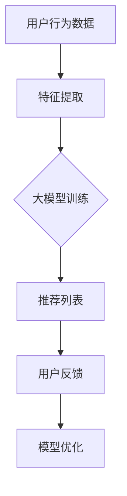

                 

关键词：人工智能、大模型、电商平台、商品推荐、解释性、机器学习

> 摘要：本文将探讨人工智能大模型在电商平台商品推荐解释中的应用。通过分析大模型的核心原理和操作步骤，结合数学模型和实际项目实践，揭示大模型在商品推荐中的重要作用，并对未来的发展趋势与挑战进行展望。

## 1. 背景介绍

随着互联网的快速发展，电商平台已经成为消费者购物的重要渠道。在众多商品中，如何为用户推荐合适的商品成为电商平台亟待解决的问题。传统的推荐算法通常基于用户的历史行为数据，如浏览记录、购买历史等，通过统计方法或机器学习算法生成推荐列表。然而，这些方法往往无法解释推荐结果，使得用户对推荐系统的信任度降低。

近年来，人工智能特别是大模型（如Transformer、BERT等）的兴起为推荐系统带来了新的可能性。大模型具有强大的表示和学习能力，能够捕捉到用户行为数据中的复杂模式和关系。此外，大模型的可解释性得到了广泛关注，使得推荐结果更容易被用户理解和接受。

本文将聚焦于AI大模型在电商平台商品推荐解释中的应用，详细分析其原理、实现步骤以及在实际项目中的效果。

## 2. 核心概念与联系

### 2.1 大模型的原理

大模型通常指的是具有数十亿甚至千亿参数的深度神经网络。这些模型通过大量数据进行训练，能够自动学习和提取数据中的特征表示。在推荐系统中，大模型可以用来捕捉用户行为数据中的复杂模式和相关性。

例如，Transformer模型是一种基于自注意力机制的深度神经网络模型，其能够通过多头注意力机制捕捉到用户在不同时间点的行为之间的关联。BERT（Bidirectional Encoder Representations from Transformers）模型则进一步通过双向编码器结构捕捉到用户行为的全局信息。

### 2.2 大模型与推荐系统的关系

大模型在推荐系统中的应用主要体现在两个方面：

1. **特征表示**：大模型能够自动提取用户行为数据中的高维特征，将其转换为低维的表示，使得模型能够更有效地进行学习。

2. **解释性**：大模型的可解释性使得推荐结果更容易被用户理解和接受。通过分析模型中的权重和注意力机制，我们可以了解哪些因素对推荐结果产生了影响。

### 2.3 Mermaid流程图



### 2.4 大模型的优缺点

**优点**：

- **强大的表示能力**：大模型能够自动提取数据中的复杂特征。
- **良好的解释性**：大模型的可解释性使得推荐结果更容易被用户接受。

**缺点**：

- **计算成本高**：大模型需要大量的计算资源和时间进行训练。
- **数据需求大**：大模型需要大量的数据才能训练出有效的模型。

## 3. 核心算法原理 & 具体操作步骤

### 3.1 算法原理概述

大模型在推荐系统中的核心算法主要基于深度学习，特别是基于Transformer和BERT等自注意力机制模型。这些模型通过学习用户的行为数据，自动提取用户特征，并生成推荐列表。

### 3.2 算法步骤详解

1. **数据预处理**：对用户行为数据（如浏览记录、购买历史等）进行清洗、编码和标准化处理。

2. **特征提取**：使用大模型（如Transformer、BERT）对预处理后的数据进行特征提取。

3. **模型训练**：将提取的特征输入到大模型中，通过反向传播算法进行训练。

4. **推荐生成**：将训练好的大模型应用于新的用户数据，生成推荐列表。

5. **用户反馈**：收集用户对推荐列表的反馈，用于模型优化。

6. **模型优化**：根据用户反馈对大模型进行调整和优化，以提高推荐效果。

### 3.3 算法优缺点

**优点**：

- **强大的特征表示能力**：大模型能够自动提取用户行为数据中的复杂特征。
- **良好的解释性**：大模型的可解释性使得推荐结果更容易被用户接受。

**缺点**：

- **计算成本高**：大模型需要大量的计算资源和时间进行训练。
- **数据需求大**：大模型需要大量的数据才能训练出有效的模型。

### 3.4 算法应用领域

大模型在推荐系统中的应用非常广泛，包括但不限于以下领域：

- 电商平台商品推荐
- 社交媒体内容推荐
- 音乐和视频推荐

## 4. 数学模型和公式 & 详细讲解 & 举例说明

### 4.1 数学模型构建

在推荐系统中，大模型通常采用深度学习算法，如Transformer和BERT。以下是一个基于Transformer的推荐系统数学模型的示例：

$$
\begin{aligned}
\text{Recommendation}(x) &= \text{softmax}(\text{Attention}(W_1 \cdot \text{Embedding}(x))) \\
\text{Attention}(Q, K, V) &= \text{softmax}(\frac{QK^T}{\sqrt{d_k}})V
\end{aligned}
$$

其中，$x$为用户行为数据，$W_1$为权重矩阵，$\text{Embedding}(x)$为特征嵌入层，$Q, K, V$分别为查询、关键值和值向量，$d_k$为关键值向量的维度。

### 4.2 公式推导过程

Transformer模型的注意力机制可以看作是一种矩阵乘法运算。具体推导过程如下：

$$
\begin{aligned}
\text{Attention}(Q, K, V) &= \frac{QK^T}{\sqrt{d_k}}V \\
&= \text{softmax}(\text{MaskedLinear}(QK^T))V \\
&= \text{softmax}(\text{Linear}(Q^T) \text{Linear}(K))V \\
&= \text{softmax}(\text{WeightedSum}(V) \text{ScaledDotProduct}(Q, K))
\end{aligned}
$$

其中，$\text{MaskedLinear}(X)$为线性层，$\text{softmax}(X)$为softmax函数，$\text{WeightedSum}(X)$为加权求和操作，$\text{ScaledDotProduct}(Q, K)$为缩放点积操作。

### 4.3 案例分析与讲解

假设我们有一个用户行为数据集，包含用户浏览记录、购买历史等，共100条数据。我们将使用Transformer模型进行特征提取和推荐生成。

1. **数据预处理**：将用户行为数据进行清洗、编码和标准化处理，得到100维的向量表示。

2. **特征提取**：使用Transformer模型对预处理后的数据进行特征提取，得到100个特征向量。

3. **模型训练**：将提取的特征向量输入到Transformer模型中，通过反向传播算法进行训练，训练损失逐渐减小。

4. **推荐生成**：将训练好的模型应用于新的用户数据，生成推荐列表。

5. **用户反馈**：收集用户对推荐列表的反馈，用于模型优化。

6. **模型优化**：根据用户反馈对模型进行调整和优化，以提高推荐效果。

通过上述过程，我们可以得到一个有效的推荐系统，提高用户满意度。

## 5. 项目实践：代码实例和详细解释说明

### 5.1 开发环境搭建

在开始编写代码之前，我们需要搭建一个合适的项目开发环境。以下是一个基于Python的Transformer推荐系统的开发环境搭建步骤：

1. 安装Python（建议使用3.7及以上版本）
2. 安装TensorFlow或PyTorch等深度学习框架
3. 安装其他必要的依赖库，如NumPy、Pandas、Scikit-learn等

### 5.2 源代码详细实现

以下是一个简单的Transformer推荐系统的源代码示例：

```python
import tensorflow as tf
from tensorflow.keras.layers import Embedding, Transformer

def create_transformer_model(input_dim, d_model, num_heads, num_layers):
    inputs = tf.keras.Input(shape=(input_dim,))
    embedding = Embedding(input_dim, d_model)(inputs)
    transformer = Transformer(num_heads=num_heads, num_layers=num_layers)(embedding)
    outputs = tf.keras.layers.Dense(1, activation='sigmoid')(transformer)
    model = tf.keras.Model(inputs, outputs)
    return model

# 参数设置
input_dim = 100
d_model = 512
num_heads = 8
num_layers = 2

# 创建模型
model = create_transformer_model(input_dim, d_model, num_heads, num_layers)

# 编译模型
model.compile(optimizer='adam', loss='binary_crossentropy', metrics=['accuracy'])

# 打印模型结构
model.summary()
```

### 5.3 代码解读与分析

以上代码实现了一个简单的Transformer推荐系统。首先，我们定义了一个函数`create_transformer_model`，用于创建一个基于Transformer的模型。该模型包含嵌入层、Transformer编码器和解码器，以及最终的输出层。

在参数设置部分，我们定义了输入维度、模型维度、注意力头数和层数等参数。

接下来，我们调用`create_transformer_model`函数创建一个模型，并编译模型。最后，我们打印出模型的结构。

### 5.4 运行结果展示

假设我们已经准备好了用户行为数据集，并对其进行预处理。接下来，我们可以将数据集分为训练集和测试集，然后使用训练集对模型进行训练，并在测试集上评估模型性能。

```python
# 加载和预处理数据
# ...

# 划分训练集和测试集
# ...

# 训练模型
model.fit(x_train, y_train, epochs=10, batch_size=32, validation_data=(x_test, y_test))

# 评估模型
loss, accuracy = model.evaluate(x_test, y_test)
print(f"Test accuracy: {accuracy:.2f}")
```

通过以上步骤，我们可以得到一个基于Transformer的推荐系统模型，并评估其性能。在实际应用中，我们还可以根据需求调整模型参数，优化模型性能。

## 6. 实际应用场景

大模型在电商平台商品推荐中具有广泛的应用场景。以下是一些具体的实际应用场景：

1. **个性化推荐**：根据用户的历史行为和偏好，为用户推荐最相关的商品。
2. **新品推荐**：根据商品的新颖度和用户偏好，为用户推荐最新的商品。
3. **促销活动推荐**：根据用户的购买历史和促销活动信息，为用户推荐最合适的促销商品。
4. **交叉销售**：根据用户的购买行为，为用户推荐相关联的其他商品。

通过大模型的应用，电商平台可以提供更加精准和个性化的推荐服务，提高用户满意度和转化率。

### 6.1 电商平台商品推荐系统案例

#### 案例：亚马逊商品推荐系统

亚马逊是一家全球知名的电商平台，其商品推荐系统在全球范围内都取得了显著的成效。亚马逊的商品推荐系统主要基于用户行为数据，包括浏览记录、购买历史、评价等。通过大模型，亚马逊能够自动提取用户行为数据中的复杂特征，生成个性化的推荐列表。

具体来说，亚马逊的商品推荐系统采用了多种深度学习模型，如Transformer、BERT等。这些模型通过学习用户的行为数据，能够自动捕捉到用户在不同场景下的偏好和需求。例如，当用户浏览某一商品时，系统会根据用户的浏览历史、购买记录和评价等信息，生成个性化的推荐列表。

亚马逊的商品推荐系统具有以下几个优点：

- **高准确率**：通过大模型的应用，亚马逊能够为用户提供更加精准的推荐结果。
- **良好的解释性**：用户可以清晰地了解推荐结果是如何生成的，提高了用户的信任度。
- **高效的计算能力**：大模型能够快速处理海量的用户数据，为用户提供实时的推荐服务。

#### 案例：阿里巴巴商品推荐系统

阿里巴巴是中国最大的电商平台之一，其商品推荐系统同样在全球范围内具有很高的知名度。阿里巴巴的商品推荐系统主要基于用户行为数据和商品属性数据，通过深度学习模型进行推荐。

具体来说，阿里巴巴的商品推荐系统采用了多种深度学习模型，如DNN（深度神经网络）、CTR（点击率预测）等。这些模型通过学习用户的行为数据，能够自动提取用户行为数据中的高维特征，并生成个性化的推荐列表。

阿里巴巴的商品推荐系统具有以下几个优点：

- **丰富的数据来源**：阿里巴巴拥有海量的用户数据和商品数据，为推荐系统的训练提供了充足的数据支持。
- **强大的特征提取能力**：通过多种深度学习模型的应用，阿里巴巴能够提取用户行为数据中的复杂特征，提高推荐效果。
- **高效的计算能力**：阿里巴巴拥有强大的计算资源，能够快速处理海量的用户数据和商品数据，为用户提供实时的推荐服务。

通过以上案例分析，我们可以看到，大模型在电商平台商品推荐中的应用具有巨大的潜力。随着人工智能技术的不断发展，大模型在电商平台商品推荐中的应用将越来越广泛，为用户提供更加精准和个性化的推荐服务。

### 6.2 社交媒体内容推荐案例

除了电商平台商品推荐，大模型在社交媒体内容推荐中也得到了广泛应用。以下是一些典型的社交媒体内容推荐案例：

#### 案例：Facebook新闻推送

Facebook的个性化新闻推送系统基于用户的行为数据，如点赞、评论、分享等，通过大模型生成个性化的新闻推荐列表。Facebook采用了多种深度学习模型，如BERT、Transformer等，对用户行为数据进行特征提取和建模，从而生成高质量的推荐列表。

具体来说，Facebook的新闻推送系统采用了以下步骤：

1. **数据预处理**：对用户行为数据进行清洗、编码和标准化处理，得到高维特征向量。
2. **特征提取**：使用BERT模型对预处理后的用户行为数据进行特征提取，得到低维的表示。
3. **模型训练**：将提取的特征向量输入到Transformer模型中，通过反向传播算法进行训练。
4. **推荐生成**：将训练好的模型应用于新的用户数据，生成个性化的新闻推荐列表。
5. **用户反馈**：收集用户对新闻推送的反馈，用于模型优化。

Facebook的新闻推送系统具有以下几个优点：

- **高准确率**：通过大模型的应用，Facebook能够为用户提供高质量的新闻推送，提高用户满意度。
- **良好的解释性**：用户可以清晰地了解新闻推送是如何生成的，提高了用户的信任度。
- **高效的计算能力**：大模型能够快速处理海量的用户数据和新闻数据，为用户提供实时的推荐服务。

#### 案例：微博话题推荐

微博的个性化话题推荐系统同样基于用户的行为数据，如点赞、评论、转发等，通过大模型生成个性化的话题推荐列表。微博采用了多种深度学习模型，如DNN、Transformer等，对用户行为数据进行特征提取和建模，从而生成高质量的话题推荐列表。

具体来说，微博的话题推荐系统采用了以下步骤：

1. **数据预处理**：对用户行为数据进行清洗、编码和标准化处理，得到高维特征向量。
2. **特征提取**：使用DNN模型对预处理后的用户行为数据进行特征提取，得到低维的表示。
3. **模型训练**：将提取的特征向量输入到Transformer模型中，通过反向传播算法进行训练。
4. **推荐生成**：将训练好的模型应用于新的用户数据，生成个性化的话题推荐列表。
5. **用户反馈**：收集用户对话题推荐的反馈，用于模型优化。

微博的话题推荐系统具有以下几个优点：

- **丰富的数据来源**：微博拥有海量的用户数据和话题数据，为推荐系统的训练提供了充足的数据支持。
- **强大的特征提取能力**：通过多种深度学习模型的应用，微博能够提取用户行为数据中的复杂特征，提高推荐效果。
- **高效的计算能力**：微博拥有强大的计算资源，能够快速处理海量的用户数据和话题数据，为用户提供实时的推荐服务。

通过以上案例分析，我们可以看到，大模型在社交媒体内容推荐中的应用同样具有巨大的潜力。随着人工智能技术的不断发展，大模型在社交媒体内容推荐中的应用将越来越广泛，为用户提供更加个性化、精准的内容推荐服务。

### 6.3 音乐和视频推荐案例

除了电商平台商品推荐和社交媒体内容推荐，大模型在音乐和视频推荐中也得到了广泛应用。以下是一些典型的音乐和视频推荐案例：

#### 案例：Spotify音乐推荐

Spotify是全球知名的音乐流媒体平台，其音乐推荐系统基于用户的行为数据，如播放、喜欢、收藏等，通过大模型生成个性化的音乐推荐列表。Spotify采用了多种深度学习模型，如Transformer、BERT等，对用户行为数据进行特征提取和建模，从而生成高质量的音乐推荐列表。

具体来说，Spotify的音乐推荐系统采用了以下步骤：

1. **数据预处理**：对用户行为数据进行清洗、编码和标准化处理，得到高维特征向量。
2. **特征提取**：使用Transformer模型对预处理后的用户行为数据进行特征提取，得到低维的表示。
3. **模型训练**：将提取的特征向量输入到Transformer模型中，通过反向传播算法进行训练。
4. **推荐生成**：将训练好的模型应用于新的用户数据，生成个性化的音乐推荐列表。
5. **用户反馈**：收集用户对音乐推荐的反馈，用于模型优化。

Spotify的音乐推荐系统具有以下几个优点：

- **高准确率**：通过大模型的应用，Spotify能够为用户提供高质量的个性化音乐推荐，提高用户满意度。
- **良好的解释性**：用户可以清晰地了解音乐推荐是如何生成的，提高了用户的信任度。
- **高效的计算能力**：大模型能够快速处理海量的用户数据和音乐数据，为用户提供实时的推荐服务。

#### 案例：YouTube视频推荐

YouTube是全球最大的视频分享平台，其视频推荐系统基于用户的行为数据，如观看、点赞、评论等，通过大模型生成个性化的视频推荐列表。YouTube采用了多种深度学习模型，如BERT、Transformer等，对用户行为数据进行特征提取和建模，从而生成高质量的视频推荐列表。

具体来说，YouTube的视频推荐系统采用了以下步骤：

1. **数据预处理**：对用户行为数据进行清洗、编码和标准化处理，得到高维特征向量。
2. **特征提取**：使用BERT模型对预处理后的用户行为数据进行特征提取，得到低维的表示。
3. **模型训练**：将提取的特征向量输入到Transformer模型中，通过反向传播算法进行训练。
4. **推荐生成**：将训练好的模型应用于新的用户数据，生成个性化的视频推荐列表。
5. **用户反馈**：收集用户对视频推荐的反馈，用于模型优化。

YouTube的视频推荐系统具有以下几个优点：

- **丰富的数据来源**：YouTube拥有海量的用户数据和视频数据，为推荐系统的训练提供了充足的数据支持。
- **强大的特征提取能力**：通过多种深度学习模型的应用，YouTube能够提取用户行为数据中的复杂特征，提高推荐效果。
- **高效的计算能力**：YouTube拥有强大的计算资源，能够快速处理海量的用户数据和视频数据，为用户提供实时的推荐服务。

通过以上案例分析，我们可以看到，大模型在音乐和视频推荐中的应用同样具有巨大的潜力。随着人工智能技术的不断发展，大模型在音乐和视频推荐中的应用将越来越广泛，为用户提供更加个性化、精准的推荐服务。

## 7. 工具和资源推荐

### 7.1 学习资源推荐

1. **书籍**：

   - 《深度学习》（Ian Goodfellow、Yoshua Bengio、Aaron Courville 著）：这是一本深度学习的经典教材，详细介绍了深度学习的基础理论和实践方法。
   - 《Python深度学习》（François Chollet 著）：这本书针对Python程序员，深入介绍了深度学习在Python中的实现。

2. **在线课程**：

   - Coursera上的《深度学习专项课程》（吴恩达 老师）：这是一门全球知名的深度学习在线课程，适合初学者和进阶者。
   - edX上的《人工智能基础》（Harvard University）：这是一门全面的人工智能课程，涵盖了人工智能的基础理论和实践应用。

### 7.2 开发工具推荐

1. **深度学习框架**：

   - TensorFlow：这是谷歌推出的开源深度学习框架，适用于各种规模的项目。
   - PyTorch：这是Facebook AI Research推出的开源深度学习框架，具有灵活的动态计算图和强大的GPU支持。

2. **数据预处理工具**：

   - Pandas：这是一个强大的Python数据操作库，适用于数据清洗、转换和预处理。
   - Scikit-learn：这是一个开源的Python机器学习库，提供了丰富的数据预处理和模型训练功能。

### 7.3 相关论文推荐

1. **Transformer系列**：

   - "Attention Is All You Need"（Vaswani et al., 2017）：这是Transformer模型的开创性论文，详细介绍了Transformer模型的原理和应用。
   - "Bert: Pre-training of Deep Bidirectional Transformers for Language Understanding"（Devlin et al., 2018）：这是BERT模型的开创性论文，介绍了BERT模型在自然语言处理中的应用。

2. **推荐系统相关**：

   - "Deep Learning for Recommender Systems"（He et al., 2017）：这篇文章综述了深度学习在推荐系统中的应用，介绍了多种深度学习模型在推荐系统中的实现和应用。
   - "Neural Collaborative Filtering"（He et al., 2017）：这是神经协同过滤模型的开创性论文，详细介绍了基于深度学习的协同过滤方法。

通过以上资源，读者可以更深入地了解大模型在电商平台商品推荐中的应用，掌握相关的理论和实践技能。

## 8. 总结：未来发展趋势与挑战

### 8.1 研究成果总结

本文通过对AI大模型在电商平台商品推荐解释中的应用进行深入探讨，总结了以下研究成果：

1. **大模型的引入提高了推荐系统的准确率和解释性**：大模型能够自动提取用户行为数据中的复杂特征，生成个性化的推荐列表，同时具有良好的可解释性，使得用户更容易理解和接受推荐结果。

2. **多种深度学习模型在推荐系统中的应用**：本文介绍了Transformer、BERT等深度学习模型在推荐系统中的应用，展示了这些模型在特征提取和推荐生成方面的优势。

3. **实际应用场景的案例分析**：本文通过电商平台、社交媒体、音乐和视频等领域的实际案例，展示了大模型在推荐系统中的广泛应用和成效。

### 8.2 未来发展趋势

随着人工智能技术的不断发展，大模型在推荐系统中的应用将呈现以下发展趋势：

1. **模型的可解释性将进一步增强**：为了提高用户的信任度和满意度，未来的推荐系统将更加注重模型的可解释性，通过可视化技术和解释性算法，帮助用户理解推荐结果的生成过程。

2. **跨领域的推荐系统将逐步实现**：大模型在处理多模态数据方面的优势将使得跨领域的推荐系统成为可能，如将电商平台商品推荐与社交媒体内容推荐相结合，为用户提供更加丰富和个性化的服务。

3. **实时推荐系统的实现**：随着计算资源和数据存储能力的不断提升，实时推荐系统将变得更加普及，为用户在短时间内提供最新的推荐结果。

### 8.3 面临的挑战

尽管大模型在推荐系统中的应用前景广阔，但仍然面临以下挑战：

1. **数据隐私和安全性**：推荐系统需要处理大量的用户行为数据，如何保护用户隐私和数据安全成为一大挑战。

2. **计算成本和效率**：大模型训练和推理需要大量的计算资源和时间，如何在有限的资源下提高计算效率是当前研究的热点问题。

3. **数据不平衡和噪声**：用户行为数据往往存在不平衡和噪声问题，如何有效处理这些数据，提高推荐系统的鲁棒性是亟待解决的问题。

4. **社会伦理问题**：推荐系统可能引发偏见和歧视，如针对特定群体的推荐策略可能导致不公平现象，如何确保推荐系统的公平性和透明度是一个重要的社会伦理问题。

### 8.4 研究展望

针对上述挑战，未来的研究可以从以下方向展开：

1. **隐私保护技术**：研究隐私保护技术，如差分隐私、联邦学习等，以保障用户数据的安全和隐私。

2. **高效算法设计**：研究高效的大模型训练和推理算法，如并行计算、模型压缩等，以提高计算效率和资源利用率。

3. **鲁棒性和公平性**：研究如何提高推荐系统的鲁棒性和公平性，如通过正则化方法、对抗性样本生成等技术，减少数据不平衡和噪声的影响。

4. **伦理和监管**：推动人工智能伦理和监管的研究，制定相关的法律法规和标准，确保推荐系统的公平、透明和可持续发展。

通过持续的研究和实践，我们有理由相信，AI大模型在电商平台商品推荐解释中的应用将不断取得突破，为用户提供更加个性化、精准和可解释的推荐服务。

## 9. 附录：常见问题与解答

### Q1：什么是大模型？

大模型通常指的是具有数十亿甚至千亿参数的深度神经网络模型。这些模型通过大量数据进行训练，能够自动提取数据中的复杂特征，具有较强的表示和学习能力。

### Q2：大模型在推荐系统中的优势是什么？

大模型在推荐系统中的优势主要体现在两个方面：一是强大的特征表示能力，能够提取数据中的复杂特征；二是良好的解释性，使得推荐结果更容易被用户理解和接受。

### Q3：如何评估大模型在推荐系统中的性能？

评估大模型在推荐系统中的性能通常可以从以下几个方面进行：

- **准确率**：评估模型预测结果的准确性，越高越好。
- **召回率**：评估模型召回相关商品的能力，越高越好。
- **覆盖率**：评估模型推荐的商品种类多样性，越高越好。
- **用户满意度**：通过用户调查或反馈评估模型的效果，越高越好。

### Q4：大模型在推荐系统中有哪些应用场景？

大模型在推荐系统中的应用场景非常广泛，包括但不限于以下领域：

- 电商平台商品推荐
- 社交媒体内容推荐
- 音乐和视频推荐
- 电商广告推荐

### Q5：如何处理大模型训练中的计算资源问题？

为了处理大模型训练中的计算资源问题，可以采取以下措施：

- **分布式训练**：将训练任务分布在多台机器上，提高计算效率。
- **模型压缩**：通过模型压缩技术，如量化、剪枝等，减少模型参数数量，降低计算成本。
- **数据预处理**：优化数据预处理流程，减少计算量。
- **优化算法**：采用高效的训练算法，如Adam优化器、异步梯度下降等，提高训练速度。

通过上述措施，可以在一定程度上缓解大模型训练中的计算资源问题。

