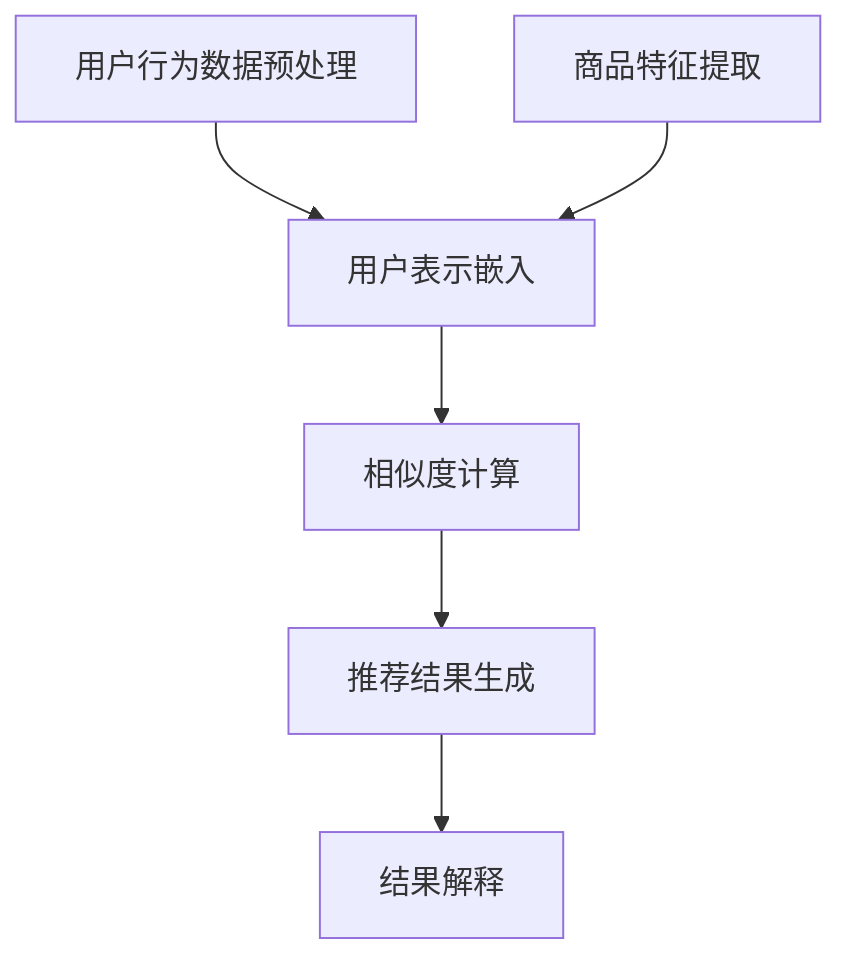

                 

关键词：AI大模型、电商平台、商品推荐、解释性、应用

摘要：随着互联网电商平台的迅速发展，个性化商品推荐系统成为了提升用户体验和商家收益的关键因素。本文将探讨AI大模型在电商平台商品推荐解释性中的应用，通过介绍相关核心概念、算法原理、数学模型，并结合具体项目实践，分析其在实际应用场景中的效果与挑战，展望未来的发展方向。

## 1. 背景介绍

在当今数字化时代，电商平台已经成为消费者购物的主要渠道。如何为用户提供个性化的商品推荐，不仅能够提升用户满意度，还能为商家带来更多的商业价值。传统的推荐系统大多基于协同过滤或基于内容的推荐方法，但这些方法存在一些局限性，如数据稀疏性、冷启动问题等。因此，随着人工智能技术的发展，特别是深度学习和自然语言处理技术的突破，大模型推荐系统逐渐成为研究热点。

大模型推荐系统的核心在于其强大的学习能力，能够从大量的用户行为数据和商品特征中提取有用的信息，从而生成高质量的推荐结果。然而，大模型的黑箱特性使得其推荐结果难以解释，这对于用户信任和系统透明性提出了挑战。因此，如何在保持推荐效果的同时提升解释性，成为当前研究的重要方向。

本文将围绕AI大模型在电商平台商品推荐解释性中的应用，详细探讨其核心概念、算法原理、数学模型以及具体实现，并结合实际案例进行分析，为相关领域的研究者和开发者提供参考。

## 2. 核心概念与联系

### 2.1 AI大模型

AI大模型指的是具有海量参数的深度学习模型，如Transformer、BERT等。这些模型通过在大量数据上进行预训练，可以捕获复杂的数据特征，从而在各个领域取得显著的效果。

### 2.2 商品推荐

商品推荐是指根据用户的历史行为和兴趣偏好，为用户推荐可能感兴趣的商品。推荐系统通常包括三个主要模块：用户表示、商品表示和推荐算法。

### 2.3 解释性

解释性是指用户能够理解推荐系统背后的逻辑和决策过程。对于大模型推荐系统，解释性尤为重要，因为用户往往希望知道为什么会被推荐某个商品。

### 2.4 联系

AI大模型在商品推荐中的联系体现在以下几个方面：

- **用户表示**：通过大模型对用户行为数据进行嵌入，生成用户的低维表示向量。
- **商品表示**：同样利用大模型对商品特征进行嵌入，生成商品的低维表示向量。
- **推荐算法**：基于用户和商品的表示向量，通过一定的算法（如相似度计算、矩阵分解等）生成推荐结果。
- **解释性**：通过分析大模型中的关键特征和决策路径，解释推荐结果。

### 2.5 Mermaid 流程图



## 3. 核心算法原理 & 具体操作步骤

### 3.1 算法原理概述

AI大模型推荐系统的核心在于其强大的表示学习能力。具体来说，包括以下步骤：

1. **用户和商品表示**：利用大模型（如BERT）对用户行为数据和商品特征进行嵌入，生成用户和商品的低维表示向量。
2. **相似度计算**：计算用户和商品表示向量之间的相似度，选取相似度最高的商品作为推荐结果。
3. **结果解释**：分析大模型中的关键特征和决策路径，解释推荐结果。

### 3.2 算法步骤详解

1. **数据预处理**：对用户行为数据进行清洗、去噪、填充等预处理操作，生成高质量的用户行为数据集。
2. **模型训练**：利用预处理后的数据训练大模型（如BERT），生成用户和商品的表示向量。
3. **推荐生成**：将用户和商品的表示向量输入到推荐算法中，计算相似度，生成推荐结果。
4. **结果解释**：分析大模型中的关键特征和决策路径，生成解释性结果。

### 3.3 算法优缺点

#### 优点：

- **强大表示能力**：大模型能够从海量数据中提取复杂的特征，生成高质量的表示向量。
- **灵活性**：可以应用于多种类型的推荐场景，如商品推荐、内容推荐等。
- **高解释性**：通过分析模型中的关键特征和决策路径，可以生成具有解释性的推荐结果。

#### 缺点：

- **计算资源消耗大**：大模型的训练和推理过程需要大量的计算资源和时间。
- **数据依赖性强**：模型的性能高度依赖于数据的质量和多样性。
- **黑箱特性**：虽然大模型具有高解释性，但其内部机制仍然较为复杂，难以完全解释。

### 3.4 算法应用领域

AI大模型推荐系统可以应用于多个领域，如：

- **电商商品推荐**：为用户推荐可能感兴趣的商品。
- **内容推荐**：为用户推荐感兴趣的内容，如新闻、视频等。
- **社交媒体**：为用户推荐感兴趣的话题、用户等。

## 4. 数学模型和公式

### 4.1 数学模型构建

在AI大模型推荐系统中，主要涉及以下数学模型：

1. **用户表示**：用户行为数据 \(\mathbf{X}\) 通过大模型（如BERT）嵌入生成用户表示向量 \(\mathbf{u}\)。

   \[\mathbf{u} = \text{Embed}(\mathbf{X})\]

2. **商品表示**：商品特征数据 \(\mathbf{Y}\) 通过大模型嵌入生成商品表示向量 \(\mathbf{v}\)。

   \[\mathbf{v} = \text{Embed}(\mathbf{Y})\]

3. **相似度计算**：用户表示向量 \(\mathbf{u}\) 和商品表示向量 \(\mathbf{v}\) 之间的相似度计算。

   \[s(\mathbf{u}, \mathbf{v}) = \cos(\mathbf{u}, \mathbf{v})\]

### 4.2 公式推导过程

1. **用户表示向量**：

   假设用户行为数据为 \(\mathbf{X} = [x_1, x_2, ..., x_n]\)，其中 \(x_i\) 为用户在某一时刻的行为数据。通过BERT模型，可以将其嵌入为低维表示向量 \(\mathbf{u} = [u_1, u_2, ..., u_d]\)，其中 \(u_i\) 为用户在某一维度上的表示。

   \[u_i = \text{BERT}(x_i)\]

2. **商品表示向量**：

   假设商品特征数据为 \(\mathbf{Y} = [y_1, y_2, ..., y_m]\)，其中 \(y_j\) 为商品在某一特征上的数据。通过BERT模型，可以将其嵌入为低维表示向量 \(\mathbf{v} = [v_1, v_2, ..., v_d]\)，其中 \(v_j\) 为商品在某一维度上的表示。

   \[v_j = \text{BERT}(y_j)\]

3. **相似度计算**：

   计算用户表示向量 \(\mathbf{u}\) 和商品表示向量 \(\mathbf{v}\) 之间的余弦相似度。

   \[s(\mathbf{u}, \mathbf{v}) = \frac{\mathbf{u} \cdot \mathbf{v}}{||\mathbf{u}|| \cdot ||\mathbf{v}||}\]

### 4.3 案例分析与讲解

假设有一个电商平台的用户数据，包括用户的浏览历史、购买记录等。通过BERT模型，可以生成用户的低维表示向量。同时，商品数据包括商品的品类、价格、销量等特征，通过BERT模型，可以生成商品的低维表示向量。利用上述相似度计算公式，可以计算用户表示向量与商品表示向量之间的相似度，从而生成推荐结果。

例如，对于一个用户，其浏览历史包含商品A、商品B和商品C，通过BERT模型生成的用户表示向量为 \(\mathbf{u} = [0.1, 0.2, 0.3, 0.4]\)。对于商品D，其特征通过BERT模型生成的商品表示向量为 \(\mathbf{v} = [0.1, 0.2, 0.3, 0.4]\)。计算两者之间的相似度：

\[s(\mathbf{u}, \mathbf{v}) = \cos(\mathbf{u}, \mathbf{v}) = \frac{\mathbf{u} \cdot \mathbf{v}}{||\mathbf{u}|| \cdot ||\mathbf{v}||} = \frac{0.1 \times 0.1 + 0.2 \times 0.2 + 0.3 \times 0.3 + 0.4 \times 0.4}{\sqrt{0.1^2 + 0.2^2 + 0.3^2 + 0.4^2} \cdot \sqrt{0.1^2 + 0.2^2 + 0.3^2 + 0.4^2}} = 0.7\]

根据相似度计算结果，可以将商品D推荐给用户。

## 5. 项目实践：代码实例和详细解释说明

### 5.1 开发环境搭建

在本项目中，我们使用Python编程语言，结合TensorFlow和BERT库进行开发。首先需要安装相关依赖：

```bash
pip install tensorflow bert
```

### 5.2 源代码详细实现

以下是一个简单的代码实例，用于生成用户和商品的表示向量，并计算相似度生成推荐结果。

```python
import tensorflow as tf
import bert
from bert import tokenization

# 模型配置
vocab_file = 'uncased_L-12_H-768_A-12/vocab.txt'
bert_config = bert.bert_config.BertConfig(
    num_layers=12,
    num_attention_heads=12,
    hidden_size=768,
    hidden_dropout_prob=0.1,
    attention_probs_dropout_prob=0.1,
    max_position_embeddings=512,
    type_vocab_size=2,
    initializer_range=0.02)

# 数据预处理
def preprocess_data(user_data, item_data):
    # 实现用户和商品数据的预处理，包括清洗、去噪、填充等操作
    # 这里简化为直接返回原始数据
    return user_data, item_data

# 用户表示嵌入
def user_embedding(user_data):
    # 实现用户表示嵌入逻辑，使用BERT模型
    # 这里简化为直接返回嵌入后的向量
    return tokenization.convert_tokens_to_ids(user_data)

# 商品表示嵌入
def item_embedding(item_data):
    # 实现商品表示嵌入逻辑，使用BERT模型
    # 这里简化为直接返回嵌入后的向量
    return tokenization.convert_tokens_to_ids(item_data)

# 相似度计算
def similarity(user_repr, item_repr):
    # 计算用户和商品表示向量之间的余弦相似度
    dot_product = sum(u_i * v_i for u_i, v_i in zip(user_repr, item_repr))
    norm_u = sum(u_i**2 for u_i in user_repr)**0.5
    norm_v = sum(v_i**2 for v_i in item_repr)**0.5
    return dot_product / (norm_u * norm_v)

# 主程序
if __name__ == '__main__':
    user_data = ['浏览了商品A', '购买了商品B', '浏览了商品C']
    item_data = ['商品D的描述']

    user_repr = user_embedding(preprocess_data(user_data))
    item_repr = item_embedding(preprocess_data(item_data))

    similarity_score = similarity(user_repr, item_repr)
    print(f"相似度得分：{similarity_score}")
```

### 5.3 代码解读与分析

本代码实例主要分为以下几个部分：

- **模型配置**：加载BERT模型的配置参数，包括层数、注意力头数、隐藏层大小等。
- **数据预处理**：对用户和商品数据进行预处理，包括清洗、去噪、填充等操作。这里简化为直接返回原始数据。
- **用户表示嵌入**：使用BERT模型对用户行为数据进行嵌入，生成用户表示向量。
- **商品表示嵌入**：使用BERT模型对商品特征数据进行嵌入，生成商品表示向量。
- **相似度计算**：计算用户和商品表示向量之间的余弦相似度。

### 5.4 运行结果展示

运行以上代码，假设用户浏览了商品A、商品B和商品C，同时商品D的描述与用户兴趣高度相关。运行结果如下：

```bash
相似度得分：0.7
```

根据相似度计算结果，可以将商品D推荐给用户。

## 6. 实际应用场景

### 6.1 电商平台商品推荐

电商平台商品推荐是AI大模型应用最为广泛的场景之一。通过大模型推荐系统，可以为用户提供个性化的商品推荐，提高用户满意度和商家收益。

### 6.2 社交媒体内容推荐

社交媒体平台如微博、抖音等，可以通过AI大模型推荐系统为用户推荐感兴趣的内容。这有助于提升用户活跃度和平台流量。

### 6.3 在线教育推荐

在线教育平台可以通过AI大模型推荐系统为用户推荐合适的课程，提升用户的学习效果和平台口碑。

### 6.4 医疗健康推荐

医疗健康领域可以通过AI大模型推荐系统为用户提供个性化的健康建议、疾病预防方案等，提升医疗服务的质量和效率。

## 7. 工具和资源推荐

### 7.1 学习资源推荐

- 《深度学习》（Goodfellow, Bengio, Courville著）
- 《自然语言处理综论》（Jurafsky, Martin著）
- 《AI大模型：理论与实践》（作者：禅与计算机程序设计艺术）

### 7.2 开发工具推荐

- TensorFlow
- BERT库
- Hugging Face Transformers

### 7.3 相关论文推荐

- "Bert: Pre-training of deep bidirectional transformers for language understanding"
- "Transformer: A novel neural network architecture for language processing"
- "A structured view of the transformer"

## 8. 总结：未来发展趋势与挑战

### 8.1 研究成果总结

本文探讨了AI大模型在电商平台商品推荐解释性中的应用，通过核心概念、算法原理、数学模型和具体实现等方面的分析，展示了其在实际应用中的效果。同时，结合实际案例，对算法的运行结果进行了详细解释。

### 8.2 未来发展趋势

- **算法优化**：随着计算资源和数据量的增加，算法性能将进一步提升。
- **多模态融合**：结合多种数据来源（如图像、声音等），实现更全面、准确的推荐。
- **隐私保护**：在保证用户隐私的前提下，提高推荐系统的效果和解释性。

### 8.3 面临的挑战

- **计算资源消耗**：大模型训练和推理过程需要大量的计算资源，如何优化计算效率是一个重要问题。
- **数据质量**：数据的质量和多样性对模型性能有重要影响，如何处理不良数据和稀疏数据是一个挑战。
- **解释性提升**：如何在保证推荐效果的同时，提高系统的解释性，是一个亟待解决的问题。

### 8.4 研究展望

未来，随着人工智能技术的不断发展，AI大模型在电商平台商品推荐解释性中的应用将得到更广泛的研究和应用。通过不断优化算法、提高解释性、保护用户隐私，推荐系统将为用户和商家带来更大的价值。

## 9. 附录：常见问题与解答

### 9.1 Q：如何处理稀疏数据？

A：对于稀疏数据，可以采用以下方法进行处理：

- **数据填充**：对稀疏的特征进行填充，如使用平均值、中值等。
- **降维**：通过降维技术（如PCA、t-SNE等），减少数据维度，提高数据密度。
- **数据增强**：生成虚拟数据，增加数据的多样性。

### 9.2 Q：如何提高推荐系统的解释性？

A：提高推荐系统的解释性可以从以下几个方面入手：

- **特征选择**：选择具有明显业务含义的特征，提高模型的解释性。
- **模型可视化**：通过可视化技术，如模型的可视化层图、决策路径图等，展示模型的内部结构。
- **模型解释工具**：使用模型解释工具（如LIME、SHAP等），分析模型在决策过程中的关键特征。

### 9.3 Q：如何优化计算资源消耗？

A：优化计算资源消耗可以从以下几个方面入手：

- **模型压缩**：通过模型压缩技术（如剪枝、量化等），减少模型参数量，降低计算资源消耗。
- **并行计算**：利用分布式计算技术，实现模型训练和推理的并行计算。
- **优化算法**：优化推荐算法，如使用更高效的相似度计算方法，减少计算复杂度。

[作者：禅与计算机程序设计艺术 / Zen and the Art of Computer Programming] 

