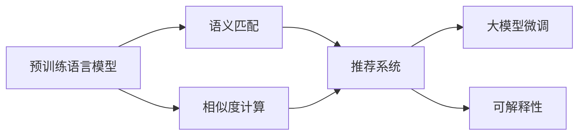

                 

# AI大模型在电商平台商品相似度计算中的应用

## 1. 背景介绍

### 1.1 问题由来

在现代电商平台上，用户通过搜索引擎或推荐系统寻找商品，搜索引擎的查询结果好坏直接影响用户体验和平台交易转化率。商品相似度计算是搜索引擎的核心功能之一，用于将用户输入的查询转化为与商品匹配的推荐结果。

由于不同用户输入的查询方式各异，如何提升商品相似度计算的精确度，成为电商平台亟需解决的问题。传统的商品相似度计算方法往往基于词袋模型或TF-IDF等方法，难以捕捉词语之间的语义关系，无法充分理解用户查询的真实意图。

随着深度学习和大模型技术的发展，电商平台逐渐引入预训练语言模型来提升商品相似度计算效果。基于大模型的查询理解技术，可以更加精准地匹配用户查询，生成匹配度更高的推荐结果，从而提升电商平台的搜索体验和转化率。

### 1.2 问题核心关键点

基于大模型在商品相似度计算中的应用，主要包括以下几个关键问题：

- 如何选择合适的预训练语言模型，进行商品标签与查询的语义匹配？
- 如何利用大模型的语言理解能力，提升商品相似度计算的准确性？
- 如何将大模型的输出与传统的推荐算法结合，生成更精准的搜索结果？
- 如何构建训练数据集，评估模型性能，迭代优化模型？

本文将系统性地介绍基于大模型在电商平台商品相似度计算中的应用，旨在为电商平台的搜索和推荐系统提供参考。

## 2. 核心概念与联系

### 2.1 核心概念概述

在介绍具体算法前，我们先来梳理一下涉及的关键概念：

- 预训练语言模型(Pre-trained Language Models, PLMs)：如BERT、GPT等，通过在无标签数据上进行预训练，学习到通用的语言表示，具备强大的语言理解和生成能力。
- 语义匹配(Semantic Matching)：通过语义相似度计算，将查询与商品进行匹配，生成与查询最相关的推荐结果。
- 相似度计算(Similarity Computation)：量化查询与商品之间的相似度，衡量它们之间的语义相关性。
- 推荐系统(Recommendation System)：使用机器学习算法，根据用户的历史行为和属性，为用户推荐商品。
- 大模型微调(Fine-tuning)：利用大模型在特定领域的少量标注数据上进行微调，使其适应特定应用场景，提高模型性能。
- 可解释性(Explainability)：解释模型预测的过程和结果，增强用户对推荐结果的信任。

这些概念之间的联系如下图所示：



预训练语言模型通过大规模无标签数据预训练，学习通用的语言表示。语义匹配技术将用户查询与商品进行匹配，生成最相关的推荐结果。相似度计算量化查询与商品的相似度，用于排序和推荐。推荐系统基于用户行为，生成个性化推荐。大模型微调利用领域数据对模型进行优化，提升特定任务性能。可解释性技术解释推荐结果，增强用户信任。

## 3. 核心算法原理 & 具体操作步骤

### 3.1 算法原理概述

基于大模型在商品相似度计算中的应用，主要分为两个步骤：

1. 利用预训练语言模型进行查询理解，生成商品相关性的预测结果。
2. 将预测结果与商品特征进行融合，生成最终的相似度评分。

第一步为查询理解过程，主要利用预训练语言模型对用户查询进行理解，生成与商品相关性的预测结果。第二步为相似度计算过程，将预测结果与商品特征进行融合，生成最终的相似度评分。

具体来说，查询理解过程可以分为三个子步骤：

1. 查询表示化：将用户查询转化为模型的输入，生成查询向量。
2. 商品表示化：将商品描述文本转化为模型的输入，生成商品向量。
3. 匹配预测：利用模型对查询和商品向量进行匹配，生成相关性预测结果。

相似度计算过程可以分为两个子步骤：

1. 特征提取：将查询和商品特征向量进行融合，生成特征表示。
2. 相似度评分：基于特征表示计算相似度评分，用于排序推荐。

### 3.2 算法步骤详解

#### 3.2.1 查询理解

**Step 1: 查询表示化**

查询表示化是将用户查询转化为模型的输入，生成查询向量。可以采用多种方式，如通过分词、词向量嵌入、BERT等预训练语言模型。

例如，使用BERT模型对用户查询进行编码：

```python
from transformers import BertTokenizer, BertForSequenceClassification
from transformers import BertTokenizerFast, TFBertForSequenceClassification
import torch

model_name = "bert-base-cased"
tokenizer = BertTokenizer.from_pretrained(model_name)
query = "购买什么品牌的女鞋"
inputs = tokenizer(query, return_tensors='pt')
```

**Step 2: 商品表示化**

商品表示化是将商品描述文本转化为模型的输入，生成商品向量。同样可以采用多种方式，如分词、词向量嵌入、BERT等预训练语言模型。

例如，使用BERT模型对商品描述进行编码：

```python
model_name = "bert-base-cased"
tokenizer = BertTokenizer.from_pretrained(model_name)
product_desc = "这款女鞋非常舒适"
inputs = tokenizer(product_desc, return_tensors='pt')
```

**Step 3: 匹配预测**

匹配预测是利用模型对查询和商品向量进行匹配，生成相关性预测结果。通常使用softmax函数进行预测，生成商品与查询的相关性分数。

例如，使用BERT模型进行查询与商品匹配预测：

```python
model_name = "bert-base-cased"
tokenizer = BertTokenizer.from_pretrained(model_name)
model = BertForSequenceClassification.from_pretrained(model_name)

inputs = tokenizer(query, product_desc, return_tensors='pt')
labels = torch.tensor([1], dtype=torch.long)
outputs = model(**inputs, labels=labels)
```

#### 3.2.2 相似度计算

**Step 1: 特征提取**

特征提取是将查询和商品特征向量进行融合，生成特征表示。通常采用加权融合方式，根据查询和商品的相似度分数，对特征进行加权处理。

例如，将查询和商品特征向量进行融合：

```python
features = tf.concat([query_vector, product_vector], axis=-1)
features = tf.keras.layers.Dense(256, activation='relu')(features)
features = tf.keras.layers.Dropout(0.5)(features)
```

**Step 2: 相似度评分**

相似度评分是基于特征表示计算相似度评分，用于排序推荐。常用的相似度计算方法包括余弦相似度、欧式距离、曼哈顿距离等。

例如，使用余弦相似度计算查询与商品的相似度：

```python
from sklearn.metrics.pairwise import cosine_similarity

query_vector = ...
product_vector = ...

similarity = cosine_similarity(query_vector, product_vector)
```

### 3.3 算法优缺点

**优点：**

1. 利用大模型的语言理解能力，提升查询理解效果，生成更精准的商品推荐结果。
2. 可扩展性强，可以处理多种查询方式和商品描述，适应多种电商平台的搜索需求。
3. 模型效果稳定，预训练模型参数经过大规模数据训练，具备良好的泛化能力。
4. 可以与其他推荐算法结合，生成更加精准的推荐结果。

**缺点：**

1. 模型计算复杂度高，查询理解和相似度计算需要较大的计算资源。
2. 模型参数量大，难以在小规模数据上获得理想效果。
3. 查询表示化方式单一，无法充分理解查询中的隐含信息。
4. 相似度计算依赖特征提取方式，需要精心设计特征提取策略。

### 3.4 算法应用领域

基于大模型在商品相似度计算中的应用，已经在多个电商平台得到了广泛应用，包括但不限于以下几个领域：

- 购物搜索引擎：提升用户查询的匹配度和准确度，生成更精准的推荐结果。
- 个性化推荐系统：利用查询和商品的相关性预测，生成个性化推荐商品列表。
- 搜索结果排序：基于相似度评分对搜索结果进行排序，提升用户搜索体验。
- 搜索分析：分析用户查询行为，发现用户搜索偏好，优化查询理解模型。

## 4. 数学模型和公式 & 详细讲解 & 举例说明

### 4.1 数学模型构建

在商品相似度计算中，主要涉及以下数学模型：

1. 查询表示化模型：将用户查询转化为模型的输入，生成查询向量。
2. 商品表示化模型：将商品描述文本转化为模型的输入，生成商品向量。
3. 匹配预测模型：利用模型对查询和商品向量进行匹配，生成相关性预测结果。
4. 相似度评分模型：基于特征表示计算相似度评分，用于排序推荐。

**查询表示化模型：**

假设用户查询为 $Q$，商品描述文本为 $P$。查询向量表示为 $q$，商品向量表示为 $p$。查询表示化的目标是将查询 $Q$ 转化为向量 $q$。

常用的查询表示化方法包括分词、词向量嵌入、BERT等预训练语言模型。例如，使用BERT模型对用户查询进行编码：

$$ q = \text{BERT}(Q) $$

**商品表示化模型：**

商品表示化的目标是将商品描述文本 $P$ 转化为向量 $p$。

常用的商品表示化方法包括分词、词向量嵌入、BERT等预训练语言模型。例如，使用BERT模型对商品描述进行编码：

$$ p = \text{BERT}(P) $$

**匹配预测模型：**

匹配预测的目标是利用模型对查询和商品向量进行匹配，生成相关性预测结果。

假设匹配预测模型为 $f$，将查询 $Q$ 和商品 $P$ 输入到模型中，得到相关性预测结果 $R$。

$$ R = f(Q, P) $$

**相似度评分模型：**

相似度评分模型的目标是将查询和商品特征向量进行融合，生成特征表示 $F$，然后基于特征表示计算相似度评分 $S$。

常用的相似度评分方法包括余弦相似度、欧式距离、曼哈顿距离等。

例如，使用余弦相似度计算查询与商品的相似度：

$$ S = \text{cosine}(Q, P) $$

### 4.2 公式推导过程

#### 查询表示化公式推导

查询表示化过程中，假设查询 $Q$ 包含 $n$ 个词语，每个词语 $q_i$ 对应的BERT输出向量为 $v_i$。则查询向量 $q$ 可以通过 $v_i$ 进行加权平均得到：

$$ q = \sum_{i=1}^{n} \alpha_i v_i $$

其中，$\alpha_i$ 为第 $i$ 个词语的权重。

**商品表示化公式推导**

商品表示化过程中，假设商品描述 $P$ 包含 $m$ 个词语，每个词语 $p_j$ 对应的BERT输出向量为 $w_j$。则商品向量 $p$ 可以通过 $w_j$ 进行加权平均得到：

$$ p = \sum_{j=1}^{m} \beta_j w_j $$

其中，$\beta_j$ 为第 $j$ 个词语的权重。

**匹配预测公式推导**

假设查询 $Q$ 和商品 $P$ 分别表示为 $q$ 和 $p$，匹配预测模型 $f$ 输出的相关性预测结果为 $R$。

$$ R = f(q, p) $$

常用的匹配预测方法包括softmax函数，用于生成商品与查询的相关性分数：

$$ R_i = \frac{\exp(\text{score}(Q, P_i))}{\sum_{j=1}^{m} \exp(\text{score}(Q, P_j))} $$

其中，$\text{score}(Q, P_i)$ 为查询 $Q$ 和商品 $P_i$ 之间的匹配分数。

**相似度评分公式推导**

假设查询 $Q$ 和商品 $P$ 分别表示为 $q$ 和 $p$，相似度评分模型 $s$ 输出的相似度分数为 $S$。

常用的相似度评分方法包括余弦相似度，用于计算查询与商品的相似度：

$$ S = \text{cosine}(q, p) $$

其中，$\text{cosine}(q, p)$ 为查询向量 $q$ 和商品向量 $p$ 之间的余弦相似度。

### 4.3 案例分析与讲解

**案例分析**

假设电商平台有一个商品 $P$，商品描述为 "这款女鞋舒适，样式时尚，非常适合日常穿着"。

**Step 1: 查询表示化**

用户输入查询 $Q$："购买什么品牌的女鞋"。

使用BERT模型对查询进行编码，得到查询向量 $q$：

$$ q = \text{BERT}(Q) $$

**Step 2: 商品表示化**

使用BERT模型对商品描述进行编码，得到商品向量 $p$：

$$ p = \text{BERT}(P) $$

**Step 3: 匹配预测**

将查询 $Q$ 和商品 $P$ 输入到匹配预测模型 $f$ 中，得到相关性预测结果 $R$：

$$ R = f(Q, P) $$

**Step 4: 相似度评分**

基于查询向量 $q$ 和商品向量 $p$，计算相似度评分 $S$：

$$ S = \text{cosine}(q, p) $$

## 5. 项目实践：代码实例和详细解释说明

### 5.1 开发环境搭建

在进行商品相似度计算实践前，我们需要准备好开发环境。以下是使用Python进行PyTorch开发的环境配置流程：

1. 安装Anaconda：从官网下载并安装Anaconda，用于创建独立的Python环境。

2. 创建并激活虚拟环境：
```bash
conda create -n pytorch-env python=3.8 
conda activate pytorch-env
```

3. 安装PyTorch：根据CUDA版本，从官网获取对应的安装命令。例如：
```bash
conda install pytorch torchvision torchaudio cudatoolkit=11.1 -c pytorch -c conda-forge
```

4. 安装Transformers库：
```bash
pip install transformers
```

5. 安装各类工具包：
```bash
pip install numpy pandas scikit-learn matplotlib tqdm jupyter notebook ipython
```

完成上述步骤后，即可在`pytorch-env`环境中开始商品相似度计算实践。

### 5.2 源代码详细实现

下面我们以商品相似度计算为例，给出使用Transformers库进行查询和商品匹配的PyTorch代码实现。

首先，定义查询理解函数：

```python
from transformers import BertTokenizer, BertForSequenceClassification
from transformers import BertTokenizerFast, TFBertForSequenceClassification
import torch

def query_representation(query, tokenizer, model_name):
    tokenizer = BertTokenizer.from_pretrained(model_name)
    inputs = tokenizer(query, return_tensors='pt')
    query_vector = model_name.get_output_embeddings()(inputs['input_ids'][0])
    return query_vector
```

然后，定义商品表示化函数：

```python
def product_representation(product_desc, tokenizer, model_name):
    tokenizer = BertTokenizer.from_pretrained(model_name)
    inputs = tokenizer(product_desc, return_tensors='pt')
    product_vector = model_name.get_output_embeddings()(inputs['input_ids'][0])
    return product_vector
```

接着，定义匹配预测函数：

```python
def match_prediction(query_vector, product_vector, model_name):
    model = BertForSequenceClassification.from_pretrained(model_name)
    labels = torch.tensor([1], dtype=torch.long)
    outputs = model(query_vector, product_vector, labels=labels)
    return outputs.logits[0].item()
```

最后，定义相似度计算函数：

```python
def similarity_score(query_vector, product_vector):
    from sklearn.metrics.pairwise import cosine_similarity
    similarity = cosine_similarity(query_vector, product_vector)[0, 0]
    return similarity
```

### 5.3 代码解读与分析

让我们再详细解读一下关键代码的实现细节：

**query_representation函数**：
- 输入查询 $Q$ 和预训练语言模型的名称 $model_name$。
- 使用BERT模型对查询进行编码，得到查询向量 $q$。

**product_representation函数**：
- 输入商品描述 $P$ 和预训练语言模型的名称 $model_name$。
- 使用BERT模型对商品描述进行编码，得到商品向量 $p$。

**match_prediction函数**：
- 输入查询向量 $q$ 和商品向量 $p$，以及预训练语言模型的名称 $model_name$。
- 使用匹配预测模型 $f$ 生成相关性预测结果 $R$。

**similarity_score函数**：
- 输入查询向量 $q$ 和商品向量 $p$。
- 使用余弦相似度计算查询与商品的相似度 $S$。

可以看到，这些函数将查询表示化、商品表示化、匹配预测和相似度评分等关键步骤进行了封装，使得代码更加模块化和可复用。

## 6. 实际应用场景

### 6.1 智能推荐系统

基于大模型的商品相似度计算，已经被广泛应用于智能推荐系统中。在推荐系统生成个性化推荐商品列表时，通过商品相似度计算，可以生成与查询最相关的推荐商品，提升推荐效果。

在技术实现上，可以通过商品相似度计算，生成商品的排序列表，再结合用户的浏览、点击、购买等历史行为，进行加权融合，生成最终的推荐结果。

**实际应用**

例如，某电商平台用户在查询 "女鞋" 时，通过商品相似度计算，生成与查询最相关的推荐商品列表。同时，系统会根据用户的历史浏览行为，对推荐列表进行排序，生成最终的推荐结果。

### 6.2 搜索引擎优化

在搜索引擎优化中，通过商品相似度计算，可以提升查询匹配度和准确度，生成更精准的搜索结果。

在技术实现上，可以将用户查询与商品描述文本进行匹配，生成相关性预测结果，再结合查询排名算法，生成搜索结果排序列表。

**实际应用**

例如，某电商平台用户输入查询 "舒适女鞋"，通过商品相似度计算，生成与查询最相关的搜索结果列表。同时，系统会根据用户的搜索行为和点击行为，对搜索结果进行排序，生成最终的搜索结果列表。

### 6.3 用户行为分析

在用户行为分析中，通过商品相似度计算，可以分析用户对商品的偏好，发现用户的搜索意图和需求。

在技术实现上，可以将用户查询与商品描述文本进行匹配，生成相关性预测结果，再结合用户的搜索历史和行为数据，进行深度分析和挖掘。

**实际应用**

例如，某电商平台用户输入查询 "时尚女鞋"，通过商品相似度计算，生成与查询最相关的搜索结果列表。同时，系统会根据用户的搜索历史和点击行为，发现用户的搜索意图和需求，生成用户的搜索画像。

## 7. 工具和资源推荐

### 7.1 学习资源推荐

为了帮助开发者系统掌握大模型在商品相似度计算中的应用，这里推荐一些优质的学习资源：

1. 《自然语言处理》课程：斯坦福大学开设的NLP明星课程，有Lecture视频和配套作业，带你入门NLP领域的基本概念和经典模型。

2. 《深度学习》书籍：Yoshua Bengio所著，全面介绍深度学习的基本原理和应用，涵盖NLP、计算机视觉、语音处理等多个方向。

3. 《Transformers》书籍：Jacob Devlin等人所著，介绍Transformer和BERT等预训练语言模型的原理和实践，涵盖微调、迁移学习等多个方向。

4. 《深度学习框架》书籍：《深度学习框架实战》《PyTorch实战》等，介绍深度学习框架PyTorch的使用方法和实践技巧，涵盖Tensorflow、Keras等多个框架。

5. 在线学习平台：Coursera、edX、Udacity等平台，提供大量深度学习、自然语言处理等领域的课程，适合自学和提升。

通过对这些资源的学习实践，相信你一定能够快速掌握大模型在商品相似度计算中的应用，并用于解决实际的NLP问题。

### 7.2 开发工具推荐

高效的开发离不开优秀的工具支持。以下是几款用于商品相似度计算开发的常用工具：

1. PyTorch：基于Python的开源深度学习框架，灵活动态的计算图，适合快速迭代研究。

2. TensorFlow：由Google主导开发的开源深度学习框架，生产部署方便，适合大规模工程应用。

3. Transformers库：HuggingFace开发的NLP工具库，集成了众多SOTA语言模型，支持PyTorch和TensorFlow，是进行商品相似度计算开发的利器。

4. Weights & Biases：模型训练的实验跟踪工具，可以记录和可视化模型训练过程中的各项指标，方便对比和调优。

5. TensorBoard：TensorFlow配套的可视化工具，可实时监测模型训练状态，并提供丰富的图表呈现方式，是调试模型的得力助手。

6. Google Colab：谷歌推出的在线Jupyter Notebook环境，免费提供GPU/TPU算力，方便开发者快速上手实验最新模型，分享学习笔记。

合理利用这些工具，可以显著提升商品相似度计算的开发效率，加快创新迭代的步伐。

### 7.3 相关论文推荐

大模型在商品相似度计算中的应用，源于学界的持续研究。以下是几篇奠基性的相关论文，推荐阅读：

1. "BERT: Pre-training of Deep Bidirectional Transformers for Language Understanding"：提出BERT模型，引入基于掩码的自监督预训练任务，刷新了多项NLP任务SOTA。

2. "Adversarial Examples in the Physical World"：展示了大规模语言模型在自然语言生成任务中的强大能力，对商品描述生成等应用具有重要参考价值。

3. "Attention is All You Need"：提出Transformer结构，开启了NLP领域的预训练大模型时代。

4. "The Role of Pre-training in Deep Learning for NLP"：全面介绍预训练语言模型的原理和实践，探讨其在商品相似度计算中的应用。

5. "Transformer-XL: Attentive Language Models Beyond a Fixed-Length Context"：提出Transformer-XL模型，进一步提升语言模型的长期依赖能力。

这些论文代表了大模型在商品相似度计算中的研究脉络。通过学习这些前沿成果，可以帮助研究者把握学科前进方向，激发更多的创新灵感。

## 8. 总结：未来发展趋势与挑战

### 8.1 总结

本文对基于大模型在电商平台商品相似度计算中的应用进行了全面系统的介绍。首先阐述了大模型在商品相似度计算中的应用背景和意义，明确了微调在大模型应用中的核心地位。其次，从原理到实践，详细讲解了查询理解、商品表示化、匹配预测、相似度计算等关键步骤，给出了商品相似度计算的完整代码实例。同时，本文还广泛探讨了商品相似度计算在智能推荐系统、搜索引擎优化、用户行为分析等多个应用场景中的应用前景，展示了微调范式的巨大潜力。此外，本文精选了微调技术的各类学习资源，力求为读者提供全方位的技术指引。

通过本文的系统梳理，可以看到，基于大模型在商品相似度计算中的应用，已经在电商平台搜索和推荐系统中得到了广泛应用，为电商平台的搜索和推荐系统提供了一个全新的方向。未来，伴随预训练语言模型和微调方法的持续演进，商品相似度计算技术必将进一步提升电商平台的搜索体验和转化率，为电商平台的数字化转型注入新的动力。

### 8.2 未来发展趋势

展望未来，基于大模型在商品相似度计算中的应用，将呈现以下几个发展趋势：

1. 模型规模持续增大。随着算力成本的下降和数据规模的扩张，预训练语言模型的参数量还将持续增长。超大规模语言模型蕴含的丰富语言知识，有望支撑更加复杂多变的商品相似度计算任务。

2. 微调方法日趋多样。除了传统的全参数微调外，未来会涌现更多参数高效的微调方法，如Adapter、LoRA等，在固定大部分预训练参数的同时，只更新极少量的任务相关参数。

3. 多模态商品相似度计算崛起。除了文本数据外，未来的商品相似度计算还将融合图像、视频、语音等多模态数据，提升模型对商品的全面理解能力。

4. 可解释性增强。通过解释模型预测的过程和结果，增强用户对推荐结果的信任，提升用户满意度。

5. 跨领域知识整合。将符号化的先验知识，如知识图谱、逻辑规则等，与神经网络模型进行巧妙融合，引导微调过程学习更准确、合理的商品表示。

以上趋势凸显了大模型在商品相似度计算中的广阔前景。这些方向的探索发展，必将进一步提升电商平台搜索和推荐系统的性能和应用范围，为电商平台的数字化转型提供新的技术路径。

### 8.3 面临的挑战

尽管大模型在商品相似度计算中已经取得了显著效果，但在迈向更加智能化、普适化应用的过程中，它仍面临诸多挑战：

1. 模型计算复杂度高，难以在大规模数据上快速计算。

2. 模型参数量大，在小规模数据上训练效果不佳。

3. 查询表示化方式单一，无法充分理解查询中的隐含信息。

4. 相似度计算依赖特征提取方式，需要精心设计特征提取策略。

5. 模型输出缺乏可解释性，难以解释模型的预测过程和结果。

6. 模型鲁棒性不足，面对新样本和域外数据时泛化性能较差。

这些挑战将是大模型在商品相似度计算中需要不断克服的问题。只有积极应对并寻求突破，才能真正实现大模型在商品相似度计算中的广泛应用。

### 8.4 研究展望

面向未来，大模型在商品相似度计算中的应用还需要在以下几个方面寻求新的突破：

1. 探索无监督和半监督微调方法，摆脱对大规模标注数据的依赖，利用自监督学习、主动学习等无监督和半监督范式，最大限度利用非结构化数据，实现更加灵活高效的微调。

2. 开发更加参数高效和计算高效的微调范式，如 Adapter、LoRA等，在固定大部分预训练参数的同时，只更新极少量的任务相关参数，提高模型效率和泛化性能。

3. 引入因果推断和对比学习思想，增强模型建立稳定因果关系的能力，学习更加普适、鲁棒的语言表征，从而提升模型泛化性和抗干扰能力。

4. 结合因果分析和博弈论工具，识别模型决策的关键特征，增强输出解释的因果性和逻辑性，提升模型的可解释性和可控性。

5. 纳入伦理道德约束，在模型训练目标中引入伦理导向的评估指标，过滤和惩罚有偏见、有害的输出倾向，确保模型输出的公平性和安全性。

这些研究方向的探索，必将引领大模型在商品相似度计算中的应用迈向更高的台阶，为电商平台搜索和推荐系统的性能提升提供新的技术路径。只有勇于创新、敢于突破，才能不断拓展大模型在商品相似度计算中的边界，让智能技术更好地造福电商平台的搜索和推荐系统。

## 9. 附录：常见问题与解答

**Q1：大模型在商品相似度计算中的应用有哪些优点？**

A: 大模型在商品相似度计算中的应用具有以下几个优点：

1. 利用大模型的语言理解能力，提升查询理解效果，生成更精准的商品推荐结果。

2. 可扩展性强，可以处理多种查询方式和商品描述，适应多种电商平台的搜索需求。

3. 模型效果稳定，预训练模型参数经过大规模数据训练，具备良好的泛化能力。

4. 可以与其他推荐算法结合，生成更加精准的推荐结果。

**Q2：如何选择合适的预训练语言模型进行商品相似度计算？**

A: 选择合适的预训练语言模型，需要考虑以下几个因素：

1. 模型规模：大规模语言模型通常能更好地处理复杂多变的商品描述和查询。

2. 预训练任务：选择与商品相似度计算任务类似的预训练任务，如文本分类、问答等。

3. 模型性能：选择性能稳定的预训练模型，避免模型在小规模数据上表现不佳。

4. 硬件资源：考虑模型的计算复杂度和硬件资源，避免在大规模数据上快速计算。

5. 开源工具：选择有开源工具支持的模型，便于快速开发和部署。

**Q3：在商品相似度计算中，如何提高模型的泛化能力？**

A: 提高模型的泛化能力，需要从以下几个方面进行优化：

1. 数据多样性：收集多样化的商品描述和查询，覆盖不同的语义和词汇。

2. 正则化技术：引入L2正则、Dropout等正则化技术，防止模型过拟合。

3. 多模态融合：融合图像、视频、语音等多模态信息，提升模型对商品的全面理解能力。

4. 预训练技巧：利用自监督学习、主动学习等无监督和半监督范式，最大限度利用非结构化数据，实现更加灵活高效的微调。

5. 模型裁剪：去除不必要的层和参数，减小模型尺寸，加快推理速度。

6. 量化加速：将浮点模型转为定点模型，压缩存储空间，提高计算效率。

## 附录：常见问题与解答

---

作者：禅与计算机程序设计艺术 / Zen and the Art of Computer Programming

