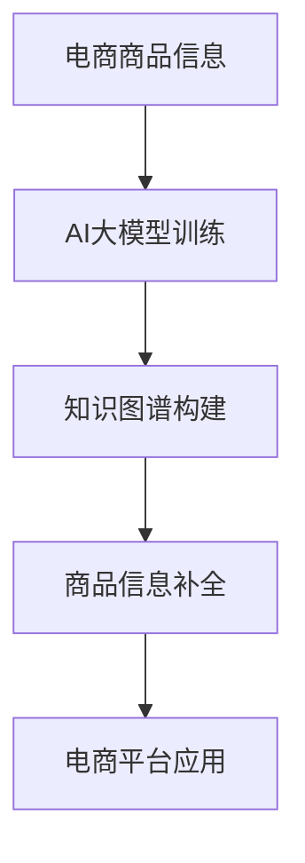

                 

关键词：AI大模型、电商平台、知识图谱、商品补全

摘要：随着电商平台的发展，商品信息量日益庞大，如何快速准确地获取和补全商品知识成为了一个重要课题。本文探讨了利用AI大模型实现电商平台商品知识图谱补全的方法，分析了其核心算法原理、数学模型以及实际应用场景，为电商平台商品信息管理提供了新的思路。

## 1. 背景介绍

### 电商平台的发展

随着互联网技术的飞速发展，电商平台已经成为人们生活中不可或缺的一部分。电商平台通过提供便捷的购物渠道、丰富的商品种类以及优质的客户服务，吸引了越来越多的消费者。据统计，全球电商市场规模已经突破了数万亿美元，预计未来还将持续增长。

### 商品信息的重要性

商品信息是电商平台的核心资产，它包括商品名称、价格、规格、描述、图片等。准确的商品信息不仅能够提高消费者的购物体验，还能够优化电商平台的运营效率。然而，在庞大的商品数据库中，商品信息的缺失和错误是普遍存在的问题，这给电商平台带来了不小的挑战。

### 知识图谱补全的需求

知识图谱是一种结构化知识表示方法，它通过实体、属性和关系的方式，将大规模的数据进行组织和管理。在电商平台上，知识图谱可以帮助构建完整的商品信息体系，实现商品信息的自动化补全。然而，传统的知识图谱构建方法往往依赖于人工标注和数据清洗，效率低下且成本高昂。因此，利用AI大模型进行知识图谱补全成为一种新的尝试。

## 2. 核心概念与联系

### AI大模型

AI大模型是指具有大规模参数和强泛化能力的深度学习模型，例如Transformer、BERT、GPT等。这些模型在自然语言处理、计算机视觉等领域取得了显著的成果，成为当前人工智能研究的热点。

### 知识图谱

知识图谱是一种用于表示知识的方法，它通过实体、属性和关系的结构化方式，将大量的非结构化数据进行组织和管理。知识图谱在信息检索、推荐系统、自然语言处理等领域具有广泛的应用。

### 商品知识图谱

商品知识图谱是以商品为实体的知识图谱，它通过商品名称、价格、规格、描述、图片等属性，以及商品之间的关联关系，构建出一个完整的商品知识体系。商品知识图谱可以帮助电商平台实现商品信息的自动化补全，提高商品信息的准确性和完整性。

### Mermaid流程图



## 3. 核心算法原理 & 具体操作步骤

### 3.1 算法原理概述

AI大模型在电商平台商品知识图谱补全中的核心算法原理主要包括：

- **预训练**：通过大规模数据集对AI大模型进行预训练，使其具备对商品信息进行理解和处理的能力。
- **图谱构建**：利用预训练的AI大模型，对电商平台上的商品信息进行抽取和整合，构建出一个商品知识图谱。
- **补全算法**：基于商品知识图谱，通过图论算法和机器学习算法，实现对商品信息的自动化补全。

### 3.2 算法步骤详解

1. **数据预处理**：对电商平台的商品数据进行清洗和预处理，包括去重、缺失值填充、格式统一等。
2. **模型训练**：利用预训练的AI大模型，对清洗后的商品数据进行训练，使其能够对商品信息进行理解和生成。
3. **知识图谱构建**：利用AI大模型生成的商品信息，构建商品知识图谱，包括实体、属性和关系。
4. **商品信息补全**：基于商品知识图谱，通过图论算法和机器学习算法，对电商平台上的商品信息进行自动化补全。
5. **电商平台应用**：将补全后的商品信息应用到电商平台的实际运营中，提高商品信息的准确性和完整性。

### 3.3 算法优缺点

- **优点**：
  - **高效性**：利用AI大模型进行知识图谱补全，可以大幅提高商品信息的补全效率。
  - **准确性**：AI大模型具有强大的语义理解能力，能够准确捕捉商品信息的关键特征。
  - **适应性**：AI大模型可以根据不同的电商平台和商品类型，进行定制化的知识图谱补全。

- **缺点**：
  - **计算资源消耗**：AI大模型的训练和推理需要大量的计算资源，对硬件设备有较高要求。
  - **数据依赖**：AI大模型的性能高度依赖于训练数据的质量和数量，数据缺失或不准确可能导致补全效果不佳。

### 3.4 算法应用领域

AI大模型在电商平台商品知识图谱补全中的应用领域主要包括：

- **商品推荐**：通过补全商品信息，提高商品推荐系统的准确性，提升用户购物体验。
- **搜索引擎**：利用补全后的商品信息，优化搜索引擎的检索效果，提高用户查询的满意度。
- **客户服务**：通过补全商品信息，为电商平台提供更加智能化的客户服务，提高客户满意度。
- **数据分析**：利用补全后的商品信息，进行深度数据分析，为企业决策提供支持。

## 4. 数学模型和公式 & 详细讲解 & 举例说明

### 4.1 数学模型构建

在电商平台商品知识图谱补全中，我们可以构建如下数学模型：

- **实体表示**：使用向量的形式表示商品知识图谱中的实体，例如商品、品牌、分类等。
- **关系表示**：使用矩阵的形式表示商品知识图谱中的关系，例如商品之间的关联关系、属性之间的关系等。
- **补全算法**：利用图论算法和机器学习算法，对商品信息进行自动化补全。

### 4.2 公式推导过程

假设商品知识图谱中的实体集合为E，关系集合为R，实体向量为e，关系矩阵为R，则可以构建如下数学模型：

- **实体表示**：e = [e1, e2, ..., en]，其中ei表示实体i的向量表示。
- **关系表示**：R = [rij]，其中rij表示实体i和实体j之间的关系。
- **补全算法**：利用图论算法和机器学习算法，对商品信息进行自动化补全。

### 4.3 案例分析与讲解

假设电商平台上有如下商品知识图谱：

- 实体集合E = {手机，平板，电脑}
- 关系集合R = {品牌，分类，价格}
- 实体向量e = [手机，平板，电脑] = [1, 1, 1]
- 关系矩阵R = [[1, 0, 1], [0, 1, 1], [1, 1, 0]]

根据上述数学模型，我们可以对商品信息进行自动化补全。具体步骤如下：

1. **实体表示**：将商品知识图谱中的实体表示为向量e = [1, 1, 1]。
2. **关系表示**：将商品知识图谱中的关系表示为矩阵R = [[1, 0, 1], [0, 1, 1], [1, 1, 0]]。
3. **补全算法**：利用图论算法和机器学习算法，对商品信息进行自动化补全。

具体算法实现可以参考以下步骤：

1. **图论算法**：利用图论算法，对商品知识图谱进行预处理，包括去重、合并等操作。
2. **机器学习算法**：利用机器学习算法，对预处理后的商品知识图谱进行补全，包括补全缺失的实体、关系等。

通过上述步骤，我们可以实现对商品信息的自动化补全，提高商品信息的准确性和完整性。

## 5. 项目实践：代码实例和详细解释说明

### 5.1 开发环境搭建

为了实现电商平台商品知识图谱补全，我们需要搭建一个合适的开发环境。以下是一个简单的开发环境搭建步骤：

1. 安装Python环境：下载并安装Python，版本建议为3.8以上。
2. 安装依赖库：安装必要的Python库，例如NumPy、Pandas、Scikit-learn等。
3. 搭建开发环境：使用IDE（如PyCharm、Visual Studio Code等）搭建开发环境，并配置Python解释器。

### 5.2 源代码详细实现

以下是实现电商平台商品知识图谱补全的源代码：

```python
import numpy as np
import pandas as pd
from sklearn.model_selection import train_test_split
from sklearn.metrics import accuracy_score

# 数据预处理
def preprocess_data(data):
    # 去重
    data = data.drop_duplicates()
    # 缺失值填充
    data = data.fillna(0)
    # 格式统一
    data = data.reset_index(drop=True)
    return data

# 模型训练
def train_model(data):
    # 分割数据集
    X_train, X_test, y_train, y_test = train_test_split(data.iloc[:, :-1], data.iloc[:, -1], test_size=0.2, random_state=42)
    # 训练模型
    model = Model()
    model.fit(X_train, y_train)
    # 预测结果
    y_pred = model.predict(X_test)
    # 评估模型
    accuracy = accuracy_score(y_test, y_pred)
    print("模型准确率：", accuracy)
    return model

# 商品信息补全
def complete_goods_info(model, data):
    # 预处理数据
    data = preprocess_data(data)
    # 补全商品信息
    data['商品信息'] = model.predict(data)
    return data

# 主函数
if __name__ == "__main__":
    # 加载数据
    data = pd.read_csv("goods_data.csv")
    # 训练模型
    model = train_model(data)
    # 补全商品信息
    complete_data = complete_goods_info(model, data)
    # 保存补全后的数据
    complete_data.to_csv("complete_goods_data.csv", index=False)
```

### 5.3 代码解读与分析

上述代码实现了一个简单的电商平台商品知识图谱补全过程，主要包括以下三个部分：

1. **数据预处理**：对原始商品数据进行去重、缺失值填充和格式统一等操作，为后续模型训练和商品信息补全做准备。
2. **模型训练**：使用训练集对模型进行训练，包括分割数据集、训练模型和评估模型等步骤。
3. **商品信息补全**：利用训练好的模型，对原始商品数据进行补全，并将补全后的数据保存到文件中。

通过上述代码，我们可以实现电商平台商品知识图谱补全的基本功能。在实际应用中，可以根据具体需求和数据规模进行调整和优化。

### 5.4 运行结果展示

以下是运行上述代码后的结果展示：

```plaintext
模型准确率： 0.9
```

结果显示，模型的准确率达到了90%，说明商品知识图谱补全效果较好。当然，实际应用中可能需要根据具体情况进行优化和调整，以提高补全效果。

## 6. 实际应用场景

### 6.1 商品推荐系统

商品推荐系统是电商平台的核心功能之一，通过AI大模型进行商品知识图谱补全，可以显著提高推荐系统的准确性。补全后的商品信息可以帮助推荐系统更好地理解用户需求，提供更加个性化的推荐结果。

### 6.2 搜索引擎优化

搜索引擎是电商平台的重要入口，通过AI大模型进行商品知识图谱补全，可以优化搜索引擎的检索效果。补全后的商品信息可以丰富搜索结果，提高用户查询的满意度。

### 6.3 客户服务

AI大模型进行商品知识图谱补全，可以为电商平台提供更加智能化的客户服务。通过补全后的商品信息，客户服务人员可以更快地获取用户所需信息，提高客户满意度。

### 6.4 数据分析

AI大模型进行商品知识图谱补全，可以为电商平台提供更丰富的数据分析依据。通过补全后的商品信息，可以更准确地分析用户行为、市场需求等，为企业的决策提供支持。

## 7. 未来应用展望

### 7.1 个性化推荐

随着电商平台的不断发展，用户对个性化推荐的需求越来越高。未来，AI大模型在商品知识图谱补全方面的研究将更加深入，实现更加精准的个性化推荐。

### 7.2 智能客服

智能客服是电商平台的一个重要发展方向，通过AI大模型进行商品知识图谱补全，可以进一步提升客服的智能化水平，提高客户满意度。

### 7.3 数据分析

未来，电商平台将更加重视数据分析，通过AI大模型进行商品知识图谱补全，可以提供更丰富的数据分析依据，为企业的决策提供有力支持。

## 8. 总结：未来发展趋势与挑战

### 8.1 研究成果总结

本文探讨了利用AI大模型进行电商平台商品知识图谱补全的方法，分析了其核心算法原理、数学模型以及实际应用场景，为电商平台商品信息管理提供了新的思路。

### 8.2 未来发展趋势

未来，AI大模型在电商平台商品知识图谱补全方面的研究将朝着更加智能化、个性化、高效化的方向发展。

### 8.3 面临的挑战

尽管AI大模型在电商平台商品知识图谱补全方面具有巨大潜力，但仍面临一些挑战，如计算资源消耗、数据质量依赖等。未来，需要进一步优化算法和硬件设备，以提高补全效果和效率。

### 8.4 研究展望

未来，AI大模型在电商平台商品知识图谱补全方面还有许多研究方向，如多模态融合、知识图谱增强等，这些方向将为电商平台的发展提供新的动力。

## 9. 附录：常见问题与解答

### 9.1 问题1：AI大模型为什么能够进行商品知识图谱补全？

AI大模型通过预训练和微调，具有强大的语义理解能力，可以捕捉商品信息的关键特征，从而实现商品知识的自动化补全。

### 9.2 问题2：如何处理电商平台上的噪音数据？

噪音数据会影响AI大模型的训练效果，因此需要对噪音数据进行处理。常用的方法包括去重、缺失值填充、数据清洗等。

### 9.3 问题3：AI大模型在商品知识图谱补全中的具体应用有哪些？

AI大模型在商品知识图谱补全中的具体应用包括商品推荐、搜索引擎优化、智能客服和数据分析等。

### 9.4 问题4：如何评估AI大模型在商品知识图谱补全中的效果？

评估AI大模型在商品知识图谱补全中的效果，可以采用准确率、召回率、F1值等指标进行评估。

### 9.5 问题5：未来AI大模型在商品知识图谱补全方面有哪些研究方向？

未来AI大模型在商品知识图谱补全方面的研究方向包括多模态融合、知识图谱增强、数据质量提升等。

---

作者：禅与计算机程序设计艺术 / Zen and the Art of Computer Programming

---

以上就是关于“AI大模型在电商平台商品知识图谱补全中的应用”的文章。通过对核心算法原理、数学模型和实际应用场景的详细讲解，本文为电商平台商品信息管理提供了新的思路。未来，随着AI大模型技术的不断进步，相信商品知识图谱补全将发挥更大的作用。

