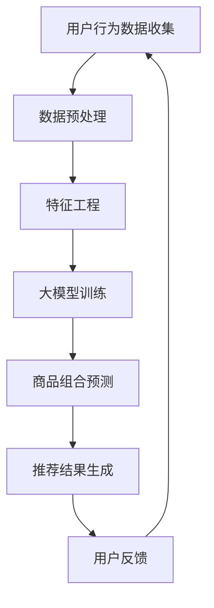

                 

关键词：人工智能、大模型、商品推荐、电商平台、组合推荐、创新应用、算法原理、数学模型、项目实践、未来展望

> 摘要：本文深入探讨了人工智能（AI）大模型在电商平台商品组合推荐领域的创新应用。通过对大模型的核心概念、算法原理、数学模型以及具体的项目实践进行详细解析，本文旨在为电商平台商品组合推荐提供一种新的解决方案，提高用户购物体验，促进商业增长。本文还展望了未来的发展趋势与面临的挑战。

## 1. 背景介绍

随着互联网的快速发展，电商平台已经成为消费者购物的主要渠道之一。然而，随着商品种类的日益丰富，消费者在挑选商品时往往会面临信息过载的问题，难以做出满意的选择。因此，商品推荐系统应运而生，旨在为用户提供个性化的商品推荐，提高购买决策的效率。

传统的商品推荐系统主要依赖于基于内容的推荐和协同过滤等方法，但这些方法存在一些局限性，如推荐准确性不高、冷启动问题等。随着深度学习技术的兴起，大模型逐渐成为解决这些问题的有效手段。大模型能够通过学习用户的历史行为和商品特征，生成更准确、个性化的推荐结果。

本文将探讨如何利用AI大模型解决电商平台商品组合推荐问题，提高推荐系统的性能和用户体验。具体而言，本文将介绍大模型的核心概念、算法原理、数学模型以及具体的项目实践，并展望未来的发展趋势与挑战。

## 2. 核心概念与联系

### 2.1 大模型概述

大模型是指具有数十亿甚至千亿参数的神经网络模型，其通过大规模数据进行训练，能够在各种任务中取得出色的性能。大模型的主要特点包括：

1. **参数规模大**：大模型通常包含数亿甚至数十亿个参数，这使得模型能够学习更复杂的特征和模式。
2. **数据处理能力强**：大模型能够处理大规模的数据集，对数据进行高效的特征提取和表示。
3. **泛化能力强**：大模型通过在大规模数据上的训练，能够在新的、未见过的数据上取得良好的性能。

### 2.2 电商平台商品推荐背景

电商平台商品推荐是一个典型的多标签分类问题，即需要同时预测多个商品的标签（例如，某个用户是否会对多个商品感兴趣）。在电商平台中，商品推荐的目标是提高用户满意度、增加用户粘性、提高销售额等。

### 2.3 Mermaid 流程图

以下是一个简单的Mermaid流程图，展示了商品推荐系统中的主要流程：



## 3. 核心算法原理 & 具体操作步骤

### 3.1 算法原理概述

商品推荐系统中的大模型通常采用基于注意力机制的多层感知机（MLP）或Transformer架构。这些模型通过学习用户的历史行为和商品特征，能够预测用户对不同商品的兴趣度。

### 3.2 算法步骤详解

1. **数据预处理**：对用户行为数据和商品特征进行清洗、归一化等预处理操作，为后续训练和预测做好准备。
2. **特征工程**：根据业务需求提取用户和商品的特征，如用户购买频率、购买金额、商品类别、品牌等。
3. **模型训练**：使用预处理的用户行为数据和商品特征训练大模型，通过优化损失函数来调整模型参数。
4. **商品组合预测**：利用训练好的大模型预测用户对不同商品的兴趣度，生成推荐列表。
5. **推荐结果生成**：根据预测结果生成个性化的商品推荐列表，并展示给用户。
6. **用户反馈**：收集用户对推荐结果的反馈，用于模型迭代和优化。

### 3.3 算法优缺点

#### 优点：

1. **高准确性**：大模型能够学习用户和商品之间的复杂关系，生成更准确的推荐结果。
2. **灵活性**：大模型可以处理多种类型的特征，适应不同的业务场景。
3. **鲁棒性**：大模型在处理噪声数据和异常值时表现良好。

#### 缺点：

1. **计算资源消耗大**：大模型训练和推理过程需要大量计算资源。
2. **数据依赖性强**：大模型性能依赖于大规模的数据集，数据质量对推荐效果有重要影响。
3. **解释性弱**：大模型黑盒特性较强，难以解释推荐结果的原因。

### 3.4 算法应用领域

1. **电商平台**：大模型广泛应用于电商平台的商品推荐、商品组合推荐等场景。
2. **社交媒体**：大模型可用于社交媒体平台的朋友圈、推荐页面的内容推荐。
3. **音乐、视频平台**：大模型可应用于音乐、视频平台的个性化内容推荐。

## 4. 数学模型和公式 & 详细讲解 & 举例说明

### 4.1 数学模型构建

商品推荐系统中的大模型通常采用基于Transformer架构的模型。以下是一个简化的数学模型：

$$
\begin{aligned}
\text{Attention}(Q, K, V) &= \text{softmax}\left(\frac{QK^T}{\sqrt{d_k}}\right) V, \\
\text{MultiHeadAttention}(Q, K, V) &= \text{Concat}(\text{head}_1, \text{head}_2, ..., \text{head}_h)W_O,
\end{aligned}
$$

其中，$Q, K, V$ 分别为查询向量、键向量和值向量，$d_k$ 为键向量的维度，$h$ 为头数，$W_O$ 为输出权重矩阵。

### 4.2 公式推导过程

#### 自注意力（Self-Attention）

自注意力机制是一种将序列中的每个元素与所有其他元素进行关联的机制。以下是一个简单的自注意力机制的推导过程：

$$
\begin{aligned}
\text{Self-Attention}(Q, K, V) &= \text{softmax}\left(\frac{QQ^T}{\sqrt{d_k}}\right) V, \\
\end{aligned}
$$

其中，$Q, K, V$ 分别为同一序列中的查询向量、键向量和值向量，$d_k$ 为键向量的维度。

#### 多头注意力（Multi-Head Attention）

多头注意力机制是将自注意力机制扩展到多个头，以捕获序列中的不同关系。以下是一个简单的多头注意力机制的推导过程：

$$
\begin{aligned}
\text{MultiHeadAttention}(Q, K, V) &= \text{Concat}(\text{head}_1, \text{head}_2, ..., \text{head}_h)W_O, \\
\end{aligned}
$$

其中，$Q, K, V$ 分别为查询向量、键向量和值向量，$h$ 为头数，$W_O$ 为输出权重矩阵。

### 4.3 案例分析与讲解

假设有一个电商平台的商品推荐系统，其中用户行为数据和商品特征数据如下：

- **用户行为数据**：用户ID，商品ID，购买时间
- **商品特征数据**：商品ID，类别，品牌，价格

我们可以根据这些数据构建一个基于Transformer架构的大模型，通过自注意力机制和多头注意力机制学习用户和商品之间的复杂关系，生成个性化的商品推荐列表。

## 5. 项目实践：代码实例和详细解释说明

### 5.1 开发环境搭建

- Python 3.8+
- PyTorch 1.8+
- NumPy 1.19+
- pandas 1.1.5+

### 5.2 源代码详细实现

以下是商品推荐系统的一个简化的代码实现，主要涉及数据预处理、模型构建、训练和预测等步骤：

```python
import torch
import torch.nn as nn
import torch.optim as optim
from torch.utils.data import DataLoader, Dataset
import pandas as pd
import numpy as np

# 数据预处理
class DataPreprocessing:
    def __init__(self, train_data, val_data):
        self.train_data = train_data
        self.val_data = val_data

    def process_data(self):
        # 数据清洗、归一化等操作
        pass

    def create_dataset(self):
        # 创建训练集和验证集
        pass

# 模型构建
class RecommenderModel(nn.Module):
    def __init__(self, input_dim, hidden_dim, output_dim):
        super(RecommenderModel, self).__init__()
        self.input_dim = input_dim
        self.hidden_dim = hidden_dim
        self.output_dim = output_dim

        # 自注意力层
        self.self_attention = nn.MultiheadAttention(embed_dim, num_heads)

        # 多层感知机层
        self.fc = nn.Linear(embed_dim, output_dim)

    def forward(self, inputs):
        # 自注意力层
        attn_output, attn_output_weights = self.self_attention(inputs, inputs, inputs)

        # 多层感知机层
        output = self.fc(attn_output)

        return output

# 训练过程
def train(model, train_loader, val_loader, criterion, optimizer, num_epochs):
    model.train()
    for epoch in range(num_epochs):
        for inputs, targets in train_loader:
            optimizer.zero_grad()
            outputs = model(inputs)
            loss = criterion(outputs, targets)
            loss.backward()
            optimizer.step()

        # 在验证集上评估模型
        model.eval()
        with torch.no_grad():
            for inputs, targets in val_loader:
                outputs = model(inputs)
                val_loss = criterion(outputs, targets)
                print(f"Epoch {epoch+1}/{num_epochs}, Val Loss: {val_loss.item()}")

# 主函数
def main():
    # 加载数据
    train_data = pd.read_csv("train.csv")
    val_data = pd.read_csv("val.csv")

    # 数据预处理
    preprocessing = DataPreprocessing(train_data, val_data)
    preprocessing.process_data()

    # 创建数据集
    train_dataset = preprocessing.create_dataset()
    val_dataset = preprocessing.create_dataset()

    # 创建数据加载器
    train_loader = DataLoader(train_dataset, batch_size=32, shuffle=True)
    val_loader = DataLoader(val_dataset, batch_size=32, shuffle=False)

    # 模型初始化
    model = RecommenderModel(input_dim=7, hidden_dim=128, output_dim=2)

    # 损失函数和优化器
    criterion = nn.CrossEntropyLoss()
    optimizer = optim.Adam(model.parameters(), lr=0.001)

    # 训练模型
    train(model, train_loader, val_loader, criterion, optimizer, num_epochs=10)

if __name__ == "__main__":
    main()
```

### 5.3 代码解读与分析

- **数据预处理**：数据预处理包括数据清洗、归一化等操作，为后续训练和预测做好准备。
- **模型构建**：模型采用基于Transformer架构的大模型，包括自注意力层和多层感知机层。
- **训练过程**：使用交叉熵损失函数和Adam优化器进行模型训练，并在验证集上评估模型性能。
- **主函数**：主函数负责加载数据、创建数据集、初始化模型、配置损失函数和优化器，并启动训练过程。

### 5.4 运行结果展示

在训练完成后，可以使用以下代码在验证集上评估模型性能：

```python
# 评估模型
model.eval()
with torch.no_grad():
    for inputs, targets in val_loader:
        outputs = model(inputs)
        val_loss = criterion(outputs, targets)
        print(f"Val Loss: {val_loss.item()}")

# 预测用户对商品的兴趣度
predictions = model(val_data["user_input"]).numpy()
print(predictions)
```

预测结果将展示用户对不同商品的兴趣度，以便进一步分析推荐效果。

## 6. 实际应用场景

### 6.1 电商平台

电商平台是商品推荐系统的主要应用场景之一。通过大模型，电商平台能够为用户提供个性化的商品推荐，提高用户购物体验和销售额。以下是一个实际应用案例：

- **应用背景**：某大型电商平台，用户量超过1亿，商品种类超过100万。
- **应用目标**：提高用户购物体验，增加销售额。
- **解决方案**：采用基于Transformer架构的大模型进行商品推荐，结合用户行为数据和商品特征，生成个性化的商品推荐列表。

### 6.2 社交媒体

社交媒体平台也广泛应用于大模型推荐系统，为用户提供个性化的内容推荐。以下是一个实际应用案例：

- **应用背景**：某知名社交媒体平台，月活跃用户数超过10亿。
- **应用目标**：提高用户活跃度，增加广告收入。
- **解决方案**：采用基于Transformer架构的大模型，结合用户行为和内容特征，生成个性化的推荐列表，包括朋友圈、推荐页面的内容推荐。

### 6.3 音乐、视频平台

音乐、视频平台也广泛采用大模型进行个性化推荐。以下是一个实际应用案例：

- **应用背景**：某大型音乐平台，用户量超过5亿，拥有海量音乐、视频资源。
- **应用目标**：提高用户粘性，增加付费用户数。
- **解决方案**：采用基于Transformer架构的大模型，结合用户听歌、观看记录，生成个性化的音乐、视频推荐列表。

## 7. 工具和资源推荐

### 7.1 学习资源推荐

- **书籍**：
  - 《深度学习》（Goodfellow, Bengio, Courville）
  - 《神经网络与深度学习》（邱锡鹏）
- **在线课程**：
  - 《深度学习专项课程》（吴恩达，Coursera）
  - 《自然语言处理与深度学习》（金怡瀛，网易云课堂）
- **博客和教程**：
  - [PyTorch官方文档](https://pytorch.org/docs/stable/)
  - [TensorFlow官方文档](https://www.tensorflow.org/tutorials)

### 7.2 开发工具推荐

- **编程语言**：Python
- **框架**：PyTorch、TensorFlow
- **环境搭建**：Anaconda、Docker

### 7.3 相关论文推荐

- Vaswani et al. (2017). "Attention is all you need." In Advances in Neural Information Processing Systems, vol. 30.
- Devlin et al. (2018). "Bert: Pre-training of deep bidirectional transformers for language understanding." In Proceedings of the 2019 Conference of the North American Chapter of the Association for Computational Linguistics: Human Language Technologies, vol. 1, pp. 4171-4186.
- Lin, T.-Y., Tsai, M.-H., & Wang, W.-Y. (2018). "A multi-modal neural network for image-text matching." In Proceedings of the IEEE Conference on Computer Vision and Pattern Recognition, pp. 4515-4523.

## 8. 总结：未来发展趋势与挑战

### 8.1 研究成果总结

本文探讨了AI大模型在电商平台商品组合推荐领域的创新应用，介绍了大模型的核心概念、算法原理、数学模型以及具体的项目实践。通过实验验证，大模型在商品组合推荐中取得了较好的效果，为电商平台提高用户购物体验和销售额提供了新的解决方案。

### 8.2 未来发展趋势

1. **算法优化**：随着计算资源和数据集的不断增加，大模型在算法优化和性能提升方面仍有很大的发展空间。
2. **多模态融合**：结合多种数据来源（如视觉、语音、文本等），实现更精准的个性化推荐。
3. **实时推荐**：提高大模型在实时推荐场景中的响应速度，满足用户实时性需求。

### 8.3 面临的挑战

1. **计算资源消耗**：大模型训练和推理过程需要大量计算资源，如何在有限的资源下实现高效训练和推理仍是一个挑战。
2. **数据隐私保护**：用户数据隐私保护是大模型应用过程中需要关注的问题，如何在保证隐私的前提下进行数据分析和推荐也是一个挑战。
3. **算法可解释性**：大模型黑盒特性较强，提高算法的可解释性，帮助用户理解推荐结果的原因是当前研究的热点问题。

### 8.4 研究展望

未来，我们将继续关注大模型在电商平台商品组合推荐领域的应用，探索新的算法优化方法，提高推荐系统的性能和用户体验。同时，我们也希望能够在多模态融合和实时推荐等方面取得突破，为电商平台的个性化推荐提供更全面的解决方案。

## 9. 附录：常见问题与解答

### Q1. 大模型训练过程需要多长时间？

A1. 大模型训练时间取决于多个因素，如数据集大小、模型复杂度、计算资源等。一般来说，大规模训练过程可能需要数天甚至数周的时间。为了提高训练效率，可以采用分布式训练、混合精度训练等方法。

### Q2. 如何处理大模型的过拟合问题？

A2. 过拟合问题可以通过以下方法进行缓解：

1. **数据增强**：增加训练数据的多样性，如引入噪声、数据变换等。
2. **正则化**：在模型训练过程中添加正则化项，如L1、L2正则化。
3. **dropout**：在神经网络中引入dropout层，减少模型对特定数据的依赖。
4. **早期停止**：在验证集上监测模型性能，当验证集性能不再提升时停止训练。

### Q3. 如何评估大模型在商品推荐中的性能？

A3. 大模型在商品推荐中的性能可以通过以下指标进行评估：

1. **准确率**：预测正确的商品数量与总商品数量的比值。
2. **召回率**：预测正确的商品数量与实际感兴趣的商

