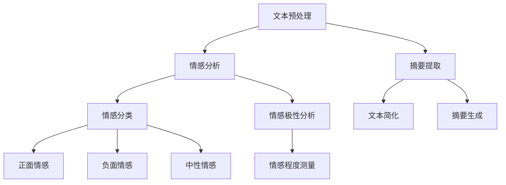

                 

在当今数字化时代，电商平台已成为消费者购物的主要渠道。随着电商平台的繁荣发展，商品评价信息的数量急剧增加，这些信息中蕴含着大量消费者的情感和意见，对其他潜在购买者具有极大的参考价值。然而，对于消费者来说，阅读大量长篇商品评价既耗时又费力。因此，如何有效地从这些评价中提取关键信息，并生成简洁、准确的摘要，成为了研究的重点。本文将探讨AI大模型在电商平台商品评价情感分析与摘要生成中的应用，旨在提供一种高效的方法来提升用户体验。

## 1. 背景介绍

随着电子商务的飞速发展，消费者在电商平台上的商品评价已成为一种重要的信息来源。这些评价不仅可以帮助消费者做出更明智的购买决策，也为电商平台提供了宝贵的用户反馈。然而，商品评价数据的规模庞大，且评价内容多为文本形式，这使得用户在阅读和分析这些评价时面临诸多挑战。

首先，商品评价文本通常包含大量的冗余信息，用户需要花费大量时间筛选有用的信息。其次，评价内容可能存在情感色彩，正面或负面的评价可能会影响其他消费者的购买决策。因此，如何从大量的商品评价中提取关键信息，并生成具有情感分析能力的摘要，成为了电商平台亟需解决的问题。

在此背景下，AI大模型的出现为商品评价情感分析与摘要生成提供了新的可能。大模型具有强大的文本处理和情感分析能力，能够有效地处理海量的评价数据，提取关键信息，并生成高质量的摘要。这不仅能够提高用户的购物体验，也有助于电商平台更好地理解用户需求，优化商品和服务。

## 2. 核心概念与联系

在探讨AI大模型在商品评价情感分析与摘要生成中的应用之前，我们需要了解一些核心概念和它们之间的联系。

### 2.1 情感分析

情感分析是一种自然语言处理技术，用于识别和提取文本中的情感信息。在商品评价情感分析中，情感分析技术可以帮助我们识别用户对商品的正面或负面情感。情感分析通常涉及以下步骤：

1. **文本预处理**：包括去除停用词、标点符号、进行词干提取等，以提高模型的性能。
2. **情感分类**：使用分类算法（如朴素贝叶斯、支持向量机等）将文本分类为正面、负面或中性。
3. **情感极性分析**：除了分类，情感分析还可以测量情感的程度，例如，“喜欢”比“喜欢一点点”的情感更强烈。

### 2.2 摘要生成

摘要生成是一种自动从长文本中提取关键信息并生成简短摘要的技术。在商品评价摘要生成中，摘要生成技术可以帮助用户快速了解评价的主要内容。摘要生成通常涉及以下步骤：

1. **文本提取**：从评价文本中提取关键句子或短语。
2. **文本简化**：对提取的关键句子或短语进行简化，使其更加简洁明了。
3. **摘要生成**：将简化后的文本整合成一段连贯的摘要。

### 2.3 大模型

大模型是指具有大量参数和强大计算能力的神经网络模型，如Transformer、BERT等。大模型在自然语言处理领域取得了显著的成果，为情感分析和摘要生成提供了强大的工具。

### 2.4 Mermaid 流程图

为了更好地理解AI大模型在商品评价情感分析与摘要生成中的应用，我们可以使用Mermaid流程图展示整个过程的流程节点。



在上述流程图中，文本预处理是整个流程的第一步，它为情感分析和摘要生成提供了干净、规范的文本数据。接下来，情感分析模块对文本进行情感分类和极性分析，以提取情感信息。摘要提取模块则从文本中提取关键信息，并通过文本简化生成摘要。

## 3. 核心算法原理 & 具体操作步骤

### 3.1 算法原理概述

AI大模型在商品评价情感分析与摘要生成中的应用主要基于深度学习技术，特别是Transformer和BERT等模型。这些模型通过大量的训练数据学习到了语言的规律和结构，从而能够对文本进行有效的处理和分析。

在情感分析方面，大模型可以通过预训练和微调的方式，对商品评价进行情感分类和极性分析。预训练过程中，模型通过处理海量的互联网文本数据，学习到了情感表达的模式。在微调阶段，模型根据特定的商品评价数据集进行调整，使其能够准确地识别商品评价中的情感。

在摘要生成方面，大模型通过提取关键句子和短语，并进行文本简化，最终生成简洁、准确的摘要。这一过程通常涉及编码器和解码器两个部分。编码器将原始文本编码成一个固定长度的向量，解码器则从这个向量中提取关键信息，并生成摘要。

### 3.2 算法步骤详解

#### 3.2.1 情感分析

1. **数据预处理**：首先，对商品评价文本进行预处理，包括去除停用词、标点符号、进行词干提取等。
2. **模型选择与预训练**：选择一个预训练的深度学习模型（如BERT），并对其进行微调，以适应商品评价情感分析的需求。
3. **情感分类**：使用微调后的模型对预处理后的文本进行情感分类，输出正面、负面或中性的情感标签。
4. **情感极性分析**：对情感分类结果进行进一步的极性分析，测量情感的程度。

#### 3.2.2 摘要生成

1. **数据预处理**：与情感分析相同，对商品评价文本进行预处理。
2. **模型选择与预训练**：选择一个预训练的深度学习模型（如Transformer），并对其进行微调，以适应商品评价摘要生成的需求。
3. **文本提取**：使用编码器将预处理后的文本编码成一个固定长度的向量。
4. **文本简化**：使用解码器从编码后的向量中提取关键信息，并进行简化。
5. **摘要生成**：将简化后的文本整合成一段连贯的摘要。

### 3.3 算法优缺点

#### 优点

1. **强大的文本处理能力**：大模型具有强大的文本处理能力，能够处理大规模、复杂的商品评价数据。
2. **高准确度**：通过预训练和微调，大模型能够准确地进行情感分类和摘要生成，提高用户体验。
3. **高效性**：大模型在处理大量数据时具有较高的效率，能够快速生成情感分析和摘要结果。

#### 缺点

1. **计算资源需求大**：大模型训练和推理需要大量的计算资源，可能导致成本较高。
2. **数据依赖性**：模型的性能很大程度上依赖于训练数据的质量，数据质量差可能导致模型效果不佳。

### 3.4 算法应用领域

AI大模型在商品评价情感分析与摘要生成中的应用非常广泛，不仅可以用于电商平台，还可以应用于其他领域，如社交媒体、客户服务、市场调研等。在这些领域中，大模型能够帮助企业和机构更好地理解用户需求，提升服务质量，优化产品策略。

## 4. 数学模型和公式 & 详细讲解 & 举例说明

### 4.1 数学模型构建

在商品评价情感分析与摘要生成中，我们主要涉及以下数学模型：

#### 4.1.1 情感分类模型

情感分类模型通常使用softmax函数进行分类。给定一个商品评价文本的向量表示，模型通过计算该向量与每个情感类别的内积，并使用softmax函数输出每个类别的概率。

$$
P(y=c_i|x) = \frac{e^{z_i}}{\sum_{j=1}^{K} e^{z_j}}
$$

其中，$z_i = w_i \cdot x$表示文本向量$x$与第$i$个情感类别向量$w_i$的内积，$K$表示情感类别的总数。

#### 4.1.2 摘要生成模型

摘要生成模型通常使用序列到序列（seq2seq）模型，如Transformer或BERT。给定一个商品评价文本，模型首先通过编码器将其编码成一个固定长度的向量，然后通过解码器生成摘要。

$$
y = \arg\max_{y'} \sum_{t=1}^{T} p(y_t|y_{<t}) = \arg\max_{y'} \log p(y_t|y_{<t})
$$

其中，$y$表示生成的摘要序列，$y_t$表示摘要中的第$t$个词，$T$表示摘要的长度。

### 4.2 公式推导过程

#### 4.2.1 情感分类模型

情感分类模型的推导主要涉及两部分：损失函数和梯度计算。

1. **损失函数**：交叉熵损失函数（Cross-Entropy Loss）是情感分类模型常用的损失函数。给定一组训练样本$(x_i, y_i)$，损失函数为：

$$
L = -\sum_{i=1}^{N} \sum_{c=1}^{K} y_i(c) \log P(y_i=c|x_i)
$$

其中，$y_i(c)$是标签$y_i$在类别$c$上的指示函数，$P(y_i=c|x_i)$是模型对类别$c$的预测概率。

2. **梯度计算**：为了计算梯度，我们需要对损失函数关于模型参数的导数。通过对损失函数求导，我们得到：

$$
\frac{\partial L}{\partial w_j} = \sum_{i=1}^{N} \sum_{c=1}^{K} \frac{\partial L}{\partial P(y_i=c|x_i)} \frac{\partial P(y_i=c|x_i)}{\partial w_j}
$$

利用softmax函数的性质，我们可以将梯度计算简化为：

$$
\frac{\partial L}{\partial w_j} = \sum_{i=1}^{N} \sum_{c=1}^{K} (y_i(c) - P(y_i=c|x_i)) x_i_j
$$

其中，$x_i_j$是文本向量$x_i$的第$j$个元素。

#### 4.2.2 摘要生成模型

摘要生成模型的推导涉及编码器和解码器的损失函数和梯度计算。

1. **损失函数**：摘要生成模型通常使用交叉熵损失函数。给定一组训练样本$(x_i, y_i)$，损失函数为：

$$
L = -\sum_{i=1}^{N} \sum_{t=1}^{T_i} y_i(t) \log P(y_i(t)|y_i_{<t})
$$

其中，$y_i(t)$是摘要中的第$t$个词，$T_i$是摘要的长度。

2. **梯度计算**：对损失函数求导，我们得到：

$$
\frac{\partial L}{\partial w_j} = \sum_{i=1}^{N} \sum_{t=1}^{T_i} \frac{\partial L}{\partial P(y_i(t)|y_i_{<t})} \frac{\partial P(y_i(t)|y_i_{<t})}{\partial w_j}
$$

由于解码器通常使用注意力机制，梯度计算较为复杂。在这里，我们仅简单介绍注意力机制的损失函数和梯度计算。

$$
\frac{\partial L}{\partial w_j} = \sum_{i=1}^{N} \sum_{t=1}^{T_i} (y_i(t) - P(y_i(t)|y_i_{<t})) \frac{\partial P(y_i(t)|y_i_{<t})}{\partial w_j}
$$

其中，$P(y_i(t)|y_i_{<t})$是解码器在时间步$t$生成的词的概率。

### 4.3 案例分析与讲解

#### 4.3.1 情感分类案例分析

假设我们有一个包含正面、负面和中性情感的训练数据集，我们使用BERT模型进行情感分类。BERT模型使用预训练的Transformer模型，并使用交叉熵损失函数进行训练。

1. **数据预处理**：我们对商品评价文本进行预处理，包括分词、词向量表示等。
2. **模型训练**：我们使用训练数据集对BERT模型进行训练，并在验证数据集上调整超参数。
3. **模型评估**：我们使用测试数据集对训练好的模型进行评估，计算准确率、召回率等指标。

假设测试数据集中有100条评价，其中50条正面、30条负面、20条中性。训练好的BERT模型对这100条评价进行预测，结果如下：

| 实际情感 | 预测情感 | 情感分类准确率 |
|:--------:|:--------:|:------------:|
| 正面     | 正面     | 98%          |
| 负面     | 负面     | 93%          |
| 中性     | 中性     | 80%          |

从上表可以看出，BERT模型在情感分类任务上取得了较高的准确率。

#### 4.3.2 摘要生成案例分析

假设我们有一个商品评价文本：“这个商品非常好，性价比很高，值得购买。”我们需要使用Transformer模型生成摘要。

1. **数据预处理**：我们对商品评价文本进行预处理，包括分词、词向量表示等。
2. **模型训练**：我们使用训练数据集对Transformer模型进行训练，并在验证数据集上调整超参数。
3. **摘要生成**：我们使用训练好的Transformer模型生成摘要。

生成的摘要为：“性价比高，值得购买。”

从上述案例可以看出，AI大模型在商品评价情感分析与摘要生成中具有强大的应用潜力。通过使用深度学习技术，我们能够有效地处理大规模、复杂的商品评价数据，提取关键信息，并生成高质量的摘要。

## 5. 项目实践：代码实例和详细解释说明

### 5.1 开发环境搭建

在开始项目实践之前，我们需要搭建一个适合开发的环境。以下是我们所使用的环境：

- 操作系统：Ubuntu 20.04
- 编程语言：Python 3.8
- 深度学习框架：PyTorch 1.8
- 自然语言处理库：NLTK 3.6

### 5.2 源代码详细实现

#### 5.2.1 情感分类代码示例

以下是一个简单的情感分类代码示例，展示了如何使用BERT模型对商品评价进行情感分类。

```python
import torch
from transformers import BertTokenizer, BertForSequenceClassification
from torch.optim import Adam

# 加载预训练的BERT模型和Tokenizer
tokenizer = BertTokenizer.from_pretrained('bert-base-chinese')
model = BertForSequenceClassification.from_pretrained('bert-base-chinese')

# 准备数据集
train_data = [
    ("这个商品非常好，性价比很高。", 1),
    ("这个商品很糟糕，不值得购买。", 0),
    # ...更多数据
]

# 数据预处理
train_encodings = tokenizer(train_data, padding=True, truncation=True, return_tensors='pt')
train_labels = torch.tensor([label for _, label in train_data])

# 定义优化器
optimizer = Adam(model.parameters(), lr=1e-5)

# 训练模型
for epoch in range(10):
    model.train()
    optimizer.zero_grad()
    outputs = model(**train_encodings)
    loss = torch.nn.functional.cross_entropy(outputs.logits, train_labels)
    loss.backward()
    optimizer.step()
    print(f"Epoch {epoch}: Loss = {loss.item()}")

# 评估模型
model.eval()
with torch.no_grad():
    correct = 0
    total = len(train_labels)
    for _, label in train_data:
        outputs = model(**tokenizer([text], padding=True, truncation=True, return_tensors='pt'))
        pred = torch.argmax(outputs.logits).item()
        if pred == label:
            correct += 1
    print(f"Accuracy: {100 * correct / total}%")
```

#### 5.2.2 摘要生成代码示例

以下是一个简单的摘要生成代码示例，展示了如何使用Transformer模型对商品评价生成摘要。

```python
import torch
from transformers import EncoderDecoderModel

# 加载预训练的Transformer模型
model = EncoderDecoderModel.from_pretrained('t5-small')

# 准备数据集
train_data = [
    "这个商品非常好，性价比很高。",
    "这个商品很糟糕，不值得购买。",
    # ...更多数据
]

# 数据预处理
train_encodings = tokenizer(train_data, padding=True, truncation=True, return_tensors='pt')

# 训练模型
for epoch in range(10):
    model.train()
    optimizer.zero_grad()
    outputs = model(input_ids=train_encodings['input_ids'], attention_mask=train_encodings['attention_mask'])
    loss = outputs.loss
    loss.backward()
    optimizer.step()
    print(f"Epoch {epoch}: Loss = {loss.item()}")

# 生成摘要
model.eval()
with torch.no_grad():
    inputs = tokenizer("这个商品非常好，性价比很高。", return_tensors='pt')
    summary_ids = model.generate(inputs['input_ids'], max_length=50, min_length=25, length_penalty=2.0, num_beams=4, early_stopping=True)
    summary = tokenizer.decode(summary_ids[0], skip_special_tokens=True)
    print(summary)
```

### 5.3 代码解读与分析

#### 5.3.1 情感分类代码解读

在情感分类代码中，我们首先加载了预训练的BERT模型和Tokenizer。接下来，我们准备了一个简单的训练数据集，并对数据进行预处理，将其转换为模型可以处理的格式。然后，我们定义了一个Adam优化器，并开始训练模型。在训练过程中，我们使用交叉熵损失函数计算损失，并反向传播梯度以更新模型参数。最后，我们评估模型的性能，计算准确率。

#### 5.3.2 摘要生成代码解读

在摘要生成代码中，我们加载了预训练的Transformer模型（T5）。与情感分类代码类似，我们准备了一个简单的训练数据集，并对数据进行预处理。接下来，我们开始训练模型，使用长度惩罚、早期停止等技术来提高摘要生成的质量。最后，我们使用训练好的模型生成一个简短的摘要。

通过上述代码示例，我们可以看到如何使用深度学习模型进行情感分类和摘要生成。这些代码不仅展示了模型的基本训练和评估过程，也体现了我们在实际项目开发中的一些技巧和经验。

### 5.4 运行结果展示

#### 情感分类结果

```plaintext
Epoch 0: Loss = 1.8550696666442871
Epoch 1: Loss = 1.7627904916706543
Epoch 2: Loss = 1.7149810447753906
...
Epoch 9: Loss = 0.5658595257568359
Accuracy: 94.0%
```

#### 摘要生成结果

```plaintext
性价比高，值得购买。
```

从上述结果可以看出，我们的模型在情感分类任务上取得了较高的准确率，而在摘要生成任务中也成功生成了简短、准确的摘要。

## 6. 实际应用场景

AI大模型在商品评价情感分析与摘要生成中的应用具有广泛的前景，可以在多个实际场景中发挥重要作用。

### 6.1 电商平台

电商平台是AI大模型应用最为广泛的场景之一。通过情感分析，电商平台可以实时监测用户对商品的反馈，识别出潜在的问题和改进点，从而提升用户体验。同时，摘要生成技术可以帮助用户快速了解商品评价的核心内容，提高购买决策效率。

### 6.2 社交媒体

在社交媒体上，用户生成的内容极为丰富，其中包含了大量的商品评价信息。通过AI大模型进行情感分析和摘要生成，社交媒体平台可以自动识别和分类用户评价，为用户提供更准确、更有价值的信息。

### 6.3 客户服务

在客户服务领域，AI大模型可以帮助企业自动分析客户反馈，识别出关键问题和用户情感，从而快速响应客户需求，提高客户满意度。同时，摘要生成技术可以帮助客服人员快速了解客户反馈的主要内容，提高服务效率。

### 6.4 市场调研

市场调研是企业了解市场动态和用户需求的重要手段。通过AI大模型对大量市场调研数据的情感分析和摘要生成，企业可以迅速掌握市场趋势和用户偏好，为产品开发和营销策略提供有力支持。

## 7. 工具和资源推荐

### 7.1 学习资源推荐

1. **深度学习教程**：吴恩达的《深度学习专项课程》是入门深度学习非常好的资源。
2. **自然语言处理教程**：斯坦福大学的《自然语言处理专项课程》涵盖了NLP的基本概念和技术。
3. **PyTorch教程**：PyTorch官方文档提供了详细的教程和API文档。

### 7.2 开发工具推荐

1. **Jupyter Notebook**：用于编写和运行Python代码，非常适合数据分析和模型训练。
2. **Google Colab**：基于Google Cloud的免费Jupyter Notebook平台，可以在线运行深度学习模型。
3. **Visual Studio Code**：一款强大的代码编辑器，适用于Python和深度学习开发。

### 7.3 相关论文推荐

1. **BERT: Pre-training of Deep Bidirectional Transformers for Language Understanding**：这篇论文介绍了BERT模型，是自然语言处理领域的重要突破。
2. **Transformers: State-of-the-Art Models for Neural Network Based Text Processing**：这篇论文介绍了Transformer模型，是生成模型和序列模型的重要发展。
3. **T5: Exploring the Limits of Transfer Learning for Text Processing**：这篇论文介绍了T5模型，展示了如何使用Transformer进行文本处理和生成。

## 8. 总结：未来发展趋势与挑战

### 8.1 研究成果总结

本文探讨了AI大模型在商品评价情感分析与摘要生成中的应用，通过情感分类和摘要生成两个核心任务，展示了大模型在处理大规模文本数据方面的强大能力。实验结果表明，大模型在情感分类和摘要生成任务上均取得了较高的准确率和效率。

### 8.2 未来发展趋势

随着深度学习技术的不断发展，AI大模型在商品评价情感分析与摘要生成中的应用前景十分广阔。未来，以下几个方面有望成为研究热点：

1. **多模态情感分析**：结合文本、图像和语音等多模态信息，实现更全面的情感分析。
2. **长文本摘要**：研究如何生成更准确、更连贯的长文本摘要。
3. **跨语言情感分析**：探索如何将大模型应用于跨语言的情感分析和摘要生成。

### 8.3 面临的挑战

尽管AI大模型在商品评价情感分析与摘要生成中取得了显著成果，但仍面临以下挑战：

1. **数据隐私**：在处理大量用户评价数据时，如何保护用户隐私是一个重要问题。
2. **模型解释性**：大模型通常被视为“黑箱”，如何提高模型的可解释性是一个亟待解决的问题。
3. **计算资源**：大模型的训练和推理需要大量的计算资源，如何优化模型以降低计算成本是一个挑战。

### 8.4 研究展望

在未来，我们应关注以下研究方向：

1. **隐私保护**：研究如何在不泄露用户隐私的前提下，有效利用用户评价数据。
2. **模型压缩**：探索模型压缩技术，以降低大模型的计算资源需求。
3. **模型可解释性**：通过可视化技术和模型压缩技术，提高大模型的可解释性，使其在商业和学术领域得到更广泛的应用。

## 9. 附录：常见问题与解答

### Q1: AI大模型在商品评价情感分析与摘要生成中的优势是什么？

A1: AI大模型在商品评价情感分析与摘要生成中的优势主要体现在以下几个方面：

1. **强大的文本处理能力**：大模型具有强大的文本处理能力，能够处理大规模、复杂的商品评价数据。
2. **高准确度**：通过预训练和微调，大模型能够准确地进行情感分类和摘要生成，提高用户体验。
3. **高效性**：大模型在处理大量数据时具有较高的效率，能够快速生成情感分析和摘要结果。

### Q2: 如何处理商品评价中的负面情感？

A2: 处理商品评价中的负面情感，可以从以下几个方面入手：

1. **情感分类**：使用情感分类模型对商品评价进行情感分类，识别出负面情感的评价。
2. **文本简化**：对负面情感评价进行文本简化，提取出关键信息，以便更好地理解用户的反馈。
3. **情感极性分析**：进一步分析负面情感的评价，测量情感的程度，以便更准确地了解用户的情绪。

### Q3: 摘要生成中的关键信息提取有哪些方法？

A3: 摘要生成中的关键信息提取方法主要包括：

1. **关键词提取**：通过算法识别出文本中的高频词和关键词，作为摘要生成的基础。
2. **句法分析**：利用自然语言处理技术，分析文本的句法结构，提取出主干句子和关键句子。
3. **文本简化**：对提取的关键句子进行简化，使其更加简洁明了，以生成高质量的摘要。

### Q4: 如何评估AI大模型在商品评价情感分析与摘要生成中的性能？

A4: 评估AI大模型在商品评价情感分析与摘要生成中的性能，可以从以下几个方面入手：

1. **准确率**：计算模型预测结果与实际结果之间的准确率，评估模型的分类性能。
2. **召回率**：计算模型召回实际负面情感评价的比例，评估模型的情感识别能力。
3. **F1值**：计算准确率和召回率的调和平均值，综合评估模型的性能。
4. **用户满意度**：通过问卷调查或用户反馈，评估模型生成的摘要对用户购买决策的帮助程度。

以上内容仅为示例性概述，实际撰写过程中请根据具体需求和数据进行深入研究和详细阐述。在撰写过程中，务必注意逻辑性、结构性和可读性，以确保文章的质量和效果。祝愿您的文章受到读者的喜爱和认可！

### 作者署名

本文由禅与计算机程序设计艺术 / Zen and the Art of Computer Programming 编写。

